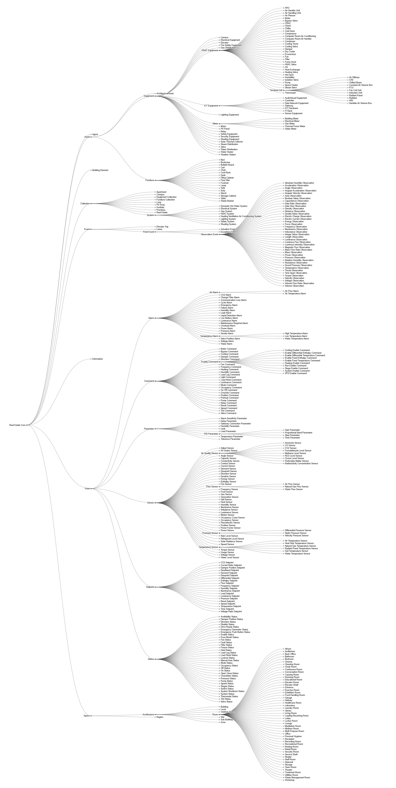
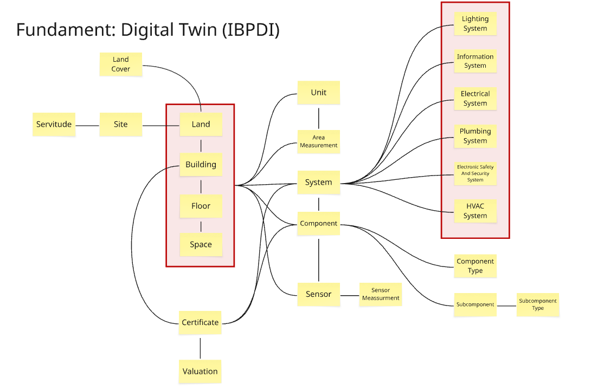
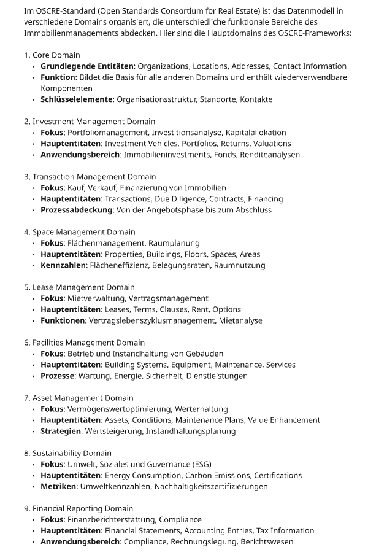

# Analyse - Übersicht Standards IMMO

Arbeitsdokument

**Inhalte:**
---

# 1. Einleitung und Zielsetzung

## 1.1. Hintergrund und Auftrag

Das Bundesamt für Bauten und Logistik (BBL) strebt im Rahmen seiner Unternehmensarchitektur die Etablierung eines ganzheitlichen fachlichen Datenmodells (eine fachliche Sicht) für das Immobilienmanagement an. Diese fachliche Sicht (Common Data Model) soll ein einheitliches Verständnis der Immobiliendaten über alle Fachbereiche und IT-Systeme hinweg sicherstellen (lösungsneutral, langlebig und stabil). Um dies zu erreichen, ist eine fundierte Kenntnis und Bewertung vorhandener "Best Practice"-Standards im Bereich des Immobilien-Datenmanagements unerlässlich. Der Fokus liegt dabei auf der "fachlichen Sicht" der Daten, die das "WAS" der Geschäftsanforderungen abbildet und langlebig sowie systemunabhängig sein soll.

Bild: Dreistufiges Metadatenmodell. [Quelle](https://confluence.bit.admin.ch/x/tiWPMg)

## 1.2. Ziel dieses Dokuments

Dieses Fachkonzept dient als erste Orientierungshilfe für die BBL Unternehmensarchitektur. Es bietet eine konsolidierte Übersicht der wichtigsten "Best Practice"-Standards im Immobilien-Datenmanagement, die als potenzielle Bausteine für ein zukünftiges Common Data Model (Fachliches Datenmodell) des BBL dienen können. Für jeden Standard wird eine Kurzbeschreibung und eine Ersteinschätzung der Relevanz für das BBL vorgenommen, um eine fundierte Grundlage für weitere Vertiefungen und strategische Entscheidungen zu schaffen. Die Standards basieren auf der initialen Liste des BBL.

# 2. Methodisches Vorgehen und Priorisierung der Standards

## 2.1. Auswahl und Bewertung der Standards

Die in diesem Dokument analysierten Standards stellen eine Übersicht von internationalen Initiativen, Arbeitsdokumenten und Empfehlungen dar. Ihre Bewertung und Priorisierung erfolgte auf Basis einer zweistufigen Bewertung:

1. **Priority (Prioritätsstufe):** Einschätzung der grundsätzlichen Bedeutung des Standards für das BBL-Immobilienmanagement
2. **BBL Relevance:** Spezifische Bewertung der Relevanz für die konkreten BBL-Geschäftsprozesse und Teilquerschnitte

Dabei wurde versucht, Standards mit direktem Bezug zur Immobilienbewirtschaftung (Betriebsphase) und Schweizer Normen besonders zu berücksichtigen, da diese den Kerngeschäftsbereich des BBL abdecken. Die Bewertung fokussiert sich auf die fachliche Datenmodellierung im Kontext der spezifischen Anforderungen des BBL, insbesondere im Hinblick auf die Etablierung eines Common Data Models für das ganzheitliche Immobilienmanagement.

## 2.2. Überarbeitetes Priorisierungsschema

Die Standards werden basierend auf einer kombinierten Bewertung aus Prioritätsstufe und Enterprise Relevance in die folgenden Kategorien eingeteilt:

- **Priorität A (Sehr hoch):** Standards, die sowohl eine hohe allgemeine Priorität als auch eine sehr hohe Enterprise Relevance aufweisen. Diese Standards sind fundamental für das Common Data Model des BBL und decken die Kerngeschäftsbereiche der Immobilienbewirtschaftung ab.
- **Priorität B (Hoch):** Standards mit hoher Relevanz für spezifische BBL-Domänen oder Teilprozesse. Sie stellen wichtige Ergänzungen zum Common Data Model dar und sind für bestimmte Anwendungsfälle von BBL von großer Bedeutung.
- **Priorität C (Mittel):** Standards, die für spezifische Aspekte oder Randbereiche relevant sind. Ihre Integration hat einen geringeren unmittelbaren Impact oder erfordert eine komplexere Anpassung an die BBL-Anforderungen.
- **Priorität D (Niedrig/Optional):** Standards mit geringer direkter Relevanz für die BBL-Kernprozesse. Sie können in speziellen Nischenbereichen relevant sein oder als Referenz dienen.

Bild: Standards - Priorisierung vs. Relevanz BBL

|  | Name | Priority | Priority Num | BBL Relevance | Begründung |
| --- | --- | --- | --- | --- | --- |
| 1 | Real Estate Core | A | 4 | 4.85 | Semantische Ontologie für Immobiliendaten mit Fokus auf Interoperabilität. Deckt Kernbereiche ab: Gebäude, Räume, Verträge, Organisationen |
| 2 | RCIS Data Standard | A | 4 | 4.35 | XML/JSON-Format für strukturierten Immobiliendatenaustausch. 100+ Entitäten für Transaktionen, Bewertung, Verwaltung |
| 3 | GEFMA | A | 4 | 4.25 | Deutsche FM-Richtlinien für Prozesse, Kennzahlen und Datenstrukturen. Umfassend für Objektbetrieb und -management |
| 4 | IBPDI | A | 4 | 4.15 | Definiert Datenpunkte für Gebäudeperformance, Energie und Nachhaltigkeit. Relevant für ESG-Reporting und Effizienz |
| 5 | Building Smart | A | 4 | 3.8 | IFC-Standard für BIM-Daten, MVD für Anwendungsfälle. Grundlage für digitale Bauwerksmodelle und FM-Übergabe |
| 6 | OSCRE | B | 3 | 3.85 | Datenmodell für kommerzielle Immobilientransaktionen und Asset Management. Fokus auf Finanz- und Portfoliomanagement |
| 7 | SAREF | B | 3 | 3.7 | ETSI-Ontologie für IoT-Geräte in Smart Buildings. Standardisiert Sensoren, Aktoren und Automatisierungssysteme |
| 8 | NIBS (COBie) | B | 3 | 3.65 | Strukturiert Asset-Informationen für Übergabe von Bauprojekt an FM. Fokus auf Wartung und Betriebsdaten |
| 9 | e-CH Standards | B | 3 | 3.6 | Schweizer Behördenstandards für GWR, Geodaten, GEVER. Rechtlich bindend für Bundesverwaltung |
| 10 | CEN | B | 3 | 3.45 | Europäische Normen für FM und Immobilienmanagement (EN 15221 Serie). Basis für nationale Standards |
| 11 | Bauen Digital Schweiz | B | 3 | 3.25 | Schweizer Datenfeldkataloge für BIM2FM-Prozesse. Angepasst an eBKP-H und NPK-Klassifikationen |
| 12 | DIN (inkl. BIM Cloud) | B | 3 | 3.15 | Deutsche Normen für Bau und BIM (DIN 276, ISO 19650). Teilweise relevant für Kostenklassifikation |
| 13 | VDI | B | 3 | 2.85 | Technische Richtlinien für Gebäudetechnik (VDI 3805, 6041). Spezialisiert auf TGA-Komponenten |
| 14 | Digitale TGA | B | 3 | 2.65 | Produktdatenstandards für TGA nach VDI 3805/ISO 16757. Fokus auf technische Spezifikationen |
| 15 | ASHRAE | B | 3 | 2.45 | HLK-Standards für Energieeffizienz und Raumklima. Ergänzend für technische Anlagenbewertung |
| 16 | RealFM | B | 3 | 2.35 | Deutsche Kennzahlen und Benchmarks für Immobilienwirtschaft. Begrenzte Schweiz-Übertragbarkeit |
| 17 | gif IDA Modell | C | 2 | 3.35 | Datenmodell für Immobilien-Portfolioanalyse im DACH-Raum. Relevant für Bewertung und Reporting |
| 18 | ÖNORM | C | 2 | 3.25 | Österreichische Normen für Bau und BIM. Ähnlich deutschen Standards, begrenzte Schweiz-Relevanz |
| 19 | CRB Kostenelement (eBKP-H) | C | 2 | 3.15 | Schweizer Baukostenplan für Kostengliederung und -controlling. Relevant für Projektkosten und FM-Budgetierung |
| 20 | BIMETA | C | 2 | 2.95 | Deutscher Verband für BIM-Implementierung und Prozesse. Praxisorientiert aber regional begrenzt |
| 21 | Project Haystack | C | 2 | 2.55 | Tag-basierte Semantik für Gebäudebetriebsdaten. Ergänzt IoT-Integration und Datenanalyse |
| 22 | gbXML | C | 2 | 2.45 | XML-Format für Gebäudeenergieanalyse. Austausch zwischen BIM und Simulationstools |
| 23 | Brick Schema | C | 2 | 2.35 | Ontologie für Gebäudeautomation und Sensornetzwerke. Komplementär zu SAREF |
| 24 | Uniclass | C | 2 | 2.05 | Britisches Klassifikationssystem für Bau und Infrastruktur. Strukturiert aber regional spezifisch |
| 25 | OmniClass | C | 2 | 1.85 | Nordamerikanisches Klassifikationssystem. Wenig Überschneidung mit Schweizer Normen |
| 26 | CAFM RING | D | 1 | 2.45 | Standards für CAFM-Systemintegration. Nischenanwendung für Software-Konnektivität |
| 27 | BIMSWARM | D | 1 | 1.95 | Cloud-Plattform für BIM-Kollaboration. Technische Lösung, wenig Standardisierung |
| 28 | NBIMS-US | D | 1 | 1.35 | US-amerikanischer BIM-Standard. Regional spezifisch, wenig internationale Relevanz |

Tabelle: Priorisierung der Standards

# 3. Übersicht der wichtigsten "Best Practice" Standards

Im Folgenden wird jeder Standard aus der ursprünglichen Liste kurz vorgestellt und seine Priorität sowie seine Bedeutung für das BBL im Kontext eines fachlichen Datenmodells erläutert.

## 3.1. Real Estate Core

- **Priorität:** A (Sehr hoch)
- **Link.** <https://www.realestatecore.io/>
- **Kurzbeschreibung:** Real Estate Core ist eine offene Datenmodell-Initiative, die ein standardisiertes, interoperables Datenmodell für die Immobilienbranche auf Basis von Linked Data und Ontologien entwickelt. Ziel ist die semantische Interoperabilität zwischen verschiedenen Systemen über den gesamten Lebenszyklus.
- **Relevanz für das BBL (fachliche Sicht):** Dieser Standard ist explizit auf ein "Common Data Model" und die semantische Interoperabilität ausgerichtet. Er kann eine robuste, technologieunabhängige Grundlage für die fachliche Datenmodellierung im BBL bieten, indem er zentrale Immobilienkonzepte (Gebäude, Grundstücke, Organisationen, Verträge, Sensoren, Räume) über Domänengrenzen hinweg einheitlich definiert.

Bild Links: Zusammenhänge mit weiteren Standards. [Quelle](https://www.realestatecore.io/)

Bild Mitte: Übersicht wichtigste Entitäten. [Quelle](https://dev.realestatecore.io/docs/structure/)

Bild Rechts: Übersicht gesamt Ontologie. [Quelle](https://observablehq.com/d/2c65b43a9be1f20c)

## 3.2. RCIS Data Standard

- **Priorität:** A (Sehr hoch)
- **Link:** <https://github.com/RICS-Data-Standard/RDS>
- **Kurzbeschreibung**: Der RICS Data Standard ist eine offene Initiative zur Schaffung einer gemeinsamen Sprache und eines einheitlichen Formats für den Austausch von Immobiliendaten, basierend auf XML und JSON. Er zielt darauf ab, die Interoperabilität zwischen Systemen zu verbessern und ein international anwendbares Modell für wirtschaftliche, rechtliche und verwaltungstechnische Aspekte von Immobilien bereitzustellen.
- **Relevanz für das BBL (fachliche Sicht)**: Der Standard ist explizit auf ein "Common Data Model" und die semantische Interoperabilität ausgerichtet. Er kann eine robuste, technologieunabhängige Grundlage für die fachliche Datenmodellierung im BBL bieten, indem er zentrale Immobilienkonzepte über Domänengrenzen hinweg einheitlich definiert.

Der vollständige RICS Data Standard enthält mehr als **100 Hauptentitäten**. Diese Zahl beinhaltet:

1. Das Hauptelement "Data Transfer" selbst
2. Alle im Dokument genannten Top-Level Elemente (etwa 30+, darunter Property, Participants, Tenure, Buildings usw.)
3. Alle Unter-Entitäten (z.B. Floor, Space, Room als Unterelemente von Building)
4. Alle gemeinsam genutzten Elementtypen (Shared Elements), die in verschiedenen Teilen des Standards wiederverwendet werden
5. Unterstützende Elementtypen für Werte, Messungen, Daten, Dokumente usw.

## 

Bild Links: Beschreibung der Bereiche. [Quelle](https://miro.com/app/board/uXjVLIX0YbY=/?share_link_id=899564476397)

Bild Mitte: Übersicht der Entitäten als ein Graph

Bild Rechts: Übersicht von Physischen Immobilienmodell als ein UML

## 

## 3.3. IBPDI (International Building Performance and Data Initiative)

- **Priorität:** A (Sehr hoch)
- **Link:** <https://github.com/ibpdi/cdm>
- **Kurzbeschreibung:** Die IBPDI ist eine Initiative zur Standardisierung von Gebäudedaten, die zur Messung und Verbesserung der Gebäudeeffizienz (Performance) über den Lebenszyklus hinweg relevant sind.
- **Relevanz für das BBL (fachliche Sicht):** IBPDI definiert Datenpunkte und Metadaten für die Erfassung von Gebäudedaten, die für Performance-Messung, Energieverbrauch, Umweltleistung und Betriebsdaten entscheidend sind. Dies ist von höchster Relevanz für die Domäne "Energie und Ressourcen" und unterstützt das BBL bei seinen Nachhaltigkeitszielen.

Bild Links: IBPDI Datendomänen. [Quelle](https://ibpdi.org/)

Bild Mitte: Status pro Datendomäne. [Quelle](https://ibpdi.org/)

Bild Rechts: Übersicht Datendomäne Digital Twin. [Quelle](https://miro.com/app/board/uXjVLIX0YbY=/?share_link_id=899564476397)

Bild Links: Beschreibung der Datendomäne Energie und Ressourcen. [Quelle](https://miro.com/app/board/uXjVLIX0YbY=/?share_link_id=899564476397)

Bild Rechts: Beschreibung der Datendomäne Finanzen. [Quelle](https://miro.com/app/board/uXjVLIX0YbY=/?share_link_id=899564476397)

## 3.4. OSCRE

- **Priorität:** A (Sehr hoch)
- **Link:** <https://www.oscre.org/Industry-Data-Model/Access-To-IDM-Toolkit>
- **Kurzbeschreibung:** Das Open Standards Consortium for Real Estate (OSCRE) ist eine globale Organisation, die offene Standards und Best Practices für den Datenaustausch und die Integration in der kommerziellen Immobilienbranche entwickelt.
- **Relevanz für das BBL (fachliche Sicht):** OSCRE-Standards definieren Datenmodelle für Immobilientransaktionen und -prozesse (z.B. Leasing, Asset Management, Finanzberichterstattung). Sie sind relevant für das "Portfolio- und Asset-Management" und das "Mietermanagement", insbesondere wenn es um die Interaktion mit externen Partnern geht.

## 3.5. Bauen Digital Schweiz (Datenfeldkataloge)

- **Priorität:** B (Hoch)
- **Link:** <https://bauen-digital.ch/aktuell/out-now-datenfeldkatalog-bim2fm/>
- **Kurzbeschreibung:** Bauen Digital Schweiz ist die zentrale Initiative in der Schweiz zur Förderung der Digitalisierung im Bauwesen. Sie entwickelt und veröffentlicht unter anderem Datenfeldkataloge und Richtlinien, die auf die spezifischen Bedürfnisse und Normen der Schweizer Baubranche zugeschnitten sind.
- **Relevanz für das BBL (fachliche Sicht):** Diese Kataloge definieren spezifische Datenfelder und deren Bedeutung, die für die digitale Bauabwicklung und den Betrieb im Schweizer Kontext relevant sind (z.B. in Bezug auf eBKP-H, NPK). Sie sind von herausragender Bedeutung für die Anpassung an Schweizer Gesetze und Normen in den Domänen "Architektur Sicht" und "Projektmanagement".

Bild Links: BIM2FM Datenfeldkatalog

Bild Mitte: Beschreibung von BIM2FM

Bild Rechts: BIM2FM Datenfeldkatalog als UML

## 3.6. GEFMA

- **Priorität:** B (Hoch)
- **Link:** <https://www.gefma.de/service/shop/>
- **Kurzbeschreibung:** Die German Facility Management Association (gefma) entwickelt Richtlinien, Standards und Kennzahlen für ein professionelles Facility Management (FM) im deutschsprachigen Raum.
- **Relevanz für das BBL (fachliche Sicht):** gefma-Richtlinien (z.B. gefma 100-1, gefma 444) sind wichtig für die fachliche Definition von FM-Prozessen, Datenstrukturen und Kennzahlen. Dies ist besonders relevant für das "Objektmanagement" und "Controlling, Analytics und Reporting". Eine Abstimmung mit Schweizer FM-Standards (ProLeMo) ist jedoch notwendig.

Bild Links: Ontologie GEFMA 924 - 000 BAUWERKSTYPEN

Bild Mitte: Ontologie GEFMA 924 - 300 BAUWERK - BAUKONSTRUKTIONEN

Bild Rechts: Ontologie GEFMA 924 - 400 BAUWERK - TECHNISCHE ANLAGEN

## 3.7 SAREF (Smart Applications REFerence ontology)

- **Priorität:** B (Hoch)
- Link: <https://saref.etsi.org/>
- **Kurzbeschreibung:** SAREF ist ein ETSI-Standard, der eine Referenz-Ontologie für Smart Applications und IoT-Geräte bereitstellt. Der Standard definiert semantische Modelle für die Interoperabilität zwischen verschiedenen IoT-Anwendungen, Geräten und Diensten in Smart Buildings und Smart Cities.
- **Relevanz für das BBL (fachliche Sicht):** SAREF definiert standardisierte Ontologien für Sensoren, Aktoren, Messungen und Geräteeigenschaften in intelligenten Gebäuden. Dies ist relevant für die semantische Integration von Gebäudeautomationssystemen und IoT-Daten in die Domänen "Energie und Ressourcen" und "Objektmanagement". SAREF ergänzt Standards wie Brick Schema und Project Haystack und bietet eine europäische Perspektive für die einheitliche Beschreibung von Smart Building-Komponenten und deren Datenströmen.

Bild Links: Übersicht SAREF Bereiche

Bild Rechts: Übersicht Entitäten im Bereich SAREF Core

## 3.7. Building Smart (IFC / MVD / IDM / BCF)

- **Priorität:** A (Sehr hoch)
- **Link:** <https://www.buildingsmart.org/standards/>
- **Kurzbeschreibung:** buildingSMART International ist eine globale Non-Profit-Organisation, die offene Standards für Building Information Modeling (BIM) entwickelt, um den Informationsaustausch und die Interoperabilität im Bau- und Betriebslebenszyklus zu verbessern. Dies umfasst IFC (Industry Foundation Classes, ein offenes Datenmodell), MVD (Model View Definitionen), IDM (Information Delivery Manuals) und BCF (BIM Collaboration Format).
- **Relevanz für das BBL (fachliche Sicht):** IFC ist der de-facto Standard für offene Bauwerksdaten und definiert fachlich, welche Objekte (Gebäude, Räume, Bauteile, Systeme) und Attribute sie haben können. MVDs und IDMs sind entscheidend, um die fachlichen Informationsbedarfe für spezifische BBL-Anwendungsfälle (z.B. Übergabe an FM) zu definieren. Building Smart ist fundamental für die "Architektur Sicht" und das "Projektmanagement". Dieser Standards deckt aber nicht Alle Datendomänen ab.

Bild Links: Open BIM Workflow. [Quelle](https://www.buildingsmart.org/clarifying-the-openbim-workflow/)

Bild Rechts: IFC Datendomänen. [Quelle](https://standards.buildingsmart.org/IFC/RELEASE/IFC4/FINAL/HTML/schema/chapter-5.htm)

Bild Links: IFC Räumliche Hierarchie (vereinfach). [Quelle](https://www.researchgate.net/figure/Tree-structure-of-the-IFC-format-Source-own-elaboration-based-on-wwwbuildbimcl_fig7_368351581)

Bild Rechts: IFC Räumliche Hierarchie (als UML)

## 3.8. e-CH Standards

- **Priorität:** B (Hoch)
- **Link:** <https://www.ech.ch/de>
- **Kurzbeschreibung:** e-CH ist der Verein eCH-0xxx Standards Schweiz und entwickelt Standards für den elektronischen Geschäftsverkehr zwischen Behörden, Unternehmen und Bürgern. Die Standards definieren einheitliche Datenformate, Schnittstellen und Prozesse für die digitale Verwaltung in der Schweiz.
- **Relevanz für das BBL (fachliche Sicht):** e-CH Standards sind für das BBL als Bundesbehörde von hoher Relevanz, da sie die rechtlichen und administrativen Grundlagen für digitale Geschäftsprozesse im öffentlichen Sektor definieren:

  - **Objektwesen (eCH-0129, eCH-0206):** Standards für Gebäude- und Wohnungsregister (GWR), Objektidentifikatoren und Adressierung - fundamental für die eindeutige Identifikation von BBL-Immobilien
  - **Geoinformation (eCH-0056, eCH-0118):** Geodatenmodelle und Koordinatenreferenzsysteme - essentiell für die räumliche Verortung und Integration mit amtlichen Vermessungsdaten
  - **Meldewesen (eCH-0011, eCH-0020):** Personendaten und Organisationsstrukturen - relevant für Mietermanagement und Nutzerverzeichnisse
  - **Records Management/GEVER (eCH-0039, eCH-0147):** Geschäftsverwaltung und Archivierung - wichtig für die langfristige Dokumentation von Immobilienprozessen und Vertragsmanagement

## 3.9. RealFM

- **Priorität:** B (Hoch)
- **Kurzbeschreibung:** RealFM ist der Bundesverband für Immobilienwirtschaft in Deutschland, der Empfehlungen und Datenblätter zu immobilienwirtschaftlichen Kennzahlen und Themen veröffentlicht.
- **Relevanz für das BBL (fachliche Sicht):** RealFM bietet Definitionen für betriebswirtschaftliche Kennzahlen und die dafür notwendigen Datenpunkte (z.B. Flächenkennzahlen, Kostenkennzahlen), die für die Steuerung von Immobilienportfolios relevant sind. Dies ist wichtig für das "Portfolio- und Asset-Management" und "Controlling, Analytics und Reporting". Die Übertragbarkeit auf den Schweizer Kontext muss geprüft werden.

## 3.10. VDI

- **Priorität:** B (Hoch)
- **Kurzbeschreibung:** Der Verein Deutscher Ingenieure (VDI) entwickelt technische Richtlinien und Normen in verschiedenen Ingenieurdisziplinen, darunter Bauwesen und Technische Gebäudeausrüstung (TGA).
- **Relevanz für das BBL (fachliche Sicht):** VDI-Richtlinien wie VDI 3805 sind entscheidend für die fachliche Abbildung von TGA-Komponenten und deren Eigenschaften. Dies ist von hoher Relevanz für die "Architektur Sicht" (Definition technischer Systeme) und das "Objektmanagement" (Betrieb und Wartung technischer Anlagen).

## 3.11. DIN (inkl. DIN BIM Cloud)

- **Priorität:** B (Hoch)
- **Kurzbeschreibung:** Das Deutsche Institut für Normung (DIN) ist die nationale Normungsorganisation Deutschlands. Es ist auch an internationalen ISO-Normen beteiligt, z.B. im BIM-Bereich (DIN EN ISO 19650). Die DIN BIM Cloud ist eine Plattform für den Austausch von BIM-relevanten Informationen.
- **Relevanz für das BBL (fachliche Sicht):** DIN-Normen wie DIN 276 (Kosten) sind für die Klassifikation von Baukosten relevant. Die Einbindung in die ISO 19650-Reihe macht sie wichtig für das Informationsmanagement im "Projektmanagement" und der "Architektur Sicht".

## 3.12. CEN

- **Priorität:** B (Hoch)
- **Kurzbeschreibung:** Das Europäische Komitee für Normung (CEN) ist eine europäische Normungsorganisation, die europäische Normen (EN) entwickelt, oft als Basis für nationale Normen (z.B. EN ISO 19650, EN 15221-Reihe).
- **Relevanz für das BBL (fachliche Sicht):** CEN-Normen sind relevant für die Harmonisierung von Definitionen im europäischen Bau- und Immobilienbereich. Sie bilden die Grundlage für viele nationale Standards und sind somit indirekt für mehrere BBL-Domänen ("Architektur Sicht", "Projektmanagement", "Objektmanagement") von Bedeutung.

## 3.13. NIBS (COBie (Construction Operations Building Information Exchange))

- **Priorität:** B (Hoch)
- **Kurzbeschreibung:** COBie ist ein von NIBS (National Institute of Building Sciences, USA) entwickeltes, offenes Datenformat für die standardisierte Übergabe von Asset-Informationen von Bauprojekten an den Gebäudebetrieb (Facility Management).
- **Relevanz für das BBL (fachliche Sicht):** COBie definiert die minimale Menge an relevanten Daten (z.B. Hersteller, Wartungsintervalle) für den effizienten Gebäudebetrieb. Es ist eine wichtige Brücke zwischen "Projektmanagement" (Informationslieferung) und "Objektmanagement" (Betriebsdaten).

## 3.14. ASHRAE

- **Priorität:** B (Hoch)
- **Kurzbeschreibung:** Die American Society of Heating, Refrigerating and Air-Conditioning Engineers (ASHRAE) ist eine internationale Organisation, die Standards und Richtlinien im Bereich HLK (Heizung, Lüftung, Klima) und Kältetechnik entwickelt.
- **Relevanz für das BBL (fachliche Sicht):** ASHRAE-Standards definieren Parameter für Energieeffizienz, Raumklima und Systemleistung von HLK-Anlagen. Dies ist wichtig für die "Energie und Ressourcen"-Domäne und das "Objektmanagement" zur Beschreibung und Bewertung von technischen Anlagen.

## 3.15. Digitale TGA Produktdaten nach VDI 3805 / ISO 16757

- **Priorität:** B (Hoch)
- **Kurzbeschreibung:** Dies umfasst die VDI 3805-Richtlinien für Produktdaten der Technischen Gebäudeausrüstung (TGA) und die ISO 16757 für die elektronische Darstellung von Baustoff- und Produktdaten.
- **Relevanz für das BBL (fachliche Sicht):** Diese Standards definieren fachlich, welche Eigenschaften von TGA-Produkten digital beschrieben werden müssen (z.B. Leistung, Energieeffizienz). Sie sind entscheidend für die "Architektur Sicht" (Definition technischer Komponenten) und das "Objektmanagement" (Wartung und Ersatzteilmanagement).

## 3.16. BIMETA

- **Priorität:** C (Mittel)
- **Kurzbeschreibung:** BIMETA ist ein Verband, der sich mit der Standardisierung und Implementierung von BIM-Prozessen und Datenaustauschformaten im deutschsprachigen Raum befasst.
- **Relevanz für das BBL (fachliche Sicht):** BIMETA konzentriert sich auf die praxisorientierte Anwendung von BIM-Standards und die Definition von Anforderungen an den Datenaustausch. Dies betrifft die fachliche Spezifikation von Informationsbedarfen im "Projektmanagement" und der "Architektur Sicht".

## 3.17. ÖNORM

- **Priorität:** C (Mittel)
- **Kurzbeschreibung:** Austrian Standards International (ÖNORM) ist die nationale Normungsorganisation Österreichs und entwickelt Normen im Bauwesen und BIM (z.B. ÖNORM A 6241 zum Datenaustausch).
- **Relevanz für das BBL (fachliche Sicht):** ÖNORM-Standards bieten Klassifikationssysteme und Datenstrukturen für Bauwerksdaten, die für die fachliche Beschreibung von Immobilien relevant sind. Sie können eine Referenz für die "Architektur Sicht" und das "Projektmanagement" sein, erfordern jedoch eine Anpassung an den Schweizer Kontext.

## 3.18. gbXML

- **Priorität:** C (Mittel)
- **Kurzbeschreibung:** green building XML (gbXML) ist ein offenes XML-Schema, das den Austausch von Gebäudemodellen und deren Eigenschaften für energiebezogene Analysen ermöglicht.
- **Relevanz für das BBL (fachliche Sicht):** gbXML definiert die fachlich relevanten geometrischen und physikalischen Eigenschaften für Energieberechnungen. Dies ist spezifisch für die Domäne "Energie und Ressourcen" und kann zur Integration von BIM-Modellen in Energieanalyse-Tools genutzt werden.

## 3.19. OmniClass

- **Priorität:** C (Mittel)
- **Kurzbeschreibung:** OmniClass ist ein umfassendes nordamerikanisches Klassifikationssystem für die Bauindustrie, das sich auf alle Aspekte des Bau- und Immobilienlebenszyklus erstreckt, mit Tabellen für Bauteile, Funktionen, Phasen und Materialien.
- **Relevanz für das BBL (fachliche Sicht):** OmniClass bietet eine konsistente Möglichkeit zur Kategorisierung von Informationen über Projekte, Produkte und Ressourcen. Es kann für die Klassifikation in der "Architektur Sicht" und im "Projektmanagement" dienen, wobei die Kompatibilität mit Schweizer Klassifikationssystemen zu prüfen ist.

## 3.20. Brick Schema

- **Priorität:** C (Mittel)
- **Kurzbeschreibung:** Brick Schema ist ein offenes, standardisiertes Datenmodell für die Beschreibung von Gebäuden und ihren Anlagen (Gebäudeautomation, Sensoren, Aktoren) auf Ontologie-Basis.
- **Relevanz für das BBL (fachliche Sicht):** Brick Schema definiert die fachlichen Beziehungen und Typen von Geräten und Messpunkten in intelligenten Gebäuden. Dies ist relevant für die semantische Beschreibung von Betriebsdaten in "Energie und Ressourcen" und "Objektmanagement".

## 3.21. Project Haystack

- **Priorität:** C (Mittel)
- **Kurzbeschreibung:** Project Haystack ist eine Open-Source-Initiative zur Standardisierung von Semantik für Daten aus Gebäudeautomations- und Energiesystemen mittels "Tags".
- **Relevanz für das BBL (fachliche Sicht):** Haystack definiert standardisierte "Tags" zur fachlichen Beschreibung der Bedeutung und des Kontexts von Betriebsdaten. Es ergänzt Brick Schema und ist für die "Energie und Ressourcen"-Domäne von Interesse.

## 3.22. gif IDA Modell

- **Priorität:** C (Mittel)
- **Link:** <https://www.zgif.org/de/>
- **Kurzbeschreibung:** Das gif IDA Modell ist ein Modell zur Standardisierung von Immobiliendaten, primär für Portfolioanalysen und Bewertungen im DACH-Raum.
- **Relevanz für das BBL (fachliche Sicht):** Das IDA Modell definiert eine Baumstruktur von Datenfeldern für Immobilienobjekte, die für die Bewertung und das Reporting von Portfolios relevant sind. Es ist relevant für das "Portfolio- und Asset-Management" und "Finanzen", wobei die Übertragbarkeit auf Schweizer Rechnungslegungsnormen zu prüfen ist.

Bild Links: Vorgesehener Anwendungsfall für das IDA Modell

Bild Mitte: Übersicht der Entitäten

Bild Rechts: IDA Subsets (Domänen für Attribute)

## 3.23. CAFM RING (CAFM Connect, BIM Profile)

- **Priorität:** C (Mittel)
- **Kurzbeschreibung:** Der CAFM RING ist eine Interessengemeinschaft, die mit CAFM Connect und dem BIM Profile den Datenaustausch zwischen CAFM-Systemen und BIM-Modellen standardisiert.
- **Relevanz für das BBL (fachliche Sicht):** CAFM Connect definiert Datenstrukturen für den Import und Export von Informationen in CAFM-Systeme, insbesondere für die Nutzung von BIM-Informationen im "Objektmanagement".

## 3.24. BIMSWARM

- **Priorität:** D (Niedrig/Optional)
- **Kurzbeschreibung:** BIMSWARM ist eine offene, herstellerunabhängige Cloud-Plattform für die Zusammenarbeit und den Datenaustausch im Bauwesen, die auf einem Ökosystem von BIM-Anwendungen basiert.
- **Relevanz für das BBL (fachliche Sicht):** Als Plattform definiert BIMSWARM implizit Anforderungen an die Datenstruktur und Semantik. Es ist eher eine technische Plattform als ein fachlicher Standard im engeren Sinne, kann aber zukünftig für kollaborative Prozesse im "Projektmanagement" relevant werden.

## 3.25. NBIMS-US und NCS

- **Priorität:** D (Niedrig/Optional)
- **Kurzbeschreibung:** NBIMS-US (National Building Information Modeling Standard – United States) ist ein umfassender Standard für BIM in den USA. NCS (National CAD Standard) ist ein amerikanischer Standard für die Organisation von CAD-Dateien.
- **Relevanz für das BBL (fachliche Sicht):** Diese Standards bieten umfassende Richtlinien für BIM und CAD-Daten, sind jedoch stark auf den US-amerikanischen Markt zugeschnitten. Ihre direkte Relevanz für das BBL ist aufgrund des starken Schweizer und europäischen Normenbezugs geringer, sie können aber als Referenz für bestimmte Konzepte dienen.

# 4. Fazit und nächste Schritte

## 4.1. Zusammenfassung der wichtigsten Erkenntnisse

Die Analyse zeigt eine Vielzahl von "Best Practice"-Standards, die für die Entwicklung eines fachlichen Datenmodells im BBL relevant sind. Insbesondere Standards wie Building Smart (IFC, MVD, IDM), Real Estate Core, IBPDI und Bauen Digital Schweiz (Datenfeldkataloge) stechen aufgrund ihrer übergreifenden Natur, ihres Fokus auf Interoperabilität oder ihrer spezifischen Relevanz für den Schweizer Kontext hervor (Priorität A). Andere Standards ergänzen diese für spezifische Domänen wie Facility Management (gefma, VDI, COBie), Energieeffizienz (ASHRAE, gbXML) oder Finanzmanagement (OSCRE, gif IDA).

## 4.2. Empfehlungen für die BBL Unternehmensarchitektur

1. **Vertiefte Analyse der Priorität A Standards:** Es wird empfohlen, Building Smart (IFC, MVD, IDM), Real Estate Core, IBPDI und Bauen Digital Schweiz (Datenfeldkataloge) prioritär und detaillierter zu untersuchen. Diese bilden voraussichtlich die Kernbausteine für das fachliche Common Data Model des BBL.
2. **Harmonisierung mit Schweizer Standards:** Eine konsequente Ausrichtung an bestehenden Schweizer Gesetzen (ZGB, VGWR, FHG) und Normen (SIA, KBOB, eCH-Standards, SNBS, GEAK) ist unerlässlich und sollte bei der Integration internationaler Standards stets beachtet werden.
3. **Domänenspezifische Integration:** Für jede der definierten BBL-Domänengruppen sollten die hier identifizierten Standards im Detail geprüft und die passenden Definitionen in das fachliche Datenmodell überführt werden. Der Fokus liegt dabei auf der Übernahme der "fachlichen" Konzepte und nicht auf der technischen Implementierung.
4. **Einbindung von Fachexperten:** Die weitere Ausgestaltung des Datenmodells sollte in enger Zusammenarbeit mit den in den Domänengruppen definierten Fachexperten des BBL erfolgen, um die Praxistauglichkeit und Akzeptanz sicherzustellen.
5. **Pilotprojekte in "schlecht definierten" Domänen:** Insbesondere für Domänen wie "Objektmanagement" und "Workspace Management", die als weniger gut definiert wahrgenommen werden, könnten Pilotprojekte zur Erprobung und Anpassung relevanter Standards sinnvoll sein.

## 4.3. Nächste Schritte

- Detaillierte Analyse der als "Priorität A" eingestuften Standards mit Fokus auf konkrete Datenobjekte und Attribute.
- Erstellung eines initialen fachlichen Begriffsverzeichnisses des BBL auf Basis der relevantesten Standarddefinitionen.
- Mapping der BBL-internen Geschäftsobjekte und Prozesse auf die identifizierten Standarddefinitionen.

# 5. Glossar

- Definition wichtiger Fachbegriffe.

# 6. Literaturverzeichnis und Quellen

- Auflistung aller verwendeten Quellen.
