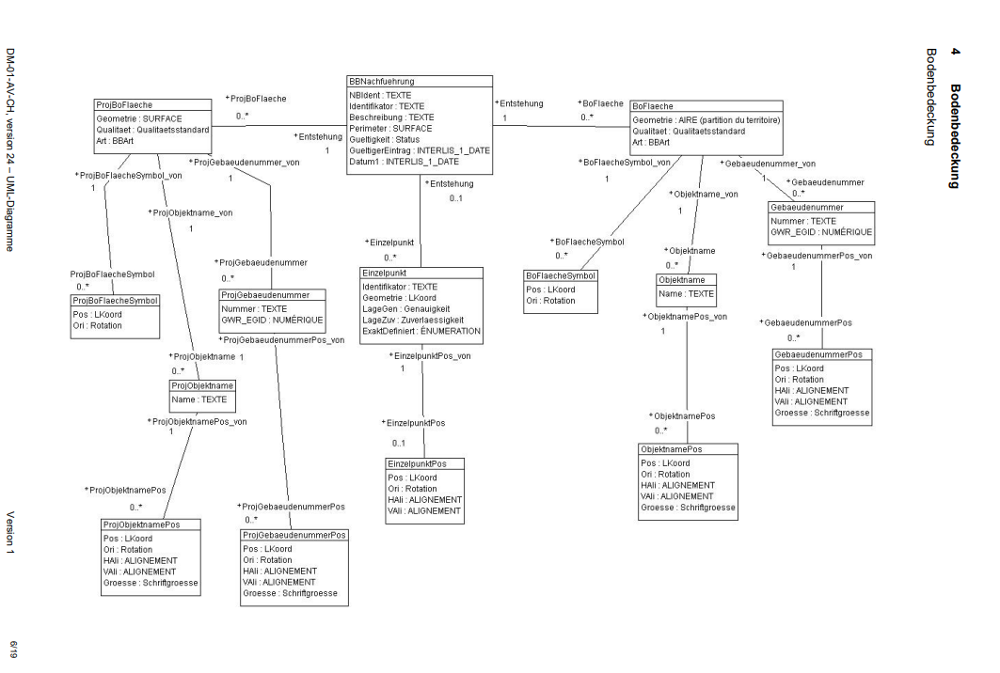
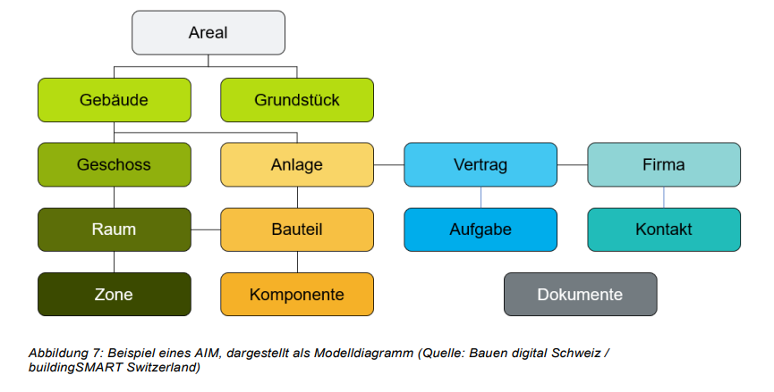
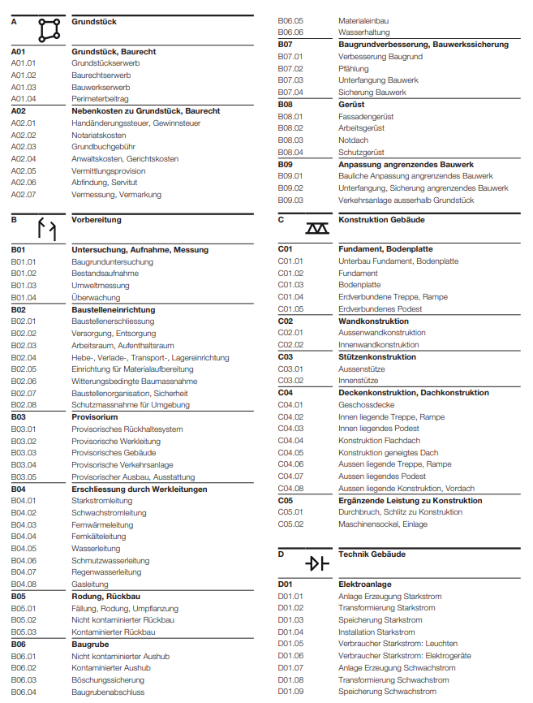

# Detailstudie - Architektonische Sicht🟢

**Arbeitsdokument**

- Inhalte werden als PDFs im Anhang versioniert (nur Meilensteine)
- Zugang zum Dokument ist auf Mitarbeiter der Bundesverwaltung eingeschränkt (open by default)
- Inhalte können mit Abstimmung [Rasner David BBL](https://confluence.bbl.admin.ch/display/~U80865084) extern geteilt werden

**Inhalt:**

- [1. Ziel dieses Dokuments](#DetailstudieArchitektonischeSicht🟢-1.ZieldiesesDokuments)
- [2. Die Architektonische Sicht – Aufgaben und Bedeutung](#DetailstudieArchitektonischeSicht🟢-2.DieArchitektonischeSicht–AufgabenundBedeutung)
- [3. Empfehlung Geschäftsobjekte (Konsolidiert)](#DetailstudieArchitektonischeSicht🟢-3.EmpfehlungGeschäftsobjekte(Konsolidiert))
- [4. Übersicht der relevanten Standards](#DetailstudieArchitektonischeSicht🟢-4.ÜbersichtderrelevantenStandards)
- [5. Wichtigste Standards im Detail (schrittweise Ergänzung)](#DetailstudieArchitektonischeSicht🟢-5.WichtigsteStandardsimDetail(schrittweiseErgänzung))
  - [5.1. Schweizerisches Zivilgesetzbuch (ZGB), Art. 655-712](#DetailstudieArchitektonischeSicht🟢-5.1.SchweizerischesZivilgesetzbuch(ZGB),Art.655-712)
  - [5.2. Grundbuchverordnung (GBV)](#DetailstudieArchitektonischeSicht🟢-5.2.Grundbuchverordnung(GBV))
  - [5.3. Verordnung über das Gebäude- und Wohnungsregister (VGWR)](#DetailstudieArchitektonischeSicht🟢-5.3.VerordnungüberdasGebäude-undWohnungsregister(VGWR))
  - [5.4. DM.01-AV-CH Datenmodell der amtlichen Vermessung](#DetailstudieArchitektonischeSicht🟢-5.4.DM.01-AV-CHDatenmodellderamtlichenVermessung)
  - [5.5. eCH-0129 Objektwesen](#DetailstudieArchitektonischeSicht🟢-5.5.eCH-0129Objektwesen)
  - [5.6. eCH-0153 eGRISDM (Grundbuch)](#DetailstudieArchitektonischeSicht🟢-5.6.eCH-0153eGRISDM(Grundbuch))
  - [5.7. Bauen Digital Schweiz (Datenfeldkataloge)](#DetailstudieArchitektonischeSicht🟢-5.7.BauenDigitalSchweiz(Datenfeldkataloge))
  - [5.8. Building Smart (IFC / ISO 16739)](#DetailstudieArchitektonischeSicht🟢-5.8.BuildingSmart(IFC/ISO16739))
  - [5.9. IBPDI (International Building Performance and Data Initiative)](#DetailstudieArchitektonischeSicht🟢-5.9.IBPDI(InternationalBuildingPerformanceandDataInitiative))
  - [5.10. Real Estate Core (REC)](#DetailstudieArchitektonischeSicht🟢-5.10.RealEstateCore(REC))
  - [5.11. SIA 416 (Flächen und Volumen von Gebäuden)](#DetailstudieArchitektonischeSicht🟢-5.11.SIA416(FlächenundVolumenvonGebäuden))
  - [5.12. CRB eBKP-H (Elementbasierter Baukostenplan Hochbau)](#DetailstudieArchitektonischeSicht🟢-5.12.CRBeBKP-H(ElementbasierterBaukostenplanHochbau))
  - [5.X BIMids](#DetailstudieArchitektonischeSicht🟢-5.XBIMids)
- [6. Verweise und Anhang](#DetailstudieArchitektonischeSicht🟢-6.VerweiseundAnhang)

---

# 1. Ziel dieses Dokuments

Dieses Fachkonzept legt die Grundlagen für ein einheitliches Verständnis und die Modellierung von Daten im Bundesamt für Bauten und Logistik (BBL) fest. Es dient als verbindliches Referenzwerk, um sicherzustellen, dass alle Fachbereiche und IT-Systeme mit denselben Konzepten und Definitionen arbeiten können.

Die Kernziele dieses Dokuments sind:

1. **Definition zentraler Geschäftsobjekte:** Klare und konsistente Definition der domänenspezifischen Geschäftsobjekte und deren Attribute, unabhängig von spezifischen IT-Systemen.
2. **Standardkonformität:** Sicherstellung, dass die Datenmodellierung den anerkannten nationalen und internationalen Gesetzesvorgaben und Best-Practice-Standards folgt.
3. **Interoperabilität:** Schaffung einer Basis für den nahtlosen Austausch und die Integration von Daten über verschiedene Systeme und Prozesse hinweg.
4. **Langfristige Datenqualität:** Beitrag zur Sicherung der Qualität und Konsistenz der Daten, um die Abhängigkeit von einzelnen IT-Systemen zu reduzieren und eine langfristige Nutzbarkeit zu gewährleisten.
5. **Brücke zwischen Fach und IT:** Bereitstellung eines Referenzwerks, das als gemeinsame Sprache zwischen fachlichen Anforderungen und deren technischer Umsetzung dient.
6. **Fundament für strategische Entscheidungen:** Schaffung einer faktenbasierten Grundlage für strategische Entscheidungen, operative Steuerung und Compliance-Management.

# 2. Die Architektonische Sicht – Aufgaben und Bedeutung

### 2.1. Rolle im Immobilienmanagement

Die Architektonische Sicht bildet das **Fundament des fachlichen Datenmodells** für das Immobilienmanagement im BBL. Sie repräsentiert die physische, räumliche und rechtliche Realität von Immobilien und schafft die unverzichtbare Referenzbasis für alle nachgelagerten Prozess Domänen (Mietermanagement, Objektmanagement, Energiemanagement, Projektmanagement, etc.).

## 

Bild: Vorschlag Domänengruppen IMMO

### 2.2. Inhaltliche Dimensionen

Die Architektonische Sicht umfasst vier zentrale Dimensionen:

- **Physische Struktur**: Grundstücke, Gebäude, Geschosse, Räume, Gebäudetechnische Anlagen und Komponenten in hierarchischer Gliederung.
- **Rechtliche Verhältnisse**: Eigentum, Baurechte, Stockwerkeigentum, öffentlich-rechtliche Eigentumsbeschränkungen (ÖREB) gemäss schweizerischem Recht.
- **Performance und Qualität**: Flächenkennzahlen (SIA 416), energetische Eigenschaften, Zertifikate (MINERGIE, BREEAM), technische Leistungsparameter und Zustandsbewertungen.
- **Lebenszyklus**: Bauphasen, Bewilligungen, Wartungszyklen und Änderungsmanagement.

### 2.3. Kernaufgaben

- **Standardisierte Strukturierung**: Einheitliche Objekthierarchien mit eindeutigen Identifikatoren (EGID, EGRID, EDID) gemäss schweizerischen Standards.
- **Integration und Interoperabilität**: Harmonisierung verschiedener Datenquellen, standardkonforme Schnittstellen zu externen Systemen (GWR, ÖREB) und medienbruchfreier Datenaustausch.
- **Qualitätssicherung**: Datenqualitätsstandards, Konsistenzprüfungen, Historisierung und rollenbasierte Zugriffskontrolle.
- **Digital Twin Fundament**: Strukturelles Rückgrat für digitale Zwillinge mit geometrischer Repräsentation, semantischen Verknüpfungen und echtzeitfähigen Datenstrukturen.

### 2.4. Strategische Bedeutung

- Die Architektonische Sicht gewährleistet Rechtssicherheit und Compliance durch rechtskonforme Datenhaltung und eindeutige Objektidentifikation. Sie schafft eine langfristige, technologieunabhängige Datenbasis, die skalierbar und interoperabel mit der schweizerischen E-Government-Landschaft ist.
- Als zentrale Domäne ermöglicht sie die nahtlose Integration aller Immobilienprozesse über den gesamten Lebenszyklus und bildet die Grundlage für zukünftige Technologien wie IoT, KI und Advanced Analytics.
- Die konkrete Umsetzung erfolgt durch die Geschäftsobjekte in Kapitel 3 und die detaillierten Standards in Kapitel 5.

# 3. Empfehlung Geschäftsobjekte (Konsolidiert)

**Bedeutung der Prioritätsstufen:**

- **Muss**: Geschäftsobjekte, die für die fachliche Vollständigkeit der Architektonischen Sicht zwingend erforderlich sind. Diese Objekte bilden das Kerngerüst des Datenmodells und sind für die grundlegenden Geschäftsprozesse im Immobilienmanagement unabdingbar.
- **Soll**: Geschäftsobjekte, die das fachliche Datenmodell um wichtige Aspekte erweitern und die praktische Anwendbarkeit erheblich steigern. Sie sind nicht kritisch für die Grundfunktionalität, aber wichtig für eine vollständige fachliche Abbildung der Immobilienwelt.
- **Kann**: Geschäftsobjekte, die zusätzlichen fachlichen Mehrwert bieten und erweiterte Anwendungsfälle ermöglichen. Sie erweitern das Datenmodell um spezialisierte Bereiche, sind aber nicht für die Kerngeschäftsprozesse erforderlich.
- **Wird nicht**: Geschäftsobjekte, die bewusst nicht in der Architektonischen Sicht modelliert werden, entweder weil sie durch andere Objekte fachlich abgedeckt sind oder weil sie fachlich in anderen Domänen zugeordnet sind.

|  | Gruppe / Geschäftsobjekt | Priorität | Beschreibung | Primäre Identifikatoren | Relevante Standards | Kommentar |
| --- | --- | --- | --- | --- | --- | --- |
| 1 | **Räumliche Objekte** |  |  |  |  |  |
| 2 | Standort | Kann | Geografische Gruppierung mehrerer Grundstücke und Gebäude für Verwaltungszwecke | Standort-ID | IFC (IfcSite), IBPDI (Site) | Bildet Areale oder ein Campus |
| 3 | Grundstück | Muss | Räumlich abgrenzbare Bodeneinheit mit eigenständigen Eigentumsrechten | EGRID / Grundstück-ID | ZGB, GBV, eCH-0129, eGRISDM | Rechtliche Grundlage, global |
| 4 | Bodenabdeckung | Soll | Versiegelte und unversiegelte Flächen gemäss amtlicher Vermessung | EGID für Art = Gebäude, sonst nur technische IDs (GUID) | DM.01-AV-CH, eGRISDM | Für Umgebungsflächenmanagement |
| 5 | Gebäude | Muss | Mit dem Boden fest verbundenes Bauwerk mit eindeutiger Identifikation | EGID / Gebäude-ID | VGWR, eCH-0129, IFC, IBPDI | Zentrale Verwaltungseinheit, global |
| 6 | Geschoss | Muss | Horizontale Gliederungsebene innerhalb eines Gebäudes | Geschoss-Nr | VGWR, IFC, SIA 416 | Für Flächenmanagement, bildet ein CAFM Basisplan |
| 7 | Raum | Soll | Funktional definierter Bereich innerhalb eines Geschosses | Raum-Nr | IFC, IBPDI, SIA 416 | Detaillierteste Verwaltungseinheit |
| 8 | Fläche / Bemessung | Muss | 2D Darstellung von Räumlichen Objekten. |  |  |  |
| 9 | Gebäudeeingang | Soll | Physischer Zugang zu einem Gebäude | EDID | VGWR, eCH-0129 | Für Adressierung und Zugang |
| 10 | Zone | Soll | Funktionale oder technische Bereiche (Brandabschnitte, Klimazonen) | Zone-ID | Bauen Digital CH, IFC | Für spezialisierte Anwendungen |
| 11 | Nutzungseinheit | Soll | Bauliche Einheit mit eigenem Zugang (Wohnung, Gewerbe, sonstige Nutzung) | EWID / Einheit-ID | VGWR, eCH-0129 | Erweitert Wohnung um alle Nutzungsarten |
| 12 | Wohnung | Wird nicht | Bauliche Einheit mit eigenem Zugang (bei Wohnimmobilien) | EWID | VGWR, eCH-0129 | Durch "Einheit (Nutzungseinheit)" abgedeckt |
| 13 | Parkplatz | Soll | Stellfläche für Fahrzeuge, Velos, oder Sonstiges, mit eindeutiger ID | Parkplatz-ID | - | Werden in Reservierungssystemen genutzt |
| 14 | **Rechtliche Objekte** |  |  |  |  |  |
| 15 | Person | Wird nicht | Natürliche oder juristische Person mit Bezug zu Immobilien | EGBPID, AHV-Nr / Person-ID | ZGB, GBV, eCH-0129, eGRISDM | Eigene Domäne "Organisatorische Daten" |
| 16 | Eigentumsrecht | Soll | Rechtliche Zuordnung von Eigentum an Grundstücken/Gebäuden | EREID | ZGB, eGRISDM | Rechtliche Grundlage |
| 17 | Baurecht | Kann | Selbständiges und dauerndes Recht auf fremdem Grundstück | EREID | ZGB, eGRISDM | Für komplexe Rechtsverhältnisse |
| 18 | Dienstbarkeit | Kann | Beschränkung des Eigentums zugunsten eines berechtigten Grundstücks | EREID | ZGB, eGRISDM | Für Zugangs- und Leitungsrechte |
| 19 | **Technische Objekte** |  |  |  |  |  |
| 20 | System | Kann | Funktionale Gruppierung technischer Anlagen (HLK, Elektro, Sanitär) | System-ID | IFC, IBPDI | Nicht nur für TGA-Management, Systeme können auch Fassaden, Tragwerke sein |
| 21 | Technische Anlage | Muss | HLK Gebäudetechnische Anlage (Heizung, Klima, Lüftung) | Anlage-ID | SIA, GEFMA | Ist ein Typ von System (Ausprägung) |
| 22 | Heizungsanlage | Soll | Wärmeerzeugung, -verteilung und -abgabe | Heizung-ID | IFC, IBPDI, REC, Brick Schema, eBKP-H (D05) | Spezialisierung von System. Zentral für Wärmeversorgung |
| 23 | Lüftungsanlage | Soll | Luftaufbereitung, -verteilung und Luftwechsel | Lüftung-ID | IFC, IBPDI, REC, Brick Schema, ASHRAE, eBKP-H (D07) | Spezialisierung von System. Wichtig für Luftqualität |
| 24 | Kälteanlage | Soll | Kälteerzeugung, -verteilung und Klimatisierung | Kälte-ID | IFC, IBPDI, REC, Brick Schema, ASHRAE, eBKP-H (D06) | Spezialisierung von System. Kühlung und Klimatisierung |
| 25 | Elektroanlage | Soll | Elektrische Versorgungssysteme inkl. Stark- und Schwachstrom | Elektro-ID | IFC, IBPDI, REC, Brick Schema, eBKP-H (D01) | Spezialisierung von System. Kritisch für Gebäudebetrieb |
| 26 | Beleuchtungsanlage | Soll | Beleuchtungssysteme inkl. Steuerung und Notbeleuchtung | Beleuchtung-ID | IFC, IBPDI, REC, Brick Schema, DALI | Spezialisierung von System. Energieeffizienz und Komfort |
| 27 | Sanitäranlage | Soll | Wasser- und Abwassersysteme inkl. aller sanitären Installationen | Sanitär-ID | IFC, IBPDI, REC, eBKP-H (D08/D09) | Spezialisierung von System. Grundversorgung |
| 28 | Aufzugsanlage | Soll | Vertikale Beförderungsanlagen (Aufzüge, Fahrtreppen) | Aufzug-ID | IFC, IBPDI, REC, eBKP-H (D12) | Spezialisierung von System. Wichtig für Barrierefreiheit |
| 29 | Brandschutzanlage | Soll | Technische Brandschutzeinrichtungen (Sprinkler, Brandmelder, RWA) | Brandschutz-ID | IFC, IBPDI, REC, eBKP-H (D04), VKF | Spezialisierung von System. Sicherheitskritisch |
| 30 | Sicherheitsanlage | Soll | Einbruch-, Zutritts- und Überwachungssysteme | Sicherheit-ID | IFC, IBPDI, REC, eBKP-H (D03) | Spezialisierung von System. Schutz von Personen und Sachwerten |
| 31 | Kommunikationsanlage | Soll | IT-Netzwerke, Telefonie, Datenübertragung | Komm-ID | IFC, IBPDI, REC, Brick Schema | Spezialisierung von System. Digitale Infrastruktur |
| 32 | Gebäudeautomation | Soll | Mess-, Steuer- und Regelungssysteme für Gebäudetechnik | GA-ID | IFC, IBPDI, REC, Brick Schema, BACnet, eBKP-H (D02) | Spezialisierung von System. Basis für Smart Building |
| 33 | Energieerzeugungsanlage | Soll | Photovoltaik, BHKW, Wärmepumpen zur Eigenproduktion | Energie-ID | IFC, IBPDI, REC, Brick Schema | Spezialisierung von System. Nachhaltigkeit und Autarkie |
| 34 | Komponente | Muss | Einzelne technische Bauteile und Geräte | Komponenten-ID | IFC, IBPDI, Bauen Digital CH | Für Wartung und Betrieb |
| 35 | Sensor | Soll | IoT-Geräte zur Performance-Überwachung | Sensor-ID | IBPDI | Für IoT und Smart Building |
| 36 | **Konstruktive Objekte** |  |  |  |  |  |
| 37 | Bauteil | Soll | Physische Bauteile der Gebäudestruktur | Bauteil-ID | IFC, Bauen Digital CH | Übergeordnete Klasse für alle konstruktiven Elemente |
| 38 | Bauteiltyp | Soll | Standardisierte Typendefinition für Bauteile | Typ-ID | IFC (IfcBuildingElementType), Bauen Digital CH | Ermöglicht Wiederverwendung von Standards |
| 39 | Wand | Soll | Vertikale raumabschliessende oder tragende Konstruktion | Bauteil-ID | IFC (IfcWall), eBKP-H (C2/E/G1), SIA 416 | Spezialisierung von Bauteil. Tragend/Nichttragend, Aussen/Innen |
| 40 | Decke/Bodenplatte | Soll | Horizontale tragende Konstruktion | Bauteil-ID | IFC (IfcSlab), eBKP-H (C3), SIA 260 | Spezialisierung von Bauteil. Inkl. Bodenplatten |
| 41 | Dach | Soll | Oberer Gebäudeabschluss mit Witterungsschutz | Bauteil-ID | IFC (IfcRoof), eBKP-H (F), SIA 232 | Spezialisierung von Bauteil. Flach-/Steildach |
| 42 | Stütze | Soll | Vertikales Tragelement | Bauteil-ID | IFC (IfcColumn), eBKP-H (C2.2) | Spezialisierung von Bauteil |
| 43 | Träger/Balken | Soll | Horizontales Tragelement | Bauteil-ID | IFC (IfcBeam), eBKP-H (C2.3) | Spezialisierung von Bauteil |
| 44 | Fundament | Soll | Gründungskonstruktion des Gebäudes | Bauteil-ID | IFC (IfcFooting), eBKP-H (C1), SIA 267 | Spezialisierung von Bauteil. Basis des Tragwerks |
| 45 | Treppe | Soll | Vertikale Erschliessung zwischen Geschossen | Bauteil-ID | IFC (IfcStair), eBKP-H (G4), SIA 500 | Spezialisierung von Bauteil. Sicherheitsrelevant |
| 46 | Tür | Soll | Bewegliches Element für Raumzugang | Bauteil-ID | IFC (IfcDoor), eBKP-H (G2.1), SIA 343 | Spezialisierung von Bauteil. Inkl. Brandschutztüren |
| 47 | Fenster | Soll | Öffnung in Aussenwand für Belichtung/Lüftung | Bauteil-ID | IFC (IfcWindow), eBKP-H (E3), SIA 331 | Spezialisierung von Bauteil. Energierelevant |
| 48 | Fassade | Soll | Aussenhaut des Gebäudes | Bauteil-ID | IFC (IfcCurtainWall), eBKP-H (E), SIA 243 | Spezialisierung von Bauteil. Vorhangfassade oder massive Fassade |
| 49 | **Bauprodukte und Materialien** |  |  |  |  |  |
| 50 | Bauprodukt | Muss | Vorgefertigtes oder katalogisiertes Produkt für den Einbau | Produkt-ID | IFC (IfcProduct), NPK, CRB | Basis für Produktkataloge und Beschaffung |
| 51 | Material | Soll | Werkstoff mit physikalischen und ökologischen Eigenschaften | Material-ID | IFC (IfcMaterial), KBOB, Minergie-ECO | Zentral für Nachhaltigkeit und Bauphysik |
| 52 | Materialschicht | Kann | Einzelne Schicht in einem Schichtaufbau | Schicht-ID | IFC (IfcMaterialLayer), SIA 180 | Für bauphysikalische Berechnungen |
| 53 | Schichtaufbau | Kann | Mehrschichtiger Materialverbund eines Bauteils | Aufbau-ID | IFC (IfcMaterialLayerSet), SIA 279 | U-Wert, Schallschutz, Brandschutz |
| 54 | **Übergreifend** |  |  |  |  |  |
| 55 | Adresse | Muss | Strukturierte Adressinformationen für Grundstücke, Gebäude und Eingänge | Adresse-ID | eCH-0010, VGWR, DM.01-AV-CH | In Domäne "Organisatorische Daten" verschoben |
| 56 | Koordinaten | Soll | Geografische Koordinaten für räumliche Objekte | Koordinaten-ID | DM.01-AV-CH, LV95, IBPDI | In Domäne "Organisatorische Daten" verschoben |
| 57 | Zertifikat | Soll | Zertifikate für Gebäude, Anlagen, Bauprodukte | Zertifikat-ID | IBPDI, Bauen Digital CH | Für alle Objekte relevant (MINERGIE, CE, etc.) |
| 58 | Dokument | Wird nicht | Pläne, Gutachten, Bewilligungen, Verträge | Dokument-ID | Bauen Digital CH | Eigene Domäne "Dokumentenmanagement" |
| 59 | **Messungen/Performance** |  |  |  |  |  |
| 60 | Bemessung | Muss | Flächen, Volumen, Längen, Stückzahlen nach SIA 416 | Bemessung-ID | SIA 416, IBPDI | Flexibel für alle Messgrössen |
| 61 | Sensormessung | Soll | Zeitreihen-Messwerte von IoT-Sensoren | Messung-ID | IBPDI | Für Performance-Monitoring |
| 62 | Performance-Kennzahl | Wird nicht | Aggregierte KPIs für Energie, Kosten, Nachhaltigkeit | KPI-ID | IBPDI | Eigene Domäne "Reporting und Analytics" |
| 63 | **Projektbezogen** |  |  |  |  |  |
| 64 | Bauprojekt | Wird nicht | Bewilligungspflichtiges Bauvorhaben mit Lebenszyklus-Tracking | EPROID | VGWR, eCH-0129, eCH-0130 | Eigene Domäne "Projektmanagement" |

Tabelle: Empfehlung Geschäftsobjekte (Konsolidiert)

Bild: Vereinfachte Darstellung. [Quelle](https://miro.com/app/board/uXjVLIX0YbY=/?share_link_id=899019639281)

Bild Links: Flowchart Darstellung von Geschäftsobjekten (konsolidiert). [Quelle](https://www.mermaidchart.com/app/projects/5ddada0a-47f7-43e6-87eb-a297e604e809/diagrams/1d91ffc4-5320-465a-bf40-ceb3ebc4fa40/version/v0.1/edit)

# 4. Übersicht der relevanten Standards

### 4.1 Bewertungskriterien für «Relevanz für BBL»

- **Sehr hoch**: Rechtlich oder regulatorisch verpflichtend; grundlegende Voraussetzung für Kernprozesse und -systeme; verbindliche interne Vorgabe; oder unmittelbar umsetzbarer, priorisierter Use Case mit hohem Nutzen.
- **Hoch**: Branchenweit anerkannte Praxis in der Schweiz; wesentlich für Rechtssicherheit, Compliance oder Interoperabilität; wichtig für robuste Integration in bestehende Prozess- und Datenflüsse.
- **Mittel**: Ergänzend oder domänenspezifisch; nützlich für Spezialfälle, Pilotierungen oder als Referenz; optional ohne unmittelbaren Umsetzungsdruck.
- **Niedrig**: Informativ; geringe direkte Anwendbarkeit im Betrieb; Beobachten/Monitoring ausreichend.

### 4.2 Strategische Einordnung (Kategorie Standards)

Die Standards und Use Cases lassen sich in folgende strategische Kategorien einordnen:

- **Rechtliche Grundlagen**: Rechtlich bindende Vorgaben auf Bundes- oder Verordnungsebene; definieren Mindestanforderungen und Rahmenbedingungen.
- **BBL Weisungen und Prozesse**: Interne, verbindliche Standards und Prozessmodelle; legen organisatorische Zuständigkeiten, Abläufe und Qualitätsvorgaben fest.
- **BBL Fachanwendungen**: Operative IT-Systeme und Register für fachliche Leistungen und Verwaltungsaufgaben; stellen Funktionen und Schnittstellen für die Datenintegration bereit.
- **Technische Standards**: Normen und Integrationsstandards (z. B. Datenmodelle, Schnittstellen, Qualitäts- und Leistungskataloge), die Austauschformate und Qualitätsstufen definieren.
- **Externe Beispiele**: Verifizierte Praxisbeispiele und Best-Practice-Implementierungen als Referenz für erfolgreiche Umsetzungen und innovative Ansätze.

### 4.3. Übersicht als Tabelle

|  | Kategorie / Name des Standards | Zweck (Kurz) | Relevanz für BBL | Anwendung BBL | Schnittstellen | Status |
| --- | --- | --- | --- | --- | --- | --- |
| 1 | **Rechtliche Grundlagen** |  |  |  |  |  |
| 2 | Schweizerisches Zivilgesetzbuch (ZGB), Art. 655-712 | Definiert Sachenrecht für Grundeigentum | Sehr hoch - Rechtlich zwingend | Basis für alle Immobilientransaktionen | GBV, kant. Baugesetze | Aktiv |
| 3 | Grundbuchverordnung (GBV) | Regelt Organisation des Grundbuchs | Sehr hoch - Verfahrensvorschrift | Standardisierte Dokumentation | ZGB, eGRISDM | Aktiv |
| 4 | Verordnung über das Gebäude- und Wohnungsregister (VGWR) | Nationales Gebäuderegister | Sehr hoch - Registrierungspflicht | EGID-Vergabe, Meldepflichten | BBL Stammdaten | Aktiv |
| 5 | Raumplanungsgesetz (RPG) SR 700 | Raumordnung und Bauzonen | Hoch - Relevant | Alle Gebäude und Bauprojekte | RPV, kant. Baugesetze | Aktiv |
| 6 | Raumplanungsverordnung (RPV) SR 700.1 | Konkretisiert RPG | Hoch - Relevant | Zonenkonformität, Bauzonen | RPG, kant. Verordnungen | Aktiv |
| 7 | **BBL Governance und Weisungen** |  |  |  |  |  |
| 8 | Weisungen CAD-Daten (Bau 281d) | Standardisierte Erfassung und Verwaltung digitaler Pläne | Sehr hoch - Standard für Plandaten | Einheitliche CAD-Datenstruktur, Planarchivierung | SAP RE-FX, GIS IMMO, Planverwaltungstool | Aktiv |
| 9 | Weisungen CAFM (Bau 282d) | Datenstandards für Computer Aided Facility Management | Sehr hoch - Bewirtschaftungsdaten | Strukturierte FM-Datenerfassung, Schnittstelle Planung-Betrieb | SAP PM, InterWatt, Wüest Dimensions | Aktiv |
| 10 | Vorgaben BIM | spezifische Building Information Modeling Standards | Sehr hoch - Digitalisierungsstrategie | BIM-Anforderungen für Projekte, LOD-Definitionen | IFC, Planverwaltungstool, SAP RE-FX | Aktiv |
| 11 | Weisungen Projekt- und Bewirtschaftungsakten (Bau 211d) | Standardisierte Objektdokumentation über Lebenszyklus | Sehr hoch - Dokumentationsgrundlage | Aktenstruktur, Übergabeprozesse, Archivierung | Aktenmanagement, SAP RE-FX | Aktiv |
| 12 | Weisungen pbFM (Bau 212d) | Projekt- und baubegleitendes Facility Management | Sehr hoch - Lifecycle-Integration | FM-Einbezug ab Planungsphase, Datenqualität | SAP PM, CAFM, Projektmanagement | Aktiv |
| 13 | KBOB-Richtlinien Nutzungszeiten | Standardisierte Lebenszyklen von Gebäuden und Bauteilen | Hoch - Portfolioplanung | Komponenten-Lebensdauer, Erneuerungszyklen | Wüest Dimensions, SAP PM | Aktiv |
| 14 | KBOB-Empfehlungen Nachhaltigkeit | Nachhaltigkeitsstandards für Bundesbauten | Hoch - Nachhaltigkeitsziele | Ökologische Anforderungen, Materialvorgaben | SNBS, Minergie, GEAK | Aktiv |
| 15 | **Fachanwendungen BBL Bauten / Bund** |  |  |  |  |  |
| 16 | SAP RE-FX (Real Estate Flexible) | Kaufmännische Immobilienverwaltung | Sehr hoch - Kernsystem BBL | Stammdatenverwaltung, Mietmanagement | Alle Systeme | Aktiv |
| 17 | SAP PM (Plant Maintenance) | Instandhaltungsmanagement | Sehr hoch - TGA-Management | Störungsmeldungen, Wartung | SAP RE-FX, Mieterportal | Aktiv |
| 18 | BBL GIS IMMO (ESRI ArcGIS) | Geografisches Informationssystem | Mittel - GIS-Integration | Räumliche Visualisierung | SAP RE-FX, AV | Aktiv |
| 19 | InterWatt EDM | Energiedatenmanagement | Sehr hoch - Energiemonitoring | Zählerstrukturen, Verbrauch | SAP PM, IoT-Sensoren | Aktiv |
| 20 | Wüest Dimensions EHP | Erhaltungsplanung | Mittel | Langfristige Instandhaltung | SAP RE-FX, PM | Aktiv |
| 21 | BFS Gebäude- und Wohnungsstatistik | Nationale Gebäudeklassifikation | Sehr hoch - Gesetzliche Pflicht | Portfolioberichterstattung | GWR, AV | Aktiv |
| 22 | **Technische Standards** |  |  |  |  |  |
| 23 | DM.01-AV-CH Datenmodell | Bundesmodell für Vermessungsdaten | Sehr hoch - Geodatengrundlage | Eigentumsverifizierung, Bauplanung | INTERLIS, WMS | Migration |
| 24 | eCH-0129 Objektwesen | Basisstandard Objektverwaltung | Sehr hoch - E-Gov Grundlage | Behördenkommunikation | Alle eCH-Domänen | Aktiv |
| 25 | eCH-0153 eGRISDM (Grundbuch) | Datenmodell elektronisches Grundbuch | Sehr hoch - EGRID-Standard | E-GRID, Terravis-Integration | EGRIS, kant. Systeme | Aktiv |
| 26 | Building Smart (IFC) ISO 16739 | Offener BIM-Datenaustausch | Sehr hoch - BIM-Strategie | Lebenszyklusmanagement | eBKP-H, KBOB | Aktiv |
| 27 | Real Estate Core (REC) | Ontologie für Smart Buildings | Hoch - Digital Twin Potenzial | IoT-Integration, Gebäudeautomation | Brick Schema, Azure DT | Aktiv |
| 28 | **Technische Standards - Fachspezifische Standards für Teilbereiche** |  |  |  |  |  |
| 29 | VDI Richtlinien (z.B. VDI 3805) | Produktdatenaustausch TGA | Mitte - TGA-Standardisierung, VDI weniger relevant | HLK-Planung, Wartung | BIM, Herstellerkataloge | Aktiv |
| 30 | MINERGIE/BREEAM/LEED | Nachhaltigkeitszertifizierungen | Hoch - Minergie CH | Energieeffizienz, Zertifizierung | SNBS, MuKEn | Aktiv |
| 31 | SNBS Standard Nachhaltiges Bauen | Umfassender CH-Nachhaltigkeitsstandard | Sehr hoch - Bundesnachhaltigkeit | 35 Kriterien, Zertifizierung | Energiestrategie 2050 | Aktiv |
| 32 | **Technische Standards - Klassifikationen & Referenzen** |  |  |  |  |  |
| 33 | SIA 416 | Schweizer Flächen-/Volumenstandard | Sehr hoch - Primärstandard CH | Arbeitsplatzdichte, Kostenallokation | SIA d0165, Bewertung | Aktiv |
| 34 | GEFMA 924 | Gebäudeklassifikation nach Nutzungsarten für FM | Sehr hoch - FM-Standard DACH | Portfoliostrukturierung, FM-Benchmarking | GEFMA 100, CRB OAG | Aktiv |
| 35 | SIA 102 | Leistungsmodell und Gebäudenutzungen | Sehr hoch - CH-Standard | Planungsgrundlage, Nutzungskategorien | SIA 416, SIA 112 | Aktiv |
| 36 | SIA 2040 | Effizienzpfad - Gebäudekategorien nach Nutzung | Hoch - Energiestandard | Nachhaltigkeitsziele, 2000-Watt-Gesellschaft | SIA 380, SIA 2024 | Aktiv |
| 37 | SIA 380/1 | Gebäudenutzungen für Energieberechnungen | Sehr hoch - Energienachweise | Energiebedarfsberechnung nach Nutzungstyp | MuKEn, GEAK | Aktiv |
| 38 | GEFMA 122 | Flächenarten im Facility Management | Hoch - Flächenklassifikation | Ergänzt SIA 416 für FM-Zwecke | DIN 277, SIA 416 | Aktiv |
| 39 | DIN 277:2021 | Deutsche Norm für Grundflächen und Rauminhalte | Hoch - Referenz für Flächenvergleiche | Benchmarking mit deutschen Behördenimmobilien | DIN 276, GEFMA 122 | Aktiv |
| 40 | RICS Code of Measuring Practice | UK-Standard für Flächenmessung (6. Edition) | Mittel - Internationale Referenz | Bei UK-Projekten oder internationalen Investoren | IPMS, GEA/NIA | Aktiv |
| 41 | IPMS Office | Spezifische IPMS für Bürogebäude | Hoch - Büroflächenstandard | Standardisierte Büroflächenberechnung | IPMS, BOMA | Aktiv |
| 42 | IPMS Residential | Spezifische IPMS für Wohngebäude | Mittel - Wohnflächenstandard | Internationale Wohnflächenvergleiche | IPMS, DIN 277 | Aktiv |
| 43 | BOMA Office Standard | Nordamerikanischer Büroflächenstandard | Mittel - US-Referenz | Bei US-Kooperationen oder Benchmarking | ANSI/BOMA Z65.1 | Aktiv |
| 44 | ISO 9836 | Internationale Norm für Flächenberechnung | Mittel - ISO-Referenz | Basis für nationale Standards | DIN 277, SIA 416 | Aktiv |
| 45 | CRB Objektarten-Gliederung OAG | Systematische Objektklassifikation | Sehr hoch - Portfoliostrukturierung | Benchmarking 2'600 Bundesbauten | eBKP-H, SIA 416 | Aktiv |
| 46 | eBKP-H Baukostenplan Hochbau | Elementbasierte Kostenplanung | Sehr hoch - KBOB-Pflichtstandard | Kostenplanung/-kontrolle | NPK, BIM, KBOB | Aktiv |
| 47 | Uniformat II | US-Elementklassifikation für Gebäudeelemente und -systeme | Mittel - Referenz für internationale Projekte | Bei Projekten mit US-Bezug oder internationalen Partnern | Masterformat, Omniclass | Aktiv |
| 48 | DIN 276 | Deutsche Kostengliederung für Bauprojekte | Hoch - Wichtig für grenznahe Projekte | Kostenvergleiche mit deutschen Projekten, Benchmarking | DIN 277 (Flächen), GAEB | Aktiv |
| 49 | Omniclass | Umfassendes nordamerikanisches Klassifikationssystem | Mittel - Internationale Referenz | Bei internationalen Ausschreibungen | Uniformat, Masterformat, IFC | Aktiv |
| 50 | Uniclass 2015 | UK-Klassifikationssystem für alle Bauphasen | Mittel - EU-Referenz | Projekte mit UK-Partnern, BIM Level 2 | IFC, COBie, NBS | Aktiv |
| 51 | Masterformat | Nordamerikanischer Standard für Bauspezifikationen | Mittel - Spezifikationsreferenz | Internationale Ausschreibungen | Uniformat II, Omniclass | Aktiv |
| 52 | CoClass | Schwedisches digitales Klassifikationssystem | Mittel - Nordeuropa-Referenz | Skandinavische Kooperationen | IFC, buildingSMART | Aktiv |
| 53 | NS 3451 | Norwegischer Tabellenstandard (Byggsøk) | Mittel - DACH-Alternative | Vergleich mit nordischen Standards | IFC, Statsbygg | Aktiv |
| 54 | CCS (Cuneco) | Dänisches Klassifikationssystem | Mittel - Digital Twin Referenz | Digitalisierungsprojekte | IFC, bSDD | Entwicklung |
| 55 | NL-SfB | Niederländisches Klassifikationssystem | Niedrig - Legacy System | Historische Referenz | Wird durch NL/SfB 2005 ersetzt | Auslaufend |
| 56 | ETIM | Europäisches Technisches Informationsmodell für Produkte | Hoch - Produktdaten | Technische Produktbeschaffung, E-Procurement | BMEcat, GS1 | Aktiv |
| 57 | GS1 BIM | Globale Standards für Produktidentifikation im Bauwesen | Hoch - Supply Chain | Asset Tracking, Wartung | GTIN, GLN, IFC | Entwicklung |
| 58 | **Externe Beispiel und Sontiges** |  |  |  |  |  |
| 59 | Bauen Digital Schweiz | Schweizer BIM-Methodik | Hoch - Referenz, wird aber nicht weiterentwickelt | BIMcert, Use Cases, LOIN | KBOB, SIA, CRB | Aktiv |
| 60 | IBPDI (International Building Performance & Data Initiative) | Globaler Immobiliendatenstandard für Performance-Messung | Hoch - Digital Twin Potenzial | Dekarbonisierung, Benchmarking | CRREM, MS CDM | Entwicklung |
| 61 | BIMids | Standardisierte BIM-Identifikatoren für Bauteile | Hoch - BIM-Standardisierung (Dänemark) | Eindeutige Bauteil-IDs, Klassifikation | IFC, eBKP-H, NPK | Pilotierung |
| 62 | SBB Fachdomänenmodell | Datenmodell für Immobilienverwaltung der SBB | Hoch - Best Practice Referenz | Vergleichbare Ausgangslage als Bundesbetrieb | SAP, BIM, FM-Systeme | Aktiv |
| 63 | Stadt Zürich BIM/IMMO Standards | BIM- und Immobilienstandards der Stadt Zürich | Hoch - Best Practice öffentliche Hand | Vergleichbare Anforderungen für öffentliche Bauten | ArchiCAD, Revit, IFC | Aktiv |
| 64 | DPBB Universität Wuppertal | Forschungsprojekte zu digitalem Planen, Bauen und Betreiben | Mittel - Wissenschaftliche Referenz | Innovative Ansätze, Forschungserkenntnisse | Akademische Forschung | Forschung |
| 65 | buildingSMART Data Dictionary (bSDD) | Zentrale Datenbank für Bau-Klassifikationen und Eigenschaften | Hoch - Semantische Interoperabilität | Mapping zwischen verschiedenen Standards (eBKP-H, NPK, IFC) | IFC, nationale Standards, API | Aktiv |
| 66 | buildingSMART Use-Case Management | Framework für standardisierte BIM Use Cases | Mittel - Methodische Referenz | Prozessstandardisierung (mit Vorsicht zu nutzen) | IDM, MVD | Aktiv |

Tabelle: Übersicht der relevanten Standards

# 5. Wichtigste Standards im Detail (schrittweise Ergänzung)

Zur einheitlichen Klassifizierung der Begriffe und Standards werden folgende Kategorien verwendet:

- **Fachanwendung**: Operatives IT-System, Register oder Plattform mit definiertem Zweck, Datenhoheit und Schnittstellen.
- **Geschäftsprozess**: Strukturierte Abfolge von Aktivitäten zur Erreichung eines klar definierten fachlichen Ziels, inkl. Rollen und Ergebnissen.
- **Geschäftsobjekt**: Fachlich abgegrenzte Entität mit eindeutiger Identität über ihren Lebenszyklus (z. B. Identifikator, Zustände).
- **Geschäftsobjekttyp**: Spezialisierung oder Ausprägung eines Geschäftsobjekts mit zusätzlichen Merkmalen oder Regeln.
- **Dokument**: Informationsträger zur Dokumentation, Kommunikation oder Nachweisführung, analog oder digital, mit Metadaten.
- **Attribut**: Eigenschaft oder Merkmal eines Geschäftsobjekts, fachlich definiert und typisiert.
- **Fachbegriff**: Begriff, Definition oder Klassifikation mit fachlicher Bedeutung ohne eigene Objektidentität.
- **Relation**: Fachlich begründete Beziehung zwischen Geschäftsobjekten (z. B. Zugehörigkeit, Referenz, Abhängigkeit), inklusive Kardinalitäten und Regeln.

## 5.1. Schweizerisches Zivilgesetzbuch (ZGB), Art. 655-712

- **Priorität**: A (Sehr hoch)
- **Gesetzliche Grundlage:** <https://www.fedlex.admin.ch/eli/cc/24/233_245_233/de>
- **Beschreibung**: Das Schweizerische Zivilgesetzbuch bildet die fundamentale Rechtsgrundlage für alle Eigentums- und Immobilienrechte in der Schweiz. Die Artikel 655-712 regeln spezifisch das Grundeigentum, definieren verschiedene Eigentumsformen und legen die rechtlichen Rahmenbedingungen für Immobilientransaktionen fest.
- **Relevanz für BBL**: Als Bundesbehörde muss das BBL alle Immobiliendaten rechtskonform strukturieren. Das ZGB definiert die rechtlichen Grundkategorien, die in der Architektonischen Sicht abgebildet werden müssen: Grundeigentum, Stockwerkeigentum, Baurechte und weitere dingliche Rechte.

|  | Begriff | Kategorie | Beschreibung | Relevanz BBL |
| --- | --- | --- | --- | --- |
| 1 | Grundstück | Geschäftsobjekt | Räumlich abgrenzbare Bodeneinheit mit eigenständigen Eigentumsrechten (Art. 655 ZGB). Kann bebaut oder unbebaut sein. | Sehr hoch - Grundlegende Entität für alle Immobilien. Basis für Flächenmanagement und rechtliche Zuordnung. |
| 2 | Gebäude | Geschäftsobjekt | Bauwerk, das fest mit dem Boden verbunden ist und als Bestandteil des Grundeigentums gilt (Art. 667 ZGB). | Sehr hoch - Zentrale bauliche Einheit für Immobilienmanagement. Objekt für FM, Bewertung und Nutzung. |
| 3 | Eigentümer | Geschäftsobjekt | Natürliche oder juristische Person mit Eigentumsrechten an einem Grundstück (Art. 655 ZGB). | Sehr hoch - Rechtliche Zuordnung von Immobilien. Basis für Verträge und Bewirtschaftung. |
| 4 | Stockwerkeigentum | Geschäftsobjekt | Besondere Form des Miteigentums mit ausschliesslichen Nutzungsrechten an bestimmten Räumen (Art. 712a-712t ZGB). | Hoch - Relevant für gemischte Immobiliennutzung und Eigentumsverhältnisse in Liegenschaften. |
| 5 | Baurecht | Geschäftsobjekt | Dingliches Recht, auf oder unter der Bodenfläche eines fremden Grundstücks ein Bauwerk zu errichten oder zu unterhalten (Art. 779-779l ZGB). | Hoch - Wichtig für komplexe Eigentumsverhältnisse und langfristige Nutzungsverträge bei Projekten. |
| 6 | Grundeigentum | Fachbegriff | Rechtsinstitut, das dem Eigentümer die Befugnis gibt, über eine Sache nach seinem Belieben zu verfügen (Art. 641, 655 ZGB). | Sehr hoch - Fundamentales Rechtskonzept für alle Immobilienrechte und -transaktionen. |
| 7 | Miteigentum | Fachbegriff | Form des Eigentums, bei der mehreren Personen eine Sache ungeteilt zusteht (Art. 646 ZGB). | Hoch - Relevant für gemeinsame Immobiliennutzung und Verwaltungsgemeinschaften. |
| 8 | Gesamteigentum | Fachbegriff | Eigentumsform bei Personengemeinschaften, wo allen Beteiligten die Sache ungeteilt zusteht (Art. 652 ZGB). | Mittel - Spezifische Eigentumsform für bestimmte Kooperationsprojekte. |
| 9 | Dienstbarkeit | Fachbegriff | Beschränkung des Eigentums zugunsten eines berechtigten Grundstücks oder einer bestimmten Person (Art. 730-792 ZGB). | Hoch - Wichtig für Zugangsrechte, Leitungsrechte und Nutzungsbeschränkungen bei Immobilien. |
| 10 | Grundlast | Fachbegriff | Dingliches Recht auf wiederkehrende Leistungen aus einem Grundstück (Art. 782-792 ZGB). | Mittel - Relevant für spezielle Finanzierungsmodelle und langfristige Verpflichtungen. |
| 11 | Grundpfand | Fachbegriff | Pfandrecht an Grundstücken zur Sicherung von Forderungen (Art. 793-883 ZGB). | Hoch - Wichtig für Finanzierung, Sicherheiten und Kreditmanagement bei Immobilien. |
| 12 | Eigentumsverhältnis | Attribut | Rechtliche Zuordnung und Art des Eigentums an einem Grundstück oder Gebäude. | Sehr hoch - Zentrale Information für rechtskonforme Datenhaltung und Verwaltung. |
| 13 | Anteilsquote | Attribut | Numerischer Wert zur Bestimmung des Eigentumsanteils bei Miteigentum oder Stockwerkeigentum. | Hoch - Notwendig für Kostenzuteilung und Nutzungsrechte bei geteilten Immobilien. |
| 14 | Verfügungsberechtigung | Attribut | Rechtliche Befugnis, über ein Grundstück oder Gebäude zu verfügen (veräussern, belasten, nutzen). | Sehr hoch - Grundlage für alle Geschäftsentscheidungen bezüglich Immobilien. |
| 15 | Nutzungsrecht | Attribut | Berechtigung zur Nutzung eines Grundstücks oder Gebäudes, auch ohne Eigentumsrecht. | Hoch - Relevant für Miet-, Pacht- und Nutzungsverträge in Immobilien. |
| 16 | Belastungsgrenze | Attribut | Maximaler Wert, bis zu dem ein Grundstück mit Grundpfandrechten belastet werden kann. | Mittel - Wichtig für Finanzplanung und Risikobewertung bei Immobilien. |
| 17 | Grundbucheintrag | Attribut | Amtliche Registrierung von Eigentumsrechten, Belastungen und Beschränkungen. | Sehr hoch - Rechtliche Basis für eindeutige Identifikation und Rechtssicherheit. |

Tabelle: Begriffe Schweizerisches Zivilgesetzbuch

## 5.2. Grundbuchverordnung (GBV)

- **Priorität**: A (Sehr hoch)
- **Gesetzliche Grundlage:** <https://www.fedlex.admin.ch/eli/oc/2021/918/de>
- **Fachanwendung**: <https://www.cadastre.ch/de/oereb-kataster>
- **Beschreibung**: Die Grundbuchverordnung konkretisiert die praktische Führung des Grundbuchs und definiert die administrativen Prozesse für die Registrierung von Grundstücken, Gebäuden und dinglichen Rechten. Sie legt die Standards für die amtliche Dokumentation von Eigentumsverhältnissen fest.
- **Relevanz für BBL**: Die GBV definiert die offiziellen Identifikationssysteme und Datenstrukturen, die für die eindeutige Referenzierung von Immobilien unerlässlich sind. Sie gewährleistet die Rechtskonformität der Datenmodellierung und die Kompatibilität mit behördlichen Systemen.

|  | Begriff | Kategorie | Beschreibung | Relevanz BBL |
| --- | --- | --- | --- | --- |
| 1 | Hauptbuch | Fachanwendung | Zentrales Register des Grundbuchs, das alle rechtswirksamen Einträge zu Grundstücken, Eigentümern und Rechten enthält (informatisiert oder Papier). | Sehr hoch - Primäre Datenquelle für alle rechtlichen Informationen zu Immobilien. Basis für Eigentumsprüfung und Rechtssicherheit. |
| 2 | Personenidentifikationsregister | Geschäftsobjekt | Register des informatisierten Grundbuchs zur Zuordnung von AHV-Nummern zu natürlichen Personen mit Grundstücksrechten (Art. 23a GBV). | Sehr hoch - Ermöglicht eindeutige Personenidentifikation für Vertragspartner und Eigentümer. Basis für automatisierten Datenaustausch. |
| 3 | Grundbuchamt | Geschäftsobjekt | Kantonale Behörde, die für die Führung des Grundbuchs und die Registrierung von Rechtsgeschäften zuständig ist. | Hoch - Zentraler Partner für alle grundbuchrelevanten Geschäfte und Rechtsänderungen. |
| 4 | Grundstücksuchdienst | Geschäftsobjekt | Vom EGBA betriebener elektronischer Dienst für landesweite Suche nach Grundstücksrechten berechtigter Behörden (Art. 34b GBV). | Hoch - Ermöglicht BBL als Bundesbehörde die schweizweite Suche nach Immobilienrechten für behördliche Aufgaben. |
| 5 | Tagebuch | Geschäftsobjekt | Chronologisches Register aller Anmeldungen und Bearbeitungsschritte im Grundbuch. | Mittel - Relevant für Nachverfolgung von Transaktionen und Rechtssicherheit bei laufenden Verfahren. |
| 6 | Hilfsregister | Geschäftsobjekt | Ergänzende Register zur systematischen Erfassung von Personen-, Gläubiger- und anderen Hilfsdaten (Art. 13 GBV). | Mittel - Unterstützende Datenstrukturen für effiziente Verwaltung von Immobiliendaten. |
| 7 | Informatisiertes Grundbuch | Fachbegriff | Elektronische Form der Grundbuchführung mit digitalen Registern und automatisierten Prozessen. | Sehr hoch - Moderne Grundlage für digitale Integration der Immobilienverwaltung und E-Government-Prozesse. |
| 8 | Rechtswirksame Daten | Fachbegriff | Amtlich registrierte und rechtlich verbindliche Informationen im Hauptbuch (Art. 34c GBV). | Sehr hoch - Definiert die rechtliche Qualität der Daten, auf die sich Entscheidungen stützen können. |
| 9 | Landesweite Grundstücksuche | Fachbegriff | Elektronisches Verfahren für berechtigte Behörden zum Auffinden von Grundstücksrechten in der ganzen Schweiz (Art. 34a GBV). | Hoch - Strategisches Instrument für BBL zur schweizweiten Immobilienanalyse und behördlichen Aufgabenerfüllung. |
| 10 | Pseudonymisierte Form | Fachbegriff | Datenschutzkonforme Verschleierung von Personendaten, die Treffer-Erkennung ohne vollständigen Personenbezug ermöglicht (Art. 34b GBV). | Hoch - Wichtig für datenschutzkonforme Nutzung von Grundbuchdaten durch BBL bei systematischen Abfragen. |
| 11 | Berechtigte Behörden | Fachbegriff | Bund, Kantone und Gemeinden, die zur Erfüllung gesetzlicher Aufgaben Zugang zum Grundstücksuchdienst benötigen (Art. 34a GBV). | Sehr hoch - BBL als Bundesbehörde gehört zu diesem Kreis und kann dadurch schweizweite Immobilienabfragen durchführen. |
| 12 | Zugriffsberechtigung | Fachbegriff | Formelle Berechtigung von Behördenmitarbeitern für den Zugang zum Grundstücksuchdienst nach begründetem Gesuch (Art. 34d GBV). | Hoch - Reguliert den kontrollierten Zugang der Mitarbeiter zu schweizweiten Grundbuchdaten. |
| 13 | AHV-Nummer | Attribut | Eindeutige Personenkennung, die im Personenidentifikationsregister den Grundbuchpersonen zugeordnet wird (Art. 23a GBV). | Sehr hoch - Ermöglicht eindeutige Identifikation von Vertragspartnern und automatisierte Datenverknüpfung zwischen Behördensystemen. |
| 14 | Status der Zuordnung | Attribut | Kennzeichnung des Bearbeitungsstands der AHV-Nummern-Zuordnung (erfolgreich, ausstehend, nicht möglich) (Art. 23a GBV). | Hoch - Wichtig für BBL zur Bewertung der Datenqualität und Vollständigkeit bei Personenidentifikation. |
| 15 | Grundstücksbezeichnung | Attribut | Amtliche Kennzeichnung und Beschreibung von Grundstücken im Hauptbuch (Art. 34e GBV). | Sehr hoch - Eindeutige Referenzierung aller Grundstücke für Verwaltung und Rechtsgeschäfte. |
| 16 | Rechtsbeschreibung | Attribut | Kategorisierung der Art des Rechts (Eigentum, Dienstbarkeit, Grundlast, Grundpfandrecht, vorgemerktes Recht) (Art. 34e GBV). | Sehr hoch - Zentral für die rechtliche Einordnung und Bewertung der Immobilienrechte. |
| 17 | Suchkriterien | Attribut | Zulässige Parameter für die Abfrage des Grundstücksuchdienstes (Personalien nach Art. 90 ZGB, AHV-Nummer) (Art. 34e GBV). | Hoch - Definiert die technischen Möglichkeiten für Recherchen im schweizweiten Grundbuchbestand. |
| 18 | Protokollierung | Attribut | Automatische Aufzeichnung aller Abfragen mit Behörde, Mitarbeiter, Suchkriterien, Zeitpunkt und Resultaten (Art. 34f GBV). | Hoch - Gewährleistet Nachvollziehbarkeit und Rechtmässigkeit der Grundbuchnutzung. Compliance-relevant. |
| 19 | Gebührenbetrag | Attribut | Jährliche Kosten für die Nutzung des Grundstücksuchdienstes, berechnet nach Anzahl Abfragen (max. 2 CHF/Abfrage) (Art. 34i GBV). | Mittel - Budgetrelevant für BBL bei intensiver Nutzung der landesweiten Grundstücksuche. |
| 20 | Technische Referenz | Attribut | Eindeutige IT-Identifikatoren für Verknüpfungen zwischen Hauptbuch, Hilfsregistern und Datenquellen (Art. 23a GBV). | Hoch - Technische Basis für die Integration der IT-Systeme mit dem Grundbuchsystem. |
| 21 | Bewilligungspflicht | Attribut | Erforderliche EGBA-Genehmigung für die Nutzung von Schnittstellen zum Grundstücksuchdienst (Art. 34b GBV). | Hoch - Regulatorische Voraussetzung für automatisierte Systeme bei der Grundbuchanbindung. |
| 22 | Aufbewahrungsfristen | Attribut | Zweijährige Speicherung der Protokolle für Zugriffskontrolle und Gebührenerhebung (Art. 34f GBV). | Mittel - Relevant für Compliance und Nachweis rechtmässiger Grundbuchnutzung. |

Tabelle: Begriffe Grundbuchverordnung

## 5.3. Verordnung über das Gebäude- und Wohnungsregister (VGWR)

- **Priorität**: A (Sehr hoch)
- **Gesetzliche Grundlage:** <https://www.fedlex.admin.ch/eli/cc/2017/376/de>
- **Fachanwendung:** <https://www.housing-stat.ch/>
- **Beschreibung**: Die VGWR regelt die schweizweit einheitliche Erfassung, Identifikation und Verwaltung von Gebäuden und Wohnungen. Sie definiert die amtlichen Identifikatoren EGID (Eidgenössischer Gebäudeidentifikator) und EWID (Eidgenössischer Wohnungsidentifikator) sowie die erforderlichen Attribute.
- **Relevanz für BBL**: Das GWR ist die zentrale Referenzdatenbank für alle Gebäude in der Schweiz. Für das BBL ist die VGWR-konforme Datenstruktur unerlässlich für die Integration mit anderen Behördensystemen und die rechtskonforme Führung der Gebäudedaten.

|  | Begriff | Kategorie | Beschreibung | Relevanz BBL |
| --- | --- | --- | --- | --- |
| 1 | Eidgenössisches Gebäude- und Wohnungsregister (GWR) | Fachanwendung | Nationales Informationssystem für alle Gebäude und Wohnungen der Schweiz, geführt vom BFS für Statistik-, Forschungs- und Planungszwecke sowie gesetzliche Aufgaben. | Sehr hoch - Zentrale Referenzdatenbank für alle Immobilien. Grundlage für eindeutige Identifikation und Integration mit anderen Behördensystemen. |
| 2 | Gebäude | Geschäftsobjekt | Bauwerke aller Art (seit 2017: Vollregister für alle Gebäude, nicht nur Wohnbauten) mit schweizweit eindeutiger EGID-Identifikation. | Sehr hoch - Kernentität der Immobilienverwaltung. Jedes Gebäude muss im GWR erfasst und mit EGID identifiziert sein. |
| 3 | Wohnung | Geschäftsobjekt | Gesamtheit der Räume, die eine bauliche Einheit bilden und einen eigenen Zugang haben, mit eindeutiger EWID-Identifikation. | Sehr hoch - Grundeinheit für Mietermanagement und Flächenverwaltung bei Wohnimmobilien. |
| 4 | Bauprojekt | Geschäftsobjekt | Objekt, für das ein Baubewilligungsgesuch nach RPG erforderlich ist, mit strukturierter Nachführung im GWR von der Bewilligung bis zum Abschluss. | Sehr hoch - Zentral für Projektmanagement und -controlling. Ermöglicht Tracking von Bauvorhaben über gesamten Lebenszyklus. |
| 5 | Gebäudeeingang | Geschäftsobjekt | Physischer Zugang zu einem Gebäude mit eindeutiger EDID-Identifikation, an den Wohnungen zwingend gebunden sind. | Hoch - Relevant für Adressierung, Zugangsverwaltung und logistische Prozesse bei Immobilien. |
| 6 | Kantonale GWR-Koordinationsstelle | Geschäftsobjekt | Von den Kantonen bezeichnete Stelle zur Koordination zwischen BFS, Kantonen und Gemeinden bei der GWR-Nachführung (Art. 5 VGWR). | Hoch - Wichtiger Partner für BBL bei kantonsspezifischen GWR-Fragen und Datenabstimmung. |
| 7 | Vollregister | Fachbegriff | Seit 1. Juli 2017: Erfassung aller Gebäude unabhängig von der Nutzung (nicht nur Wohnbauten), wodurch EGID schweizweit eindeutig und vollständig wird. | Sehr hoch - Strategische Grundlage für vollständige Immobilienerfassung und -verwaltung aller Gebäudetypen. |
| 8 | Nachführungspflicht | Fachbegriff | Quartalsweise Pflicht der Gemeinden zur Aktualisierung aller GWR-Daten innerhalb 30 Tagen nach Quartalsende (Art. 10 VGWR). | Hoch - Gewährleistet Aktualität der Immobiliendaten und Compliance mit nationalen Standards. |
| 9 | Merkmalskatalog | Fachbegriff | Vom BFS veröffentlichtes Referenzwerk mit allen GWR-Merkmalen, Definitionen, Nomenklaturen und Kodierungen (aktuell Version 4.2). | Sehr hoch - Verbindliche Grundlage für Datenmodellierung und Systemintegration. Gewährleistet schweizweite Kompatibilität. |
| 10 | Sekundärdatenquellen | Fachbegriff | Zusätzliche Datenquellen (z.B. Energieregister), die das BFS zur Qualitätssteigerung des GWR nutzen kann (Art. 9 Abs. 2 VGWR). | Hoch - Ermöglicht BBL automatisierte Datenanreicherung für Performance-Management und Nachhaltigkeitsziele. |
| 11 | Registerharmonisierung | Fachbegriff | Abstimmung zwischen GWR und anderen amtlichen Registern (Einwohnerregister, Grundbuch, etc.) über eindeutige Identifikatoren. | Sehr hoch - Basis für Integration in schweizerisches E-Government-System und behördenübergreifende Prozesse. |
| 12 | Qualitätsprüfungen | Fachbegriff | Systematische Kontrollen der GWR-Datenqualität (CheckCH, CheckGWR) zur Bereinigung von Differenzen zwischen verschiedenen Registern. | Hoch - Sichert Datenqualität für Entscheidungen und automatisierte Prozesse. |
| 13 | EGID (Eidgenössischer Gebäudeidentifikator) | Attribut | Schweizweit eindeutige, unveränderliche Nummer für jedes Gebäude, vergeben bei der Ersterfassung im GWR. | Sehr hoch - Primärer Schlüssel für alle Gebäudedaten. Basis für System-Integration und Datenaustausch mit Behörden und Partnern. |
| 14 | EWID (Eidgenössischer Wohnungsidentifikator) | Attribut | Schweizweit eindeutige Nummer für jede Wohnung, bleibt bei Umnutzungen und Mieterwechseln unverändert. | Sehr hoch - Zentral für Mietermanagement und Wohnungsadministration. Ermöglicht lebenslange Nachverfolgung von Wohneinheiten. |
| 15 | EDID (Eidgenössischer Gebäudeeingangsidentifikator) | Attribut | Eindeutige Identifikation von Gebäudeeingängen, an die Wohnungen zwingend gebunden sind. | Hoch - Relevant für Adressverwaltung und physische Zugangskontrolle bei komplexen Gebäudestrukturen. |
| 16 | Standortkoordinaten | Attribut | Metrische Gebäudekoordinaten für exakte geografische Lokalisierung nach schweizerischem Koordinatensystem. | Sehr hoch - Fundamental für GIS-basierte Anwendungen, Facility Management und Notfallplanung. |
| 17 | Gebäudekategorie | Attribut | Klassifikation nach Nutzungsart (Wohngebäude, Anstaltsgebäude, Hotelgebäude, Bürogebäude, etc.) gemäss GWR-Nomenklatur. | Sehr hoch - Basis für Portfoliomanagement, Kostenrechnung und strategische Immobilienplanung nach Gebäudetypen. |
| 18 | Baujahr/Bauperiode | Attribut | Zeitliche Einordnung der Gebäudeerstellung für statistische und planerische Zwecke. | Hoch - Wichtig für Instandhaltungsplanung, Energieeffizienz-Bewertung und Sanierungsstrategien. |
| 19 | Anzahl Geschosse | Attribut | Vertikale Gliederung des Gebäudes in ober- und unterirdische Geschosse. | Hoch - Relevant für Flächenmanagement, Nutzungsplanung und Sicherheitskonzepte. |
| 20 | Energiemerkmale | Attribut | Angaben zu Heizsystem, Warmwasseraufbereitung und Hauptenergiequelle für Nachhaltigkeitsmanagement. | Sehr hoch - Zentral für Nachhaltigkeitsziele, CO2-Bilanzierung und Energieeffizienz-Optimierung. |
| 21 | Wohnungsfläche | Attribut | Flächenangaben der Wohnung in Quadratmetern für statistische und administrative Zwecke. | Sehr hoch - Grundlage für Mietkalkulationen, Flächenmanagement und Kostenallokation. |
| 22 | Anzahl Zimmer | Attribut | Zimmeranzahl der Wohnung für statistische Auswertungen und Wohnungsklassifikation. | Hoch - Relevant für Mietermanagement und bedarfsgerechte Wohnraumzuteilung. |
| 23 | Standardisierte Adresse | Attribut | Nach SNV-Norm 612040 strukturierte und geokodierte Adressangaben für einheitliche Adressierung. | Sehr hoch - Basis für Kommunikation, Logistik und Integration mit Postdiensten und Navigationssystemen. |
| 24 | Projektstatus | Attribut | Aktueller Bearbeitungsstand des Bauprojekts (Gesuch eingereicht, bewilligt, Baubeginn, Abschluss, sistiert, etc.). | Sehr hoch - Zentral für Projektcontrolling und -steuerung. Ermöglicht automatisierte Fortschrittsverfolgung. |
| 25 | Baukosten | Attribut | Gesamtkosten des Bauprojekts ohne Grundstückskosten und Subventionen für statistische Zwecke. | Hoch - Wichtig für Budgetplanung, Kostenbenchmarking und Investitionscontrolling. |
| 26 | Amtliche Wohnungsnummer (aWN) | Attribut | Kantonale/kommunale Wohnungsnummer (z.B. im Kanton Zürich zwingend bei Mehrfamilienhäusern). | Hoch - Relevant für Immobilien in entsprechenden Kantonen für lokale Verwaltungsprozesse. |

Tabelle: Begriffe in der Verordnung über das Gebäude- und Wohnungsregister

Bild: Datenmodell und Beschreibung der Entitäten im GWR. [Quelle](https://www.housing-stat.ch/de/docs/index.html)

## 5.4. DM.01-AV-CH Datenmodell der amtlichen Vermessung

- **Priorität**: A (Sehr hoch)
- **Dokumentation:** <https://www.cadastre-manual.admin.ch/de/datenmodell-der-amtlichen-vermessung-dm01-av-ch>
- **Beschreibung**: Das DM.01-AV-CH ist das offizielle Bundesmodell für die strukturierte Erfassung, Verwaltung und Abgabe von Daten der amtlichen Vermessung. Es basiert auf thematischen Informationsebenen und wird per 31.12.2027 durch das neue DMAV-Modell abgelöst.
- **Relevanz für BBL**: Als Grundlage aller georeferenzierten Daten in der Schweiz ist das DM.01-AV-CH für die Architektonische Sicht unverzichtbar. Es liefert die präzisen geometrischen Grundlagen für Grundstücke, Gebäudepositionen und räumliche Bezüge aller Immobilien.

**Übersicht relevanter Geschäftsobjekte (für die Architektonische Sicht)**:

- **Liegenschaften**: Grundstücke mit exakter geometrischer Abgrenzung
- **Gebäudeadressen**: Georeferenzierte Adressdaten
- **Bodenbedeckung**: Versiegelte und unversiegelte Flächen
- **Einzelobjekte**: Bauwerke, technische Anlagen, Denkmäler
- **Fixpunkte**: Referenzpunkte für die Vermessung
- **Administrative Einteilungen**: Gemeinde- und Kantonsgrenzen
- **Rohrleitungen**: Unterirdische Infrastrukturen

|  | Begriff (Original) | Begriff (Deutsche Übersetzung) | Kategorie | Beschreibung | Relevanz BBL |
| --- | --- | --- | --- | --- | --- |
| 1 | Control points (CPPT) | Fixpunkte | Geschäftsobjekt | Kontrollpunkte der Kategorie 1, 2 und 3. | Mittel - Fundamentale Georeferenzpunkte |
| 2 | Land cover surface project (LCSFPROJ) | Projektierte Bodenbedeckungsflächen | Geschäftsobjekt | Flächenelemente der Bodenbedeckung in Planung. | Hoch - Wichtig für die Planung und Visualisierung zukünftiger Flächennutzung. |
| 3 | Land cover surface (LCSF) | Rechtsgültige Bodenbedeckungsflächen | Geschäftsobjekt | Rechtsgültige Flächenelemente der Bodenbedeckung. Arten der Bodenbedeckung:   - Gebaeude: Eine projizierte Gebäudefläche. = EGID - befestigt.Strasse\_Weg: Projizierte befestigte Fläche als Strasse oder Weg. - befestigt.Trottoir: Projizierte befestigte Fläche als Trottoir. - befestigt.Verkehrsinsel: Projizierte befestigte Fläche als Verkehrsinsel. - befestigt.Bahn: Projizierte befestigte Fläche als Bahn. - befestigt.Flugplatz: Projizierte befestigte Fläche als Flugplatz. - befestigt.Wasserbecken: Projizierte befestigte Fläche als Wasserbecken. - befestigt.uebrige\_befestigte: Projizierte übrige befestigte Fläche. - humusiert.Acker\_Wiese\_Weide: Projizierte humusierte Fläche als Acker, Wiese oder Weide. - humusiert.Intensivkultur.Reben: Projizierte humusierte Fläche für Rebenanbau. - humusiert.Intensivkultur.uebrige\_Intensivkultur: Projizierte humusierte Fläche für übrige Intensivkulturen. - humusiert.Gartenanlage: Projizierte humusierte Fläche als Gartenanlage. - humusiert.Hoch\_Flachmoor: Projizierte humusierte Fläche als Hoch- oder Flachmoor. - humusiert.uebrige\_humusierte: Projizierte übrige humusierte Fläche. - Gewaesser.stehendes: Projizierte stehende Gewässerfläche. - Gewaesser.fliessendes: Projizierte fliessende Gewässerfläche. - Gewaesser.Schilfguertel: Projizierte Gewässerfläche mit Schilfgürtel. - bestockt.geschlossener\_Wald: Projizierte bestockte Fläche als geschlossener Wald. - bestockt.Wytweide.Wytweide\_dicht: Projizierte dichte Wytweide. - bestockt.Wytweide.Wytweide\_offen: Projizierte offene Wytweide. - bestockt.uebrige\_bestockte: Projizierte übrige bestockte Fläche. - vegetationslos.Fels: Projizierte vegetationslose Fläche als Fels. - vegetationslos.Gletscher\_Firn: Projizierte vegetationslose Fläche als Gletscher oder Firn. - vegetationslos.Geroell\_Sand: Projizierte vegetationslose Fläche als Geröll oder Sandfläche. - vegetationslos.Abbau\_Deponie: Projizierte vegetationslose Fläche als Abbaugebiet oder Deponie. - vegetationslos.uebrige\_vegetationslose: Projizierte übrige vegetationslose Fläche. | Sehr hoch - Grundlage für das Flächenmanagement und die Bewertung von Aussenflächen. |
| 4 | House numbers and Names (LCOBJ) | Gebäudenummern und Namen | Geschäftsobjekt | Gebäudenummern und Namen als Punktobjekte. | Hoch - Wichtig für die Identifikation und Adressierung von Gebäuden. |
| 5 | Single objects surface elements (SOSF) | Einzelobjekte (Flächen) | Geschäftsobjekt | Flächenelemente von Einzelobjekten. Typen:   - Mauer: Flächenelement einer Mauer. - unterirdisches\_Gebaeude: Flächenelement eines unterirdischen Gebäudes. - uebriger\_Gebaeudeteil: Flächenelement eines übrigen Gebäudeteils. - eingedoltes\_oeffentliches\_Gewaesser: Flächenelement eines eingedolten öffentlichen Gewässers. - wichtige Treppe: Flächenelement einer wichtigen Treppe. - Tunnel\_Unterfuehrung\_Galerie: Flächenelement eines Tunnels, einer Unterführung oder Galerie. - Bruecke\_Passerelle: Flächenelement einer Brücke oder Passerelle. - Bahnsteig: Flächenelement eines Bahnsteigs. - Brunnen: Flächenelement eines Brunnens. - Reservoir: Flächenelement eines Reservoirs. - Pfeiler: Flächenelement eines Pfeilers. - Unterstand: Flächenelement eines Unterstands. - Silo\_Turm\_Gasometer: Flächenelement eines Silos, Turms oder Gasometers. - Hochkamin: Flächenelement eines Hochkamins. - Denkmal: Flächenelement eines Denkmals. - Mast\_Antenne: Flächenelement eines Mastes oder einer Antenne. - Aussichtsturm: Flächenelement eines Aussichtsturms. - Uferverbauung: Flächenelement einer Uferverbauung. - Schwelle: Flächenelement einer Schwelle. - Lawinenverbauung: Flächenelement einer Lawinenverbauung. - massiver\_Sockel: Flächenelement eines massiven Sockels. - Ruine\_archaeologisches\_Objekt: Flächenelement einer Ruine oder eines archäologischen Objekts. - Landungssteg: Flächenelement eines Landungsstegs. - einzelner\_Fels: Flächenelement eines einzelnen Felsens. - schmale\_bestockte\_Flaeche: Flächenelement einer schmalen bestockten Fläche. - Rinnsal: Flächenelement eines Rinnsals. - schmaler\_Weg: Flächenelement eines schmalen Weges. - Grotte\_Hoehleneingang: Flächenelement einer Grotte oder eines Höhleneingangs. - weitere: Sonstige Flächenelemente. | Hoch - Wichtig für die detaillierte Erfassung von baulichen und technischen Anlagen auf Immobilien. |
| 6 | Single objects surface elements (color) (SOSFC) | Einzelobjekte (Flächen, farbig) | Geschäftsobjekt | Flächenelemente von Einzelobjekten in farbiger Darstellung. Typen wie bei SOSF. Typen:   - Mauer: Linienelement einer Mauer. - unterirdisches\_Gebaeude: Linienelement eines unterirdischen Gebäudes. - uebriger\_Gebaeudeteil: Linienelement eines übrigen Gebäudeteils. - eingedoltes\_oeffentliches\_Gewaesser: Linienelement eines eingedolten öffentlichen Gewässers. - wichtige Treppe: Linienelement einer wichtigen Treppe. - Tunnel\_Unterfuehrung\_Galerie: Linienelement eines Tunnels, einer Unterführung oder Galerie. - Bruecke\_Passerelle: Linienelement einer Brücke oder Passerelle. - Bahnsteig: Linienelement eines Bahnsteigs. - Brunnen: Linienelement eines Brunnens. - Reservoir: Linienelement eines Reservoirs. - Pfeiler: Linienelement eines Pfeilers. - Unterstand: Linienelement eines Unterstands. - Silo\_Turm\_Gasometer: Linienelement eines Silos, Turms oder Gasometers. - Hochkamin: Linienelement eines Hochkamins. - Denkmal: Linienelement eines Denkmals. - Mast\_Antenne: Linienelement eines Mastes oder einer Antenne. - Aussichtsturm: Linienelement eines Aussichtsturms. - Uferverbauung: Linienelement einer Uferverbauung. - Schwelle: Linienelement einer Schwelle. - Lawinenverbauung: Linienelement einer Lawinenverbauung. - massiver\_Sockel: Linienelement eines massiven Sockels. - Ruine\_archaeologisches\_Objekt: Linienelement einer Ruine oder eines archäologischen Objekts. - Landungssteg: Linienelement eines Landungsstegs. - einzelner\_Fels: Linienelement eines einzelnen Felsens. - schmale\_bestockte\_Flaeche: Linienelement einer schmalen bestockten Fläche. - Rinnsal: Linienelement eines Rinnsals. - schmaler\_Weg: Linienelement eines schmalen Weges. - Hochspannungsfreileitung: Linienelement einer Hochspannungsfreileitung. - Druckleitung: Linienelement einer Druckleitung. - Bahngeleise: Linienelement von Bahngeleisen. - Luftseilbahn: Linienelement einer Luftseilbahn. - Gondelbahn\_Sesselbahn: Linienelement einer Gondelbahn oder Sesselbahn. - Materialseilbahn: Linienelement einer Materialseilbahn. - Skilift: Linienelement eines Skilifts. - Faehre: Linienelement einer Fähre. - Grotte\_Hoehleneingang: Linienelement einer Grotte oder eines Höhleneingangs. - Achse: Linienelement einer Achse. - weitere: Sonstige Linienelemente. | Hoch - Wichtig für die detaillierte Erfassung von baulichen und technischen Anlagen auf Immobilien. |
| 7 | Single objects linear elements (SOLI) | Einzelobjekte (Linien) | Geschäftsobjekt | Linienelemente von Einzelobjekten. | Hoch - Relevant für die Darstellung und Analyse von Infrastrukturelementen und linearen Objekten. |
| 8 | Single objects point elements (SOPT) | Einzelobjekte (Punkte) | Geschäftsobjekt | Punktelemente von Einzelobjekten. Typen:   - Mast\_Antenne: Punktobjekt eines Mastes oder einer Antenne. - wichtiger\_Einzelbaum: Punktobjekt eines wichtigen Einzelbaums. | Mittel - Ergänzt die Erfassung von punktuellen Objekten auf Immobilien. |
| 9 | Numbers and Names (SOOBJ) | Nummern und Namen | Attribut | Nummern und Namen von Einzelobjekten. | Mittel - Ergänzt die Identifikation von Einzelobjekten. |
| 10 | Local names and place name (LNNA) | Nomenklaturnamen | Geschäftsobjekt | Namen der Flur-, Gelände- und Ortsnamen. Kategorien:   - Flurname: Name einer Flur. - Ortsname: Name eines Ortes. - Gelaendename: Name eines Geländes. | Hoch - Wichtig für die geografische Verortung und Kontextualisierung von Immobilien. |
| 11 | Real estate project (RESFPROJ) | Projektierte Liegenschaften | Geschäftsobjekt | Flächenelemente von projektierten Liegenschaften. | Hoch - Wichtig für die Planung und Abgrenzung von zukünftigen Grundstückseinheiten. |
| 12 | DPR and mine project (DPRSFPROJ) | Projektierte Selbständige Rechte und Bergwerke | Geschäftsobjekt | Flächenelemente von projektierten selbständigen und dauernden Rechten sowie Bergwerken. | Mittel - Relevant für die Planung komplexer Rechtsverhältnisse auf Immobilien. |
| 13 | Ownership numbers project (OSNRPROJ) | Nummern der proj. Liegenschaften, SDR, Bergwerke | Attribut | Nummern der projektierten Liegenschaften, selbständigen Rechte und Bergwerke. | Hoch - Identifikation und Verfolgung von projektierten Grundstückseinheiten. |
| 14 | Boundary points (OSBP) | Grenzpunkte | Geschäftsobjekt | Grenzpunkte von Liegenschaften. Versicherungsarten:   - Stein: Grenzpunkt durch Stein versichert. - Kunststoffzeichen: Grenzpunkt durch Kunststoffzeichen versichert. - Bolzen: Grenzpunkt durch Bolzen versichert. - Rohr: Grenzpunkt durch Rohr versichert. - Pfahl: Grenzpunkt durch Pfahl versichert. - Kreuz: Grenzpunkt durch Kreuz versichert. - unversichert: Grenzpunkt unversichert. - weitere: Sonstige Versicherungsarten. | Hoch - Fundamentale Punkte für die rechtliche Abgrenzung von Grundstücken. |
| 15 | Real estate (RESF) | Rechtsgültige Liegenschaften | Geschäftsobjekt | Rechtsgültige Flächenelemente von Liegenschaften. = EGRID | Sehr hoch - Zentrale Einheit für die rechtliche und räumliche Verwaltung von Grundstücken. |
| 16 | DPR and mine (DPRSF) | Rechtsgültige SDR und Bergwerke | Geschäftsobjekt | Rechtsgültige Flächenelemente von selbständigen und dauernden Rechten sowie Bergwerken. | Hoch - Wichtig für die Verwaltung komplexer und langfristiger Nutzungsrechte. |
| 17 | Ownership numbers (OSNR) | Nummern der rechtsgültigen Liegenschaften, SDR, Bergwerke | Attribut | Nummern der rechtsgültigen Liegenschaften, selbständigen Rechte und Bergwerke. | Hoch - Eindeutige Identifikation der rechtlichen Grundstückseinheiten. |
| 18 | Pipelines surface elements (PLSF) | Rohrleitungen (Flächen) | Geschäftsobjekt | Flächenelemente von Rohrleitungen. Medien:   - Oel: Rohrleitung für Öl. - Gas: Rohrleitung für Gas. - weitere: Sonstige Rohrleitungsmedien. | Mittel - Relevant für die Erfassung von Infrastrukturanlagen. |
| 19 | Pipelines linear elements (PLLI) | Rohrleitungen (Linien) | Geschäftsobjekt | Linienelemente von Rohrleitungen. Medien:   - Oel: Rohrleitung für Öl. - Gas: Rohrleitung für Gas. - weitere: Sonstige Rohrleitungsmedien. | Hoch - Wichtig für die Darstellung und Analyse von unterirdischen Infrastrukturen. |
| 20 | Pipeline labels (PLNA) | Beschriftungen der Rohrleitungen | Attribut | Beschriftungen für Rohrleitungen. | Mittel - Ergänzt die Darstellung von Rohrleitungsdaten. |
| 21 | Boundary territorial points (TBBP) | Hoheitsgrenzpunkte | Geschäftsobjekt | Punkte von Hoheitsgrenzen. Versicherungsarten:   - Stein: Grenzpunkt durch Stein versichert. - Kunststoffzeichen: Grenzpunkt durch Kunststoffzeichen versichert. - Bolzen: Grenzpunkt durch Bolzen versichert. - Rohr: Grenzpunkt durch Rohr versichert. - Pfahl: Grenzpunkt durch Pfahl versichert. - Kreuz: Grenzpunkt durch Kreuz versichert. - unversichert: Grenzpunkt unversichert. - weitere: Sonstige Versicherungsarten. | Mittel - Wichtig für die geografische Verortung und administrative Zuordnung. |
| 22 | Municipal boundary (MBSF) | Gemeindegrenzen | Geschäftsobjekt | Flächenelemente von Gemeindegrenzen. | Mittel - Administrative Abgrenzung für Immobilien. |
| 23 | Other Territorial boundary (TBLI) | Andere Grenzabschnitte | Geschäftsobjekt | Linienelemente von anderen Hoheitsgrenzen. Typen:   - Landesgrenze: Linie einer Landesgrenze. - Kantonsgrenze: Linie einer Kantonsgrenze. - Bezirksgrenze: Linie einer Bezirksgrenze. | Mittel - Wichtig für die Darstellung umfassender administrativer Grenzen. |
| 24 | Locality labels (LOCPOS) | Lokalisationen | Attribut | Beschriftung von Lokalisationen wie Strassen und Plätzen. | Hoch - Wichtig für die Adressierung und Lokalisierung von Immobilien. |
| 25 | House addresses (HADR) | Gebäudeadressen | Geschäftsobjekt | Adressinformationen von Gebäuden, einschliesslich Hausnummer, Gebäudename, EGID, EDID, Strassenname, PLZ, Ort. | Mittel - Zentrale Adressinformationen. |

Tabelle: Begriffe in der Amtlichen Vermessung

Bild Links: Darstellung der Entitäten als Schichten. [Quelle](https://www.cadastre.ch/de/ab-1993-neue-grundlagen-fuer-das-katasterwesen)

Bild Rechts: UML Darstellung der Entität Bodenabdeckung. [Quelle](https://www.cadastre-manual.admin.ch/de/datenmodell-der-amtlichen-vermessung-dm01-av-ch)

## 5.5. eCH-0129 Objektwesen

- **Priorität**: A (Sehr hoch)
- **Quelle:** <http://ech.ch/de/ech/ech-0129/6.0.0>
- **Beschreibung**: Der eCH-0129 ist der grundlegende Standard für das Objektwesen in der Schweiz. Er definiert ein übergreifendes Austauschdatenmodell und bildet die Basis für alle domänenspezifischen Objektwesen-Standards (Bauwesen, Amtliche Vermessung, Versicherungen, Grundbuch).
- **Relevanz für BBL**: Als zentraler E-Government-Standard für Objektdaten ermöglicht eCH-0129 dem BBL die standardkonforme elektronische Kommunikation mit anderen Behörden und die interoperable Verwaltung der Immobiliendaten über Systemgrenzen hinweg.

|  | Begriff (Original) | Begriff (Deutsche Übersetzung) | Kategorie | Beschreibung | Relevanz BBL |
| --- | --- | --- | --- | --- | --- |
| 1 | constructionProject | Bauprojekt | Geschäftsobjekt | Bewilligungspflichtiges Bauvorhaben mit EPROID-Identifikation, umfasst Hoch- und Tiefbauprojekte | Sehr hoch - Zentral für Projektmanagement und -controlling über gesamten Lebenszyklus |
| 2 | kindOfConstructionWork | Art der Bauarbeiten | Geschäftsobjekt | Spezifische Arbeitstypen bei Umbauarbeiten (Neubau, Umbau, Abbruch) mit ARBID-Identifikation | Sehr hoch - Detaillierte Klassifizierung für Bauprozesse und Kostencontrolling |
| 3 | building | Gebäude | Geschäftsobjekt | Mit dem Boden fest verbundene Bauten mit EGID-Identifikation, inkl. technischer und energetischer Eigenschaften | Sehr hoch - Kernentität der Immobilienverwaltung. Basis für Facility Management |
| 4 | dwelling | Wohnung | Geschäftsobjekt | Bauliche Einheit mit eigenem Zugang, EWID-identifiziert, mit Nutzungs- und Flächenangaben | Sehr hoch - Grundeinheit für Mietermanagement und Wohnungsadministration |
| 5 | buildingEntrance | Gebäudeeingang | Geschäftsobjekt | Zugang von aussen in Gebäude mit EDID/EGAID-Identifikation, verknüpft mit Adressdaten | Hoch - Relevant für Adressverwaltung und physische Zugangskontrolle |
| 6 | realestate | Grundstück | Geschäftsobjekt | Gegenstand des Grundeigentums mit EGRID-Referenzierung, rechtliche und geometrische Eigenschaften | Sehr hoch - Fundamentale Basis für alle Immobilienrechte und Flächenmanagement |
| 7 | area | Fläche | Geschäftsobjekt | Generischer Platzhalter für Flächenangaben (Bodenbedeckung, Nutzungszonen, etc.) | Hoch - Relevant für Flächenmanagement und Nutzungsplanung |
| 8 | locality | Ortschaft | Geschäftsobjekt | Bewohnte geografisch abgrenzbare Siedlungsgebiete mit PLZ-Identifikation | Hoch - Fundamental für Kommunikation, Logistik und Navigationssysteme |
| 9 | right | Recht | Geschäftsobjekt | Im Grundbuch eingetragene Rechte mit EREID-Identifikation (Eigentum, Dienstbarkeiten, etc.) | Sehr hoch - Zentral für rechtliche Einordnung und Bewertung der Immobilienrechte |
| 10 | fiscalOwnership | Steuerrechtliches Eigentum | Geschäftsobjekt | Steuerrechtliche Eigentumszuordnung mit Beziehungstyp und Eigentumsanteilen | Hoch - Wichtig für BBL zur steuerrechtlichen Behandlung der Immobilien |
| 11 | insuranceObject | Versicherungsobjekt | Geschäftsobjekt | Versicherte Gebäude mit Versicherungsnummer, Nutzungsart und Versicherungswerten | Mittel - Relevant für Risikomanagement und Versicherungsoptimierung |
| 12 | estimationObject | Schätzobjekt | Geschäftsobjekt | Bewertung grundbuchrechtlicher Grundstücke mit Schätzwerten für Steuer- und Versicherungszwecke | Hoch - Wichtig für Budgetplanung und Immobilienbewertung |
| 13 | street | Strasse | Geschäftsobjekt | Lokalisationen wie Strassen, Plätze und benannte Gebiete mit ESID-Identifikation | Hoch - Basis für Kommunikation, Logistik und Integration mit Postdiensten |
| 14 | streetSection | Strassenabschnitt | Geschäftsobjekt | Technische Verknüpfung zwischen Strasse und PLZ mit ESID-Referenzierung | Hoch - Notwendig für eindeutige Adressierung und Postverkehr |
| 15 | cadastralMap | GBPlan | Geschäftsobjekt | Plan für das Grundbuch mit Plannummer zur räumlichen Darstellung | Mittel - Relevant für BBL bei komplexen Grundstücksverhältnissen |
| 16 | cadastralSurveyorRemark | AVBemerkung | Geschäftsobjekt | Anmerkungen der amtlichen Vermessung zu besonderen Grundstückseigenschaften | Hoch - Wichtig für BBL zur Bewertung von Risiken und besonderen Rechtsverhältnissen |
| 17 | placeName | Lagebezeichnung | Geschäftsobjekt | Flurnamen, Ortsnamen oder Lokalisationsnamen für nicht-überbaute Grundstücke | Mittel - Hilfreich für BBL zur Lokalisierung und Identifikation von Grundstücken |
| 18 | coveringAreaOfSDR | SDR-Teilfläche | Geschäftsobjekt | Beschreibung der Flächen selbständiger dauernder Rechte über Liegenschaften | Hoch - Relevant für BBL bei komplexen Rechtsverhältnissen und Nutzungsrechten |
| 19 | partialAreaOfBuilding | Gebäudeteilfläche | Geschäftsobjekt | Flächenangaben für Gebäude, die sich über mehrere Grundstücke erstrecken | Hoch - Wichtig für BBL bei grundstückübergreifenden Immobilien |
| 20 | buildingAuthority | Bauverwaltung | Geschäftsobjekt | Behörde für Baugesuche und GWR-Nachführung mit Kontakt- und Identifikationsdaten | Hoch - Zentraler Partner für BBL bei Bauprojekten und Bewilligungsverfahren |
| 21 | person | Person | Geschäftsobjekt | Natürliche oder juristische Person in verschiedenen Rollen (Eigentümer, Verwalter, etc.) | Sehr hoch - Rechtliche Zuordnung von Immobilien. Basis für alle Vertragsbeziehungen |
| 22 | namedId | Benannter Identifikator | Attribut | Wertepaar für Identifikatoren mit Kategorie und Identifikator-Wert | Sehr hoch - Technische Basis für eindeutige Systemintegration |
| 23 | datePartiallyKnown | Teilweise bekanntes Datum | Attribut | Datumsangaben in verschiedenen Formaten (Jahr, Monat/Jahr, komplettes Datum) | Hoch - Wichtig für historische Daten und Bauperioden |
| 24 | buildingDate | Gebäudedatum | Attribut | Erweiterte Datumsangabe inkl. Bauperioden für Gebäudeerstellung | Hoch - Zentral für Instandhaltungsplanung und Sanierungsstrategien |
| 25 | coordinates | Koordinaten | Attribut | Geografische Koordinaten in LV95 mit Herkunftsangabe | Sehr hoch - Fundamental für GIS-basierte Anwendungen und Facility Management |
| 26 | value | Wert | Attribut | Wertangaben in CHF oder Prozent für verschiedene Bewertungszwecke | Hoch - Basis für Finanzplanung und Immobilienbewertung |

Tabelle: Begriffe im eCH-0129 Objektwesen

****

Bild: Austauschmodell ech-1029 Objektwesen

## 5.6. eCH-0153 eGRISDM (Grundbuch)

- **Priorität:** A (Sehr hoch)
- **Beschreibung:** Das eGRISDM ist ein konzeptionelles Datenmodell, welches eine einheitliche Struktur der Grundbuchdaten im elektronischen Grundbuch gewährleistet. Es beschreibt die im Grundbuchsystem zu haltenden und zu verwaltenden Daten. Das Dokument ergänzt die formale Beschreibung des Datenmodells, die Bestandteil der Technischen Grundbuchverordnung (TGBV) ist. Es definiert die amtlichen Identifikatoren EGRID, EREID, EGBPID und EGBTBID für Grundstücke, Rechte, Personen und Anmeldungen.
- **Relevanz für BBL:** Die Grundbuchverordnung (GBV), deren formales Modell das eGRISDM ist, definiert die offiziellen Identifikationssysteme und Datenstrukturen, die für die eindeutige Referenzierung von Immobilien unerlässlich sind. Es gewährleistet die Rechtskonformität der Datenmodellierung und die Kompatibilität mit behördlichen Systemen. Das eGRISDM ist die Basis für die rechtliche Verankerung der Immobiliendaten und direkt relevant für das Geschäftsobjekt "Grundstück".

|  | Begriff (Original) | Kategorie | Beschreibung | Relevanz für BBL |
| --- | --- | --- | --- | --- |
| 1 | Grundstueck | Geschäftsobjekt | Eine allgemeine Klasse für Bodenflächen mit bestimmten Grenzen, einschliesslich Liegenschaften, selbständigen und dauernden Rechten, Bergwerken und Miteigentumsanteilen. | Sehr hoch - Die fundamentale Einheit für die Verwaltung von Immobilien. Basis für Flächenmanagement und rechtliche Zuordnung. |
| 2 | Liegenschaft | Geschäftsobjekt | Eine Bodenfläche mit ausreichend bestimmten Grenzen, die sich nicht mit anderen Liegenschaften überschneidet. | Sehr hoch - Eine spezifische Grundstücksart, relevant für die genaue Definition und Verwaltung von Liegenschaften und deren Flächen. |
| 3 | Selbstaendiges Dauerndes Recht (SDR) | Geschäftsobjekt | Eine Grundstücksart, die ein selbständiges und dauerndes Recht (z.B. Baurecht, Quellenrecht, Konzession) überdeckt, oft basierend auf einer Dienstbarkeit. | Hoch - Wichtig für BBL bei komplexen Grundstücksverhältnissen und langfristigen Nutzungsverträgen, insbesondere bei Baurechten, die eine eigene rechtliche Existenz haben. |
| 4 | MiteigentumsAnteil | Geschäftsobjekt | Eine Grundstücksart gemäss ZGB, die den Anteil eines Eigentümers an einem Grundstück beschreibt. | Hoch - Relevant für gemeinsame Immobiliennutzung und Verwaltungsgemeinschaften bei Liegenschaften. |
| 5 | Bergwerk | Geschäftsobjekt | Eine Grundstücksart, ähnlich einem SDR, das aber keine Dienstbarkeit als Voraussetzung hat. | Mittel - Spezifische Grundstücksart, relevant falls Immobilien derartige Objekte umfassen. |
| 6 | Recht | Geschäftsobjekt | Eine allgemeine Klasse für im Grundbuch eingetragene dingliche Rechte, wie EigentumAnteil, Dienstbarkeit, Grundlast, Grundpfandrecht, Anmerkung, Vormerkung. | Sehr hoch - Die Grundlage für die rechtliche Einordnung und Bewertung aller Immobilienrechte und -transaktionen. |
| 7 | EigentumAnteil | Geschäftsobjekt | Eine Rechtsart, die den Anteil beschreibt, den ein Eigentümer an einem Grundstück hat. Es gibt drei Eigentumsformen: Alleineigentum, Miteigentum, Gesamteigentum. | Sehr hoch - Zentral für die rechtliche Zuordnung von Immobilien und die Basis für Verträge und Bewirtschaftung. |
| 8 | Dienstbarkeit | Geschäftsobjekt | Eine Rechtsart, bei der jede Verpflichtung zu einem Dulden oder Unterlassen Inhalt sein kann, z. B. Fussweg. | Hoch - Wichtig für Zugangsrechte, Leitungsrechte und Nutzungsbeschränkungen bei Immobilien. |
| 9 | Grundlast | Geschäftsobjekt | Eine Rechtsart, die den Eigentümer des belasteten Grundstücks zu einer Leistung verpflichten kann (nicht passiv wie eine Dienstbarkeit). | Mittel - Relevant für spezielle Finanzierungsmodelle und langfristige Verpflichtungen. |
| 10 | Grundpfandrecht | Geschäftsobjekt | Eine Rechtsart, die eine pfandgesicherte persönliche Forderung beschreibt, wobei das belastete Grundstück dem Gläubiger als Sicherheit dient. | Hoch - Wichtig für Finanzierung, Sicherheiten und Kreditmanagement bei Immobilien. |
| 11 | Vormerkung | Geschäftsobjekt | Eine Rechtsart, die die Wirkung eines persönlichen Rechtsverhältnisses oder Anspruchs gegenüber Dritten verstärkt. | Hoch - Relevant für Miet-, Pacht- und Nutzungsverträge in Immobilien, um deren Bestand bei Handänderungen zu sichern. |
| 12 | Anmerkung | Geschäftsobjekt | Eine Rechtsart, die ein Hinweis auf eine Verpflichtung im Zusammenhang mit einem spezifischen Grundstück ist, deren Rechtswirkung nicht vom Grundbucheintrag abhängt. | Hoch - Wichtig für die Dokumentation von öffentlich-rechtlichen Eigentumsbeschränkungen und anderen Hinweisen auf Immobilien, die nicht direkt dingliche Rechte sind. |
| 13 | PersonGB | Geschäftsobjekt | Eine allgemeine Klasse für Personendaten aus Sicht des Grundbuchs. Mögliche konkrete Arten sind: Natuerliche PersonGB, Juristische PersonGB und Gemeinschaft. | Sehr hoch - Ermöglicht die rechtliche Zuordnung von Immobilien und ist Basis für alle Vertragsbeziehungen und die Verwaltung von Eigentümern und Vertragspartnern. |
| 14 | Anmeldung | Fachbegriff | Antrag, in dem die einzelnen Änderungen aufgeführt sind, um etwas im Grundbuch einzutragen, zu verändern oder zu löschen. | Sehr hoch - Zentral für die Nachverfolgung von Transaktionen und die Rechtssicherheit bei laufenden Verfahren im Zusammenhang mit Immobilien. |
| 15 | Tagebuch | Fachanwendung/Register | Chronologisches Register aller Anmeldungen und Bearbeitungsschritte im Grundbuch, sortiert nach ihrem Eintreffen im Grundbuchamt. | Sehr hoch - Wichtig für die Nachverfolgung von Transaktionen und die Rechtssicherheit bei laufenden Verfahren. |
| 16 | Hauptbuch | Fachanwendung/Register | Zentrales Register des Grundbuchs, das alle rechtswirksamen Einträge zu Grundstücken, Eigentümern und Rechten enthält. | Sehr hoch - Primäre Datenquelle für alle rechtlichen Informationen zu Immobilien; Basis für Eigentumsprüfung und Rechtssicherheit. |
| 17 | EGRID | Attribut | Eidgenössischer Identifikator des Grundstücks, eine schweizweit eindeutige Nummer. | Sehr hoch - Der primäre Schlüssel für alle Grundstücksdaten. Basis für Systemintegration und Datenaustausch mit Behörden und Partnern. |
| 18 | EREID | Attribut | Eidgenössischer Identifikator des Rechts, eine schweizweit eindeutige Nummer für jedes im Grundbuch eingetragene Recht. | Sehr hoch - Ermöglicht die eindeutige Identifikation und Verknüpfung von Rechten mit Immobilien und ist entscheidend für die Rechtskonformität der Datenhaltung. |
| 19 | EGBPID | Attribut | Eidgenössischer Grundbuch-Personenidentifikator, zur eindeutigen Zuordnung von Personen mit Grundstücksrechten innerhalb des Grundbuchs. | Sehr hoch - Ermöglicht eindeutige Personenidentifikation für Vertragspartner und Eigentümer. Basis für automatisierten Datenaustausch. |
| 20 | Bodenbedeckung | Geschäftsobjekt | Beschreibung der Bodenbedeckung gemäss amtlicher Vermessung, einschliesslich Art und Flächenmass. | Hoch - Liefert wichtige geobasierte Daten für die genaue Erfassung von Grundstücksflächen und deren Nutzung. |
| 21 | Gebaeude | Geschäftsobjekt | Beschreibung des Gebäudes gemäss Daten der amtlichen Vermessung, inkl. GWR\_EGID, ob projektiert oder unterirdisch, und Flächenmass. | Sehr hoch - Zentral für das Immobilienmanagement. Jedes Gebäude muss im GWR erfasst und mit EGID identifiziert sein. |
| 22 | Gebaeudeeingang Adresse | Geschäftsobjekt | Eingangsadresse eines Gebäudes gemäss amtlicher Vermessung, inkl. Strasse, Hausnummer, PLZ und GWR\_EDID. | Hoch - Relevant für Adressierung, Zugangsverwaltung und logistische Prozesse bei Immobilien, sowie Integration mit Postdiensten und Navigationssystemen. |
| 23 | Gemeinde | Geschäftsobjekt | Eine politische Gemeinde mit Name und BFS-Nummer. | Hoch - Wichtig für die geografische Zuordnung und behördliche Verwaltung von Immobilien. |
| 24 | GBPlan | Geschäftsobjekt | Identifikation des Grundbuchplans gemäss amtlicher Vermessung mit Plannummer. | Mittel - Relevant für BBL bei komplexen Grundstücksverhältnissen, insbesondere für die räumliche Darstellung von Rechten. |
| 25 | AVBemerkung | Attribut | Teil des Grundstücksbeschriebs, der von der amtlichen Vermessung ins Grundbuch transferiert wird, z.B. bei streitigen Grenzen oder Naturdenkmälern. | Hoch - Wichtig für BBL zur Bewertung von Risiken und besonderen Rechtsverhältnissen, die sich aus der amtlichen Vermessung ergeben. |
| 26 | Historisierung | Fachbegriff | Die Möglichkeit, die "gelöschten" Einträge zusammen mit den aktuell rechtswirksamen Einträgen zu verwalten. Dies dient der Rekonstruktion der Entstehungsgeschichte eines Rechtszustands. | Sehr hoch - Wichtig für BBL zur Nachvollziehbarkeit von Eigentumsverhältnissen und Rechten über den gesamten Lebenszyklus der Immobilien, insbesondere für Compliance und juristische Klärungen. |

## 5.7. Bauen Digital Schweiz (Datenfeldkataloge)

- **Priorität**: A (Sehr hoch)
- **Dokumentation:** <https://bim2fm.bauen-digital.ch/>
- **Beschreibung**: Bauen Digital Schweiz ist die zentrale Initiative zur Digitalisierung im Schweizer Bauwesen. Sie entwickelt Datenfeldkataloge und Richtlinien, die spezifisch auf Schweizer Gesetze, Normen und Geschäftsprozesse zugeschnitten sind, insbesondere in Bezug auf eBKP-H und NPK.
- **Relevanz für BBL**: Die Datenfeldkataloge definieren die fachspezifischen Attribute und deren Bedeutung für den gesamten Gebäudelebenszyklus. Sie sind essentiell für die schweizerkonforme Digitalisierung der Bauprozesse und die Integration mit der nationalen Baubranche.

**Übersicht relevanter Geschäftsobjekte (für die Architektonische Sicht)**:

- **Areal**: Übergeordnete räumliche Einheit für mehrere Grundstücke/Gebäude
- **Gebäude**: Physische Bauwerke mit schweizerischen Klassifikationen
- **Geschoss**: Horizontale Gliederungsebenen mit spezifischen Attributen
- **Raum**: Funktional definierte Bereiche nach Schweizer Standards
- **Zone**: Klimazonen, Brandabschnitte, Sicherheitszonen
- **Anlage (technisch)**: HLK-, Elektro-, Sanitäranlagen nach Schweizer Normen
- **Bauteil**: Physische Elemente mit eBKP-H-Klassifikation
- **Komponente**: Elementare Bausteine mit NPK-Referenzierung

Bild: Beispiel Entitäten. [Quelle](https://bim2fm.bauen-digital.ch/)

## 5.8. Building Smart (IFC / ISO 16739)

- **Priorität**: A (Sehr hoch)
- **Dokumentation:** <https://ifc43-docs.standards.buildingsmart.org/>
- **Beschreibung**: Building Smart International entwickelt offene Standards für Building Information Modeling (BIM). IFC (Industry Foundation Classes) ist das international führende Datenmodell für den herstellerneutralen Austausch von BIM-Daten und bildet die Grundlage für die digitale Zusammenarbeit im Bauwesen.
- **Relevanz für BBL**: IFC ist der de-facto Standard für offene Bauwerksdaten und fundamental für die digitale Bauabwicklung und das Facility Management. Es ermöglicht dem BBL die herstellerunabhängige Nutzung von BIM-Daten über den gesamten Immobilienlebenszyklus.

|  | Begriff (Original) | Begriff (Deutsche Übersetzung) | Kategorie | Beschreibung | Relevanz BBL |
| --- | --- | --- | --- | --- | --- |
| 1 | **Räumliche Hierarchie** |  |  |  |  |
| 2 | IfcProject | Projekt | Geschäftsobjekt | Gesamtes Bauprojekt als übergeordnete Einheit mit Projektinformationen und globalen Definitionen | Sehr hoch - Oberste Ebene für alle Bauprojekte. Zentrale Koordination und Projektmanagement |
| 3 | IfcSite | Standort/Baugrundstück | Geschäftsobjekt | Baugrundstück oder Standort mit geografischen Koordinaten und Geländeinformationen | Sehr hoch - Entspricht Grundstücken. Basis für Standortmanagement und GIS-Integration |
| 4 | IfcBuilding | Gebäude | Geschäftsobjekt | Gebäude als zentrale Struktureinheit mit Adresse und Gebäudeeigenschaften | Sehr hoch - Kernentität der Immobilienverwaltung. Facility Management und Asset Management |
| 5 | IfcBuildingStorey | Geschoss | Geschäftsobjekt | Geschoss innerhalb eines Gebäudes mit Höhenangaben und Flächeninformationen | Sehr hoch - Wichtig für Flächenmanagement, Nutzungsplanung und Sicherheitskonzepte |
| 6 | IfcSpace | Raum | Geschäftsobjekt | Räume und funktionale Bereiche mit Nutzungsart und Flächenangaben | Sehr hoch - Detaillierteste Ebene für Raummanagement, Mietflächenberechnung und FM |
| 7 | IfcZone | Zone | Geschäftsobjekt | Eine funktionale Gruppierung von Räumen oder Raumbereichen, die gemeinsame Eigenschaften oder eine gemeinsame Funktion haben (z.B. Brandabschnitt, Klimazone). | Hoch - Relevant für die Verwaltung von funktionalen oder technischen Zonen, insbesondere für Sicherheits- und Energiekonzepte. |
| 8 | **Bauliche Elemente** |  |  |  |  |
| 9 | IfcBuildingElement | Bauteil | Geschäftsobjekt | Bauteile wie Wände, Decken, Stützen, Türen, Fenster mit konstruktiven Eigenschaften | Hoch - Relevant für Instandhaltung, Sanierungsplanung und Substanzbewertung |
| 10 | IfcWall | Wand | Geschäftsobjekt | Tragende und nicht-tragende Wände mit Material- und Konstruktionseigenschaften | Hoch - Wichtig für Umbauplanungen und Raumaufteilungen |
| 11 | IfcSlab | Decke/Bodenplatte | Geschäftsobjekt | Decken, Böden und Bodenplatten mit statischen und thermischen Eigenschaften | Hoch - Relevant für Tragwerksanalysen und Energieeffizienz-Bewertungen |
| 12 | IfcDoor | Tür | Geschäftsobjekt | Türen und Türsysteme mit Sicherheits- und Zugangsmerkmalen | Hoch - Zentral für Sicherheitskonzepte und Zugangskontrollsysteme |
| 13 | IfcWindow | Fenster | Geschäftsobjekt | Fenster und Fensterflächen mit Energiekennwerten und Sicherheitseigenschaften | Hoch - Wichtig für Energiemanagement und Gebäudehüllensanierungen |
| 14 | **Technische Systeme** |  |  |  |  |
| 15 | IfcSystem | System | Geschäftsobjekt | Funktionale Gruppierungen technischer Anlagen (Heizung, Lüftung, Elektro) | Sehr hoch - Zentral für Gebäudetechnik-Management und Wartungsplanung |
| 16 | IfcDistributionSystem | Verteilsystem | Geschäftsobjekt | TGA-Verteilsysteme wie Heizungs-, Sanitär- oder Elektroverteilung | Sehr hoch - Kritisch für Energiemanagement und technische Instandhaltung |
| 17 | IfcDistributionElement | TGA-Komponente | Geschäftsobjekt | TGA-Komponenten wie Rohre, Kabel, Geräte mit technischen Spezifikationen | Hoch - Relevant für Wartungsmanagement und Ersatzteilplanung |
| 18 | **Element- und Systemtypen** |  |  |  |  |
| 19 | IfcBuildingElementType | Bauteiltyp | Typ-Definition | Typdefinition für Bauteile mit standardisierten Eigenschaften und Spezifikationen | Hoch - Standardisierung für Bauteildatenbank und Ausschreibungen |
| 20 | IfcSpaceType | Raumtyp | Typ-Definition | Typdefinition für Räume mit Nutzungsart und funktionalen Anforderungen | Sehr hoch - Basis für Raumkategorisierung und Flächenstandards |
| 21 | IfcSystemType | Systemtyp | Typ-Definition | Typdefinition für technische Systeme mit Performance-Kennwerten | Hoch - Wichtig für TGA-Standardisierung und Energieeffizienz-Vorgaben |
| 22 | IfcDistributionElementType | TGA-Komponententyp | Typ-Definition | Typdefinition für TGA-Komponenten mit technischen Standardwerten | Hoch - Relevant für Komponentenstandardisierung und Beschaffung |
| 23 | **Eigenschaften und Mengen** |  |  |  |  |
| 24 | IfcPropertySet | Eigenschaftssatz | Attributsammlung | Strukturierte Eigenschaften und Attribute für alle IFC-Objekte | Sehr hoch - Erweiterte Datenstrukturen für spezifische Anforderungen |
| 25 | IfcQuantitySet | Mengensatz | Attributsammlung | Quantitative Angaben wie Flächen, Volumina und Längen | Sehr hoch - Basis für Flächenberechnungen und Kostenermittlungen |
| 26 | IfcMaterial | Material | Attribut | Materialangaben mit physikalischen und nachhaltigen Eigenschaften | Hoch - Wichtig für Nachhaltigkeitsmanagement und Schadstoffkataster |
| 27 | **Zuordnungen und Beziehungen** |  |  |  |  |
| 28 | IfcRelContainedInSpatialStructure | Räumliche Zuordnung | Beziehung | Zuordnung von Objekten zur räumlichen Struktur | Sehr hoch - Fundamentale Verknüpfung für Datenmodell und FM-Systeme |
| 29 | IfcRelServicesBuildings | Gebäudeversorgung | Beziehung | Zuordnung technischer Systeme zu versorgten Gebäudebereichen | Hoch - Wichtig für TGA-Management und Energieverteilung |
| 30 | IfcRelAssignsToGroup | Gruppenzuordnung | Beziehung | Zuordnung von Objekten zu funktionalen oder organisatorischen Gruppen | Hoch - Relevant für Portfolio-Strukturierung und Verwaltungseinheiten |

Tabelle: Übersicht von wichtigsten Begriffen in Building Smart (IFC / ISO 16739)

Bild: IFC Räumliche Hierarchie (vereinfach). [Quelle](https://www.researchgate.net/figure/Tree-structure-of-the-IFC-format-Source-own-elaboration-based-on-wwwbuildbimcl_fig7_368351581)

## 5.9. IBPDI (International Building Performance and Data Initiative)

- **Priorität**: A (Sehr hoch)
- **Dokumentation:**
  - **Webseite:** <https://ibpdi.org/>
  - **GitHub:** <https://github.com/ibpdi/cdm>
- **Beschreibung**: Die IBPDI standardisiert Gebäudedaten zur Messung und Verbesserung der Gebäudeeffizienz über den gesamten Lebenszyklus. Sie definiert Datenpunkte und Metadaten für Performance-Messung, Energieverbrauch und Nachhaltigkeitsbewertung.
- **Relevanz für BBL**: IBPDI unterstützt die Nachhaltigkeitsziele des Bundes durch standardisierte Performance-Erfassung. Es ermöglicht dem BBL die systematische Überwachung und Optimierung der Gebäudeeffizienz sowie die Erfüllung von Nachhaltigkeitsanforderungen.

|  | Begriff (Original) | Begriff (Deutsche Übersetzung) | Kategorie | Beschreibung | Relevanz BBL | Kommentar |
| --- | --- | --- | --- | --- | --- | --- |
| 1 | AccessPanel | Wartungsklappe | Geschäftsobjekttyp | Informationen über Wartungsklappen | Mittel - Relevant für Wartungszugang und Facility Management | Spezialisierung von Component |
| 2 | AirCompressor | Luftkompressor | Geschäftsobjekttyp | Informationen über Luftkompressoren | Hoch - Wichtig für technische Gebäudeausrüstung | Spezialisierung von Component |
| 3 | AirFilter | Luftfilter | Geschäftsobjekttyp | Informationen über Luftfilter | Hoch - Zentral für Luftqualität und Wartungsmanagement | Spezialisierung von Component |
| 4 | AirHandlingUnit | Lüftungszentrale | Geschäftsobjekttyp | Lüftungszentrale mit detaillierten Komponenteninformationen | Sehr hoch - Kernkomponente der HLK-Anlagen | Spezialisierung von Component |
| 5 | AreaMeasurement | Flächenmessung | Geschäftsobjekt | Informationen über Flächenmessungen innerhalb des physischen Gebäudes | Sehr hoch - Fundamental für Flächenmanagement und SIA 416 | Eigenständige Messwerte |
| 6 | AreaMeasurementBuilding | Flächenmessung-Gebäude | Relation | Verknüpfungsentität zwischen Flächenmessung und Gebäude | Sehr hoch - Verknüpfung Flächen-Gebäude | Linking-Entität |
| 7 | AreaMeasurementFloor | Flächenmessung-Geschoss | Relation | Verknüpfungsentität zwischen Flächenmessung und Geschoss | Sehr hoch - Verknüpfung Flächen-Geschoss | Linking-Entität |
| 8 | AreaMeasurementLand | Flächenmessung-Grundstück | Relation | Verknüpfungsentität zwischen Flächenmessung und Grundstück | Sehr hoch - Verknüpfung Flächen-Grundstück | Linking-Entität |
| 9 | AreaMeasurementRentalUnit | Flächenmessung-Mieteinheit | Relation | Verknüpfungsentität zwischen Flächenmessung und Mieteinheit | Sehr hoch - Verknüpfung Flächen-Mieteinheit | Linking-Entität |
| 10 | AreaMeasurementSite | Flächenmessung-Standort | Relation | Verknüpfungsentität zwischen Flächenmessung und Standort | Hoch - Verknüpfung Flächen-Standort | Linking-Entität |
| 11 | AreaMeasurementSpace | Flächenmessung-Raum | Relation | Verknüpfungsentität zwischen Flächenmessung und Raum | Sehr hoch - Verknüpfung Flächen-Raum | Linking-Entität |
| 12 | AreaMeasurementUnit | Flächenmessung-Einheit | Relation | Verknüpfungsentität zwischen Flächenmessung und Einheit | Hoch - Verknüpfung Flächen-Einheit | Linking-Entität |
| 13 | AutomaticTransferSwitch | Automatischer Umschalter | Geschäftsobjekttyp | Informationen über automatische Umschalter | Mittel - Relevant für Notstromversorgung | Spezialisierung von Component |
| 14 | BacNetController | BacNet-Controller | Geschäftsobjekttyp | Informationen über BacNet-Controller | Hoch - Wichtig für Gebäudeautomation | Spezialisierung von Controller |
| 15 | Boiler | Kessel | Geschäftsobjekttyp | Informationen über Kessel | Hoch - Zentral für Heizungsanlagen | Spezialisierung von Component |
| 16 | Building | Gebäude | Geschäftsobjekt | Ein Gebäude stellt eine Struktur dar, die Schutz für ihre Bewohner oder Inhalte bietet und an einem Ort steht | Sehr hoch - Kernentität der Immobilienverwaltung | Eigenständige räumliche Einheit |
| 17 | CeilingFan | Deckenventilator | Geschäftsobjekttyp | Informationen über Deckenventilatoren | Mittel - Relevant für Raumlufttechnik | Spezialisierung von Component |
| 18 | Certificate | Zertifikat | Geschäftsobjekt | Jedes offizielle Dokument in Bezug auf Gebäude, Ausrüstung, System usw. | Sehr hoch - Zentral für Nachhaltigkeitszertifikate (MINERGIE, BREEAM), oder Sonstige Zertifikate wie Prüfungen von Gebäudetechnischen Anlagen, oder Produkten | Eigenständiges Dokument |
| 19 | CertificateBuilding | Zertifikat-Gebäude | Relation | Verknüpfungsentität zwischen Zertifikat und Gebäude | Sehr hoch - Verknüpfung Zertifikat-Gebäude | Linking-Entität |
| 20 | CertificateComponent | Zertifikat-Komponente | Relation | Verknüpfungsentität zwischen Zertifikat und Komponente | Hoch - Verknüpfung Zertifikat-Komponente | Linking-Entität |
| 21 | CertificateSystem | Zertifikat-System | Relation | Verknüpfungsentität zwischen Zertifikat und System | Hoch - Verknüpfung Zertifikat-System | Linking-Entität |
| 22 | CertificateValuation | Zertifikat-Bewertung | Relation | Verknüpfungsentität zwischen Zertifikat und Bewertung | Hoch - Verknüpfung Zertifikat-Bewertung | Linking-Entität |
| 23 | Chiller | Kältemaschine | Geschäftsobjekttyp | Informationen über Kältemaschinen | Hoch - Wichtig für Kühlanlagen | Spezialisierung von Component |
| 24 | CoGenerator | Blockheizkraftwerk | Geschäftsobjekttyp | Informationen über Blockheizkraftwerke | Mittel - Relevant für Energieerzeugung | Spezialisierung von Component |
| 25 | Component | Komponente | Geschäftsobjekt | Komponente ist ein benanntes und individuell definiertes physisches Objekt, das Managementaufwände erfordern kann | Sehr hoch - Grundlage für alle technischen Komponenten | Übergeordnete Entität für alle Bauteile |
| 26 | ComponentBuilding | Komponente-Gebäude | Relation | Verknüpfungsentität zwischen Komponente und Gebäude | Sehr hoch - Verknüpfung Komponente-Gebäude | Linking-Entität |
| 27 | ComponentFloor | Komponente-Geschoss | Relation | Verknüpfungsentität zwischen Komponente und Geschoss | Hoch - Verknüpfung Komponente-Geschoss | Linking-Entität |
| 28 | ComponentRentalUnit | Komponente-Mieteinheit | Relation | Verknüpfungsentität zwischen Komponente und Mieteinheit | Hoch - Verknüpfung Komponente-Mieteinheit | Linking-Entität |
| 29 | ComponentSite | Komponente-Standort | Relation | Verknüpfungsentität zwischen Komponente und Standort | Hoch - Verknüpfung Komponente-Standort | Linking-Entität |
| 30 | ComponentSpace | Komponente-Raum | Relation | Verknüpfungsentität zwischen Komponente und Raum | Hoch - Verknüpfung Komponente-Raum | Linking-Entität |
| 31 | ComponentSystem | Komponente-System | Relation | Verknüpfungsentität zwischen Komponente und System | Sehr hoch - Verknüpfung Komponente-System | Linking-Entität |
| 32 | ComponentType | Komponententyp | Geschäftsobjekt | Typ ist eine Spezifikation für Komponenten einschliesslich Informationen über Ausrüstung, Produkttypen und Materialien | Sehr hoch - Klassifikation für Komponententypen | Typkatalog für Components |
| 33 | ComponentUnit | Komponente-Einheit | Relation | Verknüpfungsentität zwischen Komponente und Einheit | Hoch - Verknüpfung Komponente-Einheit | Linking-Entität |
| 34 | CondensingUnit | Verflüssigungsaggregat | Geschäftsobjekttyp | Informationen über Verflüssigungsaggregate | Hoch - Relevant für Klimaanlagen | Spezialisierung von Component |
| 35 | Controller | Steuerung | Geschäftsobjekt | Informationen über Steuerungen | Hoch - Zentral für Gebäudeautomation | Übergeordnete Entität für Steuerungen |
| 36 | CoolingTower | Kühlturm | Geschäftsobjekttyp | Informationen über Kühltürme | Hoch - Wichtig für Kühlanlagen | Spezialisierung von Component |
| 37 | Damper | Luftklappe | Geschäftsobjekttyp | Informationen über Luftklappen zur Luftstromregelung | Hoch - Relevant für Luftführung | Spezialisierung von Component |
| 38 | DataNetworkEquipment | Datennetzwerk-Ausrüstung | Geschäftsobjekttyp | Informationen über Datennetzwerk-Ausrüstung | Hoch - Wichtig für IT-Infrastruktur | Spezialisierung von Component |
| 39 | DataNetworkSubComponent | Datennetzwerk-Unterkomponente | Geschäftsobjekttyp | Informationen über Datennetzwerk-Unterkomponenten | Hoch - Detaillierung IT-Infrastruktur | Spezialisierung von Component |
| 40 | ElectricalDistributionEquipmentSubComponent | Elektroverteilung-Unterkomponente | Geschäftsobjekttyp | Informationen über Elektroverteilungs-Unterkomponenten | Hoch - Wichtig für Elektroinstallation | Spezialisierung von Component |
| 41 | ElectricalMeter | Stromzähler | Geschäftsobjekttyp | Informationen über Stromzähler | Sehr hoch - Zentral für Energiemanagement | Spezialisierung von Component |
| 42 | ElectricalPanelBoard | Elektroverteilertafel | Geschäftsobjekttyp | Informationen über Elektroverteilertafeln | Hoch - Wichtig für Elektroverteilung | Spezialisierung von Component |
| 43 | ElectricalPanelBoardMcb | Elektroverteilertafel-Schutzschalter | Geschäftsobjekttyp | Informationen über Elektroverteilertafel-Schutzschalter | Hoch - Detaillierung Elektroverteilung | Spezialisierung von Component |
| 44 | ElectricalPanelBoardMlo | Elektroverteilertafel-Hauptschalter | Geschäftsobjekttyp | Informationen über Elektroverteilertafel-Hauptschalter | Hoch - Detaillierung Elektroverteilung | Spezialisierung von Component |
| 45 | ElectricalSystem | Elektroanlage | Geschäftsobjekttyp | Detaillierte Informationen über die Elektroanlage | Sehr hoch - Kernkomponente der Elektroinstallation | Spezialisierung von System |
| 46 | ElectricalVehicleChargingStation | Elektrofahrzeug-Ladestation | Geschäftsobjekttyp | Informationen über Elektrofahrzeug-Ladestationen | Hoch - Zukunftsrelevant für Nachhaltigkeit | Spezialisierung von Component |
| 47 | ElectronicSafetyAndSecuritySystem | Elektronisches Sicherheitssystem | Geschäftsobjekttyp | Detaillierte Informationen über elektronische Sicherheits- und Schutzsysteme | Hoch - Wichtig für Sicherheitsmanagement | Spezialisierung von System |
| 48 | Elevator | Aufzug | Geschäftsobjekttyp | Informationen über Aufzüge | Hoch - Zentral für Vertikalverkehr | Spezialisierung von Component |
| 49 | ElevatorMachine | Aufzugsmaschine | Geschäftsobjekttyp | Informationen über Aufzugsmaschinen | Mittel - Detaillierung Aufzugstechnik | Spezialisierung von Component |
| 50 | Escalator | Rolltreppe | Geschäftsobjekttyp | Informationen über Rolltreppen | Mittel - Relevant für öffentliche Gebäude | Spezialisierung von Component |
| 51 | EthernetSwitchPort | Ethernet-Switch-Port | Geschäftsobjekttyp | Informationen über Ethernet-Switch-Ports | Hoch - Wichtig für Netzwerkinfrastruktur | Spezialisierung von Component |
| 52 | FanCoilUnit | Ventilatorkonvektor | Geschäftsobjekttyp | Detaillierte Informationen über Ventilatorkonvektoren | Hoch - Zentral für Raumkonditionierung | Spezialisierung von Component |
| 53 | FanCoilUnitReheat | Ventilatorkonvektor-Nachheizung | Geschäftsobjekttyp | Informationen über Ventilatorkonvektor-Nachheizung | Hoch - Detaillierung Raumkonditionierung | Spezialisierung von Component |
| 54 | FanPoweredBox | Ventilatorunterstützte Box | Geschäftsobjekttyp | Informationen über ventilatorunterstützte Boxen | Hoch - Relevant für Luftaufbereitung | Spezialisierung von Component |
| 55 | FanPoweredBoxReheat | Ventilatorunterstützte Box-Nachheizung | Geschäftsobjekttyp | Informationen über ventilatorunterstützte Box-Nachheizung | Hoch - Detaillierung Luftaufbereitung | Spezialisierung von Component |
| 56 | Faucet | Wasserhahn | Geschäftsobjekttyp | Informationen über Wasserhähne | Mittel - Relevant für Sanitärinstallation | Spezialisierung von Component |
| 57 | FireDamper | Brandschutzklappe | Geschäftsobjekttyp | Informationen über Brandschutzklappen | Hoch - Wichtig für Brandschutz | Spezialisierung von Component |
| 58 | FirePump | Feuerlöschpumpe | Geschäftsobjekttyp | Informationen über Feuerlöschpumpen | Hoch - Zentral für Brandschutz | Spezialisierung von Component |
| 59 | FireSprinklerHead | Sprinklerkopf | Geschäftsobjekttyp | Informationen über Sprinklerköpfe | Hoch - Wichtig für Sprinkleranlagen | Spezialisierung von Component |
| 60 | Floor | Geschoss | Geschäftsobjekt | Das Geschoss hat eine Höhenlage und stellt eine horizontale Aggregation von Räumen dar | Sehr hoch - Kernentität für Geschossstruktur | Eigenständige räumliche Einheit |
| 61 | FlushometerValve | Spülventil | Geschäftsobjekttyp | Informationen über Spülventile | Mittel - Relevant für Sanitärtechnik | Spezialisierung von Component |
| 62 | GasMeter | Gaszähler | Geschäftsobjekttyp | Informationen über Gaszähler | Hoch - Wichtig für Energiemanagement | Spezialisierung von Component |
| 63 | Gateway | Gateway | Geschäftsobjekttyp | Informationen über Gateways | Hoch - Zentral für IoT und Gebäudeautomation | Spezialisierung von Component |
| 64 | Generator | Generator | Geschäftsobjekttyp | Informationen über Generatoren | Hoch - Wichtig für Notstromversorgung | Spezialisierung von Component |
| 65 | HvacFan | HLK-Ventilator | Geschäftsobjekttyp | Informationen über HLK-Ventilatoren | Hoch - Zentral für Lüftungsanlagen | Spezialisierung von Component |
| 66 | HvacFanSubComponent | HLK-Ventilator-Unterkomponente | Geschäftsobjekttyp | Informationen über andere HLK-Ventilatoren | Hoch - Detaillierung Lüftungsanlagen | Spezialisierung von Component |
| 67 | HvacHeatTracing | HLK-Begleitheizung | Geschäftsobjekttyp | Informationen über HLK-Begleitheizung | Mittel - Relevant für Frostschutz | Spezialisierung von Component |
| 68 | HvacPump | HLK-Pumpe | Geschäftsobjekttyp | Informationen über HLK-Pumpen | Hoch - Zentral für HLK-Zirkulation | Spezialisierung von Component |
| 69 | HvacShutOffValve | HLK-Absperrventil | Geschäftsobjekttyp | Informationen über HLK-Absperrventile | Hoch - Wichtig für HLK-Steuerung | Spezialisierung von Component |
| 70 | HvacSystem | HLK-Anlage | Geschäftsobjekttyp | Detaillierte Informationen über Heizungs-, Lüftungs- und Klimaanlagen | Sehr hoch - Kernsystem für Gebäudekonditionierung | Spezialisierung von System |
| 71 | HvacTank | HLK-Tank | Geschäftsobjekttyp | Informationen über HLK-Tanks | Hoch - Relevant für HLK-Speicher | Spezialisierung von Component |
| 72 | HvacValve | HLK-Ventil | Geschäftsobjekttyp | Informationen über HLK-Ventile zur Durchflusssteuerung in Rohren | Hoch - Zentral für HLK-Regelung | Spezialisierung von Component |
| 73 | IctHardware | IKT-Hardware | Geschäftsobjekttyp | Informationen über Informations- und Kommunikationstechnik-Hardware | Hoch - Wichtig für IT-Infrastruktur | Spezialisierung von Component |
| 74 | InformationAndCommunicationSystem | Informations- und Kommunikationssystem | Geschäftsobjekttyp | Informationen über Informations- und Kommunikationssysteme | Hoch - Zentral für Kommunikationsinfrastruktur | Spezialisierung von System |
| 75 | ItRack | IT-Rack | Geschäftsobjekttyp | Informationen über IT-Racks | Hoch - Wichtig für Server-Infrastruktur | Spezialisierung von Component |
| 76 | JockeyPump | Druckerhaltungspumpe | Geschäftsobjekttyp | Informationen über Druckerhaltungspumpen | Mittel - Relevant für Brandschutz | Spezialisierung von Component |
| 77 | Land | Grundstück | Geschäftsobjekt | Ein definiertes Landgebiet, möglicherweise mit Wasser bedeckt, auf dem die Projektbauarbeiten abgeschlossen werden | Sehr hoch - Fundamental für Grundstücksverwaltung | Eigenständige räumliche Einheit |
| 78 | LightingSystem | Beleuchtungsanlage | Geschäftsobjekttyp | Informationen über Beleuchtungsanlagen | Hoch - Zentral für Beleuchtungsmanagement | Spezialisierung von System |
| 79 | Luminaire | Leuchte | Geschäftsobjekttyp | Informationen über Leuchten | Hoch - Wichtig für Beleuchtungskomponenten | Spezialisierung von Component |
| 80 | ModbusController | Modbus-Controller | Geschäftsobjekttyp | Informationen über Modbus-Controller | Hoch - Relevant für Gebäudeautomation | Spezialisierung von Controller |
| 81 | MovingWalkway | Fahrsteig | Geschäftsobjekttyp | Informationen über Fahrsteige | Mittel - Relevant für öffentliche Gebäude | Spezialisierung von Component |
| 82 | PlumbingExpansionTank | Sanitär-Ausdehnungsgefäss | Geschäftsobjekttyp | Informationen über Sanitär-Ausdehnungsgefässe | Mittel - Relevant für Sanitärsysteme | Spezialisierung von Component |
| 83 | PlumbingPump | Sanitärpumpe | Geschäftsobjekttyp | Informationen über Sanitärpumpen | Hoch - Wichtig für Wasserversorgung | Spezialisierung von Component |
| 84 | PlumbingPumpSubComponent | Sanitärpumpe-Unterkomponente | Geschäftsobjekttyp | Informationen über Sanitärpumpen-Unterkomponenten | Hoch - Detaillierung Wasserversorgung | Spezialisierung von Component |
| 85 | PlumbingShutOffValve | Sanitär-Absperrventil | Geschäftsobjekttyp | Informationen über Sanitär-Absperrventile | Hoch - Wichtig für Sanitärsteuerung | Spezialisierung von Component |
| 86 | PlumbingStorageTank | Sanitär-Speichertank | Geschäftsobjekttyp | Informationen über Sanitär-Speichertanks | Hoch - Relevant für Wasserspeicherung | Spezialisierung von Component |
| 87 | PlumbingSystem | Sanitäranlage | Geschäftsobjekttyp | Informationen über Rohrleitungs- und Armaturensysteme für Wasserverteilung und Abfallbeseitigung | Sehr hoch - Kernsystem für Wasserver- und -entsorgung | Spezialisierung von System |
| 88 | PlumbingTank | Sanitärtank | Geschäftsobjekttyp | Informationen über Sanitärtanks | Hoch - Relevant für Sanitärsysteme | Spezialisierung von Component |
| 89 | PlumbingValve | Sanitärventil | Geschäftsobjekttyp | Informationen über Sanitärventile | Hoch - Wichtig für Sanitärsteuerung | Spezialisierung von Component |
| 90 | PlumbingValveSubComponent | Sanitärventil-Unterkomponente | Geschäftsobjekttyp | Informationen über Sanitärventil-Unterkomponenten | Hoch - Detaillierung Sanitärsteuerung | Spezialisierung von Component |
| 91 | Sensor | Sensor | Geschäftsobjekt | Speichert alle Sensorinformationen, ein Gerät, das eine physikalische Eigenschaft erkennt oder misst | Sehr hoch - Fundamental für IoT und Performance-Monitoring | Übergeordnete Entität für alle Sensoren |
| 92 | SensorBuilding | Sensor-Gebäude | Relation | Verknüpfungsentität zwischen Sensor und Gebäude | Sehr hoch - Verknüpfung Sensor-Gebäude | Linking-Entität |
| 93 | SensorComponent | Sensor-Komponente | Relation | Verknüpfungsentität zwischen Sensor und Komponente | Hoch - Verknüpfung Sensor-Komponente | Linking-Entität |
| 94 | SensorEquipment | Sensor-Ausrüstung | Geschäftsobjekttyp | Informationen über Sensor-Ausrüstung | Hoch - Detaillierung Sensortechnik | Spezialisierung von Component |
| 95 | SensorFloor | Sensor-Geschoss | Relation | Verknüpfungsentität zwischen Sensor und Geschoss | Hoch - Verknüpfung Sensor-Geschoss | Linking-Entität |
| 96 | SensorLand | Sensor-Grundstück | Relation | Verknüpfungsentität zwischen Sensor und Grundstück | Hoch - Verknüpfung Sensor-Grundstück | Linking-Entität |
| 97 | SensorMeasurement | Sensormessung | Geschäftsobjekt | Speichert alle von Sensoren empfangenen Messungen | Sehr hoch - Zentral für Performance-Datenerfassung | Eigenständige Messwerte |
| 98 | SensorRentalUnit | Sensor-Mieteinheit | Relation | Verknüpfungsentität zwischen Sensor und Mieteinheit | Hoch - Verknüpfung Sensor-Mieteinheit | Linking-Entität |
| 99 | SensorSite | Sensor-Standort | Relation | Verknüpfungsentität zwischen Sensor und Standort | Hoch - Verknüpfung Sensor-Standort | Linking-Entität |
| 100 | SensorSpace | Sensor-Raum | Relation | Verknüpfungsentität zwischen Sensor und Raum | Hoch - Verknüpfung Sensor-Raum | Linking-Entität |
| 101 | SensorUnit | Sensor-Einheit | Relation | Verknüpfungsentität zwischen Sensor und Einheit | Hoch - Verknüpfung Sensor-Einheit | Linking-Entität |
| 102 | Server | Server | Geschäftsobjekttyp | Informationen über Server | Hoch - Wichtig für IT-Infrastruktur | Spezialisierung von Component |
| 103 | Site | Standort | Geschäftsobjekt | Gruppierung mehrerer Gebäude und Grundstücke | Sehr hoch - Zentral für Standortverwaltung | Eigenständige räumliche Einheit |
| 104 | Space | Raum | Geschäftsobjekt | Ein Raum stellt einen tatsächlich oder theoretisch begrenzten Bereich oder ein Volumen dar | Sehr hoch - Fundamental für Raummanagement | Eigenständige räumliche Einheit |
| 105 | SprinklerHeatTracing | Sprinkler-Begleitheizung | Geschäftsobjekttyp | Informationen über Sprinkler-Begleitheizung | Mittel - Relevant für Brandschutz-Frostschutz | Spezialisierung von Component |
| 106 | SprinklerTank | Sprinklertank | Geschäftsobjekttyp | Informationen über Sprinklertanks | Hoch - Wichtig für Sprinkleranlagen | Spezialisierung von Component |
| 107 | SprinklerValve | Sprinklerventil | Geschäftsobjekttyp | Informationen über Sprinklerventile | Hoch - Zentral für Sprinklersteuerung | Spezialisierung von Component |
| 108 | System | System | Geschäftsobjekt | Gesamtheit verwaltbarer Komponenten mit einer gemeinsamen Funktion | Sehr hoch - Grundlage für alle technischen Systeme | Übergeordnete Entität für alle Systeme |
| 109 | SystemBuilding | System-Gebäude | Relation | Verknüpfungsentität zwischen System und Gebäude | Sehr hoch - Verknüpfung System-Gebäude | Linking-Entität |
| 110 | SystemFloor | System-Geschoss | Relation | Verknüpfungsentität zwischen System und Geschoss | Hoch - Verknüpfung System-Geschoss | Linking-Entität |
| 111 | SystemRentalUnit | System-Mieteinheit | Relation | Verknüpfungsentität zwischen System und Mieteinheit | Hoch - Verknüpfung System-Mieteinheit | Linking-Entität |
| 112 | SystemSite | System-Standort | Relation | Verknüpfungsentität zwischen System und Standort | Hoch - Verknüpfung System-Standort | Linking-Entität |
| 113 | SystemSpace | System-Raum | Relation | Verknüpfungsentität zwischen System und Raum | Hoch - Verknüpfung System-Raum | Linking-Entität |
| 114 | SystemUnit | System-Einheit | Relation | Verknüpfungsentität zwischen System und Einheit | Hoch - Verknüpfung System-Einheit | Linking-Entität |
| 115 | TankWaterHeater | Speicher-Warmwasserbereiter | Geschäftsobjekttyp | Informationen über Speicher-Warmwasserbereiter | Hoch - Relevant für Warmwasserbereitung | Spezialisierung von Component |
| 116 | TankWaterHeaterSubComponent | Speicher-Warmwasserbereiter-Unterkomponente | Geschäftsobjekttyp | Informationen über Speicher-Warmwasserbereiter-Unterkomponenten | Hoch - Detaillierung Warmwasserbereitung | Spezialisierung von Component |
| 117 | TanklessWaterHeater | Durchlauf-Warmwasserbereiter | Geschäftsobjekttyp | Informationen über Durchlauf-Warmwasserbereiter | Hoch - Relevant für Warmwasserbereitung | Spezialisierung von Component |
| 118 | TanklessWaterHeaterSubComponent | Durchlauf-Warmwasserbereiter-Unterkomponente | Geschäftsobjekttyp | Informationen über Durchlauf-Warmwasserbereiter-Unterkomponenten | Hoch - Detaillierung Warmwasserbereitung | Spezialisierung von Component |
| 119 | TerminalUnit | Endgerät | Geschäftsobjekttyp | Informationen über Endgeräte | Hoch - Zentral für Endgeräte HLK | Spezialisierung von Component |
| 120 | ThermalMeter | Wärmemengenzähler | Geschäftsobjekttyp | Informationen über Wärmemengenzähler | Sehr hoch - Wichtig für Wärmemengenmessung | Spezialisierung von Component |
| 121 | Toilet | Toilette | Geschäftsobjekttyp | Informationen über Toiletten | Mittel - Relevant für Sanitärausstattung | Spezialisierung von Component |
| 122 | ToiletFlushometer | Toiletten-Spülmechanismus | Geschäftsobjekttyp | Informationen über Toiletten-Spülmechanismen | Mittel - Detaillierung Sanitärtechnik | Spezialisierung von Component |
| 123 | ToiletTank | Toilettenspülkasten | Geschäftsobjekttyp | Informationen über Toilettenspülkästen | Mittel - Detaillierung Sanitärtechnik | Spezialisierung von Component |
| 124 | TransferSwitch | Umschalter | Geschäftsobjekttyp | Informationen über Umschalter | Hoch - Wichtig für Stromumschaltung | Spezialisierung von Component |
| 125 | Transformer | Transformator | Geschäftsobjekttyp | Informationen über Transformatoren | Hoch - Zentral für Stromversorgung | Spezialisierung von Component |
| 126 | Unit | Einheit | Geschäftsobjekt | Eine Einheit ist eine physikalische Grösse als Standard, kann eine Gruppierung von Bereichen, Räumen, Geschossen sein | Sehr hoch - Fundamental für Einheitenverwaltung | Eigenständige organisatorische Einheit |
| 127 | UnitBuilding | Einheit-Gebäude | Relation | Verknüpfungsentität zwischen Einheit und Gebäude | Sehr hoch - Verknüpfung Einheit-Gebäude | Linking-Entität |
| 128 | UnitFloor | Einheit-Geschoss | Relation | Verknüpfungsentität zwischen Einheit und Geschoss | Hoch - Verknüpfung Einheit-Geschoss | Linking-Entität |
| 129 | UnitHeater | Einheitenheizung | Geschäftsobjekttyp | Informationen über Einheitenheizungen | Hoch - Relevant für dezentrale Heizung | Spezialisierung von Component |
| 130 | UnitLand | Einheit-Grundstück | Relation | Verknüpfungsentität zwischen Einheit und Grundstück | Hoch - Verknüpfung Einheit-Grundstück | Linking-Entität |
| 131 | UnitSite | Einheit-Standort | Relation | Verknüpfungsentität zwischen Einheit und Standort | Hoch - Verknüpfung Einheit-Standort | Linking-Entität |
| 132 | UnitSpace | Einheit-Raum | Relation | Verknüpfungsentität zwischen Einheit und Raum | Hoch - Verknüpfung Einheit-Raum | Linking-Entität |
| 133 | Ups | Unterbrechungsfreie Stromversorgung | Geschäftsobjekttyp | Informationen über unterbrechungsfreie Stromversorgung | Hoch - Wichtig für unterbrechungsfreie Stromversorgung | Spezialisierung von Component |
| 134 | UrinalFlushometer | Urinal-Spülmechanismus | Geschäftsobjekttyp | Informationen über Urinal-Spülmechanismen | Mittel - Detaillierung Sanitärtechnik | Spezialisierung von Component |
| 135 | VariableFrequencyDrive | Frequenzumrichter | Geschäftsobjekttyp | Informationen über Frequenzumrichter | Hoch - Zentral für Motorsteuerung | Spezialisierung von Component |
| 136 | VavBoxReheat | VAV-Box-Nachheizung | Geschäftsobjekttyp | Informationen über VAV-Box-Nachheizung | Hoch - Relevant für variable Luftvolumensysteme | Spezialisierung von Component |
| 137 | WaterFiltration | Wasserfiltration | Geschäftsobjekttyp | Informationen über Wasserfiltration | Hoch - Wichtig für Wasserqualität | Spezialisierung von Component |
| 138 | WaterHeater | Warmwasserbereiter | Geschäftsobjekttyp | Informationen über Warmwasserbereiter | Hoch - Zentral für Warmwasserbereitung | Spezialisierung von Component |
| 139 | WaterMeter | Wasserzähler | Geschäftsobjekttyp | Informationen über Wasserzähler | Sehr hoch - Fundamental für Wassermanagement | Spezialisierung von Component |
| 140 | WirelessAccessPoint | WLAN-Zugangspunkt | Geschäftsobjekttyp | Informationen über WLAN-Zugangspunkte | Hoch - Wichtig für WLAN-Infrastruktur | Spezialisierung von Component |

Tabelle: Begriffe IPDI, Domäne Digital Twin

## 5.10. Real Estate Core (REC)

- **Priorität:** A (Sehr hoch)
- **Dokumentation:**
  - **Webseite:**<https://www.realestatecore.io/>
  - **Übersicht Ontologie:** <https://www.realestatecore.io/> | <https://dev.realestatecore.io/ontology/>
  - **Dokumentation Guides:** <https://dev.realestatecore.io/docs/guides/>
- **Beschreibung:** Real Estate Core ist eine offene, semantische Ontologie für die Immobilienbranche, die als gemeinsame Sprache für Smart Buildings fungiert. REC ist modular aufgebaut und zielt darauf ab, bestehende Standards zu überbrücken anstatt einen neuen Standard zu schaffen. Die Ontologie nutzt Semantic Web-Technologien kombiniert mit einem geschäftsnutzen-orientierten Ansatz und wurde speziell für Digital Twins und IoT-basierte Gebäudemanagementsysteme entwickelt.
- **Relevanz für BBL:** Als umfassende, semantische Ontologie für die Immobilienbranche ist Real Estate Core für das BBL von strategischer Bedeutung. REC ermöglicht die standardkonforme semantische Modellierung von Immobiliendaten, die Integration verschiedener Systeme über deren gesamten Lebenszyklus und bereitet die Immobilien für die Interaktion mit Smart City-Infrastrukturen vor. Besonders relevant ist die Kompatibilität mit anderen Standards wie IFC, Brick Schema und BOT.

**Übersicht relevanter Geschäftsobjekte (für die Architektonische Sicht):**

- **Space:** Räumliche Strukturen (Region, Site, Building, Level, Room)
- **Asset:** Anlagen und Ausstattung (ArchitecturalAsset, Equipment, Furniture)
- **BuildingElement:** Bauliche Komponenten (Facade, Wall, Roof, Slab)
- **Collection:** Administrative Gruppierungen (RealEstate, Campus, Portfolio)
- **Point:** Datenschnittstellen (Sensor, Command, Setpoint)
- **Agent:** Akteure (Person, Organization, Department)
- **Information:** Zusatzinformationen (Geometry, PostalAddress, Document)

|  | Begriff (Original) | Begriff (Deutsche Übersetzung) | Kategorie | Beschreibung | Relevanz BBL | Kommentar |
| --- | --- | --- | --- | --- | --- | --- |
| 1 | **Räumliche Strukturen** |  |  |  |  |  |
| 2 | Space | Raum/Bereich | Geschäftsobjekt | Zusammenhängender Teil der physischen Welt mit 3D-räumlicher Ausdehnung, der Unterräume enthalten kann | Sehr hoch - Grundlegende räumliche Hierarchie für Immobilien | Übergeordnete Entität für alle räumlichen Strukturen |
| 3 | Region | Region | Geschäftsobjekttyp | Geografische Grossregion, die mehrere Sites enthalten kann | Mittel - Relevant für Portfoliostrukturierung auf nationaler Ebene | Spezialisierung von Space |
| 4 | Site | Standort | Geschäftsobjekttyp | Grundstück oder Campus mit geografischen Koordinaten, das mehrere Gebäude enthalten kann | Sehr hoch - Entspricht Standorten und Campus-Strukturen | Spezialisierung von Space |
| 5 | Building | Gebäude | Geschäftsobjekttyp | Bauwerk als zentrale Struktureinheit mit Adresse und Gebäudeeigenschaften | Sehr hoch - Kernentität der Immobilienverwaltung | Spezialisierung von Space |
| 6 | Level | Geschoss | Geschäftsobjekttyp | Horizontale Ebene innerhalb eines Gebäudes mit Höhenangaben | Sehr hoch - Wichtig für Flächenmanagement und Nutzungsplanung | Spezialisierung von Space |
| 7 | Room | Raum | Geschäftsobjekttyp | Funktional definierter Bereich mit spezifischer Nutzungsart | Sehr hoch - Detaillierteste Ebene für Raummanagement und FM | Spezialisierung von Space |
| 8 | **Bauliche Strukturen** |  |  |  |  |  |
| 9 | BuildingElement | Bauteil | Geschäftsobjekt | Struktureller Bestandteil eines Gebäudes (nicht beweglich) | Hoch - Relevant für Instandhaltung und Substanzbewertung | Übergeordnete Entität für alle Bauteile |
| 10 | Facade | Fassade | Geschäftsobjekttyp | Aussenhülle des Gebäudes mit energetischen und ästhetischen Eigenschaften | Hoch - Wichtig für Energiemanagement und Sanierungsplanung | Spezialisierung von BuildingElement |
| 11 | Wall | Wand | Geschäftsobjekttyp | Tragende oder nicht-tragende Wandkonstruktion | Hoch - Relevant für Umbauplanungen und Raumaufteilungen | Spezialisierung von BuildingElement |
| 12 | Roof | Dach | Geschäftsobjekttyp | Dachkonstruktion mit konstruktiven und energetischen Eigenschaften | Hoch - Zentral für Gebäudehüllensanierungen | Spezialisierung von BuildingElement |
| 13 | Slab | Decke/Bodenplatte | Geschäftsobjekttyp | Horizontale Tragwerkelemente (Decken, Böden) | Hoch - Wichtig für Tragwerksanalysen | Spezialisierung von BuildingElement |
| 14 | Balcony | Balkon | Geschäftsobjekttyp | Auskragende Plattform an der Gebäudefassade | Mittel - Relevant für Flächenberechnungen | Spezialisierung von BuildingElement |
| 15 | **Anlagen und Ausstattung** |  |  |  |  |  |
| 16 | Asset | Anlage/Ausstattung | Geschäftsobjekt | Objekt innerhalb eines Gebäudes, das nicht struktureller Bestandteil ist | Sehr hoch - Grundlage für alle Anlagen und Ausstattung | Übergeordnete Entität für alle Assets |
| 17 | ArchitecturalAsset | Architektonische Anlage | Geschäftsobjekttyp | Fest installierte architektonische Elemente (nicht Struktur) | Hoch - Relevant für Innenausstattung und Architekturelemente | Spezialisierung von Asset |
| 18 | Equipment | Technische Anlage | Geschäftsobjekttyp | Technische Ausstattung und Geräte | Sehr hoch - Zentral für Gebäudetechnik-Management | Spezialisierung von Asset |
| 19 | HVAC\_Equipment | HLK-Anlage | Geschäftsobjekttyp | Heizungs-, Lüftungs- und Klimatechnik | Sehr hoch - Kernkomponente der Gebäudetechnik | Spezialisierung von Equipment |
| 20 | Electrical\_Equipment | Elektrische Anlage | Geschäftsobjekttyp | Elektrische Installationen und Geräte | Sehr hoch - Wichtig für Elektroinfrastruktur | Spezialisierung von Equipment |
| 21 | Lighting\_Equipment | Beleuchtungsanlage | Geschäftsobjekttyp | Beleuchtungssysteme und -komponenten | Hoch - Relevant für Energiemanagement | Spezialisierung von Equipment |
| 22 | Elevator | Aufzug | Geschäftsobjekttyp | Vertikale Transportanlagen | Hoch - Zentral für Vertikalverkehr | Spezialisierung von Equipment |
| 23 | Meter | Zähler | Geschäftsobjekttyp | Mess- und Zähleinrichtungen (Energie, Wasser, etc.) | Sehr hoch - Fundamental für Verbrauchserfassung | Spezialisierung von Equipment |
| 24 | Furniture | Möbel | Geschäftsobjekttyp | Mobile Einrichtungsgegenstände | Mittel - Relevant für Inventarmanagement | Spezialisierung von Asset |
| 25 | **Administrative Strukturen** |  |  |  |  |  |
| 26 | Collection | Sammlung | Geschäftsobjekt | Administrative Gruppierung von Entitäten für bestimmte Zwecke | Sehr hoch - Grundlage für Portfolio-Strukturierung | Übergeordnete Entität für Sammlungen |
| 27 | RealEstate | Immobilie | Geschäftsobjekttyp | Rechtliche Immobilieneinheit (Eigentumsobjekt) | Sehr hoch - Entspricht Liegenschaften als Eigentumseinheiten | Spezialisierung von Collection |
| 28 | Campus | Campus | Geschäftsobjekttyp | Zusammengehörige Gebäudegruppe an einem Standort | Hoch - Relevant für Campus-Verwaltung | Spezialisierung von Collection |
| 29 | Portfolio | Portfolio | Geschäftsobjekttyp | Gesamtheit der verwalteten Immobilien | Sehr hoch - Entspricht dem gesamten Immobilienbestand | Spezialisierung von Collection |
| 30 | Apartment | Wohnung | Geschäftsobjekttyp | Wohneinheit mit eigenem Zugang | Sehr hoch - Zentral für Wohnimmobilien | Spezialisierung von Collection |
| 31 | System | System | Geschäftsobjekttyp | Funktionale Gruppierung technischer Anlagen | Sehr hoch - Wichtig für TGA-Management | Spezialisierung von Collection |
| 32 | **Datenschnittstellen** |  |  |  |  |  |
| 33 | Point | Datenpunkt | Geschäftsobjekt | Fähigkeit einer Entität, Daten zu produzieren oder zu empfangen | Sehr hoch - Fundamental für IoT und Performance-Monitoring | Grundlage für alle Sensoren und Aktoren |
| 34 | Sensor | Sensor | Geschäftsobjekttyp | Datenerfassungsgerät zur Messung physikalischer Eigenschaften | Sehr hoch - Zentral für Monitoring und Smart Building | Spezialisierung von Point |
| 35 | Command | Befehl | Geschäftsobjekttyp | Schnittstelle für Steuerungsbefehle von digitalen Systemen | Hoch - Wichtig für Gebäudeautomation | Spezialisierung von Point |
| 36 | Setpoint | Sollwert | Geschäftsobjekttyp | Konfigurationspunkt für Systemeinstellungen | Hoch - Relevant für Anlagensteuerung | Spezialisierung von Point |
| 37 | **Akteure** |  |  |  |  |  |
| 38 | Agent | Akteur | Geschäftsobjekt | Beteiligte Personen oder Organisationen | Sehr hoch - Grundlage für Stakeholder-Management | Übergeordnete Entität für alle Akteure |
| 39 | Person | Person | Geschäftsobjekttyp | Natürliche Person in verschiedenen Rollen | Sehr hoch - Wichtig für Nutzer- und Mietermanagement | Spezialisierung von Agent |
| 40 | Organization | Organisation | Geschäftsobjekttyp | Juristische Person oder Unternehmenseinheit | Sehr hoch - Relevant für Vertragspartner und Dienstleister | Spezialisierung von Agent |
| 41 | Department | Abteilung | Geschäftsobjekttyp | Organisationseinheit innerhalb einer Institution | Hoch - Wichtig für interne Flächenzuteilung | Spezialisierung von Agent |
| 42 | **Zusatzinformationen** |  |  |  |  |  |
| 43 | Information | Information | Geschäftsobjekt | Zusätzliche beschreibende Informationen | Hoch - Ergänzende Daten für Immobilienverwaltung | Übergeordnete Entität für Metadaten |
| 44 | Geometry | Geometrie | Geschäftsobjekttyp | Geometrische Beschreibung und 3D-Modelle | Sehr hoch - Fundamental für BIM-Integration | Spezialisierung von Information |
| 45 | PostalAddress | Postadresse | Geschäftsobjekttyp | Strukturierte Adressinformationen | Sehr hoch - Basis für Adressverwaltung | Spezialisierung von Information |
| 46 | Document | Dokument | Geschäftsobjekttyp | Dokumentation und Unterlagen | Hoch - Relevant für Dokumentenmanagement | Spezialisierung von Information |
| 47 | ArchitectureArea | Architekturfläche | Geschäftsobjekttyp | Flächenangaben nach Architekturstandards | Sehr hoch - Zentral für Flächenmanagement nach SIA 416 | Spezialisierung von Information |
| 48 | **Beziehungen und Eigenschaften** |  |  |  |  |  |
| 49 | hasPart | hat Teil | Beziehung | Strukturelle Parthood-Beziehung zwischen Entitäten gleichen Typs | Sehr hoch - Grundlegende Hierarchiebildung in Datenmodell | Kernbeziehung für Strukturaufbau |
| 50 | isPartOf | ist Teil von | Beziehung | Inverse Beziehung zu hasPart | Sehr hoch - Navigation in Objekthierarchien | Inverse von hasPart |
| 51 | locatedIn | befindet sich in | Beziehung | Räumliche Verortung einer Entität in einem Space | Sehr hoch - Fundamentale Raumzuordnung für BBL | Räumliche Beziehung |
| 52 | isLocationOf | ist Standort von | Beziehung | Inverse Beziehung zu locatedIn | Sehr hoch - Ermöglicht Abfrage aller Objekte an einem Ort | Inverse von locatedIn |
| 53 | hasPoint | hat Datenpunkt | Beziehung | Verbindung zwischen physischen Objekten und ihren Datenschnittstellen | Sehr hoch - Verknüpfung physischer Assets mit IoT-Daten | Verknüpfung Asset-IoT |
| 54 | feeds | versorgt | Beziehung | Versorgungsbeziehung zwischen technischen Anlagen | Hoch - Wichtig für TGA-Topologie | Technische Beziehung |
| 55 | serves | bedient | Beziehung | Service-Beziehung zwischen Anlagen und Räumen/anderen Anlagen | Hoch - Relevant für Service-Zuordnungen | Service-Beziehung |

Tabelle: Begriffe Real Estate Core (REC)

Bild: Übersicht Real Estate Core Entitäten. [Quelle](https://dev.realestatecore.io/docs/structure/)

## 5.11. SIA 416 (Flächen und Volumen von Gebäuden)

- **Priorität:** A (Sehr hoch)
- **Original Dokument:** <https://object.gever.admin.ch:443/web/?ObjectToOpenID=%24ActaNovaDocument%7c8A7A3289-B10E-40EB-8E5B-3CC7A9F7A0CC&TenantID=169>
- **Beschreibung:** Die Norm SIA 416:2003 definiert die Systematik zur Berechnung von Flächen und Volumina von Gebäuden in der Schweiz. Sie gilt für die Definition von Flächen und Volumina bestehender und projektierter Gebäude sowie deren Umgebungsflächen. Die Norm vereinheitlicht die Berechnung von Grundstücks- und Gebäudeflächen und deren Teilen sowie der daraus abgeleiteten Gebäudevolumen. Sie dient als Basis für Flächen- und Volumennachweise, Variantenvergleiche, Wirtschaftlichkeitsüberlegungen und statistische Erfassungen. Obwohl sie keine Methode der Kostenermittlung ist, werden nach SIA 416 ermittelte Flächen und Volumina bei Kostenermittlungen zur Anwendung gelangen. Berechnungen sind nachvollziehbar darzustellen, und Flächen sind in ihren tatsächlichen Abmessungen oder in lotrechter Projektion zu messen.
- **Relevanz für BBL:** Die SIA 416 ist der primäre Standard für Flächen- und Volumenberechnungen in der Schweiz und somit unerlässlich für das BBL. Sie ergänzt die Definitionen von "Gebäude", "Geschoss" und "Raum" durch messbare Attribute, welche die Grundlage für das Flächenmanagement bilden. Im Kontext des IBPDI-Standards ist die "AreaMeasurement" eine eigenständige Entität für Flächenmessungen innerhalb physischer Gebäude und als solche fundamental für das Flächenmanagement. Die in der SIA 416 definierten Flächen- und Volumenkennzahlen sind die konkreten "Bemessungen", die für die Wertermittlung, Kostenkalkulation, Nutzungsplanung und Sicherheitskonzepte von entscheidender Bedeutung sind. Die Norm gewährleistet eine einheitliche und vergleichbare Datengrundlage für alle Phasen des Immobilienlebenszyklus, von der strategischen Planung über die Kostenermittlung bis hin zur Bewirtschaftung.

|  | Begriff (Original) | Kategorie | Beschreibung | Relevanz BBL | Kommentar |
| --- | --- | --- | --- | --- | --- |
| 1 | Grundstücksfläche (GSF) | Attribut | Die gesamte Fläche des betrachteten Grundstücks, das eine oder mehrere Parzellen oder Teile davon umfassen kann. | Sehr hoch - Fundamentale Grösse für die Immobilienbewertung und -verwaltung im BBL, insbesondere zur Abgrenzung und Einordnung von Liegenschaften. | Eine übergeordnete Flächenmessgrösse des Grundstücks. |
| 2 | Gebäudegrundfläche (GGF) | Attribut | Jene Fläche des Grundstücks, die von Gebäuden oder Gebäudeteilen durchdrungen wird. | Hoch - Wichtig für die Definition des belegten Grundstückanteils durch Gebäude und für städtebauliche Analysen. | Eine Messgrösse des Grundstückanteils, der von Gebäuden belegt wird. |
| 3 | Umgebungsfläche (UF) | Attribut | Jene Fläche des Grundstücks, die nicht von Gebäudeteilen durchdrungen wird und nach Bauausführung bepflanzt, begangen oder befahren werden kann. | Hoch - Relevant für das Flächenmanagement von Aussenanlagen und Grünflächen des BBL, unterteilt in bearbeitete (BUF) und unbearbeitete (UUF) Flächen. | Eine Messgrösse für die unbebauten Flächen eines Grundstücks. |
| 4 | Geschossfläche (GF) | Attribut | Die allseitig umschlossene und überdeckte Grundrissfläche der zugänglichen Geschosse einschliesslich der Konstruktionsflächen. Flächen von Hohlräumen unter dem untersten zugänglichen Geschoss werden nicht gerechnet. | Sehr hoch - Zentrale Kennzahl für die Dimensionierung von Gebäuden, Basis für Kostenermittlungen und Variantenvergleiche. | Eine übergeordnete Flächenmessgrösse pro Geschoss. |
| 5 | Nettogeschossfläche (NGF) | Attribut | Der Teil der Geschossfläche GF zwischen den umschliessenden oder innenliegenden Konstruktionsbauteilen. Sie gliedert sich in Nutzfläche (NF), Verkehrsfläche (VF) und Funktionsfläche (FF). | Sehr hoch - Wichtig für die detaillierte Raum- und Flächenplanung von Liegenschaften und die Zuweisung zu spezifischen Nutzungen. | Eine Messgrösse für die tatsächlich nutzbare Fläche innerhalb eines Geschosses. |
| 6 | Nutzfläche (NF) | Attribut | Der Teil der Nettogeschossfläche NGF, welcher der Zweckbestimmung und Nutzung des Gebäudes im weiteren Sinn dient. Gliedert sich in Hauptnutzfläche (HNF) und Nebennutzfläche (NNF). | Sehr hoch - Kern für das Flächenmanagement, Mietermanagement und die Zuweisung von Räumen zu spezifischen Zwecken. | Eine Messgrösse für die direkt der Gebäudenutzung dienenden Flächen. |
| 7 | Hauptnutzfläche (HNF) | Attribut | Der Teil der Nutzfläche NF, welcher der Zweckbestimmung und Nutzung des Gebäudes im engeren Sinn dient. | Sehr hoch - Entscheidend für die Kernnutzung von Gebäuden und deren Effizienzbewertung. | Eine spezifische Messgrösse der Nutzfläche für den Hauptzweck. |
| 8 | Nebennutzfläche (NNF) | Attribut | Der Teil der Nutzfläche NF, welcher die Hauptnutzfläche HNF zur Nutzfläche ergänzt, z.B. Waschküchen, Keller- und Estrichräume, Fahrzeugeinstellräume. | Hoch - Wichtig für die vollständige Erfassung aller nutzungsrelevanten Flächen im BBL, die die Hauptnutzung ergänzen. | Eine spezifische Messgrösse der Nutzfläche, die die Hauptnutzung ergänzt. |
| 9 | Verkehrsfläche (VF) | Attribut | Jener Teil der Nettogeschossfläche NGF, welcher ausschliesslich deren Erschliessung dient, z.B. Korridore, Treppen, Aufzugsschächte. | Hoch - Relevant für die Planung und Bewertung der Erschliessungseffizienz von Gebäuden und für Sicherheitskonzepte. | Eine Messgrösse für die Flächen, die der Erschliessung dienen. |
| 10 | Funktionsfläche (FF) | Attribut | Jener Teil der Nettogeschossfläche NGF, der für haustechnische Anlagen zur Verfügung steht, z.B. Räume für Haustechnikanlagen, Schächte, Tankräume. | Hoch - Wichtig für das Management der Gebäudetechnik im BBL und die Bereitstellung notwendiger Flächen für Installationen. | Eine Messgrösse für Flächen, die für technische Anlagen reserviert sind. |
| 11 | Konstruktionsfläche (KF) | Attribut | Die Grundrissfläche der innerhalb der Geschossfläche GF liegenden umschliessenden und innenliegenden Konstruktionsbauteile wie Aussen- und Innenwände, Stützen. | Hoch - Erforderlich für die vollständige Flächenbilanzierung und das Verständnis der baulichen Struktur von Gebäuden. | Eine Messgrösse für die Grundrissfläche der Bauteile. |
| 12 | Aussen-Geschossfläche (AGF) | Attribut | Die genutzte Grundrissfläche ausserhalb der allseitig umschlossenen und überdeckten Geschossfläche, z.B. Balkone, Terrassen, Dachgärten, offene Parkgaragen. | Hoch - Wichtig für die Erfassung und Bewertung von nicht vollständig umschlossenen, aber nutzbaren Flächen an Immobilien. | Eine Messgrösse für genutzte Aussenflächen auf Geschossebene. |
| 13 | Flächen zur Sondernutzung (FSN) | Fachbegriff | Flächen zum ausschliesslichen Gebrauch durch den Mieter bzw. zur Sondernutzung durch den Stockwerkeigentümer. | Hoch - Direkt relevant für das Mietermanagement und die Verwaltung von Stockwerkeigentum im BBL, zur Definition von exklusiven Nutzungsrechten. | Eine Klassifikation für Flächen mit exklusiven Nutzungsrechten (Miete/Stockwerkeigentum). |
| 14 | Flächen zur gemeinsamen Nutzung (FGN) | Fachbegriff | Flächen, die von den Mietern oder Stockwerkeigentümern gemeinsam genutzt werden oder die zum Betrieb des Gebäudes notwendig sind. | Hoch - Wichtig für die Zuordnung und Abrechnung von Gemeinschaftsflächen in Liegenschaften und die Betriebsführung. | Eine Klassifikation für Flächen mit gemeinschaftlicher Nutzung oder für den Gebäudebetrieb. |
| 15 | Gebäudevolumen (GV) | Attribut | Wird aus der Geschossfläche GF und der dazugehörigen Höhe berechnet, ohne jegliche Zuschläge oder Abzüge. | Sehr hoch - Fundamentale Grösse für die volumetrische Erfassung von Gebäuden, insbesondere für Kostenermittlungen und Energieanalysen. | Eine übergeordnete Volumenmessgrösse des gesamten Gebäudes. |
| 16 | Nettogebäudevolumen (NGV) | Attribut | Der Teil des Gebäudevolumens GV zwischen den umschliessenden oder innenliegenden Konstruktionsbauteilen. Es gliedert sich in Nutzvolumen (NV), Verkehrsvolumen (VV) und Funktionsvolumen (FV). | Sehr hoch - Detailtiefe für Volumenberechnungen, wichtig für die Effizienzbewertung von Gebäuden und die Optimierung der Raumausnutzung. | Eine Messgrösse für das tatsächlich nutzbare Volumen innerhalb des Gebäudes. |
| 17 | Konstruktionsvolumen (KV) | Attribut | Das Volumen aller umschliessenden und innenliegenden Konstruktionsteile wie Aussen- und Innenwände, Stützen, Brüstungen, Dächer, Decken und Böden. | Hoch - Relevant für die Erfassung des Volumens der tragenden und nicht-tragenden Bauteile in Gebäuden. | Eine Messgrösse für das Volumen der Bauteile. |
| 18 | Aussen-Konstruktionsvolumen (AKV) | Attribut | Das Volumen aller aussenliegenden Konstruktionsteile, die als Aussen-Konstruktionsfläche erfasst werden, sowie von Vordächern, Balkon- und Laubengangplatten usw.. | Hoch - Ergänzt die Volumenerfassung um aussenseitige Bauteile, wichtig für die vollständige Modellierung und Bewertung von Immobilien. | Eine Messgrösse für das Volumen von aussenliegenden Konstruktionsteilen. |

Tabelle: Begriffe SIA 416

PDF: SIA 416 Flächenbaum. [Quelle](https://www.stadt-zuerich.ch/de/planen-und-bauen/portfolio/eigentuemerin/standards-und-richtlinien.html)

## 5.12. CRB eBKP-H (Elementbasierter Baukostenplan Hochbau)

- **Priorität:** A (Sehr hoch)
- **Dokumentation:**
  - Webseite: <https://www.crb.ch/de/normen-standards/baukostenplane/baukostenplan-hochbau-ebkp-h>
- **Beschreibung:** Der eBKP-H ist der schweizerische Standard für die systematische Kostengliederung von Hochbauprojekten. Er bietet eine hierarchische Struktur mit Hauptgruppen, Elementgruppen und Elementen für die durchgängige Kostenplanung von der strategischen Planung bis zur Inbetriebnahme.
- **Relevanz für BBL:** Als zentraler Schweizer Standard für die Kostengliederung ist der eBKP-H für das BBL unverzichtbar. Er ermöglicht die standardkonforme Kostenerfassung, -kontrolle und -steuerung über den gesamten Immobilienlebenszyklus und bildet die Basis für Kennwertbildung und Benchmarking.

|  | Begriff (Original) | Kategorie | Beschreibung | Relevanz BBL | Kommentar |
| --- | --- | --- | --- | --- | --- |
| 1 | **Strukturelle Begriffe** |  |  |  |  |
| 2 | Hauptgruppe | Fachbegriff | Oberste Gliederungsebene (A-Z) für zusammenfassende Darstellung von Elementgruppen | Sehr hoch - Grundstruktur für Kostenplanung |  |
| 3 | Elementgruppe | Fachbegriff | Zweite Ebene, numerisch zweistellig, fasst Elemente funktional zusammen | Sehr hoch - Detaillierung für Vorstudien |  |
| 4 | Element | Fachbegriff | Dritte Ebene, funktional und physisch abgegrenzte Einheit | Sehr hoch - Basis für Projektierung |  |
| 5 | Teilelement | Fachbegriff | Vierte Gliederungsebene zur weiteren Detaillierung | Hoch - Erweiterte Strukturierung | eBKP-H Gate Erweiterung |
| 6 | Komponente | Fachbegriff | Fünfte Gliederungsebene, tiefste Detailstufe | Hoch - Maximale Detaillierung | eBKP-H Gate Erweiterung |
| 7 | **Hauptgruppen (Geschäftsobjekte)** |  |  |  |  |
| 8 | A - Grundstück | Geschäftsobjekt | Grundstückserwerb, Baurecht und Nebenkosten | Sehr hoch - Basis für Grundstücksverwaltung |  |
| 9 | B - Vorbereitung | Geschäftsobjekt | Baustelleneinrichtung, Erschliessung, Baugrube | Sehr hoch - Projektvorbereitungskosten |  |
| 10 | C - Konstruktion Gebäude | Geschäftsobjekt | Fundament, Wände, Stützen, Decken | Sehr hoch - Kernkonstruktion | Typ von Bauteil |
| 11 | D - Technik Gebäude | Geschäftsobjekt | Alle gebäudetechnischen Anlagen | Sehr hoch - TGA-Management | Typ von System |
| 12 | E - Äussere Wandbekleidung | Geschäftsobjekt | Fassaden und Aussenwandelemente | Sehr hoch - Gebäudehülle | Typ von Bauteil |
| 13 | F - Bedachung Gebäude | Geschäftsobjekt | Dachhaut und Dachelemente | Sehr hoch - Dachmanagement | Typ von Bauteil |
| 14 | G - Ausbau Gebäude | Geschäftsobjekt | Innenwände, Böden, Decken, Einbauten | Sehr hoch - Innenausbau | Typ von Bauteil |
| 15 | I - Umgebung Gebäude | Geschäftsobjekt | Umgebungsgestaltung, Grünflächen, Hartflächen | Sehr hoch - Aussenanlagen |  |
| 16 | J - Ausstattung Gebäude | Geschäftsobjekt | Mobiliar, Kleininventar, Textilien | Hoch - Inventarmanagement | Eher Datendomäne Workspace Management, nicht zwingend Architektonische Sicht |
| 17 | V - Planungskosten | Geschäftsobjekt | Planer- und Beraterhonorare | Sehr hoch - Planungsbudget |  |
| 18 | W - Nebenkosten zu Erstellung | Geschäftsobjekt | Bewilligungen, Versicherungen, Kapitalkosten | Sehr hoch - Projektnebenkosten |  |
| 19 | **Elementgruppen (Geschäftsobjekttypen)** |  |  |  |  |
| 20 | D01 - Elektroanlage | Geschäftsobjekttyp | Starkstrom- und Schwachstrominstallationen | Sehr hoch - Elektroinfrastruktur | Typ von System/Gebäudetechnische Anlage |
| 21 | D02 - Gebäudeautomation | Geschäftsobjekttyp | Management-, Automations- und Feldebene | Sehr hoch - Digitale Infrastruktur | Typ von System/Gebäudetechnische Anlage |
| 22 | D03 - Sicherheitsanlage | Geschäftsobjekttyp | Einbruch-, Zutritts-, Videoüberwachung | Hoch - Sicherheitsmanagement | Typ von System/Gebäudetechnische Anlage |
| 23 | D04 - Technische Brandschutzanlage | Geschäftsobjekttyp | Brand- und Löschanlagen | Sehr hoch - Brandschutz | Typ von System/Gebäudetechnische Anlage |
| 24 | D05 - Wärmetechnische Anlage | Geschäftsobjekttyp | Wärmeerzeugung, -verteilung, -abgabe | Sehr hoch - Heizungsmanagement | Typ von System/Gebäudetechnische Anlage |
| 25 | D06 - Kältetechnische Anlage | Geschäftsobjekttyp | Kälteerzeugung, -verteilung, -abgabe | Hoch - Kühlungsmanagement | Typ von System/Gebäudetechnische Anlage |
| 26 | D07 - Lufttechnische Anlage | Geschäftsobjekttyp | Lüftung, Klimatisierung | Sehr hoch - Lüftungsmanagement | Typ von System/Gebäudetechnische Anlage |
| 27 | D08 - Wassertechnische Anlage | Geschäftsobjekttyp | Wasserversorgung und -verteilung | Sehr hoch - Wasserversorgung | Typ von System/Gebäudetechnische Anlage |
| 28 | D09 - Abwassertechnische Anlage | Geschäftsobjekttyp | Abwasserentsorgung und -behandlung | Sehr hoch - Abwassermanagement | Typ von System/Gebäudetechnische Anlage |
| 29 | D10 - Gastechnische Anlage | Geschäftsobjekttyp | Gasversorgung und -verteilung | Mittel - Gasversorgung | Typ von System/Gebäudetechnische Anlage |
| 30 | D11 - Anlage für Spezialmedien | Geschäftsobjekttyp | Versorgung mit Spezialmedien | Mittel - Spezialversorgung | Typ von System/Gebäudetechnische Anlage |
| 31 | D12 - Beförderungsanlage | Geschäftsobjekttyp | Aufzüge, Fahrtreppen, Hebeeinrichtungen | Sehr hoch - Vertikalverkehr | Typ von System/Gebäudetechnische Anlage |
| 32 | **Systematik** |  |  |  |  |
| 33 | Bezugsgrösse | Fachbegriff | Einheit, Abkürzung und Grösse für Kostenkennwerte | Sehr hoch - Basis für Kennwertbildung |  |
| 34 | Kostenkennwert | Fachbegriff | Verhältnis Kosten zu Bezugsmenge | Sehr hoch - Benchmarking |  |
| 35 | Bauwerkskosten | Fachbegriff | Summe der Hauptgruppen C bis G | Sehr hoch - Kernkostenblock |  |
| 36 | Erstellungskosten | Fachbegriff | Summe der Hauptgruppen B bis W | Sehr hoch - Gesamtprojektkosten |  |
| 37 | Anlagekosten | Fachbegriff | Summe aller Hauptgruppen A bis Z | Sehr hoch - Totalkosten |  |

Tabelle: Begriffe CRB eBKP-H

**Hinweis:** Die vollständige Elementstruktur umfasst über 400 Elemente. Diese Übersicht zeigt nur die wichtigsten strukturellen Begriffe und Hauptgruppen für das Datenmodell.

Bild Links: Stufen- und phasengerechte Anwendung. [Quelle](https://www.crb.ch/de/normen-standards/baukostenplane/baukostenplan-hochbau-ebkp-h)

Bild Rechts: Übersicht Kostenelement (Auszug). [Quelle](https://www.crb.ch/de/normen-standards/baukostenplane/baukostenplan-hochbau-ebkp-h)

## 5.X BIMids

- **Priorität:**
- **Dokumentation:**
  - Webseite: [https://www.bimids.eu/](https://www.bimids.eu)
- **Beschreibung:**

|  | Entität | Beschreibung | Priorität | Kommentar |
| --- | --- | --- | --- | --- |
| 1 | **Räumliche Elemente** |  |  |  |
| 2 | Projekt | Bauvorhaben | MUSS | Bauprojekte, SAP EPPM als Leitsystem |
| 3 | Grundstück | Parzelle mit Gebäuden | KANN | Basis für Liegenschaftsverwaltung, nur im Ausland relevant. In der Schweiz bilder ÖREB die Grundlage |
| 4 | Gelände | Höhenmodell | KANN | Für Bauprojekte im Ausland relevant, in der Schweiz sind Öffentliche Daten für Höhenmodelle gut genug |
| 5 | Aussenflächen / Bodenabdeckung | Umgebungsflächen | KANN | Aussenanlagen-Management, abhängig von Bausumme. In der Schweiz nutzen wir die Amtliche Bodenabdeckung. |
| 6 | Gebäude | Bauwerk als Ganzes | MUSS | Hauptobjekt der Dokumentation |
| 7 | Geschoss | Stockwerk eines Gebäudes | MUSS | Fehlt im Original-Standard - essentiell für räumliche Hierarchie |
| 8 | Raum | Abgeschlossener Bereich | MUSS | Zentral für FM-Prozesse |
| 9 | Zone | Funktionaler Bereich | SOLL | Für Nutzungskonzepte wichtig |
| 10 | Parkplatz | Stellplätze | SOLL | Fehlt im Original-Standard |
| 11 | Öffnung | Durchbrüche allgemein | WIRD NICHT | Basis für Türen/Fenster |
| 12 | Bemessung / Fläche | 2D Darstellung von Räumlichen Elemente | MUSS | Fehlt im Original-Standard - SAP Architektonisches Objekt |
| 13 | **Konstruktive Elemente** |  |  |  |
| 14 | Wand | Vertikale Raumtrennung | SOLL | Tragende/nicht-tragende Unterscheidung wichtig |
| 15 | Decke | Horizontale Raumtrennung | SOLL | Relevant Erhaltungsplanung |
| 16 | Dach | Gebäudeabschluss oben | SOLL | Relevant Erhaltungsplanung |
| 17 | Fenster | Transparente Öffnung | SOLL | Energetisch relevant, relevant Erhaltungsplanung |
| 18 | Tür | Begehbare Öffnung | MUSS | Fluchtweg-relevant, ZUKO |
| 19 | Bodenplatte | Fundament-Platte | KANN | Statische Basis |
| 20 | Stütze | Vertikales Tragelement | KANN | Statisch kritisch |
| 21 | Fundamentbalken | Linienförmiges Fundament | KANN | Lastableitung |
| 22 | Flächenfundament | Flächiges Fundament | KANN | Lastverteilung |
| 23 | Treppe (Beton) | Massive Erschliessung | SOLL | Fluchtweg-relevant |
| 24 | Treppe (nicht Beton) | Leichte Erschliessung | SOLL | Fluchtweg-relevant |
| 25 | Bodenbelag | Oberflächenmaterial | KANN | Reinigungsrelevant, eher Teil von Raumbuch |
| 26 | Dachbelag | Dachabdichtung | KANN | Wartungsintensiv, eher Teil von Raumbuch |
| 27 | Balken | Horizontales Tragelement | KANN | Statische Dokumentation |
| 28 | Vorhangfassade | Nicht-tragende Fassade | SOLL | Spezialwartung erforderlich |
| 29 | Geländer | Absturzsicherung | KANN | Sicherheitsrelevant |
| 30 | Tiefgründung | Pfahlgründung | KANN | Bei schwierigem Baugrund |
| 31 | Tiefgründung (Senkkasten) | Kastengründung | KANN | Spezialfall |
| 32 | Wandverkleidung | Wandoberfläche | KANN | Ästhetik/Akustik, eher Teil von Raumbuch |
| 33 | Deckenverkleidung | Deckenoberfläche | KANN | Oft mit TGA-Integration, eher Teil von Raumbuch |
| 34 | Zwischendecke | Abgehängte Decke | KANN | TGA-Raum |
| 35 | Doppelboden | Hohlraumboden | KANN | IT-/Technikräume |
| 36 | Rampe | Geneigte Erschliessung | SOLL | Barrierefreiheit |
| 37 | Schornstein | Abgasführung | KANN | Nur bei älteren Gebäuden |
| 38 | Wasserrinne | Entwässerung | KANN | Detailelement |
| 39 | Stabtragwerkselement | Fachwerk-Element | KANN | Spezielle Konstruktion |
| 40 | **Technische Elemente - Brandschutz** |  |  |  |
| 41 | Feuerlöscher | Handfeuerlöscher | SOLL | Gesetzliche Pflicht |
| 42 | Feuerlöscheinrichtung | Stationäre Löschanlage | SOLL | Für spezielle Risiken |
| 43 | Sprinkler | Automatische Löschanlage | SOLL | In grossen Gebäuden |
| 44 | Hydrant | Löschwasserentnahme | SOLL | Feuerwehrzugang |
| 45 | Brandschutzkupplung | Brandschutzabschluss | KANN | Leitungsdurchführungen |
| 46 | **Technische Elemente - Elektro** |  |  |  |
| 47 | Sicherheitsbeleuchtung | Notbeleuchtung | MUSS | Fluchtwegsicherung |
| 48 | Elektrischer Schaltschrank | Stromverteilung | MUSS | Hauptverteilung |
| 49 | Sicherungskasten | Unterverteilung | MUSS | Absicherung Stromkreise |
| 50 | Transformator | Spannungswandler | MUSS | Bei Mittelspannung |
| 51 | Leuchte | Beleuchtungskörper | SOLL | Standard-Beleuchtung |
| 52 | Kabeltrasse | Kabelführung | SOLL | Strukturierte Verkabelung |
| 53 | Stromerzeuger | Notstrom/Generator | SOLL | USV/Notstrom |
| 54 | Solarpanel | PV-Module | SOLL | Erneuerbare Energie |
| 55 | Stromspeicher | Batterie | SOLL | Energiespeicherung |
| 56 | Steckdose | Stromanschluss | WIRD NICHT | Arbeitsplätze |
| 57 | Schalter | Bedienelemente | KANN | Licht/Geräte |
| 58 | Elektrisches Gerät | Diverse E-Geräte | KANN | Unspezifisch |
| 59 | Kableltrasse-formteil | Kabeltrassen-Verbindung | KANN | Detailelement |
| 60 | **Technische Elemente - HLKK** |  |  |  |
| 61 | Wärmeerzeugung - Wasser | Heizkessel/Wärmepumpe | MUSS | Zentrale Wärmeerzeugung |
| 62 | Wärmeerzeugung - Dampf | Dampferzeuger | MUSS | Für Prozesswärme |
| 63 | Kälteerzeugung | Kältemaschine | MUSS | Klimatisierung/Kühlung |
| 64 | Luftaufbereitungsanlage | RLT-Anlage | MUSS | Raumlufttechnik |
| 65 | Lüftungskanal | Luftführung | MUSS | Luftverteilung |
| 66 | Pumpe | Umwälzpumpe | SOLL | Medienförderung |
| 67 | Ventilator | Luftförderung | SOLL | Be-/Entlüftung |
| 68 | Rohr | Medienleitung | KANN | Wasser/Luft/Gas, abhängig von Typ |
| 69 | Rohrverbindung | Fitting/Armatur | WIRD NICHT | Verbindungselemente |
| 70 | Wärmeverteilung - Heizkörper | Radiatoren | SOLL | Raumheizung |
| 71 | Wärme- /Kälteverteilung - Fläche | Fussbodenheizung | SOLL | Flächenheizung/-kühlung |
| 72 | Wärme- /Kälteverteilung - Konvektor | Konvektoren | SOLL | Schnellheizung |
| 73 | Lüftungsauslass | Luftdurchlass | SOLL | Zu-/Abluft |
| 74 | Regelklappe | Volumenstromregler | SOLL | Luftmengenregelung |
| 75 | Filter | Luftfilter | SOLL | Luftreinigung |
| 76 | Lüftungskanalformteil | Kanalverbindung | KANN | Bögen, T-Stücke |
| 77 | Lüftungsschalldämpfer | Schallreduktion | KANN | Akustik |
| 78 | Luft-Luft-Wärmetauscher | Wärmerückgewinnung | KANN | Energieeffizienz |
| 79 | Behälter | Speicherbehälter | KANN | Unspezifisch |
| 80 | **Technische Elemente - Sanitär** |  |  |  |
| 81 | Sanitäranlage | WC/Lavabo/Dusche | MUSS | Grundausstattung |
| 82 | Schlauchtrommel | Wandhydrant | KANN | Reinigung/Bewässerung |
| 83 | **Technische Elemente - Beförderung** |  |  |  |
| 84 | Fahrstuhl | Personenaufzug | SOLL | Barrierefreiheit/Erschliessung |
| 85 | Beförderungsgerät (ausschl. Fahrstühle) | Rolltreppen/Krane | KANN | Spezielle Förderung |
| 86 | **Technische Elemente - Gebäudeautomation** |  |  |  |
| 87 | Steuerungspanel | Bedientableau | SOLL | Lokale Steuerung |
| 88 | Aktuator | Stellantrieb | KANN | Ventile/Klappen |
| 89 | Daten Gerät | IT-Hardware | KANN | Server/Switches |
| 90 | Audiovisuelles Gerät | Medientechnik | KANN | Konferenzräume |
| 91 | **Sonstige Elemente** |  |  |  |
| 92 | Inneneinrichtung | Mobiliar | KANN | Nicht gebäudefest |
| 93 | Öffnungsanfrage | Prozesselement | WIRD NICHT | Kein physisches Element |

# 6. Verweise und Anhang

### 6.1 Verweise

### Gesetzliche Grundlagen und Verordnungen

**Schweizerisches Recht**

- Schweizerisches Zivilgesetzbuch (ZGB), Art. 655-712: Sachenrecht und Grundeigentum: <https://www.fedlex.admin.ch/eli/cc/24/233_245_233/de>
- Grundbuchverordnung (GBV), SR 211.432.1: <https://www.fedlex.admin.ch/eli/oc/2021/918/de>
- Verordnung über das Gebäude- und Wohnungsregister (VGWR), SR 431.841: <https://www.fedlex.admin.ch/eli/cc/2017/376/de>

### Normen und Standards

**Internationale Standards**

- ISO 16739-1:2024: Industry Foundation Classes (IFC) for data sharing in the construction and facility management industries: <https://www.iso.org/standard/84568.html>
- ISO 19650-Serie: Information management using building information modelling: <https://www.iso.org/standard/68078.html>

**Schweizer E-Government Standards**

- eCH-0129: Objektwesen - Referenz- und Austauschstandard (Version 6.0.0): <http://ech.ch/de/ech/ech-0129/6.0.0>
- eCH-0153: eGRISDM - Datenmodell des elektronischen Grundstücksinformationssystems: <http://ech.ch/de/ech/ech-0153/3.0>
- eCH-0010: Schweizerische Postadresse: <http://ech.ch/de/ech/ech-0010/8.0>

**Schweizer Baunormen**

- SIA 416:2003: Flächen und Volumen von Gebäuden: <https://www.sia.ch/de>
- SIA 112: Modell Bauplanung: <https://www.sia.ch/de>

### Fachspezifische Dokumentationen

**Bauen Digital Schweiz**

- Datenfeldkataloge und BIM-Richtlinien: <https://bauen-digital.ch/>
- BIM2FM - BIM für Facility Management: <https://bim2fm.bauen-digital.ch/>

**CRB Standards**

- eBKP-H: Elementbasierter Baukostenplan Hochbau: <https://www.crb.ch/de/normen-standards/baukostenplane/baukostenplan-hochbau-ebkp-h>

**Amtliche Vermessung**

- DM.01-AV-CH: Datenmodell der amtlichen Vermessung: <https://www.cadastre-manual.admin.ch/de/datenmodell-der-amtlichen-vermessung-dm01-av-ch>

### Internationale Initiativen und Ontologien

**Building Performance Standards**

- IBPDI - International Building Performance & Data Initiative:

  - Webseite: <https://ibpdi.org/>
  - GitHub: <https://github.com/ibpdi/cdm>

**Semantic Web für Immobilien**

- RealEstateCore (REC): <https://www.realestatecore.io/>

  - Ontologie: <https://dev.realestatecore.io/ontology/>
- Building Topology Ontology (BOT): <https://w3c-lbd-cg.github.io/bot/>
- Brick Schema: <https://brickschema.org/>

### Behördliche Plattformen und Register

**Bundesamt für Landestopografie swisstopo**

- ÖREB-Kataster: <https://www.cadastre.ch/de/oereb-kataster>
- Amtliche Vermessung: <https://www.cadastre.ch/de/av>

**Bundesamt für Statistik (BFS)**

- Gebäude- und Wohnungsregister: <https://www.housing-stat.ch/>
- Eidgenössisches Gebäude- und Wohnungsregister (GWR): <https://www.bfs.admin.ch/bfs/de/home/register/gebaeude-wohnungsregister.html>

### interne Referenzdokumente

**Weisungen und Richtlinien**

- Weisungen CAD-Daten (Bau 281d)
- Weisungen CAFM (Bau 282d)
- Vorgaben BIM BBL
- Weisungen Projekt- und Bewirtschaftungsakten (Bau 211d)
- Weisungen pbFM (Bau 212d)

**KBOB-Dokumente**

- KBOB-Richtlinien Nutzungszeiten
- KBOB-Empfehlungen Nachhaltigkeit im Bau

### Weiterführende Literatur

**Digitalisierung im Bauwesen**

- buildingSMART International: <https://www.buildingsmart.org/>
- Open BIM: <https://www.buildingsmart.org/about/openbim/>

**Nachhaltigkeit**

- SNBS - Standard Nachhaltiges Bauen Schweiz: <https://www.snbs-hochbau.ch/>
- Minergie: <https://www.minergie.ch/>
- BREEAM: <https://www.breeam.com/>

### Technische Spezifikationen

**Datenformate und Schnittstellen**

- IFC Specifications: <https://technical.buildingsmart.org/standards/ifc/>
- INTERLIS: <https://www.interlis.ch/>
- GML (Geography Markup Language): <https://www.ogc.org/standard/gml/>

### 6.3 Anhang

|  | [Datei](/spaces/IMMO/pages/211586576/Detailstudie+-+Architektonische+Sicht%F0%9F%9F%A2?sortBy=name&sortOrder=ascending) | [Geändert](/spaces/IMMO/pages/211586576/Detailstudie+-+Architektonische+Sicht%F0%9F%9F%A2?sortBy=date&sortOrder=descending) |
| --- | --- | --- |
|  | PNG-Datei [image-2025-3-19\_14-22-24.png](/download/assets/Architektonische Sicht/image-2025-3-19_14-22-24.png "Herunterladen") | 21.07.2025 by [Rasner David BBL](    /display/~U80865084 ) |
|  | Stichwörter  - Keine Stichwörter - [Stichwörter bearbeiten](# "Stichwörter bearbeiten")  Preview [$itemLabel]($itemRenderedUrl) [$itemLabel]($itemRenderedUrl) [$itemLabel]($itemRenderedUrl&isFromPageView=true) [$itemLabel]($itemRenderedUrl&isFromPageView=true) |
|  | PNG-Datei [image-2025-7-21\_10-13-36.png](/download/assets/Architektonische Sicht/image-2025-7-21_10-13-36.png "Herunterladen") | 21.07.2025 by [Rasner David BBL](    /display/~U80865084 ) |
|  | Stichwörter  - Keine Stichwörter - [Stichwörter bearbeiten](# "Stichwörter bearbeiten")  Preview [$itemLabel]($itemRenderedUrl&isFromPageView=true) [$itemLabel]($itemRenderedUrl&isFromPageView=true) [$itemLabel]($itemRenderedUrl&isFromPageView=true&isFromPageView=true) [$itemLabel]($itemRenderedUrl&isFromPageView=true&isFromPageView=true) |
|  | PDF-Datei [flaechenbaum-sia.pdf](/download/assets/Architektonische Sicht/flaechenbaum-sia.pdf "Herunterladen") | 21.07.2025 by [Rasner David BBL](    /display/~U80865084 ) |
|  | Stichwörter  - Keine Stichwörter - [Stichwörter bearbeiten](# "Stichwörter bearbeiten")  Preview [$itemLabel]($itemRenderedUrl&isFromPageView=true&isFromPageView=true) [$itemLabel]($itemRenderedUrl&isFromPageView=true&isFromPageView=true) [$itemLabel]($itemRenderedUrl&isFromPageView=true&isFromPageView=true) [$itemLabel]($itemRenderedUrl&isFromPageView=true&isFromPageView=true&isFromPageView=true) [$itemLabel]($itemRenderedUrl&isFromPageView=true&isFromPageView=true&isFromPageView=true) |
|  | PNG-Datei [image-2025-7-17\_11-21-51.png](/download/assets/Architektonische Sicht/image-2025-7-17_11-21-51.png "Herunterladen") | 22.07.2025 by [Rasner David BBL](    /display/~U80865084 ) |
|  | Stichwörter  - Keine Stichwörter - [Stichwörter bearbeiten](# "Stichwörter bearbeiten")  Preview [$itemLabel]($itemRenderedUrl&isFromPageView=true&isFromPageView=true&isFromPageView=true) [$itemLabel]($itemRenderedUrl&isFromPageView=true&isFromPageView=true&isFromPageView=true) [$itemLabel]($itemRenderedUrl&isFromPageView=true&isFromPageView=true&isFromPageView=true&isFromPageView=true) [$itemLabel]($itemRenderedUrl&isFromPageView=true&isFromPageView=true&isFromPageView=true&isFromPageView=true) |
|  | Microsoft Excel Tabelle [Modell Architektonische Sicht.xlsx](/download/assets/Architektonische Sicht/Modell%20Architektonische%20Sicht.xlsx "Herunterladen") | 23.07.2025 by [Rasner David BBL](    /display/~U80865084 ) |
|  | Stichwörter  - Keine Stichwörter - [Stichwörter bearbeiten](# "Stichwörter bearbeiten")  Preview [$itemLabel]($itemRenderedUrl&isFromPageView=true&isFromPageView=true&isFromPageView=true&isFromPageView=true) [$itemLabel]($itemRenderedUrl&isFromPageView=true&isFromPageView=true&isFromPageView=true&isFromPageView=true) [$itemLabel]($itemRenderedUrl&isFromPageView=true&isFromPageView=true&isFromPageView=true&isFromPageView=true) [$itemLabel]($itemRenderedUrl&isFromPageView=true&isFromPageView=true&isFromPageView=true&isFromPageView=true) [$itemLabel]($itemRenderedUrl&isFromPageView=true&isFromPageView=true&isFromPageView=true&isFromPageView=true&isFromPageView=true) [$itemLabel]($itemRenderedUrl&isFromPageView=true&isFromPageView=true&isFromPageView=true&isFromPageView=true&isFromPageView=true) [$itemLabel]($itemRenderedUrl&isFromPageView=true&isFromPageView=true&isFromPageView=true&isFromPageView=true&isFromPageView=true) |
|  | PNG-Datei [BBL IMMO - Architektonische Siche \_ Mermaid Chart-2025-07-23-111609.png](/download/assets/Architektonische Sicht/BBL%20IMMO%20-%20Architektonische%20Siche%20_%20Mermaid%20Chart-2025-07-23-111609.png "Herunterladen") | 23.07.2025 by [Rasner David BBL](    /display/~U80865084 ) |
|  | Stichwörter  - Keine Stichwörter - [Stichwörter bearbeiten](# "Stichwörter bearbeiten")  Preview [$itemLabel]($itemRenderedUrl&isFromPageView=true&isFromPageView=true&isFromPageView=true&isFromPageView=true&isFromPageView=true) [$itemLabel]($itemRenderedUrl&isFromPageView=true&isFromPageView=true&isFromPageView=true&isFromPageView=true&isFromPageView=true) [$itemLabel]($itemRenderedUrl&isFromPageView=true&isFromPageView=true&isFromPageView=true&isFromPageView=true&isFromPageView=true&isFromPageView=true) [$itemLabel]($itemRenderedUrl&isFromPageView=true&isFromPageView=true&isFromPageView=true&isFromPageView=true&isFromPageView=true&isFromPageView=true) |
|  | PNG-Datei [BBL IMMO - Architektonische Siche \_ Mermaid Chart-2025-07-22-125936.png](/download/assets/Architektonische Sicht/BBL%20IMMO%20-%20Architektonische%20Siche%20_%20Mermaid%20Chart-2025-07-22-125936.png "Herunterladen") | 23.07.2025 by [Rasner David BBL](    /display/~U80865084 ) |
|  | Stichwörter  - Keine Stichwörter - [Stichwörter bearbeiten](# "Stichwörter bearbeiten")  Preview [$itemLabel]($itemRenderedUrl&isFromPageView=true&isFromPageView=true&isFromPageView=true&isFromPageView=true&isFromPageView=true&isFromPageView=true) [$itemLabel]($itemRenderedUrl&isFromPageView=true&isFromPageView=true&isFromPageView=true&isFromPageView=true&isFromPageView=true&isFromPageView=true) [$itemLabel]($itemRenderedUrl&isFromPageView=true&isFromPageView=true&isFromPageView=true&isFromPageView=true&isFromPageView=true&isFromPageView=true&isFromPageView=true) [$itemLabel]($itemRenderedUrl&isFromPageView=true&isFromPageView=true&isFromPageView=true&isFromPageView=true&isFromPageView=true&isFromPageView=true&isFromPageView=true) |
|  | PNG-Datei [image-2025-7-23\_19-37-41.png](/download/assets/Architektonische Sicht/image-2025-7-23_19-37-41.png "Herunterladen") | 23.07.2025 by [Rasner David BBL](    /display/~U80865084 ) |
|  | Stichwörter  - Keine Stichwörter - [Stichwörter bearbeiten](# "Stichwörter bearbeiten")  Preview [$itemLabel]($itemRenderedUrl&isFromPageView=true&isFromPageView=true&isFromPageView=true&isFromPageView=true&isFromPageView=true&isFromPageView=true&isFromPageView=true) [$itemLabel]($itemRenderedUrl&isFromPageView=true&isFromPageView=true&isFromPageView=true&isFromPageView=true&isFromPageView=true&isFromPageView=true&isFromPageView=true) [$itemLabel]($itemRenderedUrl&isFromPageView=true&isFromPageView=true&isFromPageView=true&isFromPageView=true&isFromPageView=true&isFromPageView=true&isFromPageView=true&isFromPageView=true) [$itemLabel]($itemRenderedUrl&isFromPageView=true&isFromPageView=true&isFromPageView=true&isFromPageView=true&isFromPageView=true&isFromPageView=true&isFromPageView=true&isFromPageView=true) |
|  | PNG-Datei [image-2025-7-23\_20-34-39.png](/download/assets/Architektonische Sicht/image-2025-7-23_20-34-39.png "Herunterladen") | 23.07.2025 by [Rasner David BBL](    /display/~U80865084 ) |
|  | Stichwörter  - Keine Stichwörter - [Stichwörter bearbeiten](# "Stichwörter bearbeiten")  Preview [$itemLabel]($itemRenderedUrl&isFromPageView=true&isFromPageView=true&isFromPageView=true&isFromPageView=true&isFromPageView=true&isFromPageView=true&isFromPageView=true&isFromPageView=true) [$itemLabel]($itemRenderedUrl&isFromPageView=true&isFromPageView=true&isFromPageView=true&isFromPageView=true&isFromPageView=true&isFromPageView=true&isFromPageView=true&isFromPageView=true) [$itemLabel]($itemRenderedUrl&isFromPageView=true&isFromPageView=true&isFromPageView=true&isFromPageView=true&isFromPageView=true&isFromPageView=true&isFromPageView=true&isFromPageView=true&isFromPageView=true) [$itemLabel]($itemRenderedUrl&isFromPageView=true&isFromPageView=true&isFromPageView=true&isFromPageView=true&isFromPageView=true&isFromPageView=true&isFromPageView=true&isFromPageView=true&isFromPageView=true) |
|  | PNG-Datei [Tree-structure-of-the-IFC-format-Source-own-elaboration-based-on-wwwbuildbimcl (1).png](/download/assets/Architektonische Sicht/Tree-structure-of-the-IFC-format-Source-own-elaboration-based-on-wwwbuildbimcl%20%281%29.png "Herunterladen") | 23.07.2025 by [Rasner David BBL](    /display/~U80865084 ) |
|  | Stichwörter  - Keine Stichwörter - [Stichwörter bearbeiten](# "Stichwörter bearbeiten")  Preview [$itemLabel]($itemRenderedUrl&isFromPageView=true&isFromPageView=true&isFromPageView=true&isFromPageView=true&isFromPageView=true&isFromPageView=true&isFromPageView=true&isFromPageView=true&isFromPageView=true) [$itemLabel]($itemRenderedUrl&isFromPageView=true&isFromPageView=true&isFromPageView=true&isFromPageView=true&isFromPageView=true&isFromPageView=true&isFromPageView=true&isFromPageView=true&isFromPageView=true) [$itemLabel]($itemRenderedUrl&isFromPageView=true&isFromPageView=true&isFromPageView=true&isFromPageView=true&isFromPageView=true&isFromPageView=true&isFromPageView=true&isFromPageView=true&isFromPageView=true&isFromPageView=true) [$itemLabel]($itemRenderedUrl&isFromPageView=true&isFromPageView=true&isFromPageView=true&isFromPageView=true&isFromPageView=true&isFromPageView=true&isFromPageView=true&isFromPageView=true&isFromPageView=true&isFromPageView=true) |
|  | PNG-Datei [image-2025-7-28\_13-40-29.png](/download/assets/Architektonische Sicht/image-2025-7-28_13-40-29.png "Herunterladen") | 28.07.2025 by [Rasner David BBL](    /display/~U80865084 ) |
|  | Stichwörter  - Keine Stichwörter - [Stichwörter bearbeiten](# "Stichwörter bearbeiten")  Preview [$itemLabel]($itemRenderedUrl&isFromPageView=true&isFromPageView=true&isFromPageView=true&isFromPageView=true&isFromPageView=true&isFromPageView=true&isFromPageView=true&isFromPageView=true&isFromPageView=true&isFromPageView=true) [$itemLabel]($itemRenderedUrl&isFromPageView=true&isFromPageView=true&isFromPageView=true&isFromPageView=true&isFromPageView=true&isFromPageView=true&isFromPageView=true&isFromPageView=true&isFromPageView=true&isFromPageView=true) [$itemLabel]($itemRenderedUrl&isFromPageView=true&isFromPageView=true&isFromPageView=true&isFromPageView=true&isFromPageView=true&isFromPageView=true&isFromPageView=true&isFromPageView=true&isFromPageView=true&isFromPageView=true&isFromPageView=true) [$itemLabel]($itemRenderedUrl&isFromPageView=true&isFromPageView=true&isFromPageView=true&isFromPageView=true&isFromPageView=true&isFromPageView=true&isFromPageView=true&isFromPageView=true&isFromPageView=true&isFromPageView=true&isFromPageView=true) |
|  | PNG-Datei [image-2025-7-28\_13-44-15.png](/download/assets/Architektonische Sicht/image-2025-7-28_13-44-15.png "Herunterladen") | 28.07.2025 by [Rasner David BBL](    /display/~U80865084 ) |
|  | Stichwörter  - Keine Stichwörter - [Stichwörter bearbeiten](# "Stichwörter bearbeiten")  Preview [$itemLabel]($itemRenderedUrl&isFromPageView=true&isFromPageView=true&isFromPageView=true&isFromPageView=true&isFromPageView=true&isFromPageView=true&isFromPageView=true&isFromPageView=true&isFromPageView=true&isFromPageView=true&isFromPageView=true) [$itemLabel]($itemRenderedUrl&isFromPageView=true&isFromPageView=true&isFromPageView=true&isFromPageView=true&isFromPageView=true&isFromPageView=true&isFromPageView=true&isFromPageView=true&isFromPageView=true&isFromPageView=true&isFromPageView=true) [$itemLabel]($itemRenderedUrl&isFromPageView=true&isFromPageView=true&isFromPageView=true&isFromPageView=true&isFromPageView=true&isFromPageView=true&isFromPageView=true&isFromPageView=true&isFromPageView=true&isFromPageView=true&isFromPageView=true&isFromPageView=true) [$itemLabel]($itemRenderedUrl&isFromPageView=true&isFromPageView=true&isFromPageView=true&isFromPageView=true&isFromPageView=true&isFromPageView=true&isFromPageView=true&isFromPageView=true&isFromPageView=true&isFromPageView=true&isFromPageView=true&isFromPageView=true) |
|  | PNG-Datei [image-2025-7-28\_13-59-4.png](/download/assets/Architektonische Sicht/image-2025-7-28_13-59-4.png "Herunterladen") | 28.07.2025 by [Rasner David BBL](    /display/~U80865084 ) |
|  | Stichwörter  - Keine Stichwörter - [Stichwörter bearbeiten](# "Stichwörter bearbeiten")  Preview [$itemLabel]($itemRenderedUrl&isFromPageView=true&isFromPageView=true&isFromPageView=true&isFromPageView=true&isFromPageView=true&isFromPageView=true&isFromPageView=true&isFromPageView=true&isFromPageView=true&isFromPageView=true&isFromPageView=true&isFromPageView=true) [$itemLabel]($itemRenderedUrl&isFromPageView=true&isFromPageView=true&isFromPageView=true&isFromPageView=true&isFromPageView=true&isFromPageView=true&isFromPageView=true&isFromPageView=true&isFromPageView=true&isFromPageView=true&isFromPageView=true&isFromPageView=true) [$itemLabel]($itemRenderedUrl&isFromPageView=true&isFromPageView=true&isFromPageView=true&isFromPageView=true&isFromPageView=true&isFromPageView=true&isFromPageView=true&isFromPageView=true&isFromPageView=true&isFromPageView=true&isFromPageView=true&isFromPageView=true&isFromPageView=true) [$itemLabel]($itemRenderedUrl&isFromPageView=true&isFromPageView=true&isFromPageView=true&isFromPageView=true&isFromPageView=true&isFromPageView=true&isFromPageView=true&isFromPageView=true&isFromPageView=true&isFromPageView=true&isFromPageView=true&isFromPageView=true&isFromPageView=true) |
|  | PNG-Datei [image-2025-8-1\_16-41-27.png](/download/assets/Architektonische Sicht/image-2025-8-1_16-41-27.png "Herunterladen") | 01.08.2025 by [Rasner David BBL](    /display/~U80865084 ) |
|  | Stichwörter  - Keine Stichwörter - [Stichwörter bearbeiten](# "Stichwörter bearbeiten")  Preview [$itemLabel]($itemRenderedUrl&isFromPageView=true&isFromPageView=true&isFromPageView=true&isFromPageView=true&isFromPageView=true&isFromPageView=true&isFromPageView=true&isFromPageView=true&isFromPageView=true&isFromPageView=true&isFromPageView=true&isFromPageView=true&isFromPageView=true) [$itemLabel]($itemRenderedUrl&isFromPageView=true&isFromPageView=true&isFromPageView=true&isFromPageView=true&isFromPageView=true&isFromPageView=true&isFromPageView=true&isFromPageView=true&isFromPageView=true&isFromPageView=true&isFromPageView=true&isFromPageView=true&isFromPageView=true) [$itemLabel]($itemRenderedUrl&isFromPageView=true&isFromPageView=true&isFromPageView=true&isFromPageView=true&isFromPageView=true&isFromPageView=true&isFromPageView=true&isFromPageView=true&isFromPageView=true&isFromPageView=true&isFromPageView=true&isFromPageView=true&isFromPageView=true&isFromPageView=true) [$itemLabel]($itemRenderedUrl&isFromPageView=true&isFromPageView=true&isFromPageView=true&isFromPageView=true&isFromPageView=true&isFromPageView=true&isFromPageView=true&isFromPageView=true&isFromPageView=true&isFromPageView=true&isFromPageView=true&isFromPageView=true&isFromPageView=true&isFromPageView=true) |
|  | PNG-Datei [image-2025-8-1\_16-43-37.png](/download/assets/Architektonische Sicht/image-2025-8-1_16-43-37.png "Herunterladen") | 01.08.2025 by [Rasner David BBL](    /display/~U80865084 ) |
|  | Stichwörter  - Keine Stichwörter - [Stichwörter bearbeiten](# "Stichwörter bearbeiten")  Preview [$itemLabel]($itemRenderedUrl&isFromPageView=true&isFromPageView=true&isFromPageView=true&isFromPageView=true&isFromPageView=true&isFromPageView=true&isFromPageView=true&isFromPageView=true&isFromPageView=true&isFromPageView=true&isFromPageView=true&isFromPageView=true&isFromPageView=true&isFromPageView=true) [$itemLabel]($itemRenderedUrl&isFromPageView=true&isFromPageView=true&isFromPageView=true&isFromPageView=true&isFromPageView=true&isFromPageView=true&isFromPageView=true&isFromPageView=true&isFromPageView=true&isFromPageView=true&isFromPageView=true&isFromPageView=true&isFromPageView=true&isFromPageView=true) [$itemLabel]($itemRenderedUrl&isFromPageView=true&isFromPageView=true&isFromPageView=true&isFromPageView=true&isFromPageView=true&isFromPageView=true&isFromPageView=true&isFromPageView=true&isFromPageView=true&isFromPageView=true&isFromPageView=true&isFromPageView=true&isFromPageView=true&isFromPageView=true&isFromPageView=true) [$itemLabel]($itemRenderedUrl&isFromPageView=true&isFromPageView=true&isFromPageView=true&isFromPageView=true&isFromPageView=true&isFromPageView=true&isFromPageView=true&isFromPageView=true&isFromPageView=true&isFromPageView=true&isFromPageView=true&isFromPageView=true&isFromPageView=true&isFromPageView=true&isFromPageView=true) |
|  | PNG-Datei [image-2025-5-14\_15-4-9.png](/download/assets/Architektonische Sicht/image-2025-5-14_15-4-9.png "Herunterladen") | 01.08.2025 by [Rasner David BBL](    /display/~U80865084 ) |
|  | Stichwörter  - Keine Stichwörter - [Stichwörter bearbeiten](# "Stichwörter bearbeiten")  Preview [$itemLabel]($itemRenderedUrl&isFromPageView=true&isFromPageView=true&isFromPageView=true&isFromPageView=true&isFromPageView=true&isFromPageView=true&isFromPageView=true&isFromPageView=true&isFromPageView=true&isFromPageView=true&isFromPageView=true&isFromPageView=true&isFromPageView=true&isFromPageView=true&isFromPageView=true) [$itemLabel]($itemRenderedUrl&isFromPageView=true&isFromPageView=true&isFromPageView=true&isFromPageView=true&isFromPageView=true&isFromPageView=true&isFromPageView=true&isFromPageView=true&isFromPageView=true&isFromPageView=true&isFromPageView=true&isFromPageView=true&isFromPageView=true&isFromPageView=true&isFromPageView=true) [$itemLabel]($itemRenderedUrl&isFromPageView=true&isFromPageView=true&isFromPageView=true&isFromPageView=true&isFromPageView=true&isFromPageView=true&isFromPageView=true&isFromPageView=true&isFromPageView=true&isFromPageView=true&isFromPageView=true&isFromPageView=true&isFromPageView=true&isFromPageView=true&isFromPageView=true&isFromPageView=true) [$itemLabel]($itemRenderedUrl&isFromPageView=true&isFromPageView=true&isFromPageView=true&isFromPageView=true&isFromPageView=true&isFromPageView=true&isFromPageView=true&isFromPageView=true&isFromPageView=true&isFromPageView=true&isFromPageView=true&isFromPageView=true&isFromPageView=true&isFromPageView=true&isFromPageView=true&isFromPageView=true) |
|  | JPEG-Datei [BBL IMMO - Fachliches Datenmodell Studie - Fachliches Datenmodell BBL IMMO - Architektonische Sicht.jpg](/download/assets/Architektonische Sicht/BBL%20IMMO%20-%20Fachliches%20Datenmodell%20Studie%20-%20Fachliches%20Datenmodell%20BBL%20IMMO%20-%20Architektonische%20Sicht.jpg "Herunterladen") | 24.09.2025 by [Rasner David BBL](    /display/~U80865084 ) |
|  | Stichwörter  - Keine Stichwörter - [Stichwörter bearbeiten](# "Stichwörter bearbeiten")  Preview [$itemLabel]($itemRenderedUrl&isFromPageView=true&isFromPageView=true&isFromPageView=true&isFromPageView=true&isFromPageView=true&isFromPageView=true&isFromPageView=true&isFromPageView=true&isFromPageView=true&isFromPageView=true&isFromPageView=true&isFromPageView=true&isFromPageView=true&isFromPageView=true&isFromPageView=true&isFromPageView=true) [$itemLabel]($itemRenderedUrl&isFromPageView=true&isFromPageView=true&isFromPageView=true&isFromPageView=true&isFromPageView=true&isFromPageView=true&isFromPageView=true&isFromPageView=true&isFromPageView=true&isFromPageView=true&isFromPageView=true&isFromPageView=true&isFromPageView=true&isFromPageView=true&isFromPageView=true&isFromPageView=true) [$itemLabel]($itemRenderedUrl&isFromPageView=true&isFromPageView=true&isFromPageView=true&isFromPageView=true&isFromPageView=true&isFromPageView=true&isFromPageView=true&isFromPageView=true&isFromPageView=true&isFromPageView=true&isFromPageView=true&isFromPageView=true&isFromPageView=true&isFromPageView=true&isFromPageView=true&isFromPageView=true&isFromPageView=true) [$itemLabel]($itemRenderedUrl&isFromPageView=true&isFromPageView=true&isFromPageView=true&isFromPageView=true&isFromPageView=true&isFromPageView=true&isFromPageView=true&isFromPageView=true&isFromPageView=true&isFromPageView=true&isFromPageView=true&isFromPageView=true&isFromPageView=true&isFromPageView=true&isFromPageView=true&isFromPageView=true&isFromPageView=true) |
|  | Datei [BBL IMMO - Architektonische Siche \_ Mermaid Chart-2025-07-23-111613.mmd](/download/assets/Architektonische Sicht/BBL%20IMMO%20-%20Architektonische%20Siche%20_%20Mermaid%20Chart-2025-07-23-111613.mmd "Herunterladen") | 24.09.2025 by [Rasner David BBL](    /display/~U80865084 ) |
|  | Stichwörter  - Keine Stichwörter - [Stichwörter bearbeiten](# "Stichwörter bearbeiten")  Preview [$itemLabel]($itemRenderedUrl&isFromPageView=true&isFromPageView=true&isFromPageView=true&isFromPageView=true&isFromPageView=true&isFromPageView=true&isFromPageView=true&isFromPageView=true&isFromPageView=true&isFromPageView=true&isFromPageView=true&isFromPageView=true&isFromPageView=true&isFromPageView=true&isFromPageView=true&isFromPageView=true&isFromPageView=true) [$itemLabel]($itemRenderedUrl&isFromPageView=true&isFromPageView=true&isFromPageView=true&isFromPageView=true&isFromPageView=true&isFromPageView=true&isFromPageView=true&isFromPageView=true&isFromPageView=true&isFromPageView=true&isFromPageView=true&isFromPageView=true&isFromPageView=true&isFromPageView=true&isFromPageView=true&isFromPageView=true&isFromPageView=true) [$itemLabel]($itemRenderedUrl&isFromPageView=true&isFromPageView=true&isFromPageView=true&isFromPageView=true&isFromPageView=true&isFromPageView=true&isFromPageView=true&isFromPageView=true&isFromPageView=true&isFromPageView=true&isFromPageView=true&isFromPageView=true&isFromPageView=true&isFromPageView=true&isFromPageView=true&isFromPageView=true&isFromPageView=true&isFromPageView=true) [$itemLabel]($itemRenderedUrl&isFromPageView=true&isFromPageView=true&isFromPageView=true&isFromPageView=true&isFromPageView=true&isFromPageView=true&isFromPageView=true&isFromPageView=true&isFromPageView=true&isFromPageView=true&isFromPageView=true&isFromPageView=true&isFromPageView=true&isFromPageView=true&isFromPageView=true&isFromPageView=true&isFromPageView=true&isFromPageView=true) |
|  | Microsoft Excel Tabelle [20251107\_EIMids\_EIR\_AR-MEP-ST\_multiple use-cases.xlsx](/download/assets/Architektonische Sicht/20251107_EIMids_EIR_AR-MEP-ST_multiple%20use-cases.xlsx "Herunterladen") | 07.11.2025 by [Rasner David BBL](    /display/~U80865084 ) |
|  | Stichwörter  - Keine Stichwörter - [Stichwörter bearbeiten](# "Stichwörter bearbeiten")  Preview [$itemLabel]($itemRenderedUrl&isFromPageView=true&isFromPageView=true&isFromPageView=true&isFromPageView=true&isFromPageView=true&isFromPageView=true&isFromPageView=true&isFromPageView=true&isFromPageView=true&isFromPageView=true&isFromPageView=true&isFromPageView=true&isFromPageView=true&isFromPageView=true&isFromPageView=true&isFromPageView=true&isFromPageView=true&isFromPageView=true) [$itemLabel]($itemRenderedUrl&isFromPageView=true&isFromPageView=true&isFromPageView=true&isFromPageView=true&isFromPageView=true&isFromPageView=true&isFromPageView=true&isFromPageView=true&isFromPageView=true&isFromPageView=true&isFromPageView=true&isFromPageView=true&isFromPageView=true&isFromPageView=true&isFromPageView=true&isFromPageView=true&isFromPageView=true&isFromPageView=true) [$itemLabel]($itemRenderedUrl&isFromPageView=true&isFromPageView=true&isFromPageView=true&isFromPageView=true&isFromPageView=true&isFromPageView=true&isFromPageView=true&isFromPageView=true&isFromPageView=true&isFromPageView=true&isFromPageView=true&isFromPageView=true&isFromPageView=true&isFromPageView=true&isFromPageView=true&isFromPageView=true&isFromPageView=true&isFromPageView=true) [$itemLabel]($itemRenderedUrl&isFromPageView=true&isFromPageView=true&isFromPageView=true&isFromPageView=true&isFromPageView=true&isFromPageView=true&isFromPageView=true&isFromPageView=true&isFromPageView=true&isFromPageView=true&isFromPageView=true&isFromPageView=true&isFromPageView=true&isFromPageView=true&isFromPageView=true&isFromPageView=true&isFromPageView=true&isFromPageView=true) [$itemLabel]($itemRenderedUrl&isFromPageView=true&isFromPageView=true&isFromPageView=true&isFromPageView=true&isFromPageView=true&isFromPageView=true&isFromPageView=true&isFromPageView=true&isFromPageView=true&isFromPageView=true&isFromPageView=true&isFromPageView=true&isFromPageView=true&isFromPageView=true&isFromPageView=true&isFromPageView=true&isFromPageView=true&isFromPageView=true&isFromPageView=true) [$itemLabel]($itemRenderedUrl&isFromPageView=true&isFromPageView=true&isFromPageView=true&isFromPageView=true&isFromPageView=true&isFromPageView=true&isFromPageView=true&isFromPageView=true&isFromPageView=true&isFromPageView=true&isFromPageView=true&isFromPageView=true&isFromPageView=true&isFromPageView=true&isFromPageView=true&isFromPageView=true&isFromPageView=true&isFromPageView=true&isFromPageView=true) [$itemLabel]($itemRenderedUrl&isFromPageView=true&isFromPageView=true&isFromPageView=true&isFromPageView=true&isFromPageView=true&isFromPageView=true&isFromPageView=true&isFromPageView=true&isFromPageView=true&isFromPageView=true&isFromPageView=true&isFromPageView=true&isFromPageView=true&isFromPageView=true&isFromPageView=true&isFromPageView=true&isFromPageView=true&isFromPageView=true&isFromPageView=true) |
|  | PNG-Datei [image-2025-11-7\_10-20-12.png](/download/assets/Architektonische Sicht/image-2025-11-7_10-20-12.png "Herunterladen") | 07.11.2025 by [Rasner David BBL](    /display/~U80865084 ) |
|  | Stichwörter  - Keine Stichwörter - [Stichwörter bearbeiten](# "Stichwörter bearbeiten")  Preview [$itemLabel]($itemRenderedUrl&isFromPageView=true&isFromPageView=true&isFromPageView=true&isFromPageView=true&isFromPageView=true&isFromPageView=true&isFromPageView=true&isFromPageView=true&isFromPageView=true&isFromPageView=true&isFromPageView=true&isFromPageView=true&isFromPageView=true&isFromPageView=true&isFromPageView=true&isFromPageView=true&isFromPageView=true&isFromPageView=true&isFromPageView=true) [$itemLabel]($itemRenderedUrl&isFromPageView=true&isFromPageView=true&isFromPageView=true&isFromPageView=true&isFromPageView=true&isFromPageView=true&isFromPageView=true&isFromPageView=true&isFromPageView=true&isFromPageView=true&isFromPageView=true&isFromPageView=true&isFromPageView=true&isFromPageView=true&isFromPageView=true&isFromPageView=true&isFromPageView=true&isFromPageView=true&isFromPageView=true) [$itemLabel]($itemRenderedUrl&isFromPageView=true&isFromPageView=true&isFromPageView=true&isFromPageView=true&isFromPageView=true&isFromPageView=true&isFromPageView=true&isFromPageView=true&isFromPageView=true&isFromPageView=true&isFromPageView=true&isFromPageView=true&isFromPageView=true&isFromPageView=true&isFromPageView=true&isFromPageView=true&isFromPageView=true&isFromPageView=true&isFromPageView=true&isFromPageView=true) [$itemLabel]($itemRenderedUrl&isFromPageView=true&isFromPageView=true&isFromPageView=true&isFromPageView=true&isFromPageView=true&isFromPageView=true&isFromPageView=true&isFromPageView=true&isFromPageView=true&isFromPageView=true&isFromPageView=true&isFromPageView=true&isFromPageView=true&isFromPageView=true&isFromPageView=true&isFromPageView=true&isFromPageView=true&isFromPageView=true&isFromPageView=true&isFromPageView=true) |
|  | PNG-Datei [image-2025-11-7\_10-25-0.png](/download/assets/Architektonische Sicht/image-2025-11-7_10-25-0.png "Herunterladen") | 07.11.2025 by [Rasner David BBL](    /display/~U80865084 ) |
|  | Stichwörter  - Keine Stichwörter - [Stichwörter bearbeiten](# "Stichwörter bearbeiten")  Preview [$itemLabel]($itemRenderedUrl&isFromPageView=true&isFromPageView=true&isFromPageView=true&isFromPageView=true&isFromPageView=true&isFromPageView=true&isFromPageView=true&isFromPageView=true&isFromPageView=true&isFromPageView=true&isFromPageView=true&isFromPageView=true&isFromPageView=true&isFromPageView=true&isFromPageView=true&isFromPageView=true&isFromPageView=true&isFromPageView=true&isFromPageView=true&isFromPageView=true) [$itemLabel]($itemRenderedUrl&isFromPageView=true&isFromPageView=true&isFromPageView=true&isFromPageView=true&isFromPageView=true&isFromPageView=true&isFromPageView=true&isFromPageView=true&isFromPageView=true&isFromPageView=true&isFromPageView=true&isFromPageView=true&isFromPageView=true&isFromPageView=true&isFromPageView=true&isFromPageView=true&isFromPageView=true&isFromPageView=true&isFromPageView=true&isFromPageView=true) [$itemLabel]($itemRenderedUrl&isFromPageView=true&isFromPageView=true&isFromPageView=true&isFromPageView=true&isFromPageView=true&isFromPageView=true&isFromPageView=true&isFromPageView=true&isFromPageView=true&isFromPageView=true&isFromPageView=true&isFromPageView=true&isFromPageView=true&isFromPageView=true&isFromPageView=true&isFromPageView=true&isFromPageView=true&isFromPageView=true&isFromPageView=true&isFromPageView=true&isFromPageView=true) [$itemLabel]($itemRenderedUrl&isFromPageView=true&isFromPageView=true&isFromPageView=true&isFromPageView=true&isFromPageView=true&isFromPageView=true&isFromPageView=true&isFromPageView=true&isFromPageView=true&isFromPageView=true&isFromPageView=true&isFromPageView=true&isFromPageView=true&isFromPageView=true&isFromPageView=true&isFromPageView=true&isFromPageView=true&isFromPageView=true&isFromPageView=true&isFromPageView=true&isFromPageView=true) |
|  | PNG-Datei [image-2025-11-7\_10-25-59.png](/download/assets/Architektonische Sicht/image-2025-11-7_10-25-59.png "Herunterladen") | 07.11.2025 by [Rasner David BBL](    /display/~U80865084 ) |
|  | Stichwörter  - Keine Stichwörter - [Stichwörter bearbeiten](# "Stichwörter bearbeiten")  Preview [$itemLabel]($itemRenderedUrl&isFromPageView=true&isFromPageView=true&isFromPageView=true&isFromPageView=true&isFromPageView=true&isFromPageView=true&isFromPageView=true&isFromPageView=true&isFromPageView=true&isFromPageView=true&isFromPageView=true&isFromPageView=true&isFromPageView=true&isFromPageView=true&isFromPageView=true&isFromPageView=true&isFromPageView=true&isFromPageView=true&isFromPageView=true&isFromPageView=true&isFromPageView=true) [$itemLabel]($itemRenderedUrl&isFromPageView=true&isFromPageView=true&isFromPageView=true&isFromPageView=true&isFromPageView=true&isFromPageView=true&isFromPageView=true&isFromPageView=true&isFromPageView=true&isFromPageView=true&isFromPageView=true&isFromPageView=true&isFromPageView=true&isFromPageView=true&isFromPageView=true&isFromPageView=true&isFromPageView=true&isFromPageView=true&isFromPageView=true&isFromPageView=true&isFromPageView=true) [$itemLabel]($itemRenderedUrl&isFromPageView=true&isFromPageView=true&isFromPageView=true&isFromPageView=true&isFromPageView=true&isFromPageView=true&isFromPageView=true&isFromPageView=true&isFromPageView=true&isFromPageView=true&isFromPageView=true&isFromPageView=true&isFromPageView=true&isFromPageView=true&isFromPageView=true&isFromPageView=true&isFromPageView=true&isFromPageView=true&isFromPageView=true&isFromPageView=true&isFromPageView=true&isFromPageView=true) [$itemLabel]($itemRenderedUrl&isFromPageView=true&isFromPageView=true&isFromPageView=true&isFromPageView=true&isFromPageView=true&isFromPageView=true&isFromPageView=true&isFromPageView=true&isFromPageView=true&isFromPageView=true&isFromPageView=true&isFromPageView=true&isFromPageView=true&isFromPageView=true&isFromPageView=true&isFromPageView=true&isFromPageView=true&isFromPageView=true&isFromPageView=true&isFromPageView=true&isFromPageView=true&isFromPageView=true) |
|  | JPEG-Datei [Capture.JPG](/download/assets/Architektonische Sicht/Capture.JPG "Herunterladen") | 07.11.2025 by [Rasner David BBL](    /display/~U80865084 ) |
|  | Stichwörter  - Keine Stichwörter - [Stichwörter bearbeiten](# "Stichwörter bearbeiten")  Preview [$itemLabel]($itemRenderedUrl&isFromPageView=true&isFromPageView=true&isFromPageView=true&isFromPageView=true&isFromPageView=true&isFromPageView=true&isFromPageView=true&isFromPageView=true&isFromPageView=true&isFromPageView=true&isFromPageView=true&isFromPageView=true&isFromPageView=true&isFromPageView=true&isFromPageView=true&isFromPageView=true&isFromPageView=true&isFromPageView=true&isFromPageView=true&isFromPageView=true&isFromPageView=true&isFromPageView=true) [$itemLabel]($itemRenderedUrl&isFromPageView=true&isFromPageView=true&isFromPageView=true&isFromPageView=true&isFromPageView=true&isFromPageView=true&isFromPageView=true&isFromPageView=true&isFromPageView=true&isFromPageView=true&isFromPageView=true&isFromPageView=true&isFromPageView=true&isFromPageView=true&isFromPageView=true&isFromPageView=true&isFromPageView=true&isFromPageView=true&isFromPageView=true&isFromPageView=true&isFromPageView=true&isFromPageView=true) [$itemLabel]($itemRenderedUrl&isFromPageView=true&isFromPageView=true&isFromPageView=true&isFromPageView=true&isFromPageView=true&isFromPageView=true&isFromPageView=true&isFromPageView=true&isFromPageView=true&isFromPageView=true&isFromPageView=true&isFromPageView=true&isFromPageView=true&isFromPageView=true&isFromPageView=true&isFromPageView=true&isFromPageView=true&isFromPageView=true&isFromPageView=true&isFromPageView=true&isFromPageView=true&isFromPageView=true&isFromPageView=true) [$itemLabel]($itemRenderedUrl&isFromPageView=true&isFromPageView=true&isFromPageView=true&isFromPageView=true&isFromPageView=true&isFromPageView=true&isFromPageView=true&isFromPageView=true&isFromPageView=true&isFromPageView=true&isFromPageView=true&isFromPageView=true&isFromPageView=true&isFromPageView=true&isFromPageView=true&isFromPageView=true&isFromPageView=true&isFromPageView=true&isFromPageView=true&isFromPageView=true&isFromPageView=true&isFromPageView=true&isFromPageView=true) |
|  | HTML-Datei [bbl\_immo\_network\_graph\_optimized.html](/download/assets/Architektonische Sicht/bbl_immo_network_graph_optimized.html "Herunterladen") | 07.11.2025 by [Rasner David BBL](    /display/~U80865084 ) |
|  | Stichwörter  - Keine Stichwörter - [Stichwörter bearbeiten](# "Stichwörter bearbeiten")  Preview [$itemLabel]($itemRenderedUrl&isFromPageView=true&isFromPageView=true&isFromPageView=true&isFromPageView=true&isFromPageView=true&isFromPageView=true&isFromPageView=true&isFromPageView=true&isFromPageView=true&isFromPageView=true&isFromPageView=true&isFromPageView=true&isFromPageView=true&isFromPageView=true&isFromPageView=true&isFromPageView=true&isFromPageView=true&isFromPageView=true&isFromPageView=true&isFromPageView=true&isFromPageView=true&isFromPageView=true&isFromPageView=true) [$itemLabel]($itemRenderedUrl&isFromPageView=true&isFromPageView=true&isFromPageView=true&isFromPageView=true&isFromPageView=true&isFromPageView=true&isFromPageView=true&isFromPageView=true&isFromPageView=true&isFromPageView=true&isFromPageView=true&isFromPageView=true&isFromPageView=true&isFromPageView=true&isFromPageView=true&isFromPageView=true&isFromPageView=true&isFromPageView=true&isFromPageView=true&isFromPageView=true&isFromPageView=true&isFromPageView=true&isFromPageView=true) [$itemLabel]($itemRenderedUrl&isFromPageView=true&isFromPageView=true&isFromPageView=true&isFromPageView=true&isFromPageView=true&isFromPageView=true&isFromPageView=true&isFromPageView=true&isFromPageView=true&isFromPageView=true&isFromPageView=true&isFromPageView=true&isFromPageView=true&isFromPageView=true&isFromPageView=true&isFromPageView=true&isFromPageView=true&isFromPageView=true&isFromPageView=true&isFromPageView=true&isFromPageView=true&isFromPageView=true&isFromPageView=true&isFromPageView=true) [$itemLabel]($itemRenderedUrl&isFromPageView=true&isFromPageView=true&isFromPageView=true&isFromPageView=true&isFromPageView=true&isFromPageView=true&isFromPageView=true&isFromPageView=true&isFromPageView=true&isFromPageView=true&isFromPageView=true&isFromPageView=true&isFromPageView=true&isFromPageView=true&isFromPageView=true&isFromPageView=true&isFromPageView=true&isFromPageView=true&isFromPageView=true&isFromPageView=true&isFromPageView=true&isFromPageView=true&isFromPageView=true&isFromPageView=true) |
|  | PNG-Datei [Untitled diagram \_ Mermaid Chart-2025-07-23-142942.png](/download/assets/Architektonische Sicht/Untitled%20diagram%20_%20Mermaid%20Chart-2025-07-23-142942.png "Herunterladen") | 07.11.2025 by [Rasner David BBL](    /display/~U80865084 ) |
|  | Stichwörter  - Keine Stichwörter - [Stichwörter bearbeiten](# "Stichwörter bearbeiten")  Preview [$itemLabel]($itemRenderedUrl&isFromPageView=true&isFromPageView=true&isFromPageView=true&isFromPageView=true&isFromPageView=true&isFromPageView=true&isFromPageView=true&isFromPageView=true&isFromPageView=true&isFromPageView=true&isFromPageView=true&isFromPageView=true&isFromPageView=true&isFromPageView=true&isFromPageView=true&isFromPageView=true&isFromPageView=true&isFromPageView=true&isFromPageView=true&isFromPageView=true&isFromPageView=true&isFromPageView=true&isFromPageView=true&isFromPageView=true) [$itemLabel]($itemRenderedUrl&isFromPageView=true&isFromPageView=true&isFromPageView=true&isFromPageView=true&isFromPageView=true&isFromPageView=true&isFromPageView=true&isFromPageView=true&isFromPageView=true&isFromPageView=true&isFromPageView=true&isFromPageView=true&isFromPageView=true&isFromPageView=true&isFromPageView=true&isFromPageView=true&isFromPageView=true&isFromPageView=true&isFromPageView=true&isFromPageView=true&isFromPageView=true&isFromPageView=true&isFromPageView=true&isFromPageView=true) [$itemLabel]($itemRenderedUrl&isFromPageView=true&isFromPageView=true&isFromPageView=true&isFromPageView=true&isFromPageView=true&isFromPageView=true&isFromPageView=true&isFromPageView=true&isFromPageView=true&isFromPageView=true&isFromPageView=true&isFromPageView=true&isFromPageView=true&isFromPageView=true&isFromPageView=true&isFromPageView=true&isFromPageView=true&isFromPageView=true&isFromPageView=true&isFromPageView=true&isFromPageView=true&isFromPageView=true&isFromPageView=true&isFromPageView=true&isFromPageView=true) [$itemLabel]($itemRenderedUrl&isFromPageView=true&isFromPageView=true&isFromPageView=true&isFromPageView=true&isFromPageView=true&isFromPageView=true&isFromPageView=true&isFromPageView=true&isFromPageView=true&isFromPageView=true&isFromPageView=true&isFromPageView=true&isFromPageView=true&isFromPageView=true&isFromPageView=true&isFromPageView=true&isFromPageView=true&isFromPageView=true&isFromPageView=true&isFromPageView=true&isFromPageView=true&isFromPageView=true&isFromPageView=true&isFromPageView=true&isFromPageView=true) |

- Ziehen Sie Dateien an diese Stelle, um sie hochzuladen, oder Dateien suchen
  

Datei hochladen

Dateibeschreibung

[Alle herunterladen](/pages/downloadallattachments.action?pageId=211586576 "Alle neuesten Versionen von Anhängen auf dieser Seite als einzelne zip-Datei herunterladen.")