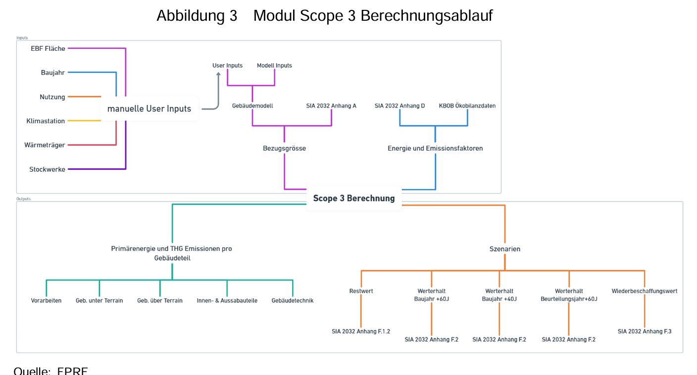
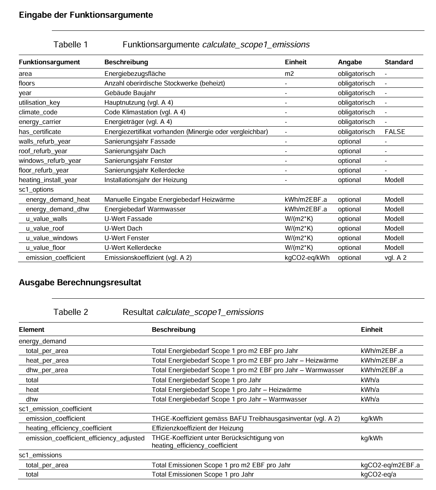

# Detailstudie - Energie und Ressourcen🟡

**Arbeitsdokument**

- Inhalte werden als PDFs im Anhang versioniert (nur Meilensteine)
- Zugang zum Dokument ist auf Mitarbeiter der Bundesverwaltung eingeschränkt (open by default)
- Inhalte können mit Abstimmung [Rasner David BBL](https://confluence.bbl.admin.ch/display/~U80865084) extern geteilt werden

**Inhalt:**

- [1. Ziel dieses Dokuments](#DetailstudieEnergieundRessourcen🟡-1.ZieldiesesDokuments)
- [2. Die Energie- und Ressourcensicht – Aufgaben und Bedeutung](#DetailstudieEnergieundRessourcen🟡-2.DieEnergie-undRessourcensicht–AufgabenundBedeutung)
- [3. Empfehlung Geschäftsobjekte (Konsolidiert)](#DetailstudieEnergieundRessourcen🟡-3.EmpfehlungGeschäftsobjekte(Konsolidiert))
- [4. Übersicht der relevanten Standards](#DetailstudieEnergieundRessourcen🟡-4.ÜbersichtderrelevantenStandards)
- [5. Wichtigste Standards und Beispiele im Detail (Schrittweise Ergänzung)](#DetailstudieEnergieundRessourcen🟡-5.WichtigsteStandardsundBeispieleimDetail(SchrittweiseErgänzung))
  - [5.1 Klima- und Innovationsgesetz (KlG)](#DetailstudieEnergieundRessourcen🟡-5.1Klima-undInnovationsgesetz(KlG))
  - [5.2 Energiegesetz (EnG)](#DetailstudieEnergieundRessourcen🟡-5.2Energiegesetz(EnG))
  - [5.3 CO2-Gesetz](#DetailstudieEnergieundRessourcen🟡-5.3CO2-Gesetz)
  - [5.4 BAFU PACTA CO2-Rechner Methode (FPRE)](#DetailstudieEnergieundRessourcen🟡-5.4BAFUPACTACO2-RechnerMethode(FPRE))
  - [5.5 The International Building Performance & Data Initiative (IBPDI)](#DetailstudieEnergieundRessourcen🟡-5.5TheInternationalBuildingPerformance&DataInitiative(IBPDI))
  - [5.6 GHG Protocol Corporate Standard](#DetailstudieEnergieundRessourcen🟡-5.6GHGProtocolCorporateStandard)
- [5.7 Carbon Risk Real Estate Monitor (CRREM)](#DetailstudieEnergieundRessourcen🟡-5.7CarbonRiskRealEstateMonitor(CRREM))
- [6. Verweise und Anhang](#DetailstudieEnergieundRessourcen🟡-6.VerweiseundAnhang)

---

# 1. Ziel dieses Dokuments

Dieses Fachkonzept legt die Grundlagen für ein einheitliches Verständnis und die Modellierung von Daten im Bundesamt für Bauten und Logistik (BBL) fest. Es dient als verbindliches Referenzwerk, um sicherzustellen, dass alle Fachbereiche und IT-Systeme mit denselben Konzepten und Definitionen arbeiten können.

Die Kernziele dieses Dokuments sind:

1. **Definition zentraler Geschäftsobjekte:** Klare und konsistente Definition der domänenspezifischen Geschäftsobjekte und deren Attribute, unabhängig von spezifischen IT-Systemen.
2. **Standardkonformität:** Sicherstellung, dass die Datenmodellierung den anerkannten nationalen und internationalen Gesetzesvorgaben und Best-Practice-Standards folgt.
3. **Interoperabilität:** Schaffung einer Basis für den nahtlosen Austausch und die Integration von Daten über verschiedene Systeme und Prozesse hinweg.
4. **Langfristige Datenqualität:** Beitrag zur Sicherung der Qualität und Konsistenz der Daten, um die Abhängigkeit von einzelnen IT-Systemen zu reduzieren und eine langfristige Nutzbarkeit zu gewährleisten.
5. **Brücke zwischen Fach und IT:** Bereitstellung eines Referenzwerks, das als gemeinsame Sprache zwischen fachlichen Anforderungen und deren technischer Umsetzung dient.
6. **Fundament für strategische Entscheidungen:** Schaffung einer faktenbasierten Grundlage für strategische Entscheidungen, operative Steuerung und Compliance-Management.

# 2. Die Energie- und Ressourcensicht – Aufgaben und Bedeutung

### 2.1. Rolle im Immobilienmanagement

Die Energie- und Ressourcensicht bildet das Fundament für nachhaltiges Immobilienmanagement im BBL. Sie quantifiziert und überwacht den Energie- und Ressourcenverbrauch von Gebäuden und Anlagen und schafft die Datengrundlage für die Erfüllung von Nachhaltigkeitszielen und gesetzlichen Vorgaben. Als integraler Bestandteil des modernen Facility Managements ermöglicht sie die kontinuierliche Optimierung von Betriebsprozessen und die Reduktion von Umweltauswirkungen.

### 2.2. Inhaltliche Dimensionen

Die Energie- und Ressourcensicht umfasst vier zentrale Dimensionen:

- **Energieflüsse:** Erfassung und Analyse aller Energieträger (Strom, Gas, Fernwärme, Öl, erneuerbare Energien) mit deren Verbrauch, Erzeugung und Verteilung innerhalb der Immobilien.
- **Ressourcenströme:** Monitoring von Wasser, Abfall, Materialien und weiteren Ressourcen über deren gesamten Lebenszyklus von der Beschaffung bis zur Entsorgung.
- **Umweltauswirkungen:** Berechnung und Dokumentation von CO2-Emissionen, Treibhausgasbilanzen, ökologischen Fussabdrücken und weiteren Umweltindikatoren gemäss nationalen und internationalen Standards.
- **Performance und Effizienz:** Kennzahlenbasierte Bewertung der Energie- und Ressourceneffizienz, Benchmarking, Zertifizierungen (GEAK, Minergie, SNBS) und kontinuierliche Verbesserungsprozesse.

### 2.3. Kernaufgaben

- **Standardisierte Datenerfassung:** Einheitliche Erfassung von Verbrauchsdaten über Smart Meter, manuelle Ablesung und automatisierte Schnittstellen zu Energieversorgern mit eindeutigen Zählpunkt-Identifikatoren.
- **Integration und Interoperabilität:** Harmonisierung verschiedener Datenquellen aus Gebäudeautomation, Energiemanagementsystemen und externen Dienstleistern über standardkonforme Schnittstellen.
- **Qualitätssicherung:** Plausibilitätsprüfungen, Vollständigkeitskontrollen, Anomalieerkennung und systematische Datenbereinigung zur Gewährleistung belastbarer Entscheidungsgrundlagen.
- **Nachhaltigkeitsmanagement:** Strukturelles Rückgrat für ESG-Reporting (Environmental, Social, Governance), Nachhaltigkeitsberichterstattung und die Umsetzung der Energie- und Klimastrategie des Bundes.

### 2.4. Strategische Bedeutung

Die Energie- und Ressourcensicht gewährleistet die **Compliance mit gesetzlichen Vorgaben** durch die Erfüllung von Energieeffizienzvorschriften, CO2-Gesetzgebung und Berichtspflichten gegenüber Bund und internationalen Organisationen. Sie schafft eine **zukunftsfähige Datenbasis** für die Transformation zu einem klimaneutralen Immobilienportfolio und die Integration neuer Technologien wie erneuerbarer Energiesysteme und intelligenter Netze.

Als zentrale Domäne ermöglicht sie die **datengetriebene Optimierung** von Betriebskosten, die Identifikation von Einsparpotenzialen und die Priorisierung von Sanierungsmassnahmen. Sie bildet die Grundlage für **transparente Kommunikation** von Nachhaltigkeitsleistungen gegenüber Stakeholdern und unterstützt die **strategische Positionierung** des BBL als Vorreiter im nachhaltigen Immobilienmanagement der öffentlichen Hand.

# 3. Empfehlung Geschäftsobjekte (Konsolidiert)

**Bedeutung der Prioritätsstufen:**

- **Muss**: Geschäftsobjekte, die für die fachliche Vollständigkeit der Architektonischen Sicht zwingend erforderlich sind. Diese Objekte bilden das Kerngerüst des Datenmodells und sind für die grundlegenden Geschäftsprozesse im Immobilienmanagement unabdingbar.
- **Soll**: Geschäftsobjekte, die das fachliche Datenmodell um wichtige Aspekte erweitern und die praktische Anwendbarkeit erheblich steigern. Sie sind nicht kritisch für die Grundfunktionalität, aber wichtig für eine vollständige fachliche Abbildung der Immobilienwelt.
- **Kann**: Geschäftsobjekte, die zusätzlichen fachlichen Mehrwert bieten und erweiterte Anwendungsfälle ermöglichen. Sie erweitern das Datenmodell um spezialisierte Bereiche, sind aber nicht für die Kerngeschäftsprozesse erforderlich.
- **Wird nicht**: Geschäftsobjekte, die bewusst nicht in der Architektonischen Sicht modelliert werden, entweder weil sie durch andere Objekte fachlich abgedeckt sind oder weil sie fachlich in anderen Domänen zugeordnet sind.

|  | Gruppe / Geschäftsobjekt | Priorität | Beschreibung | Primäre Identifikatoren | Relevante Standards | Kommentar |
| --- | --- | --- | --- | --- | --- | --- |
| 1 | **Räumliche Struktur** |  |  |  |  |  |
| 2 | Standort | Wird nicht | Gruppierung mehrerer Gebäude und Grundstücke zu einer Verwaltungseinheit | Standort-ID, Koordinaten | IBPDI, SAP RE-FX | Bereits in Architektonischer Sicht definiert |
| 3 | Grundstück | Wird nicht | Definiertes Landstück mit rechtlichen Eigenschaften | EGRID, Parzellennummer | GWR, IBPDI, SAP RE-FX | Bereits in Architektonischer Sicht definiert |
| 4 | Gebäude | Wird nicht | Struktur mit Schutzfunktion, zentrale Einheit der Energie- und Ressourcenbilanzierung | EGID, EGRID | GWR, IBPDI, PACTA, SAP RE-FX | Bereits in Architektonischer Sicht definiert |
| 5 | Etage/Geschoss | Soll | Horizontale Aggregation von Räumen innerhalb eines Gebäudes | Geschoss-ID, Gebäude-ID | IBPDI, IFC | Strukturierung für Flächenmanagement |
| 6 | Raum | Wird nicht | Abgegrenzter Bereich mit spezifischer Funktion | Raum-ID, Etagen-ID | IBPDI, IFC | Bereits in Architektonischer Sicht definiert |
| 7 | **Energie-Infrastruktur** |  |  |  |  |  |
| 8 | Energieträger | Muss | Art der eingesetzten Energie (Öl, Gas, Fernwärme, Strom, erneuerbare) | Energieträger-Code | PACTA, EnG, CO2-Gesetz | Basis für Emissionsberechnung |
| 9 | Zähler/Messpunkt | Muss | Erfassungspunkt für Energie- und Ressourcenverbrauch | Zähler-ID, EGID | InterWatt EDM, IBPDI, SAP PM | Zentral für Verbrauchserfassung |
| 10 | Zählwert/Messwert | Muss | Gemessene Verbrauchsdaten zu definiertem Zeitpunkt | Messwert-ID, Zähler-ID, Zeitstempel | InterWatt EDM, IBPDI | Basis für alle Berechnungen |
| 11 | Technisches System | Wird nicht | Gebäudetechnische Anlage (HVAC, Elektro, Sanitär) | System-ID, Gebäude-ID | IBPDI, SAP PM | Bereits in Architektonischer Sicht definiert |
| 12 | Komponente/Equipment | Wird nicht | Einzelne technische Komponente mit Wartungsbedarf | Equipment-ID, System-ID | IBPDI, SAP PM | Bereits in Architektonischer Sicht definiert |
| 13 | **Emissionen & Klimadaten** |  |  |  |  |  |
| 14 | THG-Emission Scope 1 | Muss | Direkte Emissionen aus eigenen Quellen | Gebäude-ID, Periode | GHG Protocol, PACTA, KlG | Kernindikator Klimaziele |
| 15 | THG-Emission Scope 2 | Muss | Indirekte Emissionen aus eingekaufter Energie | Gebäude-ID, Periode | GHG Protocol, PACTA, KlG | Emissionen Strombezug |
| 16 | THG-Emission Scope 3 | Soll | Vor-/nachgelagerte Emissionen (graue Energie) | Gebäude-ID, Periode | GHG Protocol, PACTA, KlG | Vollständige Klimabilanz |
| 17 | Emissionsfaktor | Muss | Umrechnungsfaktor Energie zu CO2-Äquivalenten | Energieträger, Jahr, Region | BAFU, GHG Protocol | Grundlage Emissionsberechnung |
| 18 | Dekarbonisierungspfad | Muss | Zeitlicher Verlauf der Ziel-CO2-Intensität | Gebäudetyp, Land, Jahr | CRREM, SIA 2040, KlG | Benchmark für Zielerreichung |
| 19 | **Kennzahlen & Benchmarks** |  |  |  |  |  |
| 20 | Energiebezugsfläche | Muss | Beheizte Fläche innerhalb thermischer Hülle | EGID, m² | SIA 380/1, PACTA | Bezugsgröße für alle KPIs |
| 21 | Energieintensität | Muss | Energieverbrauch pro m² und Jahr | kWh/m²/a | CRREM, SIA 2040 | Effizienz-Benchmark |
| 22 | CO2-Intensität | Muss | THG-Emissionen pro m² und Jahr | kgCO2e/m²/a | CRREM, PACTA | Klimaverträglichkeits-KPI |
| 23 | Absenkpfad | Muss | Gebäudespezifischer Reduktionspfad bis 2040/2050 | EGID, Zieljahr | PACTA, KlG | Individueller Zielpfad |
| 24 | Wasserverbrauch | Soll | Verbrauch von Trink- und Brauchwasser | Wasserzähler-ID | IBPDI, RUMBA | Ressourcenmanagement |
| 25 | Abfallaufkommen | Kann | Art und Menge anfallender Abfälle | Gebäude-ID, Abfallart | RUMBA, USG | Kreislaufwirtschaft |
| 26 | **Zertifizierungen** |  |  |  |  |  |
| 27 | Energieausweis | Soll | Offizielle Energieeffizienz-Bewertung | GEAK-ID, EGID | GEAK, Minergie | Nachweis Energiestandard |
| 28 | Nachhaltigkeitszertifikat | Kann | Umfassende Nachhaltigkeitsbewertung | Zertifikat-ID, Standard | SNBS, LEED, BREEAM | Erweiterte ESG-Bewertung |
| 29 | **Weitere Objekte** |  |  |  |  |  |
| 30 | Sensor | Wird nicht | IoT-Geräte zur Performance-Überwachung | Sensor-ID | IBPDI | Bereits in Architektonischer Sicht definiert |
| 31 | Bauteil | Wird nicht | Physische Bauteile (Wände, Decken, Türen, Fenster) | Bauteil-ID | IFC, Bauen Digital CH | Bereits in Architektonischer Sicht definiert |
| 32 | Zertifikat | Wird nicht | Zertifikate für Gebäude, Anlagen, Bauprodukte, Prüfungen | Zertifikat-ID | IBPDI, Bauen Digital CH | Bereits in Architektonischer Sicht definiert |
| 33 | Bemessung | Wird nicht | Flächen, Volumen, Längen, Stückzahlen nach SIA 416 und anderen Standards | Bemessung-ID | SIA 416, IBPDI | Bereits in Architektonischer Sicht definiert |
| 34 | Sensormessung | Soll | Zeitreihen-Messwerte von IoT-Sensoren | Messung-ID | IBPDI | Für Performance-Monitoring |

Tabelle: Konsolidierte Empfehlung Geschäftsobjekte

# 4. Übersicht der relevanten Standards

### 4.1 Bewertungskriterien für «Relevanz für BBL»

- **Sehr hoch**: Rechtlich oder regulatorisch verpflichtend; grundlegende Voraussetzung für Kernprozesse und -systeme; verbindliche interne Vorgabe; oder unmittelbar umsetzbarer, priorisierter Use Case mit hohem Nutzen.
- **Hoch**: Branchenweit anerkannte Praxis in der Schweiz; wesentlich für Rechtssicherheit, Compliance oder Interoperabilität; wichtig für robuste Integration in bestehende Prozess- und Datenflüsse.
- **Mittel**: Ergänzend oder domänenspezifisch; nützlich für Spezialfälle, Pilotierungen oder als Referenz; optional ohne unmittelbaren Umsetzungsdruck.
- **Niedrig**: Informativ; geringe direkte Anwendbarkeit im Betrieb; Beobachten/Monitoring ausreichend.

### 4.2 Strategische Einordnung (Kategorie Standards)

Die Standards und Use Cases lassen sich in folgende strategische Kategorien einordnen:

- **Rechtliche Grundlagen**: Rechtlich bindende Vorgaben auf Bundes- oder Verordnungsebene; definieren Mindestanforderungen und Rahmenbedingungen.
- **BBL Weisungen und Prozesse**: Interne, verbindliche Standards und Prozessmodelle; legen organisatorische Zuständigkeiten, Abläufe und Qualitätsvorgaben fest.
- **BBL Fachanwendungen**: Operative IT-Systeme und Register für fachliche Leistungen und Verwaltungsaufgaben; stellen Funktionen und Schnittstellen für die Datenintegration bereit.
- **Technische Standards**: Normen und Integrationsstandards (z. B. Datenmodelle, Schnittstellen, Qualitäts- und Leistungskataloge), die Austauschformate und Qualitätsstufen definieren.
- **Externe Beispiele**: Verifizierte Praxisbeispiele und Best-Practice-Implementierungen als Referenz für erfolgreiche Umsetzungen und innovative Ansätze.

### 4.3. Übersicht als Tabelle

|  | Gruppe / Name | Zweck (Kurz) | Relevanz für BBL | Anwendung BBL | Schnittstellen | Status | Anmerkungen |
| --- | --- | --- | --- | --- | --- | --- | --- |
| 1 | **RECHTLICHE GRUNDLAGE** |  |  |  |  |  |  |
| 2 | Klima- und Innovationsgesetz (KlG) | Rechtliche Verankerung Netto-Null 2050, Bundesverwaltung 2040 | Sehr hoch | Zwischenziele: 64% Reduktion 2031-2040, 75% bis 2040 | RUMBA, BAFU-Reporting | In Kraft seit 01.01.2025 | Gesetz verifiziert. Verbindliche Zielvorgabe für BBL |
| 3 | Klimaschutz-Verordnung (KlV) | Präzisierung KlG, Netto-Null-Fahrpläne | Sehr hoch | Scope 1-3 Bilanzierung, Absenkpfade, NET-Massnahmen | GHG Protocol | In Kraft seit 01.01.2025 | Verordnung verifiziert. Detaillierte Anforderungen an Fahrpläne |
| 4 | Energiegesetz (EnG) | Umsetzung Energiestrategie 2050, Förderung erneuerbarer Energien | Sehr hoch | Übergeordneter Rahmen für Energieeffizienz und erneuerbare Energien, Smart Metering | BFE, Kantone | In Kraft seit 01.01.2018 | Grundlage für energieeffiziente Bundesbauten |
| 5 | CO2-Gesetz | Reduktion Treibhausgasemissionen bis 2030 | Sehr hoch | Direkte Emissionsreduktionsziele für Gebäudesektor, CO2-Abgabe CHF 120/tCO2 | BAFU, KlV | Aktiv (rev. März 2024) | Komplexe Gesetzgebungsgeschichte |
| 6 | MuKEn 2014 | Mustervorschriften der Kantone im Energiebereich | Sehr hoch | Harmonisierung kantonaler Standards, max. 16 kWh/m² Neubauten | Kantone, SIA | Aktiv, MuKEn 2025 in Vorbereitung | Bundesbauten müssen kantonale Standards übertreffen |
| 7 | Energieeffizienzverordnung (EnEV) | Energieeffizienz-Vorgaben Bund | Hoch | Kennzeichnung Energieverbrauch, Effizienzkriterien | BFE, Kantone | Aktiv | Subsidiäre Rolle Bund zu kantonalen Massnahmen |
| 8 | Umweltschutzgesetz (USG) | Allgemeine Grundsätze Umweltschutz, Ressourcenschonung | Hoch | Vorbildfunktion Bund, Wiederverwendung Bauteile | BAFU | Aktiv (Art. 35j seit 2024) | Explizite Vorbildfunktion für Bundesbauten |
| 9 | VILB (SR 172.010.21) | Verordnung Immobilienmanagement Bund | Mittel | Nachhaltigkeitskriterien für 2'600 Bundesgebäude | SAP, KBOB | Aktiv, Rev. 2016 | 26'000 von 33'000 Bundesarbeitsplätzen Raum Bern |
| 10 | **BBL-GOVERNANCE** |  |  |  |  |  |  |
| 11 | Nachhaltigkeitsstrategie BBL | Interne Strategie für nachhaltiges Bauen | Sehr hoch | Leitlinien für alle BBL-Projekte | Alle BBL-Systeme | Aktiv | Zentrales Strategiedokument |
| 12 | KBOB Ökobilanzdatenbank | Umweltindikatoren Baumaterialien | Sehr hoch | Emissionsfaktoren, Primärenergie, Umweltbelastung | ecoinvent, BAFU | Aktiv, jährlich aktualisiert | Grundlage für Lebenszyklusanalysen |
| 13 | Weisungen EFD Nachhaltiges Immobilienmanagement | 11 Leitsätze nachhaltiges Bauen | Sehr hoch | Verbindliche Handlungsfelder für Bundesbauten | VILB, KBOB | Aktiv | Konkretisierung Nachhaltigkeitsgrundsätze |
| 14 | KBOB eco-BKP | Ökologische Baumaterialien nach BKP | Hoch | 30 BKP-Kategorien, Ausschreibungsstandards | NPK, CRB | Aktiv | Merkblätter für nachhaltiges Bauen |
| 15 | KBOB eco-Devis | Ökologische Leistungsverzeichnisse | Hoch | 40+ NPK-Kategorien, 080-Positionen | Ausschreibungssoftware | Aktiv | Integration in Standard-Software |
| 16 | **FACHANWENDUNGEN** |  |  |  |  |  |  |
| 17 | SAP RE-FX | Kaufmännische Immobilienverwaltung | Sehr hoch | Geschäftsobjekte: Wirtschaftseinheit (WE), Grundstück (GR), Gebäude (GE), Mietobjekt (FP/MF/ME), Architektonisches Objekt (AO), Bemessung | SAP ERP, InterWatt | Aktiv | Bemessungen sind zentral für Energiekennzahlen |
| 18 | InterWatt EDM | Energiedatenmanagement | Sehr hoch | Geschäftsobjekte: Zähler, Zählwerk, Zähl- und Messwerte, Zählerhierarchie, Medien, Verbrauchsart, Energieverbrauch | SAP PM, Smart Meter | Aktiv | Zentrale Verbrauchserfassung und CO2-Bilanzierung |
| 19 | RUMBA-System | Ressourcen- und Umweltmanagement Bundesverwaltung | Sehr hoch | Koordination Klimaziele, jährliche Berichte, 42% THG-Reduktion seit 2006 | GHG Protocol, BAFU | Aktiv | Verifiziert. Zentrale Koordinationsstelle Bund |
| 20 | SAP PM | Instandhaltungsmanagement | Hoch | Geschäftsobjekte: Technischer Platz, Equipment, Messpunkt/Zähler, Messbeleg, Wartungsplan | SAP RE-FX, InterWatt | Aktiv | Messpunkte/Zähler für Energiedatenerfassung |
| 21 | Wüest Dimensions EHP | Erhaltungsplanung | Hoch | Geschäftsobjekte: Gebäude, Gebäudekomponenten, Zustandsbewertung, Sanierung | REST API, Cloud | Aktiv | Fokus BBL: Zustandsbewertungen, Sanierungskostenschätzung |
| 22 | CDE Bund | Übergabeplattform CDE PIM/AIM | Hoch | Geschäftsobjekte: Dokument (Bauwerksdokumentation), IfcBuilding, IfcBuildingStorey | IFC, ISO 16739 | In Ausschreibung | Fokus: Handover Bauwerksdokumentation, CDE AIM noch nicht definiert |
| 23 | BBL GIS IMMO | Geografisches Informationssystem | Mittel | Geschäftsobjekte: BBL Gebäude (Punkt),  BBL Bodenabdeckung (Polygon), BBL Grundstück (Polygon), BBL Bauprojekt (Polygon), BBL Gebäudehülle (3D Volumen) | ESRI ArcGIS Enterprise | Aktiv | GIS-Layer für Integration von Geodaten |
| 24 | **STANDARDS (Schweiz) - Methodik** |  |  |  |  |  |  |
| 25 | SIA 2040 - Effizienzpfad Energie | Ganzheitliche Energiebilanzierung über Gebäudelebenszyklus | Sehr hoch | Verbindliche Zielwerte THG (max. 10 kg CO2-eq./m²a), 12 Gebäudekategorien | Excel-Tool, Integration mit Minergie/GEAK | Aktiv, verbindlich | Standard verifiziert. Ziel: 2000-Watt-Gesellschaft |
| 26 | SIA 380/1 - Heizwärmebedarf | Berechnungsmethodik thermischer Energiebedarf | Sehr hoch | Monatliche Energiebilanzen, U-Werte, Luftdichtigkeit (0.9 h⁻¹) | EN ISO 13790, GEAK | Aktiv, Version 2016 | Standard verifiziert. Grundlage für GEAK/Minergie |
| 27 | SIA 2031 | Energieausweis für Gebäude | Hoch | Methodik für Energiezertifikate, Renovierungspotential | GEAK | Version 2016 | Technische Basis für GEAK |
| 28 | SIA 2032 | Graue Energie von Gebäuden | Hoch | Berechnungsmethodik für graue Energie und THG-Emissionen | KBOB, ecoinvent | Version 2020 | Systemgrenzen A1-A5 nach EN 15978 |
| 29 | SIA 387/4 - Elektrizität in Gebäuden | Energieeffizienz elektrischer Anlagen | Hoch | 30% strenger Hauptbereiche, 50% strenger Verkehrsflächen | Minergie-Module | Aktiv, Rev. 2023 | Neue Norm bringt bessere Werte |
| 30 | **STANDARDS (Schweiz) - Labels & Zertifizierungen** |  |  |  |  |  |  |
| 31 | GEAK - Gebäudeenergieausweis | Einheitliche Energieetikette Kantone | Mittel | 3 Skalen (A-G): Hülle, Gesamtenergie, CO2; 10 Jahre gültig | SIA 380/1, Förderprogramme | Aktiv, schweizweit | Offizielle Energieetikette aller Kantone |
| 32 | GEAK Plus | Erweiterte Analyse mit Sanierungsvarianten | Hoch | Detaillierte Sanierungsplanung, Investitionsschätzungen | GEAK-Basis, Förderdatenbanken | Aktiv | Konkrete Modernisierungsvarianten |
| 33 | Minergie (Grundstandard) | Grundstandard Energieeffizienz | Mittel | 38 kWh/m²a Wohnbauten, Monitoring-System, Echtzeit-Verifikation | Smart Meter, BMS | Aktiv seit 1998 | >50'000 zertifizierte Gebäude CH |
| 34 | Minergie-P | Passivhaus-Standard | Mittel | 30% unter gesetzlichen Anforderungen | Minergie-Basis | Aktiv | Niedrigenergie-Gebäudekonzept |
| 35 | Minergie-A | Netto-Null-Standard | Mittel | Netto-Null oder positive Energiebilanz | PV-Monitoring, Smart Grid | Aktiv | 100% erneuerbare Deckung |
| 36 | Minergie-ECO | Ergänzung Bauökologie/Gesundheit | Mittel | Schadstofffreiheit, Tageslicht, Recyclingstoffe | eco-bau, KBOB | Aktiv | Zusatzmodul ökologische Aspekte |
| 37 | Minergie-Areal | Quartiersstandard | Mittel | Klimafreundliche Areale, Ressourceneffizienz | Gemeinde-GIS | Aktiv | Transformation ganzer Areale |
| 38 | SNBS Hochbau 2023.1 | Umfassendes Nachhaltigkeitslabel | Hoch | 45 Indikatoren, 3 Dimensionen, Bronze/Silber/Gold | Minergie, GEAK, KBOB | Aktiv, Version 2023.1 | Einziges CH-Label mit Mobilitätsbilanzierung |
| 39 | SNBS Bestand | Nachhaltigkeitslabel für Bestandsbauten | Hoch | Angepasste Kriterien für Bestandsgebäude | SNBS Hochbau | Aktiv | Spezifisch für Renovierungen |
| 40 | **STANDARDS (International) - Berichterstattung & Bilanzierung** |  |  |  |  |  |  |
| 41 | GHG Protocol Corporate Standard | Treibhausgasbilanzierung Unternehmen | Sehr hoch | Scope 1-3 Definition, seit 2020 Basis RUMBA | BAFU, SBTi | Aktiv | Weltweiter de-facto Standard |
| 42 | GHG Protocol Scope 2 Guidance | Indirekte Emissionen aus Energie | Sehr hoch | Location-based (CH: 54.7g CO2/kWh), market-based | Stromlieferanten | Aktiv, Rev. 2015 | CH-Strommix-Faktoren verfügbar |
| 43 | GHG Protocol Scope 3 Standard | Wertschöpfungsketten-Emissionen | Hoch | 15 Kategorien, Embodied Carbon | Lieferanten, Mieter | Aktiv | KlV sieht explizit Scope 3 vor |
| 44 | ISO 14064-Serie | THG-Quantifizierung/Verifizierung | Sehr hoch | Organisations-/Projektebene, Drittparteien-Verifizierung | CO2-Gesetz CH | Aktiv | Ergänzung GHG Protocol |
| 45 | CRREM | Carbon Risk Real Estate Monitor | Sehr hoch | Stranding Risk Assessment, 1.5°C/2°C-Pfade | GRESB, SBTi | Version 2024 | CH-spezifische Dekarbonisierungspfade |
| 46 | TCFD | Task Force on Climate-related Financial Disclosures | Sehr hoch | Klimarisiko-Berichterstattung | GRESB, GRI | Integriert in IFRS S2 (2024) | CH Climate Reporting Ordinance |
| 47 | GRI Standards | Nachhaltigkeitsberichterstattung | Mittel | Umfassende ESG-Berichterstattung | SDGs, SASB | GRI Universal 2021 | BBL nutzt bereits |
| 48 | REIDA | Standardisierte THG-Bilanzierung Immobilien | Hoch | Portfolio-Benchmarking, Scope 1-3 Emissionen | GHG Protocol | ISAE 3000 auditiert | 31 Unternehmen, CHF 222 Mrd. |
| 49 | BAFU Emissionsfaktoren | Offizielle CH-THG-Emissionsfaktoren | Hoch | Nationales THG-Inventar, CO2-Rechner für Gebäude | GWR, BFE | Aktiv | Heizöl: 265.32 g CO2/kWh |
| 50 | BAFU PACTA Klimatest 2024 PACTA CO2-Rechner Methode (FPRE) | Offizielle Methodenbeschreibung für PACTA CO2 Reporting, formuliert von Fahrländer und Partner | Sehr hoch | Detaillierter Methodenbericht für PACTA Reporting | GWR, BFE | Aktiv |  |
| 51 | GRESB | ESG-Benchmark Immobilien (Global) | Hoch | Portfolio-Performance, Energy (EN1), GHG (GH1) | Asset-Level-Reporting | Aktiv, jährlich | Weltweiter Immobilien-ESG-Benchmark |
| 52 | SBTi | Science Based Targets Initiative | Hoch | Paris-konforme Reduktionsziele | GHG Protocol, CDP | Aktiv | Wissenschaftsbasierte Klimaziele |
| 53 | **STANDARDS (International) - Zertifizierungen & Frameworks** |  |  |  |  |  |  |
| 54 | ISO 50001:2018 | Energiemanagementsystem mit PDCA-Zyklus | Sehr hoch | Systematisches Energiemanagement für 2'600+ Gebäude, EnPIs, EnBs | CH-Zertifizierer (SQS) | Aktiv | 10% Energieverbesserung in ersten 2 Jahren |
| 55 | DGNB Zertifizierungssystem | Umfassendes Nachhaltigkeitssystem | Hoch | 6 Themenfelder, 41 Kriterien, Gebäuderessourcenpass | BIM, EPD-Daten | Aktiv | EU-Taxonomie-kompatibel |
| 56 | Level(s) EU Framework | EU-Gebäudebewertungsrahmen | Hoch | 6 Makroziele inkl. GHG, Ressourcen, Wasser, Gesundheit | EN 15804+A2 | Aktiv | Referenzmethode für EU |
| 57 | EPBD | EU-Gebäudeenergieeffizienz bis 2050 | Hoch | Benchmark für CH-Standards, Zero-Emission Buildings ab 2030 | Nationale Gesetze | Aktiv (rev. 2024) | 150 Mrd. EUR/Jahr Investitionslücke |
| 58 | LEED | Leadership in Energy and Environmental Design | Mittel | 8 Hauptkategorien, Platin 80-110 Punkte | USGBC | Aktiv | 31 zertifizierte Gebäude in CH |
| 59 | BREEAM | Building Research Establishment Environmental Assessment | Mittel | Ältestes Green Building System | BRE | Aktiv seit 1990 | 500k+ Gebäude weltweit |
| 60 | BOMA 360 | Gebäudemanagement-Zertifizierung | Mittel | Ganzheitliche Bewertung 6 Bereiche | ENERGY STAR | Aktiv | US/Kanada Best Practice |
| 61 | **INTEGRATION - Datenprotokolle & Modelle** |  |  |  |  |  |  |
| 62 | IFC (ISO 16739) | BIM-Austauschformat | Hoch | 3D-Gebäudedaten, Energy Analysis MVD | STEP, XML, JSON | IFC4.3 | ISO-Standard BIM |
| 63 | ISO 19650-Serie | BIM Informationsmanagement | Hoch | Strukturiertes BIM-Datenmanagement | SIA 2051, IFC | Aktiv | SBB-Mandat ab 2025 |
| 64 | The International Building Performance & Data Initiative (IBPDI) | The global data model for real estate | Sehr hoch | Internationale Best Practices | Verschiedene Standards | Aktiv | Globale Initiative |
| 65 | CIBSE TM54 (UK) | Performance Gap Methodik | Mittel | Prognose Betriebsenergieverbrauch | Energiemodelle | Aktiv | Adressiert Performance-Lücken |
| 66 | BuildingSync | XML-Schema Energieaudits | Mittel | Standardisierter Austausch Auditdaten | XML, XSD | Version 2.4+ | US-DOE gefördert |
| 67 | EM-KPI Ontology | KPI-Ontologie Energiemanagement | Mittel | Performance-Indikatoren Gebäude/Distrikt | RDF, SPARQL | Aktiv | EU-Forschungsprojekt |
| 68 | ASHRAE 223P (USA) | Semantische Tags Gebäudedaten | Mittel | Standardisierung BMS-Datenmodelle | Haystack, Brick | In Entwicklung | Zusammenarbeit Haystack/Brick |
| 69 | ISO 52000-Serie | Energieeffizienz von Gebäuden (EPB) | Mittel | Harmonisierte Bewertungsmethodik, BIM-kompatibel | IFC, digitale Zwillinge | Aktiv | Internationale Harmonisierung |
| 70 | ISO 52010-1 | Standard-Klimadaten | Mittel | Gemeinsame Klimadaten für EPB | Meteoschweiz | Aktiv | Basis für Vergleichbarkeit |
| 71 | Green Button | Verbrauchsdaten-Austausch | Mittel | Konsistentes Format Energiedaten | XML, Atom | Version 1.0/2.0 | Kundenzugang Verbrauchsdaten |
| 72 | **REFERENZEN UND SONSTIGES - Best Practices & Ontologien** |  |  |  |  |  |  |
| 73 | Zürich GPM | Gebäudeparkmodell Kanton ZH | Hoch | Szenarien Netto-Null 2050 | Kantonale Tools | Aktiv | CH Best Practice |
| 74 | USZ Energiemanagement | Spitalbeispiel Energieeffizienz | Mittel | 0.6% Stromreduktion trotz 5% Wachstum | ISO 50001 | Aktiv | 1.5% jährliches Effizienzziel |
| 75 | ecoinvent | Globale LCI-Datenbank | Hoch | LCA für Baumaterialien, graue Energie | KBOB Ökobilanzdatenbank | Version 3.11 (2024) | 20'000+ Datensätze |
| 76 | Beispiele Netto Null Strategien für Immobilienmanagement ergänzen |  |  |  |  |  |  |

Tabelle: Übersicht der relevanten Standards und Beispiele

# 5. Wichtigste Standards und Beispiele im Detail (Schrittweise Ergänzung)

Zur einheitlichen Klassifizierung der Standards werden folgende Kategorien verwendet:

- **Fachanwendung**: IT-Systeme, Register oder Plattformen (z.B. GWR, Grundbuch, ÖREB-Kataster)
- **Geschäftsprozess:** Strukturierte Abfolge von Aktivitäten zur Erreichung eines definierten Geschäftsziels (z.B. Reinigungsausschreibung, Qualitätskontrolle durchführen, Reinigungsplan erstellen)
- **Geschäftsobjekt**: Eigenständige fachliche Entitäten mit eindeutiger Identität (z.B. Grundstück, Gebäude, Wohnung, Person)
- **Geschäftsobjekttyp**: Spezialisierungen oder Ausprägungen von Geschäftsobjekten (z.B. Stockwerkeigentum, Wohngebäude, Bauprojekt)
- **Dokument:** Informationsträger zur Dokumentation, Kommunikation oder Nachweisführung im Geschäftsprozess (z.B. Leistungsverzeichnis, Reinigungsplan, Qualitätsprotokoll, Pflegeanleitung)
- **Attribut**: Eigenschaften oder Merkmale von Geschäftsobjekten (z.B. EGID, Baujahr, Fläche, Koordinaten)
- **Fachbegriff**: Konzepte, Definitionen oder Klassifikationen ohne eigenständige Objektnatur (z.B. Grundeigentum, Vollregister, Nachführungspflicht)
- **Relation**: Beziehungen und Verknüpfungen zwischen Geschäftsobjekten, die deren Abhängigkeiten und Zusammenhänge definieren (z.B. Gebäude-zu-Grundstück, Equipment-zu-Technischer-Platz, Mietobjekt-zu-Vertrag)

## 5.1 Klima- und Innovationsgesetz (KlG)

- **Relevanz für BBL:** Sehr hoch
- **Beschreibung:**
  - Rechtliche Verankerung des Netto-Null-Ziels bis 2050 für die Schweiz, mit vorgezogener Zielerreichung bis 2040 für die Bundesverwaltung • Definiert verbindliche Zwischenziele für die THG-Reduktion gegenüber 1990:
  - 2031-2040: mindestens 64% Reduktion im Durchschnitt
  - bis 2040: mindestens 75% Reduktion
  - 2041-2050: mindestens 89% Reduktion im Durchschnitt
  - Etabliert sektorspezifische Richtwerte für Gebäude, Verkehr und Industrie
  - Verpflichtet die zentrale Bundesverwaltung zu Netto-Null bis 2040 (inkl. Scope 1-3)
  - Schafft Grundlage für Förderung neuartiger Technologien und Prozesse bis 2030
  - Verankert die Vorbildfunktion von Bund und Kantonen im Klimaschutz
- **Dokumentation:**
  - Bundesgesetz SR 814.310: <https://fedlex.data.admin.ch/eli/cc/2023/655>
  - In Kraft seit: 1. Januar 2025

|  | Begriff | Kategorie | Beschreibung | Relevanz BBL | Kommentar |
| --- | --- | --- | --- | --- | --- |
| 1 | Netto-Null-Emissionen | Fachbegriff | Grösstmögliche Verminderung der THG-Emissionen und Ausgleich der verbleibenden durch Negativemissionstechnologien (Art. 2d) | Sehr hoch | Zentrales Ziel für BBL-Immobilienportfolio bis 2040 |
| 2 | Negativemissionstechnologien | Fachbegriff | Biologische und technische Verfahren zur CO2-Entfernung aus der Atmosphäre mit dauerhafter Bindung (Art. 2a) | Hoch | Relevant für Kompensation unvermeidbarer Emissionen |
| 3 | Direkte Emissionen | Attribut | Durch Betrieb verursachte THG-Emissionen aus Verbrennung und Prozessen (Art. 2b) | Sehr hoch | Scope 1 nach GHG Protocol |
| 4 | Indirekte Emissionen | Attribut | THG-Emissionen bei Bereitstellung eingekaufter Energie (Art. 2c) | Sehr hoch | Scope 2 nach GHG Protocol |
| 5 | Zwischenziele 2031-2040 | Geschäftsobjekt | Reduktion um mindestens 64% im Durchschnitt gegenüber 1990 (Art. 3.3a) | Sehr hoch | Verbindliche Etappenziele für BBL |
| 6 | Zwischenziele bis 2040 | Geschäftsobjekt | Reduktion um mindestens 75% gegenüber 1990 (Art. 3.3b) | Sehr hoch | Meilenstein für Bundesverwaltung |
| 7 | Zwischenziele 2041-2050 | Geschäftsobjekt | Reduktion um mindestens 89% im Durchschnitt gegenüber 1990 (Art. 3.3c) | Sehr hoch | Endphase zur Netto-Null |
| 8 | Richtwert Sektor Gebäude | Geschäftsobjekt | 82% Reduktion bis 2040, 100% bis 2050 (Art. 4.1a) | Sehr hoch | Direkter Handlungsauftrag für BBL-Gebäudeportfolio |
| 9 | Richtwert Sektor Verkehr | Geschäftsobjekt | 57% Reduktion bis 2040, 100% bis 2050 (Art. 4.1b) | Hoch | Relevant für BBL-Fahrzeugflotte und Mobilitätsmanagement |
| 10 | Richtwert Sektor Industrie | Geschäftsobjekt | 50% Reduktion bis 2040, 90% bis 2050 (Art. 4.1c) | Mittel | Indirekt relevant über Lieferanten |
| 11 | Fahrpläne | Dokument | Unternehmensspezifische Dekarbonisierungspläne für Netto-Null bis 2050 (Art. 5) | Sehr hoch | BBL muss eigenen Fahrplan entwickeln |
| 12 | Zentrale Bundesverwaltung 2040 | Geschäftsobjekt | Netto-Null inkl. direkter, indirekter und vor-/nachgelagerter Emissionen (Art. 10.2) | Sehr hoch | BBL als Teil der Bundesverwaltung direkt betroffen |
| 13 | Kohlenstoffspeicher | Geschäftsobjekt | Speicher für CO2-Bindung (Wälder, Böden, Holzprodukte) bis 2050 (Art. 3.5) | Hoch | Potential in BBL-Liegenschaften und Aussenanlagen |
| 14 | Finanzhilfen 2030 | Geschäftsprozess | Förderung neuartiger Technologien und Prozesse bis 2030 (Art. 6) | Hoch | Finanzierungsmöglichkeit für BBL-Innovationsprojekte |
| 15 | Vorbildfunktion | Fachbegriff | Führungsrolle von Bund und Kantonen bei Netto-Null und Klimaanpassung (Art. 10.1) | Sehr hoch | Grundprinzip für alle BBL-Aktivitäten |
| 16 | Scope 3 Emissionen | Attribut | Vor- und nachgelagerte Emissionen durch Dritte (Art. 10.2) | Sehr hoch | Erweiterte Systemgrenze für Bundesverwaltung |

Tabelle: Geschäftsobjekte und Fachbegriffe KlG

## 5.2 Energiegesetz (EnG)

- **Relevanz für BBL:** Sehr hoch
- **Beschreibung:**
  - Übergeordneter Rahmen für Energieeffizienz und Förderung erneuerbarer Energien in der Schweiz
  - Regelt Investitionsbeiträge für erneuerbare Energieanlagen (Photovoltaik, Wasserkraft, Biomasse, Windenergie, Geothermie)
  - Einmalvergütung für Photovoltaikanlagen: max. 30% der Investitionskosten (60% bei Volleinspeisung)
  - Einführung von Auktionen für PV-Anlagen ohne Eigenverbrauch ab 150 kW Leistung
  - Betriebskostenbeiträge für Biomasseanlagen bis 31.12.2030
  - Geothermie-Garantien zur Risikoabsicherung (max. 60% der Investitionskosten)
  - Finanzierung über Netzzuschlag mit definierten Höchstanteilen pro Verwendung
  - Pilotprojekte für innovative Technologien im Energiesektor (max. 4 Jahre, verlängerbar um 2 Jahre)
  - Neue Verpflichtungen für Investitionsbeiträge werden ab 1.1.2031 nicht mehr eingegangen
- **Dokumentation:**
  - Bundesgesetz SR 730.0: <https://fedlex.data.admin.ch/eli/oc/2022/729>
  - In Kraft seit: 1. Januar 2023 (Änderung vom 1. Oktober 2021)

|  | Begriff | Kategorie | Beschreibung | Relevanz BBL | Kommentar |
| --- | --- | --- | --- | --- | --- |
| 1 | Einmalvergütung PV | Geschäftsobjekt | Investitionsbeitrag für neue/erweiterte PV-Anlagen, max. 30% (bzw. 60% bei Volleinspeisung) der Investitionskosten (Art. 25) | Sehr hoch | Zentrales Förderinstrument für BBL-Solarprojekte |
| 2 | PV-Auktion | Geschäftsprozess | Wettbewerbliche Vergabe der Einmalvergütung für PV >150kW ohne Eigenverbrauch (Art. 25a) | Hoch | Relevant für grosse BBL-Dachanlagen |
| 3 | Vergütungssatz | Attribut | CHF pro kW Leistung als Hauptkriterium bei PV-Auktionen (Art. 25a.2) | Hoch | Bestimmt Wirtschaftlichkeit von PV-Projekten |
| 4 | Sicherheitsleistung | Geschäftsobjekt | Bis 10% der gebotenen Einmalvergütung bei Auktionen (Art. 25a.3) | Mittel | Risikominimierung bei Auktionsverfahren |
| 5 | Investitionsbeitrag Wasserkraft | Geschäftsobjekt | Max. 60% für neue/erweiterte, max. 40% für erneuerte Anlagen (Art. 26) | Mittel | Für BBL-eigene Kleinwasserkraft relevant |
| 6 | Investitionsbeitrag Biomasse | Geschäftsobjekt | Max. 60% der anrechenbaren Investitionskosten (Art. 27) | Mittel | Für Holzheizungen in BBL-Gebäuden |
| 7 | Investitionsbeitrag Windenergie | Geschäftsobjekt | Max. 60% für Anlagen ≥2 MW (Art. 27a) | Niedrig | Kaum BBL-Standorte geeignet |
| 8 | Investitionsbeitrag Geothermie | Geschäftsobjekt | Max. 60% für Prospektion, Erschliessung und Anlagenbau (Art. 27b) | Hoch | Potenzial für BBL-Wärmeversorgung |
| 9 | Betriebskostenbeitrag | Geschäftsobjekt | Beitragssatz minus Referenz-Marktpreis pro kWh für Biomasse (Art. 33a) | Mittel | Unterstützt Wirtschaftlichkeit Biomasseanlagen |
| 10 | Geothermie-Garantie | Geschäftsobjekt | Risikoabsicherung bis 60% der Investitionskosten (Art. 33) | Hoch | Reduziert Investitionsrisiko bei Geothermie |
| 11 | Netzzuschlag | Geschäftsobjekt | Finanzierungsquelle für alle Fördermassnahmen (Art. 35) | Sehr hoch | Gesicherte Finanzierung der Energiewende |
| 12 | Photovoltaik-Kontingent | Geschäftsobjekt | Jährlich festgelegte Mittel für PV-Förderung (Art. 36.2) | Sehr hoch | Steuert PV-Zubau und Mittelverwendung |
| 13 | Warteliste | Geschäftsprozess | Verwaltung bei Mittelknappheit für Investitionsbeiträge (Art. 36.3) | Hoch | Priorisierung von BBL-Projekten wichtig |
| 14 | Pilotprojekt | Geschäftsobjekt | Max. 4-jährige innovative Energieprojekte, verlängerbar um 2 Jahre (Art. 23a StromVG) | Hoch | Ermöglicht BBL Innovation/Tests |
| 15 | Anrechenbare Investitionskosten | Attribut | Basis für Berechnung aller Investitionsbeiträge (Art. 29.2) | Sehr hoch | Definiert förderfähige Kosten |
| 16 | Referenzanlage | Fachbegriff | Standardisierte Anlage zur Bestimmung der Fördersätze (Art. 29.3i) | Hoch | Vereinfacht Förderberechnung |
| 17 | Eigenverbrauch | Attribut | Nutzung selbst produzierter Energie, beeinflusst Förderhöhe (Art. 25.3) | Sehr hoch | Zentrales Konzept für BBL-PV-Strategie |
| 18 | Leistungsgrenze | Attribut | Mindestleistung für Förderberechtigung je Technologie (Art. 26, 27a) | Hoch | Bestimmt Förderfähigkeit von BBL-Projekten |
| 19 | Zusicherung BFE | Dokument | Bewilligung vor Baubeginn für Investitionsbeiträge (Art. 28) | Sehr hoch | Rechtssicherheit für BBL-Investitionen |
| 20 | Systemdienstleistungen | Geschäftsobjekt | Nationale Netzgesellschaft kann Kosten aus Pilotprojekten übernehmen (Art. 23a.4 StromVG) | Mittel | Finanzierung innovativer BBL-Projekte |

Tabelle: Geschäftsobjekte und Fachbegriffe EnG

## 5.3 CO2-Gesetz

- **Relevanz für BBL:** Sehr hoch
- **Beschreibung:**
  - Direkte Emissionsreduktionsziele für Gebäudesektor: 82% bis 2040, 100% bis 2050 (Art. 4)
  - Kompensationspflicht für fossile Treibstoffe: 5-90% der CO2-Emissionen (Art. 28b-28e)
  - Emissionshandelssystem (EHS) für Anlagen mit Teilnahmepflicht oder freiwilliger Teilnahme (Art. 15-21)
  - Verminderungsverpflichtungen für Betriebe mit CO2-Abgaberückerstattung bis 2040 (Art. 31-32)
  - CO2-Abgabe CHF 120/tCO2 auf fossilen Brennstoffen (Aktiv, rev. März 2024)
  - Gebäudeförderprogramm: Ein Drittel der CO2-Abgabe für Gebäudesanierungen (Art. 34)
  - Fahrzeug-CO2-Zielwerte: 49.5g CO2/km für PW ab 2030, Sanktionen 95-152 CHF/g (Art. 10-13)
  - SAF-Beimischpflichten nach EU-Regelung für nachhaltige Luftfahrt (Art. 28f-28g)
  - Förderung Nachtzüge und synthetische Flugtreibstoffe aus EHS-Erlösen (Art. 37a)
  - Dekarbonisierungspläne für Betriebe mit Verminderungsverpflichtung (Art. 31a)
  - Internationale Bescheinigungen für Emissionsverminderungen im Ausland (Art. 6)
- **Dokumentation:**
  - Bundesgesetz SR 641.71: <https://fedlex.data.admin.ch/eli/oc/2024/376>
  - In Kraft seit: 1. Januar 2025 (meiste Bestimmungen)

|  | Begriff | Kategorie | Beschreibung | Relevanz BBL | Kommentar |
| --- | --- | --- | --- | --- | --- |
| 1 | CO2-Abgabe | Geschäftsobjekt | Lenkungsabgabe CHF 120/tCO2 auf fossilen Brennstoffen | Sehr hoch | Direkte Kostenbelastung für BBL-Heizungen |
| 2 | Verminderungsverpflichtung | Geschäftsobjekt | Verpflichtung zur THG-Reduktion bis 2040 mit Zielvereinbarung (Art. 31) | Sehr hoch | Alternative zu CO2-Abgabe für BBL-Anlagen |
| 3 | Dekarbonisierungsplan | Dokument | Plan zur massgeblichen Reduktion fossiler Brennstoffe bis 2040 (Art. 31a) | Sehr hoch | Pflicht bei Verminderungsverpflichtung |
| 4 | Emissionshandelssystem (EHS) | Geschäftsprozess | Handel mit Emissionsrechten für grosse Anlagen (Art. 15-21) | Hoch | Für grosse BBL-Heizzentralen relevant |
| 5 | Emissionsrechte | Geschäftsobjekt | Handelbare Berechtigungen zum THG-Ausstoss (Art. 2c) | Hoch | Bei EHS-Teilnahme erforderlich |
| 6 | Nationale Bescheinigung | Geschäftsobjekt | Handelbare Bescheinigung für CH-Emissionsverminderungen (Art. 2d, 7) | Hoch | Kompensationsinstrument für BBL |
| 7 | Internationale Bescheinigung | Geschäftsobjekt | Bescheinigung für Emissionsverminderungen im Ausland (Art. 2f, 6) | Mittel | Ergänzende Kompensationsoption |
| 8 | Gebäudestandards Kantone | Geschäftsobjekt | Kantonale Standards für Ersatzneubauten/Sanierungen (Art. 9.1bis) | Sehr hoch | Zusätzliche Ausnutzung als Anreiz |
| 9 | Globalbeiträge Gebäude | Geschäftsobjekt | Bundesbeiträge an kantonale Förderprogramme, max. 30% Sockelbeitrag (Art. 34) | Sehr hoch | Co-Finanzierung BBL-Sanierungen |
| 10 | Individuelle Zielvorgabe Fahrzeuge | Attribut | CO2-Grenzwert für Neuwagenflotte eines Importeurs (Art. 11) | Hoch | Relevant für BBL-Fahrzeugbeschaffung |
| 11 | CO2-Zielwerte Fahrzeuge | Attribut | 49.5g CO2/km für PW ab 2030, 90.6g für Lieferwagen (Art. 10) | Hoch | Vorgabe für BBL-Flotte |
| 12 | Sanktion Fahrzeuge | Geschäftsobjekt | CHF 95-152 pro g CO2/km über Zielvorgabe (Art. 13) | Mittel | Kostenfaktor bei Fahrzeugkauf |
| 13 | Kompensationspflicht Treibstoffe | Geschäftsprozess | 5-90% der CO2-Emissionen aus Treibstoffen kompensieren (Art. 28b-28c) | Mittel | Indirekte Kosten über Treibstoffpreise |
| 14 | SAF-Beimischpflicht | Geschäftsprozess | Pflicht zur Beimischung nachhaltiger Flugtreibstoffe (Art. 28f) | Niedrig | Für BBL-Flugreisen indirekt relevant |
| 15 | WKK-Rückerstattung | Geschäftsprozess | 60% CO2-Abgabe-Rückerstattung für WKK-Anlagen (Art. 32a-32b) | Hoch | Option für BBL-Energiezentralen |
| 16 | Senkenleistung | Fachbegriff | Entnahme von CO2 aus Atmosphäre und Bindung (Art. 2h) | Mittel | Ergänzung zu Emissionsreduktion |
| 17 | Netto-Null-Emissionen | Fachbegriff | Verminderung plus Ausgleich durch Negativemissionen (Art. 2d) | Sehr hoch | Übergeordnetes Ziel für BBL |
| 18 | Richtwert Gebäudesektor | Attribut | 82% Reduktion bis 2040, 100% bis 2050 (Art. 4.1a) | Sehr hoch | Verbindliche Sektorziele für BBL |
| 19 | Förderung Geothermie | Geschäftsobjekt | Max. 45 Mio. CHF/Jahr für Geothermieprojekte (Art. 34a) | Hoch | Finanzierung für BBL-Wärmeprojekte |
| 20 | Förderung erneuerbare Gase | Geschäftsobjekt | Förderung von Anlagen zur Produktion erneuerbarer Gase (Art. 34a.1d) | Mittel | Option für BBL-Energieversorgung |
| 21 | Technologiefonds | Geschäftsobjekt | Max. 25 Mio. CHF/Jahr für Bürgschaften (Art. 35) | Mittel | Innovationsfinanzierung |
| 22 | Energieplanung kommunal | Geschäftsprozess | Förderung räumlicher Energieplanung (Art. 34a.1c) | Hoch | Koordination BBL-Projekte mit Gemeinden |
| 23 | Emissionsgemeinschaft | Geschäftsobjekt | Zusammenschluss für EHS oder Verminderungsverpflichtung (Art. 11.6, 31.4) | Mittel | Option für BBL-Kooperationen |
| 24 | Referenz-Marktpreis | Attribut | Basis für Betriebskostenbeiträge Biomasse (Art. 33a.2) | Mittel | Bestimmt Förderhöhe |
| 25 | Vorbildfunktion Bund | Fachbegriff | Netto-Null bis 2040 für zentrale Bundesverwaltung (Art. 10 KlG) | Sehr hoch | Direkte Verpflichtung für BBL |
| 26 | CO2-System Erfassung | Geschäftsprozess | Nachverfolgung von abgeschiedenem/entnommenem CO2 (Art. 39.3bis) | Mittel | Zukunftsoption für BBL |

Tabelle: Geschäftsobjekte und Fachbegriffe CO2-Gesetz

## 5.4 BAFU PACTA CO2-Rechner Methode (FPRE)

- **Relevanz für BBL:** Sehr hoch
- **Beschreibung:** Der PACTA CO2-Rechner ist ein vom Bundesamt für Umwelt (BAFU) beauftragtes Analyse-Tool, das von Fahrländer Partner Raumentwicklung (FPRE) entwickelt wurde. Es dient der standardisierten Abschätzung von Energiebedarf und Treibhausgasemissionen (THGE) für einzelne Gebäude sowie ganze Immobilien- und Hypothekenportfolios. Die Methode ermöglicht es, mit wenigen zentralen Gebäudemerkmalen eine umfassende Emissionsbilanz zu erstellen und die Klimaverträglichkeit zu bewerten. Für den PACTA Klimatest 2024 wurde das Tool wesentlich erweitert und erfasst nun den gesamten Lebenszyklus eines Gebäudes nach dem Greenhouse Gas (GHG) Protocol.
- **Dokumentation:**
  - BAFU Webseite (CO2-Rechner Gebäude): <https://www.bafu.admin.ch/bafu/de/home/themen/klima/fachinformationen/verminderungsmassnahmen/gebaeude/co2-rechner-gebaeude.html>
  - Original Dokument im Anhang: [BAFU Methodenbericht 2024 zum erweiterten CO2-Rechner für Gebäude.pdf](assets/Energie und Ressourcen/229017434.pdf)

### Drei Emissionsbereiche (Scopes):

Die Methodik gliedert sich in drei Emissionsbereiche, die für das Immobilienmanagement unterschiedliche Handlungsebenen adressieren

**Scope 1: Direkte Emissionen (Betrieb)**

- Erfasst die THG-Emissionen, die direkt am Gebäudestandort durch die Verbrennung fossiler Energieträger (z.B. in einer Öl- oder Gasheizung) zur Erzeugung von Heizwärme und Warmwasser entstehen
- Die Berechnung des Energiebedarfs basiert primär auf der Norm SIA 380/1
- Dieser Scope ist entscheidend für die Optimierung des laufenden Betriebs und die Planung des Heizungsersatzes

**Scope 2: Indirekte Emissionen (Energieeinkauf)**

- Umfasst die indirekten THG-Emissionen, die bei der Erzeugung von eingekaufter Energie wie Strom und Fernwärme anfallen
- Die Berechnung stützt sich u.a. auf die Norm SIA 2024
- Die Stromproduktion aus gebäudeeigenen Photovoltaikanlagen (PV) kann hier angerechnet werden, was die Planung von energetischen Massnahmen direkt unterstützt

**Scope 3: Indirekte Emissionen (Graue Energie & Lebenszyklus)**

- Ermittelt die "graue Energie", also jene THG-Emissionen, die über den gesamten Lebenszyklus eines Gebäudes ausserhalb des Betriebs anfallen
- Dies umfasst die Herstellung der Baumaterialien, die Erstellung, Sanierungen, den Rückbau und die Entsorgung
- Die Berechnung basiert auf der Norm SIA 2032
- Diese Analyse ist von hoher strategischer Bedeutung für langfristige Portfolio-Entscheidungen

### Relevanz für das Immobilienmanagement

Die Methodik geht weit über eine reine Verbrauchsbetrachtung hinaus und liefert entscheidende Kennzahlen für das strategische Immobilienmanagement. Sie basiert auf offiziellen Datenregistern wie dem Gebäude- und Wohnungsregister (GWR) und nutzt den EGID zur eindeutigen Identifikation von Gebäuden.

### Zentrale strategisch relevante Begriffe:

**Lebenszyklus-Szenarien:**

Das Scope-3-Modul berechnet verschiedene Szenarien, die bei der Entscheidung zwischen Sanierung und Ersatzneubau helfen:

- **Restwert:** Der noch nicht amortisierte Anteil der grauen Energie. Ein hoher Restwert kann einen Abriss aus Klimasicht unwirtschaftlich machen
- **Werterhalt:** Die graue Energie, die bei einer Weiternutzung und Instandhaltung anfällt
- **Wiederbeschaffungswert:** Die Gesamt-Emissionen bei einem Abriss (inkl. Restwert) und einem identischen Neubau

**Technische Kennwerte:**

- Das Modell berücksichtigt detaillierte technische Merkmale wie U-Werte von Bauteilen und das Vorhandensein von Energiezertifikaten (z.B. Minergie, GEAK) • Dies ermöglicht eine fundierte Planung von Sanierungsmassnahmen

**Nationaler Benchmark:**

- Der berechnete Absenkpfad für den Schweizer Gebäudepark dient als Referenzwert
- Ermöglicht die Einordnung und Steuerung der eigenen Portfolio-Performance im Kontext der nationalen Klimaziele

|  | **Begriff** | **Kategorie** | **Beschreibung** | **Relevanz BBL** | **Kommentar** |
| --- | --- | --- | --- | --- | --- |
| 1 | PACTA CO2-Rechner | Fachanwendung | Software-Tool (R-Package) zur Berechnung der THGE von Gebäuden nach Scopes 1, 2 und 3 auf Basis von Gebäudemerkmalen | Sehr hoch | Zentrales Instrument für die standardisierte Klimaverträglichkeits-Analyse des BBL-Portfolios |
| 2 | Scope 1 Emissionen | Fachbegriff / Attribut | Direkte THG-Emissionen aus der Verbrennung fossiler Brennstoffe vor Ort (z.B. Öl, Gas) zur Wärmeerzeugung | Sehr hoch | Kernindikator für die direkten Emissionen des Gebäudebetriebs |
| 3 | Scope 2 Emissionen | Fachbegriff / Attribut | Indirekte THG-Emissionen aus der Erzeugung von bezogener Energie wie Strom und Fernwärme | Sehr hoch | Relevant für die Bilanzierung des Energieeinkaufs und die Dekarbonisierungsstrategie |
| 4 | Scope 3 (Graue Energie) | Fachbegriff / Attribut | Indirekte THG-Emissionen aus Herstellung, Bau, Sanierung, Rückbau und Entsorgung der Baumaterialien | Sehr hoch | Wird für strategische Entscheide (Sanierung vs. Neubau) immer wichtiger |
| 5 | Energiebezugsfläche (EBF) | Attribut | Beheizte Fläche innerhalb der thermischen Gebäudehülle; die primäre Bezugsgrösse für alle Berechnungen (in kWh/m²a) | Sehr hoch | Essentielle Stammdaten-Anforderung für alle Berechnungen |
| 6 | Absenkpfad | Geschäftsobjekt | Definiert den Zielpfad zur Reduktion der Scope-1-Emissionen (kg CO2-eq./m²a) für den Schweizer Gebäudepark bis 2050 | Sehr hoch | Dient als Benchmark zur Überprüfung der Portfolio-Performance gegenüber den nationalen Klimazielen |
| 7 | Restwert (Graue Energie) | Geschäftsobjekt / Attribut | Der noch nicht amortisierte Anteil der grauen Energie eines Bestandsbaus zu einem bestimmten Zeitpunkt | Hoch | Wichtig für die Beurteilung der "vernichteten" grauen Energie bei einem vorzeitigen Abriss |
| 8 | Werterhalt (Graue Energie) | Szenario / Geschäftsobjekt | Szenario, das die anfallende graue Energie für zukünftige Ersatzbauteile bei einer Weiternutzung des Gebäudes bilanziert | Hoch | Dient dem Vergleich zwischen Sanierung und Neubau |
| 9 | Wiederbeschaffungswert (Graue Energie) | Szenario / Geschäftsobjekt | Summe aus dem Restwert des alten Gebäudes und der grauen Energie für einen identischen Neubau | Hoch | Verdeutlicht die gesamten Scope-3-Auswirkungen eines Ersatzneubaus |
| 10 | Emissionskoeffizient | Attribut | Faktor zur Umrechnung des Energieverbrauchs in THG-Emissionen (z.B. kg CO2-eq./kWh) | Sehr hoch | Grundlage für alle Emissionsberechnungen. Kann für Scope 2 manuell übersteuert werden |
| 11 | EGID | Attribut | Eidgenössischer Gebäudeidentifikator - eindeutige Identifikationsnummer für jedes Gebäude in der Schweiz | Sehr hoch | Zentrale Kennung für Datenverknüpfung mit GWR |
| 12 | GWR (Gebäude- und Wohnungsregister) | Geschäftsobjekt | Nationales Register mit Stammdaten aller Gebäude und Wohnungen der Schweiz | Sehr hoch | Datengrundlage für CO2-Rechner, liefert Baujahr, Heizungsart, etc. |
| 13 | Gebäudemodell | Geschäftsobjekt | Standardisierte, vereinfachte Darstellung eines Gebäudes im CO2-Rechner basierend auf GWR-Daten und weiteren Parametern für die Berechnung der THG-Emissionen | Sehr hoch | Kern des Berechnungstools - transformiert wenige Eingabeparameter in ein vollständiges Emissionsmodell |
| 14 | U-Wert | Attribut | Wärmedurchgangskoeffizient von Bauteilen (W/m²K) - misst Wärmeverlust durch Bauteile | Sehr hoch | Zentral für Energiebedarfsberechnung nach SIA 380/1 |
| 15 | Heizgradtage (HGT) | Attribut | Masseinheit zur Klimabereinigung des Heizenergieverbrauchs | Sehr hoch | Ermöglicht Vergleich unterschiedlicher Standorte und Jahre |
| 16 | Klimabereinigung | Geschäftsprozess | Normalisierung des Energieverbrauchs auf Standardklima | Sehr hoch | Wichtig für Benchmarking und Zeitreihenvergleiche |
| 17 | Energieträger | Geschäftsobjekt | Art der eingesetzten Energie (Öl, Gas, Fernwärme, Wärmepumpe, etc.) | Sehr hoch | Bestimmt Emissionsfaktoren und Dekarbonisierungsstrategie |
| 18 | Endenergie | Attribut | Tatsächlich bezogene Energie am Gebäude (kWh/m²a) | Sehr hoch | Basis für Scope 1 und 2 Berechnungen |
| 19 | Nutzenergie | Attribut | Energie, die tatsächlich für Heizung und Warmwasser genutzt wird | Hoch | Nach Abzug von Umwandlungsverlusten |
| 20 | Sanierungsrate | Attribut | Prozentsatz der jährlich energetisch sanierten Gebäude | Sehr hoch | Kritisch für Zielerreichung Netto-Null |
| 21 | Dekarbonisierungspfad | Geschäftsobjekt | Spezifischer Reduktionspfad für einzelne Gebäude oder Portfolios | Sehr hoch | Individueller Pfad zur Netto-Null |
| 22 | Benchmark-Wert | Attribut | Vergleichswert für CO2-Emissionen nach Gebäudekategorie | Sehr hoch | Ermöglicht Portfolio-Einordnung |
| 23 | Lebenszyklusbetrachtung (LCA) | Geschäftsprozess | Ganzheitliche Bewertung über gesamten Gebäudelebenszyklus | Sehr hoch | Methodischer Rahmen für Scope 3 |
| 24 | Gebäudekategorie | Attribut | Klassifizierung nach SIA 2040 (Wohnen, Büro, Schule, etc.) | Sehr hoch | Bestimmt Zielwerte und Benchmarks |
| 25 | Photovoltaik-Eigenproduktion | Geschäftsobjekt | Selbst produzierter Solarstrom am Gebäude | Sehr hoch | Reduziert Scope 2 Emissionen |
| 26 | SIA-Normen (380/1, 2024, 2032) | Fachbegriff | Schweizerische Normen für Energieberechnungen | Sehr hoch | Methodische Grundlage des CO2-Rechners |

Tabelle: Geschäftsobjekte und Fachbegriffe PACTA CO2-Rechner Methode

## 5.5 The International Building Performance & Data Initiative (IBPDI)

- **Relevanz für BBL:** Sehr hoch
- **Beschreibung:** Die International Building Performance & Data Initiative (IBPDI) ist der erste globale, branchenweite Daten- und Performance-Standard für die Immobilienwirtschaft - ein Common Data Model (CDM) for Real Estate. Die Initiative wurde 2020 von BuildingMinds, Microsoft und RICS gegründet und entwickelt einen Open-Source-Standard für die einheitliche Datensprache aller immobilienbezogenen Geschäftsprozesse. Das CDM ist in thematische Cluster strukturiert, wobei der Digital Building Twin den zentralen Kern bildet. Nach dem Digital Building Twin wurde der Energy & Resources Cluster in Zusammenarbeit mit dem Institut für Immobilienökonomie (IIÖ) entwickelt und ist vollständig kompatibel mit der Carbon Risk Real Estate Monitor (CRREM) Methodik.
- **Dokumentation:**

  - Webseite: <https://ibpdi.org/>
  - GitHub Repository: <https://github.com/ibpdi/cdm>
  - Lizenz: Creative Commons Attribution

**Kernziele:**

- Schaffung einer universellen Datensprache für alle immobilienrelevanten Geschäftsprozesse
- Integration branchenspezifischer KPIs (Nutzerzufriedenheit, Nachhaltigkeit, Finanzen)
- Ermöglichung von Benchmarking nach internationalen Standards
- Unterstützung effektiver Dekarbonisierungsstrategien
- Anwendung fortgeschrittener Technologien wie Künstliche Intelligenz und Machine Learning durch konsistente Datenstrukturen [GitHub - ibpdi/cdm: The Common Data Model (CDM) for Real Estate is a collection of schemas (entities, attributes, relationships) that represents different specialisations and tasks throughout the real estate industry with well-defined semantics, to facilitate data interoperability. Examples of entities include: Area Measurement, Building, Prices, Costs, Climate etc.](https://github.com/ibpdi/cdm)

|  | Begriff (Original) | Begriff (Übersetzung) | Kategorie | Beschreibung | Relevanz BBL | Kommentar |
| --- | --- | --- | --- | --- | --- | --- |
| 1 | **Energy & Resources** | Energie- und Ressourcenmanagement | Cluster | Beschreibt Geschäftsobjekte im Kontext von Energie THG-Bilanzierung und Ressourcenmanagement |  | CRREM Methodik |
| 2 | Climate | Klima | Geschäftsobjekt | Regionale Informationen über vergangene und zukünftige Heiz- und Kühlgradtage zur Klimanormalisierung und Projektion des Energiebedarfs | Sehr hoch | Grundlage für klimabereinigte Energieverbrauchsanalysen. Verknüpft mit Building und Site |
| 3 | EmissionFactor | Emissionsfaktor | Geschäftsobjekt | Emissionsfaktoren zur Umrechnung von Energieverbrauchsdaten in THG-Emissionen. Umfasst globale Erwärmungspotentiale für nicht-CO2 Treibhausgase zur Berechnung von CO2-Äquivalenten | Sehr hoch | Zentral für CO2-Bilanzierung nach GHG Protocol. Verknüpft mit Building, OperationalMeasurement und Site |
| 4 | GhgEmission | THG-Emission | Geschäftsobjekt | Treibhausgasemissionen (in CO2e) entsprechend den individuellen operativen Messungen | Sehr hoch | Kernkennzahl für Klimaberichterstattung. Verknüpft mit Building, EmissionFactor und Site |
| 5 | OperationalMeasurement | Betriebsmesswert | Geschäftsobjekt | Individuelle Daten zu Energieverbrauch, Wasserverbrauch/-entnahme, Abfallaufkommen oder flüchtigen Emissionen inkl. weiterer Informationen (beschafft von, Subtypen, Zweck, abgedeckter Zeitraum) | Sehr hoch | Entspricht Zählwerten in InterWatt EDM. Verknüpft mit Building, Floor, Land, RentalUnit, Site, Space und Unit |
| 6 | SustainabilityIndicator | Nachhaltigkeitsindikator | Geschäftsobjekt | Nachhaltigkeitsbezogene Informationen auf Gebäudeebene: Energieverbrauch, Nettoenergiebedarf, CO2-Emissionen (gesamt, getrennt nach Scopes, markt- und standortbasiert), Ausrichtung auf Ziele, Überschreitung von Emissionszielen, CO2-Kosten und Strafen | Sehr hoch | Umfassende ESG-Kennzahlen für Reporting. Verknüpft mit EmissionFactor |
| 7 | **Digital Twin** | Digitaler Zwilling | Cluster | Beschreibt Geschäftsobjekt aus der Architektonischen Sicht (Physische Elemente) | Sehr hoch | Kerncluster des CDM |
| 8 | **Räumliche Elemente** |  | Gruppe |  |  |  |
| 9 | Building | Gebäude | Geschäftsobjekt | Ein Gebäude stellt eine Struktur dar, die Schutz für Bewohner oder Inhalte bietet. Wird auch als Basiselement der räumlichen Strukturhierarchie verwendet | Sehr hoch | Entspricht Gebäude (GE) in SAP RE-FX. Verknüpft mit allen anderen Objekten |
| 10 | Site | Standort | Geschäftsobjekt | Gruppierung mehrerer Gebäude und Grundstücke | Sehr hoch | Übergeordnete Struktur für Portfolio-Management |
| 11 | Land | Grundstück | Geschäftsobjekt | Ein definiertes Landstück, möglicherweise mit Wasser bedeckt, auf dem das Bauprojekt bereits abgeschlossen ist | Sehr hoch | Entspricht Grundstück (GR) in SAP RE-FX |
| 12 | Floor | Etage/Geschoss | Geschäftsobjekt | Die Etage hat eine Höhe und repräsentiert typischerweise eine (fast) horizontale Aggregation von Räumen, die vertikal gebunden sind | Sehr hoch | Entspricht Stockwerk in SAP. Verknüpft mit Building, Komponenten und Systemen |
| 13 | Space | Raum | Geschäftsobjekt | Ein Raum repräsentiert einen tatsächlich oder theoretisch begrenzten Bereich oder Volumen. Räume sind Bereiche die bestimmte Funktionen innerhalb eines Gebäudes bereitstellen | Sehr hoch | Raumstruktur. Verknüpft mit Floor, Komponenten, Sensoren und Systemen |
| 14 | Unit | Einheit | Geschäftsobjekt | Eine Einheit ist eine physische Grösse mit dem Wert eins, die als Standard für andere Grössen verwendet wird. Im Gebäudekontext kann es eine Gruppierung von Bereichen, Räumen, Etagen etc. sein | Hoch | Strukturelement. Verknüpft mit Building, Floor, Land, Site, Space |
| 15 | **Gebäudetechnische Systeme** |  | Gruppe |  |  |  |
| 16 | System | System | Geschäftsobjekt | Gesamtheit verwaltbarer Komponenten mit gemeinsamer Funktion (Zufuhr von Luft oder Lüftungssystem) | Sehr hoch | Technische Systeme. Verknüpft mit Building, Floor, RentalUnit, Site, Space, Unit |
| 17 | HvacSystem | HVAC-System | Geschäftsobjekt | Detaillierte Informationen über Heizungs-, Lüftungs- und Klimasystem. Bezieht sich auf die verschiedenen Systeme für Innen- und Aussenbereiche sowie Heiz- und Kühlgebäude | Sehr hoch | Zentrale Gebäudetechnik für Heizung, Lüftung, Klima |
| 18 | ElectricalSystem | Elektrisches System | Geschäftsobjekt | Detaillierte Informationen über das elektrische System | Sehr hoch | Gesamte Elektroinstallation inkl. Verteilung und Sicherheitssysteme |
| 19 | PlumbingSystem | Sanitärsystem | Geschäftsobjekt | Informationen über das System von Rohren und Armaturen für die Verteilung und Nutzung von Trinkwasser sowie die Entsorgung von Abwasser | Sehr hoch | Gesamte Sanitärinstallation |
| 20 | LightingSystem | Beleuchtungssystem | Geschäftsobjekt | Informationen über Beleuchtungssysteme | Hoch | Gebäudebeleuchtung |
| 21 | ElectronicSafetyAndSecuritySystem | Elektronisches Sicherheitssystem | Geschäftsobjekt | Detaillierte Informationen über elektronische Sicherheits- und Schutzsysteme | Sehr hoch | Sicherheitsinfrastruktur inkl. Brandmelde- und Einbruchmeldesysteme |
| 22 | InformationAndCommunicationSystem | Informations- und Kommunikationssystem | Geschäftsobjekt | Informationen über Informations- und Kommunikationssysteme | Hoch | Digitale Infrastruktur, Netzwerke |
| 23 | **Technische Komponenten (Auswahl)** |  | Gruppe |  |  |  |
| 24 | Component | Komponente | Geschäftsobjekt | Benanntes und einzeln definiertes physisches Objekt, das Verwaltungsaufwand erfordert (Inspektionen, Wartung, Service, Ersatz) | Sehr hoch | Entspricht Equipment in SAP PM. Verknüpft mit Building, Floor, RentalUnit, Site, Space, System, Unit |
| 25 | ComponentType | Komponententyp | Geschäftsobjekt | Spezifikation für Komponenten inkl. Informationen zu Ausrüstung, Produkttypen und Materialien | Sehr hoch | Stammdaten für Komponenten-Katalog |
| 26 | Boiler | Heizkessel | Geschäftsobjekt | Informationen über Heizkessel | Sehr hoch | Zentrale Wärmeerzeugung |
| 27 | Chiller | Kältemaschine | Geschäftsobjekt | Informationen über Kältemaschinen | Hoch | Zentrale Kälteerzeugung |
| 28 | CoGenerator | KWK-Anlage | Geschäftsobjekt | Informationen über Kraft-Wärme-Kopplungsanlagen | Hoch | Energieeffiziente Strom- und Wärmeerzeugung |
| 29 | Generator | Generator | Geschäftsobjekt | Informationen über Generatoren | Hoch | Notstromversorgung |
| 30 | AirHandlingUnit | Lüftungsanlage | Geschäftsobjekt | Zentrale Lüftungseinheit | Sehr hoch | Zentrale Lüftungstechnik |
| 31 | Elevator | Aufzug | Geschäftsobjekt | Informationen über Aufzüge | Sehr hoch | Kritische Gebäudeinfrastruktur |
| 32 | Transformer | Transformator | Geschäftsobjekt | Informationen über Transformatoren | Hoch | Stromversorgung und -verteilung |
| 33 | **Monitoring & Zertifizierung** |  | Gruppe |  |  |  |
| 34 | AreaMeasurement | Flächenvermessung | Geschäftsobjekt | Informationen über Flächenmessungen innerhalb des physischen Gebäudes | Sehr hoch | Entspricht Bemessung in SAP RE-FX. Verknüpft mit Building, Floor, Land, RentalUnit, Site, Space, Unit |
| 35 | Sensor | Sensor | Geschäftsobjekt | Speichert alle Sensorinformationen, ein Gerät das eine physikalische Eigenschaft erkennt oder misst und darauf reagiert | Sehr hoch | IoT-Infrastruktur, entspricht Messpunkt in SAP PM. Verknüpft mit Building, Component, Floor, Land, RentalUnit, Site, Space, Unit |
| 36 | SensorMeasurement | Sensormessung | Geschäftsobjekt | Speichert alle von Sensoren empfangenen Messungen | Sehr hoch | Messdatenerfassung für Echtzeitüberwachung |
| 37 | Certificate | Zertifikat | Geschäftsobjekt | Offizielle Dokumente bezüglich Gebäude, Ausrüstung, System etc. | Sehr hoch | GEAK, Minergie, SNBS Zertifikate. Verknüpft mit Building, Component, System, Valuation |
| 38 | **Zähler** |  | Gruppe |  |  |  |
| 39 | ElectricalMeter | Stromzähler | Geschäftsobjekt | Informationen über Stromzähler | Sehr hoch | Entspricht Zähler in InterWatt EDM |
| 40 | GasMeter | Gaszähler | Geschäftsobjekt | Informationen über Gaszähler | Sehr hoch | Entspricht Zähler in InterWatt EDM |
| 41 | WaterMeter | Wasserzähler | Geschäftsobjekt | Informationen über Wasserzähler | Sehr hoch | Entspricht Zähler in InterWatt EDM |
| 42 | ThermalMeter | Wärmezähler | Geschäftsobjekt | Informationen über Wärmezähler | Sehr hoch | Entspricht Zähler in InterWatt EDM |

Tabelle: Übersicht relevante Geschäftsobjekte IBPDI

Bild: Übersicht relevante Geschäftsobjekte IBPDI. [Quelle](https://www.mermaidchart.com/app/projects/5ddada0a-47f7-43e6-87eb-a297e604e809/diagrams/ebc12cad-05a5-4798-9841-9664ae0ecb62/version/v0.1/edit)

Sie haben recht! Hier die korrigierte Tabelle mit sauberem Reihenindex:

## 5.6 GHG Protocol Corporate Standard

- **Relevanz für BBL:** Sehr hoch
- **Beschreibung:** Der GHG Protocol Corporate Accounting and Reporting Standard ist der weltweit meistgenutzte Standard zur Bilanzierung von Treibhausgasemissionen auf Unternehmensebene. Entwickelt vom World Resources Institute (WRI) und dem World Business Council for Sustainable Development (WBCSD), definiert er die grundlegenden Konzepte und Methoden für die THG-Bilanzierung, insbesondere die Scope-Kategorisierung (Scope 1, 2, 3), die international als De-facto-Standard etabliert ist. Für das BBL ist dieser Standard fundamental, da er die Basis für RUMBA, die Klimaberichterstattung des Bundes und die Erfüllung der Netto-Null-Ziele bildet.
- **Dokumentation:**
  - Webseite: [Homepage | GHG Protocol](https://ghgprotocol.org/)
  - Original Dokument: <https://ghgprotocol.org/sites/default/files/standards/ghg-protocol-revised.pdf>
  - In Kraft seit: 2001 (Erste Edition), 2004 (Revised Edition)

|  | Begriff (Original) | Begriff (Übersetzung) | Kategorie | Beschreibung | Relevanz BBL | Kommentar |
| --- | --- | --- | --- | --- | --- | --- |
| 1 | Organizational Boundaries | Organisatorische Systemgrenzen | Geschäftsprozess | Festlegung, welche Geschäftseinheiten und Betriebe in die THG-Bilanzierung einbezogen werden. Zwei Ansätze: Equity Share oder Control (Financial/Operational) | Sehr hoch | Grundlage für die Definition des BBL-Bilanzierungsrahmens |
| 2 | Equity Share Approach | Kapitalanteil-Ansatz | Fachbegriff | Bilanzierung von THG-Emissionen entsprechend dem wirtschaftlichen Anteil an einer Geschäftstätigkeit | Hoch | Relevant für BBL bei Joint Ventures oder PPP-Projekten |
| 3 | Control Approach | Kontrollansatz | Fachbegriff | Bilanzierung von 100% der Emissionen aus Betrieben unter finanzieller oder operativer Kontrolle | Sehr hoch | BBL nutzt vermutlich operationale Kontrolle für Bundesgebäude |
| 4 | Operational Control | Operative Kontrolle | Fachbegriff | Vollständige Befugnis zur Einführung und Umsetzung von Betriebsrichtlinien | Sehr hoch | Kriterium für BBL-verwaltete Gebäude |
| 5 | Financial Control | Finanzielle Kontrolle | Fachbegriff | Fähigkeit, die Finanz- und Betriebspolitik zu steuern, um wirtschaftlichen Nutzen zu ziehen | Hoch | Alternative zu operativer Kontrolle |
| 6 | Scope 1 Emissions | Scope 1 Emissionen | Geschäftsobjekt | Direkte THG-Emissionen aus eigenen oder kontrollierten Quellen (z.B. Heizungsanlagen, Fahrzeugflotte) | Sehr hoch | Kernbereich der BBL-Direktemissionen aus Gebäudeheizungen |
| 7 | Scope 2 Emissions | Scope 2 Emissionen | Geschäftsobjekt | Indirekte Emissionen aus eingekaufter Energie (Strom, Fernwärme, Dampf, Kühlung) | Sehr hoch | Hauptemissionsquelle für BBL durch Strombezug |
| 8 | Scope 3 Emissions | Scope 3 Emissionen | Geschäftsobjekt | Alle anderen indirekten Emissionen in der Wertschöpfungskette (vor- und nachgelagert) | Sehr hoch | KlG fordert explizit Scope 3 für Bundesverwaltung |
| 9 | Direct Emissions | Direkte Emissionen | Attribut | Emissionen aus Quellen im Eigentum oder unter Kontrolle des Unternehmens | Sehr hoch | Entspricht Scope 1 |
| 10 | Indirect Emissions | Indirekte Emissionen | Attribut | Emissionen als Folge der Unternehmensaktivitäten, aber aus fremden Quellen | Sehr hoch | Umfasst Scope 2 und 3 |
| 11 | Base Year | Basisjahr | Geschäftsobjekt | Referenzjahr für den Vergleich von Emissionen über Zeit | Sehr hoch | Grundlage für BBL-Zielverfolgung |
| 12 | Base Year Recalculation | Basisjahr-Neuberechnung | Geschäftsprozess | Anpassung historischer Emissionsdaten bei strukturellen Änderungen | Hoch | Bei BBL-Portfolioänderungen relevant |
| 13 | Activity Data | Aktivitätsdaten | Attribut | Quantitative Masse der Aktivität, die THG-Emissionen verursacht (z.B. kWh, Liter Heizöl) | Sehr hoch | Grunddaten aus InterWatt EDM |
| 14 | Emission Factor | Emissionsfaktor | Attribut | Faktor zur Umrechnung von Aktivitätsdaten in THG-Emissionen (kg CO2e/Einheit) | Sehr hoch | Zentral für alle Emissionsberechnungen |
| 15 | GHG Inventory | THG-Inventar | Geschäftsobjekt | Vollständige Aufstellung aller THG-Emissionsquellen und -mengen eines Unternehmens | Sehr hoch | Gesamtergebnis der BBL-Bilanzierung |
| 16 | Stationary Combustion | Stationäre Verbrennung | Geschäftsobjekt | Verbrennung in ortsfesten Anlagen (Heizkessel, Öfen, Turbinen) | Sehr hoch | Hauptquelle der BBL Scope 1 Emissionen |
| 17 | Mobile Combustion | Mobile Verbrennung | Geschäftsobjekt | Verbrennung in Transportmitteln (Fahrzeuge, Flugzeuge) | Hoch | BBL-Fahrzeugflotte |
| 18 | Process Emissions | Prozessemissionen | Geschäftsobjekt | Emissionen aus physikalischen oder chemischen Prozessen | Niedrig | Für BBL kaum relevant |
| 19 | Fugitive Emissions | Flüchtige Emissionen | Geschäftsobjekt | Unbeabsichtigte Freisetzungen (z.B. Kältemittelleckagen) | Hoch | Kältemittel in BBL-Klimaanlagen |
| 20 | Purchased Electricity | Eingekaufter Strom | Geschäftsobjekt | Strom, der eingekauft und innerhalb der Systemgrenze verbraucht wird | Sehr hoch | Haupttreiber für Scope 2 |
| 21 | Structural Changes | Strukturelle Änderungen | Fachbegriff | Fusionen, Akquisitionen, Veräußerungen die Basisjahr-Neuberechnung auslösen | Hoch | Bei Portfolioanpassungen |
| 22 | Organic Growth | Organisches Wachstum | Fachbegriff | Wachstum/Rückgang ohne strukturelle Änderungen (keine Basisjahr-Anpassung) | Mittel | Normale Betriebsänderungen |
| 23 | Double Counting | Doppelzählung | Fachbegriff | Vermeidung dass dieselben Emissionen von mehreren Akteuren gezählt werden | Hoch | Wichtig bei geteilter Nutzung |
| 24 | Consolidation Approach | Konsolidierungsansatz | Geschäftsprozess | Methode zur Zusammenführung von Emissionsdaten (Equity Share oder Control) | Sehr hoch | Definiert BBL-Bilanzierungsregeln |
| 25 | Materiality Threshold | Wesentlichkeitsschwelle | Attribut | Schwellenwert für die Entscheidung über Einbeziehung/Neuberechnung | Hoch | Pragmatische Abgrenzung |
| 26 | Verification | Verifizierung | Geschäftsprozess | Externe Prüfung der THG-Bilanz auf Richtigkeit und Vollständigkeit | Sehr hoch | Sichert Glaubwürdigkeit |
| 27 | GHG Accounting Principles | THG-Bilanzierungsprinzipien | Fachbegriff | Relevanz, Vollständigkeit, Konsistenz, Transparenz, Genauigkeit | Sehr hoch | Qualitätsstandards für BBL |
| 28 | Value Chain Emissions | Wertschöpfungsketten-Emissionen | Geschäftsobjekt | Emissionen entlang der vor- und nachgelagerten Wertschöpfungskette | Sehr hoch | Scope 3 Kategorien |
| 29 | Leased Assets | Geleaste Vermögenswerte | Geschäftsobjekt | Behandlung von Emissionen aus geleasten Gebäuden/Anlagen je nach Leasingart | Hoch | Relevant für BBL-Mietobjekte |
| 30 | Outsourced Activities | Ausgelagerte Aktivitäten | Geschäftsobjekt | Emissionen aus ausgelagerten Tätigkeiten (z.B. Facility Management) | Hoch | FM-Dienstleistungen des BBL |

Tabelle: Geschäftsobjekte und Fachbegriffe GHG Protocol Corporate Standard

# 5.7 Carbon Risk Real Estate Monitor (CRREM)

- **Relevanz für BBL:** Sehr hoch
- **Beschreibung:** Der Carbon Risk Real Estate Monitor (CRREM) ist ein führender globaler Standard zur Bewertung von Transitionsrisiken und zur Festlegung wissenschaftsbasierter Dekarbonisierungspfade für den Immobiliensektor. CRREM bietet regionen- und gebäudetypspezifische Emissionspfade, die mit den Zielen des Pariser Klimaabkommens zur Begrenzung der globalen Erwärmung auf 1,5°C übereinstimmen. Die CRREM-Methodik verwendet einen mehrstufigen Downscaling-Ansatz, der das globale CO2-Budget auf nationale, sektorale und objektspezifische Emissionsintensitätsziele herunterbricht. Dabei werden sowohl CO2-only als auch GHG-Gesamtemissionen (inkl. F-Gase) berücksichtigt. Die Pfade basieren auf dem Sectoral Decarbonization Approach (SDA) und sind mit der Science Based Targets initiative (SBTi) und dem IEA Net Zero by 2050 Szenario abgestimmt.
- **Dokumentation:**

  - Webseite: <http://www.crrem.org> und <http://www.crrem.eu>
  - Methodologie-Dokument: <https://crrem.org/wp-content/uploads/2025/07/CRREM-downscaling-documentation-and-assessment-methodology_Update-V2_V1.01-03.05.2023.pdf>
  - Tool Reference Guide: <https://crrem.org/wp-content/uploads/2025/05/CRREM-Risk-Assessment-Reference-Guide-V2_17_02_2025-final.pdf>

**Zentrale Merkmale:**

- Whole Building Approach: Erfassung aller betrieblichen Emissionen unabhängig von der Scope-Zuordnung
- Berücksichtigung von Netzstromdekarbonisierung und Klimawandeleffekten (HDD/CDD)
- Differenzierung nach 44 Ländern und mehreren Gebäudetypen
- Integration von Energieintensitätspfaden (kWh/m²) und CO2-Intensitätspfaden (kgCO2/m²)
- Stranding Risk Assessment zur Identifikation von Vermögenswerten mit erhöhtem Transitionsrisiko

|  | Begriff (Original) | Begriff (Übersetzung) | Kategorie | Beschreibung | Relevanz BBL | Kommentar |
| --- | --- | --- | --- | --- | --- | --- |
| 1 | Stranded Asset | Gestrandete Vermögenswerte | Geschäftsobjekt | Immobilien, die aufgrund des Klimawandels einem erhöhten Risiko vorzeitiger wirtschaftlicher Obsoleszenz ausgesetzt sind, da sie zukünftige regulatorische Effizienzstandards oder Markterwartungen nicht erfüllen | Sehr hoch | Kernkonzept für BBL-Risikobewertung |
| 2 | Stranding Year | Strandungsjahr | Attribut | Das Jahr, in dem die CO2-Intensität eines Gebäudes die zulässige Dekarbonisierungskurve überschreitet | Sehr hoch | Kritischer Zeitpunkt für Sanierungsentscheidungen |
| 3 | Carbon Intensity | CO2-Intensität | Attribut | Jährliche betriebliche Treibhausgasemissionen pro Quadratmeter Bruttogeschossfläche (kgCO2/m²/a oder kgCO2e/m²/a) | Sehr hoch | Zentrale KPI für Klimaverträglichkeit |
| 4 | Energy Use Intensity (EUI) | Energienutzungsintensität | Attribut | Energieverbrauch pro Quadratmeter und Jahr (kWh/m²/a), bezogen auf den Endenergieverbrauch des Gebäudes | Sehr hoch | Basis für Energieeffizienz-Benchmarking |
| 5 | Decarbonization Pathway | Dekarbonisierungspfad | Geschäftsobjekt | Zeitlicher Verlauf der maximal zulässigen CO2-Intensität für einen spezifischen Gebäudetyp in einem Land zur Einhaltung der Klimaziele | Sehr hoch | Benchmark für BBL-Portfolio |
| 6 | SDA (Sectoral Decarbonization Approach) | Sektoraler Dekarbonisierungsansatz | Geschäftsprozess | Methodik zur Ableitung nationaler Pfade aus globalen Budgets unter Berücksichtigung unterschiedlicher Wachstumsraten und Konvergenz bis 2050 | Sehr hoch | Methodische Grundlage der CRREM-Pfade |
| 7 | Whole Building Approach | Gesamtgebäude-Ansatz | Fachbegriff | Erfassung aller betrieblichen Emissionen eines Gebäudes, unabhängig von der Verantwortungszuordnung zwischen Mieter und Vermieter | Sehr hoch | BBL-relevante Betrachtungsweise |
| 8 | Excess Emissions | Überschussemissionen | Geschäftsobjekt | Emissionen, die über dem zulässigen Dekarbonisierungspfad liegen und potenzielle zukünftige Kosten oder Risiken darstellen | Sehr hoch | Basis für CVaR-Berechnung |
| 9 | Carbon Value at Risk (CVaR) | CO2-Risikowert | Geschäftsobjekt | Barwert der zukünftigen Kosten aus Überschussemissionen bei angenommenen CO2-Preisen | Sehr hoch | Finanzieller Risikoindikator |
| 10 | Market Share Parameter (m) | Marktanteilsparameter | Attribut | Parameter im SDA-Ansatz, der unterschiedliche Wachstumsraten zwischen Ländern berücksichtigt (maximal 1,0) | Hoch | Steuert nationale Budgetallokation |
| 11 | Grid Decarbonization | Netzstromdekarbonisierung | Geschäftsprozess | Projizierte Reduktion der CO2-Emissionsfaktoren des Stromnetzes durch zunehmenden Anteil erneuerbarer Energien | Sehr hoch | Beeinflusst Scope 2 Emissionen |
| 12 | Heating/Cooling Degree Days (HDD/CDD) | Heiz-/Kühlgradtage | Attribut | Klimaparameter zur Normalisierung und Projektion des temperaturabhängigen Energiebedarfs | Sehr hoch | Basis für Klimakorrektur |
| 13 | Location-based Approach | Standortbasierter Ansatz | Fachbegriff | Emissionsberechnung basierend auf durchschnittlichen nationalen Netzstrom-Emissionsfaktoren | Sehr hoch | Empfohlene Methode für CRREM-Vergleich |
| 14 | Market-based Approach | Marktbasierter Ansatz | Fachbegriff | Emissionsberechnung basierend auf spezifischen Emissionsfaktoren des bezogenen Stromprodukts | Hoch | Alternative bei Ökostromverträgen |
| 15 | Fugitive Emissions | Flüchtige Emissionen | Geschäftsobjekt | Kältemittelverluste aus Klimaanlagen und Kühlsystemen, ausgedrückt in CO2-Äquivalenten | Hoch | Relevant für GHGe-Pfad |
| 16 | F-Gases | F-Gase | Geschäftsobjekt | Fluorierte Treibhausgase (HFCs, PFCs, SF6) mit hohem Treibhauspotenzial, hauptsächlich aus Kältemitteln | Hoch | Zusätzliche GHG-Komponente |
| 17 | Retrofit Scenario | Sanierungsszenario | Geschäftsobjekt | Geplante energetische Modernisierungsmaßnahme mit projizierter Energieeinsparung und Investitionskosten | Sehr hoch | Strategische Maßnahmenplanung |
| 18 | Embodied Carbon | Graue Emissionen | Attribut | CO2-Emissionen aus Herstellung und Transport von Baumaterialien bei Sanierungsmaßnahmen | Hoch | Ökobilanz von Retrofits |
| 19 | Energy Target | Energiezielwert | Geschäftsobjekt | Maximal zulässiger Energieverbrauch in 2050 bei vollständiger Nutzung erneuerbarer Energien | Sehr hoch | Langfristziel für BBL |
| 20 | Baseline Emissions | Basisjahr-Emissionen | Attribut | Aktuelle CO2-Intensität eines Gebäudes oder Portfolios im Ausgangsjahr (2020) | Sehr hoch | Startpunkt der Dekarbonisierung |
| 21 | Data Coverage | Datenabdeckung | Attribut | Anteil der Gebäudefläche, für die Verbrauchsdaten verfügbar sind | Sehr hoch | Qualitätsindikator für Analyse |
| 22 | Maximum Coverage | Maximale Abdeckung | Attribut | Gesamtfläche des Gebäudes, für die Energieversorgung vorhanden ist | Sehr hoch | Basis für Extrapolation |
| 23 | Normalisation | Normalisierung | Geschäftsprozess | Bereinigung von Verbrauchsdaten um Leerstand, Wetter und Berichtsperiode für Vergleichbarkeit | Sehr hoch | Datenqualitätssicherung |
| 24 | Convergence | Konvergenz | Fachbegriff | Annäherung nationaler CO2-Intensitäten an globale Zielwerte bis 2050 im SDA-Ansatz | Hoch | Methodisches Prinzip |
| 25 | IPMS 2 | IPMS 2 | Fachbegriff | International Property Measurement Standards für Bruttogeschossfläche | Sehr hoch | Flächenstandard für BBL |
| 26 | Scope 1-3 Integration | Scope 1-3 Integration | Fachbegriff | Ganzheitliche Erfassung aller gebäudebezogenen Emissionen unabhängig von der GHG Protocol Scope-Zuordnung | Sehr hoch | Vereinfachte Bilanzierung |
| 27 | Net Zero Trajectory | Netto-Null-Trajektorie | Geschäftsobjekt | Pfad zur vollständigen Dekarbonisierung bis 2050 mit minimalem Restemissionsniveau | Sehr hoch | Langfristziel gemäß KlG |
| 28 | Climate Scenario | Klimaszenario | Geschäftsobjekt | Annahmen über zukünftige Klimaentwicklung (RCP4.5 oder RCP8.5) für HDD/CDD-Projektionen | Hoch | Basis für Bedarfsprognosen |
| 29 | Activity Data | Aktivitätsdaten | Attribut | Quantitative Verbrauchsdaten (kWh, m³) als Basis für Emissionsberechnungen | Sehr hoch | Grunddaten aus InterWatt EDM |
| 30 | Asset Stranding Risk | Objekt-Strandungsrisiko | Geschäftsobjekt | Bewertung der Wahrscheinlichkeit vorzeitiger wirtschaftlicher Obsoleszenz aufgrund von Klimafaktoren | Sehr hoch | Kernoutput der CRREM-Analyse |

Tabelle: Geschäftsobjekte und Fachbegriffe CRREM

# 6. Verweise und Anhang

### 6.1 Verweise

**Standards:**

- Beispiel Standard: URL, Webseite mit weiteren Details
- Beispiel Standard: URL, Webseite mit weiteren Details

**Sonstiges**

- Verweis, oder Beispiel: URL, Webseite mit weiteren Details
- Verweis, oder Beispiel: URL, Webseite mit weiteren Details

### 6.2 Anhang

|  | [Datei](/spaces/IMMO/pages/225346467/Detailstudie+-+Energie+und+Ressourcen%F0%9F%9F%A1?sortBy=name&sortOrder=ascending) | [Geändert](/spaces/IMMO/pages/225346467/Detailstudie+-+Energie+und+Ressourcen%F0%9F%9F%A1?sortBy=date&sortOrder=descending) |
| --- | --- | --- |
|  | PNG-Datei [image-2025-8-13\_20-35-5.png](/download/Energie und Ressourcen/image-2025-8-13_20-35-5.png "Herunterladen") | 13.08.2025 by [Rasner David BBL](    /display/~U80865084 ) |
|  | Stichwörter  - Keine Stichwörter - [Stichwörter bearbeiten](# "Stichwörter bearbeiten")  Preview [$itemLabel]($itemRenderedUrl) [$itemLabel]($itemRenderedUrl) [$itemLabel]($itemRenderedUrl&isFromPageView=true) [$itemLabel]($itemRenderedUrl&isFromPageView=true) |
|  | Datei [Konsolidierte Tabelle Standards und Regelwerke - BBL Energie, Ressourcen und Emissionen.md](/download/Energie und Ressourcen/Konsolidierte%20Tabelle%20Standards%20und%20Regelwerke%20-%20BBL%20Energie%2C%20Ressourcen%20und%20Emissionen.md "Herunterladen") | 13.08.2025 by [Rasner David BBL](    /display/~U80865084 ) |
|  | Stichwörter  - Keine Stichwörter - [Stichwörter bearbeiten](# "Stichwörter bearbeiten")  Preview [$itemLabel]($itemRenderedUrl&isFromPageView=true) [$itemLabel]($itemRenderedUrl&isFromPageView=true) [$itemLabel]($itemRenderedUrl&isFromPageView=true&isFromPageView=true) [$itemLabel]($itemRenderedUrl&isFromPageView=true&isFromPageView=true) |
|  | PDF-Datei [BAFU Methodenbericht 2024 zum erweiterten CO2-Rechner für Gebäude.pdf](/download/Energie und Ressourcen/BAFU%20Methodenbericht%202024%20zum%20erweiterten%20CO2-Rechner%20f%C3%BCr%20Geb%C3%A4ude.pdf "Herunterladen") | 13.08.2025 by [Rasner David BBL](    /display/~U80865084 ) |
|  | Stichwörter  - Keine Stichwörter - [Stichwörter bearbeiten](# "Stichwörter bearbeiten")  Preview [$itemLabel]($itemRenderedUrl&isFromPageView=true&isFromPageView=true) [$itemLabel]($itemRenderedUrl&isFromPageView=true&isFromPageView=true) [$itemLabel]($itemRenderedUrl&isFromPageView=true&isFromPageView=true) [$itemLabel]($itemRenderedUrl&isFromPageView=true&isFromPageView=true&isFromPageView=true) [$itemLabel]($itemRenderedUrl&isFromPageView=true&isFromPageView=true&isFromPageView=true) |
|  | PNG-Datei [BAFU CO2 Rechner - Scope 1 Berechnungsmethodik.PNG](/download/Energie und Ressourcen/BAFU%20CO2%20Rechner%20-%20Scope%201%20Berechnungsmethodik.PNG "Herunterladen") | 13.08.2025 by [Rasner David BBL](    /display/~U80865084 ) |
|  | Stichwörter  - Keine Stichwörter - [Stichwörter bearbeiten](# "Stichwörter bearbeiten")  Preview [$itemLabel]($itemRenderedUrl&isFromPageView=true&isFromPageView=true&isFromPageView=true) [$itemLabel]($itemRenderedUrl&isFromPageView=true&isFromPageView=true&isFromPageView=true) [$itemLabel]($itemRenderedUrl&isFromPageView=true&isFromPageView=true&isFromPageView=true&isFromPageView=true) [$itemLabel]($itemRenderedUrl&isFromPageView=true&isFromPageView=true&isFromPageView=true&isFromPageView=true) |
|  | PNG-Datei [BAFU CO2 Rechner - Scope 3 Berechnungsmethodik.PNG](/download/Energie und Ressourcen/BAFU%20CO2%20Rechner%20-%20Scope%203%20Berechnungsmethodik.PNG "Herunterladen") | 13.08.2025 by [Rasner David BBL](    /display/~U80865084 ) |
|  | Stichwörter  - Keine Stichwörter - [Stichwörter bearbeiten](# "Stichwörter bearbeiten")  Preview [$itemLabel]($itemRenderedUrl&isFromPageView=true&isFromPageView=true&isFromPageView=true&isFromPageView=true) [$itemLabel]($itemRenderedUrl&isFromPageView=true&isFromPageView=true&isFromPageView=true&isFromPageView=true) [$itemLabel]($itemRenderedUrl&isFromPageView=true&isFromPageView=true&isFromPageView=true&isFromPageView=true&isFromPageView=true) [$itemLabel]($itemRenderedUrl&isFromPageView=true&isFromPageView=true&isFromPageView=true&isFromPageView=true&isFromPageView=true) |
|  | PNG-Datei [BAFU CO2 Rechner - Scope 2 Variablen.PNG](/download/Energie und Ressourcen/BAFU%20CO2%20Rechner%20-%20Scope%202%20Variablen.PNG "Herunterladen") | 13.08.2025 by [Rasner David BBL](    /display/~U80865084 ) |
|  | Stichwörter  - Keine Stichwörter - [Stichwörter bearbeiten](# "Stichwörter bearbeiten")  Preview [$itemLabel]($itemRenderedUrl&isFromPageView=true&isFromPageView=true&isFromPageView=true&isFromPageView=true&isFromPageView=true) [$itemLabel]($itemRenderedUrl&isFromPageView=true&isFromPageView=true&isFromPageView=true&isFromPageView=true&isFromPageView=true) [$itemLabel]($itemRenderedUrl&isFromPageView=true&isFromPageView=true&isFromPageView=true&isFromPageView=true&isFromPageView=true&isFromPageView=true) [$itemLabel]($itemRenderedUrl&isFromPageView=true&isFromPageView=true&isFromPageView=true&isFromPageView=true&isFromPageView=true&isFromPageView=true) |
|  | PNG-Datei [BAFU CO2 Rechner - Scope 2 Berechnungsablauf.PNG](/download/Energie und Ressourcen/BAFU%20CO2%20Rechner%20-%20Scope%202%20Berechnungsablauf.PNG "Herunterladen") | 13.08.2025 by [Rasner David BBL](    /display/~U80865084 ) |
|  | Stichwörter  - Keine Stichwörter - [Stichwörter bearbeiten](# "Stichwörter bearbeiten")  Preview [$itemLabel]($itemRenderedUrl&isFromPageView=true&isFromPageView=true&isFromPageView=true&isFromPageView=true&isFromPageView=true&isFromPageView=true) [$itemLabel]($itemRenderedUrl&isFromPageView=true&isFromPageView=true&isFromPageView=true&isFromPageView=true&isFromPageView=true&isFromPageView=true) [$itemLabel]($itemRenderedUrl&isFromPageView=true&isFromPageView=true&isFromPageView=true&isFromPageView=true&isFromPageView=true&isFromPageView=true&isFromPageView=true) [$itemLabel]($itemRenderedUrl&isFromPageView=true&isFromPageView=true&isFromPageView=true&isFromPageView=true&isFromPageView=true&isFromPageView=true&isFromPageView=true) |
|  | PNG-Datei [BAFU CO2 Rechner - Scope 1 Variablen.PNG](/download/Energie und Ressourcen/BAFU%20CO2%20Rechner%20-%20Scope%201%20Variablen.PNG "Herunterladen") | 13.08.2025 by [Rasner David BBL](    /display/~U80865084 ) |
|  | Stichwörter  - Keine Stichwörter - [Stichwörter bearbeiten](# "Stichwörter bearbeiten")  Preview [$itemLabel]($itemRenderedUrl&isFromPageView=true&isFromPageView=true&isFromPageView=true&isFromPageView=true&isFromPageView=true&isFromPageView=true&isFromPageView=true) [$itemLabel]($itemRenderedUrl&isFromPageView=true&isFromPageView=true&isFromPageView=true&isFromPageView=true&isFromPageView=true&isFromPageView=true&isFromPageView=true) [$itemLabel]($itemRenderedUrl&isFromPageView=true&isFromPageView=true&isFromPageView=true&isFromPageView=true&isFromPageView=true&isFromPageView=true&isFromPageView=true&isFromPageView=true) [$itemLabel]($itemRenderedUrl&isFromPageView=true&isFromPageView=true&isFromPageView=true&isFromPageView=true&isFromPageView=true&isFromPageView=true&isFromPageView=true&isFromPageView=true) |
|  | PNG-Datei [IBPDI - Energy and Ressources \_ Mermaid Chart-2025-08-13-225152.png](/download/Energie und Ressourcen/IBPDI%20-%20Energy%20and%20Ressources%20_%20Mermaid%20Chart-2025-08-13-225152.png "Herunterladen") | 14.08.2025 by [Rasner David BBL](    /display/~U80865084 ) |
|  | Stichwörter  - Keine Stichwörter - [Stichwörter bearbeiten](# "Stichwörter bearbeiten")  Preview [$itemLabel]($itemRenderedUrl&isFromPageView=true&isFromPageView=true&isFromPageView=true&isFromPageView=true&isFromPageView=true&isFromPageView=true&isFromPageView=true&isFromPageView=true) [$itemLabel]($itemRenderedUrl&isFromPageView=true&isFromPageView=true&isFromPageView=true&isFromPageView=true&isFromPageView=true&isFromPageView=true&isFromPageView=true&isFromPageView=true) [$itemLabel]($itemRenderedUrl&isFromPageView=true&isFromPageView=true&isFromPageView=true&isFromPageView=true&isFromPageView=true&isFromPageView=true&isFromPageView=true&isFromPageView=true&isFromPageView=true) [$itemLabel]($itemRenderedUrl&isFromPageView=true&isFromPageView=true&isFromPageView=true&isFromPageView=true&isFromPageView=true&isFromPageView=true&isFromPageView=true&isFromPageView=true&isFromPageView=true) |

- Ziehen Sie Dateien an diese Stelle, um sie hochzuladen, oder Dateien suchen
  

Datei hochladen

Dateibeschreibung

[Alle herunterladen](/pages/downloadallattachments.action?pageId=225346467 "Alle neuesten Versionen von Anhängen auf dieser Seite als einzelne zip-Datei herunterladen.")