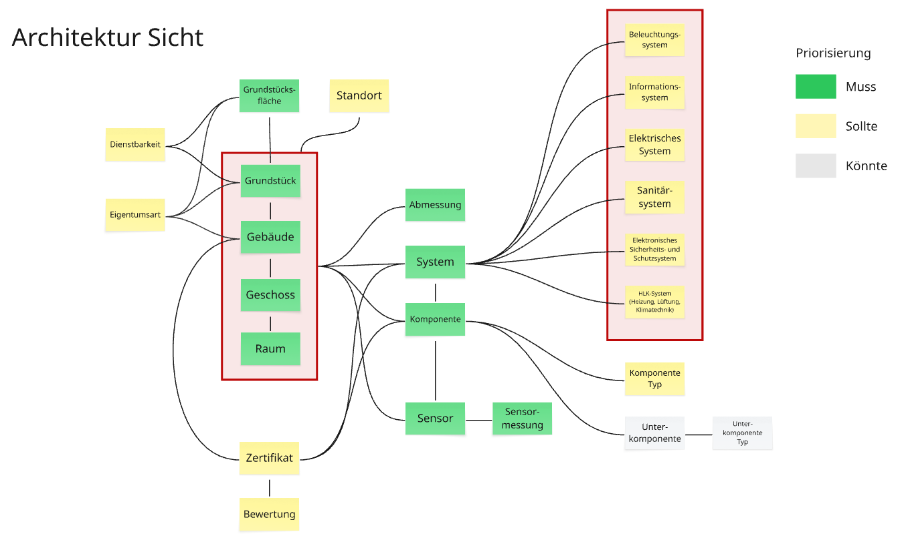
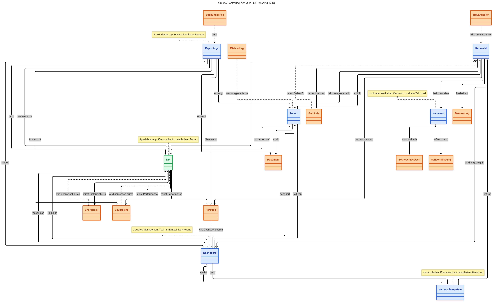

# Studie - Fachliche Sicht IMMO (Archiv)

# 1. Ziel dieses Dokuments

Dieses Dokument schafft die Grundlagen für ein einheitliches Verständnis der Immobiliendaten im BBL. Es definiert zentrale Geschäftsobjekte wie Gebäude, Räume und Mietverträge so, dass alle Fachbereiche und IT-Systeme mit denselben Konzepten arbeiten können. Als verbindliches Referenzwerk unterstützt es die abteilungsübergreifende Zusammenarbeit, macht uns unabhängiger von einzelnen IT-Systemen und sichert die langfristige Qualität unserer Immobiliendaten. Es richtet sich an Fach- und IT-Verantwortliche gleichermassen und dient als Brücke zwischen fachlichen Anforderungen und deren technischer Umsetzung.

## 1.1 Lösungsarchitektur IMMO

Bild Links: Zielbild IT Architektur IMMO

## 1.2 Bedeutung von Standards

- Zu definieren

Bild links: The Blind Men and the Elephant. [Quelle](https://www.researchgate.net/figure/The-Blind-Men-and-the-Elephant_fig1_290127733)

# 2. Unser Ansatz zur Immobiliendatenmodellierung - Vorgehen

Ein einheitliches Datenmodell schafft die "gemeinsame Sprache" für unser Immobilienmanagement. Wenn Fachplaner, Objektmanager, Projektentwickler, oder Datenmanager über ein "Gebäude" sprechen, müssen sie dasselbe meinen – unabhängig vom verwendeten IT-System. Unsere Geschäftsobjekte werden hier klar definiert und von ihrer technischen Umsetzung entkoppelt. [Die Grundlage dafür bilden Gesetzgrundlagen und bewährte Fachliche Standards (Link Übersicht relevanter Standards).](https://confluence.bbl.admin.ch/x/mYycD)

Dabei verfolgen wir fünf zentrale Ziele:

1. **Fach ist im Lead:** Die Fachliche Sicht wird vom Fachbereich definiert, unabhängig von IT-Systemen wie ERP und bleibt stabil bei technischen Veränderungen. Die Beschreibung ist lösungsneutral.
2. **Standardkonformität:** Konsequente Ausrichtung an anerkannten Branchenstandards (ISO, RICS, SIA) und Erfüllung aller rechtlichen Vorgaben des Bundes.
3. **Einheitliche Terminologie:** Etablierung einer verbindlichen Fachsprache für Immobiliendaten, die konsistent in allen Bereichen und Systemen verwendet wird.
4. **Prozessorientierung:** Unterstützung realer Geschäftsprozesse über den gesamten Lebenszyklus von Immobilien, mit Fokus auf praktische Anwendungsfälle.
5. **Legacy-Kompatibilität:** Integration bestehender Systemelemente in den Standard, auch wenn diese nicht den Best Practices entsprechen. Technisch verankerte Konzepte müssen berücksichtigt werden, selbst wenn sie aus fachlicher Sicht nicht optimal sind. Beispiel "Architekturobjekt" in SAP RE-FX.

# 3. Domänengruppen unserer Geschäftsobjekte - Empfehlung

Die Geschäftsobjekte sind in thematische Domänengruppen organisiert, die den natürlichen Zusammenhängen im Immobilienmanagement folgen:

1. **Dokumentation**: Strukturierte Erfassung und Verwaltung aller geschäftsrelevanten Dokumente
2. **Architektur Sicht (Digital Twin)**: Physische Strukturen von Immobilien (Grundstücke, Gebäude, Räume)
3. **Mietermanagement (Nutzungssicht):** Nutzungs- und vermietungsbezogene Aspekte
4. **Objektmanagement**: Bewirtschaftung und Instandhaltung
5. **Projektmanagement**: Planung, Steuerung und Realisierung von Bauvorhaben
6. **Energie und Ressourcen**: Verbrauchsdaten, Emissionen und Nachhaltigkeitsaspekte
7. **Finanzen**: Buchhalterische und wirtschaftliche Perspektive
8. **Portfolio- und Asset-Management**: Strategische Sicht auf das Immobilienportfolio
9. **Controlling, Analytics und Reporting (Management Information System MIS)**: Führungs- und Entscheidungsunterstützung
10. **Workspace Management (Benutzer- und Kundenerfahrung):** Zu definieren

Diese Gruppierung ermöglicht es, zusammengehörige Konzepte aus fachlicher Perspektive zu bündeln, unabhängig von konkreten Anwendungssystemen, und erleichtert so das Verständnis der komplexen Beziehungen im Immobilienmanagement.

Bild: Vorschlag Domänengruppen IMMO

# 4. Fachliches Objektmodell: Standardkonformes Begriffsverzeichnis

Unser Begriffsverzeichnis definiert alle relevanten Immobilienkonzepte in einer einheitlichen, standardkonformen Sprache. Es legt für jedes Geschäftsobjekt (z.B. Gebäude, Mietvertrag) eine verbindliche Definition fest, die auf Branchenstandards basiert und systemunabhängig gültig ist. Die nach Fachdomänen organisierte Struktur ermöglicht schnelles Auffinden relevanter Begriffe und schafft eine gemeinsame Basis für Fach- und IT-Bereiche. Als "Single Source of Truth" für Immobilienbegriffe reduziert es Missverständnisse und sichert die Datenqualität über alle Systeme hinweg.

## 4.1 Gruppe: Dokumentation

Die Domänengruppe "Dokumentation" umfasst alle Prozesse und Standards zur strukturierten Erfassung, Verwaltung und Archivierung geschäftsrelevanter Dokumente im Immobilienbereich gemäss eCH-0039. Sie gewährleistet die rechtssichere Organisation von Dossiers und verschiedenen Dokumenttypen über den gesamten Lebenszyklus von Immobilienobjekten und bildet damit das Fundament für ein effektives Informationsmanagement.

- **Status:** Entwurf

**Fachliches Gremium (Vorschlag):**

- Ein/e Vertreter/in aus "Service Center" (Bereich Geschäftsentwicklung) , falls dort spezifische GEVER-Fachspezialisten (Acta Nova) angesiedelt sind und für die übergreifende Dokumentationsstrategie relevant sind. (z.B. Bühlmann, Bianca; Caraccio, Nicola)
- Frauenknecht, Isabel (Assistentin Programm SUPERB und Prozessmasterin, Amtsgeschäfte und Geschäftssteuerung)  (aufgrund möglicher Prozessüberschneidungen und GEVER-Kenntnisse)
- Ein/e Vertreter/in aus "Kompetenzzentrum Beschaffungswesen Bund und Rechtsdienst BBL" zur Sicherstellung der rechtlichen Aspekte. (z.B. Gygi, Bruno; Remund, Michèle; Bernal, Moritz)

Bild: Geschäftsobjekt der Gruppe Dokumentation als UML

|  | Term | Term Beschreibung | Term Kategorie | Term Quelle | Relationen | Status | Kommentar |
| --- | --- | --- | --- | --- | --- | --- | --- |
| 1 | Dossier | eCH-0039: in Dossier entspricht grundsätzlich einem Geschäft, wobei die Dossierbildung auf der Grundlage des Ordnungssystems erfolgt und die Grundstruktur durch Zusammenfassen artverwandter Geschäfte bzw. durch Aufteilung von Dossiers in Unterdossiers den jeweiligen Bedürfnissen angepasst werden kann.  *Synonyme: Dossier, Akte, Geschäftsfall, Vorgang, Ordner, Record*  TERMDAT:   - GEV09 - GEVER Terminologie: <https://www.termdat.bk.admin.ch/entry/67173> | Geschäftsobjekt  Fachliche Sicht | Domänengruppe:   - Dokumentation   Fachliche Standards:   - eCH-0039 (Schnittstelle Dossiermanagement) - KBOB/IPB (Koordinationskonferenz der Bau- und Liegenschaftsorgane der öffentlichen Bauherren/Interessengemeinschaft privater professioneller Bauherren)   Fachanwendung:   - DALA (IBM FileNet) - ActaNova (GEVER) - CDE Bund | - Dokument - Gebäude - Bauprojekt | OK | **Term fixiert in SUPERB PI 26.1**  Fachliche ID:  Dossier ID entsprechen internen Standards  *ODER*  Gebäude ID  Beispiel Ausprägung (Typen):   - Hauptdossier - Subdossier - Projektdossier - Objektdossier - Gebäudedossier - Bauwerksdossier - Vertragsdossier - Unterhaltsdossier - Etc. |
| 2 | Dokument | eCH-0039: GEVER-Objekt, das aus einer Datei und deren Metadaten besteht.  *Synonyme: Unterlage, Schriftstück, Informationseinheit, Dokumentationseinheit, Akte*  TERMDAT:   - GEV09 - GEVER Terminologie: <https://www.termdat.bk.admin.ch/entry/67200> | Geschäftsobjekt  Fachliche Sicht | Domänengruppe:   - Dokumentation   Gesetzliche Grundlagen:   - TBD   Fachliche Standards:   - eCH-0039 (Schnittstelle Dossiermanagement) - KBOB/IPB (Koordinationskonferenz der Bau- und Liegenschaftsorgane der öffentlichen Bauherren/Interessengemeinschaft privater professioneller Bauherren)   Interne Weisungen:   - TBD   Fachanwendung:   - ActaNova (GEVER) - DALA (IBM FileNet) - CDE Bund | - Dossier - Raum - Komponente - System - Gebäudetechnische Analage | OK | **Term fixiert in SUPERB PI 26.1**  Fachliche ID:  Dokument ID  *ODER*  [Dokument Typ (KBOB Code)](https://www.kbob.admin.ch/de/bauwerksdokumentation-im-hochbau)  Beispiel Ausprägung (Typen):    - Projekthandbuch - Bewilligung - Kreditantrag - Grundrissplan - Detailplan Heizung - Etc. |
| 3 | Bauwerksdokumentation | KBOB: Dokumentation, die einen klar definierten Umfang kommerzieller, technischer, administrativer, digitaler, physischer Dokumente und Daten umfasst, welche zur Erfüllung bzw. Ausübung von Aufgaben während des gesamten Lebenszyklus eines Bauwerks erzeugt und genutzt werden.  *Synonyme: Gebäudedokumentation, Immobiliendokumentation, Objektdokumentation, Lebenszyklus-Dokumentation, Gebäudeakte*  TERMDAT:   - HOCHB16 - Terminologie der Bauwerksdokumentation im Hochbau: <https://www.termdat.bk.admin.ch/entry/440719> | Fachlicher Begriff (Spezialisierung) | Domänengruppe:   - Dokumentation   Gesetzliche Grundlagen:   - TBD   Fachliche Standards:   - eCH-0039 (Schnittstelle Dossiermanagement) - KBOB/IPB (Koordinationskonferenz der Bau- und Liegenschaftsorgane der öffentlichen Bauherren/Interessengemeinschaft privater professioneller Bauherren)   Interne Weisungen:   - TBD   Fachanwendung:   - ActaNova (GEVER) - DALA (IBM FileNet) - CDE Bund | - Dossier | OK | Fachlicher Begriff, Typ von Dossier |
| 4 | Projektdokumentation | KBOB: Definierter Umfang von kommerziellen, technischen und administrativen Dokumenten und Daten aus den Projektakten der Phasen 1-5.  *Synonyme:* Bauprojektdokumentation, Projektakten, Projektdossier, Projektunterlagen, Bauprojektakten  TERMDAT:   - HOCHB16 - Terminologie der Bauwerksdokumentation im Hochbau: <https://www.termdat.bk.admin.ch/entry/441459> | Fachlicher Begriff (Spezialisierung) | Domänengruppe:   - Dokumentation   Gesetzliche Grundlagen:   - TBD   Fachliche Standards:   - eCH-0039 (Schnittstelle Dossiermanagement) - KBOB/IPB (Koordinationskonferenz der Bau- und Liegenschaftsorgane der öffentlichen Bauherren/Interessengemeinschaft privater professioneller Bauherren)   Interne Weisungen:   - TBD   Fachanwendung:   - ActaNova (GEVER) - DALA (IBM FileNet) - CDE Bund | - Dossier | OK | Fachlicher Begriff, Typ von Dossier  Teil von Bauwerksdokumentation |
| 5 | Objektdokumentation | KBOB: Teil der Bauwerksdokumentation, die einen definierten Umfang von kommerziellen, technischen und administrativen Dokumenten und Daten aus den Objektakten der Phasen 1 - 6 enthält und die die Objektsicht auf ein Bauwerk beschreibt und der Planung und operativen Umsetzung der Bewirtschaftung dient.  *Synonyme: Bewirtschaftungsakten, Gebäudedokumentation, Immobiliendokumentation,, Technische Dokumentation, Anlagen Dokumentation.*  TERMDAT:   - HOCHB16 - Terminologie der Bauwerksdokumentation im Hochbau: <https://www.termdat.bk.admin.ch/entry/441445> | Fachlicher Begriff (Spezialisierung) | Domänengruppe:   - Dokumentation   Gesetzliche Grundlagen:   - TBD   Fachliche Standards:   - eCH-0039 (Schnittstelle Dossiermanagement) - KBOB/IPB (Koordinationskonferenz der Bau- und Liegenschaftsorgane der öffentlichen Bauherren/Interessengemeinschaft privater professioneller Bauherren)   Interne Weisungen:   - TBD   Fachanwendung:   - ActaNova (GEVER) - DALA (IBM FileNet) - CDE Bund | - Dossier | OK | Fachlicher Begriff, Typ von Dossier  Teil von Bauwerksdokumentation |
| 6 | Archivdokumentation | KBOB: Teil der Bauwerksdokumentation, der im Minimum einen durch die verantwortlichen Organe definierten Umfang von kommerziellen, technischen und administrativen aufbewahrungspflichtigen Dokumenten und Daten aus der Bauprojektdokumentation und der Objektdokumentation umfasst, welche im laufenden Betrieb nicht mehr benötigt werden, für das Verständnis des Bauwerks aber von Bedeutung sind und darum aufbewahrt werden müssen.  *Synonyme: Aufbewahrungsdokumentation, Bauwerksarchiv, Langzeitarchiv, Dokumentenarchiv, Aufbewahrungspflichtige Dokumentation*  TERMDAT:   - HOCHB16 - Terminologie der Bauwerksdokumentation im Hochbau: <https://www.termdat.bk.admin.ch/entry/441449> | Fachlicher Begriff (Spezialisierung) | Domänengruppe:   - Dokumentation   Gesetzliche Grundlagen:   - TBD   Fachliche Standards:   - eCH-0039 (Schnittstelle Dossiermanagement) - KBOB/IPB (Koordinationskonferenz der Bau- und Liegenschaftsorgane der öffentlichen Bauherren/Interessengemeinschaft privater professioneller Bauherren)   Interne Weisungen:   - TBD   Fachanwendung:   - ActaNova (GEVER) - DALA (IBM FileNet) - CDE Bund | - Dossier | OK | Fachlicher Begriff, Typ von Dossier  Teil von Bauwerksdokumentation |
| 7 | CAFM Basisplan | KBOB: Standardisierte CAD-Zeichnung als Grundlage für das Computer Aided Facility Management. Korrekter fachlicher Begriff für Architekturzeichnungen/Grundrisse im Immobilienmanagement entsprechend KBOB-Standards. | Fachlicher Begriff (Spezialisierung) | Domänengruppe:   - Dokumentation   Fachliche Standards:   - BBL CAD Weisung - TBD - KBOB/IPB (Koordinationskonferenz der Bau- und Liegenschaftsorgane der öffentlichen Bauherren/Interessengemeinschaft privater professioneller Bauherren)   Interne Weisungen:   - TBD   Fachanwendung:   - AutoCAD - DALA (IBM FileNet) | - Typ von Dokument | OK | Fachlicher Begriff, Typ von Dossier  Teil von Bauwerksdokumentation |

Tabelle: Domänengruppe Dokumentation

## 4.2 Gruppe: Architektur Sicht (Digital Twin)

Die Architektur Sicht bildet die baulich-technische Perspektive auf Immobilienobjekte und basiert auf gesetzlichen Grundlagen wie Grundbuchverordnung, Zivilgesetzbuch, VGWR und der ISO 16739 (Building Information Management BIM). Sie definiert und verwaltet die physischen Strukturen von Immobilien - von Grundstücken über Gebäude bis hin zu Geschossen, Räumen und technischen Systemen - und stellt damit die bauliche Grundlage für alle anderen fachlichen Perspektiven des Immobilienmanagements dar.

- **Status:** Entwurf

**Fachliches Gremium (Vorschlag):**

- Züger, Daniel (Leiter Immobilienmanagement, Immobilienmanagement)
- Spring, Walter (Leiter Portfoliomanagement, Portfoliomanagement)
- Balaj, Mirëjeta (Leiterin Digital Real Estate und Support, Digital Real Estate und Support)
- Strathaus, Thorsten (Lead BIM Manager und Projektleiter, Digital Real Estate und Support)
- Gieske, Petra (Daten- und Flächenbewirtschaftung, Digital Real Estate und Support)
- Rasner, David (Business- und Data-Analyst/in, Digital Real Estate und Support)

**Zusätzlich vorgeschlagene interne BBL-Mitglieder:**

- Ein/e Vertreter/in aus "Projektmanagement", z.B. Winkler, Hanspeter; Suter, Barbara
- Ein/e Vertreter/in aus "Objektmanagement", z.B. Müller, Daniela; Zbinden, Rolf)
- Ein/e Vertreter/in aus "Fachberatung" (Bereich Bauten) , insbesondere mit Expertise in Baustandards und technischen Aspekten. (z.B. Gamper, Felix)

Bild Links: Übersicht wichtigster Geschäftsobjekte in der Gruppe Architektur Sicht

Bild: Geschäftsobjekte der Gruppe Physische Sicht (Digital Twin) als UML

|  | Term | Term Beschreibung | Term Kategorie | Term Quelle | Relationen | Status | Kommentar |
| --- | --- | --- | --- | --- | --- | --- | --- |
| 1 | Dienstbarkeit | Dienstbarkeit  ZGB: Beschränktes dingliches Recht, aufgrund dessen dem Berechtigten der Gebrauch und/oder der Genuss einer Sache zusteht.  *Synonyme: Servitute, Grundlast, beschränktes dingliches Recht (bezogen auf Dienstbarkeit als Beispiel einer Eigentumsart)* | Fachlicher Begriff (Spezialisierung) |  | - Grundstück - Grundstückfläche | Zu prüfen | Nicht klar was der korrekte Begriff für ein Gesamtobjekt ist  E-CH sagt "Immobilie", für Alles was mit Sachrecht und Gebäuden, Grundstücken, etc. zu tun hat. |
| 2 | Eigentumsart | **Grundeigentum** ← Empfehlung (Datenmanagement)  ZGB Art. 655: Gegenstand des Grundeigentums sind die Grundstücke. Grundstücke im Sinne dieses Gesetzes sind: 1. Liegenschaften; 2. die in das Grundbuch aufgenommenen selbständigen und dauernden Rechte; 3. die Bergwerke; 4. die Miteigentumsanteile an Grundstücken.  *ODER*  Immobilie  eCH-0129: Sammelbegriff für Grundstücke, Gebäude und Wohnungen, die im Gebäude- und Wohnungsregister (GWR) erfasst werden.  *ODER*  Liegenschaft  ZGB Art. 655 Abs. 2 Ziff. 1: Grundstücke im Sinne des Grundeigentums, definiert als räumlich abgegrenzte Teile der Erdoberfläche mit allem, was durch Gesetz dazugehört.  TERMDAT   - GRF19 - Grundbuch-Terminologie - SACH18 (Terminologie des Sachenrechts) | Fachlicher Begriff  Attribut | Domänengruppe:   - Architektur Sicht (Digital Twin)   Gesetzliche Grundlage:   - Schweizerisches Zivilgesetzbuch (ZGB), insbesondere der vierte Teil "Das Sachenrecht" (Art. 641-977) - Grundbuchverordnung (GBV) - Bundesgesetz über das bäuerliche Bodenrecht (BGBB) für landwirtschaftliche Grundstücke - Raumplanungsgesetz (RPG) für die Nutzung der Grundstücke   Fachliche Standards:   - eCH-0129 (Datenstandard Objektwesen) - eCH-0206: INTERLIS-Datenmodell für das Kataster der öffentlich-rechtlichen Eigentumsbeschränkungen (ÖREB-Kataster) - eCH-0131: Meldungen Grundbuch an Steuerbehörden - eCH-0118: GWR-Schnittstelle zum Gebäude- und Wohnungsregister   Fachanwendung:   - ActaNova (GEVER) - Grundbuch | - Grundstück - Gebäude - Parkplatz | Zu prüfen | Nicht klar was der korrekte Begriff für ein Gesamtobjekt ist |
| 3 | Standort | ISO 16739: Räumlich zusammenhängende, organisatorisch verwaltete Einheit (z.B. Campus, Areal), die mehrere Gebäude/Grundstücke umfasst; übergeordnete geografisch-administrative Gruppierung.  *Synonyme: Campus, Arealobjekt, Liegenschaftskomplex, Immobilienensemble, IfcSite*  TERMDAT   - TBD | Geschäftsobjekt  Fachliche Sicht |  | - Grundstück - Gebäude - Wirtschaftseinheit - Bauprojekt | Zu prüfen | Fachliche ID:   - Standort ID |
| 4 | Grundstück | **Grundstück ←**Empfehlung  Schweizerisches Zivilgesetzbuch, 655 Abs. 1 (SR 210): Eine Liegenschaft oder ein in das Grundbuch aufgenommenes selbständiges und dauerndes Rechts, ein Bergwerk oder ein Miteigentumsanteil an einem Grundstück.  *ODER*  **Grundstück (GR)**  SAP RE-FX (Real Estate Flexible): Basiselement der Immobilienstruktur im SAP-System, das ein rechtlich definiertes Stück Land repräsentiert, mit eigener ID, Flächenangaben, Lagekoordinaten und rechtlichen Eigenschaften, auf dem Gebäude stehen können.  *Synonyme: Parzelle, Liegenschaft, Flurstück, Land Parcel*  TERMDAT   - TBD | Geschäftsobjekt  Fachliche Sicht | Domänengruppe:   - Architektur Sicht (Digital Twin)   Gesetzliche Grundlage:   - [Schweizerisches Zivilgesetzbuch (ZGB) Art. 655-712](https://www.termdat.bk.admin.ch/entry/67240) - TERMDAT - Grundbuchverordnung (GBV) - Raumplanungsgesetz (RPG) zu prüfen   Fachliche Standards:   - ISO 16739 (Industry Foundation Classes IFC) - IBPDI (International Building Performance & Data Initiative) - RCIS (Royal Institution of Chartered Surveyors)   Fachanwendung:   - SAP RE-FX (Real Estate Flexible) - CDE Bund - BBL GIS IMMO - ÖREB Kataster (nur Schweiz) - Amtliche Vermessung (nur Schweiz)   TERMDAT zu prüfen:   - GRF18 (Grundbuch-Terminologie) - SAPRE07 (Terminologie Immobilienmanagement SAP-RE) | - Eigentumsart - Dienstbarkeit - Grundstücksfläche - Gebäude - Bauprojekt - Portfolio - Wirtschaftseinheit | OK | **Term fixiert in SUPERB PI 26.1**  Fachliche ID:   - Grundstück ID - EGRID (nur Schweiz) |
| 5 | Grundstücksfläche (Bodenbedeckung) | Verordnung über die amtliche Vermessung (VAV, SR 510.622.2): Die Bodenbedeckung ist eine Informationsebene der amtlichen Vermessung, in der Objekte wie Gebäude, befestigte Flächen, humusierte Flächen, Wasserflächen, bestockte Flächen und vegetationslose Flächen zusammengefasst sind..  *Synonyme: Aussenfläche, Bodenbedeckung, Geländeoberfläche, Aussenraumtyp, versiegelte Fläche, Grünfläche, Gebäude, Parkplatz*  TERMDAT   - TBD | Geschäftsobjekt  Fachliche Sicht | Domänengruppe:   - Architektur Sicht (Digital Twin)   Gesetzliche Grundlage:   - TBD   Fachliche Standards:   - TBD   Fachanwendungen:   - RE-FX (Typ von Architekturobjekt (AO)) - BBL GIS IMMO - Grünflächeninventar - Kantonale Amtliche Vermessung - Bodenabdeckung | - Grundstück - Architekturobjekt (AO) | OK | Neu - Gap, zu prüfen   Fachliche ID:   - AOID (Architekturobjekt ID)   Ausprägung (Typen):    - Gebäude/Überbaute Flächen - Befestigte Flächen (Strassen, Wege, Plätze, Parkplätze, etc.) - Humusierte Flächen (Gartenanlagen, Wiesen, Rasen, etc.) - Gewässer (stehende/fliessende Gewässer, etc.) - Bestockte Flächen (Wald, Baumgruppen, Einzelbäume, etc.) - Vegetationslose Flächen (Fels, Geröll, Sand, etc.) - Sportanlagen/Spielplatzflächen - Bepflanzte Flächen (Beete, Hecken, etc.) |
| 6 | Parkplatz | Ausgewiesene Fläche zum Abstellen von Fahrzeugen mit definierten Regeln; kann öffentlich oder privat sein.  Team, Ideen für Grundlagen:   - Vss-Normen (Schweizerischer Verband der Strassen- und Verkehrsfachleute): - Vss 40 291 "Parkierung; Geometrie der Parkierungsanlagen" - SIA 500 "Hindernisfreie Bauten" (für Behindertenparkplätze) - ISO 16739 (IFC Standard) - Verordnung über die amtliche Vermessung (VAV, SR 510.622.2) - wo Parkplätze als Teil der Bodenbedeckungsarten definiert sein könnten - KBOB-Empfehlungen (Koordinationskonferenz der Bau- und Liegenschaftsorgane der öffentlichen Bauherren)   *Synonyme: Stellplatz, Abstellplatz, Parkfläche*  TERMDAT   - TBD | Geschäftsobjekt  Fachliche Sicht | Domänengruppe:   - Architektur Sicht (Digital Twin)   TERMDAT zu prüfen: | - Grundstück - Grundstücksfläche - Architekturobjekt (AO) - Eigentumsart - Standort - Wirtschaftseinheit | Zu prüfen | Neu - Gap, zu prüfen  Team: Wird in Reservierungssystemen genutzt.  Beispiel Ausprägung (Typen):    - Aussenparkplatz - Tiefgaragenparkplatz - Behindertenparkplatz - Elektrofahrzeugparkplatz - Dienstfahrzeugparkplatz - Etc.   Fachliche ID: Parkplatz ID |
| 7 | Gebäude | **Gebäude** ← Empfehlung (Gesetzliche Grundlage)  Verordnung über das eidgenössische Gebäude- und Wohnungsregister (VGWR) Art. 2: Ein Gebäude ist ein auf Dauer angelegter, mit einem Dach versehener, mit dem Boden fest verbundener Bau, der Personen aufnehmen kann und zu Wohnzwecken oder Zwecken der Arbeit, der Ausbildung, der Kultur, des Sports oder jeg¬licher anderer menschlicher Tätigkeit dient; ein Doppel-, Gruppen- und Reihenhaus zählt ebenfalls als ein Gebäude, wenn es einen eigenen Zugang von aussen hat und wenn zwischen den Gebäuden eine senkrechte vom Erdgeschoss bis zum Dach reichende tragende Trennmauer besteht.  *ODER*  Gebäude (GE)  SAP RE-FX (Real Estate Flexible): Hierarchisch strukturiertes Immobilienobjekt im SAP-System, das als bauliche Einheit mit definierten technischen und wirtschaftlichen Eigenschaften verwaltet wird und als Container für Geschosse und Räume dient.  *Synonyme: Bauwerk, Immobilie, Bau, Hochbau, IfcBuilding, Gebäude (GE)*  TERMDAT:   - SAPRE07 - Terminologie des Immobilienmanagements (SAP RE): <https://www.termdat.bk.admin.ch/entry/39047> | Geschäftsobjekt  Fachliche Sicht | Domänengruppe:   - Architektur Sicht (Digital Twin)   Gesetzliche Grundlage:   - Verordnung über das eidgenössische Gebäude- und Wohnungsregister (VGWR) Art. 2   Fachliche Standards:   - ISO 16739 (Industry Foundation Classes IFC) - IBPDI (International Building Performance & Data Initiative) - RCIS (Royal Institution of Chartered Surveyors)   Fachanwendung:   - SAP RE-FX (Real Estate Flexible) - CDE Bund - BFS Gebäude und Wohnregister GWR - BBL GIS IMMO   TERMDAT zu prüfen:   - BAU17 (Terminologie des Bauwesens) - BBL08 (Terminologie des Immobilienmanagements) - SAPRE07 (Terminologie Immobilienmanagement SAP-RE) | - Grundstück - Eigentumsart - Grundstücksfläche - Wirtschaftseinheit - Portfolio - Bauprojekt - Geschoss - System - Dossier - Betriebsmesswert - Zertifikat | OK | **Term fixiert in SUPERB PI 26.1**  Fachliche ID:    - Gebäude ID - Beispiel Gebäude ID (ERP) = 1080/2020/AA - EGID (nur Schweiz) - Beispiel EGID = 2246926 |
| 8 | Architektonisches Objekt (AO) | Architektonisches Objekt (AO)  SAP RE-FX (Real Estate Flexible): Ein Architektonisches Objekt ist Bestandteil der Architektonischen Sicht. Jedes Architektonische Objekt muss einem Architektonischen Objekttypen zugeordnet sein (z.B. Raum oder Gebäude).  *Synonyme: Architektur Sicht, Gebäudeelement, Strukturobjekt, Immobilienelement, Architekturelement, FM-Objekt (Facility Management Objekt), Bauliches Element, RE-Objekt (Real Estate Objekt), Immobilienbaustein*  TERMDAT   - TBD | Geschäftsobjekt  Physische Sicht | AOID (Architekturobjekt ID) | - Bemessung - CAFM Basisplan | OK | **Term fixiert in SUPERB PI 26.1**  Wird im SAP RE-FX (Flexible Real Estate) genutzt  Ausprägung (Typen):    - AO Wirtschaftseinheit - AO Grundstück - AO Gebäude (nicht mit Gebäude zu verwechseln) - AO Ebene (Korrekte Bezeichnung ist Geschoss) - AO Raum - AO Grundstücksfläche (Oder "Bodenabdeckung" in Amtlicher Vermessung, wird im ERP auch für Parkplätze genutzt). |
| 9 | Geschoss | **Geschoss ←**Empfehlung (Fachlicher Standard)  SIA 416 (Flächen und Volumen von Gebäuden): Horizontale Schicht eines Gebäudes, die durch Böden und Decken begrenzt wird und eine festgelegte Höhenlage besitzt, wobei zwischen Unter-, Erd-, -Ober und Dachgeschossen unterschieden wird.  *ODER*  Stockwerk  VGWR (Verordnung über das eidgenössische Gebäude- und Wohnungsregister): Horizontale Gliederungsebene eines Gebäudes mit einer bestimmten Lage im Gebäude (unterirdisch, ebenerdig oder oberirdisch), die eine oder mehrere Wohnungen enthalten kann.  *Synonyme: AO Ebene, Floor, Stockwerk, Level, IfcStorey, Storey, Ebene*  TERMDAT   - TBD | Geschäftsobjekt  Fachliche Sicht | Domänengruppe:   - Architektur Sicht (Digital Twin)   Gesetzliche Grundlage:   - Verordnung über das eidgenössische Gebäude- und Wohnungsregister (VGWR) Art. 2   Fachliche Standards:   - ISO 16739 (Industry Foundation Classes IFC) - IBPDI (International Building Performance & Data Initiative) - RCIS (Royal Institution of Chartered Surveyors)   Domänenspezifische Standards:   - SIA 416 (Flächen und Volumen von Gebäuden)   Fachanwendung:   - SAP RE-FX (Real Estate Flexible) - CDE Bund   TERMDAT zu prüfen:   - BBL08 (Terminologie des Immobilienmanagements) - BAU17 (Terminologie des Bauwesens) | - Gebäude - Raum - Komponente - System - CAFM Basisplan | OK | **Term fixiert in SUPERB PI 26.1**  Fachliche ID: Geschoss ID  Beispiel Ausprägung (Typen):   - Untergeschoss (UG) - Erdgeschoss (EG) - Obergeschoss (OG) - Dachgeschoss (DG) - Zwischengeschoss/Mezzanin - Technikgeschoss - Sockelgeschoss - Attika - Etc. |
| 10 | Zone | ISO 16739: Räumlich oder funktional definierter Bereich, nach technischen, organisatorischen oder sicherheitsrelevanten Kriterien abgegrenzt (z.B. Klima-, Brand-, Sicherheitszone); kann Nutzungseinheiten überschneiden.  *Synonyme: Bereich, Funktionsbereich, Steuerungszone, Regelungszone*  TERMDAT   - TBD | Geschäftsobjekt  Fachliche Sicht |  | - Geschoss - Raum - Dokument | Zu prüfen | Fachliche ID:   - Zone ID   Beispiel Ausprägung (Typen):    - Klimazone - Brandschutzzone - Sicherheitszone - Automationszone - Beleuchtungszone - Funktionszone - Lärmschutzzone - Zugangskontrollzone - Etc. |
| 11 | Raum | ISO 16739: Ein Raum ist ein tatsächlich oder theoretisch begrenzter Bereich oder ein Volumen. Räume sind Bereiche oder Volumen, die bestimmte Funktionen innerhalb eines Gebäudes erfüllen.  *Synonyme: AO Raum, Raum, Space, IfcSpace, Zimmer*  TERMDAT   - TBD | Geschäftsobjekt  Fachliche Sicht |  | - Komponente - Sensor - Dokument | OK | **Term fixiert in SUPERB PI 26.1**  Fachliche ID:  Raum ID  Raum =  AO Raum (ERP) |
| 12 | Bemessung | SIA 400, SIA 414: Quantitativ messbare räumliche oder physikalische Eigenschaft eines Gebäudes/Bauteils/Raums; Basis für Berechnungen, Bewertungen, Analysen.  *Synonyme: Bemessung, Abmessung, Dimension, Mass, Parameter, Kennwert, Base Quantity*  TERMDAT   - TBD | Geschäftsobjekt  Fachliche Sicht |  | - Grundstück - Grundstücksfläche - Gebäude - Raum | OK | **Term fixiert in SUPERB PI 26.1**  Die Komplexität mit Metadaten zur Datenqualität und -herkunft macht es zu einer eigenständig verwalteten Entität  Fachliche ID:   - AOID (Architekturobjekt ID im SAP RE-FX)   Beispiel Ausprägung (Typen):    - Stückzahl, Fläche, Volumen, Höhe - Bruttogeschossfläche - Gebäudehöhe - Raumvolumen - Anzahl Arbeitsplätze - Etc. |
| 13 | Gebäudetechnische Anlage | SIA 2048:2015 (Energetische Betriebsoptimierung): Gesamtheit der Anlagen, die ortsfest in Gebäuden verbunden sind (Elektroanlagen, Kommunikationsanlagen, Heizungsanlagen, Lüftungs- und Klimaanlagen, Kälteanlagen, Sanitäranlagen, Transportanlagen usw.).  TERMDAT   - TBD | Fachlicher Begriff (Spezialisierung) |  |  | Entwurf | Fachliche ID:  Anlage ID |
| 14 | System (Anlage) | ISO 16739: Ein System ist eine organisierte Kombination von zusammengehörigen Teilen innerhalb eines AEC-Produkts, die für einen gemeinsamen Zweck oder eine gemeinsame Funktion zusammengestellt sind oder eine Dienstleistung erbringen. Ein System ist im Wesentlichen eine funktional zusammenhängende Ansammlung von Produkten. Die Gruppierungsbeziehung zu einer oder mehreren Instanzen von Produkt (den Systemmitgliedern) wird durch IfcRelAssignsToGroup verwaltet.  *Synonyme: System, Anlage, Gebäudetechnik, TGA-System, Haustechnik, Technischer Platz*  TERMDAT   - TBD | Geschäftsobjekt  Fachliche Sicht |  | - Gebäude - Geschoss - Komponente | Entwurf | Fachliche ID:  System ID |
| 15 | Beleuchtungssystem | Gesamtheit aller Komponenten zur Bereitstellung, Steuerung und Regelung der künstlichen Beleuchtung in Gebäuden. Umfasst Leuchten, Leuchtmittel, Schalter, Sensoren, Steuerungseinheiten sowie deren Verbindungselemente gemäss gesetzlicher und normativer Anforderungen zur Raumausleuchtung.  *Synonyme: Beleuchtungsanlage, Lichtsteuerungssystem, Illuminationssystem, Lichttechnisches System*  TERMDAT   - TBD | Fachlicher Begriff  (Spezialisierung) |  | - System   Untergruppe von System | Entwurf | Fachliche ID:  System ID  Beispiel Ausprägung (Typen):    - Grundbeleuchtung Verwaltungsgebäude - Sicherheits- und Notbeleuchtung - Energieeffiziente Beleuchtungssysteme - Aussen- und Objektbeleuchtung - Sicherheits-/Notbeleuchtung |
| 16 | Gebäudeinformationssystem | System zur Erfassung, Verarbeitung, Speicherung und Bereitstellung von gebäuderelevanten Informationen und Daten. Umfasst die physische Netzwerkinfrastruktur, Server, Endgeräte und Softwarekomponenten, die für den Betrieb des Gebäudes und die Kommunikation zwischen technischen Anlagen erforderlich sind.  *Synonyme: Technisches Informationssystem, Gebäude-IT-System, Informations- und Kommunikationssystem, Datenverarbeitungssystem*  TERMDAT   - TBD | Fachlicher Begriff (Spezialisierung) |  | - System   Untergruppe von System | Entwurf | Fachliche ID:  System ID  Beispiel Ausprägung (Typen):    - Gebäudeleitsystem (GLT) - Dokumentationsmanagementsystem - Gebäudemonitoring - Energiedatenmanagementsystem |
| 17 | Elektrisches System | Gesamtheit aller Komponenten zur Verteilung und Nutzung von elektrischer Energie im Gebäude. Umfasst Haupt- und Unterverteilungen, Verkabelung, Energieumwandlung, Steckdosen, Schutzeinrichtungen und alle elektrischen Verbraucher, die fest mit dem Gebäude verbunden sind sowie deren zugehörige Steuerungs- und Regelungstechnik.  *Synonyme: Elektrotechnisches System, Stromversorgungssystem, Elektrische Anlage, Elektroinstallation*  TERMDAT   - TBD | Geschäftsobjekt  Fachliche Sicht |  | - System   Untergruppe von System | Entwurf | Fachliche ID:  System ID  Beispiel Ausprägung (Typen):    - Hauptenergieversorgung - Notstromversorgung - Photovoltaiksysteme (Bundesbauten) - Elektroinstallationen nach NIBT |
| 18 | Sanitärsystem | Gesamtheit aller Einrichtungen zur Wasserversorgung, Abwasserentsorgung und sanitären Ausstattung eines Gebäudes. Umfasst Rohrleitungen, Armaturen, Sanitärobjekte (WCs, Waschbecken, Duschen etc.), Warmwasserbereitung, Druckerhöhungsanlagen, Abwasserbehandlung und deren Verbindungselemente gemäss hygienischen und gebäudetechnischen Anforderungen.  *Synonyme: Sanitärtechnisches System, Sanitäranlage, Wasserversorgungs- und Abwassersystem, Sanitärinstallation*  TERMDAT   - TBD | Geschäftsobjekt  Fachliche Sicht |  | - System   Untergruppe von System | Entwurf | Fachliche ID:  System ID  Beispiel Ausprägung (Typen):    - Trinkwasserversorgung - Abwasserentsorgung - Wassersparende Sanitärtechnik - Legionellenschutz-Systeme |
| 19 | Sicherheits- und Schutzsystem | Integrierte technische Einrichtungen zum Schutz von Personen und Sachwerten innerhalb eines Gebäudes. Umfasst Zugangskontrollsysteme, Einbruchmeldeanlagen, Videoüberwachungsanlagen, Brandmeldeanlagen, Notrufsysteme, Fluchtwegleitsysteme und Evakuierungssysteme sowie deren zugehörige Steuerungs- und Kommunikationstechnik.  *Synonyme: Elektronisches Sicherheits- und Schutzsystem, Gebäudesicherheitssystem, Sicherheitstechnisches System, Security System*  TERMDAT   - TBD | Geschäftsobjekt  Fachliche Sicht |  | - System   Untergruppe von System | Entwurf | Fachliche ID:  System ID   Beispiel Ausprägung (Typen):    - Zutrittskontrollsystem Bundesgebäude - Brandmelde- und Löschanlagen - Videoüberwachung öffentlicher Bereiche - Evakuierungssysteme |
| 20 | HLK-System (Heizung, Lüftung, Klima) | Gesamtheit aller Anlagen und Komponenten zur Erzeugung, Verteilung und Regelung von thermischer Energie zur Raumkonditionierung. Umfasst Wärmeerzeuger (Heizkessel, Wärmepumpen), Kälteerzeuger, Wärmeverteilsysteme, Lüftungsanlagen mit Luftführung, Klimageräte, Wärmerückgewinnung und zugehörige Mess-, Steuerungs- und Regelungstechnik gemäss energetischer und raumklimatischer Anforderungen.  *Synonyme: HLKK-System (Heizung, Lüftung, Klima, Kälte), Gebäudeklimatisierungssystem, Heizungs-, Lüftungs- und Klimasystem, Raumkonditionierungssystem*  TERMDAT   - TBD | Geschäftsobjekt  Fachliche Sicht |  | - System   Untergruppe von System | Entwurf | Fachliche ID:  System ID  Beispiel Ausprägung (Typen):    - Energieeffiziente Heizsysteme - Kontrollierte Raumlüftung - Gebäudekühlung/Klimatisierung - Wärmerückgewinnung |
| 21 | Komponente (Equipment) | **Komponente ←**Empfehlung (Datenmanagement)  ISO 16739 (Industry Foundation Classes): Physisches Element oder Einheit innerhalb eines Gebäudes oder technischen Systems, das spezifische Funktionen erfüllt, als eigenständiges Objekt identifizierbar ist und Gegenstand von Lebenszyklus-Management sein kann.  ODER  Equipment  SAP PM (Plant Maintenance): Individuell identifizierbares physisches Objekt, das als eigenständige Instandhaltungseinheit verwaltet wird, mit eigener Equipmentnummer, technischen Daten, Wartungshistorie und -plänen, wobei es einem Technischen Platz zugeordnet und in funktionale Strukturen eingebunden werden kann.  TERMDAT   - TBD | Geschäftsobjekt  Fachliche Sicht | Domänengruppe:   - Architektur Sicht (Digital Twin)   Fachliche Standards:   - ISO 16739 (Industry Foundation Classes) - IBPDI (International Building Performance & Data Initiative)   Domänenspezifische Standards:   - SIA 382-1 (Lüftungs- und Klimaanlagen)   Fachanwendung:   - SAP PM (Plant Maintenance) - CDE Bund - Erhaltungsplanung EHP (Wüest-Dimensions)   TERMDAT zu prüfen:   - BBL08 (Terminologie des Immobilienmanagements) zu prüfen - BAU17 (Terminologie des Bauwesens) | - System | OK | **Term fixiert in SUPERB PI 26.1**  Fachliche ID:  Komponente ID  Team: Komponente und Bauteile können ein separates Geschäftsobjekt sein:   - Element = ISO Sprache - Komponente = Haustechnik - Bauteil = Architektur (Konstruktiv)   Beispiel Ausprägung (Typen):   - Bauteile (Träger, Stützen, Decken) - Technikkomponenten (Pumpen, Ventile, Motoren) - Fassadenelemente (Fenster, Paneele, Profile) - Ausstattungselemente (Leuchten, Schalter, Bedienelemente) - Bauprodukte (Dämmmaterialien, Befestigungselemente) - Etc. |
| 22 | Unterkomponente | ISO 16739: Elementarer, nicht sinnvoll teilbarer Baustein einer Komponente mit spezifischer Teilfunktion/Merkmal; kleinste granulare Ebene (materiell, geometrisch, funktional).  *Synonyme: Bauteilkomponente, Element, Einzelteil, Detail, Artikelbestandteil*  TERMDAT   - TBD | Geschäftsobjekt  Fachliche Sicht |  | - Komponente | Im Moment Auslassen | Team: Diese Informationen werden oft für Baustellen definiert und modelliert, der Aufwand diese Information zu bewirtschaften ist zu gross.   Beispiel Ausprägung (Typen):    - Sicherheits- und Brandschutzelemente - Steuerungsmodule - Energierelevante Bauteile - Standardisierte Befestigungselemente - Anschluss- und Verbindungselemente - Etc. |
| 23 | Sensor | IBPDI: Ein physisches Gerät oder Bauteil, das eine spezifische physikalische, chemische oder biologische Eigenschaft seiner Umgebung erfasst und in ein Signal umwandelt.  *Synonyme: Fühler, Detektor, Messwertgeber, Messfühler*  TERMDAT   - TBD | Geschäftsobjekt  Fachliche Sicht |  | - Gebäude - System | Entwurf | Fachliche ID:  Sensor ID  Team: Wird im Bereich von BBL Energiedatenmanagement und Domotik (Gebäudeautomatisation) verwaltet |
| 24 | Sensormessung | IBPDI: Durch Sensor erfasster Datenpunkt/-satz zu physikalischer/chemischer/biologischer Eigenschaft (Wert, Zeitstempel, Einheit, Metadaten); Grundlage für Überwachung, Analyse, Steuerung/Regelung.  *Synonyme: Messdaten, Sensorwert, Messwert, Messergebnis, Sensorlesung*  TERMDAT   - TBD | Geschäftsobjekt  Fachliche Sicht |  | - Gebäude - Sensor - Betriebsmesswert - Zertifikat | Entwurf | Fachliche ID:  Team: Wird im Bereich von BBL Energiedatenmanagement und Domotik (Gebäudeautomatisation) verwaltet |
| 25 | Zertifikat | IBPDI: Formales Dokument einer autorisierten Stelle, das Konformität mit Anforderungen/Standards/Qualitätskriterien für Gebäude/System/Komponente/Prozess bestätigt (inkl. Geltung, Kriterien etc.).  *Synonyme: Bescheinigung, Nachweis, Attestierung, Label, Prüfzeugnis, Gütesiegel*  TERMDAT   - TBD | Geschäftsobjekt  Fachliche Sicht |  | - Gebäude - Systeme Gebäudetechnische  Anlagen - Komponente | Entwurf | Fachliche ID:  Zertifikat ID  Team: Man kann Bauprojekte, oder Gebäude im Bestand, oder auch Bauteile und Anlagen, zertifizieren.  Beispiel Ausprägung (Typen):    - Minergie/SNBS-Zertifikat - Energieausweis - Brandschutzzertifikat - Baumaterialzertifikat - Technische Anlagenzertifikate - Etc. |
| 26 | Bauteil |  |  |  |  |  |  |
| 27 | Material |  |  |  |  |  |  |

Tabelle: Domänengruppe Architektur Sicht

## 4.3 Gruppe: Mietermanagement (Nutzungssicht)

Die Domänengruppe "Mietermanagement" umfasst alle miet- und nutzungsbezogenen Aspekte des Immobilienmanagements. Sie definiert die zentralen Geschäftsobjekte für die Vermietung und Nutzung von Immobilien, von Mietobjekten (Flächenpools, Mietflächen, Mieteinheiten) bis hin zu Mietverträgen und Kundenkommunikation. Basierend auf SAP RE-FX Standards und mietrechtlichen Grundlagen schafft sie eine einheitliche Basis für alle mieterbezogenen Prozesse.

- **Status:** Entwurf

**Fachliches Gremium (Vorschlag):**

- Wölfli, Ronald (Leiter Liegenschaften, Liegenschaften)
- Däppen, Walter (Immobilientreuhänder und Stv. Leiter Liegenschaften, Liegenschaften)
- Eine/n relevante/n Immobilienbewirtschafter/in oder Immobiliensachbearbeiter/in aus "Liegenschaften" (z.B. Block, Claudia; Fux, Nadine; Agra Varela, Rebecca; Jonasse, Bettina)
- Ein/e Vertreter/in aus "Finanzen und Controlling" , insbesondere aus "Finanz- und Rechnungswesen" oder "Finanzwerteflüsse", für Aspekte der Mietzahlungsabwicklung. (z.B. Wyss, Simone; Vonlanthen, Nicole)
- Ein/e Vertreter/in aus "Digital Real Estate und Support" mit Kenntnissen der relevanten IT-Systeme (SAP RE-FX). (z.B. Balaj, Mirëjeta; Rasner, David)

Bild: Übersicht wichtigster Geschäftsobjekte in der Gruppe Mietermanagement

|  | Term | Term Beschreibung | Term Kategorie | Term Quelle | Relationen | Status | Kommentar |
| --- | --- | --- | --- | --- | --- | --- | --- |
| 1 | Mietobjekt | SAP RE-FX (Real Estate Flexible): "Mietobjekt (FP/FM/ME)" ist ein Sammelbegriff, der drei verschiedene Typen von mietrelevanten Objekten umfasst:  **Mietobjekt (FP/FM/ME)**: Ein übergeordnetes Konzept im SAP-Immobilienmanagement, das die drei grundlegenden vermietungsrelevanten Objekte zusammenfasst:   - **FP (Flächenpool)**: Container für potentiell vermietbare Flächen, der selbst nicht vermietet wird, sondern als Reservoir dient - **FM (Mietfläche)**: Eine aus einem Flächenpool ausgeschnittene, definierte Teilfläche, die zur Vermietung bereitsteht - **ME (Mieteinheit)**: Eine klar abgegrenzte Einheit, die nur als Ganzes vermietet werden kann und nicht weiter teilbar ist   Diese drei Objekttypen bilden zusammen die Grundlage für das Mietmanagement in SAP RE-FX und ermöglichen unterschiedliche Flexibilitätsgrade bei der Vermietung von Immobilienflächen.  *Synonyme: Mietgegenstand, Vermietungsobjekt, Vermietungseinheit, Rental Unit, Lease Object, Nutzungsobjekt, Vermietbare Einheit*  TERMDAT:   - MIET17 - Terminologie des Mietrechts: <https://www.termdat.bk.admin.ch/entry/91146> | Geschäftsobjekt  Fachliche Sicht | Domänengruppe:   - Mietermanagement (Nutzungssicht)   Fachanwendung:   - SAP RE-FX (SAP Real Estate Flexible)   TERMDAT zu prüfen:   - BBL08 (Terminologie des Immobilienmanagements) - MIET17 (Terminologie des Mietrechts) | - Wirtschaftseinheit - Geschoss - Gebäude - Grundstücksfläche - Raum - Bemessung - Architektonisches Objekt (AO) - Mieter - Mietvertrag | Zu prüfen | **Term fixiert in SUPERB PI 26.1**   - SAP RE-FX (SAP Real Estate Flexible) Struktur - Wollen wir nicht ändern |
| 2 | Mieteinheit | Mieteinheit (ME)  *Synonyme: Vermietungseinheit, Rental Unit, Vermietbare Einheit, Lease Unit, Nutzungseinheit, Mietobjekt (komplett), Vertragseinheit*  TERMDAT zu prüfen:   - BBL08 (Terminologie des Immobilienmanagements) - MIET17 (Terminologie des Mietrechts) | Fachlicher Begriff  (Spezialisierung) | Domänengruppe:   - Mietermanagement (Nutzungssicht)   Fachanwendung:   - SAP RE-FX (SAP Real Estate Flexible) | - Mietobjekt - Bemessung - Mietvertrag - Architektonisches Objekt (AO) - Raum - Grundstücksfläche | Zu prüfen | **Term fixiert in SUPERB PI 26.1**   - SAP RE-FX (SAP Real Estate Flexible) Struktur - Wollen wir nicht ändern - Teil von "Mietobjekt" |
| 3 | Flächenpool | Flächenpool (FP)  *Synonyme: Flächenreserve, Flächenvorrat, Grundflächenbestand, Vermietbare Fläche, Leasable Area, Flächenkontingent, Vermietungspotential*  SAP RE-FX: Teil von Mietobjekt (FP/FM/ME)  TERMDAT zu prüfen:   - BBL08 (Terminologie des Immobilienmanagements) - MIET17 (Terminologie des Mietrechts) | Fachlicher Begriff  (Spezialisierung) | Domänengruppe:   - Mietermanagement (Nutzungssicht)   Fachanwendung:   - SAP RE-FX (SAP Real Estate Flexible) | - Mietobjekt - Bemessung - Mietvertrag - Architektonisches Objekt (AO) - Raum - Grundstücksfläche | Zu prüfen | **Term fixiert in SUPERB PI 26.1**   - SAP RE-FX (SAP Real Estate Flexible) Struktur - Wollen wir nicht ändern - Teil von "Mietobjekt" |
| 4 | Vergleichswohnung | Vergleichswohnung (externes Mietobjekt)  *Synonyme: Synonyme: Referenzobjekt, Benchmarkobjekt, Referenzmietobjekt, Vergleichsobjekt, Externe Referenzeinheit, Marktvergleichsobjekt, Mietpreisreferenz, Externe Vergleichseinheit, Benchmarkimmobilie, Marktbenchmark, Referenzmietfläche, Marktvergleichsimmobilie* | Fachlicher Begriff  (Spezialisierung) | Domänengruppe:   - Mietermanagement (Nutzungssicht)   Fachanwendung:   - SAP RE-FX (SAP Real Estate Flexible) | - Mietobjekt - Bemessung - Mietvertrag - Architektonisches Objekt (AO) - Raum   - Grundstücksfläche | Wird nicht | - Teil von Gruppe Marktdaten |
| 5 | Mietvertrag | TERMDAT zu prüfen:   - BBL08 (Terminologie des Immobilienmanagements) - MIET17 (Terminologie des Mietrechts) | Geschäftsobjekt  Fachliche Sicht | Domänengruppe:   - Mietermanagement (Nutzungssicht)   Gesetzliche Grundlagen:   - OR Art. 253-273c (Obligationenrecht)   Fachliche Standards:   - TBD   Fachanwendung:   - SAP RE-FX (SAP Real Estate Flexible) | - Mietobjekt - Mieteinheit - Mieter - Mietzahlung - Mietoption - Dokument | Zu prüfen | Fachliche ID:   - Mietvertrag ID   Beispiel Ausprägung (Typen):   - Wohnraummietvertrag - Geschäftsraummietvertrag - Parkplatzmietvertrag - Untermietvertrag |
| 6 | Mietoption | Vertraglich vereinbartes Recht des Mieters, den Mietvertrag zu vordefinierten Konditionen zu verlängern, zu erweitern oder zusätzliche Flächen anzumieten.  Synonyme: Verlängerungsoption, Erweiterungsoption, Optionsrecht, Vorkaufsrecht, Extension Option, Renewal Option  TERMDAT zu prüfen:   - BBL08 (Terminologie des Immobilienmanagements) - MIET17 (Terminologie des Mietrechts) | Geschäftsobjekt  Fachliche Sicht | Domänengruppe:   - Mietermanagement (Nutzungssicht)   Fachliche Standards:   - TBD   Fachanwendung:   - SAP RE-FX (SAP Real Estate Flexible) | - Mietvertrag - Mietobjekt - Bemessung | Zu prüfen | Fachliche ID:   - Options ID   Beispiel Ausprägung (Typen):   - Verlängerungsoption - Kündigungsoption - Flächenerweiterung - Flächenreduktion |
| 7 | Mietzahlung | Periodische finanzielle Leistung des Mieters an den Vermieter gemäss Mietvertrag. Umfasst Mietzins, Nebenkosten und weitere vereinbarte Zahlungen.  Quelle?  *Synonyme: Mietzins, Miete, Pachtzins, Rental Payment, Lease Payment, Mietzinszahlung*  TERMDAT zu prüfen:   - BBL08 (Terminologie des Immobilienmanagements) - MIET17 (Terminologie des Mietrechts) | Geschäftsobjekt  Fachliche Sicht | Domänengruppe:   - Mietermanagement (Nutzungssicht) - Finanzen   Fachanwendung:   - SAP RE-FX (SAP Real Estate Flexible) - zu prüfen - SAP FI (Financial Accounting) | - Mietvertrag - Mieter - Mahnung - Buchungskreis | Zu prüfen | Fachliche ID:   - MietzahlungID   Beispiel Ausprägung (Typen):   - Nettomiete - Nebenkosten - Akonto-Zahlung - Nachzahlung - Vorauszahlung |
| 8 | Mahnung | Formelle Zahlungsaufforderung bei ausbleibenden oder verspäteten Mietzahlungen. Rechtliches Instrument zur Durchsetzung von Zahlungsansprüchen mit definierten Eskalationsstufen.  Quelle?  *Synonyme: Zahlungserinnerung, Mahnschreiben, Zahlungsaufforderung, Payment Reminder, Dunning Notice*  TERMDAT zu prüfen:   - BBL08 (Terminologie des Immobilienmanagements) - MIET17 (Terminologie des Mietrechts) | Geschäftsobjekt  Fachliche Sicht | Domänengruppe:   - Mietermanagement (Nutzungssicht) - Finanzen   Gesetzliche Grundlagen:  OR Art. 102-109 (Verzug)  Fachanwendung:   - SAP RE-FX (SAP Real Estate Flexible) - zu prüfen | - Mietzahlung - Mietvertrag - Mieter - Mieterkommunikation | Zu prüfen | Fachliche ID:   - Mahnung ID   Beispiel Ausprägung (Typen):   - 1. Mahnung - 2. Mahnung - 3. Mahnung - Betreibungsandrohung |
| 9 | Mieterkommunikation | Strukturierte Erfassung und Verwaltung aller Kommunikationsvorgänge zwischen Vermieter und Mieter. Umfasst Schriftverkehr, Meldungen, Anfragen und Beschwerden über den gesamten Mietlebenszyklus.  Quelle?  *Synonyme: Mieterkorrespondenz, Tenant Communication, Mieterschriftverkehr, Kundeninteraktion*  TERMDAT zu prüfen:   - BBL08 (Terminologie des Immobilienmanagements) - MIET17 (Terminologie des Mietrechts) | Geschäftsobjekt  Fachliche Sicht | Domänengruppe:   - Mietermanagement (Nutzungssicht) - Dokumentation   Fachanwendung:   - SAP RE-FX (SAP Real Estate Flexible) - Mieterportal - CRM-System - Ticketing-System | - Mieter - Mietvertrag - Dokument - Mahnung - Instandhaltungs-Meldung | Zu prüfen | Fachliche ID:   - Kommunikations ID   Beispiel Ausprägung (Typen):   - Vertragskorrespondenz - Schadensmeldung - Beschwerde - Informationsschreiben - Kündigungsschreiben |

Tabelle: Domänengruppe Mietermanagement (Nutzungssicht)

## 4.4 Gruppe: Objektmanagement

- **Status:** Zu definieren

**Fachliches Gremium (Vorschlag):**

- Müller, Daniela (Leiterin Objektmanagement, Objektmanagement)
- Gersbach, Felix (Leiter Support Objektmanagement, Support Objektmanagement)
- Zbinden, Rolf (Leiter Technisches Gebäudemanagement, Technisches Gebäudemanagement)
- Perrenoud, Danilo (Leiter Objektbewirtschaftung und -betrieb, Objektbewirtschaftung und -betrieb)
- Gerber, Thomas (Leiter Technisches Zenter Bern Mitte, Technisches Gebäudemanagement)
- Lässer, Simon (Leiter Technisches Zenter Bern Süd, Technisches Gebäudemanagement)
- Baumgartner, Jürg (Leiter Technisches Zenter Bern West, Technisches Gebäudemanagement)
- Eine/n relevante/n Objektverantwortliche/n aus "Objektbewirtschaftung und -betrieb" (z.B. Saner, Christian; Fahrni, Gerhard; Petacchi, Pietro; Jungo, Urs)
- Landtwing, Michael (Fachberater Nachhaltigkeit Gebäudebetrieb, Objektmanagement)

|  | Term | Term Beschreibung | Term Kategorie | Term Quelle | Relationen | Status | Kommentar |
| --- | --- | --- | --- | --- | --- | --- | --- |
| 1 | Wartungsplan | Wartungsplan  SAP ERP: Zeitlicher und inhaltlicher Plan für regelmässige Wartungen an Gebäuden und technischen Anlagen mit definierten Zyklen, Umfang und Zuständigkeiten.  *Synonyme: Instandhaltungsplan, Wartungsstrategie, Erhaltungsplanung* |  | SN EN 13306, VDMA 24186, SIA 113 |  |  |  |
| 2 | Instandhaltungs-Meldung | Instandhaltungs Meldung  *Synonyme: IH-Meldung, Störungsmeldung, Fehlermeldung, Defektmeldung, Ticketing* |  | SAP PM (Plant Maintenance) |  |  |  |
| 3 | Instandhaltungs-Auftrag | Instandhaltungs Auftrag  *Synonyme: IH-Auftrag, Instandhaltungsmassnahme, Wartungsauftrag, Reparatur, Serviceauftrag* |  | SAP PM (Plant Maintenance) |  |  |  |

Tabelle: Domänengruppe Objektmanagement

## 4.5 Gruppe: Projektmanagement

Die Domänengruppe "Projektmanagement" definiert alle zentralen Geschäftsobjekte zur Planung, Steuerung und Realisierung von Bauvorhaben. Sie umfasst Elemente von Baukostenplänen über Bauprojekte und Projektphasen bis hin zu Meilensteinen und Projektrisiken. Basierend auf anerkannten Standards wie ISO 16736, ERP IMMO sowie branchenspezifischen Normen (SIA, BKP, eBKP-H) schafft sie eine einheitliche Struktur für die projektbezogene Zusammenarbeit zwischen allen Beteiligten und gewährleistet ein transparentes, effizientes Projektmanagement über den gesamten Immobilienlebenszyklus.

- **Status:** Entwurf

**Fachliches Gremium (Vorschlag):**

- Winkler, Hanspeter (Leiter Projektmanagement und Stv. Leiter Bauten, Projektmanagement)
- Suter, Barbara (Leiterin Bauprojekte Inland III und Stv. Leiterin Projektmanagement, Bauprojekte Inland III)
- Ritschard, Nicole (Leiterin Bauprojekte Inland I, Bauprojekte Inland I)
- Kellenberger, Ruth Elisabeth (Leiterin Bauprojekte Inland II, Bauprojekte Inland II)
- Brunner, Jodok (Leiter Bauprojekte Ausland, Bauprojekte Ausland)
- Eine/n relevante/n Projektleiter/in Bauherr aus den genannten Projektmanagement-Abteilungen.
- Feuz, Stefanie (Leiterin Prozesse QMS, Prozesse Qualitätsmanagementsysteme)
- Ein/e Vertreter/in aus "Finanzen und Controlling" für Baukostenplanung und Projektcontrolling. (z.B. Bürgisser, Daniel; Caputo, Francesco)

Bild: Übersicht wichtigster Geschäftsobjekte in der Gruppe Mietermanagement

|  | Term | Term Beschreibung | Term Kategorie | Term Quelle | Relationen | Status | Kommentar |
| --- | --- | --- | --- | --- | --- | --- | --- |
| 1 | Bauprojekt | VGWR (Verordnung über das eidgenössische Gebäude- und Wohnungsregister): Ein Bauprojekt ist ein Objekt, für das ein Baubewilligungsgesuch nach Artikel 22 des Bundesgesetzes vom 22. Juni 1979 über die Raumplanung erforderlich ist.  *Synonyme: Bauvorhaben, Baumassnahme, Immobilienprojekt, Bauprojektvorhaben, Objektentwicklung, Arealentwicklung*  TERMDAT   - Wird durch BKI ergänzt | Geschäftsobjekt  Fachliche Sicht | Domänengruppe:   - Projektmanagement   Gesetzliche Grundlage:   - Verordnung über das eidgenössische Gebäude- und Wohnungsregister (VGWR) Art. 2   Fachliche Standards:   - KBOB (Koordinationskonferenz der Bau- und Liegenschaftsorgane der öffentlichen Bauherren)   Intenre Standards:   - TBD   Fachanwendung:   - SAP PS (Project System) - CDE Bund | - Gebäude - Grundstück - Wirtschaftseinheit - Fond - Dossier | OK | **Term fixiert in SUPERB PI 26.1**  Projekt ID (ERP)  *ODER*  EPROID (nur Schweiz) |
| 2 | Baukostenplan | BKP/CRB (Baukostenplan Schweiz/Schweizerische Zentralstelle für Baurationalisierung): Standardisiertes Klassifikationssystem für die Gliederung und Erfassung von Baukosten nach Arbeitsgattungen, das als Grundlage für Kostenvoranschläge, Ausschreibungen, Werkverträge und die Kostenkontrolle im gesamten Bauprozess dient.  *ODER*  Baukostenplan  BBL08 - Terminologie des Immobilienmanagements: Ausführungsorientierter Investitionskostenplan, der für sämtliche Kosten einer Bauanlage nach Arbeitsgattungen strukturiert ist, wobei diese Struktur dazu dient, Kostenvoranschläge, Ausschreibungen, Werkverträge, das Rechnungswesen und statistische Auswertungen zu erstellen.  *Synonyme: Projektbudget, Ko**stenvoranschlag, Investitionsbudget, Finanzrahmen*  TERMDAT   - TBD | Geschäftsobjekt  Fachliche Sicht | Domänengruppe:   - Projektmanagement    Domänenspezifische Standards:   - CRB Baukostenplan BKP, eBKP-H - SIA 102 (Ordnung für Leistungen und Honorare der Architektinnen und Architekten)   Interne Standards:   - TBD   Fachanwendung:   - SAP PS (SAP Project System) - ActaNova (GEVER) | - Bauprojekt | OK | **Term fixiert in SUPERB PI 26.1** |
| 3 | Projektstrukturplan | **Projektstrukturplan (PSP) ←** Empfehlung  SAP PS (Project System): Der Projektstrukturplan (PSP) im SAP PS ist ein hierarchisches Steuerungsinstrument, das ein Projekt in strukturierte Teilelemente gliedert. Er dient als organisatorisches Grundgerüst für die Planung, Budgetierung, Terminierung und Kontrolle aller Projektaktivitäten. PSP-Elemente ermöglichen die systematische Zuordnung von Kosten, Ressourcen und Verantwortlichkeiten sowie die integrierte Steuerung des gesamten Projektlebenszyklus. Als zentrale Referenzstruktur bildet der PSP die Basis für Projektcontrolling, Berichtswesen und die Verknüpfung mit anderen SAP-Modulen wie Finanzen, Beschaffung und Personalwesen.  *ODER*  Projektphasenplan  SIA 112: Bauvorhabensspezifische Gliederung nach Projektphasen und Teilphasen im Schweizer Bauwesen, mit definierten Meilensteinen und Leistungsergebnissen je Phase.  *Synonyme: Projektbudget, Kostenvoranschlag, Investitionsbudget, Finanzrahmen*  TERMDAT zu prüfen:   - BAU17 (Terminologie des Bauwesens) zu prüfen | Geschäftsobjekt  Fachliche Sicht | Domänengruppe:   - Projektmanagement   Fachanwendung:   - SAP PS (SAP Project System) zu prüfen   Fachliche Standards:   - PMBOK Guide (Project Management Body of Knowledge) - HERMES (Schweizer Projektführungsmethode) - ISO 21500 (Leitlinien zum Projektmanagement)   Domänenspezifische Standards:   - SIA 112 (Modell Bauplanung - Leistungsmodell) - DIN 69901 (Projektmanagement - Projektmanagementsysteme)   Fachanwendung:   - SAP PS (SAP Project System) - ActaNova (GEVER) - CDE Bund |  | OK | **Term fixiert in SUPERB PI 26.1** |
| 4 | Fonds | *Fonds*  SAP FM (Funds Management): Fonds stellen Finanzmittel dar, die von einem Geldgeber für einen bestimmten Zweck zur Verfügung gestellt und getrennt verwaltet werden, wodurch eine genaue Darstellung der Mittelherkunft und -verwendung ermöglicht wird.  *Synonyme: Finanzierungsfonds, Mittelfonds, Budgetfonds, Finanzmittelreservierung, Investitionstopf, Finanzierungstopf, Mittelzuweisung*  *ODER*  Zweckgebundene Mittel  IPSAS 23: Ressourcen mit spezifischen Verwendungsauflagen, deren Nutzung auf festgelegte Zwecke beschränkt ist und separat nachgewiesen werden muss.  *ODER*  Spezialfinanzierung  HRM2 (Harmonisiertes Rechnungsmodell 2): Zweckgebundene Mittel für die Erfüllung einer bestimmten öffentlichen Aufgabe, die durch Einnahmen oder durch gesetzlich zweckgebundene Mittel finanziert werden. | Geschäftsobjekt  Fachliche Sicht | Domänengruppe:   - Projektmanagement, Finanzen   Fachliche Standards:   - IPSAS 23 (International Public Sector Accounting Standards) - HRM2 (Harmonisiertes Rechnungsmodell 2) - IMF GFS (International Monetary Fund Government Finance Statistics) - IFRS (International Financial Reporting Standards) - FHG (Finanzhaushaltgesetz der Schweiz) - OECD (Organisation for Economic Co-operation and Development) zu prüfen   Fachanwendung:   - SAP IM   TERMDAT zu prüfen:   - BUD09/BUD11 (Terminologie der Staatsrechnung) zu prüfen |  | OK | **Term fixiert in SUPERB PI 26.1** |
| 5 | Projektphase | Idee: Zeitlich abgegrenzter Abschnitt im Bauprojekt mit spezifischen Zielen, Ergebnissen und Entscheidungspunkten. Strukturiert den Projektablauf und definiert Qualitätsstufen. | Referenzdaten? |  |  | Zu definieren |  |
| 6 | Projektportfolio | Idee: Strategische Zusammenfassung und Steuerung aller Bauprojekte einer Organisation. Dient der priorisierten Ressourcenzuteilung und optimalen Nutzenstiftung. | Geschäftsobjekt  Fachliche Sicht |  |  | Zu definieren |  |
| 7 | Projektauftrag | Idee: Formale Beauftragung eines Bauprojekts mit Festlegung von Umfang, Zielen, Kosten- und Terminrahmen sowie Qualitätsanforderungen. | Geschäftsobjekt  Fachliche Sicht |  |  | Zu definieren |  |
| 8 | Meilenstein | Idee: Bedeutender Zwischenpunkt im Bauprojekt, der einen messbaren Fortschritt darstellt und an dem wichtige Entscheidungen getroffen werden. | Geschäftsobjekt  Fachliche Sicht |  |  | Zu definieren |  |
| 9 | Projektstatus | Idee: Aktueller Zustand eines Bauprojekts bezüglich Fortschritt, Budget, Qualität und Risiken. Basis für die Projektsteuerung und -kommunikation. | Referenzdaten? |  |  | Zu definieren |  |
| 10 | Projektrisiko | Idee: Identifiziertes Ereignis mit potentiellen Auswirkungen auf die Ziele eines Bauprojekts in Bezug auf Termine, Kosten, Qualität oder Compliance. | Geschäftsobjekt  Fachliche Sicht |  |  | Zu definieren |  |
| 11 | Projektanforderung | Idee: Dokumentierte Voraussetzung oder Bedingung, die ein Bauprojekt oder eine Projektkomponente erfüllen muss. Basis für Planung, Ausführung und Abnahme. | Geschäftsobjekt  Fachliche Sicht |  |  | Zu definieren |  |
| 12 | Projektorganisation | Idee: Strukturierte Darstellung der Rollen, Verantwortlichkeiten und Entscheidungsbefugnisse innerhalb eines Bauprojekts und ihrer Beziehungen zueinander. | Geschäftsobjekt  Fachliche Sicht |  |  | Zu definieren |  |

Tabelle: Domänengruppe Projektmanagement

## 4.6 Gruppe: Energie, Emissionen und Ressourcen

Die Domänengruppe "Energie und Ressourcen" erfasst alle Geschäftsobjekte rund um Verbrauchsdaten, Emissionen und Nachhaltigkeitsaspekte im Immobilienbereich. Sie umfasst Elemente wie Klimadaten, Betriebsmesswerte, Emissionsfaktoren und Treibhausgasemissionen. Basierend auf Schweizer Normen wie SIA 380/1, SIA 2048 und SIA 382/1 bildet sie die Grundlage für ein nachhaltiges Energiemanagement, die Erfassung des ökologischen Fussabdrucks und die Umsetzung von Klimaschutzmassnahmen in der Immobilienbewirtschaftung.

- **Status:** Zu definieren

**Fachliches Gremium (Vorschlag):**

- Kämpfen, Vera (Leiterin Nachhaltigkeit BBL, Nachhaltigkeit BBL)
- Landtwing, Michael (Fachberater Nachhaltigkeit Gebäudebetrieb, Objektmanagement)
- Tapia-Dean, Victoria (Fachexpertin Klima, Nachhaltigkeit BBL)
- Ziegerer, Daniel (Fachexpertin Klima, Nachhaltigkeit BBL)
- Ein/e Vertreter/in aus "Technisches Gebäudemanagement" für Daten zu energieverbrauchenden Anlagen. (z.B. Zbinden, Rolf)
- Ein/e Vertreter/in aus "Objektbewirtschaftung und -betrieb" für die Erfassung von Verbrauchsdaten. (z.B. Perrenoud, Danilo)
- Schwarzentruber, Jörg (Fachberater Nachhaltigkeit, Fachberatung)

Bild: Übersicht wichtigster Geschäftsobjekte in der Gruppe Mietermanagement

| Term | Term Beschreibung | Term Kategorie | Term Quelle | Relationen | Status | Kommentar |
| --- | --- | --- | --- | --- | --- | --- |
| Verbrauchsdaten | Systematisch erfasste quantitative Messwerte des Energie- und Ressourcenverbrauchs von Gebäuden und technischen Anlagen über definierte Zeitperioden. Umfasst alle Energieträger (Strom, Gas, Öl, Fernwärme, erneuerbare Energien), Wasser und weitere Betriebsmittel. Primäre Erfassung erfolgt auf EGID-Ebene zur physisch korrekten Zuordnung mit sekundärer Verteilung auf Finanzobjekte.  Betriebsmesswert: Einzelner Messwert zu einem spezifischen Zeitpunkt (z.B. Momentanleistung, Temperatur).  *Synonyme: Betriebsmesswert, Energieverbrauch, Verbrauchsanalyse, Ressourcenanalyse, Energiedaten, Consumption Data, Messdaten* | Geschäftsobjekt  Fachliche Sicht | Domänengruppe:   - Energie und Ressourcen   Gesetzliche Grundlagen:   - Energiegesetz (EnG) Art. 55ff - CO2-Verordnung SR 641.711 - Energieeffizienzverordnung (EnEV) - StromVV Art. 8a (Smart Meter)   Fachliche Standards:   - ISO 50001 - VDMA 24186 - SIA 2048 - KBOB-Richtlinien - BFS GWR (für EGID)   Fachanwendung:   - SAP RE-FX - BBL Energiedatenmanagement - Smart Metering | - Gebäude (EGID) - System - Sensor - Sensormessung - Energieträger - THG Emission - Energiebericht - Messpunkt | Entwurf | Fachliche ID:   - Messwert ID   Erfassungsebenen:   - Gebäude (EGID) - Geschoss - Raum - System/Anlage   Intervalle:   - 15-Min (Smart Meter) - Stündlich - Täglich - Monatlich   EGID-Mapping:   - Verteilschlüssel für Finanzsicht |
| THG Emission | Treibhausgasemission in CO2-Äquivalenten aus dem Betrieb, der Nutzung und dem Lebenszyklus von Immobilien. Berechnung erfolgt durch Multiplikation von Verbrauchsdaten mit BAFU-Emissionsfaktoren.  Umfasst alle Kyoto-Gase: CO2, CH4, N2O, F-Gase.  Scope-Kategorien:   - Scope 1: Direkte Emissionen (fossile Heizung, Kältemittel) - Scope 2: Indirekte energiebezogene Emissionen - Scope 3: Weitere indirekte Emissionen (Lieferkette, Mobilität)   *Synonyme: Treibhausgasemission, CO2-Emission, Kohlenstoffemission, GHG Emission, CO2-Fussabdruck, Carbon Footprint* | Geschäftsobjekt  Fachliche Sicht | Domänengruppe:   - Energie und Ressourcen   Gesetzliche Grundlagen:   - Klimaschutzgesetz (KlG) 2023 - CO2-Gesetz SR 641.71 - Klimaberichterstattung (ab 2024)   Fachliche Standards:   - ISO 14064-1 - GHG Protocol - SIA 2040 - TCFD - BAFU THG-Inventar   Fachanwendung:   - SAP Sustainability Footprint - BAFU EMIS - BBL Netto Null IMMO - Initialisierung | - Verbrauchsdaten - EmissionFaktor - Portfolio - Zertifikat - VorbildEnergieKlima • Energiebericht • Energieziel | Entwurf | Fachliche ID:   - Emission ID   Bundesziele:   - 2030: -50% vs. 1990 - 2040: Netto-Null BBL - 2050: Netto-Null CH   Berechnung:   - Verbrauch × Emissionsfaktor = THG   Aggregation:   - EGID → Gebäude → Portfolio |
| Energieziel | Verbindliche quantitative Zielvorgaben für Energieverbrauch, Energieeffizienz und THG-Emissionen auf verschiedenen Aggregationsebenen (Gebäude, Portfolio, Organisation). Definiert Reduktionspfade und Meilensteine zur Erreichung der Klimaneutralität.  Zielkategorien:   - Absolute Ziele (kWh, t CO2) - Intensitätsziele (kWh/m², kg CO2/FTE) - Effizienzsteigerung (%)   *Synonyme: Energiereduktionsziel, Klimaziel, Effizienzziel, Energy Target, Reduktionspfad, Energiebudget* | Geschäftsobjekt  Fachliche Sicht | Domänengruppe:   - Energie und Ressourcen   Gesetzliche Grundlagen:   - Energiestrategie 2050 - Klimaschutzgesetz - Bundesratsbeschluss Vorbild Energie und Klima   Fachliche Standards:   - Science Based Targets - ISO 50001 - 2000-Watt-Gesellschaft   Interne Standards:   - BBL Nachhaltigkeitsstrategie   Fachanwendung:   - SAP RE-FX - BBL Controlling? | - Gebäude - Portfolio - THG Emission - Energiebericht - Energiestrategie2050 - Benchmark | Entwurf | Fachliche ID:   - Ziel ID   Zielebenen:   - Bundesverwaltung - BBL gesamt - Portfolio - Einzelgebäude   Beispielziele:   - 30% Energieverbrauch bis 2030 - 100% erneuerbar bis 2035 - Netto-Null 2040 |
| Energiebericht | Periodische systematische Dokumentation und Analyse des Energie- und Ressourcenverbrauchs, der THG-Emissionen sowie der Zielerreichung. Enthält Kennzahlen, Trends, Benchmarks und Massnahmenempfehlungen. Dient der internen Steuerung und externen Berichterstattung.  Berichtstypen:   - Monatsreport (operativ) - Jahresbericht (strategisch) - Nachhaltigkeitsbericht - TCFD-Report   *Synonyme: Energiereport, Nachhaltigkeitsbericht, Klimabericht, Energy Report, Verbrauchsbericht, Energiebilanz* | Geschäftsobjekt  Fachliche Sicht | Domänengruppe:   - Energie und Ressourcen   Gesetzliche Grundlagen:   - Berichtspflicht gemäss EnG - TCFD-Anforderungen - GRI Standards   Fachliche Standards:   - ISO 50001 - GRI 302 (Energie) - GRI 305 (Emissionen) - AMAS/GEAK   Fachanwendung:   - Ressourcen- und Umweltmanagement der Bundesverwaltung RUMBA - BBL Energiestatistik ESTAT - SAP Analytics Cloud - BBL Reporting - Power BI - BBL Netto Null IMMO - Initialisierung | - Verbrauchsdaten - THG Emission - Energieziel - Energiesparmassnahme - Dokument - Benchmarking - Portfolio | Entwurf | Fachliche ID:   - Report ID   Kennzahlen:   - Energieintensität (kWh/m²) - THG-Intensität (kg CO2/m²) - Zielerreichungsgrad (%) - Energiekosten (CHF)   Empfänger:   - BBL Management - UVEK/BAFU/BFE - Öffentlichkeit |

Tabelle: Domänengruppe Energie und Ressourcen

## 4.7 Gruppe: Finanzen

- - **Status:** Out of scope

**Fachliches Gremium (Vorschlag):**

- Stauffer, Ernst (Leiter Finanzen und Controlling, Finanzen und Controlling)
- Bürgisser, Daniel (Leiter Controlling und Stv. Leiter Finanzen und Controlling, Controlling)
- Krattinger, Thomas (Leiter Finanzen, Finanzen)
- Vonlanthen, Nicole (Leiterin Finanzwerteflüsse und Stv. Leiterin Finanzen, Finanzwerteflüsse)
- Wyss, Simone (Leiterin Finanz- und Rechnungswesen, Finanz- und Rechnungswesen)
- Caputo, Alan (Modulverantwortliche/r FI/CO, Finanzwerteflüsse)
- Barthel, Jürgen (Systemspezialist SAP/FI/CO, Finanzwerteflüsse)

|  | Term | Term Beschreibung | Term Kategorie | Term Quelle | Relationen | Status | Kommentar  Governance |
| --- | --- | --- | --- | --- | --- | --- | --- |
| 1 | Buchungskreis | <https://www.termdat.bk.admin.ch/entry/511725>  Technische Umgebung in SAP, in der die Buchhaltung für die Bilanz- und Erfolgsrechnung inkl. der Personaldaten |  |  |  |  | Beispiel Buchungskreis ID (ERP) = 1080 |
| 2 | Wirtschaftseinheit (WE) | Wirtschaftseinheit (WE)  SAP ERP: Organisatorische Einheit zur Verwaltung von Immobilien. Dient als übergeordnete Struktur für die kaufmännische und technische Verwaltung von Gebäuden und Grundstücken.  <https://www.termdat.bk.admin.ch/entry/446562> (in Bearbeitung)  *Synonyme: Economic Unit, Betriebseinheit, Bewirtschaftungseinheit* |  |  |  |  | Beispiel Wirtschaftseinheit ID (ERP) = 1080/2020 |

Tabelle: Domänengruppe Finanzen

## 4.8 Gruppe: Portfolio- und Asset-Management

Die Domänengruppe "Portfolio- und Asset-Management" definiert die strategische Perspektive auf das Immobilienvermögen. Sie umfasst Geschäftsobjekte wie Portfolios, Portfoliostrategien und Bewertungsmethoden, die für die langfristige und wertorientierte Steuerung von Immobilienbeständen essenziell sind. 

- **Status:** Zu definieren

**Fachliches Gremium (Vorschlag):**

- Spring, Walter (Leiter Portfoliomanagement, Portfoliomanagement)
- Hänggi, Rahel (Portfoliomanager/in, Portfoliomanagement)
- Hohmann, Vera (Portfoliomanager/in, Portfoliomanagement)
- Leuba, Dominique Bernard (Portfoliomanager/in, Portfoliomanagement)
- Maier, Elke (Portfoliomanager/in, Portfoliomanagement)
- Patthey, Christophe (Portfoliomanager/in, Portfoliomanagement)
- Sommer, Adrian (Portfoliomanager/in, Portfoliomanagement)
- Zorzetto, Loris Enrico (Portfoliomanager/in, Portfoliomanagement)
- Pedrini, Oliver (Wirtschaftswissenschaftler Portfoliomanagement, Portfoliomanagement)
- Ein/e Vertreter/in aus "Finanzen und Controlling" für Bewertungs- und Finanzaspekte. (z.B. Stauffer, Ernst)

Tabelle: Domänengruppe Energie und Ressourcen

|  | Term | Term Beschreibung | Term Kategorie | Term Quelle | Relationen | Status | Kommentar |
| --- | --- | --- | --- | --- | --- | --- | --- |
| 1 | Portfolio | Gesamtheit der bundeseigenen Immobilien, die als integrierte strategische Einheit bewirtschaftet werden. Umfasst ca. 2'600 Bundesbauten mit einem Wiederbeschaffungswert von fast 5 Mrd. CHF, die vom BBL zur wirtschaftlichen Unterbringung der zivilen Bundesverwaltung und nachhaltigen Bewirtschaftung verwaltet werden.  *Synonyme: Immobilienportfolio, Liegenschaftsportfolio, Immobilienbestand, Bundesbauten, Liegenschaften*  TERMDAT zu prüfen:   - BBL08 (Terminologie des Immobilienmanagements) - FIN07 (Terminologie Finanzhaushalt) | Geschäftsobjekt  Fachliche Sicht | Domänengruppe:   - Portfolio- und Asset-Management   Gesetzliche Grundlagen:   - FHG (Finanzhaushaltgesetz) - RVOG (Regierungs- und Verwaltungsorganisationsgesetz) - VILB (Verordnung über das Immobilienmanagement und die Logistik des Bundes)   Fachliche Standards:   - RICS Standards - ISO 55000 (Asset Management) - SIA-Normen   Interne Standards:   - TBD   Fachanwendung:   - SAP RE-FX - SAP PPM - Phase Initialisierung? | - Gebäude - Grundstück - Wirtschaftseinheit - Portfoliostrategie - Bewertung - Fond - THG-Emission - Energieziel | Entwurf | Fachliche ID:   - Portfolio ID   Beispiel Ausprägung (Typen):   - Verwaltungsimmobilien - Spezialimmobilien - Repräsentationsgebäude - Auslandsimmobilien |
| 2 | Portfoliostrategie | Systematische, langfristige Steuerung und Optimierung des gesamten Immobilienbestands der zivilen Bundesverwaltung. Umfasst die strategische Führung zur wirtschaftlichen Unterbringung und nachhaltigen Bewirtschaftung unter Berücksichtigung der Nachhaltigkeitsziele des Bundes. Integriert Planung und Steuerung von Funktionsaufwand/-ertrag sowie Investitionsentscheidungen zur Kosten-Nutzen-Optimierung.  *Synonyme: Immobilienstrategie, Asset-Strategie, Liegenschaftsstrategie, Bewirtschaftungsstrategie*  TERMDAT:   - BBL08 (Terminologie des Immobilienmanagements) - zu prüfen | Geschäftsobjekt  Fachliche Sicht | Domänengruppe:   - Portfolio- und Asset-Management   Gesetzliche Grundlagen:   - VILB Art. 2 - EFD-Weisungen zum nachhaltigen Immobilienmanagement - Klimaschutzgesetz - Energiegesetz (EnG)   Fachliche Standards:   - ISO 55000-Serie - SNBS (Standard Nachhaltiges Bauen Schweiz) - KBOB-Empfehlungen   Interne Standards:   - Unterbringungskonzept 2024 - BBL Nachhaltigkeitsstrategie   Fachanwendung:   - TBD | - Portfolio - Energieziel - THG-Emission - Bewertung - Bauprojekt - Fond | Entwurf | Fachliche ID:   - Strategie ID   Klimaziele:   - Netto-Null 2040 - 6x Solarenergie bis 2034 - Energiestrategie 2050 |
| 3 | Bewertung | Wertermittlung der Bundesimmobilien nach definierten Methoden und Standards. Umfasst Verkehrswert (Marktwert), Ertragswert, Wiederbeschaffungswert und funktionale Bewertung für verschiedene Zwecke wie Finanzberichterstattung, Portfolioentscheidungen und Performance-Messung. Folgt HRM2-Vorgaben und internationalen Bewertungsstandards.  *Synonyme: Immobilienbewertung, Wertermittlung, Schätzung, Valuation, Wertgutachten*  TERMDAT zu prüfen:   - BBL08 (Terminologie des Immobilienmanagements) - BUD09/BUD11 (Terminologie der Staatsrechnung) | Geschäftsobjekt  Fachliche Sicht | Domänengruppe:   - Portfolio- und Asset-Management - Finanzen   Gesetzliche Grundlagen:   - HRM2 (Harmonisiertes Rechnungsmodell 2) - FHG § 7 - Bewertungsverordnung   Fachliche Standards:   - Swiss Valuation Standards (SVS) 2017 - SIA 480 - RICS Red Book - SEK/SVIT Standards   Interne Standards:   - TBD   Fachanwendung:   - Wüest Partner Dimensions - SAP RE-FX - SAP FI | - Portfolio - Gebäude - Grundstück - Wirtschaftseinheit - Portfoliostrategie - Zertifikat | Entwurf | Fachliche ID:   - Bewertung ID   Bewertungsarten:   - Verkehrswert - Ertragswert - Wiederbeschaffungswert - Funktionale Bewertung |
| 4 | Unterbringungskonzept | Typ von Portfoliostrategie | Fachlicher Begriff  (Spezialisierung) |  |  | Zu definieren |  |
| 5 | Investitionsstrategie | Typ von Portfoliostrategie | Fachlicher Begriff  (Spezialisierung) |  |  | Zu definieren |  |
| 6 | Desinvestitionsstrategie | Typ von Portfoliostrategie | Fachlicher Begriff  (Spezialisierung) |  |  | Zu definieren |  |

Tabelle: Domänengruppe Portfolio- und Asset-Management

## 4.9 Gruppe: Controlling, Analytics und Reporting (Management Information System MIS)

Die Domänengruppe "Controlling, Analytics und Reporting" umfasst alle Geschäftsobjekte zur Führungs- und Entscheidungsunterstützung im Immobilienmanagement. Sie definiert zentrale Elemente wie Dashboards, Kennzahlen, KPIs und Reportings, die für die datenbasierte Steuerung und Überwachung des Immobiliengeschäfts notwendig sind. Basierend auf internen und branchenspezifischen Standards schafft sie eine einheitliche Basis für die aussagekräftige Visualisierung, Analyse und Interpretation immobilienwirtschaftlicher Daten und unterstützt so fundierte strategische und operative Entscheidungen auf allen Managementebenen.

- **Status:** Zu definieren

**Fachliches Gremium (Vorschlag):**

- Bürgisser, Daniel (Leiter Controlling und Stv. Leiter Finanzen und Controlling, Controlling)
- Bakija-Idrizi, Vlora (Group Controllerin Bauten, Controlling)
- Waeber, Sabine (Group Controllerin FC/Geschäftsleitung/GE/ABR, Controlling)
- Müller, Paul (Leiter Fachstelle Beschaffungscontrolling, Fachstelle Beschaffungscontrolling)
- Yerly, Fabrice (Senior Datenanalyst Beschaffungscontrolling, Fachstelle Beschaffungscontrolling)
- Vidondo, Beatriz (Business- und Data-Analyst/in, Digital Real Estate und Support)
- Ein/e Vertreter/in aus "Analyse, Prozesse und Architektur" (Bereich Geschäftsentwicklung) mit Fokus auf Unternehmensarchitektur

Bild: Übersicht wichtigster Geschäftsobjekte in der Gruppe Controlling, Analytics und Reporting (Management Information System MIS)

|  | Term | Term Beschreibung | Term Kategorie | Term Quelle | Relationen | Status | Kommentar |
| --- | --- | --- | --- | --- | --- | --- | --- |
| 1 | Dashboard | Visuelles Informationsmanagement-Tool zur Echtzeit-Darstellung von Leistungskennzahlen und Metriken des Immobilienportfolios in konsolidierter Benutzeroberfläche. Ermöglicht mehrstufige Berichterstattung auf strategischer, taktischer und operativer Ebene für die über 2'600 Bundesgebäude.  Quelle?  *Synonyme: Führungscockpit, Steuerungstafel, Managementinformationssystem, Controllingcockpit, Tableau de bord (FR), Pannello di controllo (IT), Management Dashboard*  TERMDAT:   - TBD | Geschäftsobjekt  Fachliche Sicht | Domänengruppe:   - Controlling, Analytics und Reporting (MIS) - Finanzen - Portfoliomanagement - Objektmanagement - Energie und Ressourcen   Gesetzliche Grundlagen:   - VILB Art. 2 - FHG - RVOG   Fachliche Standards:   - ISO 41001:2018 - ISO 41020 - EN 15221-7 - GEFMA 710/720/730   Interne Standards:   - TBD   Fachanwendung:   - SAP BW (Business Warehouse) - SAP Analytics Cloud - Power BI | - Kennzahlensystem - KPI - Report - Kennzahl - Portfolio - Gebäude | Entwurf | Dashboard-Typen:   - Strategisches Dashboard - Operatives Dashboard - Portfolio-Dashboard - Nachhaltigkeits-Dashboard |
| 2 | Report | Einzelnes strukturiertes Dokument oder Bericht mit spezifischen Informationen zu einem definierten Zeitpunkt oder Zeitraum. Standardisierte Ausgabe von Daten und Analysen für verschiedene Stakeholder und Entscheidungsebenen.  Quelle?  *Synonyme: Bericht, Auswertung, Einzelbericht, Reporting Document, Rapport (FR), Rapporto (IT)*  TERMDAT:   - TBD | Fachlicher Begriff  (Spezialisierung)  Typ von Dokument | Domänengruppe:   - Controlling, Analytics und Reporting (MIS) - Finanzen - Portfoliomanagement - Objektmanagement - Energie und Ressourcen   Gesetzliche Grundlagen:   - VILB - FHG - VwVG   Fachliche Standards:   - ISO 41001 - EN 15221-Serie - KBOB-Richtlinien   Fachanwendung:   - SAP BW (Business Warehouse) - SAP Analytics Cloud - Power BI - PDF-Export | - Reportings - Dashboard - Kennzahl - KPI - Dokument | Entwurf | Report-Typen:   - Immobilienbericht - Performance-Report - Nachhaltigkeitsbericht - Ad-hoc-Report |
| 3 | Kennzahlensystem | Systematisch strukturierte Gesamtheit aller Kennzahlen einer Organisation. Hierarchisch aufgebautes Framework zur integrierten Steuerung und Überwachung des Immobilienportfolios mit definierten Beziehungen zwischen Kennzahlen.  Quelle?  *Synonyme: Kennzahlensystematik, KPI-Framework, Metrik-System, Performance Measurement System, Système d'indicateurs (FR), Sistema di indicatori (IT)*  TERMDAT:   - TBD | Geschäftsobjekt  Fachliche Sicht | Domänengruppe:   - Controlling, Analytics und Reporting (MIS) - Finanzen - Portfoliomanagement - Objektmanagement - Energie und Ressourcen   Gesetzliche Grundlagen:   - VILB (Mindestset an Kennzahlen)? - FHG Art. 57-58 - RVOG   Fachliche Standards:   - ISO 41000-Serie - EN 15221-7 - GEFMA 100-2 - Balanced Scorecard   Interne Standards:   - MIS Kennzahlensystem Bund - MIS Kennzahlensystem BLO - BBL Nachhaltigkeitsbericht - BBL Energiestatistik ESTAT - UVEK Ressourcen- und Umweltmanagement der Bundesverwaltung RUMBA - Standard Nachhaltiges Bauen Schweiz SNBS - K1P31 F07d Grundgrössen und Kennzahlen   Fachanwendung:   - SAP BW (Business Warehouse) | - Kennzahl - Kennwert - KPI - Dashboard - Reportings | Entwurf | Hierarchieebenen:   - Strategische Ebene - Taktische Ebene - Operative Ebene   Perspektiven:   - Finanzen - Prozesse - Nutzer - Energie und Ressourcen - Nachhaltigkeit - Risikomanagement - Projektmanagement |
| 4 | Kennzahl | Quantitatives Messinstrument für wesentliche Informationen über Leistung, Effizienz und Effektivität von Immobilienvermögen. Standardisierte, vergleichbare Metrik über den gesamten Immobilienlebenszyklus.  Quelle?  *Synonyme: Messgrösse, Metrik, Indikator, Messwert, Key Figure, Indicateur (FR), Indicatore (IT)*  TERMDAT:   - TBD | Geschäftsobjekt  Fachliche Sicht | Domänengruppe:   - Controlling, Analytics und Reporting (MIS) - Finanzen - Portfoliomanagement - Objektmanagement - Energie und Ressourcen   Gesetzliche Grundlagen:   - VILB - FHG - EFK-Empfehlungen   Fachliche Standards:   - SIA 416 - SIA D0165 - EN 15221-7 - GEFMA 130 - DIN 277   Fachanwendung:   - SAP BW (Business Warehouse) - SAP RE-FX | - Kennzahlensystem - Dashboard - Report - Gebäude - Portfolio - Bemessung | Entwurf | Beispiele:   - m²/Arbeitsplatz - CHF/m² - kWh/m²/Jahr - Nutzungsgrad - CO2/m² |
| 5 | Kennwert | Einzelner konkreter Wert einer Kennzahl zu einem bestimmten Zeitpunkt oder für einen definierten Zeitraum. Stellt die tatsächliche Ausprägung einer Kennzahl dar.  *Synonyme: Messwert, Kennzahlenwert, Istwert, Actual Value, Valeur (FR), Valore (IT)*  TERMDAT:   - TBD | Fachlicher Begriff  (Spezialisierung) | Domänengruppe:   - Controlling, Analytics und Reporting (MIS) - Finanzen - Portfoliomanagement - Objektmanagement - Energie und Ressourcen   Fachliche Standards:   - Wie Kennzahl   Fachanwendung:   - SAP BW (Business Warehouse) - Sensormessung - Manuelle Erfassung | - Kennzahl - Sensormessung - Betriebsmesswert | Entwurf | Unterscheidung:   - Kennzahl = Definition - Kennwert = konkreter Wert   Beispiel:   - Kennzahl: Energieverbrauch/m² - Kennwert: 125 kWh/m² (2024) |
| 6 | KPI | Key Performance Indicator. Quantifizierbares Mass zur Bewertung der Effektivität und Effizienz mit spezifischem Fokus auf Leistungsmessung für strategische Ziele. Unterscheidet sich von allgemeinen Kennzahlen durch direkten Bezug zu Organisationszielen.  Quelle?  *Synonyme: Schlüsselkennzahl, Leistungsindikator, Schlüsselindikator, Key Performance Indicator, Indicateur clé de performance (FR), Indicatore chiave di prestazione (IT)*  TERMDAT:   - TBD | Fachlicher Begriff  (Spezialisierung) | Domänengruppe:   - Controlling, Analytics und Reporting (MIS)   Gesetzliche Grundlagen:   - RVOG - NMG 2017 - FHG (leistungsbasierte Budgetierung)   Fachliche Standards:   - ISO 41001:2018 - GEFMA 100-2 - EN 15221-7:2012   Fachanwendung:   - SAP BW (Business Warehouse) - BEx Query Designer - SAP Analytics Cloud - Power BI | - Kennzahlensystem - Dashboard - Reportings - Portfolio - Bauprojekt - Energieziel | Entwurf | KPI-Hierarchie:   - Strategische KPIs - Taktische KPIs - Operative KPIs   Beispiele BBL:   - ROI Portfolio - CO2/m² - Reaktionszeiten FM - Budgetabweichung |
| 7 | Reportings | Strukturiertes, systematisches Berichtswesen mit standardisierten, periodischen und Ad-hoc-Berichten über Portfolio-Performance, Nutzung und strategische Ziele. Integriert multiple Datenquellen für verschiedene Stakeholder.  Quelle?  *Synonyme: Berichtswesen, Berichterstattung, Reporting System, Système de reporting (FR), Sistema di reporting (IT)*  TERMDAT:   - TBD | Fachlicher Begriff  (Spezialisierung) | Domänengruppe:   - Controlling, Analytics und Reporting (MIS)   Gesetzliche Grundlagen:   - VILB - FHG - RVOG/NMG - VwVG   Fachliche Standards:   - ISO 41000-Serie - EN 15221 - KBOB-Standards   Interne Standards:   - TBD   Fachanwendung:   - SAP BW (Business Warehouse) - SAP Analytics Cloud - Power BI - ActaNova (GEVER) | - Report - Dashboard - KPI - Kennzahlensystem - Portfolio - Bauprojekt - Dokument | Entwurf | Berichtsebenen:   - Parlament/Bundesrat - BBL-Geschäftsleitung - Abteilungsleitung - Operative Ebene   Periodizität:   - Monatlich - Quartalsweise - Jährlich - Ad-hoc |

Tabelle: Domänengruppe Controlling, Analytics und Reporting (Management Information System MIS)

## 4.10 Gruppe: Workspace Management (Benutzer- und Kundenerfahrung)

Die Domänengruppe "Workspace Management" fokussiert auf die nutzerorientierte Perspektive der Arbeitsumgebung und definiert alle Geschäftsobjekte zur Optimierung der Benutzer- und Kundenerfahrung. Sie umfasst Elemente wie Arbeitsplätze, Arbeitsbereiche, verfügbare Ressourcen, Buchungssysteme und Nutzerdaten.

- **Status:** Zu definieren

**Fachliches Gremium:**

- Jacobi, Ulrike (Leiterin Campus, Campus)
- La Quaglia, Sébastien (Leiter Amts- und Immobilienlogistik, Amts- und Immobilienlogistik)
- Weers, Gerrit (Spezialist Workplace Management, Amts- und Immobilienlogistik)
- Gieske, Petra (Daten- und Flächenbewirtschaftung, Digital Real Estate und Support)
- Ein/e Vertreter/in aus "Portfoliomanagement" (Bereich Bauten) für die strategische Planung von Arbeitsraumkonzepten. (z.B. Spring, Walter)

Tabelle: Workspace Management (Benutzer- und Kundenerfahrung)

|  | Term | Term Beschreibung | Term Kategorie | Term Quelle | Relationen | Status | Kommentar |
| --- | --- | --- | --- | --- | --- | --- | --- |
| 1 | Verfügbare Ressourcen am Arbeitsplatz | Gesamtheit aller materiellen und immateriellen Mittel zur Unterstützung der Arbeitsleistung. Umfasst technische Ressourcen (IKT-Infrastruktur, Gebäudetechnik), räumliche Ressourcen (Flächenvorgaben, Luftraum) und ergonomische Ressourcen (Möblierung, Beleuchtung, Klima).  Quelle?  *Synonyme: Arbeitsplatzausstattung, Arbeitsplatzinfrastruktur, Workplace Resources, Arbeitsplatzmittel*  TERMDAT:   - TBD | Geschäftsobjekt  Fachliche Sicht | Domänengruppe:   - Workspace Management   Gesetzliche Grundlagen:   - Arbeitsgesetz (ArG) - ArGV 3 (Arbeitsverordnung 3) - VILB   Fachliche Standards:   - BBL-Standard A050 (BKI - ALT) - BBL-Standard P025 (BKI - ALT) - SUVA-Richtlinien - SIA Standards   Fachanwendung:   - SAP RE-FX - ??? | - Arbeitsplatz - Gebäude - System - Sensor - Komponente | Entwurf | Mindestanforderungen:   - Einzelbüro: 9 m² - Grossraumbüro: 7-8 m²/Person - Luftraum: 12 m³/Person - Raumhöhe: min. 2,5m |
| 2 | Ausstattung / Mobiliar | *Synonyme: Einrichtung, Inventar, Möbel, Loose Ausstattung* | Geschäftsobjekt  Fachliche Sicht |  | - Gebäude - Geschoss - Zone - Raum | Entwurf | Beispiel Ausprägung (Typen):    - Büromöbel - Besprechungsmöbel - IT-Ausstattung - Empfangsbereich-Ausstattung - Küchen-/Sozialraumausstattung - Etc. |
| 3 | Buchung | Systematische Reservierung von Arbeitsplätzen, Räumen und Ressourcen mittels digitaler Systeme. Umfasst Echtzeit-Verfügbarkeitsprüfung, Kalendersynchronisation, Check-in/Check-out-Verfahren und No-Show-Management.  Quelle?  *Synonyme: Arbeitsplatzreservierung, Raumbuchung, Workplace Booking, Desk Booking, Ressourcenreservierung*  TERMDAT:   - TBD | Geschäftsobjekt  Fachliche Sicht | Domänengruppe:   - Workspace Management   Fachliche Standards:   - ProLeMo 2022 - ISO 41001:2017 - Activity-Based Working (ABW)   Fachanwendung:   - Reservierungssystem? | - Mietobjekt - Arbeitsplatz - Bereich - Kundenakte - Mietzahlung | Entwurf | Best Practice:   - Hot-Desking 1:0.6-0.8 - QR-Code Check-in< - Outlook-Integration - API-basierte Systeme |
| 4 | Merkmal | Charakteristische Eigenschaft eines Arbeitsplatzes, die dessen Funktionalität, Qualität und Wirtschaftlichkeit bestimmt. Strukturiert erfasst in Kategorien: Größe/Fläche, Ausstattung, Lage/Zugänglichkeit, Qualitätskriterien.  *Synonyme: Arbeitsplatzeigenschaft, Attribut, Charakteristikum, Feature, Objektmerkmal, Raumattribut* | Geschäftsobjekt  Fachliche Sicht | Domänengruppe:   - Workspace Management   Fachliche Standards:   - SIA 416 (Flächen) - ProLeMo 2022 - CRB-Standards - SIA 500 (Barrierefreiheit) - BIM-Standards   Fachanwendung:   - SAP RE-FX - Flächenmanagement - CAD Bund | - Arbeitsplatz - Raum - Bereich - Bemessung - CAFM Basisplan | Entwurf | Flächengliederung:   - BGF (Bruttogrundfläche) - HNF (Hauptnutzfläche) - NNF (Nebennutzfläche) - FF (Funktionsfläche) |
| 5 | Kundenakte | Strukturierte Sammlung aller personen- und organisationsbezogenen Daten der Immobiliennutzer. Enthält Stammdaten, Arbeitsplatzhistorie, Vertragsbeziehungen, Nutzungsverhalten und Kostenzuordnungen unter Einhaltung des Datenschutzes.  *Synonyme: Nutzerakte, Nutzerdossier, User Profile, Tenant Record, Mitarbeiterdossier, Workplace Account* | Geschäftsobjekt  Fachliche Sicht | Domänengruppe:   - Workspace Management< - Dokumentation   Gesetzliche Grundlagen:   - DSG (Datenschutzgesetz) - VDSGBöB (öff. Beschaffung)   Fachanwendung:   - SAP RE-FX (Business Partner) - MDM? - BBL Kundenplattform - CRM? - GEVER (ActaNova) - Workplace Analytics? - Identity Management (eIAM Bund) | - Mieter - Mietvertrag - Arbeitsplatz - Buchung - Dokument - Dossier | Entwurf | DSG-Compliance:   - Zweckbindung - Datenminimierung - Transparenz   Datenstruktur:   - Business Partner ID - Kostenstelle - Nutzungshistorie |
| 6 | Bereich | Funktionale Gruppierung von Arbeitsplätzen zu einer organisatorischen oder räumlichen Einheit. Folgt hierarchischer Strukturierung: Grundstück → Gebäude → Geschoss → Bereich → Arbeitsplatz.  *Synonyme: Zone, Abteilungsbereich, Arbeitszone, Workspace Zone, Organisationseinheit, Flächenbereich* | Geschäftsobjekt  Fachliche Sicht | Domänengruppe:   - Workspace Management   Fachliche Standards:   - SIA 416 - Activity Based Working - ProLeMo   Fachanwendung:   - SAP RE-FX - Flächenmanagement - Space Management Software? | - Geschoss - Raum - Arbeitsplatz - Arbeitsbereich - Zone - Organisationseinheit | Entwurf | Zonenkonzepte:<   - Konzentrationszone - Kollaborationszone - Kommunikationszone - Regenerationszone |
| 7 | Kennzeichnung | Systematische Codierung zur eindeutigen Identifikation von Arbeitsplätzen. Hierarchische Struktur mit 5 Ebenen: Standort-Gebäude-Stockwerk-Raum-Arbeitsplatz.  *Synonyme: Arbeitsplatzkennzeichnung, Raumkennzeichnung, Workplace Labeling, Asset Tag, Identifikationscode, Platznummer*  TERMDAT:   - TBD | Geschäftsobjekt  Fachliche Sicht | Domänengruppe:   - Workspace Management   Fachliche Standards:   - SN EN 15221-1 bis -7 - ISO 41000-Serie - ISO 9836 - EN ISO 7010   BBL-interne Standards   - TBD - Workspace Handbuch   Fachanwendung:   - CAFM-Integration? - QR-Code-System? - IoT-Sensoren? - Mobile Apps? | - Arbeitsplatz - Raum - Bereich - Asset - Dokument | Entwurf | Codierungsbeispiel:   - BE-001-03-15-A - BE = Bern - 001 = Hauptgebäude - 03 = 3. OG - 15 = Raum 15 - A = Arbeitsplatz A   Digitale Systeme:   - Barcode/QR-Code - RFID-Tags - NFC-Chips |
| 8 | Arbeitsbereich | Spezifisch gestaltete funktionale Raumeinheit, optimiert für bestimmte Arbeitsaktivitäten. Kategorisierung nach Einzelbüro (≥9 m²), Gruppenbüro (8 m²/Person), Grossraumbüro (7 m²/Person ab 5 Personen).  *Synonyme: Funktionsbereich, Activity Zone, Workspace Type, Arbeitsumgebung, Tätigkeitsbereich, Nutzungsbereich*  TERMDAT:   - TBD | Geschäftsobjekt  Fachliche Sicht | Domänengruppe:   - Workspace Management   Gesetzliche Grundlagen:   - ArG - ArGV 3   Fachliche Standards:   - Activity Based Working - SIA 416 - ProLeMo - IFMA-Standards   Fachanwendung:   - SAP RE-FX - Flächenmanagement - Space Planning Tools? | - Bereich - Arbeitsplatz - Zone - Raum - Mietobjekt | Entwurf | ABW-Bereiche:   - Fokusarbeit - Kollaboration - Lernen - Soziale Interaktion   Trend:   - -3 m² in 15 Jahren |
| 9 | Arbeitsplatz | Kleinste räumliche Einheit für die Ausführung beruflicher Tätigkeiten mit definierten Mindestanforderungen. Zentrale Verwaltungseinheit im Immobilienmanagement mit rechtlich festgelegten Mindestflächen und ergonomischen Standards.  *Synonyme: Büroarbeitsplatz, Workstation, Desk, Arbeitsstation, Workplace, Arbeitsplatzsystem*  TERMDAT:   - TBD | Geschäftsobjekt  Fachliche Sicht | Domänengruppe:   - Workspace Management   Gesetzliche Grundlagen:   - Arbeitsgesetz (ArG) - ArGV 3 - ArGV 4 - SUVA-Vorschriften   Fachliche Standards:   - SUVA-Richtlinien - GEFMA 444 - ISO 41001 - SIA-Normen   Fachanwendung:   - CAFM-Systeme - SAP RE-FX - Microsoft 365 - IoT-Integration | - Raum - Bereich - Verfügbare Ressourcen - Merkmal - Kennzeichnung - Buchung - Sensor - Komponente | Entwurf | BBL verwaltet:   - 26'000 von 33'000 Arbeitsplätze?   Mindestflächen:   - Einzelbüro: 9 m² - Mehrpersonenbüro: 8 m² - Grossraum: 7 m² - Raumhöhe: 2,5 m - Fluchtweg: 90 cm   UK 2024:   - Polyvalente Objekte |

Tabelle: Domänengruppe Workspace Management (Benutzer- und Kundenerfahrung)

## 4.11 Gruppe: Organisatorische Daten

|  | Term | Term Beschreibung | Term Kategorie | Term Quelle | Relationen | Status | Kommentar |
| --- | --- | --- | --- | --- | --- | --- | --- |
| 1 | Koordinate |  |  |  |  |  |  |
| 2 | Person |  |  |  |  |  |  |
| 3 | Organisation |  |  |  |  |  |  |
| 4 | Rolle |  |  |  |  |  |  |
| 5 | Adresse |  |  |  |  |  |  |
| 6 | Kontakt |  |  |  |  |  |  |
| 7 | Gebäudestammdaten |  |  |  |  |  |  |
| 8 | Adressierungsdaten |  |  |  |  |  |  |

Tabelle: Domänengruppe Organisatorische Daten

# 5. Verweise und Anhang

## 5.1 Spalte Term Kategorie

- **Geschäftsobjekt**
  - Zentrale, eigenständige fachliche Entitäten des Immobilienmanagements
  - Besitzen eine eigene, eindeutige Identifikation (ID)
  - Werden als Hauptobjekte in IT-Systemen verwaltet
  - Beispiele: Gebäude, Grundstück, Mietvertrag, Portfolio, Bauprojekt, System
- **Fachlicher Begriff**
  - Wichtige fachliche Konzepte ohne eigene Entität-Eigenschaft
  - Unterstützen oder ergänzen Geschäftsobjekte
  - Haben keine eigene ID, werden aber für das Verständnis benötigt
  - Beispiele: Gebäudetechnische Anlage, Energiebericht, Report
- **Fachlicher Begriff (Spezialisierung)**
  - Spezialisierte Untertypen oder Ausprägungen von übergeordneten Konzepten
  - Teil einer hierarchischen Struktur (z.B. Teil von Mietobjekt)
  - Erben Eigenschaften vom übergeordneten Begriff
  - Beispiele: Mieteinheit, Flächenpool, Vergleichswohnung, Portfoliostrategie-Typen
- **Referenzdaten**
  - Standardisierte Wertelisten und Klassifikationssysteme
  - Dienen der einheitlichen Kategorisierung und Typisierung
  - Oft durch Standards oder gesetzliche Vorgaben definiert
  - Beispiele: Dokumenttypen, Energieträgerarten, Gebäudekategorien, Raumtypen
- **Attribut**
  - Eigenschaften oder Merkmale, die Geschäftsobjekten zugeordnet werden
  - Keine eigenständigen Objekte, sondern beschreibende Elemente
  - Dienen der Qualifizierung und Quantifizierung
  - Beispiele: Bemessung, Kennzahl, Kennwert, Merkmal, Sensormessung
