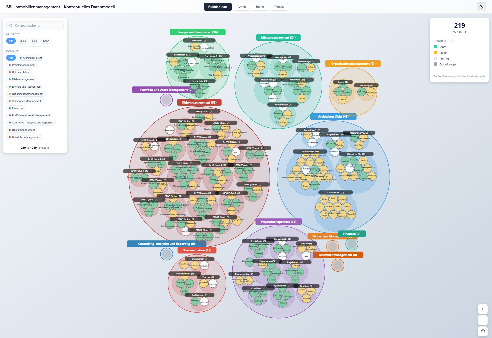

# EA-IMMO – Konzeptionelles Datenmodell Immobilien BBL

Enterprise Architecture Immobilien (EA-IMMO) – Einheitliches Datenmodell und Geschäftsobjekte für das Immobilienmanagement des BBL (Bundesamt für Bauten und Logistik).

[](https://bbl-dres.github.io/ea-immo/)

**[Interaktive Visualisierung öffnen](https://bbl-dres.github.io/ea-immo/)**

## Ziel

Dieses Repository definiert zentrale Geschäftsobjekte (Gebäude, Räume, Mietverträge, etc.) in einer standardkonformen, systemunabhängigen Sprache. Es dient als verbindliche Referenz für Fach- und IT-Bereiche.


## Domänengruppen


Die Priorisierung der Domänen folgt der [MoSCoW-Methode](https://de.wikipedia.org/wiki/MoSCoW-Priorisierung) (Must / Should / Could / Won't).

| Domäne | Beschreibung | Priorität | Konzepte | Status |
|--------|--------------|-----------|----------|--------|
| [Bauliche Struktur](docs/Architektonische%20Sicht.md) | Physische Strukturen (Grundstücke, Gebäude, Räume, Anlagen) | Muss | 48 | Definiert |
| [Projektmanagement](docs/Projektmanagement.md) | Planung und Realisierung von Bauvorhaben | Muss | 32 | Entwurf |
| [Dokumentenmanagement](docs/Dokumentenmanagement.md) | Strukturierte Erfassung und Verwaltung von Dokumenten | Muss | 11 | Definiert |
| [Mietermanagement](docs/Mietermanagement%20%28Nutzungssicht%29.md) | Nutzungs- und vermietungsbezogene Aspekte | Muss | 24 | Entwurf |
| [Energie und Ressourcen](docs/Energie%20und%20Ressourcen.md) | Verbrauchsdaten, Emissionen, Nachhaltigkeit | Muss | 16 | Definiert |
| [Organisatorische Daten](docs/Organisatorische%20Daten%20%28MDM%29.md) | Stammdaten der Organisation | Soll | 6 | Entwurf |
| [Workspace Management](docs/Workspace%20Management.md) | Benutzer- und Kundenerfahrung | Soll | – | Zu definieren |
| [Finanzen](docs/Finanzen.md) | Buchhalterische und wirtschaftliche Perspektive | Soll | – | Zu definieren |
| Controlling, Analytics und Reporting | Berichtswesen und Analysen | Soll | – | Zu definieren |
| [Portfoliomanagement](docs/Portfoliomanagement.md) | Strategische Sicht auf das Immobilienportfolio | Kann | – | Zu definieren |
| Objektmanagement | Technisches Gebäudemanagement ([Garantiemanagement](docs/Objektmanagement%20-%20GFB6%20Garantiemanagement.md), [Instandhaltung](docs/Objektmanagement%20-%20GFW9%20Instandhaltung.md), [Reinigung](docs/Objektmanagement%20-%20GFW12%20Reinigung.md)) | Kann | – | Entwurf |
| Baustellenmanagement | Bauausführung und Bauüberwachung | Kann | – | Zu definieren |
| [Metadaten](docs/Metadaten.md) | Metadaten-Definitionen | – | – | Zu definieren |

**Total: 137 Konzepte** in 6 definierten Domänen

## Weitere Dokumentation

- [Analyse – Übersicht Standards IMMO](docs/Analyse%20-%20%C3%9Cbersicht%20Standards%20IMMO.md) – Relevante Branchenstandards
- [Studie – Fachliche Sicht IMMO (Archiv)](docs/Studie%20-%20Fachliche%20Sicht%20IMMO%20%28Archiv%29.md) – Ursprüngliche Studie

## Grundsätze

1. **Fach ist im Lead** – Definitionen unabhängig von IT-Systemen
2. **Standardkonformität** – Ausrichtung an ISO, RICS, SIA, KBOB, eCH
3. **Einheitliche Terminologie** – Verbindliche Fachsprache
4. **Prozessorientierung** – Unterstützung realer Geschäftsprozesse

## Referenzen und Standards

Dieses Repository orientiert sich am **DMBOK** (Data Management Body of Knowledge) und dessen Drei-Ebenen-Ansatz für die Datenmodellierung:

| Ebene | Beschreibung | Einordnung |
|-------|--------------|------------|
| **Konzeptionelles Modell** | Fachliche Sicht auf die Daten, unabhängig von Technologie | **← Dieses Repository** |
| Logisches Modell | Strukturierte Darstellung, z.B. als relationales Modell | Lösungsneutral (nicht Ziel dieses Repos) |
| Physisches Modell | Technische Implementierung in einer konkreten Datenbank oder System | Systemspezifisch |

Das konzeptionelle Datenmodell bildet die Grundlage für ein einheitliches Verständnis der Immobiliendaten im BBL – unabhängig von den eingesetzten IT-Systemen.

**Weitere Referenzen:**
- **TOGAF** (The Open Group Architecture Framework) – Enterprise Architecture Standard
- **[BK DTI Vorgaben](https://www.bk.admin.ch/bk/de/home/digitale-transformation-ikt-lenkung/vorgaben.html)** – IKT-Vorgaben des Bereichs DTI der Bundeskanzlei
- **[eCH-0122](https://www.ech.ch/de/ech/ech-0122/2.0.0)** – Architektur E-Government Schweiz

## Repository-Struktur

```
ea-immo/
├── assets/       Bilder und Medien für README und Dokumentation
├── data/         JSON-Daten für die interaktive Visualisierung
├── docs/         Domänen-Dokumentationen (Markdown)
├── pdf/          PDF-Exporte der Dokumentation
├── scripts/      Python-Scripts für Datenverarbeitung
├── app.js        D3.js Visualisierungslogik
├── index.html    Interaktive Web-Applikation
└── README.md     Projektdokumentation
```

## Migration

Confluence-Export zu Markdown: siehe [scripts/README.md](scripts/README.md)
