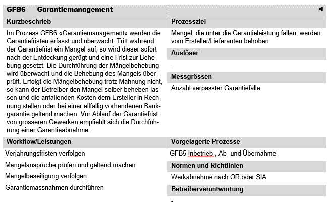
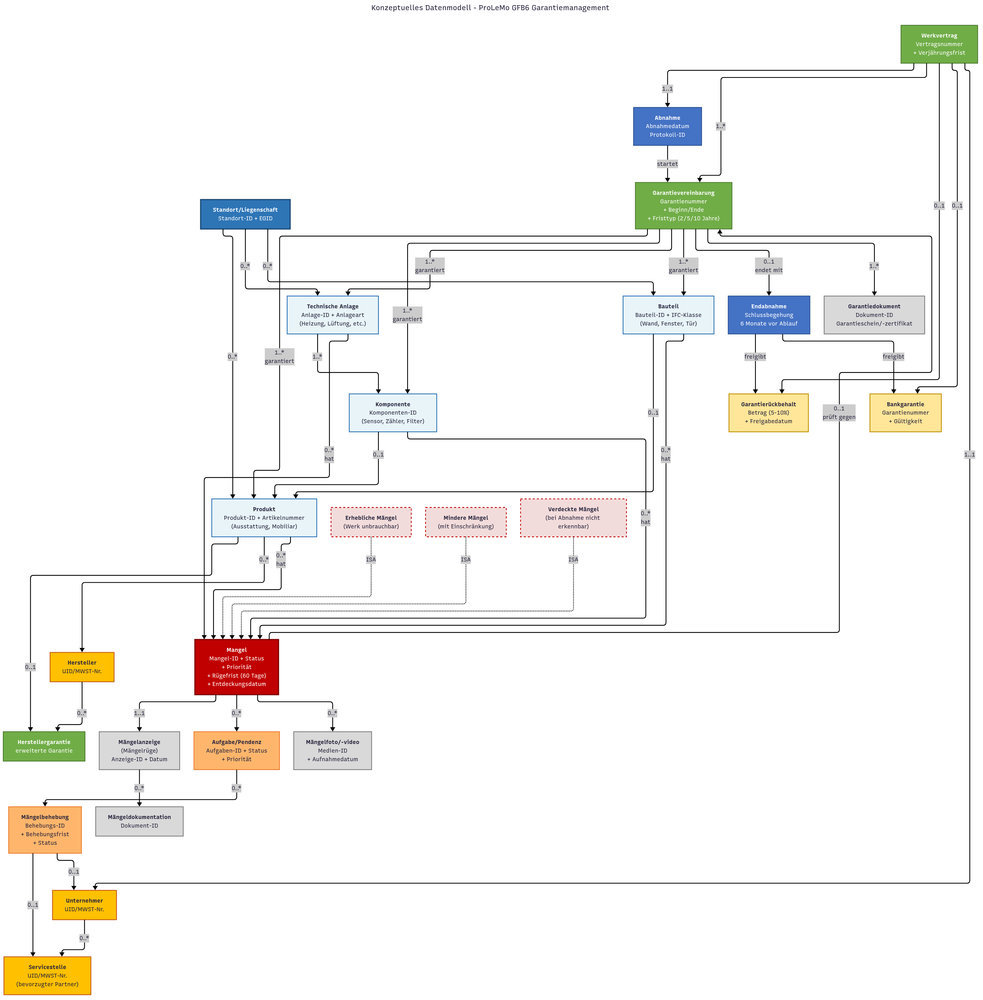
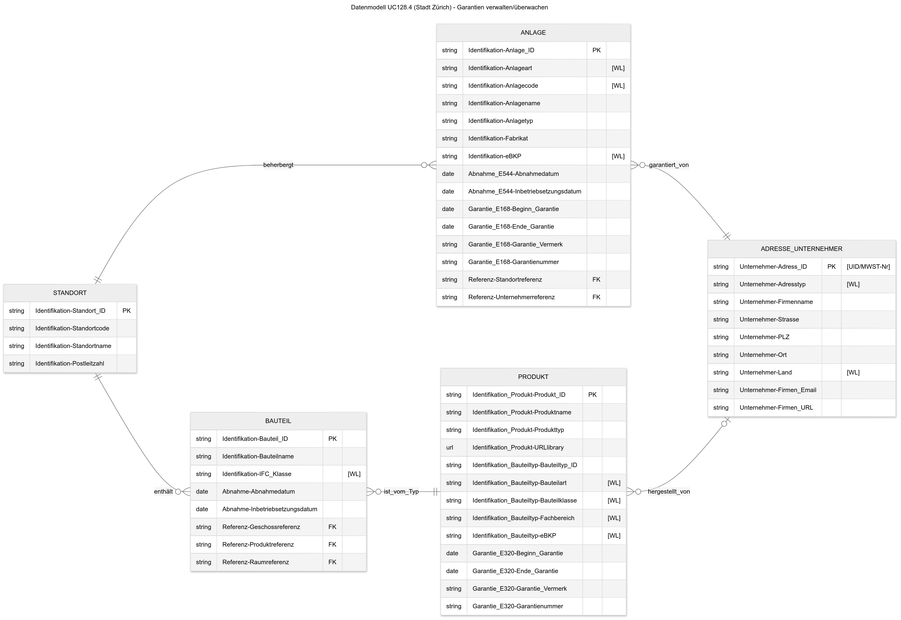
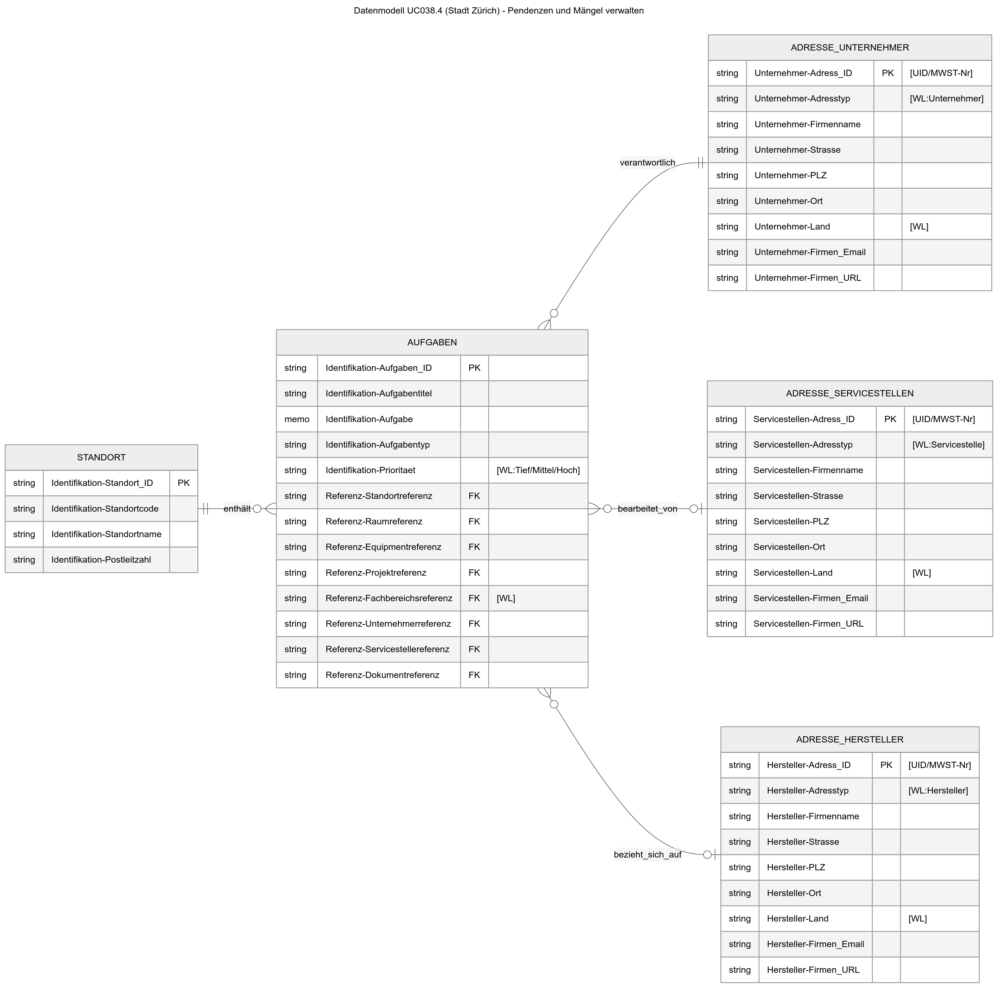

# GFB6 (Garantiemanagement)

# 1. Ziel dieses Dokumentes

Dieses Fachkonzept legt die Grundlagen für ein einheitliches Verständnis und die Modellierung von Daten für den ProLeMo-Prozess GFB6 Garantiemanagement als Teil des kaufmännischen Gebäudemanagements im Bundesamt für Bauten und Logistik (BBL) fest. Es basiert ausschliesslich auf verifizierbaren Standards und öffentlich zugänglichen Dokumentationen.

Die Kernziele dieses Dokuments sind:

- **Definition zentraler Geschäftsobjekte**: Extraktion und Konsolidierung aus verifizierten Standards (OR, SIA-Normen, ProLeMo 2021)
- **Standardkonformität**: Sicherstellung der Kompatibilität mit nationalen Rechtsnormen und Branchenstandards
- **Interoperabilität**: Schaffung einer Basis für die Integration mit bestehenden BBL-Systemen (SAP PM, SAP RE-FX, Dokumentenmanagement)
- **Rechtssicherheit**: Definition klarer Prozesse zur fristgerechten Wahrung von Garantieansprüchen
- **Praxisrelevanz**: Ableitung aus realen Implementierungen und ProLeMo-Prozessmodell

# 2. Garantiemanagement - Aufgaben und Bedeutung

### 2.1 Rolle im Immobilienmanagement

Der Prozess GFB6 Garantiemanagement bildet gemäss ProLeMo 2021 einen kritischen Prozess des kaufmännischen Gebäudemanagements. Er stellt die Schnittstelle zwischen der Inbetriebnahme (GFB5) und dem laufenden Betrieb dar und sichert die rechtlichen und finanziellen Interessen des BBL während der Garantieperiode.

Bild: ProLeMo Steckbrief. [Quelle](https://object.gever.admin.ch/web/?ObjectToOpenID=%24ActaNovaDocument%7cD49E9907-5A31-4FCC-B348-EAA654C8B155&TenantID=169)

### 2.2 Inhaltliche Dimensionen

Basierend auf ProLeMo 2021, OR (Obligationenrecht) und SIA-Normen umfasst der Prozess GFB6 folgende zentrale Dimensionen:

**Garantieerfassung und -verwaltung:**

- Systematische Erfassung aller Garantiefristen aus Werkverträgen und Kaufverträgen
- Verwaltung unterschiedlicher Garantietypen (Werkgarantie, Herstellergarantie, erweiterte Garantie)
- Dokumentation von Garantiebedingungen und Ausschlussklauseln
- Überwachung von Garantiefristen mit automatischen Eskalationsmechanismen

**Mängelmanagement:**

- Identifikation und Dokumentation von Mängeln während der Garantieperiode
- Klassifikation nach Mängelkategorien (offene Mängel, verdeckte Mängel, zugesicherte Eigenschaften)
- Priorisierung nach Dringlichkeit und Auswirkung auf Nutzung
- Statusverfolgung (offen/in Bearbeitung/abgeschlossen)

**Rechtliche Durchsetzung:**

- Fristgerechte Mängelrüge gemäss OR Art. 367 und SIA-Normen
- **Wichtige Gesetzesänderung ab 1. Januar 2026**: Verlängerung der Rügefrist auf 60 Tage für unbewegliche Werke
- Beweissicherung und Dokumentation für Rechtsverfahren
- Koordination mit Rechtsabteilung bei strittigen Fällen

### 2.3 Kernaufgaben

Die Kernaufgaben des Prozesses GFB6 Garantiemanagement umfassen:

**Garantieüberwachung:**

- Kontinuierliche Überwachung laufender Garantiefristen
- Rechtzeitige Warnung vor Fristablauf (Eskalationsstufen)
- Verwaltung von Verjährungsfristen gemäss OR (5-jährige Frist für Bauwerke)

**Mängelerfassung und -verfolgung:**

- Strukturierte Aufnahme von Mängeln mit Foto-/Videodokumentation
- Zuordnung zu Verursacher/Unternehmer
- Nachverfolgung des Behebungsstatus
- Integration in zentrale Mängelliste

**Anspruchsdurchsetzung:**

- Erstellung rechtssicherer Mängelrügen
- Koordination der Mängelbehebung mit Unternehmern
- Eskalation bei Nichteinhaltung von Behebungsfristen
- Durchsetzung von Garantieansprüchen gemäss OR Art. 368

**Finanzielle Sicherstellung:**

- Verwaltung von Garantierückbehalten
- Kontrolle von Bankgarantien und deren Gültigkeit (typischerweise 5-10% der Auftragssumme)
- Kostenerfassung bei Ersatzvornahme
- Integration mit Finanzsystemen für Kostenrückerstattung

### 2.4 Strategische Bedeutung

**Wirtschaftliche Optimierung:**

- Kostenreduktion durch konsequente Inanspruchnahme von Garantieleistungen
- Vermeidung von Folgeschäden durch rechtzeitige Mängelbehebung
- Minimierung von Rechtskosten durch präventive Dokumentation
- Portfolio-weite Lebenszykluskosten-Optimierung

**Qualitätssicherung:**

- Systematische Qualitätskontrolle während der Garantieperiode
- Feedback-Loop zu Planungs- und Ausführungsprozessen
- Lieferantenbewertung basierend auf Mängelstatistiken
- Aufbau einer Mängeldatenbank für zukünftige Projekte

**Rechtssicherheit und Compliance:**

- Wahrung gesetzlicher Fristen gemäss OR
- Lückenlose Dokumentation für Beweisführung
- Erfüllung der Sorgfaltspflicht als öffentlicher Bauherr
- Einhaltung von KBOB-Empfehlungen und SIA-Normen

**Risikomanagement:**

- Frühzeitige Identifikation systematischer Mängel
- Vermeidung von Garantieverlusten durch Fristversäumnis
- Schutz vor Haftungsansprüchen Dritter
- Systematische Risikoanalyse basierend auf Garantiedaten

# 3. Empfehlung Geschäftsobjekte (Konsolidiert)

Bedeutung der Prioritätsstufen:

- **Muss**: Zwingend erforderlich gemäss gesetzlichen Vorgaben oder BBL-Standards
- **Soll**: Wichtig für vollständige fachliche Abbildung gemäss Best Practice
- **Kann**: Erweiterte Funktionalität für Optimierung

|  | Gruppe/Geschäftsobjekt | Priorität | Beschreibung | Primäre Identifikatoren | Relevante Standards | Kommentar |
| --- | --- | --- | --- | --- | --- | --- |
| 1 | **VERTRAGSGRUNDLAGEN** |  |  |  |  |  |
| 2 | Werkvertrag | Muss | Vertrag zur Herstellung eines Werkes gegen Vergütung, Basis für Garantieansprüche | Vertragsnummer, Vertragsdatum | OR Art. 363-379, SIA 118 | Geschäftsobjekt: Eigenständige Entität |
| 3 | Garantievereinbarung | Muss | Spezifische Vereinbarung über Garantieumfang und -dauer | Garantienummer, Vertragsreferenz | OR Art. 371, SIA-Normen | Geschäftsobjekttyp von Werkvertrag oder separates Geschäftsobjekt |
| 4 | **AKTEURE** |  |  |  |  |  |
| 5 | Unternehmen / Organisation | Muss | Garantieverpflichteter Vertragspartner | UID/MWST-Nr., Firmenname | OR Art. 364, UC128.4 | Geschäftsobjekt: Vertragspartei |
| 6 | Hersteller | Soll | Produkthersteller für Herstellergarantien | UID/MWST-Nr., Firmenname | UC128.4, UC038.4 | Geschäftsobjekttyp von Adresse/Akteur |
| 7 | Servicestelle | Soll | Dienstleister für Mängelbehebung | UID/MWST-Nr., Firmenname | UC038.4 | Geschäftsobjekttyp von Adresse/Akteur |
| 8 | **GARANTIEOBJEKTE** |  |  |  |  |  |
| 9 | Liegenschaft/Standort | Muss | Oberste Hierarchieebene des Immobilienportfolios | Standort-ID, EGID | UC128.4, UC038.4 | Geschäftsobjekt: Portfolio-Ebene |
| 10 | Bauwerk | Muss | Unbewegliches Werk als Garantieobjekt | Bauwerk-ID, Standortreferenz | OR Art. 371, SIA 469 | Geschäftsobjekt: Hat 5 Jahre Garantiefrist als Attribut |
| 11 | Technische Anlage | Muss | Haustechnische Anlagen und Systeme | Anlage-ID, Anlageart | UC128.4, SAP PM | Geschäftsobjekt: Equipment im SAP PM |
| 12 | Bauteil | Soll | Konstruktive und ausgebaute Elemente | Bauteil-ID, IFC-Klasse | UC128.4, BIM-Integration | Geschäftsobjekt: IFC-Klasse ist Attribut von Bauteil |
| 13 | Produkt | Soll | Eingebaute Produkte mit Herstellergarantie | Produkt-ID, Artikelnummer | UC128.4 | Geschäftsobjekt: Artikelnummer ist Attribut |
| 14 | **MÄNGELMANAGEMENT** |  |  |  |  |  |
| 15 | Mangel | Muss | Abweichung vom vertraglich geschuldeten Zustand | Mangel-ID, Mangelart | OR Art. 368, BUW 1.4.21 | Geschäftsobjekt: Mangelart ist Attribut |
| 16 | Erhebliche Mängel | Soll | Werk unbrauchbar/Annahme unzumutbar | Mangel-ID, Kategorie | OR Art. 368 Abs. 1 | Geschäftsobjekttyp von Mangel |
| 17 | Mindere Mängel | Soll | Werk brauchbar mit Einschränkungen | Mangel-ID, Kategorie | OR Art. 368 Abs. 2 | Geschäftsobjekttyp von Mangel |
| 18 | Verdeckte Mängel | Soll | Bei Abnahme nicht erkennbare Mängel | Mangel-ID, Entdeckungsdatum | OR Art. 370 | Geschäftsobjekttyp von Mangel |
| 19 | Aufgabe/Pendenz | Muss | Arbeitsauftrag zur Mängelbehebung | Aufgaben-ID, Status | UC038.4, BUW 1.4.47 | Geschäftsobjekt: Status ist Attribut, Priorität ist Attribut |
| 20 | Mängelanzeige | Muss | Formelle Mitteilung über festgestellte Mängel | Anzeige-ID, Datum | OR Art. 367 | Geschäftsobjekt: Dokument |
| 21 | **ZEITMANAGEMENT** |  |  |  |  |  |
| 22 | Garantiefrist | Muss | Zeitliche Begrenzung der Garantieansprüche | Beginn, Ende, Fristtyp | OR Art. 371, SIA 118 | Attribut von Anlage/Bauteil/Produkt |
| 23 | Verjährungsfrist | Muss | Maximale Frist für Mängelansprüche | Beginn, Ende | OR Art. 370-371 | Attribut von Werkvertrag/Mangel |
| 24 | Rügefrist | Muss | Frist zur Mängelanzeige nach Entdeckung | Entdeckungsdatum, Ablaufdatum | OR Art. 367 | Attribut von Mangel |
| 25 | **PROZESSOBJEKTE** |  |  |  |  |  |
| 26 | Abnahme | Muss | Prüfung und Entgegennahme des Werkes | Abnahmedatum, Protokoll-ID | OR Art. 370, BUW 1.4.21 | Geschäftsobjekt: Abnahmedatum ist Attribut |
| 27 | Endabnahme | Soll | Finale Prüfung nach Ablauf der Garantiefrist | Datum, Protokoll-ID | BUW 1.4.48 | Geschäftsobjekttyp von Abnahme |
| 28 | Mängelbehebung | Muss | Prozess der Mangelbeseitigung | Behebungs-ID, Status | BUW 1.4.47 | Geschäftsobjekt: Behebungsfrist ist Attribut |
| 29 | **FINANZOBJEKTE** |  |  |  |  |  |
| 30 | Garantierückbehalt | Soll | Einbehaltene Sicherheitsleistung | Betrag, Freigabedatum | BUW 1.4.48, KBOB | Geschäftsobjekt: Betrag ist Attribut |
| 31 | Bankgarantie | Kann | Alternative Sicherheitsleistung | Garantienummer, Gültigkeit | SIA 118, KBOB | Geschäftsobjekttyp von Sicherheitsleistung |
| 32 | **DOKUMENTATION** |  |  |  |  |  |
| 33 | Garantiedokument | Muss | Garantieschein, -zertifikat oder -urkunde | Dokument-ID, Dokumenttyp | UC128.4, DMS-Integration | Geschäftsobjekt: Dokumenttyp ist Attribut |
| 34 | Mängelfoto/-video | Soll | Visuelle Dokumentation von Mängeln | Medien-ID, Aufnahmedatum | UC038.4, BUW 1.4.46 | Geschäftsobjekttyp von Dokument |
| 35 | **ZUSÄTZLICHE ATTRIBUTE** |  |  |  |  |  |
| 36 | Priorität | Muss | Dringlichkeitsstufe (Tief/Mittel/Hoch) | - | UC038.4 | Attribut von Aufgabe/Mangel |
| 37 | Status | Muss | Bearbeitungszustand | - | UC038.4, SAP PM | Attribut von Aufgabe/Mängelbehebung |
| 38 | Anlageart | Muss | Klassifikation der Anlage (z.B. Lüftung) | - | UC128.4 | Attribut von Technische Anlage |
| 39 | IFC-Klasse | Soll | BIM-Klassifikation (z.B. IFCwall) | - | UC128.4 | Attribut von Bauteil |

Tabelle: Empfehlung Geschäftsobjekte (Konsolidiert)

Bild: Konzeptuelles Datenmodell. [Quelle](https://www.mermaidchart.com/d/584c59d3-a081-4871-842d-38cade38ef29)

# 4. Übersicht der relevanten Standards und Beispiele

### 4.1 Standards als Tabelle

|  | Kategorie/Name | Zweck (Kurz) | Relevanz für BBL | Anwendung BBL | Schnittstellen | Status | Anmerkungen |
| --- | --- | --- | --- | --- | --- | --- | --- |
| 1 | **RECHTLICHE GRUNDLAGEN** |  |  |  |  |  |  |
| 2 | OR Art. 363-379 | Werkvertrag | Sehr hoch | Grundlage Garantierecht | Vertragsmanagement | Aktiv | Schweizerisches Obligationenrecht |
| 3 | OR Art. 197-210 | Kaufvertrag Gewährleistung | Hoch | Mobiliar, Ausstattung | Beschaffung | Aktiv | Für bewegliche Sachen |
| 4 | OR Art. 367 | Mängelrüge | Sehr hoch | Fristgerechte Rüge | Rechtsabteilung | Revision 2026 | Ab 01.01.2026: 60 Tage Frist |
| 5 | OR Art. 370 | Verjährungsfristen | Sehr hoch | 2/5/10 Jahre Fristen | Vertragsmanagement | Aktiv | Je nach Mangel |
| 6 | OR Art. 371 | 5-Jahre-Frist Bauwerke | Sehr hoch | Zwingende Mindestfrist | Vertragsmanagement | Revision 2026 | Ab 01.01.2026 zwingend |
| 7 | ZGB Art. 219 | Bauhandwerkerpfandrecht | Hoch | Sicherstellung | Finanzwesen | Aktiv | Zivilgesetzbuch |
| 8 | **BBL WEISUNGEN UND PROZESSE** |  |  |  |  |  |  |
| 9 | BBL Weisungen Bau | Abnahme und Garantie | Sehr hoch | Verbindliche Vorgaben | SAP PM | Aktiv | Interne Richtlinie |
| 10 | BBL Weisungen Betrieb | Mängelmanagement | Sehr hoch | Operative Vorgaben | SAP PM | Aktiv | Stand 2023 |
| 11 | **BBL FACHANWENDUNGEN** |  |  |  |  |  |  |
| 12 | SAP PM | Plant Maintenance | Sehr hoch | Mängelverwaltung | SAP RE-FX | Produktiv | Notifications, Equipment Master |
| 13 | SAP RE-FX | Real Estate Management | Hoch | Objektdaten | SAP PM | Produktiv | Vertragsverwaltung |
| 14 | ActaNova GEVER / DMS | Dokumentenmanagement | Sehr hoch | Garantiedokumente | SAP | Produktiv | Beweissicherung |
| 15 | IBM FileNet / DMS | Dokumentenmanagement | Sehr hoch | Garantiedokumente | SAP | Produktiv | Beweissicherung |
| 16 | **TECHNISCHE STANDARDS** |  |  |  |  |  |  |
| 17 | SIA 118:2013 | Allgemeine Bedingungen Bau | Sehr hoch | Werkvertragsnorm | Verträge | Aktiv | Art. 172-180 Garantie |
| 18 | SIA 112:2014 | Modell Leistungsphasen | Hoch | Phase 6 Bewirtschaftung | Planung | Aktiv | Lebenszyklusmodell |
| 19 | SIA 113 | FM-orientierte Planung | Hoch | pbFM-Integration | FM-Prozesse | Aktiv | Planungsbegleitendes FM |
| 20 | SIA 180:2014 | Wärmeschutz | Mittel | Spezifische Garantien | Technik | Aktiv | 2-5 Jahre Garantie |
| 21 | SIA 260:2013 | Projektierung | Hoch | Planungsmängel | Planung | Aktiv | Haftungsregelung |
| 22 | SIA 469:1997 | Erhaltung Bauwerke | Hoch | Abgrenzung Garantie/Unterhalt | Instandhaltung | Aktiv | Terminologie |
| 23 | SN EN ISO 15686 | Lebensdauerplanung | Mittel | Garantieerwartung | Planung | Aktiv | Internationale Norm |
| 24 | **INTERNATIONALE STANDARDS** |  |  |  |  |  |  |
| 25 | ISO 55000:2024 | Asset Management | Hoch | Lebenszyklusmanagement | Portfolio | Aktiv | Überarbeitete Version 2024 |
| 26 | ISO 55001:2024 | Asset Management System | Hoch | Zertifizierbares System | QM-System | Aktiv | Mit digitalem Fokus |
| 27 | ISO 41001:2018 | FM Management System | Hoch | FM-Framework | FM-Prozesse | Aktiv | Amendment 1:2024 |
| 28 | EN 13306:2017 | Maintenance Terminology | Mittel | Wartungsbegriffe | Instandhaltung | Aktiv | Europäische Norm |
| 29 | EN 15331:2011 | Maintenance Buildings | Mittel | Wartungsplanung | FM | Aktiv | Gebäudewartung |
| 30 | **EXTERNE BEISPIELE - BUW Prozessmodell (Uni Wuppertal)** |  |  |  |  |  |  |
| 31 | BUW-Prozessmodell IGM: Gewährleistungs- u. Mängelmanagement | Systematisches Mängelmanagement | Sehr hoch | Mängelerfassung, -verfolgung | SAP PM, DMS | Aktiv | Prozess 1.4.21, Uni Wuppertal |
| 32 | BUW-Prozessmodell IGM: Mängelansprüche geltend machen | Durchsetzung Garantieansprüche | Sehr hoch | Mängelrüge, Fristenüberwachung | Rechtsabteilung | Aktiv | Prozess 1.4.43, Uni Wuppertal |
| 33 | BUW-Prozessmodell IGM: Gewährleistungsmangel annehmen | Annahme gemeldeter Mängel | Hoch | Mängelaufnahme, Klassifikation | SAP PM | Aktiv | Prozess 1.4.46, Uni Wuppertal |
| 34 | BUW-Prozessmodell IGM: Gewährleistungsmangel abwickeln | Operative Mängelabwicklung | Sehr hoch | Koordination Mängelbehebung | Unternehmer, SAP | Aktiv | Prozess 1.4.47, Uni Wuppertal |
| 35 | BUW-Prozessmodell IGM: Gewährleistungsphase abschließen | Abschluss Garantieperiode | Hoch | Endabnahme, Freigabe Rückbehalt | Finanzwesen | Aktiv | Prozess 1.4.48, Uni Wuppertal |
| 36 | **EXTERNE BEISPIELE - Anwendungsfälle Stadt Zürich (CAFM/BIM)** |  |  |  |  |  |  |
| 37 | Stadt Zürich UC128.4: Garantien verwalten/überwachen | Verwaltung und Überwachung offener Garantien | Sehr hoch | Garantiefristenmanagement, Eskalation | CAFM, SAP PM | Aktiv | Fachdatenkatalog Stadt Zürich |
| 38 | Stadt Zürich UC038.4: Pendenzen und Mängel verwalten | Zentrale Mängelverwaltung | Sehr hoch | Mängelliste, Statusverfolgung, Priorisierung | CAFM, DMS | Aktiv | Fachdatenkatalog Stadt Zürich |
| 39 | Stadt Zürich UC043.1: Gesetzliche und unternehmensspezifische Vorgaben verwalten | Verwaltung rechtlicher Vorgaben | Hoch | Garantiefristen OR/SIA, Compliance | Rechtsabteilung | Aktiv | Fachdatenkatalog Stadt Zürich |
| 40 | Stadt Zürich UC071.1: Objektstammdaten verwalten | Verwaltung Objektstammdaten | Hoch | Garantiedaten als Teil der Stammdaten | SAP RE-FX | Aktiv | Fachdatenkatalog Stadt Zürich |
| 41 | Stadt Zürich UC005.1: Equipmentdaten verwalten | Verwaltung Anlagedaten | Hoch | Garantien für technische Anlagen | SAP PM | Aktiv | Fachdatenkatalog Stadt Zürich |
| 42 | Stadt Zürich UC005.2: Equipments verwalten | Lebenszyklus-Management | Mittel | Garantien in Beschaffungsprozess | SAP PM | Aktiv | Fachdatenkatalog Stadt Zürich |
| 43 | Stadt Zürich UC027.1: Bauproduktinformationen abrufen | Produktdatenmanagement | Mittel | Herstellergarantien abrufen | Produktdatenbank | Aktiv | Fachdatenkatalog Stadt Zürich |
| 44 | **EXTERNE BEISPIELE - Anwendungsfälle** |  |  |  |  |  |  |
| 45 | BuildingSMART UCM | BIM-basierte Mängelverfolgung | Mittel | Digitalisierung | IFC, BIM | Entwicklung | Use Case Management |
| 46 | **EXTERNE BEISPIELE - ORGANISATIONEN** |  |  |  |  |  |  |
| 47 | KBOB Empfehlungen | Garantiewesen öff. Bauherren | Sehr hoch | Best Practice, verbindlich für BBL | Bund | Aktiv | Koordinationskonferenz |
| 48 | KBOB-Werkvertrag | Mustervertrag | Sehr hoch | Standardvertrag mit SIA 118 | Verträge | Aktiv | Kontinuierlich aktualisiert |
| 49 | KBOB Bauwerksdokumentation | Dokumentationsstandard | Sehr hoch | Garantiedokumentation | DMS | Aktiv | 2013, mit IPB/IFMA |
| 50 | SBB Immobilien | Mängelmanagement | Mittel | Benchmark | - | Aktiv | Ähnliche Komplexität |

Tabelle: Übersicht der relevanten Standards und Beispiele

### 4.2 Bewertungskriterien für "Relevanz für BBL"

- **Sehr hoch**: Gesetzlich vorgeschrieben, BBL-Kernsystem, verbindliche Weisung oder direkt anwendbarer Use Case
- **Hoch**: Best Practice Schweiz, wichtig für Rechtssicherheit oder Integration
- **Mittel**: Ergänzend, für Spezialfälle oder Referenz
- **Niedrig**: Informativ, geringe direkte Anwendbarkeit

### 4.3 Strategische Einordnung

Die Standards und Use Cases lassen sich in folgende strategische Kategorien einordnen:

- **Rechtliche Grundlagen:** Rechtlich bindende Vorgaben auf Bundesebene,
- **BBL Weisungen und Prozesse:** Interne verbindliche Standards und Prozessmodelle, die den organisatorischen Rahmen und die Prozesslandschaft definieren.
- **BBL Fachanwendungen:** Operative IT-Systeme, die für die Verwaltung, Planung und Abrechnung von Reinigungsleistungen eingesetzt werden und Schnittstellen für Datenintegration bieten.
- **Technische Standards:** Normative Vorgaben, sowie Integrations-Standards, die fachliche Anforderungen, Qualitätsstufen, Leistungskataloge und Datenaustauschformate definieren.
- **Externe Beispiele:** Verifizierte Praxisbeispiele und Best-Practice-Implementierungen, die als Referenz für erfolgreiche Umsetzungen dienen und innovative Ansätze aufzeigen.

# 5. Wichtigste Standards im Detail (Schrittweise Ergänzung)

Zur einheitlichen Klassifizierung der Begriffe und Standards werden folgende Kategorien verwendet:

- **Fachanwendung:** IT-Systeme, Register oder Plattformen
- **Geschäftsprozess:** Strukturierte Abfolge von Aktivitäten zur Erreichung eines definierten Geschäftsziels
- **Geschäftsobjekt:** Eigenständige fachliche Entitäten mit eindeutiger Identität
- **Geschäftsobjekttyp:** Spezialisierungen oder Ausprägungen von Geschäftsobjekten
- **Dokument:** Informationsträger zur Dokumentation, Kommunikation oder Nachweisführung
- **Attribut:** Eigenschaften oder Merkmale von Geschäftsobjekten
- **Fachbegriff:** Konzepte, Definitionen oder Klassifikationen ohne eigenständige Objektnatur
- **Relation:** Beziehungen und Verknüpfungen zwischen Geschäftsobjekten

## 5.X. Beispiel Standard

- **Priorität:**
- **Dokumentation:**

  - Link A: URL
  - Link B: URL:
- **Beschreibung:**
- **Relevanz für BBL:**

|  | Begriff | Kategorie | Beschreibung | Relevanz für BBL | Kommentar |
| --- | --- | --- | --- | --- | --- |
| 1 |  |  |  |  |  |
| 2 |  |  |  |  |  |
| 3 |  |  |  |  |  |

## 5.1 OR Art. 363-379: Werkvertrag / Haftung für Mängel

- **Priorität:** Sehr hoch
- **Dokumentation:**
  - Original Dokument: <https://fedlex.data.admin.ch/eli/cc/27/317_321_377>
- **Beschreibung:** Rechtliche Grundlage für Werkverträge im Schweizerischen Obligationenrecht, regelt Rechte und Pflichten bei Werkverträgen sowie Gewährleistungsansprüche
- **Relevanz für BBL:** Zwingende rechtliche Grundlage für alle Garantieansprüche und Mängelhaftung im Bauwesen der Schweiz

|  | Begriff | Kategorie | Beschreibung | Relevanz für BBL | Kommentar |
| --- | --- | --- | --- | --- | --- |
| 1 | Werkvertrag | Geschäftsobjekt | Vertrag zur Herstellung eines Werkes gegen Vergütung (Art. 363) | Sehr hoch | Grundlage aller Bauleistungen |
| 2 | Werk | Geschäftsobjekt | Herzustellendes Arbeitsergebnis | Sehr hoch | Das ist Ihr "Garantieobjekt" |
| 3 | Unternehmer | Geschäftsobjekt | Vertragspartei, die das Werk herstellt (Art. 364) | Sehr hoch | Garantieverpflichteter |
| 4 | Besteller | Geschäftsobjekt | Auftraggeber des Werkes | Sehr hoch | BBL als Bauherr |
| 5 | Prüfungspflicht | Geschäftsprozess | Pflicht zur Prüfung nach Ablieferung (Art. 367) | Sehr hoch | "Sobald es nach dem üblichen Geschäftsgange tunlich ist" |
| 6 | Mängelanzeige | Dokument | Mitteilung über festgestellte Mängel (Art. 367) | Sehr hoch | Ab 01.01.2026: 60 Tage Frist |
| 7 | Mängel | Geschäftsobjekt | Abweichung vom vertraglich geschuldeten Zustand (Art. 368) | Sehr hoch | Zentral für Garantiemanagement |
| 8 | Erhebliche Mängel | Geschäftsobjekttyp | Werk unbrauchbar/Annahme unzumutbar (Art. 368 Abs. 1) | Hoch | Verweigerungsrecht |
| 9 | Mindere Mängel | Geschäftsobjekttyp | Werk brauchbar mit Einschränkungen (Art. 368 Abs. 2) | Hoch | Minderung/Nachbesserung |
| 10 | Nachbesserungsanspruch | Geschäftsobjekt | Anspruch auf unentgeltliche Verbesserung (Art. 368 Abs. 2) | Sehr hoch | Primäranspruch |
| 11 | Minderung | Geschäftsobjekt | Preisreduktion entsprechend Minderwert (Art. 368 Abs. 2) | Hoch | Alternativanspruch |
| 12 | Schadenersatz | Geschäftsobjekt | Ersatz bei Verschulden des Unternehmers (Art. 368) | Mittel | Bei Verschulden |
| 13 | Abnahme | Geschäftsprozess | Prüfung und Entgegennahme des Werkes (Art. 370) | Sehr hoch | Start der Verjährungsfrist |
| 14 | Genehmigung | Geschäftsprozess | Ausdrückliche/stillschweigende Annahme (Art. 370) | Hoch | Befreit von Haftung für erkennbare Mängel |
| 15 | Stillschweigende Genehmigung | Fachbegriff | Annahme bei unterlassener Prüfung/Anzeige (Art. 370 Abs. 2) | Hoch | Rechtsverlust möglich |
| 16 | Verdeckte Mängel | Geschäftsobjekttyp | Bei Abnahme nicht erkennbare Mängel (Art. 370 Abs. 1) | Sehr hoch | Haftung bleibt bestehen |
| 17 | Arglistig verschwiegene Mängel | Geschäftsobjekttyp | Absichtlich verschwiegene Mängel (Art. 370 Abs. 1) | Hoch | Erweiterte Haftung |
| 18 | Sofortige Anzeige | Fachbegriff | Mängelanzeige nach Entdeckung (Art. 370 Abs. 3) | Sehr hoch | Bei später auftretenden Mängeln |
| 19 | Verjährungsfrist bewegliche Werke | Attribut | 2 Jahre ab Abnahme (Art. 371 Abs. 1) | Hoch | Standardfrist |
| 20 | Verjährungsfrist integrierte bewegliche Werke | Attribut | 5 Jahre für in Bauwerke integrierte bewegliche Werke (Art. 371 Abs. 1) | Sehr hoch | Z.B. Haustechnik |
| 21 | Verjährungsfrist unbewegliche Werke | Attribut | 5 Jahre ab Abnahme (Art. 371 Abs. 2) | Sehr hoch | Bauwerke |
| 22 | Verjährungsfrist Architekten/Ingenieure | Attribut | 5 Jahre für Planungsmängel (Art. 371 Abs. 2) | Hoch | Planerhaftung |
| 23 | Feste Übernahme | Fachbegriff | Werkvertrag zum Festpreis (Art. 373) | Hoch | Keine Preiserhöhung |
| 24 | Ausserordentliche Umstände | Fachbegriff | Unvorhersehbare Hindernisse (Art. 373 Abs. 2) | Mittel | Preisanpassung möglich |
| 25 | Kostenansatz | Dokument | Ungefähre Preisbestimmung (Art. 375) | Mittel | Rücktrittsrecht bei Überschreitung |
| 26 | Zufall | Fachbegriff | Untergang des Werkes ohne Verschulden (Art. 376) | Mittel | Risikoverteilung |
| 27 | Annahmeverzug | Fachbegriff | Verzögerte Abnahme durch Besteller (Art. 376 Abs. 1) | Mittel | Gefahrübergang |

## 5.X BUW-Prozessmodell IGM: Gewährleistungs- u. Mängelmanagement (Prozess 1.4.21)

- **Priorität:** Sehr hoch
- **Dokumentation:**
  - Webseite: <https://dpbb.uni-wuppertal.de/en/research/buw-process-model-for-the-construction-and-real-estate-industry/>
  - Original Dokument: <https://dpbb.uni-wuppertal.de/fileadmin/architektur/ib/DPBB/Download-Bereich/BUW-Prozessmodell/Prozesse_Betrieb_-_Druckbericht.pdf> (Seite 236)
- **Beschreibung:** Systematisches Management von Gewährleistungsansprüchen und Mängeln während der Garantiephase im laufenden Betrieb
- **Relevanz für BBL:** Kermprozess für die strukturierte Erfassung und Überwachung von Garantiefristen sowie Koordination der Mängelbehebung

|  | Begriff | Kategorie | Beschreibung | Relevanz für BBL | Kommentar |
| --- | --- | --- | --- | --- | --- |
| 1 | Gewährleistungsphase | Fachbegriff | Zeitraum nach Abnahme, in dem Mängelansprüche geltend gemacht werden können | Sehr hoch | Entspricht Garantieperiode nach OR |
| 2 | Mängelverwaltung | Geschäftsprozess | Systematische Erfassung, Dokumentation und Nachverfolgung von Mängeln | Sehr hoch | Integration mit SAP PM |
| 3 | Garantiefrist | Attribut | Zeitliche Begrenzung der Gewährleistungsansprüche | Sehr hoch | 2/5 Jahre gemäss OR |
| 4 | Verjährungsfrist | Attribut | Maximale Frist für Mängelansprüche | Sehr hoch | 5 Jahre für Bauwerke (OR Art. 371) |

## 5.X BUW-Prozessmodell IGM: Mängelansprüche geltend machen (Prozess 1.4.43)

- **Priorität:** Sehr hoch
- **Dokumentation:**
  - Webseite: <https://dpbb.uni-wuppertal.de/en/research/buw-process-model-for-the-construction-and-real-estate-industry/>
  - Original Dokument: <https://dpbb.uni-wuppertal.de/fileadmin/architektur/ib/DPBB/Download-Bereich/BUW-Prozessmodell/Prozesse_Betrieb_-_Druckbericht.pdf> (Seite 275)
- **Beschreibung:** Durchsetzung von Garantieansprüchen durch fristgerechte Mängelrüge und rechtskonforme Kommunikation
- **Relevanz für BBL:** Kritischer Prozess zur Wahrung rechtlicher Ansprüche und Vermeidung von Fristversäumnis

|  | Begriff | Kategorie | Beschreibung | Relevanz für BBL | Kommentar |
| --- | --- | --- | --- | --- | --- |
| 1 | Mängelrüge | Dokument | Schriftliche Anzeige eines Mangels an Unternehmer | Sehr hoch | OR Art. 367, ab 2026: 60 Tage Frist |
| 2 | Mängelanspruch | Geschäftsobjekt | Rechtlicher Anspruch auf Mängelbehebung | Sehr hoch | Basis für Garantiedurchsetzung |
| 3 | Fristenüberwachung | Geschäftsprozess | Monitoring von Rüge- und Verjährungsfristen | Sehr hoch | Kritisch für Rechtssicherheit |
| 4 | Mängelanzeige | Dokument | Formelle Mitteilung über festgestellte Mängel | Sehr hoch | Beweissicherung erforderlich |

## 5.X BUW-Prozessmodell IGM: Gewährleistungsmangel annehmen (Prozess 1.4.46)

- **Priorität:** Hoch
- **Dokumentation:**
  - Webseite: <https://dpbb.uni-wuppertal.de/en/research/buw-process-model-for-the-construction-and-real-estate-industry/>
  - Original Dokument: <https://dpbb.uni-wuppertal.de/fileadmin/architektur/ib/DPBB/Download-Bereich/BUW-Prozessmodell/Prozesse_Betrieb_-_Druckbericht.pdf> (Seite 279)
- **Beschreibung:** Annahme und Klassifikation gemeldeter Mängel sowie Einleitung des Behebungsprozesses
- **Relevanz für BBL:** Schnittstelle zwischen Mängelidentifikation und operativer Mängelbehebung

|  | Begriff | Kategorie | Beschreibung | Relevanz für BBL | Kommentar |
| --- | --- | --- | --- | --- | --- |
| 1 | Mängelaufnahme | Geschäftsprozess | Strukturierte Erfassung und Dokumentation von Mängeln | Hoch | Mit Foto-/Videodokumentation |
| 2 | Mängelklassifikation | Fachbegriff | Kategorisierung nach Art und Dringlichkeit | Hoch | Offene/verdeckte Mängel |
| 3 | Mangel | Geschäftsobjekt | Abweichung vom vertraglich geschuldeten Zustand | Sehr hoch | Zentrales Geschäftsobjekt |
| 4 | Priorisierung | Geschäftsprozess | Bewertung nach Dringlichkeit und Auswirkung | Hoch | Basis für Ressourcenplanung |

## 5.X BUW-Prozessmodell IGM: Gewährleistungsmangel abwickeln (Prozess 1.4.47)

- **Priorität:** Sehr hoch
- **Dokumentation:**
  - Webseite: <https://dpbb.uni-wuppertal.de/en/research/buw-process-model-for-the-construction-and-real-estate-industry/>
  - Original Dokument: <https://dpbb.uni-wuppertal.de/fileadmin/architektur/ib/DPBB/Download-Bereich/BUW-Prozessmodell/Prozesse_Betrieb_-_Druckbericht.pdf> (Seite 283)
- **Beschreibung:** Operative Abwicklung der Mängelbehebung inklusive Koordination mit Unternehmern und Überwachung
- **Relevanz für BBL:** Kernprozess für die operative Durchführung der Mängelbehebung

|  | Begriff | Kategorie | Beschreibung | Relevanz für BBL | Kommentar |
| --- | --- | --- | --- | --- | --- |
| 1 | Mängelbehebung | Geschäftsprozess | Koordination und Durchführung der Mangelbeseitigung | Sehr hoch | Mit Unternehmern |
| 2 | Koordination | Geschäftsprozess | Abstimmung zwischen Beteiligten | Sehr hoch | BBL, Unternehmer, Nutzer |
| 3 | Mängelbehebungsfrist | Attribut | Zeitvorgabe für Mangelbeseitigung | Sehr hoch | Angemessene Frist setzen |
| 4 | Statusverfolgung | Geschäftsprozess | Monitoring des Behebungsfortschritts | Sehr hoch | In SAP PM |
| 5 | Eskalation | Geschäftsprozess | Stufenweise Verschärfung bei Nichteinhaltung | Hoch | Bei Fristüberschreitung |

## 5.X BUW-Prozessmodell IGM: Gewährleistungsphase abschließen (Prozess 1.4.48)

- **Priorität:** Hoch
- **Dokumentation:**
  - Webseite: <https://dpbb.uni-wuppertal.de/en/research/buw-process-model-for-the-construction-and-real-estate-industry/>
  - Original Dokument: <https://dpbb.uni-wuppertal.de/fileadmin/architektur/ib/DPBB/Download-Bereich/BUW-Prozessmodell/Prozesse_Betrieb_-_Druckbericht.pdf> (Seite 292)
- **Beschreibung:** Abschluss der Garantieperiode mit Endabnahme und Freigabe von Sicherheitsleistungen
- **Relevanz für BBL:** Formeller Abschluss der Gewährleistungsphase und Übergang in regulären Unterhalt

|  | Begriff | Kategorie | Beschreibung | Relevanz für BBL | Kommentar |
| --- | --- | --- | --- | --- | --- |
| 1 | Endabnahme | Geschäftsprozess | Finale Prüfung nach Ablauf der Garantiefrist | Hoch | Vor Freigabe Rückbehalt |
| 2 | Garantierückbehalt | Geschäftsobjekt | Einbehaltene Sicherheitsleistung (5-10% Auftragssumme) | Hoch | Freigabe nach Endabnahme |
| 3 | Freigabe | Geschäftsprozess | Formelle Freigabe der Sicherheitsleistungen | Hoch | Mit Finanzwesen koordinieren |
| 4 | Schlussbegehung | Geschäftsprozess | Abschliessende Objektbegehung vor Fristablauf | Hoch | Ca. 6 Monate vor Ablauf |
| 5 | Übergabeprotokoll | Dokument | Dokumentation des Garantieabschlusses | Hoch | Rechtssicherheit |

## 5.7 Stadt Zürich UC128.4: Garantien verwalten/überwachen

- **Priorität:** Sehr hoch
- **Dokumentation:**
  - Standards und Richtlinien: <https://www.stadt-zuerich.ch/de/planen-und-bauen/portfolio/eigentuemerin/standards-und-richtlinien.html#bim_immo>
  - Datenkatalog (Original Dokument): <https://www.stadt-zuerich.ch/content/dam/web/de/planen-bauen/bauvorschriften-und-planerische-grundlagen/dokumente/standards-richtlinien-immo/bim%40immo/anhang-h-zur-richtlinie-bim%40immo-datenkataloge.xlsx>
  - Anwendungsfall: UC128.X: Garantien verwalten / überwachen
- **Beschreibung:** Strukturiertes Datenmodell für die Verwaltung und Überwachung von Garantien im Immobilienmanagement der Stadt Zürich
- **Relevanz für BBL:** Praxiserprobtes Referenzmodell einer vergleichbaren öffentlichen Verwaltung mit detaillierter Objektstruktur

|  | Begriff | Kategorie | Beschreibung | Relevanz für BBL | Kommentar |
| --- | --- | --- | --- | --- | --- |
| 1 | **LIEGENSCHAFTSEBENE** |  |  |  |  |
| 2 | Standort | Geschäftsobjekt | Liegenschaftsebene, oberste Hierarchiestufe | Sehr hoch | Entspricht Portfolio-Ebene |
| 3 | Standort\_ID | Attribut | Eindeutige Kennzeichnung des Standorts (z.B. S1234) | Sehr hoch | Primärschlüssel von Standort |
| 4 | Standortcode | Attribut | Kennzeichnungscode für Standort (z.B. S1234-Schulanlage) | Hoch | Attribut von Standort, sprechender Code |
| 5 | Standortname | Attribut | Name des Standorts (z.B. Schulanlage Kügeliloo) | Hoch | Attribut von Standort |
| 6 | **VERTRAGSPARTNER** |  |  |  |  |
| 7 | Adresse | Geschäftsobjekt | Adressstammdaten von Unternehmen/Lieferanten | Sehr hoch | Garantieverpflichteter |
| 8 | Adress\_ID | Attribut | UID/MWST-Nr. (z.B. CHE-199.199.199) | Sehr hoch | Attribut von Adresse, schweizweite Unternehmens-ID |
| 9 | Adresstyp | Attribut | Zuweisung auf Adresstyp (z.B. Hersteller, Unternehmer) | Hoch | Attribut von Adresse, Werteliste |
| 10 | Firmenname | Attribut | Name der Firma | Sehr hoch | Attribut von Adresse |
| 11 | **TECHNISCHE ANLAGEN** |  |  |  |  |
| 12 | Anlage | Geschäftsobjekt | Technische Anlage als Garantieobjekt | Sehr hoch | Zentrales Garantieobjekt TGM |
| 13 | Anlage\_ID | Attribut | Eindeutige Kennzeichnung der Anlage (z.B. L10) | Sehr hoch | Primärschlüssel von Anlage |
| 14 | Anlageart | Attribut | Art der Anlage (z.B. Lüftungsanlage) | Sehr hoch | Attribut von Anlage, Klassifikation |
| 15 | Anlagetyp | Attribut | Typ der Anlage (z.B. SK6-13) | Hoch | Attribut von Anlage |
| 16 | Fabrikat | Attribut | Fabrikat der Anlage (z.B. 7 Air) | Hoch | Attribut von Anlage |
| 17 | **BAUTEILE UND AUSSTATTUNG** |  |  |  |  |
| 18 | Bauteil | Geschäftsobjekt | Konstruktive und ausgebaute Elemente inkl. Ausstattung | Sehr hoch | Garantieobjekt IGM |
| 19 | Bauteil\_ID | Attribut | Von BIM-Software generierte GUID | Hoch | Primärschlüssel von Bauteil, BIM-Integration |
| 20 | Bauteilname | Attribut | Von BIM-Software generierter Name | Hoch | Attribut von Bauteil |
| 21 | IFC-Klasse | Attribut | IFC-Klassifikation (z.B. IFCwall) | Hoch | Attribut von Bauteil, BIM-Standard |
| 22 | **PRODUKTSTAMMDATEN** |  |  |  |  |
| 23 | Produkt | Geschäftsobjekt | Produktstammdaten mit Herstellerinformationen | Hoch | Basis für Herstellergarantie |
| 24 | Produkt\_ID | Attribut | Artikelnummer des Herstellers | Hoch | Primärschlüssel von Produkt |
| 25 | Produktname | Attribut | Artikelname des Herstellers | Hoch | Attribut von Produkt |
| 26 | Produkttyp | Attribut | Modelltyp des Produkts | Hoch | Attribut von Produkt |
| 27 | Bauteiltyp\_ID | Attribut | Eindeutige Kennzeichnung des Bauteiltyps | Hoch | Attribut von Produkt, aus BAP |
| 28 | Bauteilart | Attribut | Kennzeichnung der Bauteilart (z.B. Steckdose) | Hoch | Attribut von Produkt |
| 29 | Bauteilklasse | Attribut | Kennzeichnung der Bauteilklasse (z.B. E\_Apparate) | Hoch | Attribut von Produkt |
| 30 | **GARANTIEDATEN** |  |  |  |  |
| 31 | Abnahmedatum | Attribut | Datum der Abnahme | Sehr hoch | Attribut von Anlage/Bauteil, Start Garantiefrist |
| 32 | Inbetriebsetzungsdatum | Attribut | Datum der Inbetriebsetzung | Hoch | Attribut von Anlage/Bauteil, kann von Abnahme abweichen |
| 33 | Beginn Garantie | Attribut | Starttermin für Garantie | Sehr hoch | Attribut von Anlage/Produkt, kritisches Datum |
| 34 | Ende Garantie | Attribut | Endtermin der Garantie | Sehr hoch | Attribut von Anlage/Produkt, Fristüberwachung |
| 35 | Garantie Vermerk | Attribut | Wichtige Vermerke zur Garantie | Hoch | Attribut von Anlage/Produkt, Freitext |
| 36 | Garantienummer | Attribut | Nummer auf dem Garantieschein | Mittel | Attribut von Anlage/Produkt |
| 37 | **KLASSIFIKATION** |  |  |  |  |
| 38 | eBKP | Attribut | Zuweisung zu eBKP (z.B. D01.01) | Sehr hoch | Attribut von Anlage/Bauteil/Produkt |
| 39 | Fachbereich | Attribut | Zuweisung zum Fachbereich (z.B. E für Elektro) | Hoch | Attribut von Produkt |
| 40 | **REFERENZEN/VERKNÜPFUNGEN** |  |  |  |  |
| 41 | Geschossreferenz | Relation | Referenz auf zugewiesenes Geschoss | Hoch | Verknüpfung Bauteil-Geschoss |
| 42 | Produktreferenz | Relation | Referenz auf zugewiesenes Produkt | Sehr hoch | Verknüpfung Bauteil-Produkt |
| 43 | Raumreferenz | Relation | Referenz auf zugewiesenen Raum | Hoch | Verknüpfung Bauteil-Raum |

Bild: Logisches Datenmodell. [Quelle](https://www.mermaidchart.com/d/fec7e98b-acee-4bfc-b0fd-b7c95ab030fe)

## 5.8 Stadt Zürich UC038.4: Pendenzen und Mängel verwalten

- **Priorität:** Sehr hoch
- **Dokumentation:**
  - Standards und Richtlinien: <https://www.stadt-zuerich.ch/de/planen-und-bauen/portfolio/eigentuemerin/standards-und-richtlinien.html#bim_immo>
  - Datenkatalog (Original Dokument): <https://www.stadt-zuerich.ch/content/dam/web/de/planen-bauen/bauvorschriften-und-planerische-grundlagen/dokumente/standards-richtlinien-immo/bim%40immo/anhang-h-zur-richtlinie-bim%40immo-datenkataloge.xlsx>
  - Anwendungsfall: UC38.X: Pendenzen und Mängel verwalten
- **Beschreibung:** Strukturiertes Datenmodell für die zentrale Verwaltung von Pendenzen und Mängeln während Garantie- und Betriebsphase
- **Relevanz für BBL:** Detailliertes Mängelmanagement-Modell mit Aufgabenverwaltung und Priorisierung

|  | Begriff | Kategorie | Beschreibung | Relevanz für BBL | Kommentar |
| --- | --- | --- | --- | --- | --- |
| 1 | **ZENTRALE MÄNGELVERWALTUNG** |  |  |  |  |
| 2 | Aufgaben | Geschäftsobjekt | Zentrale Entität für Mängel und Pendenzen | Sehr hoch | Kerngeschäftsobjekt Mängelmanagement |
| 3 | Aufgaben\_ID | Attribut | Eindeutige Kennzeichnung der Aufgabe (z.B. A001) | Sehr hoch | Primärschlüssel von Aufgaben |
| 4 | Aufgabentitel | Attribut | Titel der Aufgabe (z.B. "Verputz defekt") | Sehr hoch | Attribut von Aufgaben, Kurzbezeichnung |
| 5 | Aufgabe | Attribut | Detaillierte Beschreibung der Aufgabe | Sehr hoch | Attribut von Aufgaben, Memo-Feld |
| 6 | Aufgabentyp | Attribut | Typisierung der Aufgabe (z.B. Mangel) | Sehr hoch | Attribut von Aufgaben, Klassifikation |
| 7 | Priorität | Attribut | Prioritätsstufe (Tief/Mittel/Hoch) | Sehr hoch | Attribut von Aufgaben, Werteliste |
| 8 | **LIEGENSCHAFTSEBENE** |  |  |  |  |
| 9 | Standort | Geschäftsobjekt | Liegenschaftsebene, oberste Hierarchiestufe | Sehr hoch | Entspricht Portfolio-Ebene |
| 10 | Standort\_ID | Attribut | Eindeutige Kennzeichnung des Standorts (z.B. S1234) | Sehr hoch | Primärschlüssel von Standort |
| 11 | Standortcode | Attribut | Kennzeichnungscode für Standort | Hoch | Attribut von Standort, sprechender Code |
| 12 | Standortname | Attribut | Name des Standorts | Hoch | Attribut von Standort |
| 13 | Postleitzahl | Attribut | Postleitzahl des Standorts | Mittel | Attribut von Standort |
| 14 | **VERTRAGSPARTNER - UNTERNEHMER** |  |  |  |  |
| 15 | Adresse (Unternehmer) | Geschäftsobjekttyp | Unternehmer als Garantieverpflichteter | Sehr hoch | Spezialisierung von Adresse |
| 16 | Adress\_ID | Attribut | UID/MWST-Nr. (z.B. CHE-199.199.199) | Sehr hoch | Primärschlüssel, schweizweite ID |
| 17 | Adresstyp | Attribut | Wert: "Unternehmer" | Hoch | Diskriminator für Adresstyp |
| 18 | Firmenname | Attribut | Name der Firma | Sehr hoch | Attribut von Adresse |
| 19 | Strasse | Attribut | Strasse der Firma | Hoch | Attribut von Adresse |
| 20 | PLZ | Attribut | Postleitzahl der Firma | Hoch | Attribut von Adresse |
| 21 | Ort | Attribut | Ort der Firma | Hoch | Attribut von Adresse |
| 22 | **VERTRAGSPARTNER - HERSTELLER** |  |  |  |  |
| 23 | Adresse (Hersteller) | Geschäftsobjekttyp | Hersteller von Produkten | Hoch | Spezialisierung von Adresse |
| 24 | Adresstyp | Attribut | Wert: "Hersteller" | Hoch | Diskriminator für Adresstyp |
| 25 | Firmen-Email | Attribut | E-Mail-Adresse der Firma | Hoch | Attribut von Adresse |
| 26 | Firmen-URL | Attribut | Website der Firma | Mittel | Attribut von Adresse |
| 27 | **VERTRAGSPARTNER - SERVICESTELLEN** |  |  |  |  |
| 28 | Adresse (Servicestellen) | Geschäftsobjekttyp | Servicedienstleister für Mängelbehebung | Sehr hoch | Spezialisierung von Adresse |
| 29 | Adresstyp | Attribut | Wert: "Servicestelle" | Hoch | Diskriminator für Adresstyp |
| 30 | **REFERENZEN UND VERKNÜPFUNGEN** |  |  |  |  |
| 31 | Standortreferenz | Relation | Verknüpfung Aufgabe-Standort | Sehr hoch | Fremdschlüssel in Aufgaben |
| 32 | Raumreferenz | Relation | Verknüpfung Aufgabe-Raum | Sehr hoch | Fremdschlüssel in Aufgaben |
| 33 | Equipmentreferenz | Relation | Verknüpfung Aufgabe-Equipment/Anlage | Sehr hoch | Fremdschlüssel in Aufgaben |
| 34 | Unternehmerreferenz | Relation | Verknüpfung Aufgabe-Unternehmer | Sehr hoch | Fremdschlüssel in Aufgaben |
| 35 | Servicestellereferenz | Relation | Verknüpfung Aufgabe-Servicestelle | Sehr hoch | Fremdschlüssel in Aufgaben |
| 36 | Fachbereichsreferenz | Relation | Zuweisung zum Fachbereich (z.B. E für Elektro) | Hoch | Fremdschlüssel in Aufgaben |
| 37 | Projektreferenz | Relation | Verknüpfung zum Projekt | Hoch | Fremdschlüssel in Aufgaben |
| 38 | Dokumentreferenz | Relation | Referenz auf Dokumente/Fotos | Sehr hoch | Fremdschlüssel in Aufgaben |

Bild: Logisches Datenmodell. [Quelle](https://www.mermaidchart.com/d/0acbad0d-005a-489f-b8df-27fa3b54cd15)
