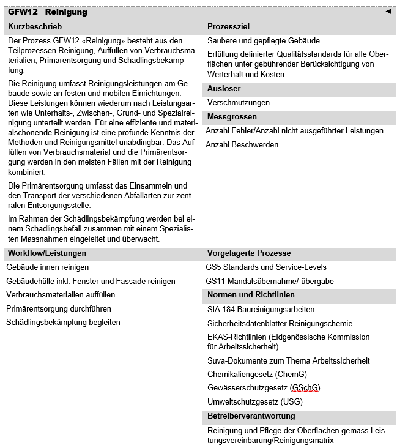
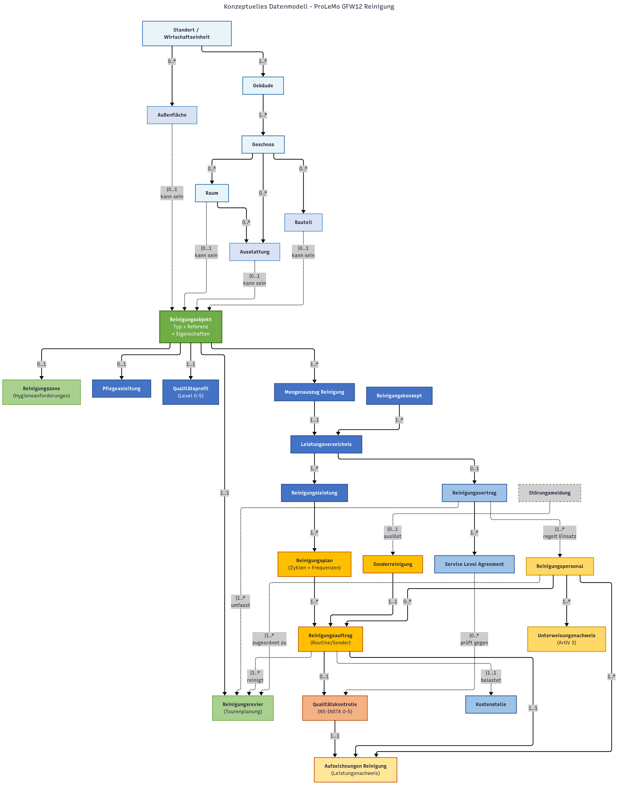

# GFW12 (Reinigung)

# 1. Ziel dieses Dokumentes

Dieses Fachkonzept legt die Grundlagen für ein einheitliches Verständnis und die Modellierung von Daten für den ProLeMo-Prozess **GFW12 Reinigung** als Teil des infrastrukturellen Gebäudemanagements im Bundesamt für Bauten und Logistik (BBL) fest. Es basiert ausschliesslich auf verifizierbaren Standards und öffentlich zugänglichen Dokumentationen.

Die Kernziele dieses Dokuments sind:

- **Definition zentraler Geschäftsobjekte**: Extraktion und Konsolidierung aus verifizierten Standards (ProLeMo 2021, GEFMA 220:2023, DIN 77400:2015, SIA 184)
- **Standardkonformität**: Sicherstellung der Kompatibilität mit nationalen und internationalen Best-Practice-Standards
- **Interoperabilität**: Schaffung einer Basis für die Integration mit bestehenden BBL-Systemen (SAP PM, SAP RE-FX, Korasoft)
- **Datenqualität**: Definition klarer Identifikatoren und Attribute basierend auf etablierten Normen
- **Praxisrelevanz**: Ableitung aus realen Implementierungen und ProLeMo-Prozessmodell

# 2. Reinigung - Aufgaben und Bedeutung

### 2.1 Rolle im Immobilienmanagement

Der Prozess GFW12 Reinigung bildet gemäss ProLeMo 2021 einen der zentralen Kernprozesse des infrastrukturellen Gebäudemanagements (IGM). Nach GEFMA 200 entfallen 15-25% der gesamten Bewirtschaftungskosten auf Reinigungsdienstleistungen, womit die Reinigung zu den kostenintensivsten FM-Leistungen gehört. Als operative Schnittstelle zwischen Gebäudetechnik, Nutzern und Facility Management beeinflusst die Reinigung direkt die Wahrnehmung der BBL-Dienstleistungsqualität, die Werterhaltung der Immobilien sowie die Erfüllung gesetzlicher Auflagen.

Der Prozess umfasst nicht nur die routinemässige Reinigung von Oberflächen, sondern auch die Primärentsorgung (Abfallmanagement), das Auffüllen von Verbrauchsmaterialien und die Schädlingsbekämpfung. Dadurch wird ein ganzheitlicher Ansatz für Sauberkeit, Hygiene und Gebäudepflege gewährleistet.

Bild: ProLeMo Steckbrief. [Quelle](https://object.gever.admin.ch/web/?ObjectToOpenID=%24ActaNovaDocument%7cD49E9907-5A31-4FCC-B348-EAA654C8B155&TenantID=169)

### 2.2 Inhaltliche Dimensionen

Basierend auf ProLeMo 2021, GEFMA 220:2023 und DIN 77400:2015 umfasst der Prozess GFW12 Reinigung folgende zentrale Dimensionen:

**Reinigungsleistungen am Gebäude:**

- **Innenreinigung**: Reinigung von Arbeitsräumen, Verkehrsflächen, Sozialräumen, Sanitäranlagen nach definiertem Leistungskatalog und Qualitätsstufen
- **Aussenreinigung**: Pflege der Gebäudehülle inkl. Fenster, Fassaden, Eingangsbereiche zur Sicherstellung der repräsentativen Wirkung
- **Spezialreinigung**: Technische Reinigung von Lüftungsanlagen, Serverräumen sowie hygienische Reinigung nach LMG und HyV in Verpflegungsbereichen

**Primärentsorgung und Materialwirtschaft:**

- **Abfallmanagement**: Einsammeln und Transport verschiedener Abfallfraktionen zur zentralen Entsorgungsstelle, getrennte Sammlung gemäss Umweltschutzgesetz
- **Verbrauchsmaterialien**: Auffüllen von Hygienepapier, Seife, Reinigungsmitteln und weiteren Betriebsstoffen

**Schädlingsbekämpfung:**

- **Prävention und Monitoring**: Regelmässige Kontrolle auf Schädlingsbefall durch spezialisierte Massnahmen
- **Bekämpfung**: Einleitung und Überwachung gezielter Bekämpfungsmassnahmen bei festgestelltem Befall

### 2.3 Kernaufgaben

Die Kernaufgaben des Prozesses GFW12 Reinigung umfassen:

**Operative Durchführung:**

- **Routinereinigung**: Ausführung der Unterhaltsreinigung gemäss definiertem Reinigungsplan und Leistungsverzeichnis in festgelegten Zyklen
- **Sonderreinigung**: Durchführung ereignisbasierter Reinigungen nach besonderen Vorkommnissen, Veranstaltungen oder auf Bestellung
- **Gebäudehüllenpflege**: Reinigung von Fenstern, Fassaden und Eingangsbereichen zur Sicherstellung des gepflegten Erscheinungsbildes

**Materialwirtschaft und Entsorgung:**

- **Primärentsorgung**: Systematisches Einsammeln, Sortieren und Transportieren von Abfällen zu den Sammelstellen
- **Materialbewirtschaftung**: Kontrolle und Auffüllung von Verbrauchsmaterialien (Hygienepapier, Seifen, Reinigungsmittel)

**Hygiene und Schädlingsmanagement:**

- **Hygienesicherung**: Einhaltung gesetzlicher Hygienevorschriften (ArGV 3, LMG) insbesondere in Sanitär- und Verpflegungsbereichen
- **Schädlingsmonitoring**: Regelmässige Kontrolle und Dokumentation, Einleitung von Bekämpfungsmassnahmen bei Bedarf

**Qualitäts- und Dokumentationsmanagement:**

- **Leistungsnachweis**: Dokumentation der durchgeführten Reinigungen als Nachweis der Leistungserbringung
- **Qualitätskontrolle**: Überprüfung der Reinigungsqualität anhand definierter Standards und SLAs
- **Mängelbehebung**: Nachbearbeitung bei festgestellten Qualitätsmängeln oder nicht ausgeführten Leistungen

### 2.4 Strategische Bedeutung

**Werterhaltung und Asset Management:**

- Verlängerung der Lebensdauer von Oberflächen, Bodenbelägen und Gebäudebauteilen durch fachgerechte Pflege (SIA 469)
- Vermeidung von Substanzschäden durch regelmässige, materialgerechte Reinigung
- Erhaltung des Immobilienwerts durch gepflegtes Erscheinungsbild

**Gesundheitsschutz und Compliance:**

- Erfüllung gesetzlicher Vorgaben (ArGV 3: Gesundheitsschutz am Arbeitsplatz, LMG: Lebensmittelhygiene)
- Sicherstellung hygienisch einwandfreier Arbeitsbedingungen für alle Gebäudenutzer
- Dokumentation als Compliance-Nachweis gegenüber SUVA, SECO und kantonalen Lebensmittelinspektoraten

**Nachhaltigkeit und Ressourceneffizienz:**

- Umweltgerechte Abfallentsorgung und Förderung der Kreislaufwirtschaft durch getrennte Sammlung
- Einsatz ökologischer Reinigungsmittel (EU Ecolabel, RUMBA-Konformität gemäss BIG HBP)
- Optimierung der Reinigungszyklen durch bedarfsgerechte Planung und IoT-Sensoren

**Nutzer- und Kundenzufriedenheit:**

- Direkter Einfluss auf die Wahrnehmung der Dienstleistungsqualität durch sichtbare Sauberkeit
- Steigerung der Mitarbeiterzufriedenheit und Produktivität durch gepflegte Arbeitsumgebung
- Positive Aussenwirkung bei Besuchern und Kunden durch repräsentative Eingangsbereiche

**Digitalisierung und Innovation:**

- Integration in BIM2FM-Workflows via CAFM Connect für durchgängige Datenhaltung
- Digitale Qualitätskontrolle und Leistungsdokumentation
- Einsatz von Smart-Building-Technologien zur Optimierung der Reinigungsfrequenzen

# 3. Empfehlung Geschäftsobjekte und Leistungen (Konsolidiert)

Tabelle wird im weiteren Verlauf der Konzeption schrittweise verbessert

## 3.1 Empfehlung Geschäftsobjekte

**Bedeutung der Prioritätsstufen:**

- **Muss**: Zwingend erforderlich gemäss gesetzlichen Vorgaben oder BBL-Standards
- **Soll**: Wichtig für vollständige fachliche Abbildung gemäss Best Practice
- **Kann**: Erweiterte Funktionalität für Optimierung

|  | Gruppe/Geschäftsobjekt | Priorität | Beschreibung | Primäre Identifikatoren | Relevante Standards | Kommentar |
| --- | --- | --- | --- | --- | --- | --- |
| 1 | **ARCHITEKTONISCHE STRUKTUR** |  |  |  |  |  |
| 2 | Standort / Wirtschaftseinheit | Muss | Oberste Organisationseinheit - kann Standort, Liegenschaft, Portfolio oder andere organisatorische Einheit sein | WE\_ID, Standort\_ID | SAP RE-FX, CAFM-Richtlinie | Flexibles Konzept; wird von SAP RE-FX als Wirtschaftseinheit bereitgestellt; BBL nutzt oft als Standort/Liegenschaft |
| 3 | Gebäude | Muss | Bauliches Objekt auf Wirtschaftseinheit | Gebäude\_ID, IFC-GUID | IFC, CAFM-Richtlinie, SIA 416 | BIM-Objekt; physische Struktur |
| 4 | Geschoss | Muss | Ebene innerhalb Gebäude | Geschoss\_ID, Geschosscode | IFC, CAFM-Richtlinie | Für räumliche Hierarchie und Tourenplanung |
| 5 | Raum | Muss | Umschlossene räumliche Einheit | Raum\_ID, Raumnummer, Raumcode | IFC (IfcSpace), CAFM-Richtlinie, Stadt ZH UC008.1 | Mit Nutzungsart, Fläche, Materialisierung (Boden, Wand, Decke) |
| 6 | Bauteil | Muss | Konstruktives Element | Bauteil\_ID, IFC-GUID | IFC (IfcWall, IfcWindow, IfcCurtainWall etc.), Stadt ZH UC008.1 | Wände, Türen, Fenster, Fassaden, Decken - alles Konstruktive |
| 7 | Ausstattung | Soll | Inventar und Einrichtungsgegenstände | Ausstattung\_ID, IFC-GUID | IFC (IfcFurnishingElement), Stadt ZH UC008.1 | Möbel, Sanitärobjekte, Geräte |
| 8 | Aussenfläche | Soll | Nicht-überdachte Flächen | Aussenfläche\_ID | CAFM-Richtlinie, SIA 416 | Strassen, Parkplätze, Terrassen, Wege, Grünflächen |
| 9 | **REINIGUNGSSTRUKTUR** |  |  |  |  |  |
| 10 | Reinigungsobjekt | Muss | Zentrale Abstraktion: Alles, was gereinigt werden kann - referenziert Raum, Bauteil, Ausstattung oder Aussenfläche | Reinigungsobjekt\_ID, Objekttyp, Referenz\_ID | ProLeMo GFW12, buildingSMART UCM | Kernentität: Objekttyp ∈ {Raum, Bauteil, Ausstattung, Aussenfläche}; verweist auf entsprechendes Objekt; hat Materialisierung, Fläche/Menge, Zugänglichkeit, Pflegeanforderungen |
| 11 | Reinigungszone | Soll | Gruppierung nach Hygieneanforderungen und Schutzbedarf | Zone\_ID, Hygienetyp | LMG SR 817.0, HyV SR 817.024.1, ProLeMo | Z.B. Reinraum, Lebensmittelbereich, Normalbereich, Aussenbereich; definiert spezielle Hygiene- und Reinigungsprotokolle |
| 12 | Reinigungsrevier | Muss | Operative Gruppierung für Tourenplanung und Personaleinsatz | Revier\_ID, Reviercode | BUW 1.1.14, Stadt ZH UC029.1, Korasoft | Fasst Reinigungsobjekte zusammen für effiziente Arbeitsabläufe; grafisch in Korasoft verwaltet; Zuordnung zu Personal |
| 13 | **PLANUNG UND KONZEPTION** |  |  |  |  |  |
| 14 | Reinigungskonzept | Muss | Gesamtstrategie und Rahmenvorgaben für Reinigung | Konzept\_ID, Version, Gültigkeitsdatum | BUW 1.1.14, ProLeMo, BBL Betreiberkonzept | Definiert Qualitätsstufen, Frequenzen, Nachhaltigkeitsvorgaben, Ressourcen; strategische Grundlage |
| 15 | AIM (Asset Information Model) | Muss | Gebäudedatenmodell für Betrieb mit allen relevanten Eigenschaften | - | buildingSMART UCM, SIA 112 Phase 53 | Liefert Eigenschaften (Materialisierung, Flächen, Zugänglichkeit, Produktdaten) für Reinigungsobjekte; aus BIM übergeben |
| 16 | Mengenauszug Reinigung | Muss | Strukturierte Aufstellung aller zu reinigenden Objekte mit Mengen und Eigenschaften | Mengenauszug\_ID, Erstellungsdatum, Version | buildingSMART UCM, Stadt ZH UC051.1 | Aus AIM generiert; enthält alle Flächen, Materialien, Stückzahlen; Grundlage für Kostenberechnung und LV |
| 17 | Leistungsverzeichnis (LV) | Muss | Strukturierte Leistungsbeschreibung für Ausschreibung | LV\_ID, Version, Status | GEFMA 220:2023, SIA 184:2013, BUW 1.1.14 | 400+ Positionen mit Mengen, Einheitspreisen, Qualitätsstufen; basiert auf Mengenauszug und Reinigungskonzept |
| 18 | Reinigungsleistung | Muss | Katalogisierte, definierte Reinigungstätigkeit | Leistung\_ID, GEFMA-Position, LeKas-Position | GEFMA 220:2023, DIN 77400:2015, SIA 184, ProLeMo LOPB 09.01 | Z.B. "Unterhaltsreinigung Büro", "Glasreinigung beidseitig"; mit Zeitrichtwerten, Materialvorgaben, Verfahrensbeschreibung |
| 19 | Qualitätsprofil | Muss | Anforderungen an Reinigungsqualität | Profil\_ID, Qualitätsstufe, Kriterien | NS-INSTA 800-1:2018, GEFMA 220, BBL Standards Büroarbeitsplätze | Level 0-5 nach NS-INSTA; definiert Sauberkeitsniveau und Prüfkriterien; zugeordnet zu Reinigungsobjekten/Zonen/Leistungen |
| 20 | Pflegeanleitung | Soll | Herstellerspezifische Reinigungs- und Pflegehinweise | Pflegeanleitung\_ID, Produkt\_ID, Bauteiltyp\_ID | Stadt ZH UC008.1 (E434), Herstellerdokumentation | Für spezielle Oberflächen und Materialien (Naturstein, Parkett, Spezialoberflächen); aus BIM-Library oder Produktdatenblättern |
| 21 | **OPERATIVE DURCHFÜHRUNG** |  |  |  |  |  |
| 22 | Reinigungsplan | Muss | Zeitliche und räumliche Planung mit Zyklen | Reinigungsplan\_ID, Gültigkeit\_von, Gültigkeit\_bis | ProLeMo GFW12, BUW 1.1.14, Stadt ZH UC008.1 | Definiert wann welche Reviere/Objekte mit welcher Leistung gereinigt werden; Frequenzen: täglich/wöchentlich/monatlich/quartalsweise/jährlich |
| 23 | Reinigungsauftrag | Muss | Operative Arbeitsanweisung für konkrete Durchführung | Auftrag\_ID, Auftragsnummer, Typ, Status | BUW 1.4.10, ProLeMo D0.21.40.20.10 | Typ ∈ {Routine, Sonder}; Status ∈ {geplant, freigegeben, in Arbeit, abgeschlossen}; verweist auf Revier, Leistung, Personal, Zeitfenster, Kostenstelle |
| 24 | Sonderreinigung | Soll | Ereignisbasierte, nicht-routinemässige Reinigung | Sonderreinigung\_ID, Anlass, Priorität, Auslöser | GEFMA 220, BUW 1.4.2 | Ausgelöst durch Störung, Veranstaltung, Verschmutzung, Baumassnahme; mit Dringlichkeit, Begründung, Freigabe |
| 25 | Störungsmeldung | Soll | Gemeldeter Mangel oder Vorfall als Auslöser | Störung\_ID, Melder, Beschreibung | CAFM/Ticketing-System | Kann Sonderreinigung auslösen; Verknüpfung zu Facility-Management-Prozessen |
| 26 | **QUALITÄT UND DOKUMENTATION** |  |  |  |  |  |
| 27 | Qualitätskontrolle | Muss | Systematische, dokumentierte Qualitätsprüfung | Kontrolle\_ID, Kontrolldatum, Prüfer, Methode, Ergebnis | NS-INSTA 800-1:2018, BUW 1.4.2, BBL Weisungen Betrieb | Bewertung 0-5 nach NS-INSTA; Stichprobe oder Vollprüfung; mit Fotos, Mängelliste, Massnahmen; prüft gegen SLA und Qualitätsprofil |
| 28 | Aufzeichnungen Reinigung | Muss | Protokolle als Leistungsnachweis und Compliance-Dokumentation | Aufzeichnung\_ID, Datum, Uhrzeit, Objekt\_ID | ArGV 3 Art. 37, BUW 1.4.10, ProLeMo | Dokumentiert: Personal, Dauer, gereinigte Objekte, verwendete Mittel, Besonderheiten; Basis für Abrechnung, Qualitätskontrolle, rechtlichen Nachweis |
| 29 | **VERTRÄGE UND STEUERUNG** |  |  |  |  |  |
| 30 | Reinigungsvertrag | Muss | Rahmenvertrag mit Dienstleister | Vertrag\_ID, Vertragsnummer, Laufzeit, Vertragspartner | BUW 1.1.14, BöB, BBL Vergaberichtlinien | AVB, BVB, Leistungsbeschreibung; umfasst Reviere, Leistungen, Preise, Eskalation; regelt Verantwortlichkeiten und Haftung |
| 31 | Service Level Agreement (SLA) | Muss | Messbare Qualitäts- und Leistungsvereinbarung | SLA\_ID, Kennzahl, Zielwert, Toleranz, Messfrequenz | GEFMA 200, BBL Weisungen Betrieb | Konkrete KPIs (z.B. Sauberkeitsindex, Reaktionszeit, Verfügbarkeit); Messmethode; Bonus/Malus-Regelungen; prüft gegen Qualitätskontrollen |
| 32 | Kostenstelle | Muss | Kostenverantwortliche Organisationseinheit | Kostenstelle\_ID, Bezeichnung | SAP Kostenrechnung | Für Leistungsverrechnung an Nutzer/Mieter; Zuordnung zu Räumen/Objekten; Integration mit SAP |
| 33 | **RESSOURCEN** |  |  |  |  |  |
| 34 | Reinigungspersonal | Muss | Mitarbeitende des Dienstleisters mit Qualifikationen | Personal\_ID, Name, Dienstleister\_ID, Unterweisungsstatus | ArGV 3 Art. 5, BUW 1.2.8, 1.2.54 | Qualifikationen, Zertifikate, Unterweisungsnachweise, zugeordnete Reviere; führt Aufträge aus, bestätigt Aufzeichnungen; Zugriffsberechtigungen |
| 35 | Unterweisungsnachweis | Muss | Dokumentation der gesetzlich vorgeschriebenen Sicherheitsunterweisung | Unterweisung\_ID, Datum, Teilnehmer, Unterweiser, Themen | ArGV 3 Art. 5, BUW 1.2.8/1.2.54, EKAS 6512 | Rechtlich vorgeschrieben; enthält Unterschriften, Unterweisungsinhalte (Sicherheit, Objekt, Gefahrstoffe); Archivierungspflicht; Haftungsabgrenzung |

Bild: Konzeptuelles Datenmodell. [Quelle](https://www.mermaidchart.com/d/08f0a821-d05f-48dc-a33e-7e83afbe1139)

## 3.2 Empfehlung Leistungen

|  | Leistung/Dokument | Kategorie | Priorität | Beschreibung | Bezug zu Geschäftsobjekten | Relevante Standards | SIA Phase |
| --- | --- | --- | --- | --- | --- | --- | --- |
| 1 | **Grundlagendokumente** |  |  |  |  |  |  |
| 2 | Reinigungskonzept | Dokument | Muss | Gesamtstrategie und Rahmenvorgaben für Reinigung | GO14: Reinigungskonzept | ProLeMo, BBL Betreiberkonzept | 21-31 |
| 3 | Betriebs- und Nutzungskonzept | Dokument | Muss | Definition Betriebszeiten, Nutzungsintensität | GO14: Reinigungskonzept | BUW 1.1.14 | 21-31 |
| 4 | Service Level Agreement (SLA) | Vertrag | Muss | Messbare Qualitäts- und Leistungsvereinbarung | GO31: SLA | GEFMA 200, BBL Weisungen | 41-52 |
| 5 | FM-Leistungskatalog | Katalog | Soll | Strukturierte Leistungsbeschreibung | GO18: Reinigungsleistung | GEFMA 220:2023, SIA 184 | 31-41 |
| 6 | **Raum- und Flächendokumentation** |  |  |  |  |  |  |
| 7 | Raumliste mit Attributen | Liste | Muss | Räume mit Nutzung, Fläche, Materialisierung | GO5: Raum, GO11: Reinigungszone | CAFM-Richtlinie V19 | 31-52 |
| 8 | Flächenpläne/CAFM-Basisplan | Plan | Muss | Grafische Flächendarstellung für Reviereinteilung | GO12: Reinigungsrevier | Stadt ZH UC085 | 41-52 |
| 9 | Mengenauszug Reinigung | Dokument | Muss | Strukturierte Aufstellung aller zu reinigenden Objekte | GO16: Mengenauszug | buildingSMART UCM | 31-41 |
| 10 | Raumbeziehungstabelle Betriebsabläufe | Tabelle | Soll | Operative Prozessverkettungen für Tourenplanung | GO12: Reinigungsrevier | BUW 1.4.10 | 41-52 |
| 11 | **Materialisierung und Oberflächen** |  |  |  |  |  |  |
| 12 | Materialisierungsplan Bodenbeläge | Plan | Muss | Detaillierte Bodenbelagsplanung | GO10: Reinigungsobjekt | Stadt ZH UC008.1 (E525) | 41-52 |
| 13 | Materialisierungsplan Wandbeläge | Plan | Soll | Wandmaterialisierung pro Raum | GO10: Reinigungsobjekt | Stadt ZH UC008.1 (E525) | 41-52 |
| 14 | Farb- und Materialkonzept | Dokument | Soll | Systematische Materialvorgaben | GO20: Pflegeanleitung | GEFMA 220, SIA 184 | 31-41 |
| 15 | Differenztabelle Materialisierung | Tabelle | Soll | Änderungsverfolgung Oberflächen | GO10: Reinigungsobjekt | - | 52-62 |
| 16 | **Ausstattung und Inventar** |  |  |  |  |  |  |
| 17 | Ausstattungsliste | Liste | Muss | Inventar aller reinigungsrelevanten Objekte | GO7: Ausstattung | IFC (IfcFurnishingElement) | 51-52 |
| 18 | Fachmodell Ausstattung | 3D-Modell | Soll | BIM-Modell der Einrichtung | GO7: Ausstattung | buildingSMART UCM | 41-52 |
| 19 | Inventarliste für FM-Leistungen | Liste | Soll | Erweiterte Inventarliste mit FM-Bezug | GO7: Ausstattung | Stadt ZH UC028.2 | 52 |
| 20 | **Produktdaten und Pflegeanweisungen** |  |  |  |  |  |  |
| 21 | Produktliste mit Pflegeanweisungen | Datenbank | Muss | Herstellerangaben zur Reinigung | GO20: Pflegeanleitung | Stadt ZH UC008.1 (E434) | 52 |
| 22 | Produktdokumentation | Dokument | Soll | Technische Unterlagen und Datenblätter | GO20: Pflegeanleitung | - | 52 |
| 23 | **Operative Planungsdokumente** |  |  |  |  |  |  |
| 24 | Reinigungsplan | Plan | Muss | Zeitliche und räumliche Planung mit Zyklen | GO22: Reinigungsplan | ProLeMo, BUW 1.4.10 | 51-52 |
| 25 | Reinigungscheckliste | Formular | Muss | Strukturierte Prüflisten für Qualitätskontrolle | GO27: Qualitätskontrolle | NS-INSTA 800-1:2018 | 52-62 |
| 26 | Leistungsverzeichnis (LV) | Dokument | Muss | Detaillierte Leistungsbeschreibung für Ausschreibung | GO17: Leistungsverzeichnis | GEFMA 220, GEFMA 520, SIA 184, BUW 1.1.14 | 41 |
| 27 | **Kosten und Controlling** |  |  |  |  |  |  |
| 28 | Reinigungskostenberechnung | Kalkulation | Muss | Flächenbasierte Kostenermittlung | GO32: Kostenstelle | Stadt ZH UC051.1 | 31-41 |
| 29 | Reinigungskostenrechnung | Abrechnung | Muss | Operative Kostenerfassung | GO32: Kostenstelle | Stadt ZH UC051.1 | 52-62 |
| 30 | Betriebskostenberechnung | Kalkulation | Soll | Gesamtbetrachtung inkl. Reinigung | GO32: Kostenstelle | GEFMA 200 | 52-62 |
| 31 | **Qualität und Dokumentation** |  |  |  |  |  |  |
| 32 | Aufzeichnungen Reinigung | Protokoll | Muss | Leistungsnachweise und Compliance-Dokumentation | GO28: Aufzeichnungen | ArGV 3, BUW 1.4.10 | 52-62 |
| 33 | Betriebshandbuch | Handbuch | Soll | Operative Anleitungen und Prozesse | GO6: Betreiberkonzept | - | 52 |
| 34 | Mängel- und Pendenzenliste | Liste | Soll | Qualitätsmängel mit Modellbezug | GO27: Qualitätskontrolle | - | 52-62 |
| 35 | **Compliance und Auflagen** |  |  |  |  |  |  |
| 36 | Unterweisungsnachweis | Protokoll | Muss | Dokumentierte Sicherheitsunterweisung | GO35: Unterweisungsnachweis | ArGV 3 Art. 5, BUW 1.2.8 | 51 |
| 37 | Altlasteninformation | Dokument | Kann | Relevante Information für Spezialreinigung | - | ChemG | 52 |

# 4. Übersicht der relevanten Standards und Beispiele

### 4.1 Standards als Tabelle

|  | Kategorie/Name | Zweck (Kurz) | Relevanz für BBL | Anwendung BBL | Schnittstellen | Status | Anmerkungen |
| --- | --- | --- | --- | --- | --- | --- | --- |
| 1 | **RECHTLICHE GRUNDLAGEN** |  |  |  |  |  |  |
| 2 | ArGV 3 SR 822.113 | Gesundheitsschutz am Arbeitsplatz | Sehr hoch | Hygiene, Raumklima, Sanitäranlagen, Reinigungsfrequenzen | SUVA, SECO | Aktiv | Bundesverordnung, definiert Mindestanforderungen |
| 3 | Lebensmittelgesetz SR 817.0 | Lebensmittelsicherheit und HACCP | Hoch | Kantinen, Teeküchen, Selbstkontrolle | BAG, kantonale Inspektorate | Aktiv | Für Verpflegungsbereiche |
| 4 | Hygieneverordnung (HyV) SR 817.024.1 | Hygienemassnahmen Lebensmittel | Hoch | Reinigungspläne, Desinfektionsprotokolle | EDI, BAG | Aktiv | Detaillierte Ausführungsbestimmungen |
| 5 | Chemikaliengesetz (ChemG) SR 813.1 | Umgang mit Chemikalien | Hoch | Reinigungsmittel, Sicherheitsdatenblätter | BAG, BAFU | Aktiv | Für Reinigungschemikalien |
| 6 | Gewässerschutzgesetz (GSchG) SR 814.20 | Schutz der Gewässer | Mittel | Abwasserentsorgung, Reinigungsmittel | BAFU | Aktiv | Für Abwasserbelastung |
| 7 | Umweltschutzgesetz (USG) SR 814.01 | Umweltschutz und Abfallentsorgung | Hoch | Abfalltrennung, Entsorgungskonzepte | BAFU | Aktiv | Für Primärentsorgung relevant |
| 8 | EKAS-Richtlinien 6512 | Arbeitssicherheit Reinigung | Hoch | Arbeitssicherheit Reinigungspersonal | EKAS, SUVA | Aktiv | Eidgenössische Kommission für Arbeitssicherheit |
| 9 | **BBL WEISUNGEN UND PROZESSE** |  |  |  |  |  |  |
| 10 | Weisungen Betrieb (06/2023) | BBL-Betriebsstandards | Sehr hoch | Verbindliche Vorgaben Reinigung | SAP RE-FX/PM | Aktiv | Stand 19. Juni 2023 |
| 11 | Standards Büroarbeitsplätze | Ausstattung/Reinigung | Sehr hoch | Anhang I der Weisungen | Mieterportal | Aktiv | Stand 11. August 2023 |
| 12 | Weisung Gebäudeautomation | GA-Integration | Hoch | Sensorik für Bedarfsreinigung | Domotik, IoT | Aktiv | Update 01.04.2025; Smart Building Integration |
| 13 | D0.21.40.20.10 Reinigung und Pflege durchführen | BBL-Prozess Reinigung | Sehr hoch | Operative Prozessdefinition | ProLeMo | Aktiv | BBL-interner Prozessstandard |
| 14 | **BBL FACHANWENDUNGEN** |  |  |  |  |  |  |
| 15 | SAP PM | Instandhaltung/Wartung | Hoch | Auftragsverwaltung, Technischer Platz | SAP RE-FX | Produktiv | Anpassbar für Reinigungsaufträge |
| 16 | SAP RE-FX | Immobilienverwaltung | Sehr hoch | Mietflächendaten, Objektverwaltung | Korasoft | Produktiv | Mietobjekte und Flächendaten |
| 17 | Korasoft | CAD/Flächenmanagement | Hoch | Grafische Flächenplanung, Revierverwaltung | SAP, GIS | Produktiv | Revierverwaltung möglich |
| 18 | **TECHNISCHE STANDARDS - Schweiz** |  |  |  |  |  |  |
| 19 | SIA 113:2010 | FM-gerechte Bauplanung | Hoch | Frühe FM-Integration | SIA 112 | Aktiv | SN 508 113 |
| 20 | SIA 184:2013 | Baureinigungsarbeiten | Hoch | Ausschreibung, Qualitätsstufen | SIA 118 | Aktiv | Schweizer Norm für Reinigung |
| 21 | SIA 469:2019 | Erhaltung von Bauwerken | Mittel | Wartungsreinigung für Werterhaltung | SIA 113 | Aktiv | Instandhaltungskonzepte |
| 22 | **TECHNISCHE STANDARDS - International** |  |  |  |  |  |  |
| 23 | GEFMA 220:2023 | Leistungskatalog Reinigung | Sehr hoch | Leistungsverzeichnis, 400+ Positionen | NPK 641 | Aktiv | Deutscher Standard, international anerkannt |
| 24 | DIN 77400:2015 | Reinigung Schulgebäude | Hoch | Leistungsprogramm, Zeitrichtwerte | DIN 13063 | Aktiv | Mindestanforderungen, Flächenleistungen |
| 25 | DIN 13063:2021 | Krankenhausreinigung | Mittel | Spezielle Hygienebereiche | RKI-Richtlinien | Aktiv | Für Gesundheitsbereiche |
| 26 | NS-INSTA 800-1:2018 | Qualitätsmessung Reinigung | Sehr hoch | Statistische Kontrolle, Level 0-5 | Mieterportal | Aktiv | Norwegischer Standard, aktualisiert 2018 |
| 27 | RAL-GZ 992/1 und 992/2 | Textilservice für Gesundheitswesen | Niedrig | Wäschepflege-Standards | Externe Dienstleister | Aktiv seit 1986 | Für Wäschereien, nicht primär Reinigung |
| 28 | **EXTERNE BEISPIELE** |  |  |  |  |  |  |
| 29 | ETH Zürich Gebäudemanagement | Best Practice Hochschule | Mittel | Referenzimplementierung | SAP, CAFM | Aktiv | VergleicStadtre Gebäudestruktur |
| 30 | BIG HBP (Bundesimmobiliengesellschaft Österreich) | Facility Management Handbuch | Mittel | Nachhaltigkeitsstandards, RUMBA | EU Ecolabel | Testversion | Öffentliche Immobilienverwaltung |
| 31 | **EXTERNE BEISPIELE - Anwendungsfälle** |  |  |  |  |  |  |
| 32 | BuildingSMART UCM: Routinemässige Reinigung | BIM-basierte Reinigungsprozesse | Sehr hoch | BIM2FM-Integration, Mengenauszüge | IFC, ProLeMo | Aktiv | Use Case Management |
| 33 | BuildingSMART UCM: Reinigung von Glasfassaden | BIM-basierte Reinigungsprozesse | Hoch | BIM2FM-Integration, Mengenauszüge | IFC, ProLeMo | Aktiv | Use Case Management |
| 34 | **EXTERNE BEISPIELE - BUW Prozessmodell (Uni Wuppertal)** |  |  |  |  |  |  |
| 35 | BUW-Prozessmodell IGM: Leistungsausschreibung Reinigungsmanagement | Ausschreibung Reinigungsleistungen | Sehr hoch | Flächenverzeichnis, Reinigungs-LV, Vertragsbedingungen | Betreiberkonzept, Raumbuch, Lageplan | Aktiv seit 2015 | Prozess 1.1.14, Uni Wuppertal |
| 36 | BUW-Prozessmodell IGM: Reinigungspersonal unterweisen | Unterweisung und Schulung Personal | Hoch | Sicherheitskonzepte, Objekteinweisung | Betreiberkonzept | Aktiv seit 2015 | Prozess 1.2.8, Uni Wuppertal |
| 37 | BUW-Prozessmodell IGM: An Reinigungsunterweisung teilnehmen | Teilnahme an Unterweisung durch Dienstleister | Hoch | Nachweis über Reinigungsflächen, Unterweisungsnachweis | Sicherheitskonzepte | Aktiv seit 2015 | Prozess 1.2.54, Uni Wuppertal |
| 38 | BUW-Prozessmodell IGM: Reinigung überwachen | Qualitätskontrolle und Leistungsüberwachung | Sehr hoch | Aufzeichnungen prüfen, Anordnung zur Sonderreinigung | Leistungsnachweise | Aktiv seit 2015 | Prozess 1.4.2, Uni Wuppertal |
| 39 | BUW-Prozessmodell IGM: Reinigung durchführen | Operative Durchführung Unterhalts- und Sonderreinigung | Sehr hoch | Reinigungsplan, Aufzeichnungen als Leistungsnachweis | Reinigungsauftrag | Aktiv seit 2015 | Prozess 1.4.10, Uni Wuppertal |
| 40 | **EXTERNE BEISPIELE - Anwendungsfälle Stadt Zürich (CAFM/BIM)** |  |  |  |  |  |  |
| 41 | Stadt Zürich UC051.1: Reinigungskosten berechnen | Kostenberechnung für Reinigungsleistungen | Sehr hoch | Flächenbasierte Kostenermittlung, Budgetplanung | Flächendaten, CAFM | Aktiv | Fachdatenkatalog Stadt Zürich |
| 42 | Stadt Zürich UC051.2: Reinigungskosten analysieren | Kostenanalyse und -controlling | Hoch | Kostenvergleich, Benchmarking, Optimierung | Betriebskosten, Controlling | Aktiv | Fachdatenkatalog Stadt Zürich |
| 43 | Stadt Zürich UC008.1: Reinigung und Pflege planen | Planung von Reinigungszyklen und -leistungen | Sehr hoch | Reinigungspläne, Frequenzen, Ressourcenplanung | Raumbuch, Equipments | Aktiv | Fachdatenkatalog Stadt Zürich |
| 44 | Stadt Zürich UC010.1: Flächendaten verwalten | Verwaltung Reinigungsflächen | Sehr hoch | Flächenverzeichnis, Flächentypen, Mengenauszüge | CAFM, BIM | Aktiv | Fachdatenkatalog Stadt Zürich, Basis für Reinigung |
| 45 | Stadt Zürich UC029.1: Raumangebot analysieren | Raumanalyse für Reinigungsreviere | Hoch | Revierbildung, Tourenplanung | Raumbuch, Lageplan | Aktiv | Fachdatenkatalog Stadt Zürich |
| 46 | Stadt Zürich UC028.2: Inventarliste für FM-Leistungen erstellen | Inventarisierung reinigungsrelevanter Objekte | Hoch | Equipment-Listen, Ausstattungsverzeichnisse | Equipment-Daten | Aktiv | Fachdatenkatalog Stadt Zürich |
| 47 | Stadt Zürich UC085: CAFM-Basisplan erstellen | CAFM-Integration für Reinigungsmanagement | Hoch | Grundrisse, Raumbuch, Flächendaten für CAFM | BIM, CAFM-Connect | Aktiv | Fachdatenkatalog Stadt Zürich |
| 48 | Stadt Zürich UC071.1: Objektstammdaten verwalten | Stammdatenpflege Reinigungsobjekte | Hoch | Gebäude-, Raum-, Equipment-Stammdaten | CAFM, ERP | Aktiv | Fachdatenkatalog Stadt Zürich |

Tabelle: Übersicht der relevanten Standards und Beispiele

### 4.2 Bewertungskriterien für "Relevanz für BBL"

- **Sehr hoch**: Gesetzlich vorgeschrieben, BBL-Kernsystem oder verbindliche Weisung
- **Hoch**: Best Practice Schweiz, wichtig für Qualität oder Integration
- **Mittel**: Ergänzend, für Spezialfälle oder internationale Referenz
- **Niedrig**: Informativ, geringe direkte Anwendbarkeit

### 4.3 Strategische Einordnung

- **Rechtliche Grundlagen:** Rechtlich bindende Vorgaben auf Bundesebene (ArGV 3, LMG, ChemG, GSchG, USG) sowie Richtlinien der EKAS. Diese Standards definieren zwingende Mindestanforderungen für Hygiene, Gesundheitsschutz, Chemikaliensicherheit und Umweltschutz.
- **BBL Weisungen und Prozesse:** Interne verbindliche Standards und Prozessmodelle (BBL-Weisungen, ProLeMo 2021, BUW-Prozessmodell), die den organisatorischen Rahmen und die Prozesslandschaft für Reinigungsleistungen definieren.
- **BBL Fachanwendungen:** Operative IT-Systeme (SAP PM, SAP RE-FX, Korasoft), die für die Verwaltung, Planung und Abrechnung von Reinigungsleistungen eingesetzt werden und Schnittstellen für Datenintegration bieten.
- **Technische Standards:** Normative Vorgaben (GEFMA, DIN, SIA, NS-INSTA) sowie Integrations-Standards (CAFM-Connect), die fachliche Anforderungen, Qualitätsstufen, Leistungskataloge und Datenaustauschformate definieren.
- **Externe Beispiele:** Verifizierte Praxisbeispiele und Best-Practice-Implementierungen (BuildingSMART UCM, ETH Zürich, BIG HBP), die als Referenz für erfolgreiche Umsetzungen dienen und innovative Ansätze aufzeigen.

# 5. Wichtigste Standards im Detail (Schrittweise Ergänzung)

Detaillierte Ausarbeitung der wichtigsten Standards erfolgt schrittweise in den nachfolgenden Versionen dieses Dokuments.

Zur einheitlichen Klassifizierung der Standards werden folgende Kategorien verwendet:

- **Fachanwendung**: IT-Systeme, Register oder Plattformen
- **Geschäftsprozess**: Strukturierte Abfolge von Aktivitäten zur Erreichung eines definierten Geschäftsziels
- **Geschäftsobjekt**: Eigenständige fachliche Entitäten mit eindeutiger Identität
- **Geschäftsobjekttyp**: Spezialisierungen oder Ausprägungen von Geschäftsobjekten
- **Dokument**: Informationsträger zur Dokumentation, Kommunikation oder Nachweisführung
- **Attribut**: Eigenschaften oder Merkmale von Geschäftsobjekten
- **Fachbegriff**: Konzepte, Definitionen oder Klassifikationen ohne eigenständige Objektnatur
- **Relation**: Beziehungen und Verknüpfungen zwischen Geschäftsobjekten

## 5.1 ArGV 3 SR 822.113: Verordnung 3 zum Arbeitsgesetz (Gesundheitsschutz)

- **Priorität:** Sehr hoch
- **Dokumentation:**
  - Systematische Rechtssammlung: <https://www.fedlex.admin.ch/eli/cc/1993/2553_2553_2553/de>
  - SR-Nummer: 822.113
- **Beschreibung:** Die ArGV 3 regelt die Massnahmen, die in allen dem Arbeitsgesetz unterstehenden Betrieben für den Gesundheitsschutz zu treffen sind. Sie definiert verbindliche Mindestanforderungen für ergonomisch und hygienisch gute Arbeitsbedingungen, den Schutz vor physikalischen, chemischen und biologischen Einflüssen sowie die Vermeidung übermässig starker oder einseitiger Beanspruchung. Die Verordnung umfasst Bestimmungen zu Gebäuden und Räumen, Raumklima, Arbeitsplätzen, sanitären Einrichtungen sowie zur Instandhaltung und Reinigung.
- **Relevanz für BBL:** Die ArGV 3 ist für das BBL von höchster Relevanz, da sie als Bundesverordnung rechtsverbindliche Mindestanforderungen definiert, die bei der Reinigung und Bewirtschaftung von Bundesimmobilien zwingend einzuhalten sind. Sie bildet die rechtliche Grundlage für die Definition von Reinigungsfrequenzen, Hygieneanforderungen in Sanitäranlagen, Anforderungen an Raumklima und Luftqualität sowie die Pflichten zur Information und Unterweisung von Reinigungspersonal. Die Einhaltung der ArGV 3 ist durch SUVA und SECO kontrollierbar und bei Verstössen sanktionierbar. Die Verordnung definiert auch die Verantwortlichkeiten zwischen Arbeitgeber (BBL) und Dienstleister sowie die Dokumentationspflichten. Insbesondere Artikel 2 (Grundsatz), Artikel 5 (Information und Anleitung), Artikel 13 (Decken und Wände), Artikel 14 (Böden), Artikel 29-32 (Sanitäre Einrichtungen) und Artikel 37 (Instandhaltung und Reinigung) sind für den Prozess GFW12 Reinigung direkt anwendbar.

|  | Begriff | Kategorie | Beschreibung | Relevanz für BBL | Kommentar |
| --- | --- | --- | --- | --- | --- |
| 1 | **Kapitel: Allgemeine Bestimmungen** |  |  |  |  |
| 2 | Gesundheitsschutz | Fachbegriff | Massnahmen zum Schutz der physischen und psychischen Gesundheit gemäss Art. 1 ArGV 3 | Sehr hoch | Übergeordnetes Schutzziel für alle Reinigungsleistungen |
| 3 | Arbeitgeber | Fachbegriff | Verantwortlicher für Gesundheitsschutzmassnahmen gemäss Art. 2 Abs. 1 ArGV 3 | Sehr hoch | Im Kontext BBL: BBL als Auftraggeber oder Reinigungsdienstleister je nach Verantwortungsbereich |
| 4 | Ergonomisch und hygienisch gute Arbeitsbedingungen | Attribut | Pflicht gemäss Art. 2 Abs. 1 Bst. a ArGV 3 | Sehr hoch | Grundanforderung an Reinigungsarbeitsplätze und gereinigte Räume |
| 5 | Physikalische, chemische und biologische Einflüsse | Fachbegriff | Zu verhindernde Gesundheitsbeeinträchtigungen gemäss Art. 2 Abs. 1 Bst. b ArGV 3 | Sehr hoch | Relevant für Reinigungsmittel, Desinfektionsmittel, mikrobiologische Belastung |
| 6 | Übermässig starke oder allzu einseitige Beanspruchung | Fachbegriff | Zu vermeidende Belastung gemäss Art. 2 Abs. 1 Bst. c ArGV 3 | Hoch | Ergonomische Gestaltung von Reinigungsarbeiten |
| 7 | Geeignete Organisation der Arbeit | Fachbegriff | Pflicht gemäss Art. 2 Abs. 1 Bst. d ArGV 3 | Hoch | Reinigungspläne, Arbeitszyklen, Ressourcenplanung |
| 8 | Verhältnismässigkeit | Fachbegriff | Grundsatz gemäss Art. 2 Abs. 2 ArGV 3 | Hoch | Massnahmen müssen baulich und organisatorisch verhältnismässig sein |
| 9 | Überprüfung der Massnahmen | Geschäftsprozess | Pflicht gemäss Art. 3 Abs. 1 ArGV 3, in angemessenen Zeitabständen | Sehr hoch | Regelmässige Kontrolle der Reinigungsqualität und -verfahren |
| 10 | Anpassung bei Änderungen | Geschäftsprozess | Pflicht gemäss Art. 3 Abs. 2 ArGV 3 bei Änderung von Bauten, Arbeitsmitteln oder Arbeitsverfahren | Hoch | Reinigungskonzept muss bei Gebäudeänderungen angepasst werden |
| 11 | Arbeitsmedizinische Abklärung | Geschäftsprozess | Pflicht gemäss Art. 3 Abs. 3 ArGV 3 bei Gesundheitsbeeinträchtigung | Mittel | Bei gesundheitlichen Problemen durch Reinigungstätigkeit |
| 12 | Information und Anleitung der Arbeitnehmer | Geschäftsprozess | Pflicht gemäss Art. 5 Abs. 1 ArGV 3 | Sehr hoch | Unterweisung des Reinigungspersonals über Gefahren und Schutzmassnahmen; entspricht BUW-Prozess 1.2.8 |
| 13 | Zeitpunkt der Information | Attribut | Bei Stellenantritt und bei Änderung der Arbeitsbedingungen gemäss Art. 5 Abs. 1 ArGV 3 | Sehr hoch | Objekteinweisung vor Leistungsbeginn |
| 14 | Information während der Arbeitszeit | Fachbegriff | Pflicht gemäss Art. 5 Abs. 3 ArGV 3 | Hoch | Unterweisung darf nicht zu Lasten der Arbeitnehmer gehen |
| 15 | Anhörung der Arbeitnehmer | Geschäftsprozess | Pflicht gemäss Art. 6 Abs. 1 ArGV 3 | Mittel | Frühzeitige und umfassende Anhörung zu Gesundheitsschutzfragen |
| 16 | **Kapitel, 1. Abschnitt: Gebäude und Räume** |  |  |  |  |
| 17 | Bauweise | Fachbegriff | Anforderungen gemäss Art. 11 ArGV 3 | Hoch | Schutz gegen Witterung, Feuchtigkeit, Kälte; gesundheitsverträgliche Baumaterialien |
| 18 | Luftraum | Attribut | Mindestens 12 m³ pro Arbeitnehmer gemäss Art. 12 Abs. 1 ArGV 3 | Mittel | Bei ausreichender Lüftung 10 m³; relevant für Personalräume |
| 19 | Decken und Wände | Geschäftsobjekt | Anforderungen gemäss Art. 13 ArGV 3 | Sehr hoch | Müssen leicht gereinigt werden können und wenig Staub/Schmutz anlagern; direkte Reinigungsanforderung |
| 20 | Leichte Reinigung | Attribut | Eigenschaft gemäss Art. 13 ArGV 3 | Sehr hoch | Zentrale Anforderung an Oberflächen |
| 21 | Geringe Staub- und Schmutzanlagerung | Attribut | Eigenschaft gemäss Art. 13 ArGV 3 | Sehr hoch | Materialwahl beeinflusst Reinigungsaufwand |
| 22 | Böden | Geschäftsobjekt | Anforderungen gemäss Art. 14 ArGV 3 | Sehr hoch | Zentral für Reinigung |
| 23 | Staubarme Bodenbeläge | Attribut | Anforderung gemäss Art. 14 Abs. 1 ArGV 3 | Sehr hoch | Wenig Staub bildend, wenig Schmutz aufnehmend, leicht zu reinigen |
| 24 | Rascher Ablauf bei Flüssigkeit | Attribut | Anforderung gemäss Art. 14 Abs. 1 ArGV 3 | Hoch | Wichtig für Sanitärräume und Nassreinigung |
| 25 | Wärmeisolierende Bodenkonstruktion | Attribut | Anforderung gemäss Art. 14 Abs. 3 ArGV 3 | Mittel | Bei Temperaturdifferenzen unter dem Boden |
| 26 | **Kapitel, 2. Abschnitt: Beleuchtung, Raumklima, Lärm** |  |  |  |  |
| 27 | Beleuchtung | Fachbegriff | Anforderungen gemäss Art. 15 ArGV 3 | Hoch | Ausreichende natürliche oder künstliche Beleuchtung |
| 28 | Tageslicht in Arbeitsräumen | Attribut | Sollvorschrift gemäss Art. 15 Abs. 2 ArGV 3 | Hoch | Arbeitsräume sollen Tageslicht haben |
| 29 | Räume ohne natürliche Beleuchtung | Fachbegriff | Nur zulässig mit besonderen Massnahmen gemäss Art. 15 Abs. 3 ArGV 3 | Mittel | Ausnahme mit Kompensationsmassnahmen |
| 30 | Raumklima | Fachbegriff | Anforderungen gemäss Art. 16 ArGV 3 | Sehr hoch | Raumtemperatur, Luftgeschwindigkeit, Luftfeuchtigkeit müssen gesundheitsverträglich sein |
| 31 | Natürliche oder künstliche Lüftung | Attribut | Pflicht gemäss Art. 16 ArGV 3 | Sehr hoch | Alle Räume müssen ausreichend gelüftet sein |
| 32 | Lüftung | Geschäftsprozess | Anforderungen gemäss Art. 17 ArGV 3 | Hoch | Natürlich durch Fenster oder künstlich durch Lüftungsanlagen |
| 33 | Dauerlüftung und Durchlüftung | Attribut | Anforderung gemäss Art. 17 Abs. 1 ArGV 3 | Hoch | Fassadenfenster müssen beide ermöglichen |
| 34 | Ablagerungen und Verunreinigungen | Fachbegriff | Müssen beseitigt werden gemäss Art. 17 Abs. 4 ArGV 3 | Sehr hoch | Direkte Reinigungsanforderung für Lüftungsanlagen |
| 35 | Lüftungskanäle | Geschäftsobjekt | Anforderungen gemäss Art. 17 Abs. 5 ArGV 3 | Hoch | Müssen mit Kontroll- und Reinigungsöffnungen ausgestattet sein |
| 36 | Luftverunreinigung | Fachbegriff | Anforderungen gemäss Art. 18 ArGV 3 | Sehr hoch | Verunreinigte Luft muss nahe der Quelle abgesaugt werden |
| 37 | Gerüche, Gase, Dämpfe, Staub | Fachbegriff | Verunreinigungsarten gemäss Art. 18 Abs. 1 ArGV 3 | Hoch | Durch Reinigung zu beseitigende oder bei Reinigung entstehende Emissionen |
| 38 | Absaugung | Geschäftsprozess | Pflicht gemäss Art. 18 Abs. 1 ArGV 3 | Hoch | Bei gesundheitsgefährdender Luftverunreinigung |
| 39 | Lärm und Vibrationen | Fachbegriff | Anforderungen gemäss Art. 22 ArGV 3 | Mittel | Zu vermeiden oder zu bekämpfen; relevant für Reinigungsmaschinen |
| 40 | **Kapitel, 7. Abschnitt: Sanitäre Einrichtungen** |  |  |  |  |
| 41 | Garderoben, Waschanlagen, Toiletten | Geschäftsobjekt | Anforderungen gemäss Art. 29-32 ArGV 3 | Sehr hoch | Zentrale Reinigungsobjekte |
| 42 | Hygienisch einwandfreier Zustand | Attribut | Pflicht gemäss Art. 29 Abs. 2 ArGV 3 | Sehr hoch | Kernziel der Sanitärreinigung |
| 43 | Getrennte Anlagen für Frauen und Männer | Attribut | Pflicht gemäss Art. 29 Abs. 3 ArGV 3 | Sehr hoch | Grundanforderung an Sanitäranlagen |
| 44 | Garderoben | Geschäftsobjekt | Anforderungen gemäss Art. 30 ArGV 3 | Hoch | Ausreichend, angemessen, ausreichend belüftbar |
| 45 | Kleiderkasten | Geschäftsobjekt | Anforderung gemäss Art. 30 Abs. 2 ArGV 3 | Hoch | Genügend gross, lüftbar, mit abschliessbarem Fach |
| 46 | Waschanlagen | Geschäftsobjekt | Anforderungen gemäss Art. 31 ArGV 3 | Sehr hoch | Wichtiges Reinigungsobjekt |
| 47 | Waschgelegenheiten mit kaltem und warmem Wasser | Attribut | Pflicht gemäss Art. 31 Abs. 1 ArGV 3 | Sehr hoch | In der Regel mit beiden Wassertemperaturen |
| 48 | Duschen | Geschäftsobjekt | Anforderungen gemäss Art. 31 Abs. 2 ArGV 3 | Hoch | Bei erheblicher Beschmutzung oder Hitzeexposition |
| 49 | Toiletten | Geschäftsobjekt | Anforderungen gemäss Art. 32 ArGV 3 | Sehr hoch | Zentrale Reinigungsobjekte |
| 50 | Ausreichende Anzahl Toiletten | Attribut | Pflicht gemäss Art. 32 Abs. 1 und 2 ArGV 3 | Hoch | Nach Anzahl gleichzeitig beschäftigter Arbeitnehmer |
| 51 | Trennung durch lüftbare Vorräume | Attribut | Anforderung gemäss Art. 32 Abs. 3 ArGV 3 | Hoch | Toiletten von Arbeitsräumen getrennt |
| 52 | Einrichtungen zum Händewaschen | Attribut | Pflicht gemäss Art. 32 Abs. 4 ArGV 3 | Sehr hoch | In der Nähe der Toiletten |
| 53 | Ess- und Aufenthaltsgelegenheiten | Geschäftsobjekt | Anforderungen gemäss Art. 33 ArGV 3 | Hoch | Reinigungsobjekte |
| 54 | Getrennt von Arbeitsplätzen | Attribut | Anforderung gemäss Art. 33 Abs. 1 ArGV 3 | Hoch | Zweckmässig, ruhig, möglichst natürlich beleuchtet, Blick ins Freie |
| 55 | Trinkwasser | Geschäftsobjekt | Anforderungen gemäss Art. 35 ArGV 3 | Mittel | In Nähe der Arbeitsplätze; hygienische Abgabe |
| 56 | **Kapitel, 8. Abschnitt: Instandhaltung und Reinigung** |  |  |  |  |
| 57 | Instandhaltung und Reinigung | Geschäftsprozess | Anforderungen gemäss Art. 37 ArGV 3 | Sehr hoch | Kernpflicht für GFW12 Reinigung |
| 58 | Sauber und in gutem, funktionstüchtigem Zustand | Attribut | Pflicht gemäss Art. 37 Abs. 1 ArGV 3 | Sehr hoch | Zentrale Qualitätsanforderung |
| 59 | Gebäude, Räume, Lager, Verkehrswege | Geschäftsobjekt | Reinigungsobjekte gemäss Art. 37 Abs. 1 ArGV 3 | Sehr hoch | Umfassende Aufzählung reinigungspflichtiger Objekte |
| 60 | Beleuchtungsanlagen | Geschäftsobjekt | Reinigungsobjekt gemäss Art. 37 Abs. 1 ArGV 3 | Hoch | Leuchten, Fenster für Tageslicht |
| 61 | Absaugungs- und Lüftungsanlagen | Geschäftsobjekt | Reinigungsobjekt gemäss Art. 37 Abs. 1 ArGV 3 | Sehr hoch | Lüftungskanäle, Filter (siehe auch Art. 17 Abs. 4-5) |
| 62 | Arbeitsplätze | Geschäftsobjekt | Reinigungsobjekt gemäss Art. 37 Abs. 1 ArGV 3 | Sehr hoch | Schreibtische, Produktionsplätze |
| 63 | Betriebseinrichtungen | Geschäftsobjekt | Reinigungsobjekt gemäss Art. 37 Abs. 1 ArGV 3 | Hoch | Maschinen, Anlagen |
| 64 | Schutzausrüstungen | Geschäftsobjekt | Reinigungsobjekt gemäss Art. 37 Abs. 1 ArGV 3 | Mittel | Persönliche Schutzausrüstung |
| 65 | Sanitäre Einrichtungen | Geschäftsobjekt | Reinigungsobjekt gemäss Art. 37 Abs. 1 ArGV 3 | Sehr hoch | Garderoben, Waschanlagen, Toiletten (Art. 29-32) |
| 66 | Erforderliche Einrichtungen für Reinigung | Geschäftsobjekt | Pflicht gemäss Art. 37 Abs. 2 ArGV 3 | Hoch | Apparate, Geräte, Mittel für Instandhaltung und Reinigung |
| 67 | **Kapitel: Schlussbestimmungen** |  |  |  |  |
| 68 | Richtlinien des SECO | Dokument | Richtlinien gemäss Art. 38 ArGV 3 | Hoch | SECO kann Richtlinien über Gesundheitsschutzanforderungen aufstellen |
| 69 | Vermutung der Pflichterfüllung | Fachbegriff | Rechtswirkung gemäss Art. 38 Abs. 3 ArGV 3 | Hoch | Bei Befolgung der Richtlinien wird Pflichterfüllung vermutet |
| 70 | Ausnahmebewilligungen | Geschäftsprozess | Möglichkeit gemäss Art. 39 ArGV 3 | Mittel | Bei ebenso wirksamen Alternativmassnahmen oder unverhältnismässiger Härte |
| 71 | SUVA | Fachbegriff | Schweizerische Unfallversicherungsanstalt | Sehr hoch | Kontroll- und Durchsetzungsbehörde für Gesundheitsschutz |
| 72 | SECO | Fachbegriff | Staatssekretariat für Wirtschaft | Sehr hoch | Aufsichtsbehörde, erlässt Richtlinien gemäss Art. 38 ArGV 3 |

## 5.7 LMG SR 817.0: Bundesgesetz über Lebensmittel und Gebrauchsgegenstände (Lebensmittelgesetz)

- **Priorität:** Hoch
- **Dokumentation:**
  - Systematische Rechtssammlung: <https://www.fedlex.admin.ch/eli/cc/2017/62/de>
  - SR-Nummer: 817.0
- **Beschreibung:** Das Lebensmittelgesetz bezweckt den Schutz der Gesundheit der Konsumentinnen und Konsumenten vor Lebensmitteln und Gebrauchsgegenständen, die nicht sicher sind, die Sicherstellung des hygienischen Umgangs mit Lebensmitteln und Gebrauchsgegenständen sowie den Schutz vor Täuschungen. Es regelt den Umgang mit Lebensmitteln und Gebrauchsgegenständen, deren Herstellung, Behandlung, Lagerung, Transport und Inverkehrbringen sowie die Kennzeichnung und Aufmachung. Das Gesetz definiert Anforderungen an Hygiene, Sicherheit und Kontrolle und ist auf allen Produktions-, Verarbeitungs- und Vertriebsstufen anwendbar.
- **Relevanz für BBL:** Das Lebensmittelgesetz ist für das BBL von hoher Relevanz, da es die grundlegende rechtliche Basis für Hygieneanforderungen in Bundesimmobilien bildet. Artikel 5 definiert Gebrauchsgegenstände, wozu auch Wasser in Anlagen wie Dusch- und Badewasser in Hotels, Spitälern und Pflegeheimen gehört. Artikel 10 regelt umfassend die Hygieneanforderungen, die für den Prozess GFW12 Reinigung unmittelbar relevant sind. Das Gesetz verpflichtet zu hygienischem Umgang, definiert Anforderungen an Räume und deren Ausstattung (Art. 10 Abs. 3 Bst. b) und schreibt Selbstkontrolle vor (Art. 26). Die Hygienevorschriften des Bundesrates gemäss Art. 10 Abs. 3 bilden die Grundlage für die ArGV 3 und andere Ausführungsverordnungen. Das LMG ist die übergeordnete gesetzliche Basis, während die ArGV 3 die konkrete Ausführung im Bereich Gesundheitsschutz regelt. Für das BBL ist besonders relevant, dass das Gesetz auch für Räume gilt, in denen mit Gebrauchsgegenständen umgegangen wird, und dass Hygienevorschriften über Räume und deren Ausstattung erlassen werden (Art. 10 Abs. 3 Bst. b).

|  | Begriff | Kategorie | Beschreibung | Relevanz für BBL | Kommentar |
| --- | --- | --- | --- | --- | --- |
| 1 | **Kapitel: Allgemeine Bestimmungen, 1. Abschnitt: Zweck und Geltungsbereich** |  |  |  |  |
| 2 | Gesundheit der Konsumentinnen und Konsumenten | Fachbegriff | Schutzziel gemäss Art. 1 Bst. a LMG | Sehr hoch | Übergeordnetes Ziel aller Hygiene- und Reinigungsmassnahmen |
| 3 | Lebensmittel, die nicht sicher sind | Fachbegriff | Zu schützende Risikoquelle gemäss Art. 1 Bst. a LMG | Mittel | Relevant für Küchen und Kantinen in Bundesimmobilien |
| 4 | Hygienischer Umgang | Fachbegriff | Sicherzustellende Anforderung gemäss Art. 1 Bst. b LMG | Sehr hoch | Kernbegriff für Reinigungsprozesse |
| 5 | Lebensmittel und Gebrauchsgegenstände | Geschäftsobjekt | Regulierte Produktkategorien gemäss Art. 1 Bst. b LMG | Hoch | Umfasst auch Reinigungsgegenstände und Wasser |
| 6 | Täuschungen | Fachbegriff | Zu verhindernde Irreführung gemäss Art. 1 Bst. c LMG | Niedrig | Für Reinigung weniger relevant |
| 7 | Umgang | Fachbegriff | Herstellung, Behandlung, Lagerung, Transport und Inverkehrbringen gemäss Art. 2 Abs. 1 Bst. a LMG | Hoch | Definiert Anwendungsbereich |
| 8 | Herstellung | Geschäftsprozess | Teil des Umgangs gemäss Art. 2 Abs. 1 Bst. a LMG | Mittel | Relevant für Facility Management |
| 9 | Behandlung | Geschäftsprozess | Teil des Umgangs gemäss Art. 2 Abs. 1 Bst. a LMG | Mittel | Relevant für Reinigungsprozesse |
| 10 | Lagerung | Geschäftsprozess | Teil des Umgangs gemäss Art. 2 Abs. 1 Bst. a LMG | Hoch | Lagerung von Reinigungsmitteln |
| 11 | Transport | Geschäftsprozess | Teil des Umgangs gemäss Art. 2 Abs. 1 Bst. a LMG | Niedrig | Für Reinigung weniger relevant |
| 12 | Inverkehrbringen | Geschäftsprozess | Teil des Umgangs gemäss Art. 2 Abs. 1 Bst. a LMG | Niedrig | Für Reinigung weniger relevant |
| 13 | Alle Produktions-, Verarbeitungs- und Vertriebsstufen | Attribut | Anwendungsbereich gemäss Art. 2 Abs. 2 LMG | Hoch | Gesetz gilt auf allen Stufen |
| 14 | Primärproduktion | Fachbegriff | Produktionsstufe gemäss Art. 2 Abs. 2 LMG | Niedrig | Für Gebäudereinigung nicht relevant |
| 15 | **Kapitel, 2. Abschnitt: Begriffe** |  |  |  |  |
| 16 | Gebrauchsgegenstände | Fachbegriff | Produktkategorie gemäss Art. 5 LMG | Sehr hoch | Umfasst Bedarfsgegenstände, kosmetische Mittel, Wasser in Anlagen |
| 17 | Bedarfsgegenstände | Fachbegriff | Gegenstände und Materialien gemäss Art. 5 Bst. a LMG | Hoch | Gegenstände mit Lebensmittelkontakt |
| 18 | Mit Lebensmitteln in Berührung kommen | Attribut | Eigenschaft von Bedarfsgegenständen gemäss Art. 5 Bst. a Ziff. 1 LMG | Hoch | Relevant für Reinigung von Küchen und Kantinen |
| 19 | Kosmetische Mittel | Fachbegriff | Gebrauchsgegenstände gemäss Art. 5 Bst. b LMG | Niedrig | Für Reinigung weniger direkt relevant |
| 20 | Gegenstände, die mit dem Körper in Berührung kommen | Fachbegriff | Definition gemäss Art. 5 Bst. b LMG | Mittel | Relevant für Sanitäreinrichtungen |
| 21 | Gegenstände und Materialien zur Ausstattung und Auskleidung von Wohnräumen | Fachbegriff | Gebrauchsgegenstände gemäss Art. 5 Bst. h LMG | Hoch | Direkt relevant für Reinigung von Räumen |
| 22 | Wasser in Anlagen | Geschäftsobjekt | Gebrauchsgegenstand gemäss Art. 5 Bst. i LMG | Sehr hoch | Dusch- und Badewasser in Spitälern, Pflegeheimen, Hotels |
| 23 | Allgemeinheit oder berechtigter, nicht ausschliesslich privater Personenkreis | Attribut | Anwendungsbereich gemäss Art. 5 Bst. i LMG | Sehr hoch | Bundesimmobilien fallen darunter |
| 24 | Mit dem menschlichen Körper in Kontakt kommen | Attribut | Eigenschaft des Wassers gemäss Art. 5 Bst. i LMG | Sehr hoch | Hygieneanforderungen an Dusch- und Badewasser |
| 25 | Dusch- und Badewasser | Geschäftsobjekt | Beispiel gemäss Art. 5 Bst. i LMG | Sehr hoch | In Spitälern, Pflegeheimen, Hotels |
| 26 | Inverkehrbringen | Fachbegriff | Definition gemäss Art. 6 LMG | Mittel | Vertrieb, Weitergabe, Bereithalten, Anbieten, Abgabe |
| 27 | **Kapitel: Anforderungen, 1. Abschnitt: Lebensmittel** |  |  |  |  |
| 28 | Lebensmittelsicherheit | Fachbegriff | Anforderung gemäss Art. 7 LMG | Mittel | Relevant für Kantinen und Küchen |
| 29 | Sichere Lebensmittel | Attribut | Pflicht gemäss Art. 7 Abs. 1 LMG | Mittel | Relevant für Lebensmittelbereiche |
| 30 | Gesundheitsschädlich | Attribut | Unsicheres Lebensmittel gemäss Art. 7 Abs. 2 Bst. a LMG | Mittel | Zu vermeidende Eigenschaft |
| 31 | Primärproduktion | Fachbegriff | Produktionsstufe gemäss Art. 8 LMG | Niedrig | Für Gebäudereinigung nicht relevant |
| 32 | Hygiene | Fachbegriff | Anforderung gemäss Art. 10 LMG | Sehr hoch | Zentral für Reinigung |
| 33 | Hygienischer Umgang mit Lebensmitteln | Geschäftsprozess | Pflicht gemäss Art. 10 Abs. 1 LMG | Mittel | Relevant für Kantinen und Küchen |
| 34 | Durch den Umgang in hygienischer Hinsicht nicht beeinträchtigt | Attribut | Anforderung gemäss Art. 10 Abs. 1 LMG | Sehr hoch | Qualitätsziel für Reinigung |
| 35 | Personen, die krank oder verletzt sind | Fachbegriff | Risikogruppe gemäss Art. 10 Abs. 2 LMG | Hoch | Besondere Schutzmassnahmen erforderlich |
| 36 | Besondere Schutzmassnahmen | Geschäftsprozess | Pflicht gemäss Art. 10 Abs. 2 LMG | Hoch | Bei Krankheit oder Verletzung |
| 37 | Hygienevorschriften | Fachbegriff | Zu erlassende Vorschriften gemäss Art. 10 Abs. 3 LMG | Sehr hoch | Grundlage für ArGV 3 und andere Verordnungen |
| 38 | Umgang mit Lebensmitteln | Geschäftsprozess | Regelungsgegenstand gemäss Art. 10 Abs. 3 Bst. a LMG | Hoch | Umfasst auch Reinigung |
| 39 | Räume, in denen mit Lebensmitteln umgegangen wird | Geschäftsobjekt | Regelungsgegenstand gemäss Art. 10 Abs. 3 Bst. b LMG | Sehr hoch | Küchen, Kantinen, Lager in Bundesimmobilien |
| 40 | Ausstattung der Räume | Geschäftsobjekt | Regelungsgegenstand gemäss Art. 10 Abs. 3 Bst. b LMG | Sehr hoch | Einrichtungen, die gereinigt werden müssen |
| 41 | Schlachtbetriebe | Geschäftsobjekt | Spezialfall gemäss Art. 10 Abs. 3 Bst. c LMG | Niedrig | Für BBL nicht relevant |
| 42 | Hygienekenntnisse | Attribut | Anforderung an Personen gemäss Art. 10 Abs. 4 LMG | Hoch | Schulung des Reinigungspersonals |
| 43 | Bewilligungs- und Meldepflicht für Betriebe | Geschäftsprozess | Pflicht gemäss Art. 11 LMG | Mittel | Kantinen und Küchen in Bundesimmobilien |
| 44 | **Kapitel, 2. Abschnitt: Gebrauchsgegenstände** |  |  |  |  |
| 45 | Sicherheit von Gebrauchsgegenständen | Fachbegriff | Anforderung gemäss Art. 15 LMG | Hoch | Gilt auch für Wasser in Anlagen |
| 46 | Sichere Gebrauchsgegenstände | Attribut | Pflicht gemäss Art. 15 Abs. 1 LMG | Hoch | Grundanforderung |
| 47 | Keine oder nur minimale Gefahren | Attribut | Sicherheitskriterium gemäss Art. 15 Abs. 2 LMG | Hoch | Bei normaler oder vorherseStadtrer Verwendung |
| 48 | Normale oder vernünftigerweise vorherseStadtre Verwendung | Attribut | Beurteilungskriterium gemäss Art. 15 Abs. 2 LMG | Hoch | Massstab für Sicherheitsbewertung |
| 49 | Hohes Schutzniveau für die Gesundheit | Attribut | Anforderung gemäss Art. 15 Abs. 2 LMG | Sehr hoch | Qualitätsstandard |
| 50 | Eigenschaften, Zusammensetzung, Bedingungen für Zusammenbau | Attribut | Sicherheitsaspekte gemäss Art. 15 Abs. 3 Bst. a LMG | Mittel | Beurteilungskriterien |
| 51 | Wartung und Gebrauchsdauer | Attribut | Sicherheitsaspekte gemäss Art. 15 Abs. 3 Bst. b LMG | Hoch | Relevant für Sanitäranlagen |
| 52 | Anforderungen an Hygiene von Gebrauchsgegenständen | Fachbegriff | Bundesratskompetenz gemäss Art. 15 Abs. 5 Bst. e LMG | Sehr hoch | Ermächtigungsgrundlage für ArGV 3 |
| 53 | Anforderungen an Fachkenntnisse | Attribut | Bundesratskompetenz gemäss Art. 15 Abs. 5 Bst. f LMG | Hoch | Schulung des Reinigungspersonals |
| 54 | **Kapitel, 3. Abschnitt: Gemeinsame Bestimmungen** |  |  |  |  |
| 55 | Täuschungsschutz | Fachbegriff | Anforderung gemäss Art. 18 LMG | Niedrig | Für Reinigung weniger relevant |
| 56 | **Kapitel: Kontrolle, 2. Abschnitt: Pflichten der Unternehmen** |  |  |  |  |
| 57 | Selbstkontrolle | Geschäftsprozess | Pflicht gemäss Art. 26 LMG | Sehr hoch | Zentrale Verpflichtung für alle Betriebe |
| 58 | Sicherstellen, dass gesetzliche Anforderungen eingehalten werden | Geschäftsprozess | Pflicht gemäss Art. 26 Abs. 1 LMG | Sehr hoch | Kernpflicht der Selbstkontrolle |
| 59 | Verpflichtung zur Selbstkontrolle | Fachbegriff | Rechtliche Pflicht gemäss Art. 26 Abs. 1 LMG | Sehr hoch | Gilt für alle Betriebe |
| 60 | Amtliche Kontrolle entbindet nicht von Selbstkontrolle | Fachbegriff | Grundsatz gemäss Art. 26 Abs. 2 LMG | Sehr hoch | Eigenverantwortung bleibt bestehen |
| 61 | Einzelheiten der Selbstkontrolle und ihrer Dokumentation | Fachbegriff | Regelungskompetenz gemäss Art. 26 Abs. 3 LMG | Sehr hoch | Wird in Verordnungen konkretisiert |
| 62 | Erleichterte Selbstkontrolle für Kleinstbetriebe | Fachbegriff | Ausnahme gemäss Art. 26 Abs. 3 LMG | Mittel | Verhältnismässigkeit |
| 63 | Anforderungen an Fachkenntnisse von Personen | Attribut | Regelungskompetenz gemäss Art. 26 Abs. 4 LMG | Hoch | Für Selbstkontrolle Verantwortliche |
| 64 | Sicherstellung des Gesundheitsschutzes | Geschäftsprozess | Pflicht gemäss Art. 27 LMG | Sehr hoch | Bei Gefährdung durch in Verkehr gebrachte Produkte |
| 65 | Konsumentinnen und Konsumenten nicht geschädigt werden | Attribut | Ziel gemäss Art. 27 Abs. 1 LMG | Sehr hoch | Schutzziel |
| 66 | Rückverfolgbarkeit | Fachbegriff | Pflicht gemäss Art. 28 LMG | Hoch | Über alle Produktions-, Verarbeitungs- und Vertriebsstufen |
| 67 | Systeme und Verfahren für Rückverfolgbarkeit | Geschäftsobjekt | Einzurichtende Systeme gemäss Art. 28 Abs. 2 LMG | Hoch | Für Auskunft an Behörden |
| 68 | Unterstützungs- und Auskunftspflicht | Fachbegriff | Pflicht gemäss Art. 29 LMG | Hoch | Gegenüber Vollzugsbehörden |
| 69 | Unentgeltlich behilflich sein | Attribut | Pflicht gemäss Art. 29 Abs. 1 LMG | Hoch | Bei Wahrnehmung von Behördenaufgaben |
| 70 | Proben zur Verfügung stellen | Geschäftsprozess | Pflicht gemäss Art. 29 Abs. 1 LMG | Mittel | Auf Verlangen |
| 71 | Erforderliche Auskünfte erteilen | Geschäftsprozess | Pflicht gemäss Art. 29 Abs. 1 LMG | Hoch | Informationspflicht |
| 72 | **Kapitel, 3. Abschnitt: Amtliche Kontrolle** |  |  |  |  |
| 73 | Amtliche Kontrolle | Geschäftsprozess | Kontrollverfahren gemäss Art. 30 LMG | Sehr hoch | Überprüfung der Einhaltung |
| 74 | Risikobasierte amtliche Kontrollen | Attribut | Kontrollprinzip gemäss Art. 30 Abs. 1 LMG | Hoch | Auf allen Stufen |
| 75 | Einhaltung der lebensmittelrechtlichen Bestimmungen | Attribut | Kontrollgegenstand gemäss Art. 30 Abs. 2 LMG | Sehr hoch | Was überprüft wird |
| 76 | Vorschriften der Selbstkontrolle eingehalten | Attribut | Kontrollkriterium gemäss Art. 30 Abs. 2 Bst. a LMG | Sehr hoch | Prüfung der Selbstkontrolle |
| 77 | Personen die Hygienevorschriften beachten | Attribut | Kontrollkriterium gemäss Art. 30 Abs. 2 Bst. a LMG | Sehr hoch | Personalhygiene |
| 78 | Nötige Fachkenntnisse besitzen | Attribut | Kontrollkriterium gemäss Art. 30 Abs. 2 Bst. a LMG | Hoch | Qualifikation des Personals |
| 79 | Räume, Einrichtungen, Fahrzeuge | Geschäftsobjekt | Kontrollgegenstand gemäss Art. 30 Abs. 2 Bst. b LMG | Sehr hoch | Infrastruktur-Kontrolle |
| 80 | Den lebensmittelrechtlichen Bestimmungen entsprechen | Attribut | Kontrollkriterium gemäss Art. 30 Abs. 2 Bst. b LMG | Sehr hoch | Konformität mit Vorschriften |
| 81 | Proben erheben | Geschäftsprozess | Kontrollmassnahme gemäss Art. 30 Abs. 3 LMG | Hoch | Zur Überprüfung der Einhaltung |
| 82 | In Dokumente Einblick nehmen | Geschäftsprozess | Kontrollmassnahme gemäss Art. 30 Abs. 3 LMG | Hoch | Prüfung von Unterlagen |
| 83 | Zugang zu Grundstücken, Gebäuden, Betrieben, Räumen | Attribut | Kontrollrecht gemäss Art. 30 Abs. 4 LMG | Sehr hoch | Zutrittsrecht der Behörden |
| 84 | Art der Durchführung, Kontrollfrequenzen, Bescheinigung | Fachbegriff | Regelungskompetenz gemäss Art. 30 Abs. 5 Bst. a LMG | Hoch | Wie kontrolliert wird |
| 85 | **Kapitel, 4. Abschnitt: Massnahmen** |  |  |  |  |
| 86 | Beanstandung | Fachbegriff | Feststellung gemäss Art. 33 LMG | Hoch | Bei Nichteinhaltung gesetzlicher Anforderungen |
| 87 | Beanstandete Produkte | Geschäftsobjekt | Regelungsgegenstand gemäss Art. 34 LMG | Mittel | Massnahmen bei Verstössen |
| 88 | Wiederherstellung des gesetzlichen Zustandes | Geschäftsprozess | Ziel gemäss Art. 34 Abs. 1 LMG | Hoch | Erforderliche Massnahmen |
| 89 | Nicht auf Produkte bezogene Beanstandungen | Fachbegriff | Regelungsgegenstand gemäss Art. 35 LMG | Hoch | Z.B. hygienische Mängel |
| 90 | Ursachen der Mängel abklären | Geschäftsprozess | Verpflichtung gemäss Art. 35 Abs. 1 Bst. a LMG | Hoch | Bei Beanstandungen |
| 91 | Geeignete Massnahmen zur Behebung der Mängel | Geschäftsprozess | Verpflichtung gemäss Art. 35 Abs. 1 Bst. b LMG | Hoch | Korrektiv-Massnahmen |
| 92 | Herstellungsverfahren verbieten | Geschäftsprozess | Massnahme gemäss Art. 35 Abs. 2 LMG | Mittel | Bei schweren Mängeln |
| 93 | Benützung von Anlagen, Räumen, Einrichtungen verbieten | Geschäftsprozess | Massnahme gemäss Art. 35 Abs. 2 LMG | Hoch | Temporär oder dauerhaft |
| 94 | Betrieb sofort schliessen | Geschäftsprozess | Massnahme gemäss Art. 35 Abs. 3 LMG | Mittel | Bei unmittelbarer und erheblicher Gefährdung |
| 95 | Vorsorgliche Massnahmen | Fachbegriff | Regelungsgegenstand gemäss Art. 36 LMG | Hoch | Bei Verdacht oder zur Sicherung |
| 96 | **Kapitel: Vollzug, 2. Abschnitt: Kantone** |  |  |  |  |
| 97 | Kantone vollziehen dieses Gesetz | Fachbegriff | Zuständigkeit gemäss Art. 47 Abs. 1 LMG | Sehr hoch | Kantone sind hauptverantwortlich |
| 98 | Kontrolle der Lebensmittel und Gebrauchsgegenstände im Inland | Geschäftsprozess | Kantonale Aufgabe gemäss Art. 47 Abs. 2 LMG | Sehr hoch | Vollzug vor Ort |
| 99 | Kantonschemikerin oder Kantonschemiker | Fachbegriff | Vollzugsorgan gemäss Art. 49 Abs. 1 Bst. a LMG | Hoch | Kantonale Vollzugsbehörde |
| 100 | Kantonstierärztin oder Kantonstierarzt | Fachbegriff | Vollzugsorgan gemäss Art. 49 Abs. 1 Bst. b LMG | Mittel | Für tierische Lebensmittel |
| 101 | Lebensmittelinspektorinnen und -inspektoren | Fachbegriff | Vollzugsorgan gemäss Art. 49 Abs. 1 Bst. c Ziff. 1 LMG | Hoch | Kontrolle im Betrieb |
| 102 | Lebensmittelkontrolleurinnen und -kontrolleure | Fachbegriff | Vollzugsorgan gemäss Art. 49 Abs. 1 Bst. c Ziff. 2 LMG | Hoch | Kontrolle im Betrieb |
| 103 | **Kapitel: Finanzierung** |  |  |  |  |
| 104 | Lebensmittelkontrolle ist gebührenfrei | Fachbegriff | Grundsatz gemäss Art. 58 Abs. 1 LMG | Mittel | Soweit nichts anderes bestimmt |
| 105 | Gebühren bei Beanstandung | Fachbegriff | Ausnahme gemäss Art. 58 Abs. 2 Bst. a LMG | Mittel | Kosten bei Verstössen |
| 106 | **Kapitel: Strafbestimmungen** |  |  |  |  |
| 107 | Vergehen und Verbrechen | Fachbegriff | Straftatbestand gemäss Art. 63 LMG | Mittel | Bei Gesundheitsgefährdung |
| 108 | Übertretungen | Fachbegriff | Straftatbestand gemäss Art. 64 LMG | Hoch | Bei Verstössen gegen Vorschriften |
| 109 | Hygienischer Umgang zuwiderhandelt | Fachbegriff | Übertretung gemäss Art. 64 Abs. 1 Bst. b LMG | Sehr hoch | Verletzung von Hygiene vorschriften |
| 110 | Vorschriften über Selbstkontrolle zuwiderhandelt | Fachbegriff | Übertretung gemäss Art. 64 Abs. 1 Bst. k LMG | Sehr hoch | Verletzung der Selbstkontrollpflicht |

## 5.6 BuildingSMART UCM: Routinemässige Reinigung

- **Priorität:** Sehr hoch
- **Dokumentation:**
  - Webseite: <https://ucm.buildingsmart.org/en/use-cases/1700/de>
- **Beschreibung:** Dieser Use Case beschreibt die Reinigung normaler Oberflächen in einem Gebäude täglich oder periodisch mehr als einmal im Jahr (täglich, wöchentlich, monatlich, vierteljährlich, halbjährlich usw.). Er umfasst die Kosten der periodischen Reinigung eines Gebäudes, seiner Fassaden und der Arbeitsplätze sowie das Leeren der Mülleimer. Der Use Case definiert, welche Grunddaten aus dem Gebäudemodell für die Planung der Reinigung (Zeit- und Kostenaufwandberechnungen) benötigt werden, sodass diese nicht neu aufgenommen werden müssen und akkuratere Berechnungen anhand qualitativ hochwertiger Daten gemacht werden können.
- **Relevanz für BBL:** Der buildingSMART Use Case ist für das BBL von höchster Relevanz, da er einen standardisierten, international anerkannten Ansatz für BIM2FM im Reinigungsmanagement bietet. Er beschreibt systematisch, welche Elemente (Attribute von Raum, Bauteile und Anlagen) für die Reinigungsbestellung und -ausschreibung erforderlich sind. Die Grunddaten aus dem Gebäudemodell stehen zur Verfügung zur effizienten Berechnung der Reinigungszeit und -kosten sowie für die Reinigungsplanung (z.B. Tourenplanung). Der Use Case deckt sich mit dem BBL-Prozess GFW12 Reinigung und den Anforderungen aus ProLeMo 2021 sowie den BUW-Prozessmodellen. Die strukturierte Übergabe von Gebäudedaten aus der Planungs- und Bauphase in den Betrieb ermöglicht eine effiziente Bewirtschaftung und reduziert den Aufwand für manuelle Datenerfassung erheblich. Der Use Case definiert klare Performance Requirements für jede Lebenszyklusphase gemäss SIA 112.

|  | Begriff | Kategorie | Beschreibung | Relevanz für BBL | Kommentar |
| --- | --- | --- | --- | --- | --- |
| 1 | **Kapitel: Allgemeine Informationen** |  |  |  |  |
| 2 | Routinemässige Reinigung | Fachbegriff | Reinigung normaler Oberflächen in einem Gebäude täglich oder periodisch mehr als einmal im Jahr | Sehr hoch | Kernleistung gemäss ProLeMo LOPB 09.01 und SN EN 15221-4 Leistung 1310 |
| 3 | Purpose and Scope | Fachbegriff | Grunddaten für Reinigungsplanung (Zeit und Kosten) stehen zur Verfügung und müssen nicht neu aufgenommen werden | Sehr hoch | Hauptziel des BIM2FM-Ansatzes; ermöglicht akkurate Berechnungen |
| 4 | Life Cycle Stage | Attribut | SIA 112 Phasen 11-62 | Sehr hoch | Durchgängiger Prozess von Bedürfnisformulierung bis Erhaltung |
| 5 | **Kapitel: BIM Objectives & Benefits** |  |  |  |  |
| 6 | Elemente (Attribute von Raum, Bauteile und Anlagen) | Geschäftsobjekt | Benötigte Datenstrukturen für Reinigungsbestellung | Sehr hoch | Basis für Leistungsverzeichnis und Ausschreibung |
| 7 | Grunddaten aus Gebäudemodell | Dokument | Strukturierte Gebäudeinformationen für Reinigungsmanagement | Sehr hoch | Zentrale Datenquelle; vermeidet Mehrfacherfassung |
| 8 | Effiziente Berechnung Reinigungszeit und -kosten | Geschäftsprozess | Automatisierte Berechnung basierend auf Modelldaten | Sehr hoch | Zeitersparnis und Qualitätssteigerung gegenüber manueller Erfassung |
| 9 | Reinigungsplanung | Geschäftsprozess | Systematische Planung inkl. Tourenplanung | Hoch | Optimierung der Reinigungsabläufe |
| 10 | **Kapitel: Delimitation (Abgrenzung)** |  |  |  |  |
| 11 | Periodisch mehr als einmal jährlich | Attribut | Reinigungsfrequenz für routinemässige Reinigung | Sehr hoch | Abgrenzung zu Grundreinigung (jährlich) |
| 12 | Ausgeschlossen: Fassaden, Aussenflächen, Areal, Grünpflege | Fachbegriff | Nicht im Scope des Use Case | Hoch | Klare Abgrenzung des Leistungsumfangs |
| 13 | Ausgeschlossen: Reinigungsverbrauchsmaterial | Fachbegriff | Materialbewirtschaftung nicht berücksichtigt | Mittel | Separate Betrachtung der Materialwirtschaft |
| 14 | Ausgeschlossen: LeKas 1390 (ausser 1309.09) | Fachbegriff | Abgrenzung gemäss Leistungskatalog | Hoch | Fokus auf routinemässige Innenreinigung |
| 15 | Ausgeschlossen: Spezialreinigungen, Grundreinigungen | Fachbegriff | Keine Sonderleistungen | Hoch | Konzentration auf Standardreinigung |
| 16 | Ausgeschlossen: Kantine, Produktion, Aussenanlagen | Geschäftsobjekt | Bereiche mit speziellen Anforderungen | Mittel | Separate Behandlung erforderlich |
| 17 | **Kapitel: Standards / Referenced Documents** |  |  |  |  |
| 18 | SIA 2051 | Fachbegriff | BIM Grundlagen zur Anwendung der BIM Methode | Sehr hoch | Methodische Grundlage für BIM-Einsatz |
| 19 | SIA 416 | Fachbegriff | Flächen und Volumen von Gebäuden | Sehr hoch | Flächenermittlung für Reinigungsmengen |
| 20 | SIA d 0165 | Fachbegriff | Kennzahlen im Immobilienmanagement | Hoch | Benchmarking und Controlling |
| 21 | Basisprozess BIM2FM | Geschäftsprozess | Grundlegender Prozess für BIM to FM | Sehr hoch | Übergeordneter Prozessrahmen |
| 22 | SN EN 15221-4 Leistung 1310 | Fachbegriff | Europäische Norm für routinemässige Reinigung | Sehr hoch | Normative Grundlage |
| 23 | ProLeMo LOPB 09.01 | Fachbegriff | Gebäude innen reinigen | Sehr hoch | BBL-Prozessmodell-Konformität |
| 24 | LEKAS | Fachbegriff | Leistungskatalog für Ausschreibungen | Hoch | Schweizer Standard für Leistungsbeschreibung |
| 25 | **Kapitel: Process - SIA 112 Phase 11 (Bedürfnisformulierung, Lösungsstrategien)** |  |  |  |  |
| 26 | PIA - Projekt-Informationsanforderungen | Dokument, Geschäftsobjekt | Definition benötigter Daten und Attribute am Ende der Ausführungsphase | Sehr hoch | OIA + LIA; zentrale Anforderungsdefinition durch Bauherr/Betreiber |
| 27 | Performance Requirement Phase 11 | Dokument | Liste mit Elementen und Attributen inkl. Format der Übergabedaten | Sehr hoch | Vertragliche Grundlage für Datenlieferung |
| 28 | Swiss BIM LOIN-Definition (LOD) | Fachbegriff | Level of Information Need | Hoch | Detaillierungsgrad der Informationen |
| 29 | **Kapitel: Process - SIA 112 Phase 21 (Projektdefinition, MacStadtrkeitsstudie)** |  |  |  |  |
| 30 | Reinigungskonzept | Dokument, Geschäftsobjekt | Ausgearbeitetes Konzept durch Auftragnehmer | Sehr hoch | Antwort auf PIA; definiert Reinigungsstrategie |
| 31 | BAP - BIM Abwicklungsplan | Dokument | Pflichtenheft und Nachvertrag des Auftragnehmers | Sehr hoch | Vertragliche BIM-Regelungen |
| 32 | PIM - Projekt-Informationsmodell | Fachanwendung, Geschäftsobjekt | Datensammlung während Planung | Sehr hoch | Temporäre Datenhaltung bis Übergabe in Betrieb |
| 33 | Performance Requirement Phase 21 | Dokument | Ausgearbeitetes Reinigungskonzept | Sehr hoch | Konzeptionelle Basis für Ausschreibung |
| 34 | **Kapitel: Process - SIA 112 Phase 32 (Bauprojekt)** |  |  |  |  |
| 35 | Benötigte Reinigungsdaten im PIM | Geschäftsobjekt | Materialisierung und Ausstattung vom Gebäude | Sehr hoch | Grundlage für Mengenermittlung |
| 36 | Performance Requirement Phase 32 | Dokument | Vorhandene Reinigungsdaten im PIM | Sehr hoch | Planungsgrundlage für Ausschreibung |
| 37 | **Kapitel: Process - SIA 112 Phase 41 (Ausschreibung, Offertvergleich, Vergabeantrag)** |  |  |  |  |
| 38 | Modellauszug | Dokument, Geschäftsobjekt | Auszug mit benötigten Daten für Reinigungsausschreibung/-planung | Sehr hoch | Basis für Leistungsverzeichnis |
| 39 | Ergänzung mit Betriebsdaten | Geschäftsprozess | Anreicherung mit CAFM-Daten oder Drittapplikation | Hoch | Integration verschiedener Datenquellen |
| 40 | Mengenauszug | Dokument | Gesamtübersicht der zu reinigenden Bauteile | Sehr hoch | Grundlage für Kostenberechnung und Angebotsvergleich |
| 41 | Performance Requirement Phase 41 | Dokument | Erster Mengenauszug für Konzeption | Sehr hoch | Ausschreibungsgrundlage |
| 42 | **Kapitel: Process - SIA 112 Phase 52 (Ausführung)** |  |  |  |  |
| 43 | As-built Informationen | Attribut | Vor Ort geprüfte, korrigierte Details der eingebauten Elemente | Sehr hoch | Realer Gebäudezustand |
| 44 | Qualitätsprozess | Geschäftsprozess | Prüfung auf Vollständigkeit und Richtigkeit | Sehr hoch | Sicherstellung der Datenqualität |
| 45 | As-built LIM | Dokument, Geschäftsobjekt | Geprüftes Liegenschafts-Informationsmodell | Sehr hoch | Verbindliche Übergabedaten |
| 46 | Performance Requirement Phase 52 | Dokument | Komplettes Gebäudemodell mit allen angeforderten Informationen | Sehr hoch | Basis für Betriebsübergabe |
| 47 | **Kapitel: Process - SIA 112 Phase 53 (Inbetriebnahme, Abschluss)** |  |  |  |  |
| 48 | LIM - Liegenschafts-Informationsmodell | Fachanwendung, Geschäftsobjekt | Gebäudemodell mit allen angeforderten Informationen | Sehr hoch | Zentrale Datenbasis für Betrieb |
| 49 | CAFM - Computer Aided Facility Management | Fachanwendung | Verwaltungssoftware für Facility Management | Sehr hoch | Betriebsführungssystem |
| 50 | Überführung LIM in CAFM | Geschäftsprozess | Datentransfer vom LIM in Verwaltungssoftware | Sehr hoch | Kritischer Übergabeprozess |
| 51 | Performance Requirement Phase 53 | Dokument | LIM (as-built) und CAFM | Sehr hoch | Betriebsbereite Datenstrukturen |
| 52 | **Kapitel: Process - SIA 112 Phase 61 (Betrieb)** |  |  |  |  |
| 53 | Verwendung für tägliche Reinigung | Geschäftsprozess | Nutzung der LIM-Daten durch Mieter/Nutzer und Betreiber | Sehr hoch | Operative Nutzung |
| 54 | Ergänzung mit Bewegungsdaten/Betriebsdaten | Geschäftsprozess | Laufende Anreicherung aus Reinigungsprozess | Hoch | Kontinuierliche Datenaktualisierung |
| 55 | Performance Requirement Phase 61 | Dokument | Vollständige Datenbank/CAFM mit LIM- und Reinigungsdaten | Sehr hoch | Lebende Datenbasis |
| 56 | **Kapitel: Process - SIA 112 Phase 62 (Erhaltung)** |  |  |  |  |
| 57 | Änderungen am Gebäude | Geschäftsprozess | Nachführung bei baulichen oder ausstattungstechnischen Änderungen | Hoch | Aktualität der Daten |
| 58 | Nachführung LIM | Geschäftsprozess | Update des LIM bei reinigungsrelevanten Änderungen | Hoch | Datenintegrität |
| 59 | Überführung in CAFM | Geschäftsprozess | Transfer aktualisierter Daten | Hoch | Synchronisation |
| 60 | Einbau von Ersatzteilen/neuen Bauteilen | Geschäftsprozess | Dokumentation reinigungsrelevanter Änderungen | Mittel | Vollständigkeit der Datenbasis |
| 61 | Performance Requirement Phase 62 | Dokument | Aktualisiertes und geprüftes LIM und CAFM | Hoch | Kontinuierliche Datenqualität |

## 5.7 BuildingSMART UCM: Reinigung von Glasfassaden

- **Priorität:** Sehr hoch
- **Dokumentation:**
  - Webseite: <https://ucm.buildingsmart.org/en/use-cases/1701/de>
- **Beschreibung:** Dieser Use Case dient der Bestellung der AIM Informationsgrundlagen für die Reinigung von Glasflächen, Fensterrahmen und der Beschattung im Bereich der Fassade. Damit die Reinigungsleistung an Glasfassaden, Fenstern, Fensterrahmen und der Beschattung geplant oder ausgeschrieben werden kann, werden hierzu insbesondere die Mengenangaben (z.B. zu reinigende Glas-Flächen) und die Zugänglichkeit erfasst. Der Use Case ermöglicht die modellbasierte Bereitstellung von Informationsgrundlagen für die Bewirtschaftungsorganisation zwecks Planung und/oder Ausschreibung für Reinigungsleistungen von Glasflächen an Fassaden von HocStadtuten aus dem Bauprojekt und ermöglicht die Nutzung des Asset Information Model (AIM).
- **Relevanz für BBL:** Der Use Case ist für das BBL von höchster Relevanz, da er die strukturierte Erfassung aller für die Planung und Ausschreibung von Reinigungsleistungen an Glasfassaden erforderlichen Informationen im Bauprojekt sowie deren Übergabe an die Bewirtschaftungsorganisation regelt. Er berücksichtigt komplexe Fassadenkonstruktionen mit mehreren Glasschichten und ermöglicht die Bereitstellung der Grundlagen für die Prognose der Reinigungskosten. Die Angabe, ob sich das Fenster für die Reinigung öffnen lässt, ermöglicht Rückschlüsse darauf, ob für die Reinigung technische Mittel wie eine Fassaden-Befahranlage oder eine Teleskophebebühne erforderlich sind. Um Kostenerfassung der Reinigungsleistung sowie die Leistungsverrechnung an den jeweiligen Mieter oder Nutzer zu ermöglichen, werden die Glasflächen jeweils in Bezug zum angrenzenden Raum erfasst. Der Use Case folgt dem Lebenszyklus gemäss ISO 22263 und definiert klare Prozesse von der Initiierung über die Planung bis zur Bewirtschaftung mit Nutzung des AIM.

|  | Begriff | Kategorie | Beschreibung | Relevanz für BBL | Kommentar |
| --- | --- | --- | --- | --- | --- |
| 1 | **Kapitel: Purpose and Scope** |  |  |  |  |
| 2 | Modellbasierte Bereitstellung von Informationsgrundlagen | Geschäftsprozess | Bereitstellung für Bewirtschaftungsorganisation zwecks Planung/Ausschreibung | Sehr hoch | Kernziel des BIM2FM-Ansatzes |
| 3 | AIM - Asset Information Model | Fachanwendung, Geschäftsobjekt | Informationsmodell für Betrieb | Sehr hoch | Zielmodell für Betriebsphase |
| 4 | **Kapitel: Description** |  |  |  |  |
| 5 | Reinigung von Glasflächen, Fensterrahmen und Beschattung | Fachbegriff | Leistungsumfang im Bereich der Fassade | Sehr hoch | Abgrenzung des Scope |
| 6 | Mengenangaben | Attribut | Zu reinigende Glas-Flächen | Sehr hoch | Basis für Kostenberechnung |
| 7 | Zugänglichkeit | Attribut | Art der ErreicStadtrkeit für Reinigung | Sehr hoch | Bestimmt Reinigungsmethode und -kosten |
| 8 | Schichtfläche des Fensters | Attribut | Fläche der Fensterkonstruktion | Sehr hoch | Bauteilfläche |
| 9 | Zu reinigende Glasfläche | Attribut | Beide Seiten des Fensters oder verglasten Elements | Sehr hoch | Tatsächliche Reinigungsfläche (doppelt) |
| 10 | Glasfassadenschicht\_zusätzlich | Geschäftsobjekt | Optionale zweite zu reinigende Fassadenschicht mit Glasanteil | Hoch | Nur bei mehrschaligen Fassaden |
| 11 | Prall- oder Wetter-Scheiben | Geschäftsobjekttyp | Vorgelagerte zusätzliche Glasschicht | Hoch | Typische Anwendung der zweiten Schicht |
| 12 | Beschattung | Geschäftsobjekt | Sonnenschutzsystem | Hoch | Teilweise gleichzeitig mit Glasreinigung |
| 13 | Materialisierung der Beschattung | Attribut | Material des Sonnenschutzsystems | Mittel | Beeinflusst Reinigungsverfahren |
| 14 | Fenster für Reinigung öffenbar | Attribut | Öffnungsmöglichkeit | Sehr hoch | Bestimmt ob Fassaden-Befahranlage erforderlich |
| 15 | Technische Mittel | Fachbegriff | Fassaden-Befahranlage oder Teleskophebebühne | Hoch | Kostenrelevant |
| 16 | Raumbezug | Relation | Glasflächen in Bezug zum angrenzenden Raum | Sehr hoch | Für Kostenerfassung und Leistungsverrechnung |
| 17 | **Kapitel: Life Cycle Stages** |  |  |  |  |
| 18 | ISO 22263 | Fachbegriff | Internationale Norm für Lebenszyklusphasen | Sehr hoch | Prozessrahmen |
| 19 | **Kapitel: BIM Objectives & Benefits** |  |  |  |  |
| 20 | Erfassung aller erforderlichen Informationen | Geschäftsprozess | Im Bauprojekt mit Übergabe an Bewirtschaftungsorganisation | Sehr hoch | Durchgängiger Informationsfluss |
| 21 | Glasfläche in m² | Attribut | Quantitative Mengenangabe | Sehr hoch | Abrechnungsgrundlage |
| 22 | Fassadenart | Attribut | Typ der Fassadenkonstruktion | Hoch | Bestimmt Reinigungsverfahren |
| 23 | Prognose der Reinigungskosten | Geschäftsprozess | Kostenberechnung basierend auf Modelldaten | Sehr hoch | Wirtschaftliche Planung |
| 24 | **Kapitel: Delimitation (Abgrenzung)** |  |  |  |  |
| 25 | Definierte Glasflächen | Fachbegriff | Keine Optimierung der Glasflächen | Hoch | Klare Scope-Definition |
| 26 | Keine Optimierung der Reinigungskosten | Fachbegriff | Use Case umfasst nur Datenbereitstellung | Mittel | Abgrenzung zu Optimierungsprozessen |
| 27 | Raumbezogene Auswertung | Attribut | Glasfassade immer raumbezogen | Sehr hoch | Strukturierungsprinzip |
| 28 | Erfassung bezieht sich auf angrenzenden Raum | Relation | Sowohl öffenbare Fenster als auch Glasfassaden via Skyworker/Fassadenbefahranlage | Sehr hoch | Zuordnungsprinzip |
| 29 | **Kapitel: Standards / Referenced Documents** |  |  |  |  |
| 30 | ProLeMo | Fachbegriff | Prozess-/Leistungsmodell im Facility Management | Sehr hoch | Schweizer FM-Standard |
| 31 | **Kapitel: Prerequisite / Framework Conditions** |  |  |  |  |
| 32 | Architekturmodell | Dokument, Geschäftsobjekt | BIM-Modell der Architektur | Sehr hoch | Grundlage |
| 33 | Fassadenmodell | Dokument, Geschäftsobjekt | Spezialisiertes Fassaden-BIM-Modell | Hoch | Falls vorhanden |
| 34 | Raummodell | Dokument, Geschäftsobjekt | Mit Raumnummer, Verortung, Bezug zum Fassadenelement | Sehr hoch | Strukturelle Basis |
| 35 | Mengenauszug Fensterfläche und Glasfläche | Dokument | Mit Öffnungsart, Zugangsart, Rahmenart, Rahmenmaterial, Fensterart, Herstellerdokumentation | Sehr hoch | Detaillierte Spezifikation |
| 36 | Mengenauszug Fensterfläche beschattet | Dokument | Inkl. Beschattungsart, Herstellerdokumentation | Hoch | Ergänzende Information |
| 37 | Fenster-Kategorie mit korrekter IFC Class | Attribut | IFC-konforme Klassifizierung | Sehr hoch | Interoperabilität |
| 38 | **Kapitel: Abbreviations** |  |  |  |  |
| 39 | AIM - Asset Information Model | Fachbegriff | Informationsmodell für Betriebsphase | Sehr hoch | Zielmodell |
| 40 | AIR - Asset information requirements | Dokument | Anforderungen an Betriebsinformationen | Sehr hoch | Teil der EIR |
| 41 | BEP - BIM Execution Plan | Dokument | BIM Abwicklungsplan | Sehr hoch | Planungsdokument |
| 42 | EIR - Exchange Information Requirements | Dokument | Informationsanforderungen des Auftraggebers | Sehr hoch | Vertragliche Grundlage |
| 43 | FM - Facility Management | Fachbegriff | Gebäudemanagement | Sehr hoch | Betriebsorganisation |
| 44 | **Kapitel: Process - ISO 22263 Phase: Initiierung** |  |  |  |  |
| 45 | EIR anpassen | Geschäftsprozess | Anpassung generischer EIR auf Projektanforderungen | Hoch | Projektspezifische Anforderungen |
| 46 | 1.1 Bestellung | Geschäftsprozess | Bestellung der Auftraggeber-Informationen bei Lead Appointed Party | Sehr hoch | Vertragsbestandteil |
| 47 | Lead Appointed Party | Fachbegriff | Federführender Informationsbereitsteller | Hoch | Verantwortliche Rolle |
| 48 | **Kapitel: Process - Phase: Konzept** |  |  |  |  |
| 49 | 2.1 Festlegung der Anforderungen | Geschäftsprozess | Formulieren der Grundlagendokumente | Sehr hoch | Anforderungsdefinition |
| 50 | EIR definiert Format und Übergabezeitpunkt | Dokument | Für Informationsanforderung zur Planung von Reinigungsleistungen | Sehr hoch | Vertragliche Spezifikation |
| 51 | AIR als Bestandteil der EIR | Relation | AIR sind in EIR integriert | Sehr hoch | Strukturelle Beziehung |
| 52 | Informationsbesteller | Fachbegriff | Auftraggeber/Bauherr | Sehr hoch | Rolle |
| 53 | Informationsbereitsteller | Fachbegriff | Facility Management | Sehr hoch | Rolle |
| 54 | Federführender Informationsbereitsteller | Fachbegriff | Z.B. TU/GP/Architekt | Sehr hoch | Koordinierende Rolle |
| 55 | BEP enthält Planung der Planung | Dokument | Zur Erfüllung der EIR & PIR | Sehr hoch | Methodisches Dokument |
| 56 | **Kapitel: Process - Phase: Planung** |  |  |  |  |
| 57 | 3.1 Informationen erstellen | Geschäftsprozess | Durch Architekt/Fassadenplaner | Sehr hoch | Operative Umsetzung |
| 58 | Mengenauszug Fensterfläche und Glasfläche | Dokument | Mit detaillierten Angaben | Sehr hoch | Kernliefergegenstand |
| 59 | Öffnungsart | Attribut | Art der Fensteröffnung | Sehr hoch | Reinigungsrelevant |
| 60 | Zugangsart | Attribut | ErreicStadtrkeit für Reinigung | Sehr hoch | Methodenbestimmend |
| 61 | Rahmenart | Attribut | Typ des Fensterrahmens | Hoch | Reinigungsrelevant |
| 62 | Rahmenmaterial | Attribut | Material des Fensterrahmens | Hoch | Verfahrensbestimmend |
| 63 | Fensterart | Attribut | Typ des Fensters | Hoch | Klassifizierung |
| 64 | Herstellerdokumentation | Dokument | Technische Unterlagen | Mittel | Zusatzinformation |
| 65 | Beschattungsart | Attribut | Typ des Sonnenschutzes | Hoch | Reinigungsrelevant |
| 66 | 3.2 Qualitätssicherung und Koordination | Geschäftsprozess | Durch federführenden Informationsbereitsteller | Sehr hoch | Qualitätskontrolle |
| 67 | er\_1 Zwischenabgabe | Dokument | Für Informationsbedürfnis in früheren Phasen | Hoch | Meilenstein |
| 68 | Aktueller Planungsstand | Attribut | Noch nicht vollständige Information | Hoch | Iterativer Prozess |
| 69 | 3.3 Informationen bearbeiten | Geschäftsprozess | Bei Nichterfüllung der Anforderungen | Hoch | Korrekturschleife |
| 70 | 3.4 Qualitätssicherung | Geschäftsprozess | Schematische Darstellung Räume und Fenster (LOG 300) | Sehr hoch | Qualitätskriterien |
| 71 | LOG 300 | Fachbegriff | Level of Geometry 300 | Hoch | Detaillierungsgrad |
| 72 | Glassfassadenschicht 1 Beschrieb + Öffnungsart | Attribut | Erste Schicht | Sehr hoch | Primäre Fassade |
| 73 | Glassfassadenschicht 2 Beschreib + Öffnungsart | Attribut | Zweite Schicht (optional) | Hoch | Sekundäre Fassade |
| 74 | Glassfassadenschicht 1 m² (2 Mal) + Glassfläche | Attribut | Quantitative Angabe | Sehr hoch | Beide Seiten |
| 75 | Glassfassadenschicht 2 m² (2 Mal) + Glassfläche | Attribut | Quantitative Angabe zusätzlich | Hoch | Falls vorhanden |
| 76 | Rahmenart + Rahmenmaterial | Attribut | Kombination | Hoch | Reinigungsverfahren |
| 77 | Rahmen (ja/nein) | Attribut | Vorhandensein | Hoch | Binäre Information |
| 78 | Beschattung (ja/nein) + Beschattungsart | Attribut | Vorhandensein und Typ | Hoch | Zusatzleistung |
| 79 | 3.5 Planung abgeschlossen | Geschäftsprozess | Nach Annahme Zwischenabgabe | Hoch | Prozessschritt |
| 80 | 3.6 Überprüfen/Autorisieren | Geschäftsprozess | Durch federführenden Informationsbereitsteller | Sehr hoch | Freigabe |
| 81 | Schlussabgabe autorisiert | Attribut | Status | Sehr hoch | Meilenstein |
| 82 | 3.7 Informationen bearbeiten | Geschäftsprozess | Bei Nichterfüllung nach Schlussabgabe | Mittel | Letzte Korrekturschleife |
| 83 | 3.8 Überprüfung/Annahme | Geschäftsprozess | Durch Informationsbesteller mit FM | Sehr hoch | Finale Abnahme |
| 84 | 3.9 Datenübergabe an FM | Geschäftsprozess | Transfer an Facility Management | Sehr hoch | Kritischer Übergabepunkt |
| 85 | **Kapitel: Process - Phase: Bewirtschaftung** |  |  |  |  |
| 86 | 5.1 Projektinformationen archivieren | Geschäftsprozess | Bauwerksdokumentation | Hoch | NachvollzieStadtrkeit |
| 87 | er\_1 Schlussabgabe | Dokument | In Phase 3 (Maintenance) entspricht er\_1 der Phase 2 | Sehr hoch | Konsistenz |
| 88 | 5.2 Annahme AIM | Geschäftsprozess | FM ergänzt Informationen des Auftraggebers | Sehr hoch | Überführung in Betrieb |
| 89 | Kostenstelle | Attribut | FM-spezifische Information | Hoch | Betriebswirtschaftlich |
| 90 | Verantwortlichkeit | Attribut | Zuständigkeit | Hoch | Organisatorisch |
| 91 | Anzahl jährliche Reinigungen | Attribut | Frequenz | Sehr hoch | Kostenrelevant |
| 92 | Zielsystem des Auftraggebers | Fachanwendung | Z.B. CAFM-System, ERP-System | Sehr hoch | Integration |
| 93 | 5.3 Pflege/Nutzung AIM | Geschäftsprozess | Zur Ausschreibung von Reinigungsleistungen | Sehr hoch | Operative Nutzung |
| 94 | Anpassungen am Asset | Geschäftsprozess | Aktualisierung bei Änderungen am Bauwerk | Hoch | Aktualität |
| 95 | **Kapitel: Design Rules** |  |  |  |  |
| 96 | Attribute auf Fenster bezogen | Relation | Fenster muss im Bezug zum Raum stehen | Sehr hoch | Datenstruktur |
| 97 | IfcWindow | Fachbegriff | IFC-Klasse für Fenster | Sehr hoch | IFC-Standard |
| 98 | IfcRelContainedInSpatialStructure | Fachbegriff | IFC-Relation für räumliche Zuordnung | Sehr hoch | IFC-Mechanismus |
| 99 | IfcSpace | Fachbegriff | IFC-Klasse für Raum | Sehr hoch | IFC-Standard |
| 100 | Logisch verknüpfter Bezug zu Raum | Relation | Für Mengenangabe pro Raum | Sehr hoch | Strukturprinzip |
| 101 | **Kapitel: Exchange Requirements** |  |  |  |  |
| 102 | Minimale Modellanforderung | Fachbegriff | Als Erweiterung zu Exchange Requirements | Sehr hoch | Mindeststandard |
| 103 | IDS - Information Delivery Specification | Dokument | XML-basierte Spezifikation (ids0.4.3) | Hoch | Technische Spezifikation |

## 5.1 BUW-Prozessmodell IGM: Leistungsausschreibung Reinigungsmanagement

- **Priorität:** Sehr hoch
- **Dokumentation:**

  - Webseite: <https://dpbb.uni-wuppertal.de/de/forschung/buw-prozessmodell-fuer-die-bau-und-immobilienwirtschaft/>
  - BUW-Prozessmodell Betrieb - Druckbericht: <https://dpbb.uni-wuppertal.de/fileadmin/architektur/ib/DPBB/Download-Bereich/BUW-Prozessmodell/Prozesse_Betrieb_-_Druckbericht.pdf>
- **Beschreibung:** Prozess 1.1.14 beschreibt die strukturierte Ausschreibung von Reinigungsleistungen im infrastrukturellen Gebäudemanagement (IGM). Der Prozess beginnt mit der Erstellung eines Flächenverzeichnisses für Reinigung basierend auf Ausführungsplanung, Lageplan und vorbereitenden Vergabeunterlagen. Anschliessend wird ein Reinigungs-Leistungsverzeichnis (Reinigungs-LV) erstellt, das auf dem Betreiberkonzept, dem Flächenverzeichnis und dem Raumbuch basiert. Darauf aufbauend werden Vertragsbedingungen für Reinigungen festgelegt und Bewertungsbedingungen definiert. Der Prozess schliesst mit der Zusammenführung aller Ausschreibungsunterlagen für Reinigung, die anschliessend zur Vergabeunterlagenprüfung weitergeleitet werden.
- **Relevanz für BBL:** Der Prozess ist direkt auf die BBL-Anforderungen übertragbar und bildet die Grundlage für die strukturierte Vergabe von Reinigungsdienstleistungen gemäss ProLeMo GFW12. Die Integration mit SAP RE-FX (Mietflächendaten) und die Verwendung von Raumbüchern entspricht der BBL-Systemlandschaft. Der Prozess gewährleistet eine standardisierte, nachvollzieStadtre Ausschreibung gemäss BBL-Weisungen Betrieb und erfüllt die Anforderungen an öffentliche Vergabeverfahren. Die Verwendung von Flächenverzeichnissen und strukturierten Leistungsverzeichnissen ermöglicht eine präzise Mengenermittlung und Kostenberechnung sowie die VergleicStadtrkeit von Angeboten.

|  | Begriff | Kategorie | Beschreibung | Relevanz für BBL | Kommentar |
| --- | --- | --- | --- | --- | --- |
| 1 | Flächenverzeichnis für Reinigung erstellen | Geschäftsprozess | Systematische Identifikation und Auflistung aller zu reinigenden Flächen mit Flächentypen, Flächengrössen und Reinigungsanforderungen basierend auf Ausführungsplanung und Lageplan | Sehr hoch | Grundlage für Mengenermittlung und Kostenberechnung; notwendig für transparente Ausschreibung und VergleicStadtrkeit von Angeboten |
| 2 | Flächenverzeichnis für Reinigung | Dokument, Geschäftsobjekt | Strukturierte Auflistung aller Reinigungsflächen mit Raumnummern, Flächentypen (z.B. Büro, Sanitär, Verkehrsfläche), Quadratmeterzahlen und Qualitätsstufen | Sehr hoch | Zentrales Mengendokument für Ausschreibung und Vertragsgrundlage; muss mit SAP RE-FX Flächendaten abgestimmt werden; als strukturiertes Geschäftsobjekt mit Attributen wie Raum-ID, Flächentyp, m², Reinigungszyklus |
| 3 | Reinigungs-LV erstellen | Geschäftsprozess | Erstellung eines detaillierten Leistungsverzeichnisses mit Reinigungsleistungen, -frequenzen und -qualitäten basierend auf GEFMA 220 oder vergleicStadtren Standards | Sehr hoch | Fachliche Spezifikation der Leistungen; Basis für Angebotserstellung und Vertragsinhalt |
| 4 | Reinigungs-LV | Dokument, Geschäftsobjekt | Leistungsverzeichnis mit allen Reinigungspositionen inkl. Mengen, Frequenzen, Qualitätsstufen und Leistungsbeschreibungen gemäss GEFMA 220:2023 | Sehr hoch | Detaillierte Leistungsspezifikation für Ausschreibung und Vertrag; ermöglicht eindeutige Leistungsbeschreibung und -abrechnung; als strukturiertes Geschäftsobjekt mit Positionen, Mengen, Einheiten, Preisen |
| 5 | Raumbuch | Dokument, Geschäftsobjekt | Strukturierte Dokumentation aller Räume mit Nummer, Bezeichnung, Nutzung, Ausstattung, Bodenbelag und Inventar | Sehr hoch | Zentrale Datenbasis für alle FM-Prozesse; Grundlage für Flächenverzeichnis und Leistungsverzeichnis; als Geschäftsobjekt mit Raum-Entitäten und Attributen wie Raumnummer, Nutzungsart, Fläche, Bodenbelag, Ausstattung |
| 6 | Betreiberkonzept | Dokument | Umfassendes Konzept zur Gebäudebewirtschaftung inkl. Reinigungsstrategie, Qualitätsstufen und Service Levels | Sehr hoch | Strategische Planungsgrundlage; definiert Rahmenbedingungen für Reinigungsleistungen |
| 7 | Ausführungsplanung | Dokument | Technische Planung des Gebäudes inkl. Grundrisse, Bauteilbeschreibungen und Ausstattungsmerkmale | Hoch | Notwendig zur Identifikation von Reinigungsflächen und speziellen Anforderungen (z.B. Bodenbeläge) |
| 8 | Lageplan | Dokument | Grafische Darstellung des Gebäudes und Grundstücks | Mittel | Hilfsmittel zur räumlichen Orientierung und Zuordnung von Aussenflächen |
| 9 | Vertragsbedingungen für Reinigungen festlegen | Geschäftsprozess | Definition der rechtlichen und fachlichen Vertragsbedingungen inkl. Laufzeit, Kündigungsfristen, Haftung, Gewährleistung und SLA | Hoch | Rechtliche Absicherung und klare Regelung der Leistungserbringung |
| 10 | Vertragsbedingungen Reinigung | Dokument | Dokumentation aller Vertragsbedingungen für Reinigungsleistungen inkl. Allgemeine Vertragsbedingungen (AVB), Besondere Vertragsbedingungen (BVB) und Service Level Agreements | Hoch | Vertragsrechtliche Grundlage; muss mit BBL-Standardverträgen und BöB konform sein |
| 11 | Bewertungsbedingungen für Reinigungen festlegen | Geschäftsprozess | Definition der Bewertungskriterien und deren Gewichtung für die Angebotsevaluation (Preis, Qualität, Referenzen, etc.) | Hoch | Transparenz im Vergabeverfahren; Erfüllung öffentlich-rechtlicher Vergabevorschriften |
| 12 | Bewertungsbedingungen für Reinigung | Dokument | Dokumentation der Bewertungsmatrix mit Kriterien, Gewichtung und Punktevergabe | Hoch | NachvollzieStadtre und rechtssichere Angebotsbewertung |
| 13 | Ausschreibungsunterlagen für Reinigung zusammenführen | Geschäftsprozess | Zusammenstellung aller Ausschreibungsdokumente zu einem vollständigen Vergabepaket | Sehr hoch | Qualitätssicherung vor Veröffentlichung; Vollständigkeit der Vergabeunterlagen |
| 14 | Ausschreibungsunterlagen Reinigung | Dokument | Vollständiges Paket aller Vergabeunterlagen inkl. Anschreiben, LV, Vertragsbedingungen, Pläne, Raumbuch, Flächenverzeichnis | Sehr hoch | Grundlage für öffentliche Ausschreibung und Angebotserstellung durch Bieter |
| 15 | Vorbereitende Vergabeunterlagen | Dokument | Grundlagendokumente für Vergabevorbereitung inkl. Betreiberkonzept, Service-Level-Definition, Wartungs- und Pflegeanweisungen | Hoch | Input für systematische Vergabevorbereitung |

## 5.2 BUW-Prozessmodell IGM: Reinigungspersonal unterweisen

- **Priorität:** Sehr hoch
- **Dokumentation:**

  - Webseite: <https://dpbb.uni-wuppertal.de/de/forschung/buw-prozessmodell-fuer-die-bau-und-immobilienwirtschaft/>
  - BUW-Prozessmodell Betrieb - Druckbericht: <https://dpbb.uni-wuppertal.de/fileadmin/architektur/ib/DPBB/Download-Bereich/BUW-Prozessmodell/Prozesse_Betrieb_-_Druckbericht.pdf>
- **Beschreibung:**Prozess 1.2.8 regelt die Unterweisung von Reinigungspersonal vor Aufnahme der Tätigkeit im Gebäude. Der Prozess beginnt mit der Bestimmung der Reinigungsflächen basierend auf Betreiberkonzept und Raumbuch. Anschliessend wird die Reinigungsunterweisung durchgeführt und protokolliert, wobei der Nachweis über Reinigungsflächen, das Sicherheitskonzept, die Dokumentation über Arbeitsmittel, das Gefahrstoffkonzept, der Brandschutzplan und die Brandschutzordnung verwendet werden. Die durchgeführte Unterweisung wird durch Unterweisungsnachweise dokumentiert, die vom Reinigungsdienstleister geprüft und bestätigt werden. Die bestätigten Unterweisungsnachweise werden im Projektarchiv archiviert.
- **Relevanz für BBL:** Gemäss ArGV 3 (Verordnung 3 zum Arbeitsgesetz) und BBL-Weisungen Betrieb ist die Unterweisung von Reinigungspersonal gesetzlich vorgeschrieben. Der Prozess gewährleistet die Compliance mit Arbeitsschutz- und Gesundheitsvorschriften (SUVA, SECO) und stellt sicher, dass Reinigungsdienstleister die objektspezifischen Anforderungen, Gefahren und Sicherheitsmassnahmen kennen. Die systematische Dokumentation dient als Nachweis gegenüber Kontrollbehörden und bei Unfällen als Haftungsabgrenzung zwischen BBL als Auftraggeber und Reinigungsdienstleister. Die Unterweisung ist Voraussetzung für die Aufnahme der Reinigungstätigkeit und muss vor Leistungsbeginn abgeschlossen sein.

|  | Begriff | Kategorie | Beschreibung | Relevanz für BBL | Kommentar |
| --- | --- | --- | --- | --- | --- |
| 1 | Reinigungsflächen bestimmen | Geschäftsprozess | Identifikation und Dokumentation aller Flächen, die durch das Reinigungspersonal betreut werden, inkl. Raumnummern, Flächengrössen und Besonderheiten | Hoch | Klarheit über Verantwortungsbereich des Dienstleisters; Grundlage für Unterweisung und Leistungsnachweis |
| 2 | Nachweis über Reinigungsflächen | Dokument, Geschäftsobjekt | Dokumentation der dem Reinigungsdienstleister zugewiesenen und unterwiesenen Flächen mit Raumnummern und Flächengrössen | Hoch | Nachweis über Umfang der Unterweisung; Abgrenzung der Verantwortungsbereiche; als Geschäftsobjekt mit Zuordnung Raum-zu-Dienstleister |
| 3 | Reinigungsunterweisung durchführen und protokollieren | Geschäftsprozess | Strukturierte Einweisung des Reinigungspersonals in objektspezifische Sicherheitsanforderungen, Fluchtwege, Brandschutz, Gefahrstoffe, Arbeitsmittel und Besonderheiten | Sehr hoch | Gesetzliche Pflicht gemäss ArGV 3; essentiell für Arbeitsschutz und Haftungsabgrenzung |
| 4 | Reinigungsunterweisung | Geschäftsprozess | Systematische Wissensvermittlung zu Sicherheit, Technik, Objekt und Arbeitsabläufen an Reinigungspersonal | Sehr hoch | Compliance mit Arbeitsschutzvorschriften; Voraussetzung für sichere Leistungserbringung |
| 5 | Unterweisungsnachweis für Reinigungsfirma | Dokument, Geschäftsobjekt | Unterschriebene Bestätigung der Reinigungsfirma über empfangene Unterweisung inkl. Datum, Teilnehmerliste und Themen | Sehr hoch | Rechtlicher Nachweis der erfüllten Unterweisungspflicht; wichtig für Haftungsfragen bei Unfällen; als Geschäftsobjekt mit Attributen wie Datum, Unterweiser, Teilnehmer, Themen, Unterschriften |
| 6 | Unterweisungsnachweis für Reinigung SD | Dokument, Geschäftsobjekt | Vom Dienstleister (Service Delivery) bestätigter und geprüfter Unterweisungsnachweis | Sehr hoch | Bestätigung der korrekten Durchführung und des Verständnisses der Unterweisung; strukturiert mit Status, Prüfdatum, Prüfer |
| 7 | Sicherheitskonzept u. -pläne | Dokument | Notfall- und Sicherheitspläne inkl. Fluchtwege, Brandschutz, Erste-Hilfe-Einrichtungen und Notfallkontakte | Sehr hoch | Grundlage für Sicherheitsunterweisung; gesetzlich vorgeschrieben |
| 8 | Dokumentation über die Bereitstellung von Arbeitsmitteln | Dokument | Nachweis über bereitgestellte Arbeitsmittel wie Reinigungsgeräte, Maschinen, persönliche Schutzausrüstung | Hoch | Arbeitsschutz; Klärung der Verantwortung für Bereitstellung und Wartung |
| 9 | Anzeige u. Konzept zum Umgang mit Gefahrenstoffen | Dokument | Anzeige gemäss Chemikaliengesetz und Konzept zum sicheren Umgang mit Reinigungschemikalien inkl. Sicherheitsdatenblätter | Sehr hoch | Gesetzliche Pflicht gemäss ChemG; Schutz der Mitarbeitenden und Umwelt |
| 10 | Brandschutzplan | Dokument | Grafischer Plan mit Brandschutzeinrichtungen (Feuerlöscher, Hydranten, BMA), Fluchtwegen und Sammelplätzen | Sehr hoch | Gesetzliche Pflicht; lebensrettend im Brandfall |
| 11 | Brandschutzordnung | Dokument | Verhaltensregeln im Brandfall nach DIN 14096 (Teil A: Aushang, Teil B: Personen ohne besondere Brandschutzaufgaben, Teil C: Personen mit besonderen Brandschutzaufgaben) | Sehr hoch | Gesetzlich vorgeschrieben; wichtiger Bestandteil der Sicherheitsunterweisung |
| 12 | Betreiberkonzept | Dokument | Umfassendes Konzept zur Gebäudebewirtschaftung inkl. Zuständigkeiten und Prozessen | Sehr hoch | Rahmen für Unterweisungsinhalte |
| 13 | Raumbuch | Dokument, Geschäftsobjekt | Strukturierte Dokumentation aller Räume mit Nutzung, Ausstattung und Besonderheiten | Hoch | Detailinformation für objektspezifische Unterweisung |
| 14 | Unterweisungsnachweise Reinigung | Dokument | Archivierte Sammlung aller Unterweisungsnachweise | Sehr hoch | Compliance-Nachweis gegenüber SUVA, SECO und kantonalen Behörden |
| 15 | Projektarchiv (FM-Planer) | Fachanwendung | Digitales oder physisches Archiv für alle projektrelevanten Dokumente | Hoch | Zentrale Dokumentenablage; wichtig für Audits und rechtliche Nachweisführung |
| 16 | Unterweisungsunterlagen begutachten | Geschäftsprozess | Prüfung der Vollständigkeit und Qualität der Unterweisungsunterlagen vor Durchführung | Mittel | Qualitätssicherung der Unterweisungsdokumentation |

## 5.3 BUW-Prozessmodell IGM: An Reinigungsunterweisung teilnehmen

- **Priorität:** Hoch
- **Dokumentation:**

  - Webseite: <https://dpbb.uni-wuppertal.de/de/forschung/buw-prozessmodell-fuer-die-bau-und-immobilienwirtschaft/>
  - BUW-Prozessmodell Betrieb - Druckbericht: <https://dpbb.uni-wuppertal.de/fileadmin/architektur/ib/DPBB/Download-Bereich/BUW-Prozessmodell/Prozesse_Betrieb_-_Druckbericht.pdf>
- **Beschreibung:** Prozess 1.2.54 beschreibt die Teilnahme des Reinigungsdienstleisters an der Objektunterweisung aus Sicht des Dienstleisters. Der Dienstleister erhält im Rahmen der Unterweisung Informationen über die zu reinigenden Flächen (Nachweis über Reinigungsflächen), Sicherheitsanforderungen (Sicherheitskonzept u. -pläne), bereitgestellte Arbeitsmittel, den Umgang mit Gefahrstoffen, Brandschutzeinrichtungen und -verhalten. Die Teilnahme an der Unterweisung wird durch Unterzeichnung eines Unterweisungsnachweises bestätigt, der anschliessend durch den Auftraggeber geprüft und bestätigt wird.
- **Relevanz für BBL:** Dieser Prozess ist das Pendant zu Prozess 1.2.8 aus Sicht des Reinigungsdienstleisters. Er stellt sicher, dass der Reinigungsdienstleister seiner Unterweisungspflicht gegenüber dem eigenen Personal nachkommt und die vom Auftraggeber (BBL) vermittelten Informationen verstanden hat. Die dokumentierte Teilnahme ist für die Haftungsabgrenzung zwischen BBL und Dienstleister relevant: Nach erfolgter Unterweisung trägt der Dienstleister die Verantwortung für die korrekte Weitergabe der Informationen an sein Personal und die Einhaltung der Sicherheitsvorschriften. Ohne dokumentierte Unterweisung darf der Dienstleister seine Tätigkeit nicht aufnehmen.

|  | Begriff | Kategorie | Beschreibung | Relevanz für BBL | Kommentar |
| --- | --- | --- | --- | --- | --- |
| 1 | An Reinigungsunterweisung teilnehmen | Geschäftsprozess | Aktive Teilnahme des Reinigungsdienstleisters an der Objektunterweisung mit Aufnahme der Informationen zu Sicherheit, Flächen und Besonderheiten | Sehr hoch | Voraussetzung für Leistungsbeginn; Haftungsabgrenzung durch dokumentierte Wissensvermittlung |
| 2 | Unterweisungsnachweis für Reinigung SD | Dokument, Geschäftsobjekt | Vom Reinigungsdienstleister (Service Delivery) unterzeichneter Nachweis über empfangene Unterweisung inkl. Datum, Unterschrift und bestätigte Kenntnisnahme | Sehr hoch | Rechtlicher Nachweis der Haftungsübertragung; nach Unterweisung liegt Verantwortung beim Dienstleister; als Geschäftsobjekt mit Status, Datum, Unterzeichner |
| 3 | Teilnahme Reinigungsunterweisung | Geschäftsprozess | Prozess der Wissensaufnahme und Verständnissicherung durch Reinigungsdienstleister | Hoch | Sicherstellung des Kenntnisstands beim Dienstleister |
| 4 | Unterweisungsnachweis für Reinigung prüfen und bestätigen | Geschäftsprozess | Prüfung der Vollständigkeit und Plausibilität des Unterweisungsnachweises durch Auftraggeber | Hoch | Qualitätssicherung der Unterweisungsdokumentation |
| 5 | Nachweis über Reinigungsflächen | Dokument, Geschäftsobjekt | Liste der zu reinigenden Flächen mit Raumnummern, Bezeichnungen und Flächengrössen | Hoch | Klarheit über Leistungsumfang und Verantwortungsbereich |
| 6 | Sicherheitskonzept u. -pläne | Dokument | Notfall- und Sicherheitspläne mit Fluchtwegen, Notausgängen und Sicherheitseinrichtungen | Sehr hoch | Essentiell für sicheres Arbeiten und Notfallverhalten |
| 7 | Dokumentation über die Bereitstellung von Arbeitsmitteln | Dokument | Nachweis über bereitgestellte oder vom Dienstleister mitzubringende Arbeitsmittel | Hoch | Klärung der Verantwortlichkeiten für Arbeitsmittel |
| 8 | Anzeige u. Konzept zum Umgang mit Gefahrenstoffen | Dokument | Informationen zu verwendeten Gefahrstoffen und Sicherheitsmassnahmen | Sehr hoch | Gesundheitsschutz; Einhaltung Chemikaliengesetz |
| 9 | Brandschutzplan | Dokument | Grafische Darstellung der Brandschutzeinrichtungen und Fluchtwege | Sehr hoch | Lebensrettend im Brandfall; muss allen Mitarbeitenden bekannt sein |
| 10 | Brandschutzordnung | Dokument | Verhaltensregeln im Brandfall | Sehr hoch | Rechtlich verpflichtend; Teil der Sicherheitsunterweisung |

## 5.4 BUW-Prozessmodell IGM: Reinigung überwachen

- **Priorität:** Sehr hoch
- **Dokumentation:**

  - Webseite: <https://dpbb.uni-wuppertal.de/de/forschung/buw-prozessmodell-fuer-die-bau-und-immobilienwirtschaft/>
  - BUW-Prozessmodell Betrieb - Druckbericht: <https://dpbb.uni-wuppertal.de/fileadmin/architektur/ib/DPBB/Download-Bereich/BUW-Prozessmodell/Prozesse_Betrieb_-_Druckbericht.pdf>
- **Beschreibung:**Prozess 1.4.2 beschreibt die kontinuierliche Überwachung der Reinigungsleistungen im laufenden Betrieb durch den Auftraggeber. Der Prozess umfasst die Prüfung von Aufzeichnungen über durchgeführte Reinigungen (Leistungsnachweise), die systematische Qualitätskontrolle anhand definierter Standards (z.B. NS-INSTA 800-1:2018 oder GEFMA 220), die Feststellung von Qualitätsmängeln oder nicht ausgeführten Leistungen sowie die Anordnung von Nachbesserungen oder Sonderreinigungen bei Bedarf. Die Überwachung erfolgt durch Stichproben, Regelbegehungen oder nutzerbasiertes Feedback.
- **Relevanz für BBL:** Gemäss BBL-Weisungen Betrieb, ProLeMo 2021 und den Standards Büroarbeitsplätze ist die systematische Qualitätssicherung der Reinigungsleistungen essentiell für die Aufrechterhaltung der vereinbarten Dienstleistungsqualität und die Zufriedenheit der Nutzer. Der Prozess ermöglicht die Durchsetzung der im Vertrag vereinbarten Service Levels und bildet die Grundlage für das Mängelmanagement und die leistungsgerechte Abrechnung. Ohne systematische Überwachung können Qualitätsmängel unentdeckt bleiben und zu Nutzerbeschwerden, Substanzschäden oder gesundheitlichen Problemen führen. Die Dokumentation der Überwachung dient als Nachweis gegenüber internen Kontrollen und als Grundlage für Vertragsanpassungen oder Sanktionen bei wiederholten Mängeln.

|  | Begriff | Kategorie | Beschreibung | Relevanz für BBL | Kommentar |
| --- | --- | --- | --- | --- | --- |
| 1 | Reinigung überwachen | Geschäftsprozess | Kontinuierliche Überwachung der Reinigungsqualität und -leistungen im laufenden Betrieb durch Prüfung von Leistungsnachweisen, Qualitätskontrollen und Nutzer-Feedback | Sehr hoch | Kernprozess des Qualitätsmanagements; stellt Einhaltung der Service Levels sicher und ermöglicht frühzeitige Erkennung von Qualitätsmängeln |
| 2 | Aufzeichnungen prüfen | Geschäftsprozess | Systematische Prüfung der vom Reinigungsdienstleister erstellten Leistungsnachweise auf Vollständigkeit, Plausibilität und Übereinstimmung mit Reinigungsplan | Hoch | Verifizierung der erbrachten Leistungen; Grundlage für Abrechnung und Qualitätskontrolle |
| 3 | Leistungsnachweise | Dokument, Geschäftsobjekt | Vom Reinigungsdienstleister erstellte Dokumentation der durchgeführten Reinigungen mit Datum, Zeit, Fläche, Personal und erbrachter Leistung | Sehr hoch | Abrechnungsgrundlage und Nachweis der Leistungserbringung; vertraglich vereinbart; als Geschäftsobjekt mit Attributen wie Datum, Uhrzeit, Raum-ID, Mitarbeiter, Dauer, Leistungsart |
| 4 | Qualitätskontrolle | Geschäftsprozess | Systematische Überprüfung der Reinigungsqualität anhand definierter Kriterien (Sauberkeit, Vollständigkeit, Ordnung) durch Stichproben oder Regelbegehungen | Sehr hoch | Objektive Bewertung der Leistungsqualität; Grundlage für Mängelrügen und Vertragserfüllung |
| 5 | Qualitätskontrollprotokoll | Dokument, Geschäftsobjekt | Dokumentation der Qualitätsprüfung mit Feststellungen, Bewertung (z.B. Level 0-5 nach NS-INSTA 800), fotografischer Dokumentation und Unterschriften | Sehr hoch | Nachweisdokument für Qualitätsmängel; rechtlich relevant für Mängelrügen und Sanktionen; als Geschäftsobjekt mit Prüfdatum, Prüfer, Raum-ID, Bewertung, Mängelliste, Fotos, Status |
| 6 | Anordnung zur Sonderreinigung | Dokument, Geschäftsobjekt | Schriftlicher Auftrag zur Durchführung ereignisbasierter Reinigungsleistungen (z.B. nach Veranstaltungen, Bauarbeiten, bei Verschmutzungen) | Hoch | Steuerungsinstrument für bedarfsgerechte Reinigung; Dokumentation zusätzlicher Leistungen für Abrechnung; als Geschäftsobjekt mit Auftragsnummer, Datum, Raum-ID, Leistungsbeschreibung, Termin, Status |
| 7 | Mängelbehebung | Geschäftsprozess | Prozess zur Nachbesserung festgestellter Qualitätsmängel durch Reinigungsdienstleister | Hoch | Sicherstellung der Vertragserfüllung; wichtig für Nutzerzufriedenheit |
| 8 | Sonderreinigung durchführen | Geschäftsprozess | Durchführung von nicht-routinemässigen Reinigungsleistungen nach Bedarf oder Bestellung | Hoch | Flexibilität bei besonderen Anforderungen oder Ereignissen |
| 9 | NS-INSTA 800-1:2018 | Fachbegriff | Norwegischer Standard zur statistischen Qualitätsmessung von Reinigungsleistungen mit Level-System 0-5 | Sehr hoch | Objektive, international anerkannte Messmethodik; im BBL-Kontext als Referenz für Qualitätsbewertung erwähnt |
| 10 | GEFMA 220:2023 | Fachbegriff | Deutscher Standard mit Leistungskatalog für Reinigungsdienstleistungen (400+ Positionen) | Sehr hoch | Branchenstandard für Leistungsbeschreibung; Basis für Leistungsverzeichnisse |
| 11 | Service Level Agreement (SLA) | Dokument | Vertragliche Vereinbarung über Qualitätsniveau, Reaktionszeiten und Leistungsumfang | Hoch | Messbare Zielvereinbarung für Qualitätsüberwachung |
| 12 | Regelbegehung | Geschäftsprozess | Systematische, periodische Kontrolle der Reinigungsqualität durch Begehung der Flächen | Hoch | Strukturierte Qualitätskontrolle; erzeugt dokumentierte Ergebnisse |
| 13 | Nutzer-Feedback | Fachbegriff | Rückmeldungen der Gebäudenutzer zur Reinigungsqualität | Mittel | Ergänzende Qualitätsinformation; wichtig für Nutzerzufriedenheit |

## 5.5 BUW-Prozessmodell IGM: Reinigung durchführen

- **Priorität:** Sehr hoch
- **Dokumentation:**

  - Webseite: <https://dpbb.uni-wuppertal.de/de/forschung/buw-prozessmodell-fuer-die-bau-und-immobilienwirtschaft/>
  - BUW-Prozessmodell Betrieb - Druckbericht: <https://dpbb.uni-wuppertal.de/fileadmin/architektur/ib/DPBB/Download-Bereich/BUW-Prozessmodell/Prozesse_Betrieb_-_Druckbericht.pdf>
- **Beschreibung:** Prozess 1.4.10 beschreibt die operative Durchführung der Reinigungsleistungen durch den Reinigungsdienstleister im laufenden Betrieb. Der Dienstleister führt die Reinigungen gemäss dem freigegebenen Reinigungsplan und dem Reinigungs-Leistungsverzeichnis aus. Dies umfasst die routinemässige Unterhaltsreinigung in festgelegten Zyklen (täglich, wöchentlich, monatlich, jährlich) sowie die Durchführung von Sonderreinigungen nach Bedarf oder Bestellung. Alle durchgeführten Leistungen werden als Leistungsnachweis (Aufzeichnungen) protokolliert und dienen als Grundlage für die Qualitätskontrolle (Prozess 1.4.2) und die Rechnungsstellung (Prozess 1.4.30).
- **Relevanz für BBL:** Dieser Prozess bildet die operative Kernleistung des Reinigungsmanagements und ist direkt wertschöpfend für die Nutzerzufriedenheit und den Werterhalt der BBL-Immobilien. Die systematische Durchführung gemäss Reinigungsplan gewährleistet eine gleichbleibende Qualität und Planbarkeit. Die vollständige Dokumentation ist Voraussetzung für die Qualitätssicherung (Prozess 1.4.2), die leistungsgerechte Abrechnung und die Nachweisführung gegenüber Nutzern und internen Kontrollinstanzen. Der Prozess muss mit den BBL-Standards Büroarbeitsplätze (Anhang I der Weisungen Betrieb, Stand 11.08.2023) und den im Vertrag vereinbarten Qualitätsstufen konform sein. Störungen oder Qualitätsmängel in diesem Prozess wirken sich unmittelbar auf die Nutzerzufriedenheit und das BBL-Image aus.

|  | Begriff | Kategorie | Beschreibung | Relevanz für BBL | Kommentar |
| --- | --- | --- | --- | --- | --- |
| 1 | Reinigung durchführen | Geschäftsprozess | Operative Ausführung der Reinigungsleistungen gemäss Reinigungsplan und Leistungsverzeichnis durch Reinigungsdienstleister | Sehr hoch | Kernprozess des Reinigungsmanagements; direkt wertschöpfend für Nutzerzufriedenheit und Gebäudewerterhalt |
| 2 | Reinigungsplan | Dokument, Geschäftsobjekt | Zeitlicher und räumlicher Plan der Reinigungszyklen mit Frequenzen (täglich, wöchentlich, monatlich, jährlich), Zeitfenstern und Ressourcenzuordnung | Sehr hoch | Zentrale Planungsgrundlage; stellt systematische und vollständige Reinigung sicher; als Geschäftsobjekt mit Raum-ID, Reinigungszyklus, Wochentag, Uhrzeit, zugeordnete Mitarbeiter |
| 3 | Reinigungs-LV | Dokument, Geschäftsobjekt | Leistungsverzeichnis mit detaillierter Beschreibung aller Reinigungspositionen inkl. Mengen und Qualitätsstufen | Sehr hoch | Fachliche Leistungsvorgabe; Grundlage für Ausführung und Abrechnung |
| 4 | Reinigungsauftrag | Dokument, Geschäftsobjekt | Spezifischer Auftrag zur Durchführung von Routine- oder Sonderreinigung mit Angabe von Ort, Zeit und Leistungsumfang | Hoch | Steuerungsinstrument für tägliche Disposition; aktiviert Leistungserbringung; als Geschäftsobjekt mit Auftragsnummer, Typ (Routine/Sonder), Raum-ID, Termin, Status, zugewiesener Mitarbeiter |
| 5 | Unterhaltsreinigung | Geschäftsobjekttyp | Routinemässige Reinigung nach festgelegtem Zyklus zur Aufrechterhaltung eines definierten Sauberkeitsniveaus | Sehr hoch | Standardleistung (ca. 80-90% des Leistungsvolumens); bildet Grundlast der Reinigung |
| 6 | Sonderreinigung | Geschäftsobjekttyp | Ereignisbasierte Reinigung nach Bedarf, Bestellung oder besonderen Vorkommnissen (z.B. nach Veranstaltungen, Bauarbeiten, bei Verschmutzungen) | Hoch | Bedarfsleistung für besondere Anforderungen; separat zu vergüten |
| 7 | Grundreinigung | Geschäftsobjekttyp | Intensive Reinigung zur Wiederherstellung des Ausgangszustands, typischerweise jährlich | Hoch | Werterhaltende Massnahme; wichtig für langfristige Substanzerhaltung |
| 8 | Leistungsnachweis | Dokument, Geschäftsobjekt | Dokumentation durchgeführter Reinigungen mit Datum, Uhrzeit, Dauer, Personal, Fläche und erbrachter Leistung als Abrechnungs- und Kontrollgrundlage | Sehr hoch | Rechtlich relevanter Nachweis der Leistungserbringung; Basis für Abrechnung und Qualitätskontrolle; als Geschäftsobjekt mit strukturierten Attributen für digitale Erfassung und Auswertung |
| 9 | Aufzeichnungen als Leistungsnachweis | Dokument, Geschäftsobjekt | Detaillierte Aufzeichnungen der Reinigungstätigkeiten (analog oder digital) | Sehr hoch | Vertraglich vereinbarte Dokumentationspflicht; wichtig für Transparenz und NachvollzieStadtrkeit |
| 10 | Reinigungszyklus | Attribut | Zeitliche Frequenz der Reinigung (täglich, 2x wöchentlich, wöchentlich, 14-täglich, monatlich, quartalsweise, jährlich) | Sehr hoch | Definiert Reinigungsintensität und -kosten; muss mit Nutzungsintensität und Qualitätsanforderungen abgestimmt sein |
| 11 | Qualitätsstufe | Attribut | Grad der geforderten Sauberkeit gemäss Standard (z.B. GEFMA: repräsentativ, normal, einfach) | Hoch | Legt Reinigungstiefe und -aufwand fest; wichtig für Kostenkalkulation |
| 12 | Reinigungsfenster | Attribut | Zeitfenster, in dem Reinigung erfolgen darf (z.B. 06:00-08:00 Uhr, 18:00-22:00 Uhr) | Hoch | Koordination mit Nutzungszeiten; minimiert Störungen für Nutzer |
| 13 | Rechnung und Zahlung | Geschäftsprozess | Prozess der Rechnungsstellung und Zahlungsabwicklung basierend auf Leistungsnachweisen | Hoch | Wirtschaftliche Abwicklung; benötigt Leistungsnachweise als Input |
| 14 | BBL-Standards Büroarbeitsplätze | Dokument | Anhang I der BBL-Weisungen Betrieb (Stand 11.08.2023) mit Standards für Ausstattung und Reinigung von Büroarbeitsplätzen | Sehr hoch | BBL-spezifische Vorgaben für Reinigungsqualität und -umfang |

## 5.9 Stadt Zürich UC008.1: Reinigung und Pflege planen

- **Priorität:** Sehr hoch
- **Dokumentation:**
  - Standards und Richtlinien: <https://www.stadt-zuerich.ch/de/planen-und-bauen/portfolio/eigentuemerin/standards-und-richtlinien.html#bim_immo>
  - Datenkatalog (Original Dokument): <https://www.stadt-zuerich.ch/content/dam/web/de/planen-bauen/bauvorschriften-und-planerische-grundlagen/dokumente/standards-richtlinien-immo/bim%40immo/anhang-h-zur-richtlinie-bim%40immo-datenkataloge.xlsx>
  - Anwendungsfall: UC008.1 Reinigung und Pflege planen
- **Beschreibung:** Dieser Anwendungsfall beschreibt die Planung von Reinigungszyklen und Pflegeleistungen basierend auf BIM-Modelldaten. Der Use Case definiert die erforderlichen Datenstrukturen zur systematischen Planung der Reinigungsfrequenzen, -methoden und Ressourcen. Im Unterschied zu UC051.1 (Kostenberechnung) fokussiert UC008.1 auf die operative Reinigungsplanung und berücksichtigt die Materialisierung von Oberflächen (Boden-, Decken-, Wandmaterial), die für die Auswahl geeigneter Reinigungsverfahren und -mittel essentiell ist. Die Daten ermöglichen die Erstellung von Reinigungsplänen, die Tourenplanung und die Ressourcenplanung (Personal, Geräte, Reinigungsmittel).
- **Relevanz für BBL:** Der Stadt Zürich Use Case ist für das BBL von höchster Relevanz, da er die Grundlage für die operative Reinigungsplanung gemäss ProLeMo GFW12 bildet. Er entspricht dem BUW-Prozessmodell 1.1.14 (Leistungsausschreibung Reinigungsmanagement) und ermöglicht die strukturierte Planung der Reinigungszyklen unter Berücksichtigung der Materialisierung. Die Materialisierungsdaten (Bodenmaterial, Deckenmaterial, Wandmaterial) sind entscheidend für die Auswahl geeigneter Reinigungsverfahren gemäss GEFMA 220:2023 und SIA 184:2013. Die Integration mit Korasoft ermöglicht die grafische Revierverwaltung und Tourenplanung. Die phasenweise Verfügbarkeit der Daten ab SIA 112 Phase 21 (Nutzung) bis Phase 52 (Betrieb) gewährleistet eine kontinuierliche Verfeinerung der Reinigungsplanung vom Projektstart bis zur operativen Bewirtschaftung.

|  | Gruppe / Begriff | Kategorie | Beschreibung | Relevanz für BBL | Kommentar |
| --- | --- | --- | --- | --- | --- |
| 1 | **Geschäftsobjekt: Standort** |  |  |  |  |
| 2 | Standort\_ID | Attribut | Eindeutige Kennzeichnung des Standorts | Sehr hoch | Oberste Hierarchieebene für räumliche Zuordnung; Basis für standortübergreifende Reinigungsplanung |
| 3 | Standortcode | Attribut | Kennzeichnungscode für Standort | Sehr hoch | Beispiel: S1234-Schulanlage Kügeliloo; Verknüpfung zu SAP RE-FX |
| 4 | Standortname | Attribut | Name des Standorts | Hoch | Beispiel: Schulanlage Kügeloloo; für Reinigungspläne und Reporting |
| 5 | Postleitzahl | Attribut | Postleitzahl des Standorts | Mittel | Regionale Zuordnung; relevant für Dienstleistervergabe |
| 6 | **Geschäftsobjekt: Raum** |  |  |  |  |
| 7 | Raum\_ID | Attribut | Eindeutige Kennzeichnung des Raumes/Umgebungsfläche gemäss CAFM-Richtlinie Version 19 vom 30.10.2015 | Sehr hoch | Beispiel: S1234.G12345.OG01.OG01002; Primärschlüssel für Reinigungsplanung |
| 8 | Raumcode | Attribut | Kennzeichnungscode für Raum/Umgebungsfläche gemäss CAFM-Richtlinie | Sehr hoch | Beispiel: OG01002; für operative Reinigungssteuerung |
| 9 | Raumname | Attribut | Verwendeter Raumname für Raumstempel gemäss CAFM-Richtlinie | Sehr hoch | Beispiel: Besprechungszimmer; für Reinigungspläne und Touren |
| 10 | Raumnummer | Attribut | Raumnummer vor Ort (signaletische Raumnummer) gemäss CAFM-Richtlinie Version 19 vom 30.10.2016 | Sehr hoch | Beispiel: 324; vor Ort sichtbare Nummer für Reinigungspersonal |
| 11 | Raumnummer und Raumname | Attribut | Raumnummer vor Ort inkl. Raumname gemäss CAFM-Richtlinie | Hoch | Beispiel: 324 Besprechungszimmer; kombinierte Darstellung ab Phase 51 |
| 12 | IFC-Klasse | Attribut | IFC-Klasse des Raumes/Umgebungsfläche | Hoch | Immer IFCspace; BIM2FM-Konformität |
| 13 | Raumflaeche | Attribut | Raumfläche gemäss Definition des Auftraggebers | Sehr hoch | Beispiel: 30.45 m²; Grundlage für Zeitberechnung und Tourenplanung |
| 14 | Nutzung | Attribut | Nutzung nach Flächenstandard Auftraggeber | Sehr hoch | Beispiel: Gastro; bestimmt Reinigungsfrequenz ab Phase 21 |
| 15 | Nutzungsart | Attribut | Nutzung nach DIN277 | Hoch | Beispiel: HNF2.1; normierte Kategorisierung ab Phase 32 |
| 16 | SIA 416 | Attribut | Flächenart nach SIA 416, DIN 277, SIA d 0165 und Flächenbaum IMMO | Sehr hoch | Werteliste: HNF, NNF, VF, KF, FF, ANGF; Differenzierung Reinigungsumfang |
| 17 | Kostenstelle | Attribut | Kostenstelle des Kostenträgers | Hoch | Beispiel: 8000; Zuordnung für Leistungsverrechnung ab Phase 52 |
| 18 | Abteilung | Attribut | Abteilungsbezeichnung | Hoch | Beispiel: Administration; organisatorische Zuordnung ab Phase 52 |
| 19 | **Geschäftsobjekt: Raum - Datenfeldgruppe Materialisierung (E525)** |  |  |  |  |
| 20 | Bodenmaterial | Attribut | Angaben zum Bodenmaterial für CAD-Raumstempel gemäss Materialkonzept | Sehr hoch | Beispiel: Parkett; bestimmt Reinigungsverfahren und -mittel ab Phase 32 |
| 21 | Deckenmaterial | Attribut | Angaben zum Deckenmaterial für CAD-Raumstempel gemäss Materialkonzept | Hoch | Beispiel: Gips; relevant für Höhenreinigung ab Phase 32 |
| 22 | Wandmaterial | Attribut | Angaben zum Wandmaterial für CAD-Raumstempel gemäss Materialkonzept | Hoch | Beispiel: Abrieb; bestimmt Wandpflege ab Phase 32 |
| 23 | **Geschäftsobjekt: Raum - Datenfeldgruppe Referenz** |  |  |  |  |
| 24 | Gebaeudereferenz | Relation | Referenz auf das zugewiesene Gebäude | Sehr hoch | Verweist auf Feld "GebaudeID" im Datenobjekt "Gebäude"; hierarchische Struktur |
| 25 | Geschossreferenz | Relation | Referenz auf das zugewiesene Geschoss | Sehr hoch | Verweist auf Feld "Geschoss\_ID" im Datenobjekt "Geschoss"; für Tourenplanung |
| 26 | Raumtypreferenz | Relation | Referenz auf Feld "SOLL\_Raumtyp\_ID" | Hoch | Beispiel: A1R; Verknüpfung zu Planungsvorgaben |
| 27 | **Geschäftsobjekt: Bauteil (inkl. Ausstattung)** |  |  |  |  |
| 28 | Bauteil\_ID | Attribut | Von der BIM-Erstellungssoftware generierte GUID als Kopie in diesem Feld | Sehr hoch | Beispiel: DF45FHG4; eindeutige Identifikation ab Phase 31 |
| 29 | Bauteilname | Attribut | Von der BIM-Erstellungssoftware generierter Name als Kopie in diesem Feld | Hoch | Beispiel: Steckdose T15; lesbare Bezeichnung ab Phase 31 |
| 30 | IFC-Klasse | Attribut | IFC-Klasse des Bauteils | Hoch | Beispiel: IFCwall; gemäss IFC-Schema ab Phase 31 |
| 31 | **Geschäftsobjekt: Bauteil - Datenfeldgruppe Referenz** |  |  |  |  |
| 32 | Geschossreferenz | Relation | Referenz auf das zugewiesene Geschoss (erfolgt automatisch in CAD) | Sehr hoch | Verweist auf Feld "Geschoss\_ID" im Datenobjekt "Geschoss" ab Phase 31 |
| 33 | Produktreferenz | Relation | Referenz auf das zugewiesene Produkt | Sehr hoch | Verweist auf Feld "Bauteiltyp" in Datenobjekt "Produkt"; Verknüpfung zu Pflegeanweisungen ab Phase 32 |
| 34 | **Geschäftsobjekt: Produkt - Datenfeldgruppe Identifikation Bauteiltyp** |  |  |  |  |
| 35 | Bauteiltyp\_ID | Attribut | Eindeutige Kennzeichnung des Bauteiltypen gemäss BAP | Sehr hoch | Beispiel: TUR\_AUS\_Stahlzarge\_1500x2200; Typenkatalog ab Phase 32 |
| 36 | Bauteilklasse | Attribut | Eindeutige Kennzeichnung der Bauteilklasse gemäss RL Bauwerkskennzeichnung | Sehr hoch | Beispiel: E\_Apparate; hierarchische Klassifizierung ab Phase 32 |
| 37 | Bauteilart | Attribut | Eindeutige Kennzeichnung der Bauteilart gemäss RL Bauwerkskennzeichnung | Sehr hoch | Beispiel: Steckdose; detaillierte Typisierung ab Phase 32 |
| 38 | Fachbereich | Attribut | Zuweisung zum Fachbereich gemäss Fachbereichskatalog | Hoch | Beispiel: E (Elektro); organisatorische Zuordnung ab Phase 32 |
| 39 | eBKP | Attribut | Zuweisung zu eBKP gemäss eBKP CRB 2020 | Hoch | Beispiel: D01.01; Baukostenkatalog-Zuordnung ab Phase 32 |
| 40 | **Geschäftsobjekt: Produkt - Datenfeldgruppe Identifikation Produkt** |  |  |  |  |
| 41 | Produkt\_ID | Attribut | Artikelnummer des Herstellers | Hoch | Beispiel: 34.4345.4; eindeutige Produktidentifikation ab Phase 52 |
| 42 | Produktname | Attribut | Artikelname des Herstellers | Hoch | Beispiel: Brand-Absperrklappe; Produktbezeichnung ab Phase 52 |
| 43 | Produkttyp | Attribut | Modelltyp des Produkts | Hoch | Beispiel: BAK160; spezifische Modellvariante ab Phase 52 |
| 44 | URLlibrary | Attribut | Link auf BIM-Library | Mittel | URL; Zugang zu Herstellerdaten und Pflegeanweisungen ab Phase 52 |
| 45 | **Geschäftsobjekt: Produkt - Datenfeldgruppe Oberflächen (E434)** |  |  |  |  |
| 46 | Oberflaechenmaterial | Attribut | Materialisierung der Produktoberfläche | Sehr hoch | Beispiel: Backstein; bestimmt Reinigungsverfahren ab Phase 32 |
| 47 | Farbe | Attribut | Oberflächenfarbe gemäss RAL Katalog | Mittel | Beispiel: RAL 4543; ergänzende Information ab Phase 32 |
| 48 | Besonderheit | Attribut | Wichtige Besonderheiten der Oberfläche (für Reinigung und Pflege) | Sehr hoch | Freitextfeld (Memo); spezielle Pflegeanforderungen für Reinigungsplanung ab Phase 52 |
| 49 | **Geschäftsobjekt: Produkt - Datenfeldgruppe Reinigung (E535)** |  |  |  |  |
| 50 | Glasflaeche | Attribut | Glasfläche pro Bauteil (nur 1x gerechnet) | Sehr hoch | Beispiel: 5.55 m²; Planungsgrundlage für Glasreinigung ab Phase 52 |
| 51 | Abwaschbar | Attribut | Produkt ist abwacStadtr | Sehr hoch | IfcBoolean (JA, NEIN); bestimmt Reinigungsmethode ab Phase 52 |
| 52 | Demontierbar | Attribut | Produkt ist demontierbar | Sehr hoch | IfcBoolean (JA, NEIN); relevant für Grundreinigungsplanung ab Phase 52 |
| 53 | **Geschäftsobjekt: Produkt - Datenfeldgruppe Fenster (E533)** |  |  |  |  |
| 54 | Fensterart | Attribut | Fensterart | Sehr hoch | Beispiel: Dreh-Kippfenster; bestimmt Reinigungsmethode und Zeitaufwand ab Phase 32 |
| 55 | Sonnenschutz | Attribut | Eingebauter Sonnenschutz | Sehr hoch | IfcBoolean (JA, NEIN); zusätzlicher Reinigungsaufwand ab Phase 32 |
| 56 | Verdunkelung | Attribut | Eingebaute Verdunklung | Hoch | IfcBoolean (JA, NEIN); zusätzliche Pflegeleistung ab Phase 32 |
| 57 | **Geschäftsobjekt: Produkt - Datenfeldgruppe Graffitischutz (E564)** |  |  |  |  |
| 58 | Graffitischutz | Attribut | Oberfläche mit Graffitischutz | Hoch | IfcBoolean (JA, NEIN); beeinflusst Reinigungsverfahren ab Phase 41 |
| 59 | Schutzprodukt | Attribut | Angewendetes Schutzprodukt auf Oberfläche | Hoch | Beispiel: PERMA-Guard; Pflegeanweisung ab Phase 52 |
| 60 | Datum des Schutzes | Attribut | Datum, an welchem der Schutz aufgetragen bzw. erneuert wurde | Hoch | Beispiel: 2021-01-01; Planung der Erneuerungszyklen ab Phase 52 |
| 61 | **Fachbegriffe und Standards** |  |  |  |  |
| 62 | CAFM-Richtlinie Version 19 vom 30.10.2015 | Fachbegriff | Schweizer Standard für CAFM-Datenstrukturen | Sehr hoch | Grundlage für Raum-IDs und Identifikatoren; Korasoft-Kompatibilität |
| 63 | SIA 112 | Fachbegriff | Lebenszyklusphasen gemäss SIA 112 | Sehr hoch | Definiert ab wann welche Planungsdaten verfügbar sind (Phase 21-52) |
| 64 | eBKP CRB 2020 | Fachbegriff | Baukostenkatalog HocStadtu | Hoch | Standardisierte Kostengliederung |
| 65 | RL Bauwerkskennzeichnung | Fachbegriff | Richtlinie zur Bauwerkskennzeichnung | Hoch | Systematik für Bauteilklassifizierung |
| 66 | Fachbereichskatalog | Fachbegriff | Katalog der Planungsfachbereiche | Hoch | Zuordnung zu Verantwortungsbereichen |
| 67 | IFC-Schema | Fachbegriff | Industry Foundation Classes | Sehr hoch | Internationaler BIM-Standard für Datenaustausch |
| 68 | RAL Katalog | Fachbegriff | Standardisiertes Farbsystem | Mittel | Eindeutige Farbdefinition |
| 69 | Flächenbaum IMMO | Fachbegriff | Hierarchische Flächenstruktur | Hoch | Strukturierung für Immobilienverwaltung |
| 70 | Materialkonzept | Fachbegriff | Projektspezifisches Konzept zur Materialisierung | Sehr hoch | Definiert zulässige Materialien und deren Pflege; Grundlage für Bodenmaterial, Deckenmaterial, Wandmaterial |
| 71 | GEFMA 220:2023 | Fachbegriff | Leistungskatalog Reinigung | Sehr hoch | Definiert materialspezifische Reinigungsverfahren |
| 72 | SIA 184:2013 | Fachbegriff | Schweizer Norm für Baureinigungsarbeiten | Sehr hoch | Qualitätsstufen und Ausschreibung |
| 73 | **Rollen** |  |  |  |  |
| 74 | FP (Fachplaner) | Fachbegriff | Ersteller: Fachplaner | Sehr hoch | Verantwortlich für Datenerfassung in Planungsphasen (21-52) |
| 75 | BH (Bauherr) | Fachbegriff | Ersteller: Bauherr/Auftraggeber | Sehr hoch | Verantwortlich für Vorgaben und Nutzungsdefinition (21-52) |
| 76 | UN (Unternehmer) | Fachbegriff | Ersteller: Unternehmer/Lieferant | Hoch | Verantwortlich für Produktdaten und Pflegeanweisungen (52) |

## 5.8 Stadt Zürich UC051.1: Reinigungskosten berechnen

- **Priorität:** Sehr hoch
- **Dokumentation:**
  - Standards und Richtlinien: <https://www.stadt-zuerich.ch/de/planen-und-bauen/portfolio/eigentuemerin/standards-und-richtlinien.html#bim_immo>
  - Datenkatalog (Original Dokument): <https://www.stadt-zuerich.ch/content/dam/web/de/planen-bauen/bauvorschriften-und-planerische-grundlagen/dokumente/standards-richtlinien-immo/bim%40immo/anhang-h-zur-richtlinie-bim%40immo-datenkataloge.xlsx>
  - Anwendungsfall: UC051.1 Reinigungskosten berechnen
- **Beschreibung:** Dieser Anwendungsfall beschreibt die flächenbasierte Kostenermittlung für Reinigungsleistungen basierend auf BIM-Modelldaten. Der Use Case definiert die erforderlichen Datenstrukturen und Attribute von Räumen, Bauteilen und Produkten, die für die Berechnung und Budgetplanung von Reinigungskosten benötigt werden. Die Daten umfassen Raumflächen, Nutzungsarten, Oberflächenmaterialisierungen, Fenster- und Glasflächen sowie reinigungsrelevante Produkteigenschaften. Die Informationen werden aus dem BIM-Modell extrahiert und stehen ab verschiedenen SIA-Phasen (31-52) zur Verfügung.
- **Relevanz für BBL:** Der Stadt Zürich Use Case ist für das BBL von höchster Relevanz, da er einen praxiserprobten, standardisierten Ansatz für die Kostenberechnung von Reinigungsleistungen aus BIM-Daten bietet. Der Use Case deckt sich mit dem BBL-Prozess GFW12 Reinigung und den BUW-Prozessmodellen 1.1.14 (Leistungsausschreibung) und 1.4.10 (Reinigung durchführen). Die strukturierte Datenerfassung ermöglicht die automatisierte Mengenermittlung für Reinigungsausschreibungen, die Grundlage für Kostenberechnungen und das Controlling von Reinigungskosten. Der Use Case ist mit der CAFM-Richtlinie Version 19 vom 30.10.2015 kompatibel und integriert sich in die BBL-Systemlandschaft (SAP RE-FX für Flächendaten, Korasoft für grafisches Flächenmanagement). Die phasenweise Datenbereitstellung ab SIA 112 Phase 31 ermöglicht eine frühe Kostenplanung und die kontinuierliche Verfeinerung bis zur Betriebsphase (Phase 52).

|  | Begriff | Kategorie | Beschreibung | Relevanz für BBL | Kommentar |
| --- | --- | --- | --- | --- | --- |
| 1 | **Geschäftsobjekt: Standort** |  |  |  |  |
| 2 | Standort\_ID | Attribut | Eindeutige Kennzeichnung des Standorts | Sehr hoch | Oberste Hierarchieebene für räumliche Zuordnung; ermöglicht standortübergreifendes Kostencontrolling |
| 3 | Standortcode | Attribut | Kennzeichnungscode für Standort | Sehr hoch | Beispiel: S1234-Schulanlage Kügeliloo; Verknüpfung zu SAP RE-FX |
| 4 | Standortname | Attribut | Name des Standorts | Hoch | Beispiel: Schulanlage Kügeloloo; für Reporting und Übersichten |
| 5 | Postleitzahl | Attribut | Postleitzahl des Standorts | Mittel | Regionale Zuordnung; relevant für regionale Kostenunterschiede |
| 6 | **Geschäftsobjekt: Raum** |  |  |  |  |
| 7 | Raum\_ID | Attribut | Eindeutige Kennzeichnung des Raumes/Umgebungsfläche gemäss CAFM-Richtlinie Version 19 vom 30.10.2015 | Sehr hoch | Beispiel: S1234.G12345.OG01.OG01002; Primärschlüssel für alle raumbezogenen Daten |
| 8 | Raumcode | Attribut | Kennzeichnungscode für Raum/Umgebungsfläche gemäss CAFM-Richtlinie | Sehr hoch | Beispiel: OG01002; Kurzidentifikator für operative Nutzung |
| 9 | Raumname | Attribut | Verwendeter Raumname für Raumstempel gemäss CAFM-Richtlinie | Sehr hoch | Beispiel: Besprechungszimmer; für Leistungsverzeichnisse und Pläne |
| 10 | Raumnummer | Attribut | Raumnummer vor Ort (signaletische Raumnummer) gemäss CAFM-Richtlinie Version 19 vom 30.10.2016 | Sehr hoch | Beispiel: 324; vor Ort sichtbare Nummer für Reinigungspersonal |
| 11 | Raumnummer und Raumname | Attribut | Raumnummer vor Ort inkl. Raumname gemäss CAFM-Richtlinie | Hoch | Beispiel: 324 Besprechungszimmer; kombinierte Darstellung ab Phase 51 |
| 12 | IFC-Klasse | Attribut | IFC-Klasse des Raumes/Umgebungsfläche | Hoch | Immer IFCspace; Standardkonformität für BIM2FM-Workflows |
| 13 | Raumflaeche | Attribut | Raumfläche gemäss Definition des Auftraggebers | Sehr hoch | Beispiel: 30.45 m²; Grundlage für Mengenermittlung und Kostenberechnung |
| 14 | Nutzung | Attribut | Nutzung nach Flächenstandard Auftraggeber | Sehr hoch | Beispiel: Gastro; bestimmt Reinigungsfrequenz und -qualität ab Phase 21 |
| 15 | Nutzungsart | Attribut | Nutzung nach DIN277 | Hoch | Beispiel: HNF2.1; normierte Nutzungskategorisierung ab Phase 32 |
| 16 | SIA 416 | Attribut | Flächenart nach SIA 416, DIN 277, SIA d 0165 und Flächenbaum IMMO | Sehr hoch | Werteliste: HNF, NNF, VF, KF, FF, ANGF; Grundlage für Flächenermittlung |
| 17 | Kostenstelle | Attribut | Kostenstelle des Kostenträgers | Sehr hoch | Beispiel: 8000; Integration mit SAP-Kostenrechnung ab Phase 52 |
| 18 | Abteilung | Attribut | Abteilungsbezeichnung | Hoch | Beispiel: Administration; organisatorische Zuordnung ab Phase 52 |
| 19 | Gebaeudereferenz | Relation | Referenz auf das zugewiesene Gebäude | Sehr hoch | Verweist auf Feld "GebaudeID" im Datenobjekt "Gebäude"; hierarchische Zuordnung |
| 20 | Geschossreferenz | Relation | Referenz auf das zugewiesene Geschoss | Sehr hoch | Verweist auf Feld "Geschoss\_ID" im Datenobjekt "Geschoss"; erfolgt automatisch in CAD |
| 21 | Raumtypreferenz | Relation | Referenz auf Feld "SOLL\_Raumtyp\_ID" | Hoch | Beispiel: A1R; Verknüpfung zu Soll-Vorgaben |
| 22 | **Geschäftsobjekt: Bauteil (inkl. Ausstattung)** |  |  |  |  |
| 23 | Bauteil\_ID | Attribut | Von der BIM-Erstellungssoftware generierte GUID als Kopie in diesem Feld | Sehr hoch | Beispiel: DF45FHG4; eindeutige Identifikation ab Phase 31 |
| 24 | Bauteilname | Attribut | Von der BIM-Erstellungssoftware generierter Name als Kopie in diesem Feld | Hoch | Beispiel: Steckdose T15; lesbare Bezeichnung ab Phase 31 |
| 25 | IFC-Klasse | Attribut | IFC-Klasse des Bauteils | Hoch | Beispiel: IFCwall; gemäss IFC-Schema ab Phase 31 |
| 26 | **Geschäftsobjekt: Produkt - Datenfeldgruppe Identifikation Bauteiltyp** |  |  |  |  |
| 27 | Bauteiltyp\_ID | Attribut | Eindeutige Kennzeichnung des Bauteiltypen gemäss BAP | Sehr hoch | Beispiel: TUR\_AUS\_Stahlzarge\_1500x2200; Typenkatalog ab Phase 32 |
| 28 | Bauteilklasse | Attribut | Eindeutige Kennzeichnung der Bauteilklasse gemäss RL Bauwerkskennzeichnung | Sehr hoch | Beispiel: E\_Apparate; hierarchische Klassifizierung ab Phase 32 |
| 29 | Bauteilart | Attribut | Eindeutige Kennzeichnung der Bauteilart gemäss RL Bauwerkskennzeichnung | Sehr hoch | Beispiel: Steckdose; detaillierte Typisierung ab Phase 32 |
| 30 | Fachbereich | Attribut | Zuweisung zum Fachbereich gemäss Fachbereichskatalog | Hoch | Beispiel: E (Elektro); organisatorische Zuordnung ab Phase 32 |
| 31 | eBKP | Attribut | Zuweisung zu eBKP gemäss eBKP CRB 2020 | Hoch | Beispiel: D01.01; Baukostenkatalog-Zuordnung ab Phase 32 |
| 32 | **Geschäftsobjekt: Produkt - Datenfeldgruppe Identifikation Produkt** |  |  |  |  |
| 33 | Produkt\_ID | Attribut | Artikelnummer des Herstellers | Hoch | Beispiel: 34.4345.4; eindeutige Produktidentifikation ab Phase 52 |
| 34 | Produktname | Attribut | Artikelname des Herstellers | Hoch | Beispiel: Brand-Absperrklappe; Produktbezeichnung ab Phase 52 |
| 35 | Produkttyp | Attribut | Modelltyp des Produkts | Hoch | Beispiel: BAK160; spezifische Modellvariante ab Phase 52 |
| 36 | URLlibrary | Attribut | Link auf BIM-Library | Mittel | URL; Zugang zu Herstellerdaten ab Phase 52 |
| 37 | **Geschäftsobjekt: Produkt - Datenfeldgruppe Oberflächen (E434)** |  |  |  |  |
| 38 | Oberflaechenmaterial | Attribut | Materialisierung der Produktoberfläche | Sehr hoch | Beispiel: Backstein; bestimmt Reinigungsverfahren und -aufwand ab Phase 32 |
| 39 | Farbe | Attribut | Oberflächenfarbe gemäss RAL Katalog | Mittel | Beispiel: RAL 4543; ergänzende Information ab Phase 32 |
| 40 | Besonderheit | Attribut | Wichtige Besonderheiten der Oberfläche (für Reinigung und Pflege) | Hoch | Freitextfeld (Memo); spezielle Pflegeanforderungen ab Phase 52 |
| 41 | **Geschäftsobjekt: Produkt - Datenfeldgruppe Reinigung (E535)** |  |  |  |  |
| 42 | Glasflaeche | Attribut | Glasfläche pro Bauteil (nur 1x gerechnet) | Sehr hoch | Beispiel: 5.55 m²; Grundlage für Glasreinigungskosten ab Phase 52 |
| 43 | AbwacStadtr | Attribut | Produkt ist abwacStadtr | Hoch | IfcBoolean (JA, NEIN); Reinigungsverfahren ab Phase 52 |
| 44 | Demontierbar | Attribut | Produkt ist demontierbar | Hoch | IfcBoolean (JA, NEIN); Reinigungszugänglichkeit ab Phase 52 |
| 45 | **Geschäftsobjekt: Produkt - Datenfeldgruppe Fenster (E533)** |  |  |  |  |
| 46 | Fensterart | Attribut | Fensterart | Sehr hoch | Beispiel: Dreh-Kippfenster; Reinigungsmethode ab Phase 32 |
| 47 | Sonnenschutz | Attribut | Eingebauter Sonnenschutz | Hoch | IfcBoolean (JA, NEIN); Zusatzleistung Reinigung ab Phase 32 |
| 48 | Verdunkelung | Attribut | Eingebaute Verdunklung | Hoch | IfcBoolean (JA, NEIN); Zusatzleistung Reinigung ab Phase 32 |
| 49 | **Geschäftsobjekt: Produkt - Datenfeldgruppe Graffitischutz (E564)** |  |  |  |  |
| 50 | Graffitischutz | Attribut | Oberfläche mit Graffitischutz | Hoch | IfcBoolean (JA, NEIN); Schutzschicht ab Phase 41 |
| 51 | Schutzprodukt | Attribut | Angewendetes Schutzprodukt auf Oberfläche | Mittel | Beispiel: PERMA-Guard; Produktspezifikation ab Phase 52 |
| 52 | Datum des Schutzes | Attribut | Datum, an welchem der Schutz aufgetragen bzw. erneuert wurde | Mittel | Beispiel: 2021-01-01; Wartungshistorie ab Phase 52 |
| 53 | **Fachbegriffe und Standards** |  |  |  |  |
| 54 | CAFM-Richtlinie Version 19 vom 30.10.2015 | Fachbegriff | Schweizer Standard für CAFM-Datenstrukturen | Sehr hoch | Grundlage für Raum-IDs und Identifikatoren; Interoperabilität mit BBL-Systemen |
| 55 | SIA 112 | Fachbegriff | Lebenszyklusphasen gemäss SIA 112 | Sehr hoch | Definiert ab wann welche Daten verfügbar sind (Phase 21-52) |
| 56 | eBKP CRB 2020 | Fachbegriff | Baukostenkatalog HocStadtu | Hoch | Standardisierte Kostengliederung für Integration mit Kostenplanung |
| 57 | RL Bauwerkskennzeichnung | Fachbegriff | Richtlinie zur Bauwerkskennzeichnung | Hoch | Systematik für Bauteilklassifizierung |
| 58 | Fachbereichskatalog | Fachbegriff | Katalog der Planungsfachbereiche | Hoch | Zuordnung zu Verantwortungsbereichen |
| 59 | IFC-Schema | Fachbegriff | Industry Foundation Classes | Sehr hoch | Internationaler BIM-Standard für Datenaustausch |
| 60 | RAL Katalog | Fachbegriff | Standardisiertes Farbsystem | Mittel | Eindeutige Farbdefinition |
| 61 | Flächenbaum IMMO | Fachbegriff | Hierarchische Flächenstruktur | Hoch | Strukturierung für Immobilienverwaltung |
| 62 | **Rollen** |  |  |  |  |
| 63 | FP (Fachplaner) | Fachbegriff | Ersteller: Fachplaner | Sehr hoch | Verantwortlich für Datenerfassung in Planungsphasen (31-52) |
| 64 | BH (Bauherr) | Fachbegriff | Ersteller: Bauherr/Auftraggeber | Sehr hoch | Verantwortlich für Vorgaben und Kostenstellen (21-52) |
| 65 | UN (Unternehmer) | Fachbegriff | Ersteller: Unternehmer/Lieferant | Hoch | Verantwortlich für Produktdaten (52) |
