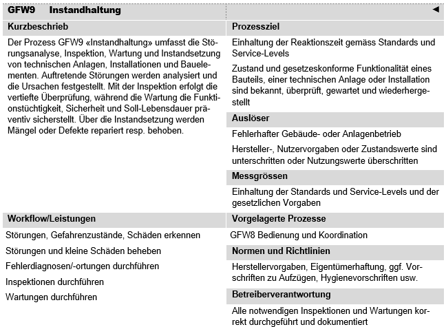
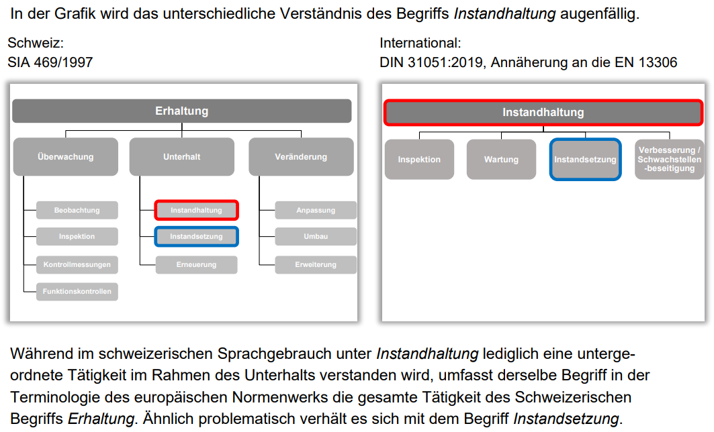
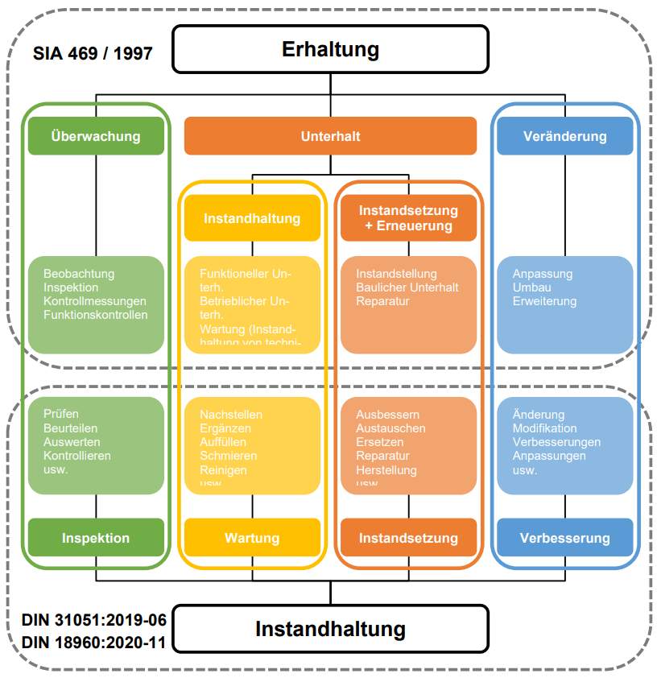
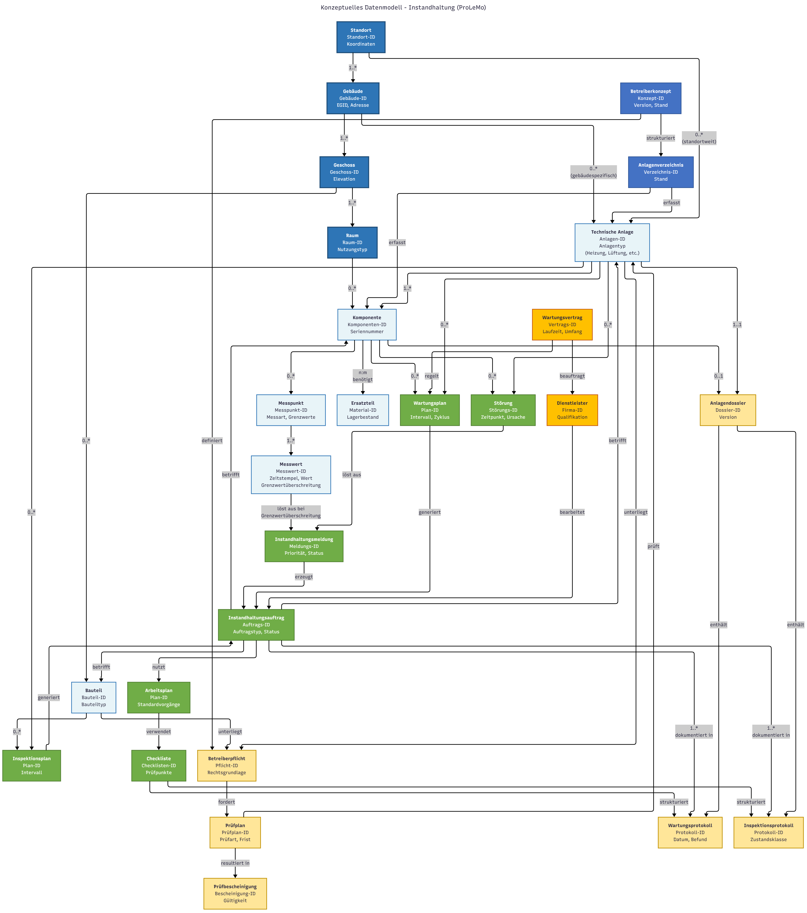

# GFW9 (Instandhaltung)

# 1. Ziel dieses Dokumentes

Dieses Fachkonzept legt die Grundlagen für ein einheitliches Verständnis und die Modellierung von Daten für den ProLeMo-Prozess GFW9 Instandhaltung als Teil des infrastrukturellen Gebäudemanagements im Bundesamt für Bauten und Logistik (BBL) fest. Es basiert ausschliesslich auf verifizierbaren Standards und öffentlich zugänglichen Dokumentationen.

Die Kernziele dieses Dokuments sind:

- **Definition zentraler Geschäftsobjekte**: Extraktion und Konsolidierung aus verifizierten Standards (ProLeMo 2021, GEFMA 110:2009, DIN 31051:2019, SIA 469:2019)
- **Standardkonformität**: Sicherstellung der Kompatibilität mit nationalen und internationalen Best-Practice-Standards
- **Interoperabilität**: Schaffung einer Basis für die Integration mit bestehenden BBL-Systemen (SAP PM, SAP RE-FX, Korasoft)
- **Datenqualität**: Definition klarer Identifikatoren und Attribute basierend auf etablierten Normen
- **Praxisrelevanz**: Ableitung aus realen Implementierungen und ProLeMo-Prozessmodell

# 2. Instandhaltung - Aufgaben und Bedeutung

### 2.1 Rolle im Immobilienmanagement

Der Prozess GFW9 Instandhaltung bildet gemäss ProLeMo 2021 einen der zentralen Kernprozesse des infrastrukturellen Gebäudemanagements (IGM). Nach GEFMA 100 entfallen 20-35% der gesamten Bewirtschaftungskosten auf Instandhaltungsleistungen, womit die Instandhaltung zu den kostenintensivsten FM-Leistungen gehört. Als operative Schnittstelle zwischen Gebäudetechnik, Nutzern und Facility Management beeinflusst die Instandhaltung direkt die Verfügbarkeit und Zuverlässigkeit der technischen Anlagen, die Werterhaltung der Immobilien sowie die Erfüllung gesetzlicher Auflagen zur Betreiberhaftung.

Der Prozess umfasst nicht nur die reaktive Störungsbehebung, sondern auch die präventive Wartung, systematische Inspektionen und die planmässige Instandsetzung. Dadurch wird ein ganzheitlicher Ansatz für Funktionalität, Sicherheit und Werterhaltung gewährleistet.

Bild: ProLeMo Steckbrief. [Quelle](https://object.gever.admin.ch:443/web/?ObjectToOpenID=%24ActaNovaDocument%7cD49E9907-5A31-4FCC-B348-EAA654C8B155&TenantID=169)

### 2.2 Inhaltliche Dimensionen

Basierend auf ProLeMo 2021, GEFMA 110:2009 und DIN 31051:2019 umfasst der Prozess GFW9 Instandhaltung folgende zentrale Dimensionen:

**Inspektion:**

- Feststellen und Beurteilen des Ist-Zustands von Anlagen und Bauteilen
- Bestimmung der Ursachen der Abnutzung und Ableitung notwendiger Konsequenzen
- Durchführung von Funktionsprüfungen und Messungen gemäss Herstellervorgaben

**Wartung:**

- Massnahmen zur Verzögerung des Abbaus des vorhandenen Abnutzungsvorrats
- Reinigung, Schmierung, Nachstellen und Austausch von Verschleissteilen
- Durchführung nach festgelegten Intervallen zur Aufrechterhaltung der Funktionsfähigkeit

**Instandsetzung:**

- Wiederherstellung der Funktionsfähigkeit nach Störungen oder Ausfällen
- Reparatur oder Austausch defekter Komponenten
- Behebung von Mängeln und Defekten zur Wiedererlangung der Soll-Lebensdauer

**Verbesserung:**

- Steigerung der Funktionssicherheit ohne Änderung der ursprünglichen Funktion
- Modernisierung und technische Optimierung bestehender Anlagen
- Anpassung an neue gesetzliche Anforderungen oder Standards

Bild Links: KBOB Empfehlung zum Umgang mit der Norm SIA 469. [Quelle](https://www.kbob.admin.ch/de/bewirtschaftung)

Bild Rechts: KBOB Empfehlung zum Umgang mit der Norm SIA 469. [Quelle](https://www.kbob.admin.ch/de/bewirtschaftung)

### 2.3 Kernaufgaben

Die Kernaufgaben des Prozesses GFW9 Instandhaltung umfassen:

**Störungsmanagement:**

- Störungen und Gefahrenzustände erkennen und analysieren
- Sofortmassnahmen zur Gefahrenabwehr einleiten
- Fehlerdiagnosen durchführen und Ursachen dokumentieren

**Präventive Instandhaltung:**

- Inspektionen gemäss Wartungsplan durchführen
- Zustandsabhängige und zeitabhängige Wartungen ausführen
- Verschleissteile rechtzeitig austauschen

**Korrektive Instandhaltung:**

- Störungen und kleine Schäden beheben
- Instandsetzungen nach Bedarf durchführen
- Ersatzteile und Materialien verwalten

**Dokumentation und Compliance:**

- Wartungsprotokolle und Inspektionsberichte erstellen
- Nachweise für behördliche Prüfungen führen
- Mängelberichte und Massnahmenkataloge pflegen

**Optimierung:**

- Schwachstellenanalysen durchführen
- Instandhaltungsstrategien kontinuierlich verbessern
- Lebenszykluskosten optimieren

### 2.4 Strategische Bedeutung

**Werterhaltung und Asset Management:**

- Sicherstellung der geplanten Nutzungsdauer von technischen Anlagen und Bauteilen
- Vermeidung von Folgeschäden durch rechtzeitige Interventionen
- Optimierung der Lebenszykluskosten durch präventive Massnahmen

**Betriebssicherheit und Compliance:**

- Erfüllung der Betreiberpflichten gemäss OR, SIA und kantonalen Vorschriften
- Sicherstellung der Arbeitssicherheit gemäss SUVA und EKAS-Richtlinien
- Dokumentation als Compliance-Nachweis gegenüber Behörden und Versicherungen

**Verfügbarkeit und Nutzerzufriedenheit:**

- Minimierung ungeplanter Ausfallzeiten kritischer Anlagen
- Gewährleistung komfortabler Nutzungsbedingungen
- Schnelle Reaktion auf Störungen und Nutzeranliegen

**Nachhaltigkeit und Energieeffizienz:**

- Optimaler Betrieb technischer Anlagen zur Energieeinsparung
- Verlängerung der Lebensdauer durch fachgerechte Pflege
- Reduzierung des Ressourcenverbrauchs durch präventive Wartung

**Digitalisierung und Innovation:**

- Integration in BIM2FM-Workflows für durchgängige Anlagendokumentation
- Predictive Maintenance durch IoT-Sensoren und Datenanalyse
- Mobile Instandhaltung mit digitalen Wartungsprotokollen

# 3. Empfehlung Geschäftsobjekte (Konsolidiert)

Bedeutung der Prioritätsstufen:

- **Muss**: Zwingend erforderlich gemäss gesetzlichen Vorgaben oder BBL-Standards
- **Soll**: Wichtig für vollständige fachliche Abbildung gemäss Best Practice
- **Kann**: Erweiterte Funktionalität für Optimierung

|  | Gruppe/Geschäftsobjekt | Priorität | Beschreibung | Primäre Identifikatoren | Relevante Standards | Kommentar |
| --- | --- | --- | --- | --- | --- | --- |
| 1 | **Räumliche Strukturierung** |  |  |  |  |  |
| 2 | Standort | Muss | Geografischer Ort mit technischer Infrastruktur | Standort-ID, Koordinaten, PLZ | IFC:IfcSite, SAP PM | Oberste Hierarchie für alle Anlagen |
| 3 | Gebäude | Muss | Bauwerk als zentrale Struktureinheit | Gebäude-ID, EGID, Adresse | IFC:IfcBuilding, OR Art. 58 | Werkeigentümerhaftung |
| 4 | Geschoss | Soll | Stockwerk innerhalb eines Gebäudes | Geschoss-ID, Gebäude-ID, Elevation | IFC:IfcBuildingStorey | Strukturierung |
| 5 | Raum | Soll | Abgeschlossener Bereich | Raum-Nr, Geschoss-ID, Nutzungstyp | IFC:IfcSpace, SAP PM | Lokalisierung von Komponenten |
| 6 | Liegenschaft | Kann | Grundstück mit Eigentumsverhältnissen | Grundbuch-Nr, Parzellen-Nr | OR Art. 58 | Nur bei Immobilien relevant |
| 7 | **Instandhaltungsobjekte** |  |  |  |  |  |
| 8 | Technische Anlage | Muss | Hierarchische Gruppierung technischer Systeme | Anlagen-ID, Systemtyp, TP-Nummer | SAP PM:Technischer Platz, IFC:IfcSystem | Kernstruktur SAP PM |
| 9 | Komponente (Equipment) | Muss | Individuelle wartbare technische Einheit | Equipment-Nr, Seriennummer, Typ | SAP PM:Equipment, DIN 31051 | Träger der Wartungshistorie |
| 10 | Bauteil | Muss | Konstruktive Gebäudeelemente | Bauteil-ID, Typ, Lage | IFC:IfcBuildingElement, SIA 469 | Inspektionspflichtig |
| 11 | Messpunkt (Sensor, Zähler) | Muss | Punkt für Zustandserfassung | Messpunkt-ID, Equipment-ID, Messart | SAP PM, IFC:IfcSensor | Condition Monitoring |
| 12 | Betriebsmesswert (Messbeleg) | Soll | Dokumentierte Messwerte | Messwert-ID, Messpunkt-ID, Wert, Zeitstempel | SAP PM | Trendanalysen, kann IH-Aufträge auslösen |
| 13 | Ersatzteil | Soll | Lagerhaltiges Material für IH | Material-Nr, Lagerort, Bestand | SAP PM:QMAT | Verfügbarkeitskritisch |
| 14 | Produkt | Kann | Standardbauprodukte | Artikel-Nr, Hersteller | IFC:IfcProduct | Ersatzteilkataloge |
| 15 | **Instandhaltungssteuerung** |  |  |  |  |  |
| 16 | IH-Auftrag | Muss | Arbeitsauftrag für Instandhaltung | Auftrags-Nr, Typ, Status | SAP PM, DIN 31051 | Zentrales Steuerungselement |
| 17 | IH-Meldung | Muss | Störungs-/Wartungsbedarf | Meldungs-Nr, Priorität, Status | SAP PM, ProLeMo | Eingangskanal |
| 18 | Wartungsplan | Muss | Zyklische Wartungsaktivitäten | Plan-Nr, Zyklus, Equipment-ID | SAP PM, DIN 31051 | Präventive IH |
| 19 | Inspektionsplan | Muss | Zustandsfeststellungen | Plan-Nr, Intervall, Objekt-ID | SIA 469, SAP PM | Zustandsorientierte IH |
| 20 | Störung | Soll | Dokumentierter Ausfall | Störungs-Nr, Zeitstempel, Ursache | DIN 31051 | Ausfallanalyse |
| 21 | Arbeitsplan | Soll | Standardisierte Arbeitsabläufe | Arbeitsplan-Nr, Vorgänge | SAP PM | Effizienzsteigerung |
| 22 | **Compliance & Dokumentation** |  |  |  |  |  |
| 23 | Betreiberpflichten | Muss | Rechtliche Pflichten je Objekt | Pflichten-ID, Objekt-ID, Rechtsgrundlage | OR Art. 58/59, SUVA | Haftungsrelevant |
| 24 | Prüfplan | Muss | Plan für gesetzliche Prüfungen | Prüfplan-Nr, Prüfart, Frist | Aufzugsverordnung, EKAS | SV/SK-Prüfungen |
| 25 | Wartungsprotokoll | Muss | Nachweis durchgeführter Wartung | Protokoll-Nr, Datum, Auftrag-Nr | DIN 31051 | Compliance-Nachweis |
| 26 | Inspektionsprotokoll | Muss | Zustandsdokumentation | Protokoll-Nr, Zustandsklasse | SIA 469, NS-INSTA 610 | Zustandshistorie |
| 27 | Prüfbescheinigung | Muss | Nachweis gesetzlicher Prüfungen | Bescheinigungs-Nr, Gültigkeit | Behördliche Vorschriften | Pflichtnachweis |
| 28 | Checkliste | Soll | Strukturierte Prüfliste | Checklisten-ID, Version, Prüfpunkte | VDMA, DIN | Qualitätssicherung |
| 29 | Risiko / Gefährdungsbeurteilung | Soll | Risikoanalyse | Beurteilungs-ID, Gefährdungen | EKAS 6512 | Arbeitsschutz |
| 30 | **Vertrags- & Lieferantenmanagement** |  |  |  |  |  |
| 31 | Wartungsvertrag | Muss | Rahmenvertrag IH-Leistungen | Vertrags-Nr, Laufzeit, Umfang | BUW 1.1.10 | Dienstleistersteuerung |
| 32 | Dienstleister | Soll | Externe Wartungsfirma | Firma-ID, Qualifikationen | EKAS, SUVA | Geschäftsobjekttyp: Akteur |
| 33 | Garantie | Kann | Gewährleistungsansprüche | Garantie-Nr, Ablaufdatum | HBA UC128.4 | Kostenoptimierung |
| 34 | **Organisatorisches** |  |  |  |  |  |
| 35 | Betreiberkonzept | Muss | Umfassendes Betreiberverantwortungskonzept | Konzept-ID, Version, Stand | ProLeMo, OR Art. 58 | Zentrale Referenz |
| 36 | Anlagenverzeichnis | Soll | Strukturierte IH-Objektliste | Verzeichnis-ID, Stand | GEFMA 110 | Basis für Ausschreibungen, wird aus GO Technische Anlage erstellt |
| 37 | Verantwortlicher | Soll | Zuständige Person/Rolle | Person-ID, Rolle, Bereich | ProLeMo | Geschäftsobjekttyp: Rolle |
| 38 | **Dokumentenverwaltung** |  |  |  |  |  |
| 39 | Anlagendossier | Muss | Gesamtdokumentation einer Anlage/Komponente | Dossier-ID, Equipment-ID, Version | SIA 469:Bauwerksakten, IFC:IfcDocumentInformation | Container für alle Dokumente einer Anlage |
| 40 | Dokument | Muss | Einzelnes Dokument/Datei | Dokument-ID, Typ, Format, Datum | ISO 15489, IFC:IfcDocumentReference | Basis-Objekt für alle Dokumentarten |
| 41 | Foto | Kann | Bilddokumentation aus Inspektionen | Foto-ID, Aufnahmedatum, GPS, Objekt-ID | EXIF-Standard | Geschäftsobjekttyp von Dokument |
| 42 | Technisches Datenblatt | Soll | Herstellerdokumentation | Datenblatt-ID, Hersteller, Version | VDI 2770 | Geschäftsobjekttyp von Dokument |
| 43 | Plan/Zeichnung | Soll | Technische Zeichnungen, Schemas | Plan-ID, Planart, Maßstab | IFC:IfcDocumentReference | Geschäftsobjekttyp von Dokument |

Tabelle: Empfehlung Geschäftsobjekte (Konsolidiert)

Bild: Konzeptuelles Datenmodell. [Quelle](https://www.mermaidchart.com/d/02d389d6-2ebf-443a-a3c8-77ab1ce1dd47)

# 4. Übersicht der relevanten Standards und Beispiele

### 4.1 Standards als Tabelle

|  | Kategorie/Name | Zweck (Kurz) | Relevanz für BBL | Anwendung BBL | Schnittstellen | Status | Anmerkungen |
| --- | --- | --- | --- | --- | --- | --- | --- |
| 1 | **RECHTLICHE GRUNDLAGEN** |  |  |  |  |  |  |
| 2 | OR Art. 58/59 | Werkeigentümerhaftung | Sehr hoch | Betreiberpflicht, Sorgfaltspflicht | SUVA, kantonale Behörden | Aktiv | Schweizer Obligationenrecht |
| 3 | ArGV 3 SR 822.113 | Gesundheitsschutz am Arbeitsplatz | Sehr hoch | Technische Anlagen, Raumklima | SUVA, SECO | Aktiv | Bundesverordnung |
| 4 | EKAS-Richtlinie 6512 | Arbeitssicherheit | Hoch | Sicherheitsprüfungen Anlagen | EKAS, SUVA | Aktiv | Eidgenössische Kommission |
| 5 | Druckgeräteverordnung | Sicherheit Druckgeräte | Hoch | Heizung, Dampf, Druckluft | SVTI | Aktiv | Periodische Prüfpflicht |
| 6 | Aufzugsverordnung | Aufzugssicherheit | Sehr hoch | Personenaufzüge, Lastenaufzüge | Aufzugsinspektorate | Aktiv | Kantonale Regelungen |
| 7 | **BBL WEISUNGEN UND PROZESSE** |  |  |  |  |  |  |
| 8 | Weisungen Betrieb (zu detalieren) | BBL-Betriebsstandards | Sehr hoch | Verbindliche Vorgaben Instandhaltung | SAP PM | Aktiv | Stand 19. Juni 2023 |
| 9 | D0.21.40.20.20 Wartung durchführen | Detailprozess | Sehr hoch | Wartungsabläufe | SAP PM | Aktiv | BBL-Prozessmodell |
| 10 | **BBL FACHANWENDUNGEN** |  |  |  |  |  |  |
| 11 | SAP PM | Plant Maintenance | Sehr hoch | Wartungsplanung, Aufträge | SAP RE-FX | Produktiv | Kernsystem Instandhaltung |
| 12 | **TECHNISCHE STANDARDS** |  |  |  |  |  |  |
| 13 | DIN 31051:2019 | Grundlagen Instandhaltung | Sehr hoch | Begriffe, Strategien | GEFMA | Aktiv | Deutsche Grundnorm |
| 14 | GEFMA 110:2009 | Terminologie Instandhaltung | Sehr hoch | Begriffsdefinitionen | DIN 31051 | Aktiv | FM-spezifisch |
| 15 | SIA 469:2019 | Erhaltung von Bauwerken | Sehr hoch | Erhaltungsstrategie | SIA 113 | Aktiv | Schweizer Norm |
| 16 | SIA 113:2021 | FM-Norm | Hoch | FM-Prozesse | SIA 469 | Aktiv | Übergeordnete FM-Norm |
| 17 | VDI 2895:2012 | Zustandsorientierte IH | Hoch | Condition Monitoring | - | Aktiv | Predictive Maintenance |
| 18 | VDMA 24186 | Wartung gebäudetechnischer Anlagen | Hoch | Wartungsintervalle | DIN 31051 | Aktiv | Branchenstandard |
| 19 | NS-INSTA 610:2018 | Zustandsbewertung | Mittel | Zustandsgrade 0-3 | - | Aktiv | Norwegischer Standard |
| 20 | ISO 16739:2018 (IFC4) | BIM-Datenaustausch-Standard | Sehr hoch | BIM2FM-Integration, Anlagendaten | CAFM-Connect, SAP PM | Aktiv | Industry Foundation Classes für durchgängigen Datenaustausch Planung-Bau-Betrieb. IFC4.3 (2024) erweitert |
| 21 | RealEstateCore (REC) | Semantische Ontologie für Immobiliendaten | Hoch | BIM2FM-Integration, IoT-Sensordaten, Anlagenmodellierung | IFC, Brick Schema, Azure Digital Twins | Aktiv | Semantic Web Ontologie für Gebäude-, Raum- und Anlagendaten. Basis für digitale Zwillinge und IoT-Integration. Version 4.0 (2023) mit Fokus auf Betriebsdaten |
| 22 | **EXTERNE BEISPIELE** |  |  |  |  |  |  |
| 23 | ETH Zürich FM | Best Practice Hochschule | Mittel | Referenzimplementierung | SAP PM | Aktiv | Vergleichbare Struktur |
| 24 | SBB Infrastruktur | Bahninfrastruktur IH | Mittel | Verfügbarkeitsmanagement | - | Aktiv | Hochverfügbarkeit |
| 25 | Siemens Building Technologies | Technisches FM | Mittel | Service-Konzepte | - | Aktiv | Industrie-Best-Practice |
| 26 | **EXTERNE BEISPIELE - Anwendungsfälle BIM** |  |  |  |  |  |  |
| 27 | BuildingSMART UCM: Wartung | BIM-basierte Wartungsprozesse | Hoch | BIM2FM-Integration | IFC, ProLeMo | Aktiv | Use Case Management |
| 28 | **EXTERNE BEISPIELE - WUP Prozessmodell** |  |  |  |  |  |  |
| 29 | BUW-Prozessmodell: Leistungsausschreibung Wartungsmanagement | Ausschreibung Wartungsleistungen | Sehr hoch | Anlagenverzeichnis, Wartungs-LV, Vertragsbedingungen | Betreiberkonzept, Raumbuch | Aktiv seit 2015 | Prozess 1.1.10, Uni Wuppertal |
| 30 | BUW-Prozessmodell: Leistungsausschreibung wiederkehrende Prüfung | Ausschreibung SV/SK-Prüfungen | Sehr hoch | Prüfungs-LV, Prüfungsintervalle | Anlagenverzeichnis | Aktiv seit 2015 | Prozess 1.1.11, Uni Wuppertal |
| 31 | BUW-Prozessmodell: Leistungsausschreibung Inspektionsmanagement | Ausschreibung Inspektionsleistungen | Sehr hoch | Inspektions-LV, Inspektionsplan | Betreiberkonzept, Anlagenverzeichnis | Aktiv seit 2015 | Prozess 1.1.12, Uni Wuppertal |
| 32 | BUW-Prozessmodell: Leistungsausschreibung Sonderleistung | Ausschreibung Sonderleistungen TGM/IGM | Hoch | Verzeichnis Sonderleistungen, SL-LV | Betreiberkonzept | Aktiv seit 2015 | Prozess 1.1.13, Uni Wuppertal |
| 33 | BUW-Prozessmodell: Wartung organisieren | Organisation und Planung Wartung | Sehr hoch | Wartungsplan, Ressourcenplanung | Anlagenverzeichnis | Aktiv seit 2015 | Prozess 1.2.22, Uni Wuppertal |
| 34 | BUW-Prozessmodell: Inspektion organisieren | Organisation und Planung Inspektion | Sehr hoch | Inspektionsplan, Checklisten | Anlagenverzeichnis | Aktiv seit 2015 | Prozess 1.2.23, Uni Wuppertal |
| 35 | BUW-Prozessmodell: SV-Prüfungen organisieren | Organisation sicherheitstechnischer Prüfungen | Sehr hoch | Prüffristen, Prüfprotokolle | Behördenvorgaben | Aktiv seit 2015 | Prozess 1.2.26, Uni Wuppertal |
| 36 | BUW-Prozessmodell: Wartungsfirma unterweisen | Unterweisung externer Dienstleister | Hoch | Sicherheitskonzept, Objekteinweisung | Betreiberkonzept | Aktiv seit 2015 | Prozess 1.2.30, Uni Wuppertal |
| 37 | BUW-Prozessmodell: Anlagen und Einrichtungen warten | Operative Wartungsdurchführung | Sehr hoch | Wartungsprotokolle, Checklisten | Wartungsplan | Aktiv seit 2015 | Prozess 1.4.20/1.4.31, Uni Wuppertal |
| 38 | BUW-Prozessmodell: Gewährleistungs- u. Mängelmanagement | Mängelverfolgung und -beseitigung | Hoch | Mängelliste, Nachbesserung | Vertragsmanagement | Aktiv seit 2015 | Prozess 1.4.21, Uni Wuppertal |
| 39 | BUW-Prozessmodell: Anlagen und Einrichtungen inspizieren | Operative Inspektionsdurchführung | Sehr hoch | Inspektionsprotokolle, Zustandsbewertung | Inspektionsplan | Aktiv seit 2015 | Prozess 1.4.24/1.4.34, Uni Wuppertal |
| 40 | **EXTERNE BEISPIELE - Anwendungsfälle Stadt Zürich** |  |  |  |  |  |  |
| 41 | Stadt Zürich UC005.1: Equipmentdaten verwalten | Stammdatenpflege technische Anlagen | Sehr hoch | Anlagenkatalog, technische Daten | CAFM, BIM | Aktiv | Fachdatenkatalog Stadt Zürich |
| 42 | Stadt Zürich UC005.2: Equipments verwalten | Lebenszyklus-Management Anlagen | Sehr hoch | Von Beschaffung bis Entsorgung | SAP PM, CAFM | Aktiv | Fachdatenkatalog Stadt Zürich |
| 43 | Stadt Zürich UC007.1: Wartungen und Inspektionen planen | Digital unterstützte IH-Planung | Sehr hoch | Wartungsintervalle, Ressourcenplanung | Equipmentdaten, IH-Strategie | Aktiv | Fachdatenkatalog Stadt Zürich |
| 44 | Stadt Zürich UC024.1: Strukturierte Ausrüstungsanforderungen | Maschinenlesbare Anforderungen | Hoch | Ausrüstungsstandards, Spezifikationen | BIM, Produktdaten | Aktiv | Fachdatenkatalog Stadt Zürich |
| 45 | Stadt Zürich UC028.2: Inventarliste für FM-Leistungen erstellen | Automatisierte Anlagenlisten | Sehr hoch | Anlagenverzeichnis, Equipmentlisten | BIM, CAFM | Aktiv | Fachdatenkatalog Stadt Zürich |
| 46 | Stadt Zürich UC038.4: Pendenzen und Mängel verwalten | Zentrale Mängelverwaltung | Hoch | Mängelliste, Statusverfolgung | CAFM, Ticketsystem | Aktiv | Fachdatenkatalog Stadt Zürich |
| 47 | Stadt Zürich UC043.1: Gesetzliche Vorgaben verwalten | Compliance-Management | Sehr hoch | Prüfpflichten, Vorschriften | Behördenvorgaben | Aktiv | Fachdatenkatalog Stadt Zürich |
| 48 | Stadt Zürich UC128.4: Garantien verwalten/überwachen | Garantiemanagement | Hoch | Garantiefristen, Ansprüche | Vertragsmanagement | Aktiv | Fachdatenkatalog Stadt Zürich |
| 49 | Stadt Zürich UC131.1: Betriebskosten berechnen | Digitalisierte Kostenberechnung | Hoch | IH-Kosten, LCC-Betrachtung | Controlling, SAP | Aktiv | Fachdatenkatalog Stadt Zürich |

Tabelle: Übersicht der relevanten Standards und Beispiele

### 4.2 Bewertungskriterien für "Relevanz für BBL"

- **Sehr hoch**: Gesetzlich vorgeschrieben, BBL-Kernsystem oder verbindliche Weisung
- **Hoch**: Best Practice Schweiz, wichtig für Qualität oder Integration
- **Mittel**: Ergänzend, für Spezialfälle oder internationale Referenz
- **Niedrig**: Informativ, geringe direkte Anwendbarkeit

### 4.3 Strategische Einordnung

- **Rechtliche Grundlagen**: Rechtlich bindende Vorgaben auf Bundesebene (OR Art. 58, ArGV 3, Druckgeräteverordnung, Aufzugsverordnung) sowie Richtlinien der EKAS und SUVA. Diese Standards definieren zwingende Mindestanforderungen für Betreiberpflichten, Arbeitssicherheit und technische Prüfungen.
- **BBL Weisungen und Prozesse**: Interne verbindliche Standards und Prozessmodelle (BBL-Weisungen, ProLeMo 2021), die den organisatorischen Rahmen und die Prozesslandschaft für Instandhaltungsleistungen definieren.
- **BBL Fachanwendungen**: Operative IT-Systeme (SAP PM, SAP RE-FX, Korasoft), die für die Planung, Steuerung und Dokumentation von Instandhaltungsmassnahmen eingesetzt werden und Schnittstellen für Datenintegration bieten.
- **Technische Standards**: Normative Vorgaben (DIN, GEFMA, SIA, VDI, VDMA) sowie Integrations-Standards (CAFM-Connect), die fachliche Anforderungen, Instandhaltungsstrategien und Datenaustauschformate definieren.
- **Externe Beispiele**: Verifizierte Praxisbeispiele und Best-Practice-Implementierungen (BuildingSMART UCM, ETH Zürich, SBB, Siemens), die als Referenz für erfolgreiche Umsetzungen dienen und innovative Ansätze aufzeigen.

# 5. Wichtigste Standards im Detail (Schrittweise Ergänzung)

Zur einheitlichen Klassifizierung der Begriffe und Standards werden folgende Kategorien verwendet:

- **Fachanwendung:** IT-Systeme, Register oder Plattformen
- **Geschäftsprozess:** Strukturierte Abfolge von Aktivitäten zur Erreichung eines definierten Geschäftsziels
- **Geschäftsobjekt:** Eigenständige fachliche Entitäten mit eindeutiger Identität
- **Geschäftsobjekttyp:** Spezialisierungen oder Ausprägungen von Geschäftsobjekten
- **Dokument:** Informationsträger zur Dokumentation, Kommunikation oder Nachweisführung
- **Attribut:** Eigenschaften oder Merkmale von Geschäftsobjekten
- **Fachbegriff:** Konzepte, Definitionen oder Klassifikationen ohne eigenständige Objektnatur
- **Relation:** Beziehungen und Verknüpfungen zwischen Geschäftsobjekten

## 5.1 OR Art. 58/59 - Werkeigentümerhaftung

- **Priorität:** Sehr hoch
- **Dokumentation:**
  - Schweizerisches Obligationenrecht (OR): <https://www.fedlex.admin.ch/eli/cc/27/317_321_377/de>
  - Art. 58: Ersatzpflicht bei Werkmängeln
  - Art. 59: Sichernde Massregeln
- **Beschreibung:** Die Werkeigentümerhaftung gemäss OR Art. 58/59 regelt die rechtliche Verantwortung des Eigentümers eines Gebäudes oder anderen Werkes für Schäden, die durch fehlerhafte Anlage, Herstellung oder mangelhafte Unterhaltung entstehen. Diese Haftung ist verschuldensunabhängig (Kausalhaftung) und bildet die rechtliche Grundlage für Betreiberpflichten im Facility Management.
- **Relevanz für BBL:** Sehr hoch - Als Eigentümerin und Verwalterin von Bundesbauten trägt das BBL die volle Werkeigentümerhaftung. Die Einhaltung der Instandhaltungspflichten gemäss OR Art. 58 ist zwingend erforderlich zur Vermeidung von Haftungsansprüchen und zur Gewährleistung der Sicherheit.

|  | Begriff | Kategorie | Beschreibung | Relevanz für BBL | Kommentar |
| --- | --- | --- | --- | --- | --- |
| 1 | Werkeigentümer | Fachbegriff | Eigentümer eines Gebäudes oder eines anderen Werkes | Sehr hoch | BBL als Eigentümerin der Bundesbauten |
| 2 | Gebäude | Geschäftsobjekt | Bauwerk im Sinne der Werkeigentümerhaftung | Sehr hoch | Alle vom BBL verwalteten Immobilien |
| 3 | anderes Werk | Geschäftsobjekt | Bauliche Anlage ausser Gebäuden (z.B. Brücken, Mauern, Parkplätze) | Sehr hoch | Erweitert den Haftungsbereich über Gebäude hinaus |
| 4 | fehlerhafte Anlage | Fachbegriff | Mangel in der ursprünglichen Konzeption oder Planung | Sehr hoch | Planungsfehler, die zu Schäden führen können |
| 5 | fehlerhafte Herstellung | Fachbegriff | Mangel in der Bauausführung | Sehr hoch | Baumängel aus der Erstellungsphase |
| 6 | mangelhafte Unterhaltung | Fachbegriff | Ungenügende Instandhaltung und Wartung | Sehr hoch | Kernbereich der Betreiberhaftung, direkte Relevanz für GFW9 Instandhaltung |
| 7 | Schaden | Fachbegriff | Vermögens- oder Personenschaden durch Werkmangel | Sehr hoch | Haftungsauslösendes Ereignis |
| 8 | Ersatzpflicht | Fachbegriff | Verschuldensunabhängige Haftung des Eigentümers | Sehr hoch | Kausalhaftung, keine Exkulpationsmöglichkeit |
| 9 | Rückgriff | Fachbegriff | Regressanspruch gegen verantwortliche Dritte | Hoch | Z.B. gegen Wartungsfirmen, Planer, Unternehmer |
| 10 | erforderliche Massregeln | Geschäftsprozess | Präventive Sicherungsmassnahmen zur Gefahrenabwendung | Sehr hoch | Proaktive Instandhaltungsstrategie |
| 11 | Abwendung der Gefahr | Fachbegriff | Beseitigung oder Minimierung von Gefährdungen | Sehr hoch | Ziel der präventiven Instandhaltung |
| 12 | Anordnungen der Polizei | Dokument | Behördliche Verfügungen zum Schutz von Personen und Eigentum | Sehr hoch | Compliance-Anforderungen, sofortiger Handlungsbedarf |

## 5.2 SIA 469:1997 - Erhaltung von Bauwerken

- **Priorität:** Sehr hoch
- **Dokumentation:**
  - SIA 469:1997 Erhaltung von Bauwerken (Original Dokument): [SIA 469\_1997 Erhaltung von Bauwerken d.pdf](https://object.gever.admin.ch:443/web/?ObjectToOpenID=%24ActaNovaDocument%7c13862E2F-4F87-41E5-BDBD-EAB9E3B71CB9&TenantID=169)
  - Ersetzt: Empfehlung SIA 169 (1987) und Richtlinie 160/3 (1975)
  - Gültigkeit: In Kraft seit 1. August 1997
- **Beschreibung:** Die SIA 469 definiert systematisch die Massnahmen und Tätigkeiten im Zusammenhang mit der Bauwerkserhaltung und legt die entsprechenden Begriffe fest. Sie umfasst Verständigung, Erhaltungsziele, Erhaltungsmassnahmen und -tätigkeiten sowie Bauwerksakten. Die Norm gilt für alle Arten von Bauwerken und ordnet erstmals die Erhaltungstätigkeiten systematisch.
- **Relevanz für BBL:** Sehr hoch - Als schweizerische Grundnorm für Bauwerkserhaltung ist die SIA 469 zentral für die Strukturierung und Terminologie des GFW9-Prozesses. Sie definiert die Kernbegriffe und das hierarchische Ablaufschema der Erhaltung.

|  | Begriff | Kategorie | Beschreibung | Relevanz für BBL | Kommentar |
| --- | --- | --- | --- | --- | --- |
| 1 | **Begriffe zur Bauwerkserhaltung** |  |  |  |  |
| 2 | Bauwerkserhaltung | Geschäftsprozess | Gesamtheit der Tätigkeiten und Massnahmen zur Sicherstellung des Bestandes sowie der materiellen und kulturellen Werte eines Bauwerks | Sehr hoch | Übergeordneter Prozess, entspricht GFW9 |
| 3 | **Überwachungstätigkeiten** |  |  |  |  |
| 4 | Überwachung | Geschäftsprozess | Feststellen und Bewerten des Zustandes mit Empfehlungen für das weitere Vorgehen | Sehr hoch | Umfasst planbare und nicht planbare Tätigkeiten |
| 5 | Beobachtung | Geschäftsprozess | Überprüfen der Gebrauchstauglichkeit durch einfache und regelmässige, in der Regel visuelle Kontrollen | Sehr hoch | Daueraufgabe, Teil der Instandhaltung |
| 6 | Inspektion | Geschäftsprozess | Feststellen des Zustandes durch gezielte, in der Regel visuelle und einfache Untersuchungen mit Bewertung desselben | Sehr hoch | Hauptinspektion, Zwischeninspektion, Sonderinspektion |
| 7 | Kontrollmessung | Geschäftsprozess | Messtechnisches Überwachen ausgewählter Kenngrössen | Sehr hoch | Periodisch, Meldewert/Alarmwert |
| 8 | Funktionskontrolle | Geschäftsprozess | Gezieltes Überprüfen des Funktionierens von technischen Anlagen und anderen Teilen eines Bauwerks | Sehr hoch | Besonders für technische Anlagen |
| 9 | **Überprüfung** |  |  |  |  |
| 10 | Überprüfung | Geschäftsprozess | Beurteilen des Zustandes anhand der Ergebnisse der Überwachung und anhand allfälliger vertiefter Untersuchungen | Sehr hoch | Stufenweises Vorgehen empfohlen |
| 11 | Beurteilung der Sicherheit | Fachbegriff | Beurteilung von Tragsicherheit und Betriebssicherheit | Sehr hoch | Nach SIA 160 und Richtlinie SIA 462 |
| 12 | Beurteilung der Gebrauchstauglichkeit | Fachbegriff | Überprüfung aufgrund der im Nutzungsplan festgelegten Anforderungen | Sehr hoch | Umfasst Gebäudehülle, Raumklima, Ausbau, Tragwerk |
| 13 | Prognose der Zustandsentwicklung | Fachbegriff | Abschätzung der technisch zulässigen Restnutzungsdauer mit Angabe des spätesten Eingriffstermins | Sehr hoch | Kritisch für Erhaltungsplanung |
| 14 | **Sofortmassnahmen** |  |  |  |  |
| 15 | Sofortmassnahme | Geschäftsprozess | Durch Überwachung oder Überprüfung veranlasste, unverzüglich auszuführende Massnahmen | Sehr hoch | Verbesserung von Sicherheit und Gebrauchstauglichkeit |
| 16 | **Erhaltungsplanung** |  |  |  |  |
| 17 | Erhaltungsplanung | Geschäftsprozess | Ausarbeiten eines Erhaltungskonzeptes für einen festgelegten Zeitabschnitt | Sehr hoch | Variantenstudie und Optimierung |
| 18 | Erhaltungsvarianten | Dokument | Zeitliche Abfolge von ausgewählten Erhaltungsmassnahmen | Sehr hoch | Instandsetzung, Erneuerung, Veränderung, Ersatz |
| 19 | Erhaltungskonzept | Dokument, Geschäftsobjekt | Beschreibung der optimalen Erhaltungsvariante | Sehr hoch | Geschäftsobjekt-Potenzial: Strukturierte Massnahmenplanung mit Terminen und Kosten |
| 20 | **Massnahmenplanung** |  |  |  |  |
| 21 | Massnahmenplanung | Geschäftsprozess | Projektieren der im Erhaltungskonzept beschriebenen und durch Grundsatzentscheid festgelegten Erhaltungsmassnahmen | Sehr hoch | Detailprojektierung |
| 22 | **Unterhaltsmassnahmen** |  |  |  |  |
| 23 | Unterhalt | Geschäftsprozess | Bewahren oder Wiederherstellen eines Bauwerks ohne wesentliche Änderung der Anforderungen | Sehr hoch | Überbegriff für Instandhaltung und Instandsetzung |
| 24 | Instandhaltung | Geschäftsprozess | Bewahren der Gebrauchstauglichkeit durch einfache und regelmässige Massnahmen | Sehr hoch | Synonyme: Wartung (techn. Anlagen), funktioneller/betrieblicher Unterhalt |
| 25 | Instandsetzung | Geschäftsprozess | Wiederherstellen der Sicherheit und der Gebrauchstauglichkeit für eine festgelegte Dauer | Sehr hoch | Synonyme: Instandstellung, baulicher Unterhalt, Reparatur |
| 26 | Erneuerung | Geschäftsprozess | Wiederherstellen eines gesamten Bauwerks oder von Teilen in einen mit dem ursprünglichen Neubau vergleichbaren Zustand | Sehr hoch | Grösserer Umfang als Instandsetzung |
| 27 | **Veränderung** |  |  |  |  |
| 28 | Veränderung | Geschäftsprozess | Eingreifen in ein Bauwerk zwecks Anpassung an neue Anforderungen | Sehr hoch | Oberbegriff für Anpassung, Umbau, Erweiterung |
| 29 | Anpassung | Geschäftsprozess | Anpassen eines Bauwerks an neue Anforderungen, ohne wesentliche Eingriffe | Hoch | Synonym: Modernisierung (in speziellen Fällen) |
| 30 | Umbau | Geschäftsprozess | Anpassen an neue Anforderungen, mit wesentlichen Eingriffen in das Bauwerk | Sehr hoch | Grössere Eingriffe als Anpassung |
| 31 | Erweiterung | Geschäftsprozess | Anpassen an neue Anforderungen durch Hinzufügen neuer Bauwerksteile | Hoch | Synonyme: Anbau, Aufstockung, Vergrösserung |
| 32 | **Dokumentation** |  |  |  |  |
| 33 | Bauwerksakten | Geschäftsobjekt | Alle Dokumente, die Informationen über das Bauwerk enthalten | Sehr hoch | Geschäftsobjekt-Potenzial: Zentrale Dokumentenverwaltung mit strukturierten Kategorien |
| 34 | Überwachungsplan | Dokument, Geschäftsobjekt | Plan mit zu überwachenden Einwirkungen, Zeitraster der Inspektionen, Hinweise für Kontrollmessungen | Sehr hoch | Geschäftsobjekt-Potenzial: Strukturierte Planungsdaten |
| 35 | Unterhaltsplan | Dokument, Geschäftsobjekt | Bezeichnung der planbaren regelmässigen Unterhaltsarbeiten | Sehr hoch | Geschäftsobjekt-Potenzial: Basis für operative Wartungsplanung |
| 36 | Nutzungsplan | Dokument | Zu berücksichtigende Nutzungszustände und Anforderungen an Gebrauchstauglichkeit gemäss SIA 160 | Sehr hoch | Referenzdokument für Anforderungen |
| 37 | Sicherheitsplan | Dokument | Gefährdungsbilder und Massnahmen hinsichtlich Trag- und Betriebssicherheit gemäss SIA 160 | Sehr hoch | Compliance-relevant |
| 38 | Inspektionsbericht | Dokument | Dokumentation des Zustandes, Zustandsbewertung, Sofortmassnahmen, Empfehlungen | Sehr hoch | Standardisierter Inhalt definiert |
| 39 | Überprüfungsbericht | Dokument | Zustandsbeschreibung, Beurteilung Sicherheit/Gebrauchstauglichkeit, Prognose, Empfehlungen | Sehr hoch | Strukturierte Berichtsinhalte |

## 5.X DIN 31051:2012-09 - Grundlagen der Instandhaltung

- **Priorität:** Sehr hoch
- **Dokumentation:**
  - DIN 31051:2012-09 Grundlagen der Instandhaltung (Original Dokument): [DIN-31051-2019.pdf](https://object.gever.admin.ch:443/web/?ObjectToOpenID=%24ActaNovaDocument%7c37AE2781-81B1-43C4-ACEF-ED5FAA66CA42&TenantID=169)
  - Ersetzt durch DIN 31051:2019-06
  - Bezug zu DIN EN 13306:2010-12
- **Beschreibung:** Die DIN 31051 legt die Grundlagen der Instandhaltung fest und gliedert diese vollständig in die vier Grundmassnahmen Wartung, Inspektion, Instandsetzung und Verbesserung. Sie definiert zentrale Begriffe, die zusammen mit DIN EN 13306 zum Verständnis der Zusammenhänge notwendig sind. Die Norm strukturiert die Instandhaltung nach Grundmassnahmen statt nach Instandhaltungsarten.
- **Relevanz für BBL:** Sehr hoch - Als deutsche Grundnorm definiert die DIN 31051 die hierarchische Strukturierung der Instandhaltung in Grundmassnahmen und ist zentral für das Verständnis des GFW9-Prozesses. Sie ergänzt die DIN EN 13306 um eine in sich geschlossene Systematik.

|  | Begriff | Kategorie | Beschreibung | Relevanz für BBL | Kommentar |
| --- | --- | --- | --- | --- | --- |
| 1 | **Grundmassnahmen** |  |  |  |  |
| 2 | Instandhaltung | Geschäftsprozess | Kombination aller technischen und administrativen Massnahmen sowie Massnahmen des Managements während des Lebenszyklus einer Einheit, die dem Erhalt oder der Wiederherstellung ihres funktionsfähigen Zustands dient, sodass sie die geforderte Funktion erfüllen kann | Sehr hoch | Übergeordneter Prozess, entspricht GFW9 |
| 3 | Wartung | Geschäftsprozess | Massnahmen zur Verzögerung des Abbaus des vorhandenen Abnutzungsvorrats | Sehr hoch | Teilaspekt der präventiven Instandhaltung nach DIN EN 13306 |
| 4 | Inspektion | Geschäftsprozess | Massnahmen zur Feststellung und Beurteilung des Istzustandes einer Einheit einschliesslich der Bestimmung der Ursachen der Abnutzung und dem Ableiten der notwendigen Konsequenzen für eine künftige Nutzung | Sehr hoch | Begriff "Konformitätsprüfung" in DIN EN 13306 ist Teilaspekt |
| 5 | Instandsetzung | Geschäftsprozess | Physische Massnahme, die ausgeführt wird, um die Funktion einer fehlerhaften Einheit wiederherzustellen | Sehr hoch | In allen Instandhaltungsarten nach DIN EN 13306 enthalten |
| 6 | Verbesserung | Geschäftsprozess | Kombination aller technischen und administrativen Massnahmen sowie Massnahmen des Managements zur Steigerung der Zuverlässigkeit und/oder Instandhaltbarkeit und/oder Sicherheit einer Einheit, ohne ihre ursprüngliche Funktion zu ändern | Sehr hoch | Kann auch zur Fehlervermeidung durchgeführt werden |
| 7 | **Begriffe im Zusammenhang mit Grundmassnahmen** |  |  |  |  |
| 8 | (Betrachtungs-)Einheit | Geschäftsobjekt | Teil, Bauelement, Gerät, Teilsystem, Funktionseinheit, Betriebsmittel oder System, das/die für sich allein beschrieben und betrachtet werden kann | Sehr hoch | Geschäftsobjekt-Potenzial: Zentrale Entität für alle Instandhaltungsprozesse |
| 9 | Schwachstelle | Fachbegriff | Einheit, bei der ein Ausfall häufiger als es der geforderten Verfügbarkeit entspricht, eintritt und bei der eine Verbesserung möglich und wirtschaftlich vertretbar ist | Hoch | Basis für Optimierung |
| 10 | Schwachstellenbeseitigung | Geschäftsprozess | Massnahmen zur Verbesserung einer Einheit in der Weise, dass das Erreichen einer festgelegten Abnutzungsgrenze mit einer Wahrscheinlichkeit zu erwarten ist, die im Rahmen der geforderten Verfügbarkeit liegt | Hoch | Optimierungsprozess |
| 11 | **Begriffe im Zusammenhang mit Abnutzung** |  |  |  |  |
| 12 | Abnutzung | Fachbegriff | Abbau des Abnutzungsvorrates, hervorgerufen durch chemische und/oder physikalische Vorgänge | Sehr hoch | Unvermeidbar, zentral für Wartungsstrategie |
| 13 | Abnutzungsgrenze | Fachbegriff | Der vereinbarte oder festgelegte Mindestwert des Abnutzungsvorrates | Sehr hoch | Auslöser für Instandsetzung |
| 14 | Abnutzungsprognose | Fachbegriff | Vorhersage über das Abnutzungsverhalten einer Einheit, die mit Hilfe der Abnutzungsmechanismen aus den bekannten oder angenommenen Belastungen der zukünftigen Bedarfsforderungen ermittelt wird | Sehr hoch | Basis für präventive Instandhaltung |
| 15 | Abnutzungsvorrat | Fachbegriff | Vorrat der möglichen Funktionserfüllungen unter festgelegten Bedingungen, der einer Einheit aufgrund der Herstellung, Instandsetzung oder Verbesserung innewohnt | Sehr hoch | Zentrales Konzept für Wartungsintervalle |
| 16 | Nutzung | Fachbegriff | Bestimmungsgemässe und den allgemein anerkannten Regeln der Technik entsprechende Verwendung einer Einheit, wobei unter Abbau des Abnutzungsvorrats Sach- und/oder Dienstleistungen entstehen | Hoch | Betriebskontext |
| 17 | Nutzungsgrad | Fachbegriff | Das Verhältnis von Nutzungsmenge zu Nutzungsvorrat, das durch die Art der Nutzung bedingt ist | Mittel | Kennzahl für Auslastung |
| 18 | Nutzungsmenge | Fachbegriff | Menge der bei der Nutzung der Einheit erzielten Sach- und/oder Dienstleistungen | Mittel | Output-Messung |
| 19 | Nutzungsvorrat | Fachbegriff | Vorrat der bei der Nutzung unter festgelegten Bedingungen erzielbaren Sach- und/oder Dienstleistungen | Mittel | Kapazitätsmessung |
| 20 | **Begriffe im Zusammenhang mit Fehler** |  |  |  |  |
| 21 | Fehler/Fehlzustand | Fachbegriff | Zustand einer Einheit, in dem sie unfähig ist, eine geforderte Funktion zu erfüllen; ausgenommen die Unfähigkeit während der präventiven Instandhaltung oder anderer geplanter Massnahmen oder infolge des Fehlens externer Hilfsmittel | Sehr hoch | Auslöser für Instandsetzung |
| 22 | Fehleranalyse | Geschäftsprozess | Fehlerdiagnose mit anschliessender Prüfung, ob eine Verbesserung machbar und wirtschaftlich vertretbar ist | Sehr hoch | Siehe Anhang A der Norm |
| 23 | Fehlerdiagnose | Geschäftsprozess | Massnahmen zur Fehlererkennung, Fehlerortung und Ursachenfeststellung | Sehr hoch | Basis für gezielte Instandsetzung |
| 24 | Fehlerortung | Geschäftsprozess | Massnahmen zur Erkennung der fehlerhaften Einheit auf der dazugehörigen Gliederungsebene | Hoch | Kann Black-Box-Überprüfung beinhalten |
| 25 | **Begriffe im Zusammenhang mit Funktion** |  |  |  |  |
| 26 | Funktion | Fachbegriff | Die bei der Herstellung definierten Anforderungen | Sehr hoch | Zentrale Zielgrösse der Instandhaltung |
| 27 | Änderung/Modifikation | Geschäftsprozess | Kombination aller technischen und administrativen Massnahmen sowie Massnahmen des Managements zur Änderung einer oder mehrerer Funktionen einer Einheit | Hoch | Keine Instandhaltungsmassnahme, ändert geforderte Funktion |
| 28 | Funktionserfüllung | Fachbegriff | Erfüllen der bei der Herstellung einer Einheit definierten Anforderungen | Sehr hoch | Zielzustand |
| 29 | Ingangsetzung | Geschäftsprozess | Auslösen der Funktionserfüllung | Hoch | Synonym: Inbetriebnahme |
| 30 | Stillsetzung | Geschäftsprozess | Für Instandhaltung und andere Zwecke zeitlich vorausgeplante Unterbrechung der Funktionserfüllung | Sehr hoch | Geplante Unterbrechung |
| 31 | Funktionsfähigkeit | Fachbegriff | Fähigkeit einer Einheit zur Funktionserfüllung aufgrund ihres Zustandes | Sehr hoch | Zustandsindikator |
| 32 | Ausfall | Fachbegriff | Beendigung der Fähigkeit einer Einheit, eine geforderte Funktion zu erfüllen | Sehr hoch | Ereignis (nicht Zustand wie Fehler) |
| 33 | Ausserbetriebsetzung | Geschäftsprozess | Beabsichtigte befristete Unterbrechung der Funktionsfähigkeit einer Einheit während der Nutzung | Mittel | Temporäre Massnahme |
| 34 | Ausserbetriebnahme | Geschäftsprozess | Beabsichtigte unbefristete Unterbrechung der Funktionsfähigkeit einer Einheit | Mittel | Dauerhafte Massnahme |
| 35 | Verfügbarkeit | Fachbegriff | Fähigkeit, unter gegebenen Bedingungen und wenn erforderlich in einem Zustand zu sein, eine geforderte Funktion zu erfüllen, vorausgesetzt, dass die erforderlichen externen Hilfsmittel bereitgestellt sind | Sehr hoch | KPI für Instandhaltung |
| 36 | **Begriffe im Zusammenhang mit Teil** |  |  |  |  |
| 37 | Ersatzteil | Geschäftsobjekt | Einheit zum Ersatz einer entsprechenden Einheit, um die ursprünglich geforderte Funktion der Einheit zu erhalten | Sehr hoch | Geschäftsobjekt-Potenzial: Lagerverwaltung, Disposition |
| 38 | Zeitbegrenztes Teil | Geschäftsobjekt | Einheit, deren Lebensdauer im Verhältnis zur Lebensdauer der übergeordneten Einheit verkürzt ist und mit technisch möglichen und wirtschaftlich vertretbaren Mitteln nicht verlängert werden kann | Hoch | Planbare Austauschintervalle |
| 39 | Verschleissteil | Geschäftsobjekt | Einheit, die an Stellen, an denen betriebsbedingt Abnutzung auftritt, aus wirtschaftlichen Gründen eingesetzt wird, um dadurch andere Einheiten vor Abnutzung zu schützen | Sehr hoch | Geschäftsobjekt-Potenzial: Wartungsrelevant |
| 40 | Sollbruchteil | Geschäftsobjekt | Einheit, die bei betriebsbedingter Überbeanspruchung andere Einheiten durch Eigenverzehr vor Schaden schützt | Hoch | Sicherheitsrelevant |
| 41 | Lebenszyklus | Fachbegriff | Anzahl von Phasen, die eine Einheit durchläuft, beginnend mit der Konzeption und endend mit der Entsorgung | Sehr hoch | Rahmen für Instandhaltungsstrategie |

## 5.X SAP PM Kernobjekte für Instandhaltung

- **Priorität:** Sehr hoch
- **Dokumentation:**
  - SAP PM Systemdokumentation: <https://confluence.bit.admin.ch/x/tiWPMg>
  - BBL Weisungen Betrieb (06/2023)
- **Beschreibung:** Zentrale Geschäftsobjekte des SAP Plant Maintenance für die operative Instandhaltungssteuerung im BBL. Diese Objekte bilden das Rückgrat der digitalisierten Instandhaltungsprozesse.
- **Relevanz für BBL:** Sehr hoch - SAP PM ist das Kernsystem für Gebäutechnische Anlagen im BBL.

|  | Begriff | Kategorie | Beschreibung | Relevanz für BBL | Kommentar |
| --- | --- | --- | --- | --- | --- |
| 1 | Technischer Platz | Geschäftsobjekt | Physisches/Logisches Objekt zur räumlichen oder funktionalen Strukturierung der Instandhaltungsobjekte. Repräsentiert Orte wie Gebäude, Etage, Raum oder Anlage in hierarchischer Struktur | Sehr hoch | Geschäftsobjekt-Potenzial: Kann hierarchisch strukturiert sein (Gebäude→Etage→Raum). Oberste Struktur für Instandhaltung. Zentral für Lokalisierung und räumliche Zuordnung |
| 2 | Equipment | Geschäftsobjekt | Individuelles, zu wartendes technisches Objekt mit eigener Nummer und Historie (z.B. Aufzug, Heizkessel, Klimaanlage). Kann an Technischen Plätzen installiert sein | Sehr hoch | Geschäftsobjekt-Potenzial: Beweglich oder fest installiert. Träger von Wartungsplänen und technischen Daten. Basis für Anlagenhistorie |
| 3 | Instandhaltungsmeldung (IH-Meldung) | Geschäftsobjekt | Dokumentation einer Störung, eines Schadens oder Wartungsbedarfs. Enthält Priorität, Schadensbeschreibung und kann Auftrag auslösen | Sehr hoch | Geschäftsobjekt-Potenzial: Eingangskanal für ungeplante Instandhaltung. Basis für Störungsanalyse. Status-Lifecycle von Erfassung bis Abschluss |
| 4 | Instandhaltungsauftrag (IH-Auftrag) | Geschäftsobjekt | Arbeitsauftrag zur Durchführung von Wartungs-, Inspektions- oder Instandsetzungsarbeiten. Enthält Vorgänge, Termine, Material und Kosten | Sehr hoch | Geschäftsobjekt-Potenzial: Zentrales Planungs- und Steuerungselement. Kostenträger für Instandhaltung. Mehrere Untertypen möglich |
| 5 | Wartungsauftrag | Geschäftsobjekttyp | Spezieller IH-Auftrag für planmässige, vorbeugende Wartung. Wird meist automatisch aus Wartungsplänen generiert | Sehr hoch | Untertyp des IH-Auftrags. Für regelmässige, geplante Wartungsarbeiten |
| 6 | Arbeitsauftrag | Geschäftsobjekttyp | IH-Auftrag für korrektive Instandsetzung nach Störungen oder Schäden. Meist aus Meldungen erzeugt | Sehr hoch | Untertyp des IH-Auftrags. Für ungeplante Reparaturen und Störungsbehebung |
| 7 | Serviceauftrag | Geschäftsobjekttyp | IH-Auftrag für Dienstleistungen, oft durch externe Firmen. Kann Serviceverträge abbilden | Hoch | Untertyp des IH-Auftrags. Integration mit Einkauf für Fremdleistungen |
| 8 | Wartungsplan | Geschäftsobjekt | Definition zyklischer Wartungsaktivitäten. Generiert automatisch Wartungsaufträge nach Zeit-, Leistungs- oder Zustandskriterien | Sehr hoch | Geschäftsobjekt-Potenzial: Basis für vorbeugende Instandhaltung. Reduziert ungeplante Ausfälle. Verschiedene Zyklustypen möglich |
| 9 | Arbeitsplan | Geschäftsobjekt | Standardisierte Arbeitsabläufe für wiederkehrende Instandhaltungstätigkeiten. Definiert Vorgänge, Zeiten und benötigte Ressourcen | Sehr hoch | Geschäftsobjekt-Potenzial: Vorlage für effiziente Auftragsabwicklung. Kann Equipment- oder TP-spezifisch sein |
| 10 | Messpunkt/Zähler | Geschäftsobjekt | Definierter Punkt zur Erfassung von Messwerten (z.B. Temperatur, Druck, Betriebsstunden, Verbrauch) an Equipment oder Technischen Plätzen | Sehr hoch | Geschäftsobjekt-Potenzial: Basis für zustandsabhängige Wartung und Verbrauchserfassung |
| 11 | Messbeleg | Geschäftsobjekt | Dokumentation konkreter Messwerte zu einem Zeitpunkt. Kann bei Grenzwertüberschreitung automatisch Meldungen auslösen | Sehr hoch | Geschäftsobjekt-Potenzial: Historie von Zustandsdaten. Wichtig für Trendanalysen und Früherkennung |

## 5.X ISO 16739:2018 (IFC4) und IFC4.3 - Instandhaltungsrelevante IFC-Entitäten

- **Priorität:** Sehr hoch
- **Dokumentation:**
  - BuildingSmart Online Dokumentation: <https://standards.buildingsmart.org/IFC/RELEASE/IFC4/ADD2_TC1/HTML/>
  - BuildingSmart Data Dictionary: <https://www.buildingsmart.org/users/services/buildingsmart-data-dictionary/>
  - ISO 16739:2018 Industry Foundation Classes (IFC) for data sharing in construction and facility management industries: <https://www.iso.org/standard/84123.html>
- **Beschreibung:** Internationale BIM-Standardentitäten für durchgängigen Datenaustausch zwischen Planung, Bau und Betrieb. Fokus auf tatsächliche IFC-Klassen relevant für Instandhaltungsprozesse.
- **Relevanz für BBL:** Sehr hoch - Grundlage für BIM2FM-Integration und digitales Anlagenmanagement.

|  | Begriff (Original) | Begriff (Übersetzung) | Kategorie | Beschreibung | Relevanz für BBL | Kommentar |
| --- | --- | --- | --- | --- | --- | --- |
| 1 | **Räumliche Strukturierung** |  |  |  |  |  |
| 2 | IfcSpatialStructureElement | Raumstruktur-Element | Geschäftsobjekt | Abstrakte Basisklasse für alle hierarchischen räumlichen Container | Sehr hoch | Geschäftsobjekt-Potenzial: Grundlage der räumlichen Hierarchie |
| 3 | IfcSite | Liegenschaft/Grundstück | Geschäftsobjekt | Grundstück mit geografischer Lage | Sehr hoch | RefLatitude/RefLongitude deprecated in IFC4.3, neu: IfcCoordinateReferenceSystem |
| 4 | IfcBuilding | Gebäude | Geschäftsobjekt | Gebäude als zentrale bauliche Struktur | Sehr hoch | Psets: Pset\_BuildingCommon mit ElevationOfRefHeight, BuildingID |
| 5 | IfcBuildingStorey | Geschoss/Stockwerk | Geschäftsobjekt | Einzelnes Stockwerk innerhalb des Gebäudes | Sehr hoch | Elevation-Attribut für Höhenzuordnung |
| 6 | IfcSpace | Raum | Geschäftsobjekt | Definierter Raum innerhalb eines Geschosses | Sehr hoch | PredefinedType: SPACE, PARKING, GFA, INTERNAL, EXTERNAL |
| 7 | IfcSpatialZone | Räumliche Zone | Geschäftsobjekt | Nicht-hierarchische funktionale Zone (neu in IFC4) | Sehr hoch | PredefinedType: FIRESAFETY, LIGHTING, THERMAL, VENTILATION |
| 8 | **Technische Systeme** |  |  |  |  |  |
| 9 | IfcSystem | System | Geschäftsobjekt | Abstrakte Basis für alle Systemgruppierungen | Sehr hoch | Gruppiert zusammengehörige Komponenten |
| 10 | IfcDistributionSystem | Verteilsystem | Geschäftsobjekt | Spezialisierung für TGA-Netze | Sehr hoch | PredefinedType definiert Systemart |
| 11 | - AIRCONDITIONING | Klimasystem | Systemtyp | Klima- und Lüftungssystem (Zuluft) | Sehr hoch | Umfasst Kühl- und Heizsysteme |
| 12 | - HEATING | Heizungssystem | Systemtyp | Warmwasser- oder Dampfheizung | Sehr hoch | Vorlauf/Rücklauf, Radiatoren |
| 13 | - VENTILATION | Lüftungssystem | Systemtyp | Be- und Entlüftung (Abluft/Umluft) | Sehr hoch | Rückluft, Aussenluft |
| 14 | - EXHAUST | Abluftanlage | Systemtyp | Reine Abluft ohne Rückführung | Sehr hoch | WC-Entlüftung, Entrauchung |
| 15 | - ELECTRICAL | Elektrosystem | Systemtyp | Elektrische Stromverteilung | Sehr hoch | Ersetzt IfcElectricalCircuit aus IFC2x3 |
| 16 | - CHILLEDWATER | Kaltwassersystem | Systemtyp | Gekühltes Wasser für Kühlung | Sehr hoch | Kältemaschinen, Kühldecken |
| 17 | - DOMESTICCOLDWATER | Trinkwasser kalt | Systemtyp | Kaltwasserversorgung | Sehr hoch | Sanitärversorgung |
| 18 | - DOMESTICHOTWATER | Warmwasser | Systemtyp | Warmwasserversorgung | Sehr hoch | Boiler, Zirkulation |
| 19 | - FIREPROTECTION | Brandschutz | Systemtyp | Sprinkler- und Löschsysteme | Sehr hoch | Compliance-kritisch |
| 20 | - GAS | Gassystem | Systemtyp | Erdgas, Flüssiggas | Hoch | Sicherheitskritisch |
| 21 | - LIGHTING | Beleuchtung | Systemtyp | Beleuchtungssysteme | Hoch | Neu in IFC4 |
| 22 | - DATA | Datennetz | Systemtyp | Strukturierte Verkabelung | Hoch | IT-Infrastruktur |
| 23 | - COMMUNICATION | Kommunikation | Systemtyp | Telefon, Sprechanlage | Mittel | Schwachstrom |
| 24 | - CONTROL | Gebäudeautomation | Systemtyp | MSR-Technik, BUS-Systeme | Sehr hoch | KNX, BACnet, LON |
| 25 | **Bauliche Elemente** |  |  |  |  |  |
| 26 | IfcBuiltElement | Gebautes Element | Geschäftsobjekt | Basis für alle gebauten Elemente | Sehr hoch | IFC4: IfcBuildingElement, IFC4.3: renamed |
| 27 | IfcWall | Wand | Geschäftsobjekt | Wände (tragend/nicht-tragend) | Sehr hoch | Pset\_WallCommon: IsExternal, FireRating |
| 28 | IfcDoor | Tür | Geschäftsobjekt | Türen und Türsysteme | Sehr hoch | OperationType: SINGLE\_SWING, REVOLVING |
| 29 | IfcWindow | Fenster | Geschäftsobjekt | Fenster und Fensterflächen | Hoch | Pset\_WindowCommon: ThermalTransmittance |
| 30 | IfcCovering | Belag/Verkleidung | Geschäftsobjekt | Oberflächen (Boden, Decke, Wand) | Sehr hoch | PredefinedType: CEILING, FLOORING |
| 31 | IfcRoof | Dach | Geschäftsobjekt | Dachkonstruktionen | Sehr hoch | Pset\_RoofCommon für Abdichtung |
| 32 | IfcSlab | Platte/Decke | Geschäftsobjekt | Bodenplatten und Decken | Sehr hoch | PredefinedType: FLOOR, ROOF, BASESLAB |
| 33 | IfcStair | Treppe | Geschäftsobjekt | Treppen und Treppensysteme | Hoch | Aggregiert IfcStairFlight |
| 34 | **TGA-Komponenten** |  |  |  |  |  |
| 35 | IfcDistributionElement | Verteilungselement | Geschäftsobjekt | Abstrakte Basis für TGA | Sehr hoch | Teilt sich in Control und Flow |
| 36 | IfcDistributionControlElement | Regelungselement | Geschäftsobjekt | Gebäudeautomation | Sehr hoch | Neu in IFC4 |
| 37 | IfcSensor | Sensor/Fühler | Geschäftsobjekt | Messgeräte | Sehr hoch | TEMPERATURESENSOR, HUMIDITYSENSOR |
| 38 | IfcAlarm | Alarmgeber | Geschäftsobjekt | Alarmierungseinrichtungen | Sehr hoch | BELL, SIREN, LIGHT |
| 39 | IfcController | Regler/Steuerung | Geschäftsobjekt | DDC/PLC Steuergeräte | Sehr hoch | PROGRAMMABLE, PROPORTIONAL |
| 40 | IfcActuator | Aktor/Stellantrieb | Geschäftsobjekt | Stellantriebe | Sehr hoch | THERMOSTATICACTUATOR, HYDRAULICACTUATOR |
| 41 | IfcDistributionFlowElement | Durchflusselement | Geschäftsobjekt | Energie-/Stoffverteilung | Sehr hoch | Basis für Rohre, Kanäle |
| 42 | IfcFlowTerminal | Endgerät | Geschäftsobjekt | Systemendpunkte | Sehr hoch | 13 Subtypen |
| 43 | IfcAirTerminal | Luftauslass | Geschäftsobjekt | Gitter, Diffusoren | Sehr hoch | DIFFUSER, GRILLE, REGISTER |
| 44 | IfcSanitaryTerminal | Sanitärobjekt | Geschäftsobjekt | WC, Waschtisch, Dusche | Sehr hoch | TOILET, WASHHANDBASIN, SHOWER |
| 45 | IfcLightFixture | Leuchte | Geschäftsobjekt | Beleuchtungskörper | Hoch | DIRECTIONSOURCE, POINTSOURCE |
| 46 | IfcFlowController | Durchflussregler | Geschäftsobjekt | Regelorgane | Sehr hoch | 8 Subtypen |
| 47 | IfcValve | Ventil/Armatur | Geschäftsobjekt | Absperr- und Regelventile | Sehr hoch | ISOLATING, REGULATING, SAFETY |
| 48 | IfcDamper | Klappe | Geschäftsobjekt | Luft-/Brandschutzklappen | Sehr hoch | FIREDAMPER, CONTROLDAMPER |
| 49 | IfcFlowMovingDevice | Fördergerät | Geschäftsobjekt | Strömungserzeuger | Sehr hoch | 3 Subtypen |
| 50 | IfcFan | Ventilator | Geschäftsobjekt | Lüfter und Ventilatoren | Sehr hoch | CENTRIFUGALFORWARD, AXIAL |
| 51 | IfcPump | Pumpe | Geschäftsobjekt | Flüssigkeitspumpen | Sehr hoch | CIRCULATOR, ENDSUCTION |
| 52 | IfcCompressor | Kompressor/Verdichter | Geschäftsobjekt | Druckluft, Kälte | Sehr hoch | RECIPROCATING, SCROLL |
| 53 | IfcFlowSegment | Leitungssegment | Geschäftsobjekt | Verteilnetzabschnitte | Sehr hoch | 5 Subtypen |
| 54 | IfcPipeSegment | Rohr | Geschäftsobjekt | Rohrleitungen | Sehr hoch | RIGIDSEGMENT, FLEXIBLESEGMENT |
| 55 | IfcDuctSegment | Kanal | Geschäftsobjekt | Luftkanäle | Sehr hoch | RIGIDSEGMENT, FLEXIBLESEGMENT |
| 56 | IfcCableSegment | Kabel | Geschäftsobjekt | Elektrische Leitungen | Sehr hoch | BUSBARSEGMENT, CABLESEGMENT |
| 57 | IfcEnergyConversionDevice | Energiewandler | Geschäftsobjekt | Wärme-/Kälteerzeuger | Sehr hoch | 21 Subtypen |
| 58 | IfcBoiler | Kessel/Boiler | Geschäftsobjekt | Heizkessel | Sehr hoch | WATER, STEAM |
| 59 | IfcChiller | Kältemaschine | Geschäftsobjekt | Kaltwassererzeuger | Sehr hoch | AIRCOOLED, WATERCOOLED |
| 60 | IfcTransformer | Transformator | Geschäftsobjekt | Spannungswandler | Sehr hoch | CURRENT, VOLTAGE |
| 61 | **Prozessmanagement** |  |  |  |  |  |
| 62 | IfcTask | Aufgabe/Auftrag | Geschäftsobjekt | Wartungsauftrag | Sehr hoch | Status, Priority, WorkMethod |
| 63 | IfcEvent | Ereignis | Geschäftsobjekt | Auslöser (neu in IFC4) | Sehr hoch | Zustandsbasierte Wartung |
| 64 | IfcProcedure | Prozedur/Anweisung | Geschäftsobjekt | Wartungsanleitung | Sehr hoch | Schritt-für-Schritt Anleitungen |
| 65 | **Asset Management** |  |  |  |  |  |
| 66 | IfcAsset | Anlage/Wirtschaftsgut | Geschäftsobjekt | Wartbare Anlage | Sehr hoch | COBie Component mapping |
| 67 | IfcInventory | Bestand/Inventar | Geschäftsobjekt | Ersatzteillager | Hoch | PredefinedType: AssET, SPARE |
| 68 | **Dokumentation** |  |  |  |  |  |
| 69 | IfcDocumentInformation | Dokumentinformation | Geschäftsobjekt | Metadaten | Sehr hoch | Wartungshandbücher |
| 70 | IfcClassification | Klassifikation | Geschäftsobjekt | Klassifikationssystem | Hoch | Omniclass, Uniclass, DIN277 |
| 71 | IfcApproval | Genehmigung | Geschäftsobjekt | Freigaben | Hoch | Wartungsauftrag-Freigaben |

## 5.X RealEstateCore (REC) - Semantische Ontologie für Gebäudedaten

- **Priorität:** Hoch
- **Dokumentation:**
  - RealEstateCore Hauptwebseite: <https://www.realestatecore.io/>
  - REC Developer Documentation: <https://dev.realestatecore.io/ontology/>
  - REC Ontology Documentation v3.3: <https://doc.realestatecore.io/3.3/>
  - GitHub Repository: <https://github.com/RealEstateCore/rec>
- **Beschreibung:** RealEstateCore ist eine modulare semantische Ontologie für digitale Zwillinge und Smart Buildings. Sie definiert standardisierte Datenmodelle für Gebäudestrukturen, technische Anlagen (Assets/Equipment), Sensoren/Aktoren, Agenten und Events. REC ermöglicht die semantische Integration von BIM-Daten, IoT-Sensordaten und Facility Management-Prozessen in einem Knowledge Graph.
- **Relevanz für BBL:** Hoch - REC bietet ein standardisiertes semantisches Modell für die Integration von Anlagendaten aus verschiedenen Quellen (BIM, IoT, CAFM) und ist besonders relevant für Predictive Maintenance und digitale Zwillinge. Die Alignment mit Brick Schema und BOT ermöglicht die Nutzung etablierter Standards.

|  | Begriff (Original) | Begriff (Übersetzung) | Kategorie | Beschreibung | Relevanz für BBL | Kommentar |
| --- | --- | --- | --- | --- | --- | --- |
| 1 | **Räumliche Struktur** |  |  |  |  |  |
| 2 | Space | Raum | Geschäftsobjekt | Zusammenhängender Teil der physischen Welt mit 3D-Ausdehnung, kann Unterräume enthalten | Sehr hoch | Vergleichbar mit BOT:Zone, Basis für räumliche Hierarchie |
| 3 | Building | Gebäude | Geschäftsobjekt | Gebäudestruktur als Subklasse von Architecture (gestaltete Räume) | Sehr hoch | Zentrale Strukturierungsebene, kann Levels und Rooms enthalten |
| 4 | Level | Geschoss/Ebene | Geschäftsobjekt | Stockwerk innerhalb eines Gebäudes | Sehr hoch | Strukturierung für Anlagenzuordnung |
| 5 | Room | Raum | Geschäftsobjekt | Einzelner Raum innerhalb eines Levels | Sehr hoch | Feinste räumliche Zuordnungsebene für Assets |
| 6 | Campus | Campus/Areal | Geschäftsobjekt | Sammlung von Standorten als kohärente Einheit | Hoch | Übergeordnete Strukturierung mehrerer Gebäude |
| 7 | HVACZone | HLK-Zone | Geschäftsobjekt | Zone für Heizung, Lüftung, Klimatechnik | Sehr hoch | Wichtig für TGA-Anlagenmanagement |
| 8 | **Technische Anlagen** |  |  |  |  |  |
| 9 | Asset | Anlage/Ausstattung | Geschäftsobjekt | Objekt in einem Gebäude, das nicht Teil der Struktur ist (Equipment, Möbel, etc.) | Sehr hoch | Zentral für Instandhaltung, ersetzt Device-Konzept für Hardware |
| 10 | Equipment | Technische Ausrüstung | Geschäftsobjekttyp | Subklasse von Asset für technische Anlagen | Sehr hoch | Basiert auf Brick Schema Collaboration |
| 11 | BuildingElement | Gebäudeelement | Geschäftsobjekt | Struktureller Gebäudeteil (Fassade, Wand, Decke, Dach) | Hoch | Abgrenzung zu wartbaren Assets |
| 12 | **Datenerfassung** |  |  |  |  |  |
| 13 | Point | Datenpunkt | Geschäftsobjekt | Dateninteraktionsfähigkeit einer Entität (Space, Asset, Device) | Sehr hoch | Vergleichbar mit Brick:Point für Sensoren/Aktoren |
| 14 | Sensor | Sensor | Geschäftsobjekttyp | Point-Subklasse für Datenerfassung aus der realen Welt | Sehr hoch | Basis für Zustandsüberwachung |
| 15 | Command | Befehl | Geschäftsobjekttyp | Point-Subklasse für Befehle an digitale Zwillinge | Hoch | Steuerung von Anlagen |
| 16 | Setpoint | Sollwert | Geschäftsobjekttyp | Point-Subklasse für Konfiguration von Systemen | Hoch | Parametrierung technischer Anlagen |
| 17 | **Ereignisse** |  |  |  |  |  |
| 18 | Event | Ereignis | Geschäftsobjekt | Räumlich-zeitlich indexierte Entität mit Teilnehmern | Sehr hoch | Basis für Störungen und Wartungsereignisse |
| 19 | ObservationEvent | Beobachtungsereignis | Geschäftsobjekttyp | Einzelne Messung oder Beobachtung | Sehr hoch | Zustandsdaten für Predictive Maintenance |
| 20 | ActuationEvent | Stellereignis | Geschäftsobjekttyp | Ausgeführte Aktoraktion | Hoch | Dokumentation von Eingriffen |
| 21 | **Organisatorisches** |  |  |  |  |  |
| 22 | Collection | Sammlung | Geschäftsobjekt | Administrative Gruppierung von Entitäten als Einheit | Hoch | Flexiblere Strukturierung ohne räumlichen Bezug |
| 23 | Agent | Akteur | Geschäftsobjekt | Basis für Stakeholder (Personen, Firmen, Abteilungen) | Hoch | Verantwortlichkeiten und Rollen |
| 24 | LogicalDevice | Logisches Gerät | Geschäftsobjekt | Software-Entität die Daten zur Cloud pusht (IoT Edge, BMS) | Sehr hoch | Trennung von Hardware (Asset) und Software |
| 25 | **Wichtige Relationen** |  |  |  |  |  |
| 26 | locatedIn | befindet sich in | Relation | Räumliche Verortung von Assets in Spaces | Sehr hoch | Zentral für Anlagenlokalisierung |
| 27 | hasPart/isPartOf | hat Teil/ist Teil von | Relation | Teil-Ganzes-Beziehung innerhalb gleicher Typkategorie | Sehr hoch | Hierarchische Strukturierung, transitiv |
| 28 | feeds | versorgt | Relation | Verbindung zwischen Equipment und versorgten Spaces/Equipment | Sehr hoch | Wichtig für Auswirkungsanalysen bei Wartung |
| 29 | hasPoint/isPointOf | hat Datenpunkt | Relation | Verknüpfung von Points mit Spaces oder Assets | Sehr hoch | Sensor-/Aktor-Zuordnung |
| 30 | serves/servedBy | bedient/wird bedient von | Relation | Abdeckung/Wirkbereich eines Assets oder Sensors | Hoch | Service-Beziehungen zwischen Anlagen |
| 31 | includes | enthält | Relation | Mitgliedschaft in einer Collection | Hoch | Administrative Zuordnung |
| 32 | hosts/hostedBy | hostet/wird gehostet von | Relation | Hardware-Asset hostet LogicalDevice | Hoch | Hardware-Software-Zuordnung |

## 5.41 BUW-Prozessmodell: Leistungsausschreibung Wartungsmanagement (TGM)

- **Priorität:** Sehr hoch
- **Dokumentation:**
  - Link A: <https://dpbb.uni-wuppertal.de/fileadmin/architektur/ib/DPBB/Download-Bereich/BUW-Prozessmodell/Prozesse_Betrieb_-_Druckbericht.pdf>
  - Prozess 1.1.10, Seiten 31-33
- **Beschreibung:** Prozess zur Ausschreibung von Wartungsleistungen für technisches Gebäudemanagement (TGM). Der Prozess umfasst die Erstellung des Anlagenverzeichnisses für Wartungen, die Entwicklung des Wartungs-Leistungsverzeichnisses (LV), die Festlegung von Vertrags- und Bewertungsbedingungen sowie die Zusammenführung der Ausschreibungsunterlagen.
- **Relevanz für BBL:** Sehr hoch - Dieser Prozess bildet die Grundlage für die systematische Vergabe von Wartungsleistungen im infrastrukturellen Gebäudemanagement und ist direkt auf die BBL-Prozesslandschaft übertragbar.

|  | Begriff | Kategorie | Beschreibung | Relevanz für BBL | Kommentar |
| --- | --- | --- | --- | --- | --- |
| 1 | Anlagenverzeichnis Wartung erstellen | Geschäftsprozess | Erstellung eines Verzeichnisses aller wartungsbedürftigen Anlagen basierend auf vorbereitenden Vergabeunterlagen und Betreiberkonzept | Sehr hoch | Input für Wartungs-LV und Identifikation einweisungspflichtiger Anlagen |
| 2 | Anlagenverzeichnis für Wartungen | Dokument, Geschäftsobjekt | Strukturierte Liste aller technischen Anlagen, die regelmässige Wartung benötigen | Sehr hoch | Geschäftsobjekt-Potenzial: Strukturierte Anlagenliste mit Attributen (Anlage-ID, Wartungsintervall, Zuständigkeit), zentral für alle Wartungsprozesse, hohe Referenzierungshäufigkeit |
| 3 | Wartungs-LV erstellen | Geschäftsprozess | Entwicklung des Leistungsverzeichnisses für Wartungsleistungen auf Basis des Anlagenverzeichnisses und Betreiberkonzepts | Sehr hoch | Grundlage für Vertragsgestaltung |
| 4 | Wartungs-LV | Dokument, Geschäftsobjekt | Leistungsverzeichnis mit detaillierten Wartungspositionen | Sehr hoch | Geschäftsobjekt-Potenzial: Strukturierte Leistungspositionen mit Mengen, Intervallen, Preisen; Basis für Vertragsmanagement und Controlling |
| 5 | Vertragsbedingungen für Wartungen festlegen | Geschäftsprozess | Definition der vertraglichen Rahmenbedingungen für Wartungsleistungen | Sehr hoch | Basis für Angebotsabgabe |
| 6 | Vertragsbedingungen Wartung | Dokument | Festgelegte vertragliche Bedingungen für Wartungsverträge | Sehr hoch | Optional strukturierbar für Vertragsvorlagen |
| 7 | Bewertungsbedingungen für Wartungen festlegen | Geschäftsprozess | Festlegung der Kriterien zur Bewertung der Wartungsangebote | Hoch | Transparente Vergabeentscheidung |
| 8 | Bewertungsbedingungen Wartung | Dokument | Definierte Bewertungskriterien für Angebote | Hoch | Optional strukturierbar für Vergabeprozess |
| 9 | Ausschreibungsunterlagen für Wartungen zusammenführen | Geschäftsprozess | Konsolidierung aller Ausschreibungsdokumente (LV, Vertrags- und Bewertungsbedingungen, Anlagenverzeichnis) | Sehr hoch | Komplette Vergabeunterlagen |
| 10 | Ausschreibungsunterlagen Wartung | Dokument | Vollständige Vergabeunterlagen für Wartungsleistungen | Sehr hoch | Konsolidiertes Dokumentenpaket, Input für Vergabeunterlagen prüfen |
| 11 | einweisungspflichtige Anlagen identifizieren | Geschäftsprozess | Ermittlung der Anlagen, für die eine Einweisung erforderlich ist | Hoch | Sicherheitsrelevant |
| 12 | Betreiberpflichten je wartungsbedürftige Anlagen ableiten | Geschäftsprozess | Ableitung spezifischer Betreiberpflichten für jede wartungsbedürftige Anlage | Sehr hoch | Compliance-relevant |
| 13 | Wartungsplan erstellen | Geschäftsprozess | Erstellung eines zeitlichen Plans für die Durchführung von Wartungen | Sehr hoch | Mehrfach referenziert im Prozess |
| 14 | Technisches Regelwerk festlegen | Geschäftsprozess | Definition der anzuwendenden technischen Normen und Regelwerke | Hoch | Qualitätsstandards |
| 15 | Vorbereitende Vergabeunterlagen | Dokument | Zusammengeführte Unterlagen als Basis für Leistungsausschreibungen | Hoch | Status: 1. Bearbeitung, Input aus Prozess 1.1.9 |
| 16 | Betreiberkonzept | Dokument, Geschäftsobjekt | Umfassendes Konzept der Betreiberverantwortung | Sehr hoch | Geschäftsobjekt-Potenzial: Zentral referenziert, sollte in strukturierbare Teilkomponenten zerlegt werden (Pflichten, Zuständigkeiten, Prozesse) |

## 5.42 BUW-Prozessmodell: Leistungsausschreibung wiederkehrende Prüfung (TGM)

- **Priorität:** Sehr hoch
- **Dokumentation:**
  - Link A: <https://dpbb.uni-wuppertal.de/fileadmin/architektur/ib/DPBB/Download-Bereich/BUW-Prozessmodell/Prozesse_Betrieb_-_Druckbericht.pdf>
  - Prozess 1.1.11, Seiten 34-37
- **Beschreibung:** Prozess zur Ausschreibung von wiederkehrenden Prüfungen (SV-Prüfungen und SK-Prüfungen) für technisches Gebäudemanagement. Der Prozess differenziert zwischen sicherheitstechnischen Prüfungen durch Sachverständige (SV) und sachkundige Prüfungen (SK).
- **Relevanz für BBL:** Sehr hoch - Gesetzlich vorgeschriebene Prüfungen sind zentral für die Betreiberpflichten und Compliance im BBL.

|  | Begriff | Kategorie | Beschreibung | Relevanz für BBL | Kommentar |
| --- | --- | --- | --- | --- | --- |
| 1 | Anlagenverzeichnis für wiederkehrende Prüfungen erstellen | Geschäftsprozess | Erstellung eines Verzeichnisses aller prüfpflichtigen Anlagen | Sehr hoch | Compliance-kritisch |
| 2 | Anlagenverzeichnis für wiederkehrende Prüfungen | Dokument, Geschäftsobjekt | Liste aller Anlagen, die wiederkehrenden Prüfungen unterliegen | Sehr hoch | Geschäftsobjekt-Potenzial: Differenziert SV/SK-Prüfungen, gesetzliche Prüffristen, Prüfanstalt-Zuordnung; compliance-kritisch mit hoher operativer Bedeutung |
| 3 | SV-Prüfungs-LV erstellen | Geschäftsprozess | Erstellung des Leistungsverzeichnisses für Sachverständigenprüfungen | Sehr hoch | Gesetzlich vorgeschrieben |
| 4 | SV-Prüfungs-LV | Dokument, Geschäftsobjekt | Leistungsverzeichnis für sicherheitstechnische Prüfungen durch Sachverständige | Sehr hoch | Geschäftsobjekt-Potenzial: Strukturierte Prüfleistungen mit gesetzlichen Anforderungen, Fristen und Qualifikationsanforderungen |
| 5 | SK-Prüfungs-LV erstellen | Geschäftsprozess | Erstellung des Leistungsverzeichnisses für sachkundige Prüfungen | Sehr hoch | Betreiberpflicht |
| 6 | SK-Prüfungs-LV | Dokument, Geschäftsobjekt | Leistungsverzeichnis für sachkundige Prüfungen | Sehr hoch | Geschäftsobjekt-Potenzial: Analog zu SV-Prüfungs-LV, unterschiedliche Qualifikationsanforderungen |
| 7 | Vertragsbedingungen für SV-Prüfungen festlegen | Geschäftsprozess | Definition vertraglicher Rahmenbedingungen für SV-Prüfungen | Hoch | Spezialfall Sachverständige |
| 8 | Vertragsbedingungen für SV-Prüfungen | Dokument | Vertragliche Bedingungen für SV-Prüfungen | Hoch | Spezielle Anforderungen für Sachverständige |
| 9 | Vertragsbedingungen für SK-Prüfungen festlegen | Geschäftsprozess | Definition vertraglicher Rahmenbedingungen für SK-Prüfungen | Hoch | - |
| 10 | Vertragsbedingungen für SK-Prüfungen | Dokument | Vertragliche Bedingungen für SK-Prüfungen | Hoch | - |
| 11 | Bewertungsbedingungen für wiederkehrende Prüfungen festlegen | Geschäftsprozess | Festlegung einheitlicher Bewertungskriterien für beide Prüfungsarten | Hoch | - |
| 12 | Bewertungsbedingungen Prüfungen | Dokument | Bewertungskriterien für Prüfungsangebote | Hoch | - |
| 13 | Ausschreibungsunterlagen für wiederkehrende Prüfungen zusammenführen | Geschäftsprozess | Konsolidierung aller Prüfungs-Ausschreibungsunterlagen | Sehr hoch | Umfasst SV und SK |
| 14 | Ausschreibungsunterlagen Prüfungen | Dokument | Vollständige Vergabeunterlagen für wiederkehrende Prüfungen | Sehr hoch | Konsolidiertes Paket für Compliance-Prüfungen |
| 15 | Betreiberpflichten je sv-prüfungspflichtiger Anlage ableiten | Geschäftsprozess | Ableitung spezifischer Betreiberpflichten für SV-prüfpflichtige Anlagen | Sehr hoch | Gesetzlich definiert |
| 16 | SV-Prüfungsplan erstellen | Geschäftsprozess | Zeitliche Planung der Sachverständigenprüfungen | Sehr hoch | Einhaltung Prüffristen |
| 17 | Prüfanstalten nach Anlagen eingrenzen | Geschäftsprozess | Zuordnung geeigneter Prüfanstalten zu spezifischen Anlagen | Hoch | Qualifikationsanforderung |
| 18 | Prüffirmen nach Anlagen eingrenzen | Geschäftsprozess | Zuordnung geeigneter Prüffirmen zu spezifischen Anlagen | Hoch | - |
| 19 | Betreiberpflichten je sk-prüfungspflichtiger Anlage ableiten | Geschäftsprozess | Ableitung spezifischer Betreiberpflichten für SK-prüfpflichtige Anlagen | Sehr hoch | - |
| 20 | SK-Prüfungsplan erstellen | Geschäftsprozess | Zeitliche Planung der sachkundigen Prüfungen | Sehr hoch | - |
| 21 | Prüfanstalten ortsbezogen zusammenstellen | Geschäftsprozess | Regionale Zuordnung von Prüfanstalten | Mittel | Effizienzoptimierung |
| 22 | Prüffirmen ortsbezogen zusammenstellen | Geschäftsprozess | Regionale Zuordnung von Prüffirmen | Mittel | Effizienzoptimierung |
| 23 | Prüfungsrelevante Unterlagen zusammenführen | Geschäftsprozess | Zusammenstellung aller prüfungsrelevanten Dokumente | Hoch | - |

## 5.43 BUW-Prozessmodell: Leistungsausschreibung Inspektionsmanagement (TGM)

- **Priorität:** Sehr hoch
- **Dokumentation:**
  - Link A: <https://dpbb.uni-wuppertal.de/fileadmin/architektur/ib/DPBB/Download-Bereich/BUW-Prozessmodell/Prozesse_Betrieb_-_Druckbericht.pdf>
  - Prozess 1.1.12, Seiten 38-39
- **Beschreibung:** Prozess zur Ausschreibung von Inspektionsleistungen im technischen Gebäudemanagement. Inspektionen dienen der Feststellung und Beurteilung des Ist-Zustands von Anlagen und Bauteilen.
- **Relevanz für BBL:** Sehr hoch - Inspektionen sind wesentlicher Bestandteil der präventiven Instandhaltungsstrategie.

|  | Begriff | Kategorie | Beschreibung | Relevanz für BBL | Kommentar |
| --- | --- | --- | --- | --- | --- |
| 1 | Anlagenverzeichnis für Inspektion erstellen | Geschäftsprozess | Erstellung eines Verzeichnisses aller zu inspizierenden Anlagen | Sehr hoch | Basis für Inspektionsplanung |
| 2 | Anlagenverzeichnis für Inspektionen | Dokument, Geschäftsobjekt | Liste aller inspektionspflichtigen Anlagen | Sehr hoch | Geschäftsobjekt-Potenzial: Strukturierte Liste mit Inspektionsintervallen, Checklisten-Verknüpfung, Zustandsdokumentation; zentral für zustandsorientierte Instandhaltung |
| 3 | Inspektions-LV erstellen | Geschäftsprozess | Entwicklung des Leistungsverzeichnisses für Inspektionsleistungen | Sehr hoch | - |
| 4 | Inspektions-LV | Dokument, Geschäftsobjekt | Leistungsverzeichnis mit Inspektionspositionen | Sehr hoch | Geschäftsobjekt-Potenzial: Strukturierte Inspektionsleistungen mit Prüfpunkten, Messungen, Beurteilungskriterien |
| 5 | Vertragsbedingungen für Inspektionen festlegen | Geschäftsprozess | Definition der vertraglichen Rahmenbedingungen für Inspektionen | Hoch | - |
| 6 | Vertragsbedingungen Inspektion | Dokument | Vertragliche Bedingungen für Inspektionsverträge | Hoch | - |
| 7 | Bewertungsbedingungen für Inspektionen festlegen | Geschäftsprozess | Festlegung der Bewertungskriterien für Inspektionsangebote | Hoch | - |
| 8 | Bewertungsbedingungen Inspektion | Dokument | Bewertungskriterien für Angebote | Hoch | - |
| 9 | Auschreibungsunterlagen für Inspektionen zusammenführen | Geschäftsprozess | Konsolidierung aller Inspektions-Ausschreibungsunterlagen | Sehr hoch | - |
| 10 | Ausschreibungsunterlagen Inspektion | Dokument | Vollständige Vergabeunterlagen für Inspektionen | Sehr hoch | - |
| 11 | Betreiberpflichten für zu inspizierende Anlagen ableiten | Geschäftsprozess | Ableitung spezifischer Betreiberpflichten für inspektionspflichtige Anlagen | Sehr hoch | - |
| 12 | Inspektionsplan erstellen | Geschäftsprozess | Zeitliche Planung der Inspektionsdurchführung | Sehr hoch | Mehrfach referenziert |

## 5.44 BUW-Prozessmodell: Leistungsausschreibung Sonderleistung (TGM/IGM)

- **Priorität:** Hoch
- **Dokumentation:**
  - Link A: <https://dpbb.uni-wuppertal.de/fileadmin/architektur/ib/DPBB/Download-Bereich/BUW-Prozessmodell/Prozesse_Betrieb_-_Druckbericht.pdf>
  - Prozess 1.1.13, Seiten 40-41
- **Beschreibung:** Prozess zur Ausschreibung von Sonderleistungen, die ausserhalb der regulären Wartungs-, Inspektions- und Prüfungstätigkeiten anfallen. Umfasst sowohl technisches (TGM) als auch infrastrukturelles Gebäudemanagement (IGM).
- **Relevanz für BBL:** Hoch - Sonderleistungen decken nicht planbare Instandsetzungen und Optimierungen ab.

|  | Begriff | Kategorie | Beschreibung | Relevanz für BBL | Kommentar |
| --- | --- | --- | --- | --- | --- |
| 1 | Verzeichnis für Sonderleistungen erstellen | Geschäftsprozess | Erstellung eines Verzeichnisses für Sonderleistungen basierend auf vorbereitenden Unterlagen | Hoch | Nicht regelmässig wiederkehrend |
| 2 | Verzeichnis für Sonderleistung | Geschäftsobjekt | Auflistung identifizierter Sonderleistungen | Hoch | Ad-hoc Charakter, niedriger Standardisierungsgrad |
| 3 | Sonderleistungs-LV erstellen | Geschäftsprozess | Entwicklung des Leistungsverzeichnisses für Sonderleistungen | Hoch | - |
| 4 | SL-LV | Dokument | Leistungsverzeichnis für Sonderleistungen | Hoch | Projektspezifisch, geringere Strukturierbarkeit |
| 5 | Vertragsbedingungen für Sonderleistungen festlegen | Geschäftsprozess | Definition vertraglicher Rahmenbedingungen für Sonderleistungen | Hoch | Flexiblere Gestaltung |
| 6 | Vertragsbedingungen SL | Dokument | Vertragliche Bedingungen für Sonderleistungen | Hoch | - |
| 7 | Bewertungsbedingungen für Sonderleistungen festlegen | Geschäftsprozess | Festlegung der Bewertungskriterien | Hoch | - |
| 8 | Bewertungsbedingungen SL | Dokument | Bewertungskriterien für SL-Angebote | Hoch | - |
| 9 | Ausschreibungsunterlagen für Sonderleistungen zusammenführen | Geschäftsprozess | Konsolidierung aller SL-Ausschreibungsunterlagen | Hoch | - |
| 10 | Ausschreibungsunterlagen SL | Dokument | Vollständige Vergabeunterlagen für Sonderleistungen | Hoch | - |
| 11 | Betreiberpflichten für Sonderleistungen ableiten und zusammenstellen | Geschäftsprozess | Ableitung und Konsolidierung von Betreiberpflichten für Sonderleistungen | Hoch | - |
| 12 | Zeitplan für Sonderleistung erstellen | Geschäftsprozess | Zeitliche Planung der Sonderleistungsdurchführung | Hoch | Mehrfach referenziert |

## 5.45 BUW-Prozessmodell: Wartung organisieren

- **Priorität:** Sehr hoch
- **Dokumentation:**
  - Link A: <https://dpbb.uni-wuppertal.de/fileadmin/architektur/ib/DPBB/Download-Bereich/BUW-Prozessmodell/Prozesse_Betrieb_-_Druckbericht.pdf>
  - Prozess 1.2.22, Seiten 121-122
- **Beschreibung:** Prozess zur Organisation und Planung der Wartungsdurchführung während der Inbetriebnahmevorbereitung. Umfasst die Erstellung, Freigabe und Verteilung des Wartungsplans sowie die Terminankündigung.
- **Relevanz für BBL:** Sehr hoch - Kernprozess für die operative Wartungsplanung und -steuerung.

|  | Begriff | Kategorie | Beschreibung | Relevanz für BBL | Kommentar |
| --- | --- | --- | --- | --- | --- |
| 1 | Wartungsplan erstellen | Geschäftsprozess | Erstellung eines detaillierten Wartungsplans basierend auf Anlagenverzeichnis, Wartungs-LV, Betreiberpflichten und Betreiberkonzept | Sehr hoch | Input von mehreren Prozessen |
| 2 | Wartungsplan | Dokument, Geschäftsobjekt | Zeitlicher Plan für alle Wartungsmassnahmen | Sehr hoch | Geschäftsobjekt-Potenzial: Klarer Lebenszyklus (1. Bearbeitung → Freigegeben), strukturierte Zeitplanung mit Terminen, Anlagen-Zuordnung, Ressourcen; mehrfach referenziert, zentral für operative Steuerung |
| 3 | Wartungsplan freigeben | Geschäftsprozess | Prüfung und Freigabe des Wartungsplans | Sehr hoch | Voraussetzung für Durchführung |
| 4 | Wartungsplan BH | Dokument, Geschäftsobjekt | Freigegebener Wartungsplan für Bauherr/Betreiber | Sehr hoch | Geschäftsobjekt-Potenzial: Freigegebene Version mit Status-Übergang, operative Planungsgrundlage |
| 5 | Terminankündigung Wartung | Geschäftsprozess | Ankündigung der Wartungstermine an relevante Stakeholder | Hoch | Koordination mit Nutzern |
| 6 | Terminankündigung Wartung Nutzer | Dokument | Terminmitteilung an Nutzer | Hoch | Kommunikationsdokument |
| 7 | Überwachung der Wartung | Geschäftsprozess | Kontrolle und Nachverfolgung der Wartungsdurchführung | Sehr hoch | - |
| 8 | Wartungsunterweisung durchführen und protokollieren | Geschäftsprozess | Durchführung und Dokumentation der Sicherheitsunterweisung für Wartungspersonal | Sehr hoch | Arbeitsschutzrelevant |
| 9 | Wartungsunterweisung vor Ort durchführen | Geschäftsprozess | Einweisung der Wartungsbegleitung vor Ort | Hoch | Anlagenbezogen |
| 10 | Wartung durchführen | Geschäftsprozess | Ausführung der Wartungsarbeiten | Sehr hoch | Mehrfach referenziert |
| 11 | Wartung durchführen und protokollieren | Geschäftsprozess | Durchführung und Dokumentation der Wartung | Sehr hoch | Mehrfach referenziert |
| 12 | Betreiberpflichten Wartung | Dokument, Geschäftsobjekt | Konsolidierte Betreiberpflichten für Wartung | Sehr hoch | Geschäftsobjekt-Potenzial: Strukturierte Pflichtenlisten je Anlage mit gesetzlichen Anforderungen, Intervallen, Nachweispflichten; compliance-kritisch |
| 13 | Betreiberkonzept | Dokument, Geschäftsobjekt | Umfassendes Betreiberverantwortungskonzept | Sehr hoch | Status: 2. Bearbeitung (fortgeschrieben), zentral für alle Prozesse, strukturierbare Teilkomponenten |

## 5.46 BUW-Prozessmodell: Inspektion organisieren

- **Priorität:** Sehr hoch
- **Dokumentation:**
  - Link A: <https://dpbb.uni-wuppertal.de/fileadmin/architektur/ib/DPBB/Download-Bereich/BUW-Prozessmodell/Prozesse_Betrieb_-_Druckbericht.pdf>
  - Prozess 1.2.23, Seiten 123-124
- **Beschreibung:** Prozess zur Organisation und Planung der Inspektionsdurchführung. Strukturell analog zur Wartungsorganisation, mit Fokus auf Zustandsfeststellung statt Wartung.
- **Relevanz für BBL:** Sehr hoch - Zentral für zustandsorientierte Instandhaltungsstrategie.

|  | Begriff | Kategorie | Beschreibung | Relevanz für BBL | Kommentar |
| --- | --- | --- | --- | --- | --- |
| 1 | Inspektionsplan erstellen | Geschäftsprozess | Erstellung eines detaillierten Inspektionsplans | Sehr hoch | - |
| 2 | Inspektionsplan | Dokument, Geschäftsobjekt | Zeitlicher Plan für alle Inspektionsmassnahmen | Sehr hoch | Geschäftsobjekt-Potenzial: Analog zu Wartungsplan, strukturierte Zeitplanung mit Zustandsbewertungs-Kriterien; zentral für präventive Instandhaltung |
| 3 | Inspektionsplan freigeben | Geschäftsprozess | Prüfung und Freigabe des Inspektionsplans | Sehr hoch | - |
| 4 | Inspektionsplan BH | Dokument, Geschäftsobjekt | Freigegebener Inspektionsplan für Bauherr/Betreiber | Sehr hoch | Geschäftsobjekt-Potenzial: Freigegebene Version mit Status-Übergang |
| 5 | Terminankündigung Inspektion | Geschäftsprozess | Ankündigung der Inspektionstermine | Hoch | - |
| 6 | Terminankündigung Inspektion Nutzer | Dokument | Terminmitteilung an Nutzer | Hoch | - |
| 7 | Inspektion durchführen und protokollieren | Geschäftsprozess | Durchführung und Dokumentation der Inspektion | Sehr hoch | Mehrfach referenziert |
| 8 | Überwachung der Inspektion | Geschäftsprozess | Kontrolle der Inspektionsdurchführung | Sehr hoch | - |
| 9 | Inspektionsunterweisung durchführen und protokollieren | Geschäftsprozess | Durchführung und Dokumentation der Sicherheitsunterweisung | Sehr hoch | - |
| 10 | Inspektionsunterweisung vor Ort durchführen | Geschäftsprozess | Einweisung der Inspektionsbegleitung | Hoch | - |
| 11 | Betreiberpflichten Inspektion | Dokument, Geschäftsobjekt | Konsolidierte Betreiberpflichten für Inspektion | Sehr hoch | Geschäftsobjekt-Potenzial: Strukturierte Pflichtenlisten analog zu Wartung, mit Inspektions-spezifischen Anforderungen |

## 5.47 BUW-Prozessmodell: SV-Prüfungen organisieren

- **Priorität:** Sehr hoch
- **Dokumentation:**
  - Link A: <https://dpbb.uni-wuppertal.de/fileadmin/architektur/ib/DPBB/Download-Bereich/BUW-Prozessmodell/Prozesse_Betrieb_-_Druckbericht.pdf>
  - Prozess 1.2.26, Seiten 129-130
- **Beschreibung:** Prozess zur Organisation gesetzlich vorgeschriebener Sachverständigenprüfungen. Umfasst Erstellung und Freigabe des SV-Prüfungsplans sowie Koordination mit Prüfanstalten.
- **Relevanz für BBL:** Sehr hoch - Gesetzliche Pflichtprüfungen sind compliance-kritisch.

|  | Begriff | Kategorie | Beschreibung | Relevanz für BBL | Kommentar |
| --- | --- | --- | --- | --- | --- |
| 1 | SV-Prüfungsplan erstellen | Geschäftsprozess | Erstellung des Plans für Sachverständigenprüfungen basierend auf Anlagenverzeichnis, SV-Prüfungs-LV, Betreiberpflichten, Betreiberkonzept und Prüfanstaltenliste | Sehr hoch | Mehrere Inputs |
| 2 | SV-Prüfungsplan | Dokument, Geschäftsobjekt | Zeitlicher Plan für SV-Prüfungen | Sehr hoch | Geschäftsobjekt-Potenzial: Gesetzliche Prüffristen, Prüfanstalt-Zuordnung, Prüfnachweis-Tracking; compliance-kritisch mit rechtlicher Nachweispflicht |
| 3 | SV-Prüfungsplan freigeben | Geschäftsprozess | Prüfung und Freigabe des SV-Prüfungsplans | Sehr hoch | - |
| 4 | SV-Prüfungsplan BH | Dokument, Geschäftsobjekt | Freigegebener SV-Prüfungsplan | Sehr hoch | Geschäftsobjekt-Potenzial: Freigegebene Version für behördliche Nachweise |
| 5 | Terminankündigung SV-Prüfungen | Geschäftsprozess | Ankündigung der SV-Prüfungstermine | Hoch | - |
| 6 | Terminankündigung SV-Prüfung Nutzer | Dokument | Terminmitteilung an Nutzer | Hoch | - |
| 7 | Begleitung wahrnehmen | Geschäftsprozess | Begleitung der SV-Prüfungen durch anlagenkundiges Personal | Hoch | Mehrfach referenziert |
| 8 | Wiederkehrende Prüfungen durchführen | Geschäftsprozess | Durchführung gesetzlich vorgeschriebener Prüfungen | Sehr hoch | Mehrfach referenziert |
| 9 | Überwachung der SV-Prüfung | Geschäftsprozess | Kontrolle der Prüfungsdurchführung | Sehr hoch | - |
| 10 | Einweisung durchführen und protokollieren | Geschäftsprozess | Durchführung und Dokumentation der Einweisung für SV-Prüfer | Sehr hoch | Sicherheitsrelevant |
| 11 | anlagenkundige Wartungsfirma bestimmen und zuweisen | Geschäftsprozess | Bestimmung und Zuweisung anlagenkundiger Begleitung | Hoch | Mehrfach referenziert |
| 12 | Liste über orts- und anlagenbezogene Prüfanstalten | Dokument | Regional und anlagenbezogen zugeordnete Prüfanstalten | Hoch | Strukturierbare Stammdaten |
| 13 | Betreiberpflichten SV-Prüfungen | Dokument, Geschäftsobjekt | Konsolidierte Betreiberpflichten für SV-Prüfungen | Sehr hoch | Geschäftsobjekt-Potenzial: Gesetzlich definierte Prüfpflichten mit Nachweiskette |

## 5.48 BUW-Prozessmodell: Wartungsfirma unterweisen

- **Priorität:** Sehr hoch
- **Dokumentation:**
  - Link A: <https://dpbb.uni-wuppertal.de/fileadmin/architektur/ib/DPBB/Download-Bereich/BUW-Prozessmodell/Prozesse_Betrieb_-_Druckbericht.pdf>
  - Prozess 1.2.30, Seiten 136-137
- **Beschreibung:** Prozess zur Sicherheitsunterweisung der Wartungsfirma vor Beginn der Wartungsarbeiten. Umfasst Bestimmung der Wartungsflächen, Durchführung der Unterweisung und Dokumentation.
- **Relevanz für BBL:** Sehr hoch - Arbeitsschutz und Betreiberhaftung erfordern dokumentierte Unterweisungen.

|  | Begriff | Kategorie | Beschreibung | Relevanz für BBL | Kommentar |
| --- | --- | --- | --- | --- | --- |
| 1 | Wartungsflächen bestimmen | Geschäftsprozess | Festlegung der Flächen und Bereiche für Wartungsarbeiten | Hoch | Basis für Unterweisung |
| 2 | Nachweis über Wartungsfreiflächen | Dokument | Dokumentation der für Wartung vorgesehenen Flächen | Hoch | - |
| 3 | Wartungsunterweisung durchführen und protokollieren | Geschäftsprozess | Durchführung und Dokumentation der vollständigen Sicherheitsunterweisung unter Berücksichtigung von Sicherheitskonzept, Arbeitsmitteln, Gefahrstoffen, Brandschutz, Wartungsflächen, Terminankündigung, Gefährdungsbeurteilung und Brandschutzordnung | Sehr hoch | Umfassende Inputs |
| 4 | Unterweisungsnachweis Wartungsfirma | Dokument, Geschäftsobjekt | Bestätigung der durchgeführten Unterweisung | Sehr hoch | Geschäftsobjekt-Potenzial: Strukturierter Nachweis mit Datum, Teilnehmer, Inhalte, Unterschriften; archivierungspflichtig für Betreiberhaftung |
| 5 | Unterweisungsnachweis für Wartung prüfen und bestätigen | Geschäftsprozess | Prüfung und Bestätigung des Unterweisungsnachweises | Hoch | - |
| 6 | Unterweisungsnachweis für Wartung SD | Dokument, Geschäftsobjekt | Bestätigter Unterweisungsnachweis Dienstleister | Hoch | Status-Übergang: Geteilt; strukturierte Nachweisführung |
| 7 | Unterweisungsnachweis archivieren | Geschäftsprozess | Archivierung der Unterweisungsnachweise | Hoch | Compliance-Nachweis |
| 8 | Unterweisungsnachweise Wartung | Dokument | Archivierte Unterweisungsnachweise | Hoch | Input für Projektarchiv, Sammel-Dokument |
| 9 | Sicherheitskonzept u. -pläne | Dokument | Sicherheitskonzept und -pläne | Sehr hoch | Status: 1. Bearbeitung, strukturierbare Komponenten |
| 10 | Dokumentation über die Bereitstellung von Arbeitsmitteln | Dokument | Nachweis bereitgestellter Arbeitsmittel | Hoch | Status: Archiviert |
| 11 | Anzeige u. Konzept zum Umgang mit Gefahrenstoffen | Dokument | Gefahrstoffkonzept und -anzeige | Hoch | Status: Archiviert |
| 12 | Brandschutzplan | Dokument | Brandschutzplan | Sehr hoch | Status: Freigegeben |
| 13 | Gefährdungsbeurteilung | Dokument | Gefährdungsbeurteilung für Arbeitsplätze | Sehr hoch | Status: 1. Bearbeitung |
| 14 | Brandschutzordnung | Dokument | Brandschutzordnung | Sehr hoch | Status: Geteilt |

## 5.49 BUW-Prozessmodell: Anlagen und Einrichtungen warten (Überwachung)

- **Priorität:** Sehr hoch
- **Dokumentation:**
  - Link A: <https://dpbb.uni-wuppertal.de/fileadmin/architektur/ib/DPBB/Download-Bereich/BUW-Prozessmodell/Prozesse_Betrieb_-_Druckbericht.pdf>
  - Prozess 1.4.20, Seiten 234-236
- **Beschreibung:** Prozess zur Überwachung der Wartungsdurchführung im laufenden Betrieb. Fokus auf Kontrolle und Dokumentationsprüfung.
- **Relevanz für BBL:** Sehr hoch - Qualitätssicherung der Wartungsleistungen.

|  | Begriff | Kategorie | Beschreibung | Relevanz für BBL | Kommentar |
| --- | --- | --- | --- | --- | --- |
| 1 | Überwachung der Wartung | Geschäftsprozess | Kontrolle und Nachverfolgung der Wartungsdurchführung | Sehr hoch | - |
| 2 | Checkliste zur Nachverfolgung der Wartung | Dokument | Checkliste für Wartungsüberwachung | Hoch | Prozess-Steuerungsdokument |
| 3 | Wartungsdokumentation prüfen und freigeben | Geschäftsprozess | Prüfung und Freigabe der Wartungsprotokolle | Sehr hoch | - |
| 4 | Wartungsprotokoll SD | Dokument, Geschäftsobjekt | Wartungsprotokoll Dienstleister | Sehr hoch | Geschäftsobjekt-Potenzial: Status "Geteilt", strukturierte Protokollinhalte (Arbeiten, Befunde, Materialverbrauch, Zeit) |
| 5 | Wartungsprotokoll BH | Dokument, Geschäftsobjekt | Geprüftes und freigegebenes Wartungsprotokoll | Sehr hoch | Geschäftsobjekt-Potenzial: Status "Freigegeben", für Projektarchiv und Störungserfassung; Nachweis-Dokument mit Lifecycle |

## 5.50 BUW-Prozessmodell: Anlagen und Einrichtungen warten (Durchführung)

- **Priorität:** Sehr hoch
- **Dokumentation:**
  - Link A: <https://dpbb.uni-wuppertal.de/fileadmin/architektur/ib/DPBB/Download-Bereich/BUW-Prozessmodell/Prozesse_Betrieb_-_Druckbericht.pdf>
  - Prozess 1.4.31, Seiten 256-259
- **Beschreibung:** Prozess zur operativen Durchführung und Dokumentation der Wartungsarbeiten.
- **Relevanz für BBL:** Sehr hoch - Operative Umsetzung der Wartung.

|  | Begriff | Kategorie | Beschreibung | Relevanz für BBL | Kommentar |
| --- | --- | --- | --- | --- | --- |
| 1 | Wartung durchführen und protokollieren | Geschäftsprozess | Durchführung der Wartungsarbeiten und Erstellung des Wartungsprotokolls gemäss Projektdokumentation, Arbeitsmitteldokumentation, Vergabeunterlagen, Angebot, Wartungsplan und Terminankündigung | Sehr hoch | Mehrere Inputs |
| 2 | Wartungsprotokoll | Dokument, Geschäftsobjekt | Dokumentation der durchgeführten Wartung | Sehr hoch | Geschäftsobjekt-Potenzial: Status "1. Bearbeitung", strukturierte Protokolldaten (durchgeführte Tätigkeiten, Befunde, Materialien, Zeiten, Mängel) |
| 3 | Wartungsprotokoll prüfen | Geschäftsprozess | Interne Prüfung des Wartungsprotokolls | Hoch | - |
| 4 | Wartungsprotokoll geprüft | Dokument, Geschäftsobjekt | Geprüftes Wartungsprotokoll | Hoch | Status-Übergang: "geprüft", Qualitätssicherungsschritt |
| 5 | Wartungsprotokoll teilen | Geschäftsprozess | Weitergabe des geprüften Protokolls | Hoch | - |
| 6 | Projektdokumentation | Dokument | Übergeordnete Projektdokumentation | Sehr hoch | Status: Freigegeben, zentrale Referenz |
| 7 | Dokumentation über die Bereitstellung von Arbeitsmitteln BU | Dokument | Arbeitsmitteldokumentation Bauunternehmen | Hoch | Status: 1. Bearbeitung |

## 5.51 BUW-Prozessmodell: Gewährleistungs- u. Mängelmanagement

- **Priorität:** Hoch
- **Dokumentation:**
  - Webseite: <https://dpbb.uni-wuppertal.de/de/forschung/buw-prozessmodell-fuer-die-bau-und-immobilienwirtschaft/>
  - Original Dokument: <https://dpbb.uni-wuppertal.de/fileadmin/architektur/ib/DPBB/Download-Bereich/BUW-Prozessmodell/Prozesse_Betrieb_-_Druckbericht.pdf>
  - Prozess 1.4.21, Seiten 236-239
- **Beschreibung:** Prozess zum Management von Gewährleistungsmängeln und Mängelansprüchen. Umfasst Objektbegehung, fachliche Bewertung und Freigabe von Sicherheitsleistungen.
- **Relevanz für BBL:** Hoch - Sicherung von Gewährleistungsansprüchen und Qualitätssicherung.

|  | Begriff | Kategorie | Beschreibung | Relevanz für BBL | Kommentar |
| --- | --- | --- | --- | --- | --- |
| 1 | Objektbegehung durchführen | Geschäftsprozess | Durchführung systematischer Objektbegehungen zur Mängelidentifikation | Hoch | Basiert auf Gewährleistungsfristen |
| 2 | Auflistung der Gewährleistungsfristen | Dokument | Übersicht aller Gewährleistungsfristen | Hoch | Status: Freigegeben, strukturierbare Fristen-Liste |
| 3 | Objektbegehungsprotokoll OP | Dokument | Protokoll der Objektbegehung | Hoch | Dokumentation identifizierter Mängel |
| 4 | Fachliche Bewertung durchführen und teilen | Geschäftsprozess | Fachliche Bewertung identifizierter Mängel | Hoch | - |
| 5 | Bericht zur fachlichen Prüfung Betreiber | Dokument | Bewertungsbericht aus Betreibersicht | Hoch | Status: Geteilt |
| 6 | Freigabe von Sicherheitsleistungen prüfen | Geschäftsprozess | Prüfung der Voraussetzungen für Freigabe von Sicherheitsleistungen | Hoch | - |
| 7 | Mängelansprüche geltend machen | Geschäftsprozess | Geltendmachung von Mängelansprüchen gegenüber Auftragnehmern | Hoch | Basiert auf fachlicher Bewertung |

## 5.52 BUW-Prozessmodell: Anlagen und Einrichtungen inspizieren (Überwachung)

- **Priorität:** Sehr hoch
- **Dokumentation:**
  - Webseite: <https://dpbb.uni-wuppertal.de/de/forschung/buw-prozessmodell-fuer-die-bau-und-immobilienwirtschaft/>
  - Original Dokument: <https://dpbb.uni-wuppertal.de/fileadmin/architektur/ib/DPBB/Download-Bereich/BUW-Prozessmodell/Prozesse_Betrieb_-_Druckbericht.pdf>
  - Prozess 1.4.24, Seiten 242-245
- **Beschreibung:** Prozess zur Überwachung der Inspektionsdurchführung im laufenden Betrieb.
- **Relevanz für BBL:** Sehr hoch - Qualitätssicherung der Inspektionsleistungen.

|  | Begriff | Kategorie | Beschreibung | Relevanz für BBL | Kommentar |
| --- | --- | --- | --- | --- | --- |
| 1 | Überwachung der Inspektion | Geschäftsprozess | Kontrolle und Nachverfolgung der Inspektionsdurchführung | Sehr hoch | - |
| 2 | Checkliste zur Nachverfolgung der Inspektion | Dokument | Checkliste für Inspektionsüberwachung | Hoch | Prozess-Steuerungsdokument |
| 3 | Inspektionsdokumentation prüfen und freigeben | Geschäftsprozess | Prüfung und Freigabe der Inspektionsprotokolle | Sehr hoch | - |
| 4 | Inspektionsprotokoll SD | Dokument, Geschäftsobjekt | Inspektionsprotokoll Dienstleister | Sehr hoch | Geschäftsobjekt-Potenzial: Status "1. Bearbeitung", strukturierte Zustandsdaten (Messwerte, Befunde, Bewertungen) |
| 5 | Inspektionsprotokoll BH | Dokument, Geschäftsobjekt | Geprüftes und freigegebenes Inspektionsprotokoll | Sehr hoch | Geschäftsobjekt-Potenzial: Status "Freigegeben", für Projektarchiv und Störungserfassung; Zustandshistorie |

## 5.53 BUW-Prozessmodell: Anlagen und Einrichtungen inspizieren (Durchführung)

- **Priorität:** Sehr hoch
- **Dokumentation:**
  - Webseite: <https://dpbb.uni-wuppertal.de/de/forschung/buw-prozessmodell-fuer-die-bau-und-immobilienwirtschaft/>
  - Original Dokument: <https://dpbb.uni-wuppertal.de/fileadmin/architektur/ib/DPBB/Download-Bereich/BUW-Prozessmodell/Prozesse_Betrieb_-_Druckbericht.pdf>
  - Prozess 1.4.34, Seiten 262-265
- **Beschreibung:** Prozess zur operativen Durchführung und Dokumentation der Inspektionsarbeiten.
- **Relevanz für BBL:** Sehr hoch - Operative Umsetzung der Inspektion.

|  | Begriff | Kategorie | Beschreibung | Relevanz für BBL | Kommentar |
| --- | --- | --- | --- | --- | --- |
| 1 | Inspektion durchführen und protokollieren | Geschäftsprozess | Durchführung der Inspektionsarbeiten und Erstellung des Inspektionsprotokolls | Sehr hoch | Mehrere Inputs analog zu Wartung |
| 2 | Inspektionsprotokoll | Dokument, Geschäftsobjekt | Dokumentation der durchgeführten Inspektion | Sehr hoch | Geschäftsobjekt-Potenzial: Strukturierte Zustandsdaten (Messwerte, visuelle Befunde, Zustandsklassen, Handlungsempfehlungen) |
| 3 | Inspektionsprotokoll teilen | Geschäftsprozess | Weitergabe des Inspektionsprotokolls | Hoch | - |
| 4 | Inspektionsprotokoll SD | Dokument, Geschäftsobjekt | Geteiltes Inspektionsprotokoll | Sehr hoch | Status-Übergang: "1. Bearbeitung" → "Geteilt", tracking-fähig |
| 5 | Mängelbeseitigung durchführen | Geschäftsprozess | Durchführung von Mängelbeseitigungen bei identifizierten Mängeln | Hoch | Folgeaktivität bei kritischen Befunden |

Basierend auf Ihrem logischen Datenmodell erstelle ich den Abschnitt für UC007.1:

## 5.X Stadt Zürich UC007.1: Wartungen und Inspektionen planen

- **Priorität:** Sehr hoch
- **Dokumentation:**
  - Standards und Richtlinien: <https://www.stadt-zuerich.ch/de/planen-und-bauen/portfolio/eigentuemerin/standards-und-richtlinien.html#bim_immo>
  - Datenkatalog (Original Dokument): <https://www.stadt-zuerich.ch/content/dam/web/de/planen-bauen/bauvorschriften-und-planerische-grundlagen/dokumente/standards-richtlinien-immo/bim%40immo/anhang-h-zur-richtlinie-bim%40immo-datenkataloge.xlsx>
  - Anwendungsfall: UC007.1: Wartungen und Inspektionen planen
- **Beschreibung:** Anwendungsfall zur digitalen Planung von Wartungen und Inspektionen basierend auf strukturierten Anlagen- und Bauteildaten. Der Use Case definiert die notwendigen Geschäftsobjekte und Attribute für eine durchgängige Wartungsplanung von der Anlagenidentifikation über Wartungsintervalle bis zur Raumzuordnung.
- **Relevanz für BBL:** Sehr hoch - Direkter Praxisbezug für strukturierte Wartungsplanung im BBL. Die definierten Geschäftsobjekte und Attribute bilden die Grundlage für die Integration von Anlagendaten aus BIM in die operative Instandhaltungsplanung.

|  | Begriff | Kategorie | Beschreibung | Relevanz für BBL | Kommentar |
| --- | --- | --- | --- | --- | --- |
| 1 | **Anlage** |  |  |  |  |
| 2 | Anlage | Geschäftsobjekt | Zentrale technische Anlage mit Wartungspflicht | Sehr hoch | Kerngeschäftsobjekt für Instandhaltung |
| 3 | Anlage\_ID | Attribut | Eindeutige Kennzeichnung der Anlage (z.B. L10) | Sehr hoch | Primärschlüssel, Referenz für alle IH-Prozesse |
| 4 | Anlageart | Attribut | Art der Anlage (z.B. Lüftungsanlage) | Sehr hoch | Kategorisierung für Wartungsstrategien |
| 5 | Wartungspflicht | Attribut | Regelmässige Wartungspflicht gemäss Hersteller (z.B. 12 Monate) | Sehr hoch | Auslöser für Wartungsintervalle |
| 6 | Empfohlenes Wartungsintervall | Attribut | Vom Hersteller empfohlenes Wartungsintervall | Sehr hoch | Basis für Wartungsplanung |
| 7 | Instandhaltungsrelevanz | Attribut | Ist das Bauteil instandhaltungsrelevant? (JA/NEIN) | Sehr hoch | Filterkriterium für IH-Planung |
| 8 | Wartungsvertrag | Attribut | Vertragsnummer des Wartungsvertrags | Hoch | Vertragsmanagement-Referenz |
| 9 | **Bauteil (inkl.Ausstattung)** |  |  |  |  |
| 10 | Bauteil | Geschäftsobjekt | Wartbare Komponente oder Ausstattung | Sehr hoch | Detailebene unter Anlage |
| 11 | Bauteil\_ID | Attribut | Von BIM-Software generierte GUID | Sehr hoch | BIM-Referenz für durchgängige Dokumentation |
| 12 | Komponenten\_ID | Attribut | Kennzeichnungscode (AKS) z.B. L01.F01 | Sehr hoch | Strukturierte Anlagenkennzeichnung |
| 13 | Anlagereferenz | Attribut | Referenz auf zugewiesene Anlage | Sehr hoch | Hierarchische Zuordnung |
| 14 | **Produkt** |  |  |  |  |
| 15 | Produkt | Geschäftsobjekt | Produktdaten des verbauten Elements | Sehr hoch | Herstellerinformationen für Wartung |
| 16 | Produkt\_ID | Attribut | Artikelnummer des Herstellers | Sehr hoch | Eindeutige Produktidentifikation |
| 17 | Produkttyp | Attribut | Modelltyp des Produkts (z.B. BAK160) | Sehr hoch | Spezifikation für Wartungsanleitung |
| 18 | Lebensdauer | Attribut | Empfohlene Lebensdauer vom Hersteller | Sehr hoch | Basis für Erneuerungsplanung |
| 19 | Seriennummer | Attribut | Seriennummer des Herstellers | Hoch | Eindeutige Geräteidentifikation |
| 20 | **Raum** |  |  |  |  |
| 21 | Raum | Geschäftsobjekt | Räumliche Zuordnung für Anlagen | Sehr hoch | Lokalisierung für Wartungspersonal |
| 22 | Raum\_ID | Attribut | Eindeutige Raumkennzeichnung (z.B. S1234.G12345.OG01.OG01002) | Sehr hoch | CAFM-konforme Raumidentifikation |
| 23 | Lüftungsanlage | Attribut | Anlage wirkt auf Raum (z.B. LL01) | Sehr hoch | Technische Wirkzone für Wartungsplanung |
| 24 | **Standort** |  |  |  |  |
| 25 | Standort | Geschäftsobjekt | Übergeordnete Liegenschaft | Hoch | Oberste Strukturebene |
| 26 | Standort\_ID | Attribut | Eindeutige Standortkennzeichnung (z.B. S1234) | Hoch | Primärschlüssel Standort |

Bild: Logisches Datenmodell. [Quelle](https://www.mermaidchart.com/d/53cb47c0-48ed-4e1b-ae32-afaac39fb32e)
